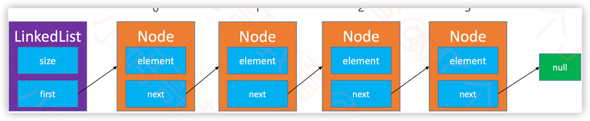
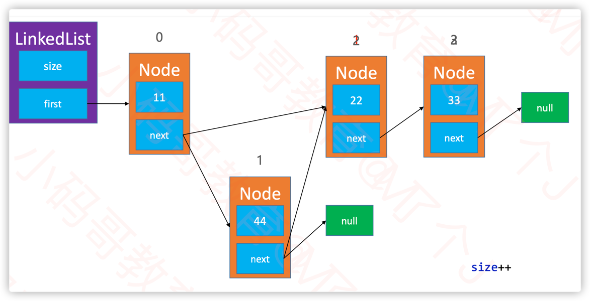
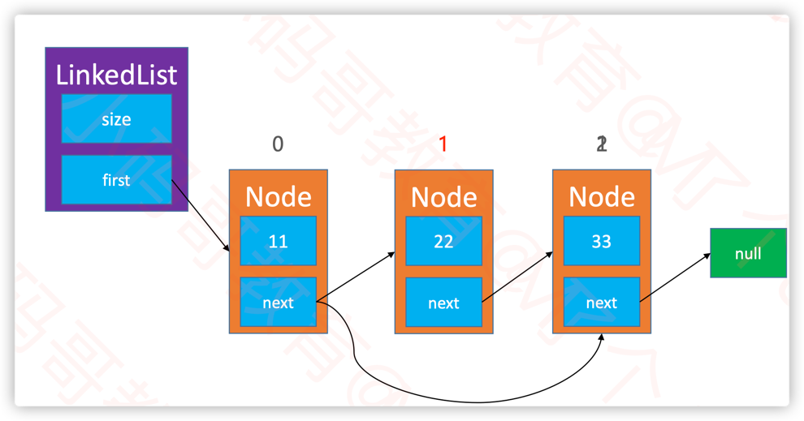
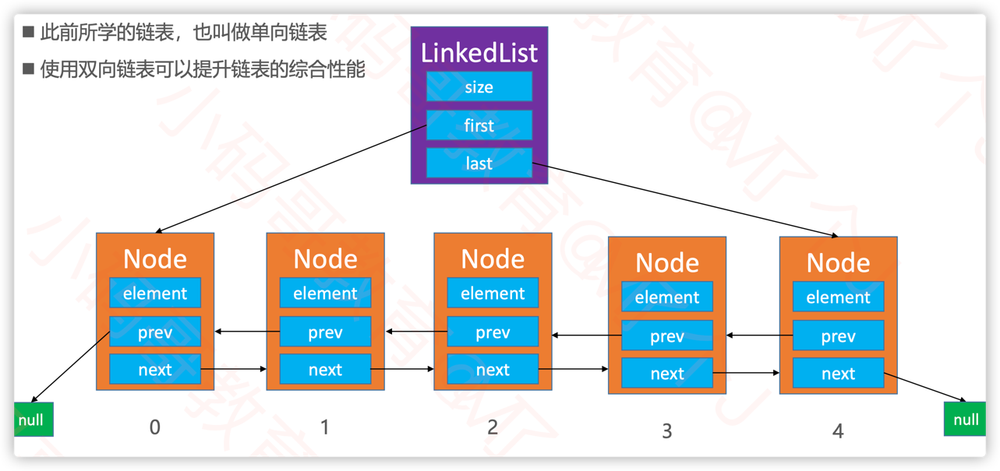
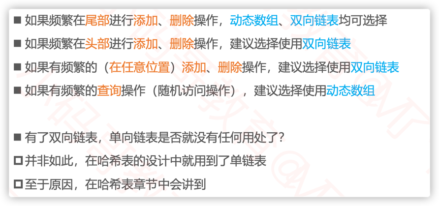
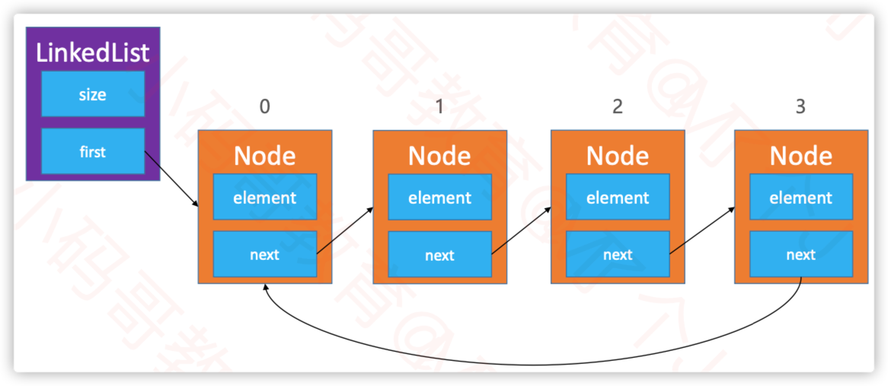
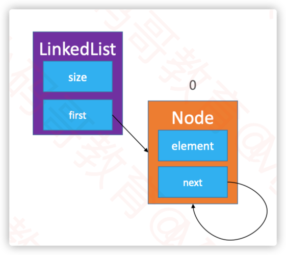
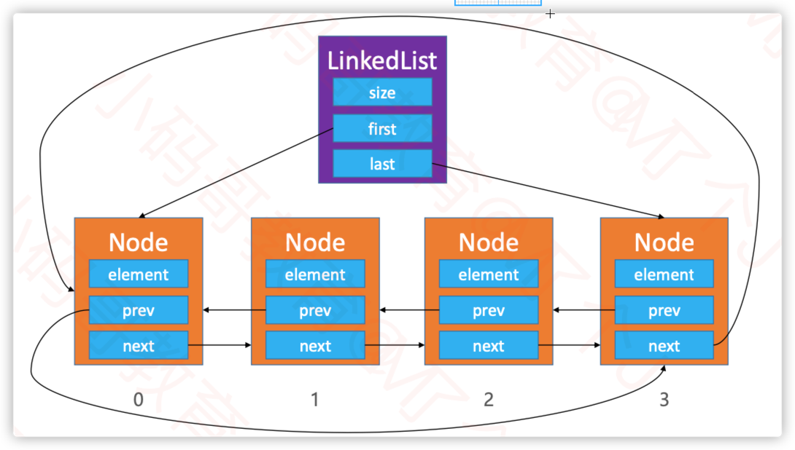

# 链表

## 链表的概念

动态数组有个明显的缺点： 可能会**造成内存空间的大量浪费**。
链表可解决这个问题，它能做到用多少就申请多少内存。

链表是一种链式存储的线性表，所有元素的内存地址不一定是连续的
- 链表的优点是插入和删除元素效率高，时间复杂度为O(1)。
- 缺点是不能通过下标快速访问元素，需要从头开始遍历，时间复杂度为O(n)。



## 1. 单向链表

### 1.1 链表添加元素



```java
public class LinkedList<E> extends AbstractList<E> {
    @Override
    public void add(int index, E element) {
        // TODO Auto-generated method stub
        rangeCheckForAdd(index);
        if (0 == index) {
            head = new Node<>(element, head);
        } else {
            Node<E> prev = getNode(index - 1);
            prev.next = new Node<>(element, prev.next);
        }
        size++;
    }
}
```

### 1.2 链表删除元素



```java
public class LinkedList<E> extends AbstractList<E> {
    @Override
    public E remove(int index) {
        // TODO Auto-generated method stub
        rangeCheck(index);
        Node<E> old = head;
        if(0 == index) {
            head = head.next;
        }else {
            Node<E> prev = getNode(index - 1);
            old = prev.next;
            prev.next = old.next;
        }
        size--;
        return old.element;
    }

}
```

### 1.3 链表清空元素


```java
public class LinkedList<E> extends AbstractList<E> {
    @Override
    public void clear() {
        // TODO Auto-generated method stub
        size = 0;
        head = null;
    }
}
```

## 2. 双向链表

### 2.1 双向链表的结构



### 2.2 node的index方法

```java
public class DoubleLinkedList<E> extends AbstractList<E> {
    private DoubleLinkedList.Node<E> getNode(int index) {
        this.rangeCheck(index);

        DoubleLinkedList.Node<E> node = this.head;
        int i;
        // 如果index 大于一半，从后往前找
        if (index > (this.size >> 1)) {
            node = this.tail;
            for(i = this.size - 1; i > index; --i) {
                node = node.prev;
            }
        } else {
            for(i = 0; i < index; ++i) {
                node = node.next;
            }
        }
        return node;
    }
}
```
### 2.3 双向链表添加元素

```java
public class DoubleLinkedList<E> extends AbstractList<E> {
    public void add(int index, E element) {
        this.rangeCheckForAdd(index);
        Node oldTail;
        if (this.size == index) {
            oldTail = this.tail;
            this.tail = new Node(this.tail, element, null);
            if (oldTail == null) {
                this.head = this.tail;
            } else {
                oldTail.next = this.tail;
            }
        } else {
            oldTail = this.getNode(index);
            Node<E> prev = oldTail.prev;
            Node<E> newnode = new Node(prev, element, oldTail);
            oldTail.prev = newnode;
            if (prev == null) {
                this.head = newnode;
            } else {
                prev.next = newnode;
            }
        }
        ++this.size;
    }
}
```

### 2.4 双向链表删除元素

```java
public class DoubleLinkedList<E> extends AbstractList<E> {
    public E remove(int index) {
        this.rangeCheck(index);
        DoubleLinkedList.Node<E> node = this.getNode(index);
        DoubleLinkedList.Node<E> prev = node.prev;
        DoubleLinkedList.Node<E> next = node.next;
        if (prev == null) {
            this.head = next;
        } else {
            prev.next = next;
        }

        if (next == null) {
            this.tail = prev;
        } else {
            next.prev = prev;
        }

        --this.size;
        return node.element;
    }
}
```

## 3. 动态数组 VS 单向链表 VS 循环链表

- 动态数组
  - 开辟销毁内存空间的次数相对较少，
  - 但可能会造成内存空间浪费（可通过缩容解决）
- 单向链表
- 双向链表
    - 开辟销毁内存空间的次数相对较多
    - 但不会造成内存空间浪费



## 4. 单向循环链表
### 4.1 单向循环链表的结构





### 4.2 单向循环链表添加元素

```java
public class SingleCircleLinkedList<E> extends AbstractList<E> {
  public void add(int index, E element) {
    // TODO Auto-generated method stub
    rangeCheckForAdd(index);

    if (0 == index) {
//	  head = new Node<>(element, head); //getNode里面需要使用ｈｅａｄ，因此不可以提前将ｈｅａｄ改变
      Node<E> newhead = new Node<>(element, head);
      Node<E> tail = (0 == size) ? newhead : getNode(size - 1);
      tail.next = newhead;
      head = newhead;
    } else {
      Node<E> prev = getNode(index - 1);
      prev.next = new Node<>(element, prev.next);
    }
    size++;
  }
}
```

### 4.3 单向循环链表删除元素

```java
public class SingleCircleLinkedList<E> extends AbstractList<E> {
  @Override
  public E remove(int index) {
    // TODO Auto-generated method stub
    rangeCheck(index);
    Node<E> old = head;

    if (0 == index) {
      if (1 == size) {
        head = null;
      } else {
        Node<E> tail = getNode(size - 1);
        head = head.next;
        tail.next = head;
      }
    } else {
      Node<E> prev = getNode(index - 1);
      old = prev.next;
      prev.next = old.next;
    }
    size--;
    return old.element;
  }
}
```

### 4.4 单向循环链表获取元素

```java
public class SingleCircleLinkedList<E> extends AbstractList<E> {
  @Override
  public int indexOf(E element) {
    Node<E> node = head;
    if (null == element) {
      for (int i = 0; i < size; i++) {
        if (null == node.element) return i;
        node = node.next;
      }
    } else {
      for (int i = 0; i < size; i++) {
        if (element == node.element) return i;
        node = node.next;
      }
    }
    return ELEMENT_NOT_FOUND;
  }
}
```

## 5. 双向循环链表
### 5.1 双向循环链表的结构




### 5.2 双向循环链表添加元素

```java
public class DoubleCircleLinkedList<E> extends AbstractList<E> {
        @Override
        public void add(int index, E element) {
          // TODO Auto-generated method stub
          rangeCheckForAdd(index);

          if(size == index) {//往尾部插入节点
            Node<E> oldTail = tail;
            tail = new Node<>(tail, element, head);
            if(null == oldTail) { //size == 0
              head = tail;
              head.prev = tail;
              head.next = tail;
            }else {
              oldTail.next = tail;
              head.prev = tail;
            }
          }else {
            Node<E> next =getNode(index);
            Node<E> prev = next.prev;

            Node<E> newnode = new Node<>(prev,element, next);
            next.prev = newnode;
            prev.next = newnode;

            if(next == head) {//头部插入节点
              head = newnode;
            }

//			if(tail == prev) {//index == 0
//				head = newnode;
//				tail.prev = head;
//			}else {
//				prev.next = newnode;
//				next.prev = newnode;
//			}
          }
          size++;
        }
}
```

### 5.3 双向循环链表删除元素

```java
public class DoubleCircleLinkedList<E> extends AbstractList<E> {
  private E remove(Node<E> node) {
    if(1 == size) {
      head = null;
      tail = null;
    }else {
      Node<E> prev = node.prev;
      Node<E> next = node.next;
      prev.next = next;
      next.prev = prev;

      if(prev == tail) //删除头节点
        head = next;
      if(next == head) //删除尾节点
        tail = prev;
    }
    size--;
    return node.element;
  }
}
```

### 5.4 双向循环链表获取元素

```java
public class DoubleCircleLinkedList<E> extends AbstractList<E> {
  @Override
  public int intdexOf(E element) {
    Node<E> node = head;
    if (null == element) {
      for (int i = 0; i < size; i++) {
        if(null == node.element) return i;
        node = node.next;
      }
    } else {
      for (int i = 0; i < size; i++) {
        if(element == node.element) return i;
        node = node.next;
      }
    }
    return ELEMENT_NOT_FOUND;
  }
}
```


