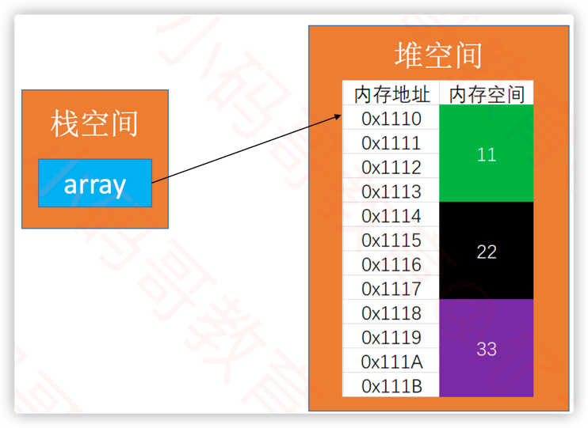

# 动态数组

## 动态数组的概念
数组是一种顺序存储的线性表，所有元素的内存地址是连续的。数组的优点是可以通过下标快速访问元素，缺点是插入和删除元素效率低，时间复杂度为O(n)。

数组还有一个致命的缺陷：**数组的大小是固定的**，一旦声明就无法更改。
- 如果初始化时声明的数组过大，会浪费内存空间；
- 如果声明的数组过小，后续需要扩容，会增加程序的复杂度。



动态数组其实就是能动态扩容的数组：如ArrayList

## 动态数组的接口

```java
public interface List<E> {
    int ELEMENT_NOT_FOUND = -1;
    void clear();
    int size();
    boolean isEmpty();
    boolean contains(E var1);
    void add(E var1);
    void add(int var1, E var2);
    E getElement(int var1);
    E setElement(int var1, E var2);
    E remove(int var1);
    int intdexOf(E var1);
}
```
## 动态数组的实现
### 构造函数
```java
public class ArrayList<E> extends AbstractList<E> {
    private E[] elements;
    private static final int DEFAULT_CAPACITY = 10;
    private static final int ELEMENT_NOT_FOUND = -1;

    public ArrayList(int capacity) {
        capacity = capacity < 10 ? 10 : capacity;
        this.elements = new Object[capacity];
    }

    public ArrayList() {
        this(10);
    }
}
```

### 添加


注意： index 为0， size-0， size等场景下的测试

```java
public class ArrayList<E> implements List<E> {
    public void add(int index, E element) {
        this.rangeCheckForAdd(index);
        this.ensureCapacity(this.size + 1);

        for (int i = this.size - 1; i >= index; --i) {
            this.elements[i + 1] = this.elements[i];
        }

        this.elements[index] = element;
        ++this.size;
    }
    
    private void ensureCapacity(int capacity) {
        int oldCapacity = this.elements.length;
        if (oldCapacity <= capacity) {
            capacity = oldCapacity + (oldCapacity >> 1);
            Object[] newElements = new Object[capacity];
            System.arraycopy(this.elements, 0, newElements, 0, oldCapacity);
            this.elements = newElements;
            System.out.println( oldCapacity + "扩容为" + capacity);
        }
    }
}
```

### 删除

```java

public class ArrayList<E> implements List<E> {
    public E remove(int index) {
        this.rangeCheck(index);
        E old = this.elements[index];

        for (int i = index + 1; i < this.size - 1; ++i) {
            this.elements[i - 1] = this.elements[i];
        }

        this.elements[--this.size] = null;
        this.trim();
        return old;
    }

    private void trim() {
        int oldCapacity = this.elements.length;
        if (this.size < oldCapacity >> 1 && oldCapacity >= 10) {
            int newCapacity = oldCapacity >> 1;
            Object[] newElements = new Object[newCapacity];
            System.arraycopy(this.elements, 0, newElements, 0, this.size - 1);
            this.elements = newElements;
            System.out.println(oldCapacity + "缩容为" + newCapacity);
        }
    }
}
```

### 查询
```java
public class ArrayList<E> implements List<E> {
    public int intdexOf(E element) {
        int i;
        if (element == null) { // 注意对null的处理
            for (i = 0; i < this.size - 1; ++i) {
                if (this.elements[i] == null) {
                    return i;
                }
            }
        } else {
            for (i = 0; i < this.size - 1; ++i) {
                if (element.equals(this.elements[i])) {
                    return i;
                }
            }
        }

        return -1;
    }
}
```
## 清空

```java
public class ArrayList<E> implements List<E> {
    public void clear() {
        for (int i = 0; i < this.size; ++i) {
            this.elements[i] = null;
        }

        this.size = 0;
        if (this.elements != null && this.elements.length > 10) {
            this.elements = new Object[10];
        }

    }
}
```