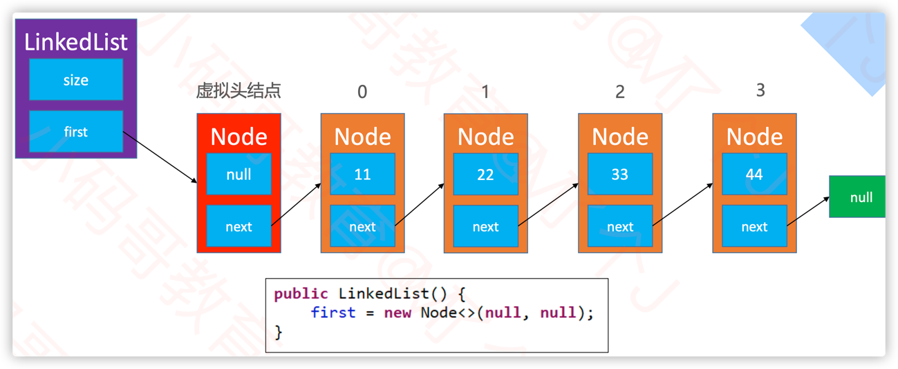

# 链表相关题目

## 0. 注意虚拟头节点的使用
有时候为了方便，会在链表的头部添加一个虚拟头节点，这样就不用考虑头节点的特殊情况了。
代码也会更加精简，统一所有节点的处理逻辑，提高代码的可读性。



```java
public class LinkList<E> {
    private Node<E> dummyHead = new Node<>(null, null);

    public Node<E> getNode( int index) {
        rangeCheck(index);
        
        Node<E> cur = dummyHead.next;
        for (int i = 0; i < index; i++) {
            cur = cur.next;
        }
        return cur;
    }

    public void add(int index, E element) {
        rangeCheckForAdd(index);
        Node<E> prev = index == 0 ? dummyHead : getNode(index - 1);
        prev.next = new Node<>(element, prev.next);
        size++;
    }

    public void remove(int index) {
        rangeCheckForAdd(index);
        Node<E> prev = index == 0 ? dummyHead : getNode(index - 1);
        Node<E> old = prev.next;
        prev.next = old.next;

        size--;
        return old.element;
    }
}
```

## 1. 删除链表中的节点

## 2. 反转链表

```java
public class _206_ReverseLinkedList {
	public static ListNode reverseLinkedList1(ListNode head) {
		if(null == head || null == head.next) return head;
		ListNode newHead = null;
		while(null != newHead) {
			ListNode tmp = head.next;
			head.next = newHead;
			newHead = head;
			head = tmp;
		}
		return newHead;
	}
	public static ListNode reverseLinkedList(ListNode head) {
		if(null == head || null == head.next) return head;
		
		ListNode newHead = reverseLinkedList(head.next);
		
		head.next.next = head;
		head.next = null;
		return newHead;
		
	}
	public static void main(String[] args) {
		
	}
}
```

## 2. K个一组反转链表
```java
public class _25_ReverseKGroup {
    public static ListNode reverseKGroup(ListNode head, int k) {
        if (null == head || null == head.next) return head;
        ListNode tail = head;

        for (int i = 0; i < k; i++) {
            if (null == tail) return head;
            tail = tail.next;
        }
        //反转前k个元素
        ListNode newHead = reverse(head, tail);

        head.next = reverseKGroup(tail, k);
        return newHead;
    }

    private static ListNode reverse(ListNode head, ListNode tail) {
        ListNode prev = null;
        ListNode next = null;
        while (head != tail) {
            next = head.next;
            head.next = prev;
            prev = head;
            head = next;
        }
        return prev;
    }

    public static ListNode reverseKGroup1(ListNode head, int k) {
        if (null == head || null == head.next) return head;

        int len = 1;
        ListNode node = head;
        while ((node = node.next) != null) {
            len++;
        }
        int numOfK = len / k;
        ListNode prev = null;
        ListNode cur = head;
        ListNode next = head.next;
        for (int index = 0; index < numOfK; index++) {
            if (null == prev)
                prev = cur;

            for (int i = 0; i < k - 1; i++) {
                ListNode tmp = next.next;
                next.next = cur;
                cur = next;
            }

            prev.next = next;

            if (0 == index)
                head = cur;
        }

        return head;
    }
}

```


## 3. 判断一个链表是否有环

### 3.1 利用快慢指针
```java
public class Solution {
    public boolean hasCycle(ListNode head) {
        if (null == head || null == head.next) return false;
        try {
            ListNode slow = head;
            ListNode fast = head.next;
            while (!slow.equals(fast)) {
                slow = slow.next;
                fast = fast.next.next;
            }
            return true;
        } catch (Exception e) {
            // TODO: handle exception
            return false;
        }
    }

    public boolean hasCycle1(ListNode head) {
        if(null == head || null == head.next) return false;
        ListNode slow = head;
        ListNode fast = head.next;
        while(null != fast && null != fast.next) {
            if(fast == slow) return true;
            slow = slow.next;
            fast = fast.next.next;
        }
        return false;
    }
}
```

### 3.2 利用set
```java
public class Solution {
    public boolean hashSolution(ListNode head) {
        Set<ListNode> set = new LinkedHashSet<>();
        while (head != null) {
            if (set.contains(head)) {
                return true;
            }
            set.add(head);
            head = head.next;
        }
        return false;
    }
}
```

## 4. 约瑟夫问题

```java
public class _0_josph {
	public static void main(String[] args) {
		DoubleCircleLinkedList<Integer> list = new DoubleCircleLinkedList<>();
		for (int i = 1; i < 9; i++) {
			list.add(i);

		}
		System.out.println(list.toString());
		list.reset();
		while(!list.isEmpty()) {
			list.next();
			list.next();
			System.out.println(list.remove());
		}
	}
}
```

## 5. 移除链表元素

## 6. 删除排序链表中的重复元素

## 7. 链表的中间节点


