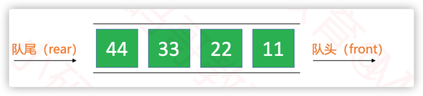
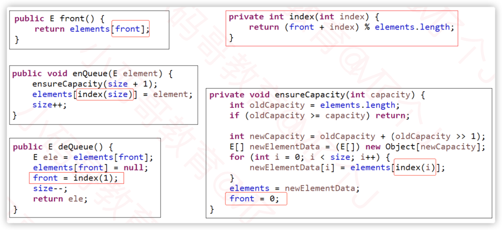
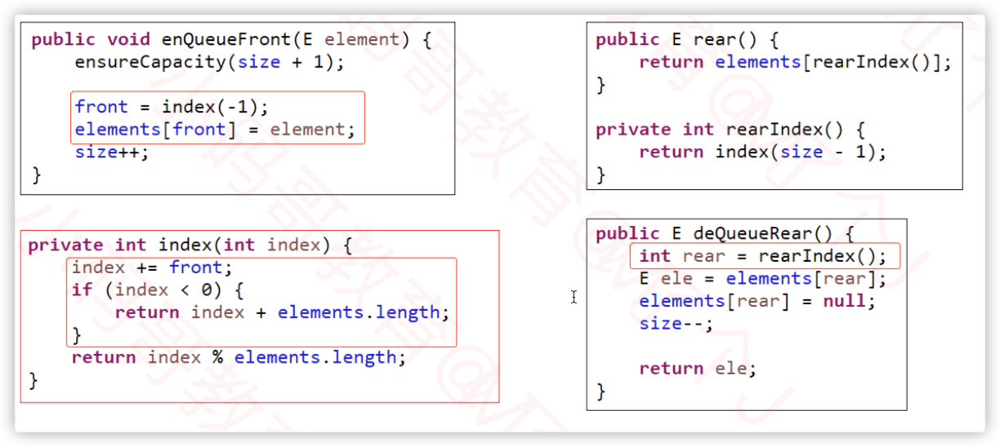

# 队列

## 1. 队列的概念

队列是一种特殊的线性表，只能在头尾两端操作
- 队头：允许删除的一端， 一般做<font color="red">dequeue，出队</font>
- 队尾：允许插入的一端， 一般做<font color="red">enqueue，入队</font>
- 先进先出的原则，First In First Out，FIFO



## 2. 队列的接口设计

````java
public class Queue<E> {
	private DoubleLinkedList<E> list = new DoubleLinkedList<>();
	
	public int size() {
		return list.size();
	}
	
	public boolean isEmpty() {
		return list.isEmpty();
	}
	
	public void offer(E element) {
		 list.add(element);
	}
	
	public E poll() {
		return list.remove(0);
	}
	
	public E peek() {
		return list.getElement(0);
	}
	
	public E head() {
		return list.getElement(0);
	}
	
	public void clear() {
		list.clear();
	}
}

````
## 3. 双端队列Dequeue

双端队列： 能够在头尾两端都是 添加， 删除的队列

内部实现：双向链表， 主要在头尾操作

```java
public class Deque<E> {
	private DoubleLinkedList<E> list = new DoubleLinkedList<>();
	
	public int size() {
		return list.size();
	}
	
	public boolean isEmpty() {
		return list.isEmpty();
	}
	
	public void offer(E element) {//加入队尾 offerLast
		 list.add(element);
	}
	
	public void offerFirst(E element) {
		 list.add(0, element);
	}

	
	public E poll() { //队头
		return list.remove(0);
	}
	
	public E pollLast() {
		return list.remove(list.size() - 1);
	}
	
	public E peek() { //队头
		return list.getElement(0);
	}
	
	public E peekLast() {
		return list.getElement(list.size() - 1);
	}
	
	public E head() {
		return list.getElement(0);
	}
	
	public E tail() {
		return list.getElement(list.size() - 1);
	}
	
	public void clear() {
		list.clear();
	}
}

```

## 4. 循环队列

循环队列： 可以在两端添加。删除操作的队列
- 顺序队列的一种改进， 解决顺序队列的假溢出问题
- 其实队列底层也可使用动态数组实现， 但是动态数组的扩容和缩容操作比较耗时， 所以一般使用静态数组实现

```java
public class CircleQueue<E> {
    private int head;// 表示地一个元素的index
    private int size;
    private E[] elements;

    private static final int DEFAULT_CAPACITY = 10;


    public CircleQueue() {
        elements = (E[]) new Object[DEFAULT_CAPACITY];
    }
}
```



## 5. 双端循环队列
循环双端队列： 可以在两端添加。删除操作的队列

```java
public class CircleDeque<E> {
    private int head;// 表示地一个元素的index
    private int size;
    private E[] elements;

    private static final int DEFAULT_CAPACITY = 10;


    public CircleDeque() {
        elements = (E[]) new Object[DEFAULT_CAPACITY];
    }
}
```



