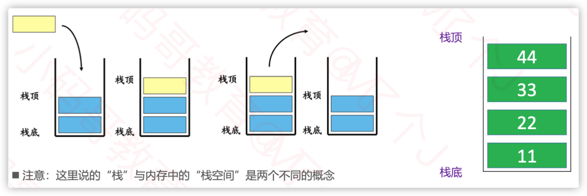

# 栈
## 1. 栈的概念

栈是一种遵从<font color="red">后进先出（LIFO）</font>原则的有序集合。新添加的或待删除的元素都保存在栈的同一端，称作栈顶，另一端就叫栈底。
在栈里，新元素都靠近栈顶，旧元素都接近栈底。只能在栈的一端操作
- 入栈(push)：将元素压入栈中，栈顶元素变为新元素
- 出栈(pop)：将栈顶元素弹出栈外，栈顶元素变为原栈顶元素的下一个元素



## 2. 栈的接口设计

利用DoubleLinkedList实现栈的接口设计

```java
public class Stack<E> {
	private List<E> list = new DoubleLinkedList<>();
	
	public int size() {
		return list.size();
	}
	
	public boolean isEmpty() {
		return list.isEmpty();
	}
	
	public void push(E element) {
		list.add(element);
	}
	
	public E pop() {
		return list.remove(list.size() - 1);
	}
	
	public E peek() {
		return list.getElement(list.size() - 1);
	}
}
```
