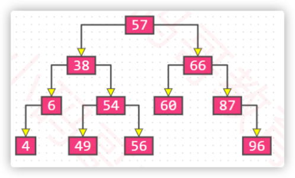
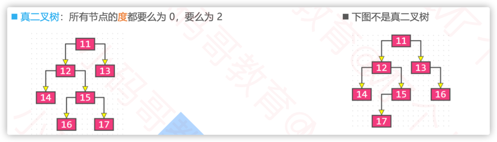

# Tree

## 1. 树的基本概念

- 空树
  - 没有任何节点的树
- 节点的度
  - 子树的个数
- 树的度
  - 树中节点的最大的度数
- 叶子节点
    - 度为0的节点
- 非叶子节点
    - 度不为0的节点
- 树的层数
  - 根节点在第一层，根节点的子节点在第二层，以此类推
- 节点的深度
  - 从根节点到该节点所经历的边的个数
- 节点的高度
  - 从该节点到最远叶子节点所经历的边的个数
- 树的深度
  - 树中所有节点的最大深度
- 树的高度
  - 树中所有节点的最大高度
- 树的深度 == 树的高度

- 有序树
  - 树中任意节点的子节点之间有顺序关系
- 无序树
  - 树中任意节点的子节点之间没有顺序关系
- 森林
  - 由m（m>=0）棵互不相交的树的集合称为森林

## 2. 二叉树

### 2.1 二叉树的特点

- 二叉树的特点
  - 每个节点的度最大为2（最多有两个子树）
  - 左，右子树是有顺序的，次序不能任意颠倒
  - 即使树中某节点只有一棵子树，也要区分左右子树
  - 有序树

### 2.2 二叉树的性质

- 性质1：在非空二叉树上，在二叉树的第i层上至多有2^(i-1)个节点（i>=1）
- 性质2：深度(高度）为k的二叉树至多有2^k-1个节点（k>=1）
- 性质3：对于任意一棵二叉树，如果其叶子节点数为N0，度为2的节点数为N2，则N0=N2+1
  - 性质3的证明
    - 总节点数 = N0 + N1 + N2
    - 总边数 = N1 + 2N2
    - 总边数 = 总节点数 - 1
    - N1 + 2N2 = N0 + N1 + N2 - 1
    - N0 = N2 + 1

### 2.3 真二叉树

- 每个节点的度要么为0，要么为2

