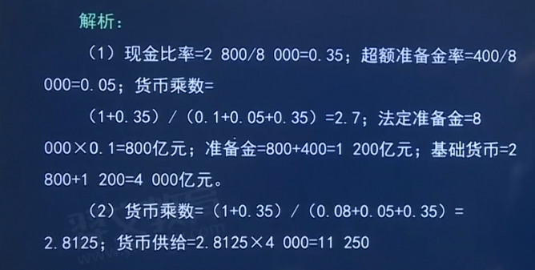

# 2.中国的金融体系与多层次资本市场
## 第一节 中国的金融体系
### 1.1 发展历史与现状
1. 新中国成立以来我国金融市场的发展历史（了解）
    1. 1949~1978年：计划经济时期“大一统”的金融体系
        1. “大”是指中国人民银行分支机构覆盖全国；
        2. “一”是指中国人民银行是该时期唯一的银行，它集**中央银行和商业银行**双重职能于一身，集**现金中心、结算中心和信贷中心**于一体；
        3. “统”是指全国实行“统存统贷”的信贷资金管理体制
    2. 1979~1983年：多元混合型金融体系
        1. 中国人民银行仍然身兼二职，既承担中央银行职能，又办理信贷储蓄业务，
        2. 没有真正成为**专门的金融管理机构**，使当时的金融体系出现了“群龙无首”的局面。
    3. 1984~1993年：以**中央银行**为中心，国**家专业银行**为主体，多**种金融机构分工协作**的金融体系逐步形成
    4. 1994~2003年：逐步改革和完善的市场化金融体系，改革的具体措施包括：
        1. 第一，相继成立了国家开发银行、中国进出口银行、中国农业发展银行三家政策性银行，专门承担政策性金融业务，实现了**政策性金融和商业性金融**相分离。
        2. 第二，对国有专业银行实行商业化改造。
        3. 第三，中国人民银行分支机构的改革。
        4. 第四，成立资产管理公司。
        5. 第五，银行业与信托业、证券业分离。
    5. 2004-2011年：多种所有制和多种经营形式、结构合理、功能完善、高效安全的现代金融体系。
        1. 2003年4月，中国**银行业监督管理委员**会成立，标志着我 国“分业经营、分业监管”的金融体系得以确立。
    6. 2012年至今：基**本金融制度逐步健全、对外开放程度不断提高**的现代金融体系
        1. 新中国成立70年来，一是基本建成了**与中国特色社会主义相适应的现代金融市场**体系；
        2. 二是基本建成了以**服务实体经济**为目标、**便民利民**的金融服务体系；
        3. 三是基本建立了有**效维护金融稳定**的金融监管体系；
        4. 四是基本形成了一套有效的**金融调控体系**；
        5. 五是基本确立了面向全球、平等竞争的**对外开放体系**。

2. 货币市场
    1. 我国货币市场建设始于**1984年银行间同业拆借市场**的建立，
    2. 目前已经形成包括银行间同业拆借市场、短期债券市场、债券回购市场和票据贴现市场在内的统一的货币市场格局。
    3. 中国人民银行于**2007年**开始试运行上**海银行间同业拆借利率(SHIBOR)**。目前，SHIBOR已经成为认可度高、应用广泛的货币市场基准利率之一。
    4. 货币市场已经成为**中央银行执行货币政策**的重要载体，也是各类金融机构**调节资金头寸、管理流动性和进行资产投资**的主要场所
3. 债券市场
    1. 我国债券交易市场分为场外市场和场内市场。
        1. 场外市场包括银行间市场和银行柜台市场，
            1. 行间市场的市场参与者**限定为机构**，属于场外**债券批发市场；**
            2. 银行柜台市场参与者**限定为个人**，属于场外债券**零售市场**。
        2. 场内市场包括上海证券交易所和深圳证券交易所
    2. 债券市场监管
        1. 银行间市场由中央国债登记公司
        2. 国债柜台市场实行二级托管制度，一级托管在中央国债登记结算公司，二级托管在商业银行。
        3. 上海证券交易所由中国证券登记结算公司上海分公司负责托管和结算
        4. 深圳证券交易所对应于中国证券登记结算公司深圳分公司负责托管和结算
    3. 我国债券市场发行债券包括利率债和信用债。
        1. ①利率债，
            1. 是指直接以**政府信用为基础或是以政府提供偿债支持**为基础而发行的债券。
            2. 由于有政府信用背书，正常情况下利率债的信用风险很小，影响其内在价值的因素主要**是市场利率或资金的机会成**本。
            3. 广义的利率债除了国债、地方政府债，还可包括
                1. **中央银行发行的票据**、
                2. **国家开发银行等政策性银行发行的金融债**，
                3. **铁路总公司等政府支持机构发行的债券**
        2. ②信用债，
            1. 是指**以企业的商业信用**为基础而发行的债券，**中期票据、短期融资券、企业债、公司债**四个主要品种构成我国信用债市场主体。
            2. 近年来，我国债券市场运行特点包括：
                1. 第一，**大力发行疫情防控债券**，为助力疫情防控提供专业高效的技术保障和支持服务，发挥了稳定经济的关键作用。
                2. 第二，**债券市场产品创新提速**，包括金融债券持续创新、企业债券积极创新，债券市场价格产品进一步丰富
                3. 第三，**债券市场制度建设持续推进**，包括推进信用债券注册制改革，健全债券违约处置机制，统一信用债信息披露制度
                4. 第四，**债券市场对外开放全面推进**，包括境外机构政策不断优化，国际债券市场参与度持续提高，境内外机构保持交流

4. 股票市场
    1. 我国多层次股票市场体系初步形成。
    2. 我国股票市场分为场内市场和场外市场，
        1. 场内市场
            1. 沪深主板市场、科创板市场、创业板市场、
            2. 北京证券交易所和全国中小企业股份转让系统（新三板），
        2. 场外市场
            1. 区域性股权交易市场
            2. 交易柜台市场。

5. 外汇市场
    1. 人民币外汇市场当前包括**在岸(CNY)与离岸(CNH)**市场。
    2. 目前，银行间外汇市场交易方式分为竞价和询价两种，**询价交易**占主导地位。
    3. 随着我国外汇管理体制改革和汇率形成机制的完善，初步形成了
        1. **外汇零售和银行间批发市场**相结合，
        2. **竞价和询价交易方式**相补充，
        3. 覆盖即期、远期和掉期等类型外汇交易工具的市场体系。
    4. 银行间外汇市场已经成为初步**具备价格发现、管理风险和配置资源功能的**场所，市场化程度大为提高。

6. 黄金市场
    1. 中国黄金市场目前初步形成了以**上海黄金交易所黄金现货**为主体，
       **上海期货交易所黄金期货、商业银行柜台黄金产品**共同组成的，**层次分明且各有侧重**的多元市场体系
    2. 我国黄金市场具有四大特点：
        1. 一是市场架构比较完整。
        2. 二是参与主体类型多样。 商业银行、产用金企业、期货、证券、信托和各类专业投资公司等
           是两大场内市场的参与主体，另外还包括会员代理客户、提供客户服务的中间商以及支持类机构等。

7. 商品期货市场
    1. 目前，我国共有四大商品期货交易所
        1. **上海**期货交易所（简称“上期所”）、
        2. **大连**商品交易所（简称“大商所”）
        3. **郑州**商品交易所（简称“郑商所”)
        4. **广州**期货交易所

8. 金融衍生品市场
    1. 历史
        1. **_2006年9月，中国金融期货交易所_**正式成立，成为我国**首家**金融衍生品交易所。
        2. **2010年4月16日，中国金融期货交易所推出沪深300股指期货合约**，标志着我国金融衍生品市场**进入稳步发展**阶段。
        3. 中国金融期货交易所目前已经上市交易**沪深300、上证50、中证500股指期货**，2年期、5年期、10年期国债期货6个金融期货品种
        4. **2015年2月9日**，我国首个场内金融期权一**上证50ETF期权**，在上海证券交易所正式上市交易。
    2. 我国金融衍生品市场按资产类别划分主要包括
        1. 利率类衍生品、
            1. 包括场内国债期货和场外利率远期、利率互换产品。
        2. 权益类衍生品、
            1. 股票期权、股指期货和认股权证。
        3. 货币类衍生品、
            1. 包含人民币外汇期权和期权组合、外汇远期、外汇掉期和货币掉期
        4. 信用类衍生品。
            1. 包含信用风险缓释合约、信用风险缓释凭证、信用违约互换以及信用联结票据。

### 1.1 影响我国金融市场运行的主要因素
影响我国金融市场运行的因素来自诸多方面，可以将之大体归纳为
经济因素、法律因素、市场因素、技术因素、心理因素、体制或管理因素以及其他因素七个方面。

#### 1.1.1 经济因素
经济因索是影响我国金融市场运行的**最重要因索**。 
经济因素既包括**经济增长和经济周期波动**这种纯粹的经济因素，也包括政府**宏观经济政策及特定的财政金融行为**等混合因素，还包括**国际经济环境因素**。

1. (1)宏观经济运行对金融市场的影响。 
   1. ***宏观经济因素是影响金融市场长期走势的最重要因素**，其他因素可以暂时改变金融市场的中期和短期走势，但改变不了金融市场的长期走势。 
   2. 影响金融市场运行的主要宏观经济变量包括以下四个： 
      1. ①国内生产总值。 国内生产总值(GDP)是衡量一国经济状况的最佳指标。 
         1. GDP增速加快，表明经济处于扩张阶段，经济增长强劲，实际发布的GDP增长率通常会左右金融市场的走势。
      2. ②经济周期。金融市场运行受到经济所处不同周期的影响，
         1. 金融市场随着经济周期的复苏、繁荣、衰退、萧条等不同阶段呈现出**_同期甚至超前的变化_**，
            金融市场是经济周期的直接构成者和最为敏感的反射物。 
         2. 经济周期的长度和波动也反映了**经济的稳定性**，实体经济稳定性增强带来企业盈利的稳定性，
            继而带来金融市场的低波动性，改变不同类别资产的风险溢价。
      3. ③通货膨胀与利率。 
         1. 一般而言，低于预期的通货膨胀会降低利率，促进债券和股票价格的上升；
         2. 高于预期的通货膨胀会提高利率，从而导致债券和股票价格下降
         3. **利率**对金融市场的影响是**系统性、全局性**的。 
            1. 利率下降时，企业利息负担降低，利润增加，反映在金融市场上就是既增加了金融资产的基础价值，
               也大大提高了投资者的获利预期，从而提高金融资产价格。
            2. 但过低的利率也会导致过度信贷杠杆，大幅推高资产价格，给金融市场造成冲击。
      4. ④汇率和国际资本流动。 
         1. 第一，国际资本从发达国家流向新兴市场国家，有利于新兴市场国家经济发展和金融市场发展。 
         2. 第二，国际资本流动造成了外汇市场和汇率的波动。
         3. 第三，国际资本流动造成借贷市场和利率的波动。国际资本流入将导致银行贷款增加和货币供给量增加，继而导致利率下降。
         4. 第四，当国际资本以证券投资形式流入国内，会刺激对国内证券的需求，引起证券价格上升；反之，若国际资本以卖出
            证券的形式流出，会引起证券价格下降。
2. (2)宏观经济政策。影响金融市场的宏观经济政策主要包括**货币政策、财政政策、收入政策。**
   1. ①货币政策。 
      1. 货币政策对金融市场有着**_直接的、主要的_**影响。 
      2. 货币政策主要通过**货币供给量、利率和信贷政策**机制发生作用。
      3. 货币供给量增加，会增加生产性投资、消费，也会使投资者对金融资产的需求增加。
         准备金和利率的变化会影响商业银行的信贷扩张，从而影响银行的盈利水平和整个金融市场的流动性。
         中央银行在债券市场上进行公开市场操作，会直接影响债券的供求状况。
         从信贷政策来看，如果允许商业银行向资本市场放贷，而且约束条件宽松的话，就容易引发资本市场的过度投机，形成
         泡沫甚至影响金融体系稳定。
   2. ②财政政策。 财政政策主要通过**税收政策**、**公共支出政策**以及**国债发行** 等发挥作用
      1. 从**税收政策**来看，给企业减税将会降低企业的成本，增加企业利润，提高金融市场上投资者的盈利预期，
         引起资产价格上升。如果降低金融市场的交易税，则会降低投资者交易成本,从而增加投资收益，提高市场流动性和交易量。
      2. 从**公共支出政策**来看，政府增加公共开支，社会总需求扩大，金融市场上的投资者对企业盈利预期提高，就会引起资产价格上升；
         反之，资产价格则会下降。
      3. **国债发行**对金融市场的影响比较复杂，一方面它会刺激经济增长，有利于金融市场活跃
         另一方面发行国债会锁定金融 市场流动性，且伴随着国债利率上升，将对整个货币市场进而对金融市场产生重大影响。
   3. ③收入政策。 
      1. 与财政政策、货币政策相比， 收入政策**具有更高层次的调节功能**，
      2. 它制约着财政政策和货币政策的作用方向和作用力度 而且**收入政策最终也要通过财政政策和货币政策来实现**。
         收入政策目标包括**收入总量目标**和**收入结构目标**
3. (3)国际经济环境因素。
    1. ①经济全球化。
    2. ②放松管制和加强管制两种经济哲学的交替。
    3. ③世界货币制度的影响。
       20世纪70年代以后，各国普遍实行了浮动汇率制度。**浮动汇率制度**增加了汇率风险，金融业与从事国际经营的企业为了
       回避汇率风险，必须借助外汇市场进行套期保值。同时，**汇率的波动也带来了投机的机会**，促进了投机交易与资本流动。

#### 1.1.2 法律因素
- 完备的金融法律和高效的执法效率是金融市场平稳运行的根本保障

#### 1.1.3 市场因素

金融市场自身的**内部条件**也是影响其发展的重要因素，包括国内和国际统一的市场组织、**丰富的市场交易品种**、市场的**交易机制**或**市场模式**等因素。
1. (1)国内和国际统一的市场组织
2. (2)丰富的市场交易品种。
3. (3)市场交易机制或市场模式。（重要）
   1. 这主要是指交易得以实现的市场架构、规则和制度，如市场的参与者、交易场所的形式和市场交易规则等，
     其核心是**价格发现机制或者价格形成机制。**
   2. 健全的价格形成机制主要体现在两个方面：
      1. 一是**合理**的定价机制，包括交易定价的制度安排，如询价、议价、竞价机制等；
      2. 二是**灵活**的价格机制，即价格能够**及时、真实地反映供求关系**，从而能够调节资金供求双方的行为，提高金融资源的配置效率。

#### 1.1.4 技术因素

科技发展对金融市场运行有重大意义。
以信息技术为例，
1. 第一，信息技术有力地刺激了金融创新； 
2. 第二，信息技术使信息披露更加及时，增强了金融机构的透明性，改变了金融监管的方式；
3. 第三，信息技术的广泛应用促使全球统金融市场的形成，国际金融与国内金融的界限日益模糊。

#### 1.1.5 技术因素
1. 心理因素
   1. 市场参与者的心理和行为可以加剧金融风险。 
      1. 在通常情况下，投资者对股票、大宗商品未来价格既有看多的，又有看空的，总体的平衡表现为资产价格波动幅度较小。 
      2. 当遇到突发事件时，投资者的心理预期可能发生巨大变化，甚至出现“**羊群行为”**，即广大投资者的预期和行动完全一致
         助长了金融资产价格的暴涨和暴跌。
2. 体制或管理因素
   1. 政府对金融市场**干预过多**会造成金融抑制和经济落后的恶性循环，包括政府实施使利率、汇率等金融价格发生扭曲的体
      制性或政策性措施。 
   2. 然而，政府对金融市场的**适当干预**仍是必要的，完全的金融自由化或金融自由化速度过快也会出现弊大于利的结果。

3. 文化 人口等其他因素

### 1.2 中国的金融中介机构体系

目前，中国已经基本形成了由**中央银行调控和监督**、**国家银行为主体**、**政策性金融与商业性金融相分离**，**多种金融机构
分工合作、功能互补**的**现代化金融中介机构体**系，并建立了与之相适应的金融监管体系。

#### 1.2.1 金融中介机构体系 --了解

1. 金融中介机构的定义 ---金融中介机构有狭义和广义之分 
   1. **狭义**的金融中介机构一般指**商业银行**。 
   2. **广义**的金融中介机构除**商业银行**以外，还有许多**非银行金融机构**。，
     它们从事综合的或专门的金融业务和金融服务，形成**相互联系、互相影响**的统一整体，构成金融中介机构体系。
      
2. 金融中介机构的分类 
   1. 按业务特征及货币创造、交换媒介和支付手段的能力划分，可划分为
      1. 银行金融中介机构
      2. 非银行金融中介机构。 
   2. 按照是**否承担国家政策性金融业务**，可划分为
      1.**商业性**金融机构
      2. **政策性**金融机构。 
   3. 按所**从事业务的性质及其在金融活动中所起的作用**，可分为
      1. **融资类**金融中介机构、
      2. **投资类**金融中介机构、
      3. **保障类**金融中介机构和
      4. **服务类**金融中介机构。

3. 我国的金融中介机构体系 目前，我国已经形成了多层次的金融中介机构体系，拥有
   1. 以中央银行为主导、国有商业银行为主体，包括股份制商业银行、城市商业银行、农村商业银行、跨国银行、农村信用社在内的**多层次**银行机构体系；
   2. 拥有以证券公司、期货公司和证券投资基金管理公司为主，以各类投资咨询中介、信托机构为辅的**多元化投资中介体系**；
   3. 拥有人寿保险公司、财产保险公司、再保险公司以及提供多种多样保险服务的**保险中介体系**。

#### 1.2.2 主要金融中介机构的业务 --掌握

1. 商业银行的业务: **负债业务，资产业务，表外业务**
   1. 负债业务
      1. 负债业务是商业银行组织资金来源的业务活动，是商业银行资产业务和其他业务营运的起点和基础。 
      2. 商业银行的负债**包括**
         1. 自有资金--商业银行的自有资金是**银行股东**为赚取利润而**投入银行的货币和保留在银行中的收益**，代表着对银行的**所有权**
            1. 股本金---是银行**成立时发行股票所筹集**的股份资本
            2. 储备资金--也是公积金，主要是从经营的税后利润提成而形成的，用于**弥补经营亏损的准备金**
            3. 未分配利润---经营利润**尚未**按财务制度规定进行提取公积金和向投资者分利处置的部分。
         2. 外来资金，外来资金的**形成渠道**包括
            2. 存款负债---**最重要**的业务，是资金的**主要来源**
            3. 非存款负债---向央行借款、同业借款、回购协议（向其他金融机构借款）以及国外市场借款等
   2. 资产业务---**多选**
      1. 概念：资产业务是指商业银行**运用资金**的业务，
         也就是商业银行将其吸收的资金贷放或投资出去赚取收益的活动。 
      2. 商业银行的资产业务主要包括
         1. 现金资产--那些与现金等同，可随时用于支付的银行资产
            1. **库存现金**、交存中央银行的**存款准备金**、存放同**业存款**和**托收中的现金**
         2. 贷款业务---是银行将其所吸收的资金，按一定利率贷给客户并约定归还期限的业务。
         3. 票据贴现--票据持有人以**未到期票据**向商业银行兑取现金，
             商业银行从票据中扣除**自贴现日起到票据到期日**的利息，将余额支付给持票人的**资金融通行为**。
         4. 投资业务等---商业银行以其资金在金融市场上买卖各种证券资产的业务活动。

   3. 表外业务
      1. 根据2017年原中国银监会发布的《商业银行表外业务风险管理指引》，
         表外业务是指**商业银行从事的，按照现行的会计准则****不计入资产负债表内，不形成现实资产负债，
         但能够引起当期损益变动**的业务，包括**担保类**、**部分承诺类**两种类型业务 
      2. 广义的表外业务泛指所有能给银行带来收入而又不在资产负债表中反映的业务。
         根据这一定义，商业银行的**中间业务**也属于表外业务。
      3. 狭义的表外业务，则仅指**涉及承诺和或有债权**的活动。商业银行的表外业务主要分为
         担保承诺类代理投融资服务类、中介服务类、其他类等。 
         1. ①**担保承诺类**业务包括**担保类、承诺类等按照约定承担偿还责任**的业务。
            1. 担保类业务是指商业银行对第三方承担偿还责任的业务，包括但不限于**银行承兑汇票、保函、信用证**、信用风险仍在银行的销售与购买协议等。 
            2. 承诺类业务是指商业银行在未来某一日期按照事先约定的条件向客户提供约定的信用业务，**包括但不限于贷款承诺**等。
         2. ②代理投融资服务类业务
            1. 指商业银行根据客户委托，为客户**提供投融资服务但不承担代偿责任、不承诺投资回报**的表外业务，
            2. 包括但不限于委托贷款、委托投资、代客非保本理财、代客交易、代理发行和承销债券等。
         3. ③中介服务类业务
            1. 指商业银行根据客户委托，提供中介服务、收取手续费的 业务，
            2. 包括但不限于代理收付、财务顾问、资产托管、各类保管业务等。
         4. ④其他类是指上述业务种类之外的其他表外业务。
      4. 银行的**中间业务**及其与**表外业务**的关系。
         1. 根据2001年中国人民银行颁布的《商业银行中间业务暂行规定》，中间业务是指**不构成商业银行表内资产、表内负债，形成银行非利息收入**的业务。
         2. 它主要包括两大类：
            1. 形成或有资产、或有负债的中间业务(即一般意义上的金融服务类业务)，
            2. 以及不形成或有资产、或有负债的中间业务（即一般意义上的表外业务）。
         3. 目前通行的是认为**中间业务是包括表外业务的**。表外业务更强调其业务的风险特征。

2. 证券公司的业务 
   1. 一方面，证券公司是证券市场投融资服务的提供者，为证券发行人和投资者提供专业化的***中介服务*：
   2. 另一方面，证券公司本身也是证券市场**重要的机构投资者**。
   3. 
   4. 证券公司的主要业务包括
      1. 证券经纪业务，
      2. 证券投资咨询业务，
      3. 与证券交易、证券投资活动有关的财务顾问业务，
      4. 证券承销与保荐业务，
      5. 证券自营业务，
      6. 证券资产管理业务，
      7. 融资融券业务，
      8. 证券公司中间介绍业务，
      9. 私募投资基金业务
      10. 另类投资业务等。

3. 保险公司的业务 、
   1. 013年原中国保监会颁布的《保险公司业务范围分级管理办法》中，根据保险业务属性和风险特征，保险公司业务范围
      分为**基础类业务**和**扩展类业务**两类。
   2. 财产保险公司业务
      1. 基础类业务：机动车保险、企业/家庭财产保险及工程保险、责任保险、船舶/货运保险、短期健康/意外伤害保险
      2. 扩展类业务：**农业保险、特殊风险保险（航空航天保险、海洋开发保险等）、信用保证保险、投资型保险**
   3. 人身保险公司业务
      1. 基础类业务：普通类保险（人寿保险和年金保险）、健康保险、意外伤害保险、分红型保险、万能型保险
      2. 扩展类业务：投资连结型保险、变额年金

#### 1.2.3 我国金融业主要行业的基本情况（ --了解

1. 我国银行业的基本情况
   1. (1)**大型商业银行**在资产规模、资金来源和网点布局上占据**主导**地位，业务遍布全国主要城市及大部分县域地区，网点众多且分散，各项业务均衡发展。
   2. (2)**股份制商业银行**主要业务集中在全国大中型城市及 少数县域地区。
   3. (3)**城市商业银行**通常在特定的区域从事商业银行业务，依靠地缘优势、当地经济发展水平，重点针对当地企业和居民的需求提供金融产品和服务。
2. 我国证券业的基本情况
   1. 大型证券公司凭借网点分布、客户资源、 资本实力等方面的竞争实力，与其他竞争对手逐渐拉开差距，形成较强的相对
      竞争优势，行业集中度整体保持在较高水平。
3. 我国保险业的基本情况
   1. 截至2021年底，我国共有各类保险机构235家。其中，保险集团公司14家，财产险公司88家，人身险公司90家，
     保险资产管理公司28家，再保险公司13家。
4. 我国信托业的基本情况
   1. 2018年4月，中国人民银行等四部委联合发布《关于规范金融机构资产管理业务的指导意见》（以下简称《资管新规》）。
      《资管新规》中**打破刚兑、限制嵌套、提高合格投资者门槛**等诸多规定都将对信托行业产生影响。  

#### 1.2.4  我国金融市场的监管体制（ --熟悉

1. 金融监管体制的演变
   1. 中国当前的金融监管体制已经从“一行三会”过渡到了 “委一行两会”，
      1. 即**国务院金融稳定发展委员会**、**中国人民银行**、中国**证券监督管理**委员会以及中国**银行保险监督管理**委员会。 
   2. 这是在经济发展过程中遂步演化改革的结果，大致可分为五个阶段。
      1. 第一阶段为1992年以前的中国人民银行**集中统一监管阶段**。 
         1. 1978年，中国人民银行总行从财政部独立划出，恢复了国家银行的地位。
         2. 1984年，中国人民银行开始专门行使中央银行职能，负责对银行业、证券业、保险业、信托业实行集中统一监管。
      2. 第二阶段为1992年到1997年，这一阶段**为分业监管起步**阶段。 
         1. 1992年**国务院证券委员会**和中国**证券监督管理委员会**成立，将证券业的监管职能从人民银行分离出来，
             这标志着我国分业监管体系的开始。 
         2. 国务院证券委员会负责指导、监督和归口管理中国证监会。 
         3. 1995年《中华人民共和国中国人民银行法》颁布实施，**首次**从法律上确立了中国人民银行作为中央银行的地位。
      3. 第三阶段为1998年到2008年，该阶段“一行三会”**体制成型**，分业监管体制不断**专业化、精细化**。
         1. 1998年4月中国证监会与国务院证券委员会合并为正部级国务院直属事业单位，对国内**证券期货市场**实行**集中统一**监管。
         2. 1998年中国保险监督管理委员会成立，分业监管体制进步完成。
         3. 2003年4月，随着**中国银行业监督委员会**的成立，我国金融监管实现了货币政策与银行监管职能相分离，
            标志着我国“一行三会”分业监管的金融监管体制**正式确立。**
      4. 第四阶段为2009年到2016年，金融监管体制开始了金融监管的协调性和有效性的杨步改革
      5. 第五阶段为2017年以来，金融监管体制进入“一委一行两会”的新阶段。
         1. 2017年7月第五次全国金融工作会议提出设立**国务院金融稳定发展委员会**，
           强化人民银行宏观审慎管理和系统性风险防范职责，切实落实部门监管职责，标志着此前的“机构监管” 将朝着“功能监管、行为监管”方向改革。
         2. 2018年3月17日，第十三届全国人民代表大会第一次会议通过《关于国务院机构改革方案的决定》，批准《国务院机构改革方案》，
           决定组建**中国银行保险监督管理委员**会。将原中国银监会和原中国保监会拟订银行业、保险业重要法律法规草案
            和审慎监管基本制度的职责重新划入中国人民银行，**使监管部门专注于监管执行，提高监管的专业性有效性**，**审慎监管和行为监管的分工**更加明确：
            1. 中国人民银行承担与金融稳定密切相关的宏观审慎管理职能，更好地发挥统筹构建审慎监管体系、有效防范风险的职能；
            2. 中国银保监会作为微观审慎监管和行为监管主体，监督金融机构行为稳健、合规经营的职责更为明确。
         3. **2019年2月2日**，中央机构编制委员会办公室发布了《中国人民银行职能配置、内设机构和人员编制规定》，中国人民银
            行内部新设立宏观审慎管理局，标志着央行**货币政策和宏观审慎政策**双支柱调控框架正式确立。

2. 国务院金融发展委员会职责（17年设立）（以下简称“金融委”)
   1. 定位是“作为国务院统**筹协调金融稳定和改革发展**重大问题的议事协调机构”，办事机构是国务院金融稳定发展委员会办公室设在中国人民银行，承担金融委日常工作 
   2. 金融委的主要职责：
      1. 一是落实党中央、国务院关于金融工作的决策部署
      2. 二是**审议金融业改革发展重大规划**；
      3. 三是**统筹金融改革发展与监管**，协调货币政策与金融监管相关事项，统筹协调金融监管重大事项，协调金融政策与相关财政政策、产业政策等；
      4. 四是分析研判国际国内金融形势，做好国际金融风险应对研究系统性金融风险防范处置和维护金融稳定重大政策；
      5. 五是指导地方金融改革发展与监管，对金融管理部门和地方政府进行业务监督和履职问责等。

3. 中国人民银行的职责 
   1. 中国人民银行是我国的中央银行，也是国务院组成部门之一，主要负责**制定和执行货币政策，维护金融稳定**，同时承担一定的金融服务职能。 
   2. 根据2019年2月2日中央机构编制委员会办公室发布的《中国人民银行职能配置、内设机构和人员编制规定》，中国人民银行的主要职责包括：
      1. (1)拟订金融业改革、开放和发展规划，承担综合研究并协调解决金融运行中的重大问题、促进金融业协调健康发展的责任。
      2. (2)牵头建**立宏观审慎管理框架**，拟订金融业重大法律法规和其他有关法律法规草案，制定审慎监管基本制度，建立健全金融消费者保护基本制度。
      3. (3)监督管理银行间债券市场、货币市场、外汇市场、票据市场、黄金市场及与上述市场有关的场外衍生产品；
      4. (4)牵头负责重要金融基础设施建设规划并统筹实施监管，推进金融基础设施改革与互联互通，统筹互联网金融监管工作。
         承担全国反洗钱和反恐怖融资工作的组织协调和监督管理责任，负责涉嫌洗钱及恐怖活动的资金监测。

4. 中国银行保险监督管理委员会的职责
   1. **2018年3月17日**十三届全国人大一次会议通过的《国务院机构改革方案》规定，将原中国银行业监督管理委员会和原中国保险监督管理委员会的职责整合，
      组建中国银行保险监督管理委员会，作为国务院直属事业单位。 
   2. 根**据2018年11月13日**国务院办公厅印发的《中国银行保险监督管理委员会职能配置、内设机构和人员编制规定》，中国银保监会的主要职责是：
      1. (1)依法依规对全国**银行业和保险业**实行统一监督管理，维护银行业和保险业合法、稳健运行，对派出机构实行**垂直领导。**
      2. (2)对银行业和保险业改革开放和监管有效性开展系统性研究。
         **参与拟订**金融业改革发展战略规划，**参与起草**银行业和保险业重要法律法规草案以及审慎监管和金融消费者保护基本制度。
      3. (3)依法依规对银行业和保险业机构及其业务范围实行**准入管理**，审查高级管理人员任职资格。

5. 中国证券监督管理委员会的职责 
   1. 中国证券监督管理委员会作为国务院负责证券期货业监督管理的正部级事业单位，根据法律、法规和国务院授权，对全国证券、期货市场实行集中统一监督管理。 
   2. 根据1998年9月28日国务院办公厅印发的《中国证券监督管理委员会职能配置、内设机构和人员编制规定》，中国证监会的主要职责是：
      1. 研究和拟定证券期货市场的**方针政策、发展规划**；起草证券期货市场的有关法律法规；制定证券期货市场的有关规章、规则和办法。
         **垂直领导**全国证券监管机构，对证券期货市场实行集中统一监管。
      2. 监管股票、可转换债券、证券公司债券和国务院确定由中国证监会负责的债券和其他证券的**发行、上市、交易、托管和结算**；
         监管证券投资基金活动；批准企业债券的上市；监管上市国债和企业债券的交易活动。

#### 1.2.5  金融服务实体经济高质量发展的要求 ==了解

1. 有关金融与实体经济关系的理论与国际经验
   1. (1)古典经济学提出**货币中性论**，认为货币供应量的变化只影响名义变量而不影响实际变量
   2. (2)20世纪30年代，凯恩斯指出，**未来的不确定性**是货币经济的主要特征，通过利率对投资的诱导作用，货币就能影响实体经济产出。 
   3. 20世纪90年代，伯南克和格特勒，金融加速器理论，认为金融市场上资金借贷双方之间的信息不对称导致了摩擦，
      放大了对实体经济影响（不但影响，而且加速影响）
   4. 2008金融危机，金融活动本身**也是**（不是就是）经济衰竭和萧条的重要诱因
   
2. 金融危机的教训与宏观审慎监管的兴起 
   1. 首先，实体经济发展水平和质量从根本上决定着金融发展水平和质量，实体经济发展不好，风险最终会集中反映在金融体系中。 
   2. 其次，金融的健康发展可以促进经济增长，但如果金融部门存在缺陷，金融发展严重脱离实体经济，则会加大经济运行风险，甚至会以爆发金融危机的形式重创实体经济。 
   3. 最后，随着金融创新和金融脱媒迅速发展，金融市场结构和产品日益复杂，金融与实体经济相互渗透，二者的界限开始变得模糊。
      
综上所述，为保证经济的平稳运行和可持续发展，一方面要不断提高金融市场发展的活力和动力，
另一方面也要避免金融脱离实体经济的过快发展带来过高风险，冲击实体经济。 

世界各国央行意识到传统微观审慎监管无法解决系统性金融风险，于是**宏观审慎监管**受到了高度关注。
宏观审慎监管的研究主要是从资本充足率的逆周期调整方面进行展开，在信贷周期、金融“加速器”的研究框架下进行的。

3. 增强金融服务实体经济能力的障碍与挑战（五大挑战）
   1. 第一，中国金融体系虽已初具现代格局，但是，引导市场得以有效配置资源的基准价格体系—**利率**、收益率曲线和汇率等一**尚未完全市场化**。 
   2. 第二，中国金融体系是以银行业主导的间接融资为主，导致**风险过度集中在银行**，企业融资渠道与方式相对单一。
      银行信贷的特征是抵押为主的融资模式，它难以为新经济 提供融资。此外，银行业是典型的**顺周期行业**，当经济处于增长周期时，银行信贷会放大经济增长，当经济下行时，银行也会放大收缩态势。
   3. 第三，**刚性兑付**是金融市场很多深层次问题的根源。国有企业与地方政府融资平台等预算软约束部门在一定程度上都受政府隐性担保，使得金融机构对其债务有刚性兑付预期。
   4. 第四，金融监管与行业发展的关系始终**没有得到理顺，**监管政策始终倾向于本行业的发展。
      由此，针对信贷规模管制金融创新和影子银行迅猛发展，银行与非银机构通过同业业务、理财等各种嵌套，加剧了流动性风险。 
   5. 第五，资本市场的**投融资关系始终没有得到理顺**
      一直以来，**“重融资，轻投资”**的定位限制了资本市场基本功能的发挥，造成市场规则和机制设计倾斜于融资者利益，不利于保护投资者利益。
       资本市场的其他基本功能，例如价值发现、风险定价、优化资源配置等，都被大大弱化了。

4. 经济高质量发展阶段如何增强金融服务实体经济的能力 
   1. 第一，守住不发生系统性金融风险的底线，管控好宏观层面的金融高杠杆率和流动性风险、微观层面的金融机构信用风险以及跨市场、跨业态、跨区域的影子银行和违法犯罪风险。
   2. 第二，健全多层次资本市场体系，补齐各类金融市场的短板。 
   3. 第三，深化金融监管体制改革，加强监管协同，补齐监管空白。 
   4. 第四，发挥信贷政策的结构引导作用，把资金用到支持实体经济特别是中小微企业上。

#### 1.2.6  金融安全与稳定  ==了解

1. 防范化解重大金融风险阶段性成果
   1. (1)宏观杠杆率持续过快上升势头得到有效遏制
   2. (2)各类高风险机构得到有序处置。
   3. (3)影子银行风险持续收敛。
2018年以来，相关部门陆续出台资管新规及配套实施细则，统一资管业务监管标准，实施资管产品统计制度， 
加强**穿透式监管和功能监管**，推动资管业务回归“卖者尽责、买者自负”本源。
   4. (4)重点领域信用风险得到稳妥化解。
   5. (5)近年来，我国金融秩序得到全面清理整顿，金融市场运行平稳有序，防范金融风险制度建设有力推进，金融业对外开放水平也稳步提高，金融服务实体经济的效能显著提升。

2. 坚持“市场化、法治化”原则处置金融风险

### 1.3 中央银行与货币政策

#### 1.3.1  中央银行的主要职能和业务 ==掌握

1. 中央银行的主要职能 
   1. 中国人民银行是我国的中央银行，它的主要职能是
      1. 在国务院领导下，制定和执行货币政策， 
      2. 防范和化解金融风险，维护金融稳定。
      3. 中国人民银行实行**行长负责制**，设立货币政策委员会，具有咨询议事机构的职能。 
   2. 20世纪80年代以来，职能变化 
      1. 货币政策职能与金融监管相分离，突出货币政策调控职能
      2. 强调金融稳定职能，维护金融体系安全
   3. 现在的职能----党的十九大提出加强和改进中央银行宏观调控职能，**健全货币政策和宏观审慎**政策双支柱调控框架。
      1. 货币政策主要针对**整体经济和总量问题**，保持经济稳定增长和物价水平基本稳定。 
      2. 宏观审慎政策则直接和集中作用于金融体系，着力减缓因金融体系顺周期波动和跨市场风险传染所导致的系统性金融风险。 
   4. 一般来说，中央银行的主要职能可概括为
      1. “发行的银行” --垄断货币发行权，是唯一有权发行货币的机构
      2. 银行的银行” -- 
         1. 集中保管商业银行的存储准备金、
         2. 作为商业银行的最后贷款人、
         3. 组织商业银行间清算
      3. “政府的银行” -- 
         1. 代理国库收支、国际债券的发行；
         2. 对政府提供信贷（我国不允许）；
         3. 代表政府管理金融活动、参与国际金融活动；
         4. 持有、管理、经营国家外汇储备和黄金储备
         5. 代表政府参加国际金融组织活动，进行国际金融合作。

2. 中央银行的主要业务 --资产负债表（比商业银行少了表外业务）
   1. 负债业务
      1. ①储备货币  储备货币包括**货币发行和其他存款性公司存款**。 资产负债表上的货币发行包括两个部分，
         1. 一是流通中的现金，
         2. 二是商业银行的库存现金。 
         3. 中央银行的货币发行主要是通过商业银行的**现金收付业务**活动来实现的。
         4. 其他存款性公司存款主要是商业银行和政策性银行的存款准备金，包括**法定存款准备金和超额存款准备金**
      2. ②不计入储备货币的金融性公司存款。 
         1. 该项目包括证券公司等其他金融机构为**了满足支付清算需求在中央银行开立账户存入的款项**，以及财务公司、信托公司、金融租赁公司等非存款类金融机构的准备金存款。 
         2. 由于这类非存款类金融机构货币创造的能力较弱，故其缴纳的存款准备金不计入“储备货币”科目，而计入“不计入储备货币的金融性公司存款”这一科目中。
      3. ③发行债券。 
         1. 该项目主要是中央银行在**银行间市场**发行的、金融机构持有的未到期央行票据。 
      4. ④国外负债。 
         1. 国外央行或外国金融机构出于国际合作或者资金清算目的在中央银行存放的资金。
      5. ⑤政府存款。 
         1. 政府存款即国库存款，中央和地方财政的收支均由中央银行代理。那些依靠国家拨给行政经费的行政事业单位存款，如
            机关团体、部队、非银金融机构等也由中央银行办理。 
      6. ⑥自有资金。 中央银行的资本金，全部由国家出资。 
      7. ⑦其他负债。 
         1. 其他负债主要包括**正回购余额、微调工具和外汇形式缴存准备金**以及前述负债以外的负债。
   2. 资产业务
      1. ①国外资产
         1. **外汇项目**记载中央银行获得外汇资产的历史成本，即为了购买外币而投放的人民币。
         2. **货币黄金**是从国内或国际黄金市场购入的黄金，以人民币计算历史成本
         3. 国外资产是中央银行持有的国际货币基金组织头寸 特别提款权、其他多边合作银行的股权和其他存款性公司以及外汇
            缴存的人民币准备金等。
      2. ②对政府债权。
         1. 该科目是中央银行持有的政府发行的有价证券，主要是特别国债。
      3. ③对其他存款性公司债权。
         1. 该科目是对商业银行和政策性银行等存款性公司的再贷款余额、再贴现余额、常备贷款便利(SLF)、
            中期借贷便利(MLF)、抵押补充贷款(PSL)和逆回购余额。
      4. ④对其他金融性公司债权
         1. 该科目是对信托投资公司、保险公司、证券公司等机构发放的金融稳定再贷款，目的是保证金融体系的安全性和流动性。
      5. ⑤对非金融性部门债权。
         1. 这主要是历史形成的、为支持“老少边穷”地区的经济开发等所发放的贷款。
      6. ⑥其他资产 
         1. 其他资产是指中央银行其他业务形成的资产，包括国际金融组织资产、投资、在途资金占用、暂付款项、待清理资产、待处理损失以及前述资产以外的资产。

#### 1.3.2  存款准备金制度与货币乘数 ==掌握

1. 存款准备金制度
   1. 存款准备金制度，是指国家以法律形式规定存款性金融机构所吸收的存款必须按一定比例，向中央银行缴纳一定准备金的制度。 
   2. **法定存款准备金率**是以法律的形式确定的商业银行缴存中央银行的存款占其吸收存款的比例，它是中央银行**控制货币供应量**的最重要手段之一。
      1. 法定准备率越高，则银行吸收的存款用于贷款的数额就越少，货币供应量也会越少；反之，则越多**。超额准备金是**商业银行准备金中超过法定的部分。
      2.如果在法定准备金率100%的全额准备制度下，则根本排斥银行用所吸收的存款去发放贷款的可能性，银行就**没有创造信用**的可能。 
      2. 如果银行实行零准备金制度，则商业银行可以将存款以贷款的形式全额放出，这些贷款会重新回到商业银行成为存款，
         如此**不断循环，在理论上可以无限扩大货币供应量。**

2. 货币乘数 
   1. 中央银行发行的基础货币，包括社会流通中的现金和银行体系中作为准备金的存款。
   2. 商业银行可以根据基础货币，创造出数倍的货币供给额，其中，**基础货币和货币供给之间的倍数关系**，被称为货币乘数。
   3. 若法定准备金率为r，以m代表货币乘数，则简单货币乘数公式为：m=1/r 
   4. 理论上，货币乘数可以简单地表示为法定存款准备金率的倒数，调整法定存款准备金率会直接改变货币乘数。
   5. 现实中，上面的存款货币创造过程存在一系列漏出因素： 
      1. 首先，必然存在一部分存款**以现金的形式**被公众提取出来并持续地保留在公众手中，**提现率c**为客户提取的现金与活期 
      2. 其次，各个商业银行通常都持有一定的超额准备金，**超额准备金率**为超额准备金e与存款总额的比例。
      3. 这些漏出因素会使货币乘数减小，此时，完整的货币乘数公式为：
         **m=(c+1)/(c+r+e)**
      

#### 1.3.3  货币政策目标及工具🌟 ==掌握

1. 货币政策的概念
   1. 货币政策是中央银行利用**利率、汇率、借贷、货币发行、外汇管理及金融法规**等工具，
       采用的各种控制和调节货币供给量或信贷规模的方针、政策和措施 
   2. 完整的货币政策体系：货币政策**目标体系、工具体系、操作程序**
   3. 货币政策传递**传导机制**的一般过程
      1. 货币政策工具----》操作目标-----》中介目标-------》最终目标
2. 货币政策的目标
   1. 概念
      1. 货币政策的目标是指中央银行采取调节货币和信用的措施所要达到的目的。 
   2. 按照中央银行对货币政策的影响边、影响速度及施加影响的方式，货币政策目标可划分为三个层次，
      1. 最终目标：
         1. 是指货币政策在一段**较长的时期**内所要达到的目标，目标相对固定，基本上与一个国家的**宏观经济目标**相一致，
             因此最终目标也被称作货币政策的战略目标 或长期目标。
         2. 稳定物价、充分就业、经济增长、国际收支平衡、金融稳定
         3. 其中**稳定物价**是**首要目标**
         4. 货币政策要对最终目标发生作用只能借助于货币政策工具，通过对一系列中间变量的设定、调节和影响来间接作用于最终目标，从而实现最终目标。
      2. 中介目标
         1. 中介目标是货币政策作用过程中一个十分重要的**中间环节**，也是判断货币政策力度和效果的重要指示变量。 
         2. 货币政策中介目标的选取必须符合以下标准：**可测性、可控性、相关性、抗扰性和适应性**。
         3. 经常采用的货币政策中介目标有：**长期利率、银行信贷规模、货币供应量**
         4. 有关货币政策中介目标选择的争议主要围绕**利率和货币供应量**两个变量展开。
         5. 利率分析
            1. 优点是可控性强、可测性强、相关性强。货币当局能够通过利率影响投资和消费支出，从而调节总供求
            2. 缺点是抗干扰性较差，容易受心理预期、金融市场投机活动等各种非货币政策因素的影响，从而降低其真实性。
         6. 货币供应量分析
            1. 货币供应量曾经被许第国家货币当局选取为货币政策的中介目标，其**可测性、可控性和相关性**似乎都要比利率指标略胜一筹
            2. 但随着金融创新和金融管制的放松，货币供应量日益成为模糊的、难以控制的指标，难以清晰地界定M1、M2、M3不同层次货币的内涵，
               与实际经济变量之间的关系也变得不稳定和难以捉摸。在此背景下，多数发达市场经济国家**重新采纳利率**中介目标的货币政策框架。
      3. 操作目标
         1. 与中介目标又被称作远期目标相对应，货币政策操作目标有时也被称作近期目标。 
         2. 从货币政策作用的全过程看，操作目标距离中央银行的政策工具最近，是中央银行货币政策工具的直接调控对象，**可控性**极强。
         3. 操作目标的选择同样要符合**可测性、可控性、相关性、抗干扰性和适应性**等标准。
         4. 除此之外，很重要的一点是，**操作目标的选择在很大程度上还取决于中介目标的选择**。
            1. 如果以总量作为中介目标，则操作目标也应该选取总量指标；
            2. 如果以利率作为中介目标，则操作目标就应该以选择利率指标为宜。
         5. 经常被选作操作目标的主要有**短期货币市场利率、银行准备金及基础货币**等。
3. 货币政策工具
   1. 货币政策工具是中央银行在实施某种货币政策时所采取的**具体措施**或**具体的操作方式**。 
   2. 货币政策工具可分为**一般性货币政策工具、选择性货币政策工具及其他政策工具**，此外，我国近年来推出的**创新型货历政策工具**，我们也将单独进行介绍
   3. 一般性货币政策工具
      1. 一般性货币政策工具是指中央银行**普遍或常规运用**的货币政策工具，其实施**对象是整体经济和金融活动**，
      2. 三大法宝
         1. 存款准备金制度（威力最大
            1. 一般来说，存款准备金是一种威力强大的货市政策工具，即使**准备率调整幅度很小，也会引起货币供应量的巨大波动**，
               即使商业银行等金融机构由于种种原因持有超额准备金，法定存款准备金的调整也会产生效果。
            2. 其缺点是中央银行**难以确定**调整法定准备金率的时机和调整幅度，而频繁地调整法定准备金率也使商业银行难以进行适当的流动性管理。
         2. 再贴现政策
            1. 中央银行通过直接调整或制定对合格票据的**贴现利率**，来干预和影响市场利率，
               从而调节**货币供应量**的政策措施。
            2. 贴现利率实质上是中央银行向商业银行的**放款利率**
               1. 如果中央银行降低再贴现率，就意味着中央银行鼓励商业银行通过再贴现以扩张信贷规模，从而增加货币供给量；
               2. 反之，中央银行提高再贴现率，则货币供应量下降。
            3. 中央银行再贴现率的变动也会对**市场利率**产生直接影响，同时附带有“告示效果”，向银行和公众传递中央银行货币政策的信号和方向。
            4. 利用再贴现这一工具时，中央银行处于**被动**的地位，即再贴现政策的效果取决于商业银行或其他金融机构对该措施的反应。
         3. 公开市场业务
            1. 中央银行在证券市场上公开买卖各种有价证券以控制货币供给量及影响利率水平的行为。 
               1. 中央银行**卖出**有价证券，不仅会使货币供给量减少(回笼基础货币)，而且还会使证券价格下跌，市场利率上升，提高借入
                  资金的成本，减少社会投资，**抑制经济过热的势头**；
               2. 反之，如果中央银行**买入**证券，就会引起货币供给量增加（投放基础货币）信贷规模扩张，市场利率下降，**刺激消费和投资的扩张**。
            2. 中国人民银行公开市场业务债券交易主要包括**回购交易、现券交易和发行中央银行票据**。
               1. 回购交易分为正回购和逆回购两种。
                  1. 正回购为中国人民银行向一级交易商**卖出有价证券**，并约定在未来特定日期买回有价证券的交易行为，
                      正回购为央行从市场**收回流动性**的操作，正回购**到期**则为央行向市场**投放流动性**的操作。
                  2. 逆回购为央行向一级交易商**购买有价证券**，并约定在未来特定日期将有价证券卖给一级交易商的交易行为，
                     逆回购为央行向市场上投放流动性的操作，逆回购到期则为央行从市场收回流动性的操作。 
               2. 现券交易分为“现券买断”和“现券卖断”两种，
                  1. 现券买断央行直接从二级市场买入债券，**一次性地投放**基础货币；
                  2. 现券卖断为央行直接卖出持有债券，**一次性地回笼**基础货币。
               3. 中央银行票据即中国人民银行发行的短期债券，
                  1. 央行通过发行央行票据可以回笼基础货币，央行票据到期则体现为投放基础货币。 
            3. 公开市场操作的优点是
               1. **主动权完全在央行，**
               2. 可以进行**经常性、连续性**的操作，
               3. 可以较为准确地达到政策目标，且具有较强的**可逆转性。**
   4. 选择性货币政策工具
      1. 与一般性货币政策工具侧重于货币总量调节不同，选择性货币政策工具希望在不影响货币供应总量的情况下，
         对**某些具体用途**的信贷数量产生影响。
      2. 选择性货币政策工具的采用取决于特定的经济金融形势和条件，一般期限较短，居于**补充工具的地位**。 
      3. 【多选】选择性货币政策工具主要包括
         1. **消费者信用控制**
            1. 消费者信用控制，是指中央银行对不动产****以外的各种**耐用消费品**的**销售融资予**以控制。控制的内容主要包括： 
            2. ①规定以分期付款方式购买各种耐用消费品时**第一次付款的最低金额**； 
            3. ②规定分期付款的**最长期限**； 
            4. ③规定以分期付款等消费信贷方式购买**的耐用消费品的种类**，并就不同的耐用消费品规定相应的**信贷条件**。
         2. **证券市场信用控制**
            1. 证券市场信用控制，通常指对证券信用交易的法定保证金比率作出规定，是央行对以信用方式购买股票和债券所实施的一种控制措施
            2. 央行根据金融市场状况选择调高或调低保证金比率，就可以间接控制证券市场的信贷资金流入量，从而控制住最高放款额度。
         3. **不动产信用控制**
            1. 不动产信用控制，是指央行对商业银行及其他金融机构的房地产贷款所采取的限制措施。
            2. 不动产信用控制的**目的**在于控制不动产市场的信贷规模，**抑制过度投机，减少经济波动**。
         4. **直接信用控制**
            1. 是指央行以行政命令或其他方式，从总量和结构两个方面，直接对金融机构尤其是商业银行的信用活动进行控制，
               其手段包括利率**最高限额、信用分配、流动性比率、直接干预及开办特种存款**等。
         5. **间接信用控制**
            1. 其作用过程是间接的，要通过市场**供求关系或资产组合的调整途径**才能实现，
             通常采用的方式包括**道义劝告和窗口指导**等。
            2. 道义劝告是央行利用其地位和权威，向商业银行和其他金融机构发出书面通告或口头通知，主要是向商业银行通报经济形势，
               规劝其主动采取相应措施，配合中央银行货币政策的实施。
            3. 窗口指导是指央行根据产业行情、物价趋势和金融市场动向，规定商业银行每季度贷款的增减额，并要求其执行，
               属于**温和的、非强制性**的货币政策工具。
   5. 其他政策工具
   6. 创新型货历政策工具
      1. 创新型货币政策工具主要包括**短期流动性调节工具($L0）、常备借贷便利(SLF)、抵押补充贷款(PSL)
         中期借贷便利(MLF)、临时流动性便利(TLF)、临时准备金动用安排(CRA)以及定向中期借贷便利(TMLF**)等。

4. 货币市场传导机制
   1. 货币政策的传导机制的一般过程是：
      1. **货币政策红具--->操作目标---->中介且标---->最终目标**
      2. 也就是中央银行通过货币政策工具的运作，影响商业银行等金融机构的活动，进而影响货币供应量，最终影响宏观经济指标。
   2. 传导机制类型
      1. 利率传导机制
         1. 以利率为渠道是传统凯恩斯主义学派货币政策传导机制的核心观点。
         2. 在这一传导机制中，核心的变量为利率。
         3. 货币政策的作用过程，先是通过货币供应量的变动影响利率水平，再经过利率水平的变动改变投资活动水平，最后导致收入和产出水平的变动。
         4. 货币政策对收入水平影响的大小取决于：货币政策对货币供应量的影响，这取决于基础货币和货币乘数；
            利率对投资水平的影响；投资水平对收入的影响，这取决于投资乘数的大小。
         5. 货币供应量⬆️->实际利率（看作资金的价格，找银行贷款支付的利率变少）⬇️->投资⬆️->总产出⬆️
      2. 信用传导机制
         1. 伯南克提出了**银行借贷渠道和资产负债渠道**两种信用传导机制，并得出货币政策传递过程中即使利率没发生变化，也会
            通过信用途径来影响国民经济总量的结论。 
         2. ①银行信贷渠道。 无论是在以间接融资为主的金融体系还是在以直接融资为主的金融体系中，银行信贷都发挥着其他金融工具所不能比拟
            的重要作用。
            1.货币供应量⬆️->银行存款和贷款⬆️->投资⬆️->总产出⬆️ 
         3. ②资产负债渠道。
            1.企业资产负债表渠道的产生原因在于，金融市场信息不对称引起利率上升和实际经济下滑的货币紧缩政策会导致企业资产负债表的恶化，
            引起包括代理成本在内的企业融资成本的上升，造成企业投资减少
      3. 资产价格传导机制（货币供应量会影响资产价格）
         1. 货币学派的**托宾q理论与莫迪利安尼的生命周期理论**提出的传导机制中，货币政策通过其他相关的资产价格以及真实财
            富效应作用于整个经济。 
         2. **①托宾q理论**认为货币政策可以通过股票价值来影响经济活动，
            1. **q值定义为企业的布场价值与资本重置成本**之比。 
            2. 当货币当局实施**扩张性货币**政策时，当**q值大于1**时，企业的市场价值将会大于重置成本，此时企业很容易以相对较高的价格来发行较少的股票，并买到较多
               的新投资品，这会导致投资增加，最终会提高社会总需求和总产出。其传导机制可以表示为
            3. 货币供应量⬆️->股价⬆️->托宾q⬆️->投资⬆️->总产出⬆️
         3. **②财富效应**
            1. 莫迪利安尼认为，当扩张性货币政策引起股价上升时，家庭部门的金融资产价值将会上升，财务困境出现的可能性有所降低，
               这会刺激家庭部门购买耐用品和住宅，社会总需求和总产出随之增加。其传导机制可以表示为：
            2. 货币供应量⬆️->股价⬆️->金融资产价值（个人财富增值）⬆️->财务困难的可能性⬇️->耐用消费品和住宅支出⬆️->总产出⬆️
      4. 汇率传导机制
         1. 开放经济条件下，汇率是外汇资产的价格，同时也是**货币政策传导**的重要渠道之一。 
         2. 扩张性货币政策会引起实际利率水平下降，本币存款相对于外汇资产的预期收益率降低，
            资本总是从利率相对较低的国家流向利率相对较高的国家，这将导致本币贬值。
         3. 本币贬值会促进本国商品出口，抑制外国商品进口，从而使净出口增加，最终导致总需求和总产出增加。其传导机制可表示为：
         4. 货币供应量⬆️->实际利率⬇️->（资金贬值导致外逃）汇率⬇️->净出口⬆️->总产出⬆️

### 1.4  我国金融业对外开放的新趋势（了解）

#### 1.4.1 我国金融业进一步对外开放的背景
金融业对外开放不仅是我国加入WT0的承诺，还是我国实现高质量发展的内在要求，也是中国深度融入全球经济的必然选择。

#### 1.4.2 近年来金融业对外开放的主要政策措施

1. 央行推进金融业对外开放遵循的原则
   1. (1)准入前国民待遇和负面清单原则；
   2. (2)金融业对外开放将与汇率形成机制改革和资本项目可兑换进程相互配合，共同推进；
   3. (3)在开放的同时要重视防范金融风险，要使金融监管能力与金融开放度相匹配。
2. 2018年中国银保监会发布加快银行业和保险业对外开放举措
   1. (1)推动外资投资便利化；
   2. (2)放宽外资设立机构条件；
   3. (3)扩大外资机构业务范围；
   4. (4)优化外资机构监管规则。

#### 1.4.3 银行业对外开放的新实践
《中华人民共和国外资银行管理条例》的主要修改内容为：

1. 一是取消拟设外商独资银行的唯一或者控股股东、拟设中外合资银行的外方唯一或者主要股东、拟设分行的外国银行在
提出设立**申请前一年**年末总资产的条件，取消拟设中外合资银行的中方唯一或者主要股东应当为金融机构的条件。 
2. 二是规定外国银行可以在中国境内同时设立外商独资银行和外国银行分行，或者同时设立中外合资银行和外国银行分行。 
3. 三是放宽对外资银行业务的限制，允许其从事代理发行、代理兑付、承销政府债券以及代理收付款项业务，
将外国银行分行可以吸收中国境内公民定期存款的数额下限由每笔不少于100万元人民币改为每笔不少于50万元人民币，并取消对外资银行开办人民币业务的审批。 
4. 四是改进对外国银行分行的监管措施，放宽外国银行分行持有一定比例生息资产的要求，对资本充足率持续符合有关规定的外国银行在中国境内的分行，
放宽其人民币资金份额与其人民币风险资产的比例限制

#### 1.4.4 证券业对外开放的新实践
2018年4月28日，中国证监会正式发布《外商投资证券公司管理办法》。办法修订内容主要涉及五个方面：
1. 一是允许外资控股合资证券公司。 
2. 二是逐步放开合资证券公司业务范围。 
3. 三是统一外资持有上市和非上市两类证券公司股权的比例。 
4. 四是完善境外股东条件。 
   1. 境外股东须为金融机构，且具有良好的国际声誉和经营业绩，
   2. **近3年**业务**规模、收入、利润**居于国际前列，
   3. **近3年**长期**信用**均保持在高水平。 
5. 五是明确境内股东的实际控制人身份变更导致内资证券公司性质变更相关政策。

#### 1.4.5 保险业对外开放的新实践
**2018年博整亚洲论坛**明确了进一步加大保险业对外开放的具体措施和时间表，标志着 我国保险业即将迎来全面开放时代
1. 在几个月内落实将人身险公司的外资持股比例放宽至51%（三年后不再设限）、
2. 允许符合条件的外国投资者来华经营保险代理业务和保险公估业务、
3. 放开外资保险经纪公司业务范围与中资机构一致、
4. 取消外资保险公司设立条件中“必须在中国设立代表处连续2年”这一要求，

#### 1.4.6 资本市场对外开放的新实践
1. 一是资本市场互联互通机制逐步建立健全； 
2. 二是境外机构投资者持续增加对中国资本市场的配置； 
3. 三是以人民币计价的资产越来越多地被纳入国际指数； 
4. 四是不断放开征信、评级、支付等资本市场基础设施领域的准入限制； 
5. 五是期货对外开放品种增加，开放路径更加多元，境外投资者参与度稳步提升，我国重要大宗商品定价影响力得到提高。

## 第二节 中国的多层次资本市场

### 2.1 资本市场的相关概念
1. (一)资本市场概念的界定
资本市场是**长期金融市场或长期资金市场**，
是为**一年以上**资本性或准资本性融资产品提供发行和交易服务的有形或无形 的市场总和。
   1. 资本市场包括股票及衍生品市场、债券及衍生品市场、中长期资金借贷品市场；
   2. 广义的资本市场还包括为国民经济发展和企业经营运行发挥稳定作用的**期货市场**。

2. (二)资本市场的分层特性及其内在逻辑 
   1. 从投资者的角度来看 
      1. 由于每个投资者的风险偏好不同，对投资产品的投资期限、回报率以及产品本身的复杂程度要求不同，
        为了满足投资者对同投资品种的偏好，需要一个多层次的资本市场来容纳多样化的投资产品。 
   2. 从融资需求方的角度来看, 由于我国企业数量众多，
      1. 如按行业类型划分，可将企业分为传统型、创业型、高科技型等类型；
      2. 如按企业成长周期划分可将企业分为创立期、成长期、成熟期和衰退期。 
      3. 因此，不同企业类型在不同时期的融资需求各不相同，有效分层的资本市场可以为企业提供更加丰富多元的融资渠道。
   3. 资本市场分类

| 分类标准 | 分类 | 
| ------------ | --------- | 
| 按照所交易产品品种的不同     | 股票市场、债券市场、衍生品 证券市场和基金市场 | 
| 按照市场功能的不同          | 发行市场和交易市场 | 
| 按照资本市场的组织形式和交易活动是否集中统一     | 场内交易市场和场外交易市场 | 
| 按照所服务和覆盖的上市公司类型的不同     | 全球性市场、全国性市场、区域性市场 | 
| 按照发行和募集方式的不同     | 公募市场和私募市场 | 

4. 资本市场的多层次特性还体现在投资者结构、中介机构和监管体系的多层次，交易定价、交割清算方式的多样性， 
   它们与多层次市场共同构成了一个有机平衡的金融生态系统。

### 2.2 多层次资本市场的主要内容

我国逐渐建立起包含沪深证券交易所的主板市场、科创板市场、创业板市场和北京证券交易所、全国中小企业股份转让系统、区域股权交易市场、券商柜台市场、
机构间私募产品报价与服务系统、私募基金市场等内容的多层次资本市场体系。

其中，主板市场、科创板市场、创业板市场、北京证券交易所和全国中小企业股份转让系统属于**场内市场，**
区域股权交易市场、券商柜台市场、机构间私募产品报价与服务系统和私募基金市场属于**场外市场。**

新《证券法》中明确了要建立健全多层次资本市场体系。
1. 将证券交易场所划分为**证券交易所**、国务院批准的其他全国性证券交易场所、按照国务院规定设立的区域性股权市场三个层次； 
2. 规定证券交易所、国务院批准的其他全国性证券交易场所可以依法设立不同的市场层次； 
3. 明确非公开发行的证券，可以在上述证券交易场所转让；授权国务院制定有关全国性证券交易场所、区域性股权市场的管理办法等。

### 2.3 场内市场

1. 场内市场的定义 
   1. 场内市场即证券交易所市场。 
   2. 证券交易所是证券买卖双方**公开交易的场所**，是一个高度组织化、集中进行证券交易的市场，是整个证券市场的核心。
2. 主要的场内交易市场🌟
   1. 主板市场
      1. ①主板市场是一个国家或地区证券发行、上市及交易的主要场所，一般而言，各国主要的证券交易所代表着国内主板市场
      2. ②主板市场对发行人的营业期限、股本大小、盈利水平、最低市值等方面的要求标准较高，
          上市企业多为**大型成熟企业，具有较大的资本规模以及稳定的盈利能力**
      3. ③主板市场是资本市场中最重要的组成部分，很大程度上能够反映国家或地区的经济发展状况，有“宏观经济晴雨表”之称。 
      4. ④上海、深圳证券交易所是我国证券市场的主板市场。
         1. 上海证券交易所于**1990年12月19日**正式营业；
         2. 深圳证券交易所于**1991年7月3日**正式营业。
      5. 有“宏观经济晴雨表”之称
   2. 科创板市场
      1. 设立在上交所
   3. 创业板市场
      1. ①创业板市场又被称为二板市场，是为具有高成长性的中小企业和高科技企业融资服务的资本市场。 
      2. ②创业板市场是不同于主板市场的独特的资本市场，**前瞻性、高风险、监管要求严格以及明显的高技术产业导向**的特点。
      3. ③创业板市场的功能主要表现在两个方面： 
         1. 一是在风险投资机制中的作用，即承担风险资本的退出窗口作用； 
         2. 二是作为资本市场所固有的功能，创业板市场具有优化资源配置、促进产业升级等作用 
      4. ④经国务院同意、中国证监会批准，我国创业板市场于**2009年10月23日**在深圳训证券交易所正式启动。
   4. 全国中小企业股份转让系统。 
      1. ①全国中小企业股份转让系统，又被称为“新三板”，是经国务院批准设立的全国性的证券交易场所，成立于**2012年9月20日**
          主要为**创新型、创业型、成长型中小微企业**发展服务。 
      2. ②境内符合条件的股份公司均可通过主办券商申请在全国中小企业股份转让系统挂牌，
          公开转让股份，进行股权融资、债券融资、资产重组等，但不包括公开发行股份。
      3. ③股票转让采用**无纸化的公开转让**形式，或经中国证监会批准的其他转让形式。
          股票转让可以采用**协议方式、做市方式、竞价方式**或其他中国证监会批准的转让方式。
          经全国股份转让系统公司同意，挂牌股票可以转换转让方式。 
      4. ④挂牌股票采取做市转让方式的，须有两家以上从事做市业务的主办券商为其提供做市报价服务。 
      5. ⑤2021年2月，上交所、深交所分别发布全国中小企业股份转让系统挂牌公司向科创板、创业板转板上市办法，
          明确在精选层挂牌满1年，符合科创板、创业板定位，达到交易所规定上市条件的企业，可直接向交易所申请转板上市。
   5. (5)北京证券交易所。 
      1. 北京证券交易所（以下简称“北交所”）是经国务院批准设立的我国第一家公司制证券交易所，于**2021年9月3日**注册成立，聚焦打造服务创新型中小企业主阵地。

### 2.4 场外市场
1. 场外市场的定义
   1. 场外市场是指在集中的交易场所之外进行证券交易的市场，没有集中的交易场所和市场制度，又被称为店头市场或者柜台市场
   2. 主要是一对一交易，以交易**非标准化的、私募类型**的产品为主。
2. 特征🌟
   1. 挂牌标准相对较低：通常不对企业规模和盈利情况等进行要求
   2. 信息披露要求较低，监管较为松散
3. 交易制度通常采用做**市商制度**
   1. 做市商制度也被称为报价驱动制度，是指做市商向市场提供双向报价，投资者根据报价选择是否与做市商交易。 
   2. 相对于交易所市场常用的镜价交易制度场外交易市场的投资者无论是买入还是卖出股票，都只能与做市商交易，即在一笔交易中，买卖双方必须有一方是做市商。 
   3. 目前，场外交易市场早已不再单纯地采用集中报价、分散成交的做市商模式，而是掺杂自动竞价撮合，形成混合交易模式。
4. 功能🌟 
   1. 拓宽融资渠道，改善中小企业融资环境 
   2. 为不能在证券交易所上市交易的证券**提供流通转让的场所** 
   3. 提供风险分层的金融资产管理渠道

5. 我国的场外交易市场
   1. 区域性股权市场
      1. ①区域性股权市场是为其所在**省级行政区域内**中小微企业证券**非公开**发行、转让及相关活动提供设施与服务的场所。
         除区域性股权市场外，地方其他各类交易场所不得组织证券发行和转让活动。
      2. ②在区域性股权市场发行或转让证券的，限于股票、可转换为股票的公司债券以及国务院有关部门按程序认可的其他证券，
         1. 不得违规发行或转让私募债券；
         2. 不得采用广告、公开劝诱等公开或变相公开方式发行证券，不得以任何形式非法集资；
         3. 不得采取集中竞价、做市商等集中交易方式进行证券转让，投资者买入后卖出或卖出后买入同一证券的时间间隔不得少于**5个**交易日；
         4. 单只证券持有人累计**不得超过200人**，法律、行政法规另有规定的除外；
         5. 证券持有人名册和登记过户记录必须真实、准确、完整，不得隐匿、伪造、篡改或毁损。
      3. ③区域性股权市场实行合格投资者制度。 
         1. 合格投资者应是依法设立且具备一定条件的法人机构、合伙企业，金融机构依法管理的投资性计划，
         2. 以及具备较强风险承受能力且金融资产**不低于50万元人民币**的自然人。
         3. 不得通过拆分、代持等方式变相突破合格投资者标准或单只私募证券持有人数量上限。 
      4. ④区域性股权市场由所在地**省级人民政府**按规定实施监管，并承担相应风险处置责任。
         区域性股权市场不得为所在省级行政**区域外**的企业私募证券或股权的融资、转让提供服务。
   2. 券商柜台市场。
      1. 定义
         1. 券商柜台市场，是指证券公司为与特定交易对手方在集中交易场所之外进行交易或为投资者在集中交易场所之外进行交易提供服务的场所或平台。
      2. 中国证券业协会于2014年8月下发的《证券公司柜台市场管理办法（试行）》中，明确在柜台市场发行、销售与转让的产品包括但不限于以下私募产品
         1. ①证券公司及其子公司以非公开募集方式设立或者承销的资产管理计划、公司债务融资工具等产品； 
         2. ②银行、保险公司、信托公司等其他机构设立并通过证券公司发行、销售与转让的产品； 
         3. ③金融衍生品及中国证监会、中国证券业协会认可的产品。
      3. 证券公司可以采取**协议、报价、做市、拍卖竞价、标购竞价**等方式发行、销售与转让私募产品，不得采用集合竞价方式，法律行政法规有明确规定的除外。
   3. 机构间私募产品报价与服务系统。
      1. 特点
         1. ①参与人制度，各类符合条件的机构均可参与报价系统； 
         2. ②一体化市场，发行交易与登记托管结算前中后台互为一体； 
         3. ③移动互联市场，基于互联网、证联网、深证通，7×24小时发行交易，日间多批次滚动结算；
         4. ④行业公共平台，提供各类证券机构场外证券业务后台外包服务；
         5. ⑤市场中的市场，与各类场外市场建立市场联盟；
         6. ⑥分层分类风险管理，双层风险防控机制，前中后台业务隔离，设立专项风险监控指标。
      2. 报价系统参与人来自
         1. 中国证券业协会、中国期货业协会、中国证券投资基金业协会、中国上市公司协会或中国证券业协会认可的其他自律组织会员，
         2. 包含证券公司、私募基金、公募基金、银行、信托、保险、支付公司、投资咨询公司、地方股权交易中心及其他机构。 
      3. 自2014年8月18日报价系统首只产品正式上线发行以来，产品种类日益丰富，目前已发行
         **资产管理计划、收益凭证、私募基金、债券（证券公司短期债、次级债、可交换债券）、私募股权融资、资产支持证券**等产品。
   4. 私募基金市场
      1. 概念
         1. 私募投资基金，是指在中华人民共和国境内，以公开方式向投资者募集资金设立的投资基金。
      2. 投资标的
         1. 包括买卖股票、股权、债券、期货、期权、基金份额及投资合同规定的其他投资标的。
      3. 分类
         1. 私募基金主要分为**私募证券基金、创业投资基金、私募股权基金，其他类别私募基金**四种。
      4. 禁止规定
         1. 私募基金不能进行公开的发售和宣传推广，投资金额要求高，投资者的资格和人数常常受到严格的限制。
      5. 特点
         1. 私募基金在运作上具有较大的灵活性，它既可以投资于衍生金融产品进行买空卖空交易，也可以进行汇率、商品期货投机交易等
      6. ②私募基金的合格投资者 
         1. 是指具备相应风险识别能力和风险承担能力，投资于单只私募基金的金额不低于100万元且符合下列相关标准的单位和个人： 
         2. 净资产不低于1000万元的单位； 
         3. 个人金融资产不低于300万元或者最近三年个人年均收入不低于50万元。
      7. ③私募基金的监管 
         1. 私募基金采取廷度监管知底线监管原则。中国证监会依据 《证券投资基金法》和《私募投资基金监督管理暂行办法》
            对私募基金实施**行政监管**，
         2. 中国证券投资基金业协会根据自律 规则对会员机构进行**自律管理**。

### 2.5 科创板
1. 政策背景 
   1. 2018.11.5提出在上交所建立科创版并试点注册制
   2. 2019.1.30证监会发布《实施意见》
   3. **2019年6月13日**，在第十一届陆家嘴论坛开幕式上，中国证监会和上海市人民政府联合举办了**上海证券交易所科创板开板仪式。**
   4. 科创板将成为我国**首个实行注册制**的场内市场，是我国多层次资本市场体系的重要组成部分。
   5. 注册制是一种不同于审批制、核准制的证券发行监管制度，它的基本特点是**以信息披露为中心**，通过要求证券发行人
      真实、准确、完整地披露公司信息，使投资者可以获得必要的信息对证券价值进行判断并作出是否投资的决策，
      证券监管机构对证券的价值好坏、价格高低不作**实质性判断**
2. 重点服务的三类企业六大领域 
   1. **符合国家战略、突破关键核心技术、市场认可度高**的科技创新企业 
   2. 新一代信息技术、高端装备、新材料、新能源、节能环保、生物医药等高新技术产业, 战略性新兴产业, 符合科创板定位的其他领域
3. 科创板上市条件
   1. (1)发行后股本总额**不低于人民币3000万元**；
   2. (2)首次公开发行的股份达到公司股份总数的**25%**以上；
   3. (3)公司股本总额超过人民币4亿元的，首次公开发行股份的比例为**10%以上**
   4. (4)市值和财务指标满足规定的标准等其他条件。
4. 科创板上市指标 
   《上市规则》围绕企业预计市值、营收两大核心指标设置了**5套上市标准**，利用净利润、研发投入占比、经营活动现金流等指标进行了上市标准的差异化，具体包括： 
   1. 第一套上市标准为“市值+净利润+收入”标准： 预计市值不低于人民币**10亿元**，最近两年净利润均为正且累计净利润**不低于人民币5000万元**，或者预计市值不低于人民
      **币10亿元，最近一年净利润为正且营业收入不低于人民币1亿元**；
   2. 第二套上市标准为“市值+收入+研发投入”标准：预计市值不低于人民币15亿元，最近一年营业收入不低于人民币2亿元，且最近三年研发投入合计占最近三年营业收入的比例不低于15%： 
   3. 第三套上市标准为“市值+收入+现金流”标准：预计市值不低于人民币20亿元，最近一年营业收入不低于人民币3亿元，且最近三年经营活动产生的现金流量净额累计不低于人民币1亿元；
   4. 第四套上市标准为“市值+收入”标准：预计市值不低于人民币30亿元，且最近一年营业收入不低于人民币3亿元； 
   5. 第五套上市标准为“市值+优势”标准：预计市值不低于人民币40亿元，主要业务或产品需经国家有关部门批准，市场空间大，目前已取得阶段性成果
      医药行业企业需至少有一项核心产品获准开展二期临床试验，其他符合科创板定位的企业需具备明显的技术优势并满足相应条件。
5. 科创版制度设计的创新点
   1. 上市标准多元化
   2. 发行审核注册制
   3. 发行定价市场化
   4. 交易机制差异化
   5. 持续监管更具针对性
   6. 退市制度从严化

### 2.6 创业板
1. 创业板改革的背景及定位
   1. 2020.4.27中央深化改革委员会第十三次会议通过《总体实施方案》
   2. 2020.6.12证监会发布一系列《首次发行、发行注册、持续监管和保荐业务管理办法（试行）》
   3. 改革思路“一条主线”：**实施以信息披露为核心的股票发行注册制**
   4. 改革后定位为主要服务成长型创新创业企业，支持传统产业与新技术、新产业、新业态、新模式深度融合
   5.优化创业板首次公开发行股票条件，制定更加多元包容的上市条件
2. 创业板改革的制度规则体系
   1. 明确发行上市审核和注册程序，深交所审核期限为2个月， 
   2. 中国证监会注册期限为15个工作目。 
3. 改革后创业板与科创板差异
   1. **服务对象**
      1. **创业板**：服务成长型创新创业企业，支持传统产业创新升级
      2. **科创板**:服务于符合国家战略、突破关键核心技术、市场认可度高的科技创新企业
   2. **发行上市**
      1. **创业板**：综合考虑了预计市值、收入、净利润三套上市标准，上市发行门槛较科创板有所降低
      2. **科创板**:上市发行门槛相对较高
   3. **交易制度**
       1. **创业板**：
          1. 股票涨跌幅限制比例由10%提高至20%，并且同步放宽相关基金涨跌幅至20%，
          2. 新殷上市前5日同样不设涨跌幅限制：
          3. 资者交易权限需要开通前20个交易日资产日均不低于人民币10万元
          4. 并具有2年的证券交易经验
       2. **科创板**:
          1. 涨跌幅限制比例20%
          2. 新股上市前5日不设涨跌幅限制；
          3. 资者交易权限需要开通前20个交易日资产日均不低于人民币50万元
   4. **退市制度**
       1. **创业板**：创业板交易类退市不再设置退市整理期提升了退市效率
       2. **科创板**:30个交易日的退市整理期

### 2.7 多层次资本市场的意义（了解）
1. (一)有利于调动民间资本的积极性，将储蓄转化为投资，提升服务实体经济的能力 
2. (二)有利于创新宏观调控机制，提高直接融资比重，防范和化解经济金融风险
3. (三)有利于促进科技创新，促进新兴产业发展和经济转型
4. (四)有利于促进产业整合，缓解产能过剩
5. (五)有利于满足日益增长的社会财富管理需求，改善民生，促进社会和谐
6. (六)有利于提高我国经济金融的国际竞争力

