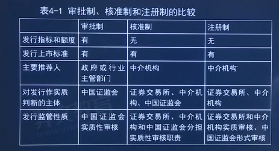
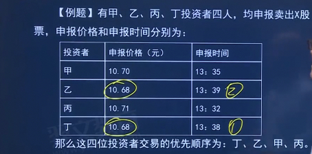
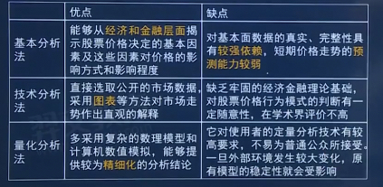
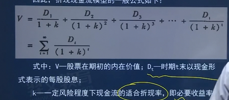
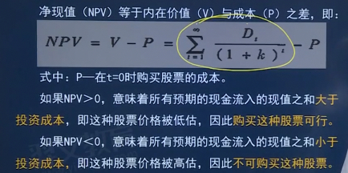
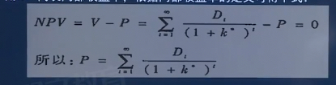
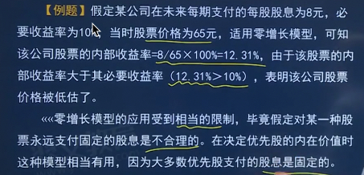
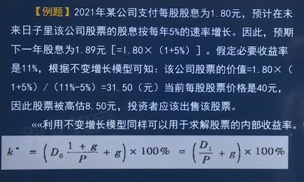
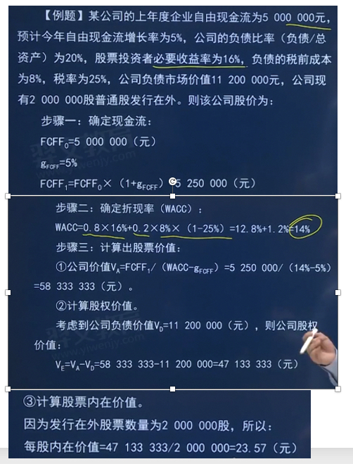
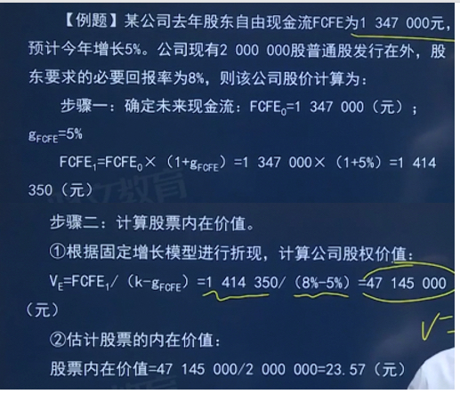

# 4.股票
## 第一节 股票概述
- 股票概述

    - 定义：是一种**有价证券**，是**股份有限公司**签发的证明股东所持股份的**凭证**
    - 实质：股票实质上代表了股东对股份公司**净资产的所有权**，这种所有权是一种**综合权利**，
      - 股东凭借股票可以获得公司的**股息和红利**，
      - 参加股东大会并行使自己**投票表决**、
      - **参与公司重大决策等权利**，
      - 同时也承担相应的责任与风险。
    - 股份有限公司的资本划分为股份，每一股份的**金额相等**。
    - 股份的发行实行公平、公正的原则，同种类的每一股份具有**同等权利**。
    - 股票一经发行，购买股票的投资者即成为公司的股东。 
    - 我国《公司法》规定，股票采用纸面形式或者国务院证券监督管理机构规定的其他形式。股票应当载明下列**主要事项**：
      - 公司名称、公司成立的日期、股票种类、票面金额及代表的股份数、股票的编号。
      - 股票由法定代表人签名，公司盖章。发起人的股票应当标明“发起人股票”字样。
- 性质（综合资本，正式有价）🌟

    - **有价证券**：有价值的
      - 有价证券是**财产价值**和**财产权利**的统一表现形式。 
      - 持有有价证券，一方面表示拥有一定价值量的财产，另一方面也表明有价证券持有人**可以行使**该证券所代表的权利。
      - 第一，虽然股票本身没有价值，但股票是一种**代表财产权**的有价证券，它包含着股东具有依其持有的股票要求股份公司
        按规定**分配股息和红利的请求权**： 
      - 第二，股票与它代表的财产权有**不可分离的关系**，二者合为一体。
    - **要式证券**：需具备公司法规定的相关要件
      - 股票应具备《公司法》规定的有关内容，如果缺少规定的要件，股票就无法律效力。
    - **证权证券**：
      - 证券可以分为**设权证券和证权证券**
      - **证权证券**
        - 证权证券是指证券是权利的一种物化的外在形式，它是权利的载体，权利是已经存在的
        - 股票代表的是股东权利，它的发行是以股份的存在为条件的，股票只是把**已存在的股东权利表现为证券的形式**，它的作
          用不是创造股东的权利，而是证明股东的权利。
      - **设权证券**
        - 是指证券所代表的权利本来不存在，而是随着证券的制作而产生，即权利的发生是以证券的制作和存在为条件的。
    - **资本证券**：公司为了筹集资本
      - (1)发行股票是股份公司筹措自有资本的手段，因此，股票是投入股份公司资本份额的证券化，属于资本证券。
      - (2)股票又**不是一种现实的资本**，股份公司通过发行股票筹措的资金，是公司用于营运的真实资本。
      - (3)股票独立于真实资本之外，在股票市场上进行着独立的价值运动，是一种***虚拟资本*。
    - **综合权利证券**：对公司财产没有支配权，是综合权利🌟
      - 股票不属于物权证券，也不属于债权证券，而是一种综合权利证券。
        - 物权证券是指证券持有者对公司的财产有直接支配处理权的证券
        - 债权证券是指证券持有者为公司债权人的证券。
      - 股东权是一种**综合权利**，股东依法享有资产收益、重大决策、选择管理者等权利。
        - 股东虽然是公司财产的所有人，享有种种权利，但对于公司的财产不能直接支配处理，而对财产的直接支配处理是物权证券的特征，所以股票不是物权证券
        - 一旦投资者购买了公司股票，即成为公司部分财产的所有人，但该所有人在性质上是公司内部的构成分子，
           而不是与公司对立的债权人，所以股票也不是债权证券。

- 特征🌟（参与收益永风流）

    - 收益性：**最基本特征**，收益来源于股份公司（分红）和股票流通（资本利得，低买高卖，**差价收益**）
    - **风险性**、
      - 由于股票价格受诸如公司经营状况、供求关系、银行利率、大众心理等多种因素的影响，其波动有很大的**不确定性**。
      - 股票风险的内涵是股票投资收益的不确定性，或者说实际收益与预期收益之间的**偏离**。 
      - 由于受**股份公司自身和股票市场**等影响，股票投资收益与预期收益相比可能出现较大的偏差。
        因此，股票是一种**高风险**的金融产品。
    - **流动性**
      - 流动性是指股票可以通过**依法转让而变现的**特性，即在**本金保持相对稳定**、变现的**交易成本很小**的条件下，股票很容易变现的特性。 
      - 并非所有股票都具有相同的流动性。
        - 通常情况下，大盘股流动性强于小盘股，上市公司股票的流动性强于非上市公司股票，
        - 而上市公司股票又可能因市场或监管原因而受到转让限制，从而具有不同程度的流动性。
    - **永久性**：股票是无期限法律凭证，代表着股东的永久性投资，可转让但不可退股
      - 永久性是指股票所载有权利的有效性是始终不变的，因为它是一种**无期限**的法律凭证。 
      - 股票代表着股东的**永久性投资**，
      - 当然，股票持有者可以出售股票**而转让**其股东身份；
      - 而对于股份公司来说，因为股东不能要求退股，所以通过发行股票募集到的资金，在公司待续期间是一笔稳定的**自有资本**
    - **参与性**：参与股东大会
      - 参与性是指股票持有人**有权参与公司重大决策**的特性。 
      - 普通股股票持有人作为股份公司的股东，有权出席股东大会，选举公司董事会，**行使**对公司经营决策的**参与权**。

- 股票分类

    - 按股东享有权利的不同分类
        - 普通股票：最基本最常见的股票
          - 普通股票是指秉持“一股一权”规则之下收益权与表决权**无差别、等比例配置**的股票。 
          - 普通股票是**最基本、最常见**的一种股票，其持有者享有**股东的基本权利和义务**。
        - 特别股票：优先股是一种常见的特别股票
          - 特别股票是指设有**特别权利**或**特别限制**的股票。
          - 优先股就是一秘最常见的特别股票
            - 持有人**优先于**普通股股东分配公司利润和剩余财产
            - 但参与公司决策管理等权利**受到限制**
          - 根据表决权与收益权的非等比配置，可以分为**限制或无表决权股票**和**超级表决权股票**
            - 这两种特别股票均不享有经济性的优先权或劣后义务，仍按照投资多寡承担相应的经营风险
            - 但限制或无表决权股票在承受风险的同时被限制或被剥夺了表决权
            - 超级表决权股票则获得了高出持股比例数倍的表决权
          - “**金股**”也属于特别股票的一种，“金股”的表决权主要是赞成、反对或弃权，附着于“金股”之上的“一票否决权”是对表决权本身否定性权利的强化与放大，
          - 特别股票还包括被赋予**特别参与性权利**的股票
            - 例如在美国上市的阿里巴巴采取的“合伙人制度”，阿里巴巴合伙人可以提名简单多数的董事候选人，本质上是对普通股票附加了**董事选任权利**。
    - 按**是否记载**股东姓名分类🌟
        - 记名股票
            - 记名股票是指在**股票票面**和股份公司的**股东名册**上记载股东姓名的股票。
            - 记载股东姓名或者名称及住所、各股东所持股份数、各股东所持股票的编号、各股东取得股份的日期
            - 股份有限公司向**发起人、法人**发行的股票，**当为记名股票**，并应当记载该发起人、法人的名称或者姓名，不得另立户名或者以代表人姓名记名。
            - 特点
                - 股东权利归属于记名股东
                - 可以一次或分次缴纳出资
                - 转让相对复杂或受限制
                  - 我国《公司法》规定，记名股票由股东以背书方式或者法律、行政法规规定的其他方式转让；
                  - 转让后由公司将受让人的姓名或者名称及住所记载于**股东名册**。
                  - 股东大会**召开前20日**内或者公司决定分配股利的**基准日前5日内**，**不得进行**股东名册变更登记。
                - 便于挂失，相对安全

        - 无记名股票
            - 指在般票票面和股份公司股东名册上**均不记载**股东姓名的股票。
            - 记载股票数量、编号及发行日期
            - 特点
                - 股东权利归属股票的**持有人**
                - 认购股票时要求**一次缴纳出资**
                - 转让相对简便
                  - 原持有者只要向**受让人交付股票**便发生转让的法律效力
                  - 受让人取得股东资格**不需要办理过户手续**
                - 安全性较差
                  - 因无记载股东姓名的法律依据，无记名股票一旦遗失，原股票持有者便丧失股东权利，且**无法挂失**
                
    - 按是否在股票票面上标明金额分类🌟
        - 有面额股票
            - 是指在股票票面上记载一定金额的股票。这一记载的金额也被称为**票面金额、票面价值或股票面值**。
            - 特点
              - 可以明确表示每一股所代表的股权比例
              - 为股票**发行价格**的确定提供依据
        - 无面额股票（**比例股票、份额股票**）
            - 指在股票票面上不记载股票面额，只注明它在公司总股本中所占比例的股票。
            - 是目前世界上很多国家（包括中国）的公司法规定不允许发行这种股票
            - 特点
              - 发行或转让价格较灵活
              - 便于股票分割
    - 按投资主体的不同性质，
      - 国家股、
      - 法人股
      - 社会公众股和
      - 外资股
    - 按股票的上市地区划分，股票可以分为
      - A股、即人民币普通股，是指由中国境内公司发行、上市，境内机构和个人以人民币购买交易的股票。
      - B股、即人民币特种股，是由中国境内注册、上市的公司发行，以人民币标明面值的股票，但以其他货币认购和交易的股票
      - H股、
      - N股、
      - L股
      - S股

- 与股票相关的资本管理概念
    - 股利政策
        - **概念**：
          - 股利政策是关于股份公司**是否发放股利、发放多少股利以及何时发放股利**等方面的制度与政策，
             所涉及的主要是股份公司对其收益进行分配还是留存以用于再投资的策略问题。
        - 实务中通常有四种**股利政策**。
          - **固定股利政策**
            - 是指公司每年支付固定的或者稳定增长的股利；
          - **固定股利支付率政策**
            - 固定股利支付率政策是指公司每年发放的每股现金股利与每股收益保持固定的比率关系：
          - **零股利政策**
            - 零股利政策是将公司所有收益全部投资于本公司用于内部积累；
          - **剩余股利政策**
            - 剩余股利政策是指现金优先用于公司投资需要，只有在满足该需要后有剩余，剩余的部分才用来发放股利。
        - **分配方式**
          - **现金红利**（派现）：股份公司以**现金分红方式**将盈余公积和当前应付利润的部分或全部发放给股东
          - **股票红利**（送股）：股份公司对原有股东**无偿派发股票**的行为，实质上是留存收益的凝固化和资本化
        - 四个相关日期
            - 股利宣布日：即公司董事会将分红派息的消息公布于众的时间
            - 股权登记日：即统计和确认参加本期股利分配的股东的日期，在此日期持有公司股票的股东方能享受股利发放。
            - 除息除权日
                - 通常为股权登记日之后的1个工作日，本日之后（含本日）买入的股票不再享有本期股利
                - 除息是指证券不再含有最近已宣布发放的股息（现金股利）
                - 除权是指证券不再含有最近已宣布的送股、配股及转赠权益
            - 派发日
              - 即股利正式发放给股东的日期。根据证券存管和资金划转的效率不同，通常会在几个工作日之内到达股

  - 股份变动🌟
      - 概念：
        - 股份公司在首次公开发行股票并在证券交易所上市以后，还会因增发和定向增发、配股、公积金转增股本、股份回购、
          可转换债券转换为股票、股票分割和合并等而引起公司股份总数的变动并对股票价格产生影响。
      - **增发和定向增发**：可能会导致股价上升和下降
        - **增发**是股份公司向**不特定对象**公开募集股份的行为，
        - **定向增发**是股份公司采用**非公开方式向特定对象**发行股票的行为。
        - 增发或定向增发之后，公司注册资本和股份相应增加。
      - **配股**：
        - ①配股是上市公司向原股东配售股份的行为。原股东可以参与配股，也可以放弃配股权。 
        - ②现实中，由于配股价通常低手市场价格，配股上市之后可能导致般价下跌 
        - ③在实践中，对那些业绩优良、财务结构健全、具有发展潜力的公司而言，
          配股（包括增发和定向增发）意味着将增加公司经营实力，会给股东带来更多回报，股价不仅不会下跌，可能还会上涨。
      - **资本公积金转增股本**
          - 资本公积金：接收投资者的投入资金超过注册资本
          - 资本公积金主要来源
              - 股票发行的溢价收入**（最主要）**
              - 接收的赠与
              - 资产增值
              - 因合并而接受其他公司资产净额等
          - 股东权益总量和每位股东**占股比重均为发生变化**，唯一变动是发行在外的股份总数增加了

      - **股份回购**：
        - 股份回购是股份公司利用**自有资金**买回发行在外股份的行为
        - 通常导致股份上涨
      - **可转换债券转化为股票**：
        - 公司的实收资本和股份总数增加，由于稀释效应可能导致股价下降
      - 股票分割和合并（针对所有的股票）
          - 股票分割（拆股、拆细）、股票合并（并股）
          - 分割或合并不改变公司的实收资本和每位股东所持股东权益占公司全部股东权益的比重
          - 分割或合并后股价会以相同比例向下或向上调整，但股东所持股票的市值不发生变化
          - 分割通常适用于高价股，拆细之后每股股票的市价下降；并股则常见于低价股

  - 普通股
      - 概念：
        - 股份公司资本构成中**最普通、最基本**的股份，是股份企业资金的基础部分
        - 在公司的经营管理和盈利及财产的分配上享有普通权利的股份，代表满足所有债权偿付要求及优先股东的收益权与求偿
          权要求后对企业盈利和剩余财产的索取
        - 它构成公司资本的基础，是股票的一种**基本形式**，也是**发行量最大、最为重要**的股票。
      - 普通股股东的权利
          - 公司重大决策参与权（首要权利）🌟 **综合权利**
              - 通过股东大会，每年召开一次
              - 所持每一股份有一表决权
              - 股东大会选举董事、监事，可以依照公司章程的规定或者股东大会的决议，实行累计投票制
                  - 🌟累计投票制：选举董事或者监事时，每一股份拥有与应选董事或者监事人数相同的表决权
                  - （应选5个，你有100股，那就有500个表决权），股东拥有的表决权可以集中使用。
              - 股东可以委托代理人出席股东大会会议，代理应当向公司提交股东授权委托书，并在授权范围内行使表决权
              - 股东大会作出决议，必须经出席会议的股所持表决权过**半数通过**。 
                - 但是，股东大会作出修改公司章程、增加或者减少注册资本的决议，
                   以及公司**合并、分立、解散或者变更公司形式**的决议，必须经出席会议的股东所持表决权的**2/3**以上通过。
              - 有下列情形之一的，应当**在两个月内**召开临时股东大会： 
                - ①董事人数不足《公司法》规定人数或者公司章程所定人数的2/3时； 
                - ②公司未弥补的亏损达实收股本总额1/3时： 
                - ③单独或者合计持有公司10%以上股份的股东请求时； 
                - ④董事会认为必要时： 
                - ⑤监事会提议召开时； 
                - ⑥公司章程规定的其他情形
          - 公司资产收益权和剩余资产分配权🌟
              - 普通股票股东行使资产收益权的顺序：
                - 公司缴纳所得税后的利润，在支付普通股票的红利之前，应按如下顺序分配：
                - 弥补亏损->提取法定公积金->提取任意公积金->（优先股股东分配）
              - 普通股票股东行使剩余资产分配权的顺序：
                - 支付清算费用->支付公司员工工资和劳动保险费用->缴付所欠税款->清偿公司债务->如还有剩余资产，
                  再按照股东持股比例分配给各股东（优先股优先）
                - 时机：必须**在公司解散清算之时**
          - 其他权利
              - 知情权、处置权（处置手中的股票）
              - 优先认股权（优先股没有优先认股权）
                - ①优先认股权是指当股份公司为增加公司资本而决定增加发行新的股票时，
                   原普通股股东享有的按其持股比例，以低于市价的某一特定价格优先认购一定数量新发行股票的权利。 
                - ②赋予股东优先认购权主要有两个目的： 
                  - 一是能保证普通股股东在股份公司中**保持原有的持股比例**： 
                  - 二是能保护原普通股股东的利益和持股价值。
                    因为当公司增资扩股后，在一段时间内，公司的每股税后
                    净利会因此而摊薄，原普通股股东以优惠价格优先购买一定数
                    量的新股，可从中得到补偿或取得收益。
                  - ③享有优先认股权的股东可以有三种选择： 
                    - 一是行使此权利来认购新发行的普通股；
                    - 二是将该权利转让给他人，从中获得一定的报酬
                    - 三是不行使此权利而听任其过期失效。
      - 普通股股东的义务
          - 出资义务
            - 股东可以用货币出资，也可以用实物、知识产权、土地使用权等可以用**货币估价**并**可以依法转让**的非货币财产作价出资。
              对作为出资的非货币财产应当评估作价，核实财产，不得高估或者低估作价。
            - **以发起设立方式设**立股份公司的，发起人应当**书面认足**公司章程规定其认购的股份，
              并按照公司章程规定缴纳出资。以非货币财产出资的，应当依法办理其财产权的转移手续。
              发起人不依照规定缴纳出资的，应当按照发起人协议承担违约责任。
            - 股份公司**成立后**，发起人未按照公司章程的规定缴足出资的，应当**补缴**；其他发起人承担连带责任。
            - 股份公司成立后，发现作为设立公司出资的非货币财产的实际价额**显著低于**公司章程所定价额的，应当由交付该
              出资的发起人**补足其差额**；其他发起人承担连带责任。
          - 不得滥用股东权利的义务
            - (1)公司股东滥用股东权利给公司或者其他股东造成损失的，应当**依法承担赔偿责任**。
            - (2)公司股东滥用公司法人独立地位和股东有限责任，逃避债务，严重损害公司债权人利益的，应当对公司债务承担
              连带责任。
            - (3)公司的控股股东、实际控制人不得利用其关联关系损害公司利益，由此给公司造成损失的，应当承担赔偿责任。

  - 优先股
      - 定义：股份持有人**优先于**普通股股东分配公司利润和剩余财产，但参与公司决策管理等权利受到限制的股票
      - 根据《国务院关于开展优先股试点的指导意见》优先股股东在以下两种情况下具有表决权：
           - 固有的表决权
             - 以下五种事项除领经出席会议的普通股股东所持表决权的2/3以上通过之外，
               还须经出席会议的优先股股东所持表决权的2/3以上通过：
               - 修改公司章程中与优先股相关的内容
               - 一次或累计减少公司注册资本超过10%
               - 公司合并、分立、解散或变更公司形式
               - 发行优先股
               - 公司章程规定的其他情形
           - 恢复的表决权
             - 公司累计**3个会计年度或连续2个会计年度**未按约定支付优先股股息的，优先股股东可以享有公司
               章程规定的表决权
      - 特征
          - 优先股收益相对固定（普通股受公司经营情况影响更大）
          - 可以先于普通股获得股息
          - 优先股的清偿顺序先于普通股，而次于债权人
          - 优先股的权利范围，**没有表决权**
      - 优先股的分类
          - **固定股息率**优先股和**浮动股息率**优先股
          - **强制分红**优先股和**非强制分红**优先股
          - **可累计优**先股和非累计优先股（是否可股息累计下年发放）
              - 根据公司因当年可分配利润不足而未向优先股股东足额派股息，差额部分是否累积到下一会计年度
              - 累积优先股是指公司在某一时期所获盈利不足，导致当年可分配利润不足以支付优先股股息时，则将应付股息**累
                积到次年或以后某一年盈利**时，在普通股的股息发放之前，连同本年优先股股息一并发放。
              - 非累积优先股则是指公司不足以支付优先股的全部股息时，对所欠股息部分，优先股股东**不能**要求公司在以后年度补发。
          - 参与优先股和非参与优先股（是否可以和普通股股东一起参与税后利润分配）
              - 根据优先股股东按照确定的股息率分配股息后，**是否有权**同普通股股东一起参加剩余税后利润分配
              - 持有人只能获取一定股息但不能参加公司额外分红的优先股，被称为**非参与优先股**；
              - 持有人除可按规定的股息率优先获得股息外，还可与普通股股东分享公司剩余收益的优先股，被称为**参与优先股**
          - 可转化优先股和不可转换优先股（是否可转换普通股）
              - 是否可转为普通股
          - 可回购优先股和不可回购优先股
              - 是否享有公司回购优先股的权利
                ****
      - 优先股和普通股的区别🌟
          - 参与权
              - 【普通股】**全面参与**公司的经营管理
              - 【优先股】一般不参与公司日常经营管理
          - 利润和剩余财产分配
              - 【普通股】无优先权
              - 【优先股】优先
          - 股息收益
              - 【普通股】不固定
              - 【优先股】一般是固定的
          - 买卖价差
              - 【普通股】部分收益来源二级市场价格上涨
              - 【优先股】二级市场股价波动相对较小，依靠买卖价差获利空间小
          - 股票回售转让规定
              - 【普通股】不能退股，职能在二级市场变现退出
              - 【优先股】如有约定，优先股股东可依约将股票回售给公司
      - 优先股和债券的区别🌟
          - **法律属性**不同（**根本区别**）
              - 【债券】属于债券
              - 【优先股】属于股票
          - 偿还本金
              - 【债券】绝大多数债券需要到期还本付息
              - 【优先股】没有到期的概念，发行人没有偿还本金的压力
          - 股息收益
              - 【债券】股息收益不确定性相对较小
              - 【优先股】股息收益不确定性大
          - 股息/利息来源
              - 【债券】利息来自税前利润
              - 【优先股】股息一般来自可分配税后利润
      - 优先股和可转债的区别
        - 优先股没有固定期限，且未必含有转股条款。
        - 可转债**一般期限不超过6年**，其投资者转股前作为债券持有人、转股后作为普通股股东在股东表决权、利润分配及剩余
          财产分配上均不同于优先股投资者。
      - 优先股和永续债的区别
        - 与永续债相比，优先股投资者具有在一定条件下恢复表决权的权利，而永续债一般不具有这一特点
        - 从破产清算时剩余财产的清偿顺序来看，永续债券的偿还顺序**先于**优先股； 
        - 从发行人角度，支付还计入权益的永续债利息可在税前扣除，支付计入权益的永续债利息不能在税前扣除，而优先股股息都不能在税前扣除。
      - 优先股的意义
        - 对发行人的意义
          - 发行优先股的作用在于可以筹集长期稳定的公司股本，又因其股息率固定，可以减轻利润分配的负担。
          - 优先股股东一般不参与公司经营决策，表决权受到限制，这样可以避免公司经营决策权的改变和分散
        - 对投资者的意义
          - 由于优先股优先于普通股分配公司利润和剩余财产，资风险相对较小
          - 优先股因收入稳定，二级市场价格波动小，风险较低，适宜**中长线投资**。

  - 我国股票的类型（按投资主体分）
      - 国家股
          - 概念
            - 指有权代表国家投资的部门或机构以**国有资产**向公司投资形成的股份，包括公司现有国有资产**折算成的股份**
            - 国家股是国有股权的一个组成部分，国有资产管理部门是国有股权行政管理的专职机构
              - 国有股权可由国家授权投资的机构持有，
              - 也可由**国有资产管理部门**持有或由**国有资产管理部门代政府委托其他机构**或部门持有。
          - 资金来源
            - 第一，现有国有企业改组为股份公司时所拥有的净资产。 
            - 第二，现阶段**有权代表国家投资**的政府部门向新组建的股份公司的投资。 
            - 第三，经授权代表国家投资的投资公司、资产经营公司、经济实体性总公司等机构向新组建股份公司的投资。 
          - 国家股是**国有股**权的一个组成部分（国有股权的另一组成部分是**国有法人股**)
          
      - 法人股
          - 指**企业法人或具有法人资格**的事业单位和社会团体以其依法可支配的资产投入公司形成的股份
          - 国有法人股属于国有股份
          - 法人持股所形成的也是所有权关系，是法人经营自身财产的一种投资行为。法人股股票以法人记名
          - 如果是具有法人资格的国有企业、事业单位及其他单位以其依法占用的法人资产向独立于自己的股份公司出资形成或
            依法定程序取得的股份，则被称为“国有法人股”。
          - 国有法人股属于国有股权。
      - 社会公众股

          - 指社会公众依法以其拥有的财产投入公司时形成的可上市流通的股份
          - 在社会募集方式下，股份公司发行的股份，除了由发起人认购一部分外，其余部分应该向社会公众公开发行。
          - 《证券法》规定，公司申请股票上市的条件之一是：
            - 向社会公开发行的股份达到公司股份总数的25%以上； 
            - 公司股本总额超过四亿元的，比例在10%以上

      - 外资股

          - 指股份公司向外国和我国香港、澳门、台湾地区投资者发行的股票，是我国股份公司吸收外资的一种方式
          - **境内上市外资股**（B股）🌟

              - **境外筹集资金**在**境内**上市
              - 采取**记名股票**形式，以**人民币标明股票面值**，以**外币认购、买卖**，在境内证券交易所上市交易
              - 境内居民个人可以用现钞存款和外币现钞存款以及从境外汇入的外汇资金从事B股交易，但不允许使用外币现钞
              - 投资者限于：
                - 外国的自然人、法人和其他组织；
                - 我国香港、澳门、台湾地区的自然人、法人和其他组织；
                - 定居在国外的中国公民等
          - **境外上市外资股**🌟
              - 境外筹集资金在**境外**上市
              - 采取**记名股票**形式，以**人民币标明面值**，以外币认购
              - 由H股（香港）、N股（纽约）、S股（新加坡）、L股（伦敦）等构成
              - 公司向境外上市外资股股东支付股利及其他款项，以人民币计价和宣布，以外币支付
              - 在境外上市时，可以采取**境外存股凭证**形式或者股票的其他派生形式。 
              - 在境外上市的外资股除了应符合我国的有关法规外，还须符合上市所在地国家或者地区证券交易所制定的上市条件。
              - 依法持有境外上市外资股、其姓名或者名称登记在公司股东名册上的**境外投资**人，为公司的境外上市外资股股东。
                公司向境外上市外资股股东支付股利及其他款项，以**人民币计价**和宣布，以外币支付。
              - **红筹股不属于外资股**，红筹股是指在中国境外注册、在香港上市，但**主要业务在中国内地**或大部分股东权益来自中国内地公司的股票。

      - 已完成股权分置改革的公司（公司有可以上市流通的股票，有不可以上市流通的），按股份流通受限划分类别
        - 无限售条件股份
          - 无限售条件股份是指**流通转不受限制**的股份
            - 人民币普通股，A股
            - 境内上市外资股（B股）
            - 境外上市外资股
            - 其他
        - 有限售条件股份（不能上市流程）
            - 有限售条件股份是指股份持有人依照法律、法规规定或按**承诺有转让限制**的股粉，
            - 包括因**股权分置改革暂时锁定**的股份，内部职工股，董事、监事、高级管理人员持有的股份等。
            - 国家持股、国有法人持股、其他内资持股、外资持股

## 第二节 股票发行

### 4.2.1 股票发行制度

股票发行制度是指发行人在申请发行股票时必须遵循的一系列程序化的规范，具体而言，
表现在**发行监管制度、发行方式与发行定价**等方面。

1. 股票发行制度的演变:主要体现在**发行监管制度、发行方式与发行定价**三个方面
   1. **阶段一**：1993年，证券市场建立了全国统一的股票发行审核制度，
      并先后经历了**行政主导的审批制**和**市场化方向的核准制**两个阶段。
   2. 2020年3月1日，新《证券法》正式施行，核准制开始向**全面注册制**转变。
2. 审批制、核准制和注册制🌟
   1. 审批制
      1. 完全计划发行的模式
      2. 股票市场**发展的初期**，为了维护上市公司的稳定和平衡复杂的社会经济关系，采用行政计划的办法分配股票发行的指标和额度，
        由**地方或行业主管部门**根据**指标**推荐企业发行股票
   2. 核准制（实质性审查）
      1. 从审批制向注册制过渡的中间模式，介于注册制和审批制之间的中间形式
      2. 取消了指标和额度管理，引进证券中介机构的责任，判断企业是否达到股票发行的条件（不是政府说的算了）
      3. 证券监管机构同时对股票发行的**合规性**和**适销性条件**进行**实质性审查**，并**有权否决**股票发行的申请
   3. 注册制（形式审查）
      1. 目前**成熟股票市场**普遍采用的模式 
      2. 监管部门公布股票发行的**必要条件**，只要达到所公布条件要求的企业即可发行股票。
         证券监管机构的职责是对申报文件的真实性、准确性、完整性和及时性作合规性的形式审查
   4. 三者的对比

3. 保荐制度、发审委制度和承销制度
    - 保荐制度
        - 指有资格的保荐人推荐符合条件的公司公开发行股票和上市，
        并对所推荐的发行人的信息披露质量和所作承诺提供持续训示、督促、辅导、指导和信用担保的制度
        - 保荐制度的重点是明确保荐机构和保荐代表人的责任并**建立责任追究制度**.
          - 保荐人的保荐责任期包括发行上市全过程以及上市后的一段时期。
        - 建保荐制度主要内容包括：
          - 立保荐机构资格核准
          - 保荐代表人的登记管理制度。
    - 发审委制度（对股票进行实质审查的机构）
        - 发行审核委员会（发审委）由国务院证券监督管理机构的专业人士和所聘请的该机构外的有关专家组成，
          以投票方式对股票发行申请进行表决，提出审核意见
        - 在核准制下，发审委需要对发行申请人进行实质审查，既行使行政权力又要作出商业判断。
        - 新《证券法》施行后，作为发行监管体制的重大改革，审核环节**下放到证券交易所**，由证券交易所进行实质审核，
          中国证监会履行监督职能，真正实现了**监审分离**。
    - 承销制度
      - 发行人销售证券的方法有两种：
        - 一是自行销售，被称为“自销”；
        - 二是委托他人代为销售，被称为“承销”。
      - 一般情况，公开发行以**承销**为主
      - 承销方式有**包销和代销**两种
        - 承销是发行人将股票销售业务委托给专门的证券经营机构(承销商)销售 
      - 包销：**全额包销** **余额包销**
        - 全额包销
          - 是指由承销商先全额购入发行人该次发行的股票，再发售给投资者的承销方式
        - 余额包销
          - 是指承销商按照协议到销售截止日将未售出的剩余股票全部自行购入的承销方式
      - 代销
        - 指承销商代发行人发售股票，在承销期结束时，将未售出的股票**全部退还给发行人**的承销方式。

### 4.2.2 新股发行

1. 公开发行股票的基本条件
   1. **概念**：
      1. 公开发行股票，是指发行人向**不特定对象**发行股票或向特定对象发行股票累计**超过200人**，
      2. 但依法实施员工持股计划的员工人数不计算在内或法律、行政法规规定的其他发行行为。 
   2. IPO的基本条件（新证券法2020.3.1规定）
        - 健全且运行良好的组织机构，具有持续经营能力
        - 最近三年财务会计报告被出具无保留意见审计报告
        - 发行人及其控股股东、实际控制人最近三年不存在贪污、贿赂、侵占财产、挪用财产或破坏社会主义市场经济秩序的刑事犯罪
        - 经国务院批准的国务院证券监督管理机构规定的其他条件
   3. 首次公开发行IPO的规定
        - **概念**：
          - 首次公开发行股票(IP0),是指公司首次在证券市场公开发行股票募集资金并上市的行为。 
          - 通过首次公开发行，发行人不仅募集到所需资金，而且完成了股份有限公司的设立或转制，成为上市公众公司。

        - 在主板（中小企业板）上市的规定
            - 发行人依法设立且持续经营时间在**3年以上**的股份有限公司
            - 发行人**最近3年内**主营业务和董事、高级管理人员没有发生**重大变化**，
              实际控制人没有发生变更
            - 发行人规范运行
            - 最近3个会计年度净利润**均为正数**且**累计超过3000万**元，净利润以扣除非经常性损益前后较低者为计算依旧
            - 最近3个会计年度经营活动产生的现金流量净额累计超过5000万元或者最近3个会计年度营业收入累计超过3亿元
            - 发行前股本总额不少于人民币3000万元。
            - 最近一期末无形资产（扣除土地使用枚、水面养殖权和采矿权等后)占净资产的比例不高于20%。
            - 最近一期末不存在未弥补亏损
            - 发行人的经营成果对税收优惠不存在严重依赖
            - 发行人不存在重大偿债风险，不存在影响持续经营的担保、诉讼以及仲裁等重大或有事项
            - 发行人不得有影响持续盈利能力的情形
            - 口诀：持续经营有3年，3年净利3000万，现金流量5000万，营收它得超3亿
        - 在创业板上市的规定
            - 发行人依法设立且持续经营时间在3年以上的股份有限公司
            - **最近3年**财务会计报告由注册会计师出具**无保留意**见的审计报告
            - 发行人业务完整，具有直接面向市场独立持续经营的能力
            - 发行人规范运行

   4. 上市公司公开发行股票的一般规定
        - **组织机构健全、运行良好**。最近3年没有受到证监会行政处罚，1年没有受到证交所公开谴责
          - ①公司章程合法有效，股东大会、董事会、监事会和独立董事制度健全，能够依法有效履行职责； 
          - ②公司内部控制制度健全，能够有效保证公司运行的效率、 合法合规性和财务报告的可靠性； 
          - ③内部控制制度的完整性、合理性、有效性不存在重大缺陷；
          - ④现任董事、监事和高级管理人员具备任职资格，能够忠实和勤勉地履行职务，
            - 不存在违反《公司法》第一百四十七条、第一百四十八条规定的行为，
            - 且**最近36个月**内未受到过中国证监会的**行政处罚**、
            - **最近12个月**内未受到过证券交易所的**公开谴责**； 
          - ⑤上市公司与控股股东或实际控制人的人员、资产、财务分开，机构、业务独立，能够自主经营管理； 
          - ⑥**最近12个月**内不存在违规对外提供担保的行为。
        - **盈利能力具有可持续性**，最近3年度连续盈利
          - ①最近三个会计年度连续盈利。扣除非经常性损益后的净利润与扣除前的净利润相比，**以低者**诈为计算依据； 
          - ②业务和盈利来源相对稳定，不存在严重依赖于控股股东、实际控制人的情形； 
          - ③现有主营业务或投资方向能够可持续发展，经营模式和投资计划稳健，主要产品或服务的市场前景良好，
            行业经营环境和市场需求不存在现实或可预见的重大不利变化；
          - ④高级管理人员和核心技术人员稳定，最近12个月内未发生重大不利变化； 
          - ⑤公司重要资产、核心技术或其他重大权益的取得合法，能够持续使用，不存在现实或可预见的重大不利变化； 
          - ⑥不存在可能严重影响公司持续经营的担保、诉讼、仲裁或其他重大事项； 
          - ⑦**最近24个月**内曾公开发行证券的，不存在发行当年营业利润比上年**下降50%**以上的情形。
            《连续盈利满3年；高管核心技术员12月内均不变；24月曾经发，未有利润减一半。》
        - **财务状况良好**
          - ①会计基础工作规范，严格遵循国家统一会计制度的规定； 
          - ②最近三年及一期财务报表**未被**注册会计师出具**保留意见**、**否定意见**或**无法表示意见**的审计报告； 
          - ③被注册会计师**出具带强调事项段的无保留意见**审计报告的，所涉及的事项对发行人**无重大不利影响**或者在发行前重之不利影响已经消除；
          - ④资产质量良好，不良资产不足以对公司财务状况造成重大不利影响； 
          - ⑤经营成果真实，现金流量正常。营业收入和成本费用的确认严格遵循国家有关企业会计准则的规定，最近三年资产减值准备计提充分合理，不存在操纵经营业绩的情形： 
          - ⑥最近三年以现金方式累计分配的利润不少于最近三年实现的**年均可分配利润的30%**。
        - 3年内财务会计文件无虚假记载，不存在重大违规行为，未受到刑事处罚或违反各类行政规章
          - ①违反证券法律、行政法规或规章，受到中国证监会的行政处罚，或者受到刑事处罚；
          - ②违反工商、税收、土地、环保、海关法律、行政法规或规章，受到行政处罚且情节严重，或者受到刑事处罚；
          - ③违反国家其他法律、行政法规且情节严重的行为。
        - 上市公司募集资金的数额和使用应符合规定
          - ①募集资金数额不超过项目需要量；
          - ②募集资金用途符合国家产业政策和有关环境保护、土地管理等法律和行政法规的规定；
          - ③除金融类企业外，本次募集资金使用项目不得为**持有交易性金融资产**和**可供出售的金融资产**、**借予他人**、
            **委托理财等财务性投资**，不得直接或间接投资于以买卖有价证券为主要业务的公司；
          - ④投资项目实施后，不会与控股股东或实际控制人产生同业竞争或影响公司生产经营的独立性； 
          - ⑤建立募集资金专项存储制度，募集资金必须存放于公司董事会决定的专项账户。
        - 不存在不得公开发行证券的情形
          - ①本次发行申请文件有虚假记载、误导性陈述或重大遗漏； 
          - ②擅自改变前次公开发行证券募集资金的用途而**未作纠正**； 
          - ③上市公司最近12个月内受到过证券交易所的公开譴责； 
          - ④上市公司及其控股股东或实际控制人最近12个月内存在**未履行**向投资者作出的公开承诺的行为； 
          - ⑤上市公司或其现任董事、高级管理人员因涉嫌犯罪被司法机关立案侦查或涉嫌违法违规被中国证监会立案调查； 
          - ⑥严重损害投资者的合法权益和社会公共利益的其他情形。
          
   5. 创业板上市公司发行股票的一般规定
       - 上市条件
         - ①具备健全且运行良好的组织机构； 
         - ②现任董事、监事和高级管理人员具备法律、行政法规规定的**任职资格**；
         - ③具有完整的业务体系和直接面向市场独立经营的能力，不存在对持续经有重大不利影响的情形； 
         - ④会计基础工作规范，内部控制制度健全且有效执行，财务报表的编制和披露符合企业会计准则和相关信息披露规则的
           规定，在所有重大方面公允反映了上市公司的财务状况、经营成果和现金流量，最近三年财务会计报告被出具**无保留意见审计**报告；
         - ⑤最近二年盈利，净利润以扣除非经常性损益前后孰低者为计算依据； 
         - ⑥除金融类企业外，最近一期末不存在持有金额较大的财务性投资的情形。
           - 上市条件
         - 符合证监会规定的**创业板发行条件**
         - 发行后股本总额不低于3000万元
         - 公开发行的股份达到公司股份总数的25%以上；公司股本总额超过4亿的，比例为10%以上
         - 市值及财务指标符合《深交所创业板股票上市规则》
         - 深交所要求的其他上市条件
   6. 科创板上市的一般规定
      1. (1)上市公司向不特定对象发行股票，应当符合下列规定： 
         1. ①具备健全且运行良好的组织机构，现任董事、监事和高级管理人员具备法律、行政法规规定的**任职要求**；
         2. ②具有**完整的业务体系**和直接面向市场**独立经营的能力**，不存在对持续经营有重大不利影响的情形；
         3. ③会计基础工作规范，内部控制制度健全且有效执行，财务报表的编制和披露符合企业会计准则和相关信息披露规则的
            规定，在所有重大方面公允地反映了上市公司的财务状况、经营成果和现金流量，最近3年财务会计报告被出具**标准无保留意**见审计报告； 
         4. ④除金融类企业外，最近一期末不存在金额较大的**财务性投资**。
      2. 不得向不特定对象发行股票的情况
         - ①擅自改变前次募集资金用途**未作纠正**，或者未经股东大会认可：
         - ②上市公司及其现任董事、监事和高级管理人员**最近三年**受到中国证监会**行政处罚**，
         或者**最近一年**受到证券交易所**公开谴责**，
         或者因**涉嫌犯罪**正被司法机关立案侦查或者涉嫌违法违规正被中国证监会**立案调查**；
         - ③上市公司及其控股股东、实际控制人最近一年存**在未履行**向投资者作出的公开承诺的情形；
         - ④上市公司及其控股股东、实际控制人最近三年存在贪污、贿赂、侵占财产、挪用财产或者破坏社会主义市场经济秩序的
         刑事犯罪，或者存在严重损害上市公司利益、投资者合法权益、社会公共利益的**重大违法行为**。
   7. 上市公司发行股票，**募集资金**使用应当符合下列规定
      1. ①应当投资于科技创新领域的业务；
      2. ②符合国家产业政策和有关环境保护、土地管理等法律、行政法规规定；
      3. ③募集资金项目实施后，不会与控股股东、实际控制人及其控制的其他企业新增构成重大不利影响的**同业竞争**、
         显失公平的**关联交易**，或者严重影响公司**生产经营的独立性**。
   8. 配股的特别规定
      1. 概念
         1. 是指上市公司向**原股东**配售股份的行为

      - 主板（中小板）公司
          - 拟配售股份数量**不超过**本次配售股份前股本总额的**30%**
          - 控股股东应当在股东大会召开前**公开承诺**认配股份的数量
          - 采用《证券法》规定的代销方式发行
      - 创业板、科创板
          - 拟配售股份数量**不超过**本次配售股份前股本总额的**50%**
          - 控股股东应当在股东大会**召开前**公开承诺认配股份的数量
          - 采用《证券法》规定的**代销方式**发行
   9. 增发的特别规定
      1. 概念
         1. 是指上市公司**向不特定对象**公开募集股份的行为

      - 主板（中小板）
          - **最近3年加权平均净资产收益率不低于6%**
          - 除金融类企业外，最近一期末**不存在**持有**金额较大的交易性金融资产**和**可供出售的金额资产**、**借予他人款项**、
             **委托理财**等财务性投资的情形
          - 发行价格不应低于公告招股意向书前20个交易日股票均价或前一个交易日的均价
      - 创业板、科创板
          - 发行价格不应低于公告招股意向书前20个交易日股票均价或前一个交易日的均价
          
2. 上市公司**非公开发行股票**的条件--定向增发
   1. 概念：上市公司采用非公开方式向**特定对象**发行股票的行为
   2. 主板上市公司非公开发行股票的条件
      1. ①特定对象符合股东大会决议规定的条件。
      2. ②发行对象**不超过35名**
      3. ③发行对象为境外战略投资者的，应当遵守国家的规定
   3. 发行规定
      1. ①发行价格不低于定价基准目**前20个交易日**公司股票均价的80%； 
      2. ②本次发行的股份自发行结束之日起， **6个月内**亦得转让； 
      3. ③控股股东、实际控制人及其控制的企业认购的股份，**18个月内**不得转让； 
      4. ④募集资金使用符合《上市公司证券发行管理办法(2020年修订)》第十条的规定； 
      5. ⑤本次发行将导致上市公司控制权发生变化的，还应当符合中国证监会的其他规定。
   4. **不得非公开**发行股票的情形
      1. ①本次发行申请文件有**虚假记载、误导性陈述或重大遗漏**；
      2. ②上市公司的权益被控股股东或实际控制人严重损害且**尚未消除**；
      3. ③上市公司及其附属公司**违规对外提供担保**且尚未解除； 
      4. ④现任董事、高级管理人员**最近36个月内**受到过中国证监会的**行政处罚**，或者**最近12个月内**受到过证券交易所**公开谴责**： 
      5. ⑤上市公司或其现任董事、高级管理人员因涉嫌犯罪正被司法机关**立案侦查**或涉嫌违法违规正被中国证监会**立案调查**； 
      6. ⑥最近一年及一期财务报表被注册会计师**出具保留意见**、**否定意见或无法表示意见**的审计报告。 
         保留意见、否定意见或无法表示意见所涉及事项的重大影响已经消除或者本次发行涉及重大重组的除外； 
      7. ⑦严重损害投资者合法权益和社会公共利益的其他情形。

3. 创业板、科创板上市公司非公开发行股票的条件
   1. 非公开发行股票的特定对象应当符合股东大会决议规定的条件，且每次发行对象不超过35名。
   2. 上市公司非公开发行股票确定发行价格和持股期限，应当符合下列规定
      1. ①发行价格**不低于**定价基准日（发行底价的基准日）**前20个交易日**公司股票均价的**80%**。
      2. ②向特定对象发行股票的定价基准日为**发行期首日**。上市公司应当以**不低于**发行底价的价格发行股票。 
      3. 上市公司董事会决议提前确定全部发行对象，且发行对象属于下列情形之一的，
          定价基准日可以为关于本次发行股票的董事会决议公告日、股东大会决议公告日或者发行期首目：
         1. 上市公司的控股股东、实际控制人或者其控制的关联人；
         2. 通过认购本次发行的股票取得上市公司实际控制权的投资者；
         3. 董事会拟引入的境内外战略投资者。
      4. ③向特定对象发行股票，发行对象属于“通过认购本次发行的股票取得上市公司实际控制权的投资者”以外的情形的
      5. ④向特定对象发行的股票，自发行结束之日起6个月内不得转让。
         发行对象属于“通过认购本次发行的股票取得上市公司实际控制权的投资者”情形的，其认购的股票自发行结束之日起**18个月内**不得转让
      6. ⑤向特定对象发行股票的定价基准日为本次发行股票的董事会决议公告目或者股东大会决议公告日的，向特定对象发行
         股票的董事会决议公告后，出现下列情况**需要重新**召开董事会
         的，应当由董事会重新确定本次发行的定价基准日：本次发行
         股票股东大会决议的有效期已过；本次发行方案发生重大变化；
         其他对本次发行定价具有重大影
4. 北京证券交易所上市公司发行股票的相关规定
   1. 北交所上市公司向**特定对象**发行股票，应当符合下列规定： 
      1. ①具备健全且运行良好的组织机构； 
      2. ②具有独立、稳定经营能力，不存在对持续经营有重大不利影响的情形；
      3. ③最近一年财务会计报告**无虚假记载，未被出具否定意见或无法表示意见**的审计报告； 
      4. ④最近一年财务会计报告被出具保留意见的审计报告，保留意见所涉及事项对上市公司的重大不利影响**已经消除**（本次发行涉及重大资产重组的除外)； 
      5. ⑤合法规范经营，依法履行信息披露义务。
   2. 北交所上市公司存在下列情形之一的，不得向特定对象发行股票：
      1. ①上市公司或其控股股东、实际控制人**最近三年内**存在贪污、贿赂、侵占财产、挪用财产或者破坏社会主义市场经济秩
         序的刑事犯罪，存在欺诈发行、重大信息披露违法或者其他涉及国家安全、公共安全、生态安全、生产安全、公众健康安全等领域的重大违法行为；
      2. ②上市公司或其控股股东、实际控制人，现任董事、监事高级管理人员**最近一年内**受到中国证监会**行政处罚**、北交所公**开谴责**；
          或因涉嫌犯罪正被司法机关立案侦查或者涉嫌违法违规正被中国证监会立案调查，尚未有明确结论意见； 
      3. ③擅自改变募集资金用途，未作纠正或者未经股东大会认可； 
      4. ④上市公司或其控股股东、实际控制人**被列入失信被执行人**名单且情形尚未消除；
      5. ⑤上市公司利益严重受损的其他情形。
   3. 北交所上市公司向不特定合格投资者公开发行股票的，除应当符合上述向特定对象发行股票的规定外，还应当符合《北京证券交易所向不特定合格投资者公开发行股票注册管理办
      法（试行）》规定的其他条件：
      1. 发行人应当为在全国股转系统**连续挂牌满12个月**的创新层挂牌公司
      2. 发行人申请公开发行股票，应当符合下列规定： 
         1. ①具备健全且运行良好的组织机构； 
         2. ②具有持续经营能力，财务状况良好； 
         3. ③最近三年财务会计报告无虚假记载，被出具无保留意见审计报告； 
         4. ④依法规范经营。
      3. 发行人及其控股股东、实际控制人存在下列情形之一的，发行人**不得公开发行**股票： 
         1. ①最近三年内存在贪污、贿赂、侵占财产、挪用财产，或者破坏社会主义市场经济秩序的刑事犯罪； 
         2. ②最近三年内存在欺诈发行、重大信息披露违法或者其他涉及国家安全、公共安全、生态安全、生产安全、公众健康安全等领域的**重大违法行为**； 
         3. ③**最近一年内**受到中国证监会**行政处罚。**

### 4.2.3 股票退市制度

1. 股票退市
   1. **概念**：
      1. 股票退市是指上市公司股票在证券交易所**终止上市交易**
   2. **意义**：
      1. (1)股票退市制度是资本市场重要的基础性制度，有利于健全资本市场功能，降低市场经营成本，增强市场主体活力，提高市场竞争能力。
      2. (2)有利于实现优胜劣汰，惩戒重大违法行为，引导理性投资，保护投资者特别是中小投资者合法权益。
   3. **种类**：
      1. 股票退市包括**主动退市**和**强制退市**
2. **主动退市**
   1. 上市公司出现下列情形之一的，可以向证券交易所申请主动退市
      1. 上市公司股东大会决议**主动撤回**其股票在证券交易所的交易，并决定不再在该交易所交易；
      2. 上市公司股东大会决议主动撤回其股票在证券交易所的交易，并转而申请在其他交易场所交易或转让；
      3. 上市公司向所有股东发出回购全部股份或部分股份的要约，导致公司股本总额、股权分布等发生变化，不再具备上市条件：
      4. 上市公司股东向所有其他股东发出收购全部股份或部分股份的要约，导致公司股本总额、股权分布等发生变化，不再具备上市条件： 
      5. 除上市公司股东外的其他收购人向所有股东发出收购全部股份或部分股份的要约，导致公司股本总额、股权分布等发生变化，不再具备上市条件； 
      6. 上市公司因新设合并或者吸收合并，不再具有独立主体资格并被注销； 
      7. 上市公司股东大会决议公司解散。
3. **强制退市**
   1. **概念**：
      1. 根据《上海证券交易所股票上市规则(2022年1月修订)》《深圳证券交易所股票上市规则(2022年1月修订)》，
         强制退市分为**交易类强制退市、财务类强制退市、规范类强制退市和重大违法类强制退市**四类情形
   2. ***交易类*强制退市条件
      1. ①在证券交易所仅发行A股股票的上市公司，**连续120个交易目**通过交易所交易系统实现的累计股票成交量**低于500万股**，
         或者**连续20个交易日**的每日股票收盘价**均低于人民币1元**。
      2. ②在证券交易所仅发行B股股票的上市公司，连续120个交易日通过交易所交易系统实现的累计股票**成交量低于100万股**，
         或者**连续20个交易日**的每日股票收盘价**均低于人民币1元**。
      3. ③在证券交易所既发行A股股票又发行B股股票的上市公司，其A、B股股票的成交量或者收盘价同时触及前述第①项和第②项规定的标准。
      4. ④上市公司股东数量连续20个交易日每日均低于2000人。
      5. ⑤上市公司连续20个交易日在交易所的每目股票**收盘总市值**均低于人民币**3亿元**。 
      6. ⑥证券交易所认定的其他情形。
   3. **财务类**强制退市
      1. ①最近一个会计年度经审计的**净利润为负值**且**营业收入低人民币1亿元**，或追溯重述后最近一个会计年度净利润为负值且营业收入低于人民币1亿元。 
      2. ②最近一个会计年度经审计的期末**净资产为负值**，或追溯重述后最近一个会计年度期末净资产为负值。
      3. ③最近一个会计年度的财务会计报告被出具**无法表示意见或否定意见**的审计报告。 
      4. ④中国证监会行政处罚决定书表明公司已披露的最近一个会计年度经审计的年度报告存在虚假记载、误导性陈述或者重大遗漏，
         导致该年度相关财务指标实际已触及第①项、第②项情形的。 
      5. ⑤证券交易所认定的其他情形。
   4. **规范类**强制退市
      1. ①因财务会计报告存在**重大会计差错或者虚假记载**，被中国证监会责令改正但公司**未在规定期限内**改正，且在公司股票停牌2个月内仍未改正
      2. ②未在法定期限内披露半年度报告或者经审计的年度报告，且在公司股票**停牌2个月内**仍未披露；
      3. ③**半数以上**董事无法保证公司所披露半年度报告或年度报告的真实性、准确性和完整性，
          且未在法定期限内改正，在公司股票停牌两个月内仍有半数以上董事无法保证的： 
      4. ④因**信息披露或者规范运作**等方面存在重大缺陷，被证券交易所要求限期改正但公司未在规定期限内改正，且在公司股票停牌2个月内仍未改正；
      5. ⑤因公司股本总额或股权分布发生变化，导致**连续20个交易日**不再具备上市条件，在规定期限内仍未解决；
      6. ⑥公司可能被依法强制解散；
      7. ⑦法院依法受理公司重整、和解和破产清算申请；
      8. ⑧证券交易所认定的其他情形。
   5. **重大违法类**强制退市
      1. ①上市公司存在欺诈发行、重大信息披露违法或者其他严
         重损害证券市场秩序的重大违法行为，且严重影响上市地位，
         其股票应当被终止上市的情形； 
      2. ②上市公司存在涉及国家安全、公共安全、生态安全、生
         产安全和公众健康安全等领域的违法行为，情节恶劣，严重损
         害国家利益、社会公共利益，或者严重影响上市地位，其股票
         应当被终止上市的情形。
4. 科创板退市的特别规定
   1. 一是**重大违法**强制退市，包括信息披露重大违法和公共安全重大违法行为。 
   2. 二是**交易类**强制退市，包括累计股票成交量低于一定指标，股票收盘价、市值、股东数量持续低于一定指标等。
   3. 三是财务类强制退市，即明**显丧失持续经营能力**，包括：
      1. ①主营业务大部分停滞或者规模极低； 
      2. ②经营资产大幅减少导致无法维持日常经营； 
      3. ③营业收入或者利润主要来源于**不具备商业实质**的交易； 
      4. ④营业收入或者利润主要来源于**与主营业务无关**的业务； 
      5. ⑤其他明显丧失持续经营能力的情形。
   4. 四是规范类强制退市，包括公司财务重大报告差错与虚假记录、信息披露、定期报告发布、公司股本总额或股权分布发生变化、依法被强制解散、公司重整、破产和清算等方面触及
      相关合规性指标等。 
   5. 科创板上市公司的股票终止上市后，符合上交所规定条件的，可以向上交所**申请再次上市**
   
## 第三节 股票交易

### 4.3.1 证券交易概述

1. 证券交易原则
   1. 公开原则
      1. 公开原则又被称为**信息公开原则**，指证券交易是一种面向社会的、公开的交易活动，其核心要求是**实现市场信息的公开化**
   2. 公平原则
      1. 公平原则是指参与交易的各方应当获得**平等的机会**
      2. 它要求证券交易活动中的所有参与者都有**平等的法律地位**，各自的合法权益都能得到公平保护
   3. 公正原则
      1. 公正原则是指应当公正地对待证券交易的参与各方，以及公正地处理证券交易事务。
2. 证券交易机制
   1. 定期交易和连续交易（按交易时间的连续特点划分）
      1. 定期交易
         1. 概念
            1. 在定期交易中，成交的时点是**不连续**的。
            2. 在某一段时间到达的投资者的委托订单并不是**马上成交**，而是要先存储起来，然后在某一约定的时刻加以匹配。
         2. 特点
            1. 第一，批量指令可以**提高价格的稳定性**；
            2. 第二，指令执行和结算的**成本相对比较低**。
      2. 连续交易
         1. 概念
            1. 在连续交易中，并非意味着交易一定是连续的，而是指在营业时间里订单匹配可以连续不断地进行。
               因此，两个投资者下达的买卖指令，只要符合成交条件就可以立即成交，而不必再等待一段时间定期成交。
         2. 特点
            1. 第一，市场为投资者提供了**交易的即时性**；
            2. 第二，交易过程中可以反映更多的市场价格信息。
   2. 报价驱动和指令驱动（从交易价格的决定特点划分）
      1. 指令驱动
         1. 概念
            1. 也称订单驱动市场。证券交易的价格是有市场上的买方订单和卖房订单**共同驱动的**
            2. 是一种竞价市场
            3. 如果采用经纪商制度，投资者在竞价市场中将自己的买卖指令报给自己的经纪商，然后经纪商持买卖订单进入市场，
               市场交易中心以买卖双向价格为基准进行撮合。
         2. 特点
            1. 证券交易价格由买方和卖方的力量直接决定
            2. 投资者买卖证券的对手是其他投资者
      2. 报价驱动
         1. 概念
            1. 也称做**市商市场**。证券交易的买价和卖价都由**做市商**给出，做市商将根据市场的买卖力量和自身情况进行证券的**双向报价**
            2. 做市商在其所报的价位上接受投资者的买卖要求，以**其自有资金或证**券与投资者交易。
            3. 做市商的收入来源是买卖证券的**差价**
         2. 特点
            1. 证券成交价格的形成**由做市商决定**
            2. 投资者买卖证券都以做市商为对手，与其他投资者**不发生直接关系**
3. 证券交易机制目标
   1. 流动性
      1. 证券市场流动性包含两方面的要求，即**成交速度和成交价格**
      2. 如果投资者能**以合理的价格迅速成交**，则市场流动性好；反过来，单纯是成交速度快，并不能完全表示流动性好
   2. 稳定性 
      1. 证券市场的稳定性是指证券价格的波动程度。 
      2. 一般来说，稳定性好的市场，其价格波动性比较小，或者说其调节平衡的能力比较强。 从证券市场健康运行的角度看，保持证券价格的相对稳定、
         防止证券价格大幅度波动是必要的。证券市场的稳定性可以用**市场指数的风险度**来衡量。 
      3. 由于各种信息是影响证券价格的**主要因素**，因此，提高市场透明度是加强证券市场稳定性的重要措施。
   3. 有效性（包含两方面的要求）
      1. 证券市场的**高效率**
         1. 首先是证券市场的信息效率，即要求证券**价格能准确、迅速、充分反映各种信息**。
            根据证券价格对信息的反映程度，可以将证券市场分为**强式有效市场**、**半强式有效**市场和**弱式有效**市场。
         2. 其次是证券市场的**运行效率**，即证券交易系统硬件的工作能力，如交易系统的处理速度、容量等。
      2. 证券市场的**低成本**
         1. 一是直接成本，如投资者参与交易而**支付的佣金和缴纳的税收**；
         2. 二是间接成本，如投资者搜集证券信息所发生的费用等。
4. 融资融券交易
   1. 概念
      1. 又称信用交易，分为融资交易和融券交易（向证券公司借钱买证券，或借证券卖钱）
      2. 广义的融资融券交易还包括转融通交易（证券公司向证券金融公司借钱借证券）：转融券交易、转融资交易
      3. 具有**杠杆特性，放大风险**
   2. 融资交易
      1. (1)融资交易是指投资者向证券公司缴纳一定的保证金，融（借）入一定数量的资金买入股票的交易行为。
         投资者向证券公司提交的保证金可以是现金或者可充抵保证金的证券。
      2. (2)证券公司向投资者进行授信后，投资者可以在**授信额度**内买入由证券交易所和证券公司公布的融资标的名单内的
         证券。 投资者信用账户内**融资买入的证券及其他资金证券**，整体作为其对证券公司所负债务的**担保物**。
      3. (3)融资交易是一种杠杆交易，能放大投资者的盈利或者亏损，参与融资融券交易要求投资者有较强的**证券研究能力和风险承受能**力。
   3. 融券交易
      1. (1)融券交易是指投资者向证券公司缴纳一定的保证金，融入一定数量的证券并卖出的交易行为。投资者向证券公司提交的保证金可以是现金或者可充抵保证金的证券。
      2. (2)投资者融入的证券不进入其信用证券账户，而是在融券卖出**成交当日结算**时由证券公司代为支付，卖出证券所得资金除买券还券外不得作其他用途。
      3. (3)投资者信用账户内的**融券卖出资金及其他资金证券**，整体作为其对证券公司所负债务的**担保物**。
   4. 转融通交易
      1. 转融通交易是指证券金融公司将自有或者依法筹集的资金和证券出借给证券公司，以供其办理融资融券业务的经营活动。 
      2. 转融通交易包括转**融券交易和转融资交易**。

### 4.3.2 股票交易程序（掌握）

1. 开户
   1. **证券账户**
      1. 证券账户用来记载投资者所持有的**证券种类、数量和相应的变动**情况；
      2. **种类**：
         1. 中国证券登记结算有限公司：**证券总账户**（一码通账户）
            1. 还可用于记录投资者分级评价等适当性管理信息
         2. **子账户**
            1. 子账户用于记载投资者参与特定交易场所或用于投资特定证券品种的证券持有及变动的具体情况
            2. 子账户包括人民币**普通股票账户、人民币特种股票账户、封闭式基金账户、衍生品账户以及其他证券账户**。
   2. **资金账户**
      1. 资金账户则用来记载和反映投资者买卖证券的**货币收付和结存数额**。
   3. 开立证券账户的基本原则和要求
      1. (1)合法性
         1. 合法性是指只有国家法律允许进行证券交易的自然人和法人才能开立证券账户。
         2. 《中国证券登记结算有限责任公司证券账户管理规则》规定，符合法律、行政法规、国务院证券监督管理机构及中国证登记结算有限责任公司
            有关规定的**自然人、法人、合伙企业以及其他投资者**，可以申请开立证券账户。
         3. 证券资产托管人或资产管理人，可以按中国证券登记结算有限责任公司规定为证券投资基金、保险产品、信托产品、资
            产管理计划、企业年金计划、社会保障基金投资组合等依法设立的证**券投资产品申请**开立证券账户
      2. (2)真实性
         1. 《中国证券登记结算有限责任公司证券账户管理规则》规定，投资者应肖**以本人名义申请**开立证券账户，不得**冒用他人名义**或**使用虚假证件**开立证券账户。
         2. 投资者应当使用以本人名义开立的证券账户，不得违规使用他人证券账户或将本人证券账户违规提供给他人使用。
         3. 中国证券登记结算有限责任公司依投资者申请为其开立一码通账户及相应的子账户
         4. 投资者申请开立A股账户时，开户代理机构**应当为其同时开立**沪市及深市A股账户，投资者确有需要开立单边A股账户的除外
         5. 投资者申请开立证券账户时，开户代理机构应当按规定采集投资者证券账户信息
         6. 证券账户信息中的**投资者姓名或名称、有效身份证明文件类型及号码为关键信息**，其他信息为非关键信息
         7. 中国结算公司为同一投资者维护一套证券账户信息。
2. **证券托管和证券存管**
   1. **概念**： 
      1. 证券托管：投资者将持有的证券**委托给证券公司保管，**并由后者代为处理有关证券权益事务的行为 
      2. 证券存管：证券公司将投资者交给其保管的证券以及自身持有的证券**统一交给证券结算机构保管**，并由后者代为处理有关证券权益事务的行为 
      3. 在账户记录上，证券结算机构一般以证券公司为单位，采用电脑记账方式记载证券公司交给的证券；证券公司也采用电脑记账的方式记载投资者的证券
      4. 对股权、债券变更引起的证券转移，通过账面予以划转
   2. 我国的证券托管制度
      1. (1)上海证券交易所交易证券的托管制度 
         1. 对于在上海证券交易所交易的证券，其**托管制度是和全面指定交易制度**联系在一起的。 
         2. 上海证券交易所证券交易实行**全面指定交易制度**，境外投资者从事B股交易除外。 
         3. 全面指定交易是指参与上海证券交易所证券买卖的投资者**必须事先指定一家会员**作为其买卖证券的**受托人**，通过该会员参与上海证券交易所市场证券买卖。
         4. 投资者应当与指定交易的会员签订指定交易协议，明确双方的权利、义务和责任。指定交易协议一经签订会员即可根
            据投资者的申请向上海证券交易所交易主机申报办理指定交易手续。
         5. 投资者变更指定交易的，应当向已指定的会员提出撤销申请，由该会员申报撤销指令。指定交易撤销后**即可重新申办**指定交易。
      2. (2)深圳证券交易所交易证券的托管制度
         1. 深圳证券交易所交易证券的托管制度可概括为：**自动托管，随处通买，哪买哪卖，转托不限**
         2. 深圳证券市场投资者的证券托管是自动实现的，投资者在哪家证券营业部买入证券，这些证券就**自动托**管在哪家证券营业部。
         3. 投资者可以以同一证券账户在单个或多个会员的不同证券营业部买入证券。投资者买入的证券可以通过原买入证券的交
            易单元委托卖出，也可以向原买入证券的交易单元发出转托管指令，转托管完成后，在转入的交易单元委托卖出。
      3. (3)北京证券交易所转托管
         1. 2021年北京证券交易所发布的《北京证券交易所交易规则试行)》规定，投资者可以以**同一证券账户**在**单个或多个**会员的不同证券营业部买入证券。
         2. 投资者买入的证券可以通过原买入证券的交易单元委托卖出，也可以向原买入证券的交易单元发出**转托管指令**，转托管
            完成后，在转入的交易单元委托卖出。
3. 证券的委托买卖
   1. 证券委托的形式🌟
      1. 第一，柜台委托。
         1. 柜台委托是指委托人亲自或由其代理人到证券营业部交易柜台，根据委托程序和必需的证件**采用书面方式**表达委托意向，
            由本人填写委托单并签章的形式。
      2. 第二，非柜台委托
         1. 非柜台委托主要有**人工电话委托或传真委托、自助和电话自动委托、网上委托**等形式
   2. 委托指令的基本类别
      - 根据委托订单的数量：**整数委托**和**零数委托**
      - 根据买卖证券的方向：**买进委托和卖出委托**
      - 根据委托价格限制：**市价委托和限价委托**
      - 根据委托时效限制：**当日委托**、**当周委托**、**无期限委托**、**开市委托**、**收市委托**
   3. 委托指令的内容🌟
      1. 证券账户号码、证券代码、买卖方向、委托数量、委托价格、交易所及其会员要求的其他内容
   4. 委托受理的手续和过程
      1. 委托受理
         1. 1、验证与审单；
            1. 验证主要是对客户委托时递交的**相关证件**（如身份证件等）进行核实；
            2. 审单主要是检查客户填写的**委托单**。
         2. 2、查验资金及证券
            1. 证券经纪商要根据证券交易所的交易规则，对客户的证件和委托单在**合法性和同一性**方面进行审查
      2. 委托执行
         1. 证券经纪商接受客户买卖证券的委托，应当根据委托书载明的证券名称、买卖数量、出价方式、价格幅度等，按照证券交易所交易规则代理买卖证券
         2. 买卖成交后，应当按规定制作**买卖成交报告单**交付客户。
         3. 申报原则：
            1. **时间优先、客户优先**（同一时间客户比证券公司优先）
         4. **申报方式**。 
            1. 一种由**证券经纪商的场内交易员**进行申报； 
            2. 另一种由**客户或证券经纪商营业部业务员**直接申报。
         5. 申报时间
            1. 上海证券交易所和深圳证券交易所都规定，交易日为每周一至周五
            2. 国家法定假日和证券交易所公告的休市日，证券交易所市场休市
      3. 委托撤销
         1. 委托未成交之前，客户有权变更和撤销委托（成交后无法撤销）
         2. 撤单条件
            1. 在委托**未成交之前**，客户有权变更和撤销委托。证券营业部申报竟价**成交后**，买卖即告成立，**成交部分不得撤销**
         3. 撤单程序
            1. 在委托未成交之前，客户变更或撤销委托，在采用证券经纪商场内交易员进行申报的情况下，证券经纪商营业部业务员
               **须即刻通知场内交易员**，经场内交易员操作确认后，立即将执行结果告知客户
            2. 在采用客户或证券经纪商营业部业务员直接申报的情况下，客户或证券经纪商营业部业务员可直接将撤单信息通过电脑终端输入证券交易所交易系统，办理撤单
            3. 对客户撤销的委托，证券经纪商须及时将冻结的资金或证券**解冻**。
4. 竞价与成交
   1. 竞价原则🌟
       - 价格优先
           - 较高价格买入申报优先于较低价格买入申报
           - 较低价格卖出申报优先于较高价格卖出申报
       - 时间优先
           - 买卖方向、价格相同的，现申报者优先于后申报者。先后顺序按照证券交易所交易**主机接受申报**的时间确定

         
   2. 竞价方式
        - **集合竞价**
            - ①集合竞价是指对在规定的一段时间内接受的买卖申报**一次性集中撮合**的竞价方式。
            - 开盘集合竞价时间9:15-9:25；收盘集合竞价时间14:57-15:00
            - 确定成交价的原则🌟
                - 可实现**最大成交量**的价格
                - 高于该价格的买入和低于该价格的卖出申报**全部成交**的价格
                - 与该价格相同的买方和卖方**至少有一方全部成交**的价格
            - ③集合竞价的所有交易以**同一价格成交**，然后进行集中**撮合处理**。 
              - 所有**买方有效委托**按委托限价**由高到低**的顺序排列，限价相同者按照进入证券交易所交易系统电脑主机的时间先后排列。 
              - 所有**卖方有效委托**按照委托限价**由低到高**的顺序排列，限价相同者也按照进入交易系统电脑主机的时间先后排列。
        - **连续竞价**
            - 9:30-11:30、13:00-14:57
            - 概念
              - ①连续竞价是指对买卖申报**逐笔连续撮合**的竞价方式
              - ②连续竞价阶段的特点是，每一笔买卖委托输入交易自动撮合系统后，当即判断并进行不同的处理：
                能成交者予以成交，不能成交者等待机会成交，部分成交者则让剩余部分继续等待。
              - ③按照上海证券交易所和深圳证券交易所的有关规定，在无撤单的情况下，**委托当日有效**。
                另外，开盘集合竞价期间未成交的买卖申报，**自动进入连续竞价**。连续竞价期间未成交的买卖申报，自动进入收盘集合竞价。
            - 确定成交价的原则🌟
                - 最高买入申报与最低卖出申报价格相等，以该价格为成交价
                - 买入申报价高于即时揭示的最低卖出申报价时，以**即时揭示的最低卖出申报价格**为成交价
                - 卖出申报价低于即时揭示的最高买入申报价时，以**即时揭示的最高买入申报价格**为成交价
   3. 开盘价与收盘价
      1. 概念
         1. 证券的**开盘价**为当日该证券的**第一笔**成交价格
         2. 证券的**开盘价**通过**集合竞价方式**产生，不能通过集合竞价产生开盘价的，以连续竞价方式产生
         3. 证券的收盘价通过集合竟竞价的方式产生
         4. 收盘集合竞价不能产生收盘价或未进行收盘集合竞价的，
           以当日该证券**最后一笔交易前一分钟**所有交易的**成交量加权平均价**（含最后一笔交易）为收盘价。
         5. 当日无成交的，**以前收盘价**为**当日收盘价*
     - 涨跌幅限制规则🌟
         - 涨跌幅限制价格=前一天收盘价*(1±涨跌幅限制比例)
         - 高于涨幅限制价格的委托和低于跌幅限制价格的委托无效。
         - 根据《**北京**证券交易所交易规则（试行）》，在北京证券交易所交易的股票实行价格涨跌幅限制，涨跌幅限制比例为30%。
         - 一般股票涨跌幅比例10%，ST股票（公司财务状态出现问题的股票）和*ST股票（公司财务状况很糟糕有退市风险的股票）为5%
         - **上海**证券交易所规定，属于下列情形之一的，**首个交易日**无价格涨跌幅限制： 
           - ①首次公开发行上市的股票； 
           - ②增发上市的股票； 
           - ③暂停上市后恢复上市的股票； 
           - ④退市后重新上市的股票； 
           - ⑤上海证券交易所认定的其他情形。
         - 《上海证券交易所**科创板**股票交易特别规定》
           - ①科创板股票竞价交易实行价格涨跌幅限制，涨跌幅比例为20%。
           - ②首次公开发行上市的股票，上市后的前**5个爻易日不**设价格涨跌幅限制。
         - **深圳**证券交易所规定，属于下列情形之一的，股票上市首日不实作价格涨跌幅限制：
           - ①首次公开发行股票上市的；
           - ②暂停上市后恢复上市的；
           - ③中国证监会或深圳证券交易所认定的其他情形。
         - 《**深圳**证券交易**所创业板**交易特别规定》
           - ①创业板股票竞价交易实行价格涨跌幅限制，涨跌幅限制比例为20%
           - ②创业板首次公开发行上市的股票，上市后的**前5个交易日**不设价格涨跌幅限制
         - 具有下列情形之一的，北京交易所股票交易无价格涨跌幅限制：
           - ①向不特定合格投资者公开发行的股票（不包括上市公司增发的股票)**上市交易首日**；
           - ②退市整理期首日；
           - ③中国证监会或北交所规定的其他情形。
     - 竞价结果
       - 全部成交
         - 委托买卖全部成交，证券经纪商应及时通知客户按规定的时间办理交收手续。
       - 部分成交
         - 客户的委托如果未能全部成交，证券经纪商**在委托有效期内**可继续执行，直到有效期结束。
       - 不成交
         - 客户的委托如果未能成交，证券经纪商在委托有效期内可继续执行，等待机会成交，**直到有效期结束**。
         - 对客户失效的委托，证券经纪商须及时将冻结的资金或证券解冻。
     - 交易费用🌟
         - 佣金：
           - 证券经纪商代理买卖服务的手续费
           - 此顶费用由**证券公司经纪佣金、证券交易所手续费及证券交易监管费**等组成。
         - 过户费（证券过户给买家）：
           - 过户费是委托买卖的股票、基金成交后，买卖双方为**变更证券登记**所支付的费用。
           - 一部分属于中国结算公司，一部分证券公司留存，证券公司代收
         - 印花税：
           - 国家税务机关向成交双方分别收取印花税（实际针对卖方0.1%）
           - 现行的做法是由**证券经纪商**在同客户办理交收过程中代为扣收；
           - 然后，在证券经纪商同中国结算公司的清算、交收中**集中结算**；
           - 最后，由中国结算公司统一向征税机关缴纳。
    4. 交易结算
       1. 股票交易的清算与交收程序
          1. 每日交易结束后，证券公司要为客户办理证券和资金的**清算与交收**
          2. 目前我国证券市场采用的是**法人结算**模式。
             1. 法人结算是指由证券公司**以法人名义**在证券登记结算机构开立**证券交收账户和资金交收账户**，
                其接受客户委托代理的证券交易的清算交收均**通过此账户**办理
             2. 证券公司与其客户之间的资金清算交收由证券公司自行负责完成
             3. 证券公司作为结算参与人与客户之间的清算交收，是整个结算过程不可缺少的环节。
          3. 证券公司与客户之间的**证券清算**交收
             1. 实践中，对于证券公司与客户之间的证券清算交收，是委托中国结算公司根据成交记录按照业务规则代为办理。
          4. 证券公司与客户之间的**资金清算**交收。
             1. 在客户交易结算资金第三方存管制度框架下，证券公司与客户之间的资金清算交收，需要由证券公司与**指定商业银行**配合完成
          5. 在客户交易结算资金第三方存管模式下，证券公司与客户之间的资金存取、**清算与交收过程**可简要概括如下
             1. 第一，客户从其银行结算账户向资金账户**存入交易结算资金**。
             2. 第二，客户证券交易由证券公司单方发起。客户通过证券公司的资金账户及密码，采用证券公司提供的委托手段进行交易。
             3. 第三，证券公司接到客户委托买卖指令后对客户账户内资金和证券进行校验。校验通过后证券公司向交易所报送交易指令。
             4. 第四，中国结算公司根据交易所当日成交数据生成清算交收文件，并将清算交收文件发给证券公司。
             5. 第五，证券公司根据中国结算公司提供的清算交收数据及指定商业银行提供的客户交易结算资金存取数据，完成客户资
                金的清算，更新客户资金账户的余额，并向指定商业银行发送客户证券交易清算数据及资金账户余额。 
             6. 第六，指定商业银行根据客户资金的存取数据和证券公司向其发送的证券交易清算数据完成客户管理账户余额的更新，
                并进行客户资金账户余额与客户管理账户余额的核对，将核对结果发送证券公司。
             7. 第七，证券公司根据核对无误的清算结果制作资金划付指令发送给指定商业银行。
             8. 第八，指定商业银行根据证券公司的资金划付指令**办理交收资金划付**
             9. 第九，客户证券交易结算资金的取出，只能通过转账的方式转入其在指定商业银行开立的**同名银行结算账户**，
                再通过银行结算账户办理资金的提取或划转。
       2. 非交易过户
          1. 证券继承、赠与、依法进行的财产分割、法人资格丧失等

### 4.3.3 股票价格指数（了解）

1. 概念
   1. 用以反**映整个市场**上各种股票市场价格的**总体水平及其变动情况**的指标
2. 功能
   1. 第一，综合反映一定时期内某一证券市场上股票价格的**变动方向和变动程度**。
   2. 第二，为投资者和分析家研究、判断股市动态提供信息 便于对股票市场大势走向作出分析。
   3. 第三，作为投资业绩评价的标尺，提供一个股市投资的**基准回报**。
   4. 第四，作为指数衍生产品和其他金融创新的基础。
3. 编制步骤
   1. 第一步，选择样本股。 
      1. 样本股可以是**全部上市股票**，也可以是其中**有代表性**的一部分。
   2. 第三步，计算计算期平均股价或市值，并作必要的修正。
   3. 第四步，指数化
      1. 如果计算股价指数，就需要将计算期的平均股价或市值**转化为指数值**，即将基期平均股价或市值定为某一常数
         （通常为100、1000或10)，并据此计算计算期股价的指数值。
4. 编制方式🌟
   - **算术平均法**
   - **几何平均法**（N项相乘开N次方）
   - **加权平均法**（若选择计算期的同度量因素作为权数则称为派许加权法）

5. 主要的股票价格指数🌟
   1. 中证指数有限公司的股票价格指数
      1. 中证指数有限公司由上海证券交易所和深圳证券交易所共同出资成立，是一家从事指数编制、运营和服务的专业性公司
      2. 沪深300指数
         - 沪深300指数由沪深A股中**规模大、流动性好、最具代表性**的300只股票组成，以综合反映沪深A股市场**整体表现**
         - 内地**首只**股指期货的标的指数
         - 综合反映沪深A股市场整体表现
         - 以2004.12.31为基日，基点为1000点
         - 采用派许加权综合价格指数公式进行计算
      - 中证规模指数
        - 包括中证100指数、200、500、700、800和中证流通指数
        - 这些指数与沪深300指数共同构成**中证规模指数体系**
        - 其中，中证100指数定位于大盘指数，中证200指数为中盘指数，沪深300指数为大中盘指数，中证500指数为小盘指数，
          中证700指数为中小盘指数，中证800指数则由大、中小盘指数构成。
   2. **上证所**的股票价格指数
      1. 上证综指
         1. 上证综指于1991年7月15日发布，是上海**第一只反映市场整体走势**的旗舰型指数，也是中国资本市场**影响力最大的指数**，
            包含A股、B股等**上交所全部上市股票**，以**总股本为权重**加权计算，
         2. 代表中国资本市场发展历程，是中国资本市场的**象征**。
      2. 上证50指数
         1. 上证50指数是在上证180指数的样本股中挑选规模最大、流动性最好的50只股票，反映最具市场影响力的一批龙头企业的状况
         2. 于2004年1月发布
      3. 上证180指数
         1. 上证180指数选择总市值和成交金额排名靠前的股票，按照中证一级行业的自由流通市值比例，分配和选取180只固定样本，
            以自由流通股本为权重加权计算
         2. 是上海证券市场上最具代表性的**大型蓝筹股票**指数，是投资评价尺度和金融衍生产品标的的基础指数，
         3. 于2002年7月发布
      4. 上证380指数
         1. 上证380指数于2010年11月发布，
         2. 代表了上海市场**成长性好、盈利能力强**的新兴蓝筹企业。
         3. 这部分企业规模适中、具有成长为蓝筹企业的潜力，代表了国民经济发展战略方向和经济结构调整方向。
      5. 上证100指数
         1. 上证100指数是从**上证380指数**中选取营业收入增长率和净资产收益率综合排名靠前的100只股票作为指数样本，
            以突出反映上海市场**新兴蓝筹板块**内核心投资股票的整体走势，
         2. 于2012年4月发布
      6. 上证150指数
         1. 上证150指数是在上证180、上证380指数成分股之外选择营业收入增长率、换手率综合排名前150名的股票作为指数样
            本，以集中**反映潜力蓝筹**板块内核心投资股票的整体走势，
         2. 于2012年4月发布。
   3. **深证所**的股票价格指数
      1. 深证成分指数（500家）
         1. 深证成分指数于1995年1月23日发布
         2. 是中国证券市场中**历史最悠久、数据最完整**的成分股指数。
         3. 深证成分指数选取深圳证券市场中**市值规模与流动性**综合排名前500位的A股组成样本股，从市值结构、行业结构、
            板块结构等方面均能有效地表征深圳市场特点
      2. 深证综合指数
         1. 深证综合指数于1991年4月4日发布
         2. 以在深圳证券交易所主板、中小板、创业板上市的**全部股票**为样本股，以样本股发行总股本为权数进行**加权逐日连锁**计算
         3. 深证综合指数反映了在深圳证券交易所**全部股票的价格综合变动**情况以及市场总体走势
      3. 深证A股指数
         1. 深证A股指数于1992年10月4日发布，
         2. 包含在深圳证券交易所主板、中小板、创业板上市的全部A股**以样本股**发行总股本为权数进行**加权逐日连锁计算**。
      4. 深证B股指数
         1. 深证B股指数于1992年10月6日发布
         2. 包含在深圳证券交易所上市的全部B股，以样本股发行总股本为权数进行加权逐日连锁计算
      5. 行业分类指数
      6. 中小板综合指数
         1. 中小板综合指数于2005年12月1日发布
         2. 以在深圳证券交易所中小企业板上市的全部股票为样本股，以样本股可流通样本数为权数进行加权逐日连锁计算
         3. 由于深圳证券交易所主板与中小板2021年2月5日合并，深圳证券交易所中小板综合指数已经更名为中小企业综合指数
      7. 创业板综合指数
         1. 创业板综合指数于2010年8月20日发布
         2. 以在深圳证券交易所创业板上市的全部股票为样本股，以样本股可流通股本数为权数进行加权逐日连锁计算。
      8. 深证新指数
         1. 深证新指数于2006年2月16日发布，
         2. 以在深圳证券交易所主板、中小板、创业板上市的非ST且已完成股改的A股为样本股，以样本股可流通股本数为权数进行加权逐日连锁计算。
      9. 深证100指数
         1. 深证100指数于2003年初发布，由深圳证券市场**市值规模最大、成交最活跃**的100家A股上市公司组成
         2. 不仅包含了深市主板中的蓝筹价值型企业，还不断吸纳更多来自中小板和创业板的成长型优质企业
         3. 从而更好地体现深市多层次、高成长、创新型等特征，逐步发展成为中国资本市场“传统行业龙头企业+新兴成长行业领军企业”的组
   4. 香港和台湾的主要股价指数
      1. 恒生指数：香港股票市场中的50家上市股票为成分股样本，基期指数定为100，以加权平均法计算
      2. 台湾证券交易所发行量加权股价指数：被视为台湾经济走向的主要指标之一
   5. 境外主要股价指数
      1. 道琼斯工业股价指数-美🌟
          - **世界上最早、最享盛誉和最有影响力**的股价指数
          - 实际是一组股价平均数
          - 以1928.10.1为基期，基期指数为100点
      2. 标准普尔500指数-美，普尔公司选的
      3. 纳斯达克指数-美
      4. 金融时报证券交易指数-英
      5. 日经平均股价指数（日经225）-日

### 4.3.4 沪港通，深港通，沪伦通

#### 4.3.4.1 沪港通 熟悉

沪港通，即沪港股票市场交易互联互通机制，于2014年11月17日正式开通。
沪港通包括**沪股通**、沪港通下的**港股通**两部分。

1. 沪股通
   1. 概念
      1. 是指**投资者委托香港联合交易所参与者**，经由香港联合交易所在上海设立的证券交易服务公司，
         向**上海证券交易所**进行申报，买卖沪港通规定范围内的**上海证券交易所上市的股票**
   2. 股票范围
      1. 包括上证180指数成分股、上证380指数成分股和A+H股上市公司的上交所上市A股。
   3. 不纳入沪股通的股票
      1. 上交所上市公司股票为风险警示股票（即ST、$T股票）】 退市整理股票、暂停上市股票、
      2. 以外币报价交易的股票(即B股)和具有上交所认定的其他特殊情形的股票
   4. 报价和交易货币
      1. 沪股通股票以**人民币**报价和交易。
   5. 每日额度
      1. 2018年5月1日起，沪股通每日额度调整为**520亿**元人民币
2. 港股通
    1. 概念
        1. 是指投资者**委托上海证券交易所会员**，经由上海证券交易所在香港设立的证券交易服务公司，向**香港联合交易所**进行申报，
           买卖沪港通规定范围内的**香港联合交易所**上市的股票
    2. 股票范围
        1. 联交所恒生综合大型股指数成分股、恒生综合中型股指数成分股和AH股上市公司的H股
    3. 不纳入沪股通的股票
        1. 上交所或深交所上市A股为风险警示股票、退市整理股票或者暂停上市股票的A+H股上市公司的相应H股、在联交所以港币以外货
           币报价交易的股票和具有上交所认定的其他情形的股票
    4. 投资者
        1. 香港证监会要求参与港股通的境内投资者仅限于机构投资著及证
           券账户及资金账户资产合计不低于50万元人民币的个人投资者。
           港股通交易以港币报价，投资者以**人民币**交收。
    5. 每日额度
        1. 2018年5月1日起，沪港通下的港股通每日额度调整为420亿元人民币。

#### 4.3.4.2 深港通 熟悉
深港通，即深港股票市场交易互联互通机制，深港通包括**深股通**、深港通下的**港股通**两部分

1. 深股通
    1. 概念
        1. 是指投资者**委托香港联合交易所**参与者，经由香港联合交易所在深圳设立的证券交易服务公司，
           向**深圳证券交易所**进行申报，买卖深港通规定范围内的**深圳证券交易所上市**的股票
    2. 股票范围
        1. 成分股定期调整考察截止日期**前6个月**A股日均价市值不低于**人民币60亿元**的深证成分指数和深证中小创新指数的成分股，
           以及AH股上市公司在深交所上市的A股。
    3. 不纳入沪股通的股票
        1. 被深交所实施风险警示的股票(ST、ST等股票)、被深交所暂停上市的股票、退市整理期的股票、
           以外币报价交易的股票(B股)及具有深交所认定的其他特殊情形的股票
    4. 报价和交易货币
        1. 深股通股票以人民币报价和交易
    5. 每日额度
        1. 2018年5月1日起，深股通每日额度调整为**520亿**元人民币
2. 港股通
    1. 概念
        1.是指投资者委托深圳证券交易所会员，经由深圳证券交易所在香港设立的证券交易服务公司，
       向香港联合交易所进行申报，买卖深港通规定范围内的香港联合交易所上市的股票
    2. 股票范围
        1. 恒生综合大型股指数的成分股、恒生综合中型股指数的成分股、成分股定期调整考察截止日前12伞月港股平均月末市值不低于港币50亿元的恒生综合小型股指数成分股， 
        2. 以及A+H股正市公司在香港联交所上市的股。
    3. 不纳入沪股通的股票
        1. (1)深交所或上交所上市A股为风险警示股票、退市整理股票
        2. (2)在香港联交所以港币以外货币报价交易的股票；
        3. (3)深交所认定的其他特殊情形的股票。
    4. 报价和交易货币
        1.  港股通交易以港币报价，投资者以人民币交收。
    5. 每日额度
        1.2018年5月1日起，深港通下的港股通每日额度调整为420亿元人民币

#### 4.3.4.3 沪伦通
1. **概念**：
   1. (1)沪伦通，是指上交所与伦交所的互联互通机制。初期从存托凭证起步。
   2. (2)沪伦通存托凭证业务包括东西两个业务方向
      1. ①东向业务是指符合条件的伦交所上市公司在上交所主板上市中国存托凭证（以下简称“CDR”)
      2. ②西向业务是指符合条件的上交所的A股上市公司在伦交所主板发行上市全球存托凭证（以下简称“GDK”)
   3. (3)在试点初期，GDR发行人可以在伦敦市场融资。CDR 行人仅可以在上交所上市，而不在境内融资。
   4. (4)存托凭证和基础股票之间可以相互转换，并因此实现了两地市场的互联互通。
   5. 在试点初期，西向业务的总规模为3000亿元人民币，东向业务的总规模为2500亿元人民币。
2. 沪伦通与沪港通的区别
   1. 与沪港通下投资者**跨境**相互到对方市场**直接买卖股票**的模式不同，沪伦通是将境外基础股票转换为存托凭证实现
      产品跨境，存托凭证的交易结算安排与本地的股票品种接近，以方便投资者按照**本地**的交易习惯和交易时间完成交易结算
   2. 目前，CDR设有一定的投资者适当性门槛
   3. 投资者可根据存托协议的约定，享有分红、派息、配股等权益及行使表决权等权利。
      中英两地符合要求的证券经营机构可根据相关规定申请**开展跨境转换业务**
3. 沪伦通的启动
   1. 2019年6月17日，中国证监会和英国金融行为监管局发布了沪伦通联合公告，原则批准上海证券交易所和伦敦证券交易所开展沪伦通
   2. 同日，上交所上市公司华泰证券股份有限公司发行的沪伦通下首只全球存托凭证(GDR)产品在伦交所挂牌交易
   3. 2020年6月17日，上交所上市公司中国太平洋保险（集团）股份有限公司（以下简称“中国太保”）全球存托凭证(GDR）在伦敦证券交易所成功上市

### 4.3.5 科创板的有关特别规定

1. 投资者适当性 
   1. 个人投资者开通科创板股票交易权限的，应当符合下列条件：
      1. (1)申请权限开通**前20个交易日**证券账户及资金账户内的资产日均不低于人民币50万元（不包括该投资者通过融资融券融入的资金和证券)；
      2. (2)参与证券交易**24个月以上**；
      3. (3)上海证券交易所规定的其他条件。
   2. 交易机制和交易方式
      1. 投资者参与科创板股票交易，应当使用沪市A股证券账户
      2. 跟现有的A股交易一样，科创板也实行T+1。但具体交易方式有所不同，包括**竞价交易、盘后固定价格交易和大宗交易**。
   3. 交易时间
      1. **开盘集合竞价**：9:15~9:25
      2. **连续竞价**：9:30～11：30和13：00~15：00
      3. 盘后固定价格交易
         1. 申报时间： 9:30～11：30和13：00~15：30
         2. 交易时间：15:05～15:30
   4. 在竞价交易中，科创板股票除了限价申报外，还可以根据市场需要采用包括最优五挡即时成交剩余撤销申报、最优五
      档即时成交剩余转限价申报、本方最优价格申报、对手方最优价格申报以及上交所规定的其他方式进行市价申报
   5. 买卖数量
      1. 通过限价申报买卖的：单笔申报数量应当不小于200股，且不超过10万股
      2. 通过市价申报买卖的：单笔申报数量应当不小于200股，且不超过5万股
      3. 卖出时，余额不足200股的部分：应当一次性申报卖出。
   6. 盘后固定价格交易是科创板**新增的交易**方式，在收盘集合竞价结束后，上交所交易系统按照时间优先顺序对收盘定价
      申报进行撮合，并采用当目收盘价成交的交易方式。 
   7. 科创板股票竞价交易实行价格涨跌幅限制，涨跌幅比例为20%，其中，科创板首次公开发行上市的股票，上市后的**前5个交易日**不设价格涨跌幅限制。
 
## 第四节 股票估值

### 4.4.1 股票的价值与价格

#### 4.4.1.1 股票的价值
1. 票面价值
   1. (1)票面价值又称面值，即在**股票票面**上标明的金额。该种股票被称为有面额股票
   2. (2)票面价值在初次发行时有一定的参考意义
      1. ①如果以面值作为发行价，称为**平价发行**，此时公司发行股票募集的资金等于股本的总和，也等于面值总和
      2. ②发行价格高于面值称为**溢价发行**，募集的资金中等于面值总和的部分计入资本账户，
         以超过股票票面金额的发行价格发行股份所得的溢价款列为**公司资本公积金**
2. 账面价值
   1. (1)账面价值又称**股票净值**或**每股净资产**，在没有优先股的条件下，每股账面价值等于公司净资产除以发行在外的**普通股票的股数**
   2. (2)通常情况下，股票账面价值**并不等于**股票的市场价格。要原因有两点：
      1. 一是会计价值通常反映的是历史成本或者按某种规则计算的公允价值，并不等于公司资产的实际价值；
      2. 二是账面价值并不反映公司的未来发展前景
3. 清算价值
   1. 清算价值是**公司清算时**每一股份所代表的实际价值
   2. 从理论上说，股票的清算价值应与账面价值一致，但实际上大多数公司的实际清算价值**低于其账面价值**
4. 内在价值
   1. (1)股票的内在价值即理论价值，也即股票**未来收益的现值**
      1. 股票的内在价值决定股票的市场价格，股票的市场价格总是围绕其内在价值波动
   2. (2)经济形势的变化、宏观经济政策的调整、供求关系的变化等都会影响上市公司未来的收益，引起内在价值的变化

#### 4.4.1.2 股票的价格

1. 股票的理论价格
   1. (1)从理论上说，股票价格应由其价值决定，但股栗本身并没有价值，不是在生产过程中发挥职能作用的现实资本，而只是一张**资本凭证**。
   2. (2)股票之所以有价格，是因为它代表着收益的价值，即能给它的持有者带来股息红利。
      股票交易实际上是对未来收益权的转让买卖，股票价格就是对**未来收益的评定**。
   3. (3)股票及其他有价证券的理论价格就是以一定的必要收益率计算出来的**未来收入的现值**
2. 股票的市场价格
   1. (1) 股票的市场价格一般是指股票在二级市场上交易的价格。
      1. 股票的市场价格由股票的价值决定，但同时受许多其他因素的影响。
      2. 其中，**供求关系是最直接的影响因素**，其他因素都是通过作用于供求关系而影响股票价格的.
         因为影响股票价格的因素复杂多变，所以股票的市场价格呈现出高低起伏的**波动性特征**。
   2. (2)如果买方的意愿购买量超过此时卖方的意愿出售量，股价将会上涨；反之，股价将会下跌。
      从根本上说，股票供求以及股票价格主要取决于**预期**。
3. 影响股价变动的基本因素
   1. 宏观经济和证券市场运行状况、行业前景以及公司经营状况是影响投资者对将来股价预期、从而影响当前买卖决策并最终导致当前股价变化的最主要原因。
   2. 在证券分析中，通常把这三类因素统称为基本因素，对这些因素的分析就是**基本分析或基本面分析**
   3. 公司经营状况
      1. 股份公司的经营现状和未来发展是股票价格的**基石**
      2. 从理论上分析，公司经营状况与股票价格**正相关**，公司经营状况好，股价上升；反之，股价下跌
      3. 分析因素
         1. 公司治理水平和管理层质量
         2. 公司竞争力(SWOT:优势strengths, 劣势Weakness, 机会Opportunities， 威胁Threats)
         3. 财务状况
            1. 盈利性
               1. ①公司盈利水平高低及未来发展趋势是股东权益的**基本决定因素**，通常把盈利水平高的公司股票称为**绩优股**，
                  把未来盈利增长趋势强劲的公司股票称为**高增长型股票**
               2. ②衡量盈利性最常用的指标：每股收益和净资产收益率。
                  1. 股收益等于公司净利润除以发行在外的总股数，其他条件不变
                  2. 每股收益越高，股价就越高
                  3. 净资产收益率也称为股本收益率，等于公司净利润除以净资产反映了公司自有资本的获利水平
            2. 安全性
               1. 公司的财务安全性主要是指公司**偿还债务**从而避免破产的特性，通常用公司的负债与公司资产和资本金相联系来刻画公司的财务稳健性或安全性。
               2. 除此之外，往往还涉及**债务担保比率、长期债务比率、短期财务比率**等指标。 --**多选**
            3. 流动性
               1. ①衡量流动性的指标：流动比率、速动比率、应收账款平均回收期、销售周转率
               2. ②杜邦公式：净资产收益率(R0E)=销售利润率×资产周转率×杠杆比率
         4. 公司的并购重组
   4. 行业与部门因素
      1. (1)行业分类
      2. (2)行业分析因素
         1. ①行业或产业竞争结构
         2. ②行业可持续性
         3. ③抗外部冲击的能力
         4. ④监管及税收待遇政府关系
         5. ⑤劳资关系
         6. ⑥财务与融资问题 
         7. ⑦行业估值水平
      3. 行业生命周期
         1. 根据行业周期理论，任何行业通常都会经历**幼稚期、成长期、成熟期、衰退期**四个阶段。
         2. 即使行业不同，处于相同生命周期的股票价格通常也会呈现相似的特征。
   5. 宏观经济与政策因素
      1. 宏观经济对股票价格影响的特点是**波及范围广、干扰程度深、作用机制复杂并可能导致股价波动幅度较大**。
      2. (1)**经济增长**
         1. 当一个国家或地区的经济运行势态良好，大多数企业的经营状况也较好，它们的股票价格会上升；反之，股票价格会下降
      3. (2)**经济周期循环**
         1. ①社会经济运行经常表现为扩张与收缩的周期性交替，每个周期一般都要经过繁荣、衰退、萧条和复苏四个阶段，即所谓的景气循环
         2. ②经济周期循环对股票市场的影响非常显著，可以这么说，是景气变动从根本上决定了股票价格的**长期变动趋势**
         3. ③国外学者认为股价变动要比经济景气循环早46个月。这是因为股票价格是对未来收入的预期，
            因此，股票价格水平已成为经济周期变动的灵敏信号或称**先导性指标**。
      4. (3) **货币政策**
         1. ①中央银行的货币政策对股票价格有直接的影响
         2. ②货币政策是政府重要的宏观经济政策，中央银行通常采用存款准备金政策、再贴现政策和公开市场业务等工具调控货币供应量，
            从而实现稳定物价、充分就业、经济增长等目标。
         3. ③中央银行采取宽松性货币政策，增加货币供给，股市资金增加，对股票的需求增加，立即促使股价上升；
            反之，中央银行采取紧缩性货币政策，减少货币供应，股市资金减少，对股票的需求减少，股价下跌
      5. (4)财政政策
         1. 其一，通过扩大财政赤字、发行国债筹集资金，增加财政支出，刺激经济发展；或是通过增加财政盈余或降低赤字，减少财政支出，抑制经济增长，
             调整社会经济发展速度，改变企业生产的外部环境，进而影响企业利润水平和股息派发
         2. 其二，通过调节税率影响企业利润和股息。
            1. 提高税率，企业税负增加，税后利润下降，股息减少；
            2. 反之，企业税后利润和股息增加。
         3. 其三，干预资本市场各类交易适用的税率，例如利息税、资本利得税、印花税等，直接影响市场交易和价格。
         4. 其四，国债发行量会改变证券市场的证券供应和资金需求，从而间接影响股票价格。
      6. (5)市场利率
         1. 第一，绝大部分公司都负有债务，利率提高，利息负担加重，公司净利润和股息相应减少，股票价格下降；
            利率下降，利息负担减轻，公司净盈利和股息增加，股票价格上升。
         2. 第二，在市场资金量一定的条件下，利率提高，其他投资工具收益相应增加，一部分资金会流向储蓄、债券等其他收益固定的金融工具，对股票需求减少，股价下降；
            若利率下降，对固定收益证券的需求减少，资金流向股票市场，对股票的需求增加，股票价格上升
         3. 第三，利率提高，一部分投资者要负担较高的利息才能借到所需资金进行证券投资。
            1. 如果允许进行融资融券交易，买空者的融资成本相应提高，投资者会减少融资和对股票的需求，股票价格下降；
               若利率下降，投资者能以较低利率借到所需资金，增加融资和对股票的需求，股票价格上涨
      7. (6)通货膨胀
      8. (7)汇率变化
         1. 若汇率变化趋势对本国经济发展影响较为有利，股价会上升；
         2. 反之，股价会下降。
      9. (8)国际收支状况
         1. 一般来说，若一国国际收支连续出现逆差，政府为平衡国际收支会采取提高国内利率和汇率的措施，以鼓励出口、减少进口，股价就会下跌；
         2. 反之，股价会上涨。
4. 影响股价变化的其他因素
   1. 政治及其他不可抗力的影响
      1. (1)战争
      2. (2)政权更迭、领袖更替等政治事件
      3. (3)政府重大经济政策的出台、社会经济发展规划的制订、重要法规的颁布等
      4. (4)国际社会政治、经济的变化。
      5. (5)因发生不可预料和不可抵抗的自然灾害或不幸事件，给社会经济和上市公司带来重大财产损失而又得不到相应赔偿，股价会下跌
   2. 心理因素
   3. 政策及制度因素
      1. (1)证券交易所根据需要，可以按照业务规则对出现重大异常交易情况的证券账户的投资者限制交易
      2. (2)有的证券交易所对每日股票价格的涨跌幅度有一定限制，即涨跌停板规定，使股价的涨跌大大平缓
      3. (3)当股票市场投机过度或出现严重违法行为时，证券监督管理机构也会采取一定的措施以平抑股价波动
   4. 人为操纵因素

#### 4.4.1.3 股票投资的主要分析方法

1. 基本分析法
   1. 概念
      1. 基本分析法的两个假设为：
         1. 股票的价值决定其价格
         2. 股票的价格围绕价值波动
      2. 基本面分析法，股票分析师根据经济学、金融学、财务管理学及投资学等基本原理，对决定股票价值及价格的基本要素进行分析，评估股票的投资价值，
         判断股票的合理价位，提出相应投资建议
   2. 基本分析：主要包括**宏观经济分析、行业和区域分析、公司分析**三大内容
      1. (1)宏观经济分析。
         1. 宏观经济分析主要探讨**各经济指标**和**经济政策**对股票价格的影响
         2. **经济指标**
            1. 第一，先行性指标
               1. 这类指标可以对将来的经济状况提供**预示性的信息**，
                  如利率水平、货币供给、消费者预期、主要生产资料价格、企业投资规模等
            2. 第二，同步性指标
               1. 这类指标的变化基本上与总体经济活动的转变同步，
                  如个人收入、企业工资支出、国内生产总值、社会商品销售额等
            3. 第三，滞后性指标
               1. 这类指标的变化**一般滞后于**国民经济的变化，如失业率、库存量、银行未收回贷款规模等。
         3. **经济政策**主要包括货币政策、财政政策、信贷政策、债务政策、税收政策、利率与汇率政策、产业政策、收入分配政策等
      2. (2)行业和区域分析
         1. 行业和区域分析是介于宏观经济分析与公司分析之间的**中观层次的分析**
         2. 行业分析主要分析行业所属的**不同市场类型**、所处的**不同生命周期**以及行业业绩对股票价格的影响
         3. 区域分析主要**分析区域经济因素**对股票价格的影响。
      3. (3)公司分析
         1. 公司分析是基本分析的重点，无论什么样的分析报告，最终都要落实在某家公司股票价格的走势上
2. 技术分析法
   1. 技术分析法是仅从股票的市场行为来分析股票价格未来变化趋势的方法。
      股票的市场行为可以多种表现形式，其中，股票的**市场价格、成交量、价和量**的变化以及完成这些变化所经历的时间是市场行为最基本的表现形式。
   2. 技术分析的三个假设是：
      1. 市场的行为包含一切信息
      2. 价格沿趋势移动
      3. 历史会重复
   3. 技术分析法主要有**K线理论、切线理论、形态理论技术指标理论、波浪理论和循环周期理论**。
3. 量化分析法
   1. 利用统计、数值模拟和其他定量模型进行证券市场相关研究的方法，具有使用大量数据、模型和电脑的显著特点
4. 三种方法的对比

### 4.4.2 股票估值方法

#### 4.4.2.1 股票估值方法概述

1. 货币的时间价值、复利、现值、贴现
   1. 货币的时间价值
      1. 货币的时间价值是指处于社会生产中的货币随时间的推移而**发生的增值**🌟
      2. 货币具有时间价值的原因在于，人们认为对于一定数量的货币，越早得到越早可以运用到社会生产中创造价值，其价值也越高
      3. 不同时点单位货币的价值不相等，不同时点货币不宜直接比较价值，需要**折算到同一时点**上才能比较。
   2. 复利
      1. 货币的**时间价值**使得资金的借贷具有**利上加利**的特性，我们将其称为复利。 
      2. 在复利条件下，终值（期末价值、到期值）计算公式为：
      3. (1) FV=PV·(1+i)n 中：FV一终值；PV一本金（现值）；i一每期利率；n一期数
      4. (2)若每期付息m次，则终值为：FV=PV·(1+i/m)m
   3. 现值和贴现
      1. 在复利条件下，现值(PV)计算公式为：PV=FV/(1+i)
      2. 现值=121/(1+i)^2=121/1.21=100(元)

2. 影响股票投资价值的因素
   1. 内部因素
      1. 净资产
      2. 盈利水平
      3. 股利政策
      4. 股份分割
      5. 增资和减资
         1. ①在没有产生相应效益前，增资可能使每股净资产下降，因而可能促使股价下跌。 
         2. ②对那些业绩优良、财务结构健全、具有发展潜力的公司而言，增资意味着将增加公司经营实力，
             会给股东带来更多回报，股价不仅不会下跌，可能还会上涨；
         3. ③当公司宣布减资时，多半是因为经营不善、亏损严重、需要重新整顿，所以股价会大幅下降。
      6. 并购和重组
   2. 外部因素：
      1. 宏观经济因素、行业因素、市场因素

#### 4.4.2.2 股票的绝对估值方法

1. 基本原理
   - 假设价值来源于未来流入的现金流，将这一系列现金流以一定比率贴现到现在，在进行加总就得到了相应价值。
   - 绝对估值法也就是**现金流贴现法**
   - 计算公式
     - 股权价值 = 企业价值-净资产 = 企业价值 - （债务 - 现金）
2. 红利贴现模型（DDM）
   1. 一般公式
      1. 对大多数股票投资者而言，投资股票主要是为了获取未来支付的红利以及买卖差价，
         预期现金流即为预期未来支付的股息以及未来的卖出价格。
      2. 公示

      3. 净现值（NPV)

   2. **内部收益率**
      1. 内部收益率就是指使得投资净现值等于零的折现率，如果用K*代表内部收益率，根据内部收益率的定义可得下式：

      
      2. 由此可见，内部收益率实际上是使得未来股息流折现值恰好等于股票市场价格的折现率。 
         1. 如果，内部收益率>同等风险水平股票的必要收益率，则可以考虑购买这种股票；
         2. 如果，内部收益率<同等风险水平股票的必要收益率，则不要购买这种股票。
   3. 不同股息增长率的假定派生出不同类型的折现现金流模型。
      1. ①零增长模型
         1. 《零增长模型假定股息增长率等于零，即g=0。也就是说，未来的股息按一个固定数量支付
         2. `V=D0/k` 式中：V一股票的内在价值；D0 一未来每期支付的每期股息；k一必要收益率。
         3. 
      2. ②不变增长模型
         1. 我们主要对**股息按照不变增长率增长**这种情况进行介绍。
         2. 不变增长模型公式
            1. `V=D0(1+g)/(k-g)` 
            2. 由于`D1 = D0 (1+g)` 所以`V=D1/(k-g)`
         3. 
      3. ③可变增长模型 
         1. 从本质上来说，零增长模型和不变增长模型都可以看成是可变增长模型的特例。 
         2. 相对于零增长模型和不变增长模型而言，**二阶段增长模型**较为接近实际情况。
3. 自由现金流折现模型（FCFM)
   1. 概念
      1. 自由现金流量，就是企业产生的、在满足了再投资需要之后剩余的现金流量，这部分现金流量是在不影响公司持续发展的前提下可供分配给企业资本供应者（股东和债权人）的最大金额。
   2. 分类
      1. 企业自由现金流(FCFF)
      2. 股东自由现金流(FCFE)
   3. 1企业自由现金流(FCFF)
      1. ①企业自由现金流的计算
         1. FCFF=息税前利润×(1-所得税率)+折旧和摊销-净营运资本量-资本性投资+其他现金来源
      2. ②折现率
         1. 企业自由现金流折现模型采用企业加权平均资本成本(WACC)为折现率
         2. 计算公式如下：`WACC=[E/(E+D)]XKE+[D/(E+D)]×KD×(1-T)`
         3. E一股票市值；D一负债市值（通常采用账面值）
         4. T一公司所得税税率；KE一公司股本成本；KD一公司负债成本
      3. ③计算步骤。 
         1. 据预期企业自由现金流数值，用加权平均资本成本作为折现率，计算企业的**总价值**。 
         2. 然后减去企业的负债价值，得到企业股权价值。然后用企业股权价值除以发行在外的总股数，即可获得每股价格。
      4. 例题
         1. 

   4. 1**股东自由现金流(FCFE)**折现模型
      1. ①股东自由现金流的定义
         1. 股东自由现金流(FCFE),指公司经营活动中产生的现金流量，在扣除公司业务发展的投资需求和对其他资本提供者的
            分配后，可分配给股东的现金流量。
      2. 股东自由现金流的定义计算
         1. `FCFE=FCFF-用现金支付的利息费用+利息税收抵减-优先股股利`
      3. ②折现率。采用股东要求的必要回报率作为折现率
      4. ③计算步骤
         1. 首先计算未来各期期望FCFE,确定股东要求的必要回报率，作为折现率计算企业的权益价值VE,进而计算出股票的内在价值
      5. 例题
         1. 
         
#### 4.4.2.2 股票的相对估值方法

1. 基本原理
    - 可比较的其他公司（可比公司）的价格为基础，来评估目标公司的相应价值
    - 评估所得的价值可以是股权价值（股票价值），也可以是企业价值
    - 同理，如果得到的是企业价值可以通过价值等式换算成股权价值
    - 计算公式
        - 目标公司价值=目标公司某种指标*（可比公司价值/可比公司某种指标）
2. 市盈率法
   1. 概念：
      1. 市盈率(P/E)倍数反映了一家公司的股票价值对其**净利润**的倍数
   2. **市盈率倍数**=每股市价/每股收益（每股净利润）
   3. 市盈率倍数法估值：**每股价值**=每股收益*市盈率倍数
   4. 盈利数据
      1. 一是最选一个完整会计年度的历史数据；
      2. 二是最近12个月的数据
      3. 三是预测年度的盈利数据
   5. 使用历史数据的好处在于盈利数据和股价都是已知的， 很客观。若使用历史数据计算市盈率，
      应尽可能使用最新公开的信息，**通常会使用最近12个月的数据**。
   6. 股票价格是股票未来价值的体现，从这个角度出发，使用**预测**的年度盈利数据更为合理。
3. 企业价值/息税前利润倍数法
   1. **概念**：
      1. 息税前利润(EBIT)是在扣除债权人利息和所得税之前的利润，所有出资人（股东和债权人）对息税前利润都享有分配权，
         因此，息税前利润对应的价值是企业价值(EV)。
      2. 计算公式
         1. `息税前利润(EBIT)=净利润(E)十所得税十利息`
         2. EV= EBIT * (EV/EBIT)
      3. 用“企业价值/息税前利润法”得到企业价值后，可以通过价值等式推出股票价值
      4. “企业价值/息税前利润法”**剔除了资本结构**的影响。即不受股权和债务比例的影响
4. 企业价值/息税折旧摊销前利润倍数法
   1. **概念**
      1. 息税折I旧摊销前利润(EBITDA)同样也是在扣除利息、所得税、折引旧及摊销之前的利润
   2. 所以它对应的也是企业价值(EV)息税折旧摊销前利润的计算公式为：
      1. `息税折旧摊销前利润(EBITDA) = 净利润(E) + 所得税 + 利息 + 折旧 + 摊销`
   3. “企业价值/息税折引旧摊销前利润法”不但剔除了**资本结构**的影响，还剔除了**折旧摊销**的影响。
   4. 公司的不同折引旧摊销政策以及不同发展阶段的折旧摊销水平，会影响公司的净利润和息税前利润，但息税折旧摊销前利润不受此影响。
      因此，对于**折旧摊销影响比较大**的公司（如重资产公司）,比较适合用“企业价值/息税折旧摊销前利润法”。
5. 市净率法
   1. 概念
      1. 市净率(PB)反映了一家公司的般票市植对其净资产的倍数
   2. 市净率的计算公式为
      1. 市净率=每股市价/每股净资产
      2. 每股价值=每股净资产×市净率 
   3. 适用于**资产流动性较高**的金融机构
      1. 因为这类公司的资产账面价值更加接近市场价值。例如，银行业的估值通常会用市净率法
      2. 而运营历史悠久的制造业企业和新兴产业企业往往不适合采用市净率法。
6. 市销率倍数法
   1. **概念**
      1. 市销率(P/S)倍数反映了一家公司的股权价值对其销售收入的倍数
   2. 市销率的计算公式为：
      1. 市销率=每股市价/每股挡售收入
      2. 每股价值=每股销售收入×市销率
   3. 对于**一些无利润甚至亏损**的企业，经营性现金流也为负，且账面价值比较低。
      此时，市盈率法>企业价值/息税前利润法、企业价值/息税折引旧摊销前利润法、市净率法都无法用来估值，
      对此类公司，**市销率法**可能比较实用。
7. 市值回报增长比
   1. 概念
      1. 市值回报增长比(PEG)即市盈率对公司利润增长率的倍数
   2. 计算公式
      1. 市值回报增长比=市盈率/增长率
   3. 比如，一只股票当前的市盈率为20倍，其未来预期每股收益复合增长率为20%，那么这只股票的PEG就是1
   4. 当PEG等于1时，表明市场赋予这只股票的估值可以充分反映其未来业绩的成长性。
      如果PEG大于1，则这只股票的价值就可能被高估，或市场认为这家公司的业绩成长性会高于市场的预期。
   
