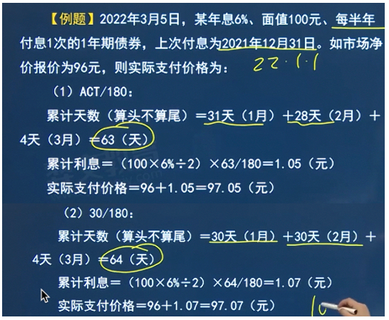
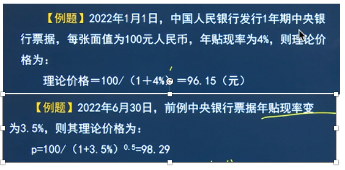
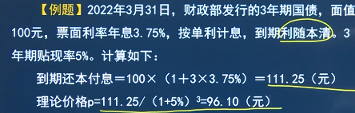

# 5.债券
## 第一节 债券概述

### 5.1.1 债券概述
1. 定义
   1. 是一种**有价证券**，是社会各类经济主体为筹集资金而向债券投资者出具的、
     承诺按一定利率定期支付利息并到期偿还本金的**债权债务凭证**
2. 债券所规定的资金借贷双方的权责关系主要有：
   1. 第一，所借贷货币资金的数额；
   2. 第二，借贷的时间；
   3. 第三，在借贷时间内的**资金成本或应有的补偿**(债券的利息)
3. 债券所规定的借贷双方的**权利义务关系**包含四个方面的含义：
   1. 第一，发行人是**借入资金**的经济主体；
   2. 第二，投资者是**出借资金**的经济主体；
   3. 第三，发行人必须在约定的时间**付息还本**；
   4. 第四，债券反映了发行者和投资者之间的**债权债务关系**，而且是这一关系的**法律凭证**。
4. 债券有以下基本性质：
   1. ①债券属于有价证券。
      1. 首先，债券反映和代表**一定的价值**。
      2. 债券本身有**一定的面值**，通常它是债券投资者投入资金的量化表现；
          另外，持有债券可按期取得利息，利息也是债券投资者收益的价值表现。
      3. 其次，债券与其代表的权利**联系在一起**，拥有债券就拥有了债券所代表的权利，转让债券也就将债券代表的权利一并转移
   2. ②债券是一种虚拟资本。
      1. 债券的流动**并不意味着**它所代表的实际资本也同样流动，债券**独立于**实际资本之外
   3. ③债券是债权的表现
5.特征🌟
    - 偿还性：到期偿还本金，支付利息
    - 流动性：未到期可卖出转让
    - 安全性：风险较低
        - 债券**不能收回投资**的风险有
            - 债务人不履行债务
            - **流通市场风险**（流通市场中债券价格下跌）
    - 收益性：利息收入、资本损益（低买高卖）、再投资收益

### 5.1.2 债券的票面要素
1. 票面价值
   1. 首先要规定票面价值的**币种**；
   2. 此外还要规定债券的票面**金额**
   3. 债券票面金额的确定要根据债券的**发行对象、市场资金供给情况及债券发行费用**等因素综合考虑。
2. 到期期限
   1. 指债券从**发行之日**起至**偿清本息之日止**的时间，也是债券发行人承诺履行合同义务的**全部时间**
3. 票面利率
   1. 票面利率也称**名义利率**，是债券年利息与债券票面价值的比率，通常**年利率用百分数**表示。
4. 发行者名称
   1. 这一要素指明了该债券的**债务主体**
   2. 既明确了**债券发行人**应履行对债权人偿还本息的义务，
   3. 也为债权人到期追索本金和利息**提供了依据**。
5. 其他要素
   1. 有的债券具有**分期偿还**的特征，在债券的票面上或发行公告中附有**分期偿还时间表**；
   2. 有的债券附有**一定的选择权**，即发行契约中赋予债券发行人或持有人具有某种选择的权利，包括附有**赎回选择权条款**的
      债券、附有**出售选择权条款**的债券、附有**可转换条款**的债券、附有**交换条款**的债券、附有**新股认购权条款**的债券等。
      1. ①附有赎回选择权条款的债券表明债券发行人具有在到期日之前买回全部或部分债券的权利；
      2. ②附有出售选择权条款的债券表明债券持有人具有在指定的日期内以票面价值将债券卖回给发行人的权利：
      3. ③附有可转换条款的债券表明债券持有人具有按约定条件将债券转换成发行公司普通股股票的选择权；
      4. ④附有交换条款的债券是指债券持有人具有按约定条件将债券与债券发行公司以外的其他公司的普通股票交换的选择权，
      5. ⑤附有新股认购权条款的债券表明债券持有人具有按约定条件购买债券发行公司新发行的普通股股票的选择权。

   
### 5.1.3 债券分类
- 按发行主体：
  - 政府债券
    - 国债：
      - 中央政府发行
      - 用途是满足由政府投资的公**共设施或重点建设项目**的资金需要和**弥补国家财政赤字**。
    - 政府保证债券：
      - 由一些与**政府有直接关系**的公司或金融机构发行
  - 金融债券（金融机构发行）
    - 目的：用于某种特殊用途；改变本身的资产负债结构 
    - 金融机构资金来源：吸收存款（被动负债）、发行债券(主动负债)
  - 公司债券
    - 目的：主要是为了满足经营需要
    - 公司债券的风险性相对于政府债券和金融债券要大
    - 期限：有中长期的，也有短期的
- 按付息方式🌟
    - 零息债券：无利息
        - 也称零息票债券，指债券合约**未规定利息支付**的债券
        - 一般发行**价低于票面价**值，到期按票面价值回收, **价差的方式获利**
    - 附息债券：**定期支付利息**
        - 按计息方式不同，可分**固定利率债券**和**浮动利率债券**
        - 有些附息债券可根据合约**推迟支付定息利率**，故被称为缓息债券
    - 息票积累债券：
      - 规定票面利率，
      - 一次性获得本息，
      - 存续期间无利息支付
- 按债券形态🌟
    - 实物债券
        - 具**有标准格式实物**券面的债券
        - 以实物券的形式记录债权、面值等，不记名、不挂失、可上市流通
        - 如：无记名国债
    - 凭证式债券（像银行存单）
        - **债权人**认购债券的一种收款凭证，不是债券标准格式
        - 可记名、挂失，以国债收款凭证记录债权，不能上市流通，从购买之日起计息
    - 记账式债券（Excel表）
        - **没有实物形态**，利用**证券账户**通过电脑系统完成债券发行、交易及兑付全过程
        - 记账式国债可以记名、挂失，安全性较高
- 按利率是否固定
    - 固定利率债券
      - 其筹资成本和投资收益可以**事先预计，不确定性较小**
      - 但债券发行人和投资者仍然必须承担**市场利率波动**的风险
    - 浮动利率债券（可抵御通货膨胀，固定利率不行）
      - 指发行时规定债券随市场利率**定期浮动**的债券
      - 考虑到了通货膨胀的影响，可以较好地**抵御通货膨胀**风险
    - 可调利率债券（可变利率债券，根据某些选定的指标定期调整利率）
      - 指在债券存续期内允许根据一些事先选定的参考利率指数的变化，对利率进行定期调整的债券
      - 调整间隔往往事先设定，包括1个月、6个月、1年、2年、3年或5年
- 按期限长短：短期（一年以下）、中期（1-10年）、长期（10年以上）
- 按发行方式：
  - **公募**债券
    - 这种债券的认购者可以是**社会上的任何人**
    - 公开发行公司债券，应当符合下列四个条件：
      - 一是具备健全且运行良好的组
      - 二是最近三年平均可分配利润足以支付公司债券一年的利息：织机构；
      - 三是具有合理的资产负债结构和正常的现金流量；
      - 四是国务院规定的其他条件
  - **私募**债券
    - 在我国，私募公司债券的发行对象为**合格投资者**，每次发行对象**不得超过200人**。
- 按信用状况
    - 利率债：
      - 以**政府信用为基础**或以政府提供偿债支持为基础发行的债券
      - 分类
        - 国债、地方政府债、中央银行发行的票据
        - 国家开发银行等政策性银行发行的金融债
        - 铁路总公司等政府支持机构发行的债券
    - 信用债：以企业的商业信用为基础
      - 定义：以企业的商业信用为基础而发行的债券
      - 分类
        - 非金融企业发行的债券（中期票据、短期融资券、超短期融资券、企业债、普通公司债（包括可交换公司债）
        - 可转换公司债等)和商业性金融机构发行的债券
      - 信用债券与政府债券相比最显著的差异就是**存在信用风险**，所以信用债券比国债有着**更高的收益**
- 我国目前的债券类型
  - (1)财政部负责监管的国债及地方政府债券
  - (2)中国人民银行会同中国银保监会监管的金融债券
  - (3)国家发改委监管的企业债券
  - (4)中国证监会监管的公司债券
  - (5)中国人民银行监管的银行间市场非金融企业债务融资工具

### 5.1.4 债券与股票的异同🌟

- 相同点
    - 都属于**有价证券**
    - 都说**直接融资工具**
- 区别
    - 权利不同
        - 债券：**债券凭证**，债权债务关系，无权参与公司的经营决策
        - 股票：**所有权凭证**，表决权，可参与公司重大事项的审议和表决，行使对公司的经营决策和监督权
    - 发行目的不同
        - 债券：获取的资金属于公司的负债，不是资本金，有**偿还义务**
        - 股票：筹集的资金**列入公司资本**，是股份公司创立和增加资本的需要
    - 主体不同
        - 债券：发行债券的经济主体很多，中央政府，地方政府，金融机构，公司企业
        - 股票：只有**股份有限公司**能发行
    - 期限不同
        - 债券：有期证券，有一定的偿还期限
        - 股票：无期证券，无需偿还
    - 收益不同
        - 债券：通常有规定的**票面利率**，可获得**固定的利息**
        - 股票：股息红利**不固定**，视公司经营情况而定
    - 风险不同 债券：风险相对较小  股票：风险较大
      - 第一，债券利息是公司的**固定支出**，属于费用范围；
         股票的股息红利是公司利润的一部分，公司有**盈利才能支付**，而支付顺序列在债券利息支付和纳税之后。
      - 第二，倘若公司破产，清理资产有余额偿还时，债券偿付在前，股票偿付在后。
      - 第三，在二级市场上，债券因其利率固定、期限固定，市场价格较稳定；
        而股票近固定期限和利率，受各种宏观因素和微观因素的影响，市场价格波动频繁，涨跌幅度较大。

### 5.1.5 政府债券(掌握)
- 定义
    - **政府财政部门或其他代理机构为**筹集资金，以**政府名义**发行的、承诺在一定时期支付利息和到期还本的**债务凭证**
    - 中央政府发行的称**中央政府债券或国债**，地方政府发行的称地方**政府债券**，两者统称为公债
- 性质
  - (1)从**形式**上看，政府债券是一种有价证券，具有债券的一般性质
  - (2)从**功能**上看，是国家实施宏观经济政策、进行宏观调控的工具。
- 特征🌟
    - 安全性高：通常称金边债券
    - 流通性高：不仅可在证交所上市交易，还允许在场外市场买卖
    - 收益稳定
    - 免税待遇：利息免个人所得税
- 中央政府债券
    - 也称国家债券或国债，发行量大、品种多，是政府债券市场上最主要的融资和投资工具
    - 按偿还期限分短期(<1)、中期(1-10)、长期(>10)
    - 按资金用途：**赤字**国债、**建设**国债、战争国债、特种国债（特定政策用）
    - 按流通与否：
      - 流通国债
        - ①是指**可以**在流通市场上**交易**的国债。
        - ②这种国债的特征是投资者可以自由认购、自由转让，通常**不记名**，转让价格取决于对该国债的供给与需求。
      - 非流通国债
        - ①是指**不允许**在流通市场上交易的国债。
        - ②这种国债**不能自由转让**，可以记名，也可以不记名
        - ③以**个人为发行对象**的非流通国债，一般以吸收个人的小额储蓄资金为主，故有时被称为**储蓄债券**。
    - 按币种：本币国债、外币国债
    - 按付息方式：付息国债（有票面利率）、贴现国债（无票面利率，低于票面价值发行）

    - 我国国债的品种，特点 区别
      - 1981年后我国发行的国债品种有**普通国债**及**其他类型国债**。
      - 普通国债：
        - 1**记账式国债**
          - 由财政部面向社会各类投资者、无纸化方式发行、电子记账方式记录债权并可以**上市**和**流通转让**。
          - 可记名、挂失；安全性好；流通性好。
        - 1**储蓄国债（**凭证式)
          - 由财政部发行的、有固定票面利率、通过纸质媒介记录债权债务关系的国债。
          - 发行储蓄国债（凭证式）一般不印制实物券面而采用填制“中华人民共和国储蓄国债（凭证式）收款凭证”的方式
          - 通过部分商业银行和邮政储蓄柜台，面向城乡**居民个人**和**各类投资者**发行
        - 1**储蓄国债（**电子式）
          - 财政部面向境内中国公民**储蓄类资金**发行的、以电子方式记录债权的**不可流通**的人民币债券
          - 特点
            - 针对**个人**投资者；
            - 不向机构投资者发行；
            - 采用实名制，不可流通转让；
            - 采用**电子方式**记录债权；
            - 收益安全稳定，由财政部负责还本付息，免缴利息税；
            - 鼓励持有到期；
            - 手续简化； 
            - 付息方式较为多样。
      - 其他类型国债：国家重点建设债券、国家建设债券、财政债券、特种债券、保值债券、基本建设债券、特别国债、长期建设国债
    - 储蓄国债（电子式）VS储蓄国债（凭证式）
      - 相同点
        - **商业银行柜台**发行，**不能上市流通**
        - 都是信用级别最高的债券，以国家信用作保证
        - 而且免缴利息税。
      - 不同点
        - 第一，申请购买手续不同。
          - ①购买储蓄国债（凭证式）投资者可持现金或个人银行存款直接购买
          - ②购买储蓄国债（电子式）投资者需开立**个人国债托管账户**并指定对应的**资金账户**后购买
        - 第二，**债权记录方式**不同。
          - ①储蓄国债（凭证式）的债权采取填制“中华人民共和国储蓄国债（凭证式）收款凭证”的形式记录，由备承销银行和投资者进行管理。
          - ②储蓄国债（电子式）以**电子记账方式**记录债权，采取**二级托管**体制，由**各承办银行总行**和**中央国债登记结算有限责任**
            公司统一管理，简化投资者保管纸质债权凭证带来的风险。
        - 第三，**付息方式**不同。
          - ①储蓄国债（凭证式）为**到期一次还本付息**。
          - ②储蓄国债（电子式）的付息方式比较多样，既有按年付息品种，也有利随本清品种。常见为**按年付息**，到期还本并且支付最后一年的利息。
        - 第四，**到期兑付方式**不同。
          - ①储蓄国债（凭证式）计息日为购买当日计息)到期后需由投资者前往承销机构网点办理兑付事宜，逾期不加计利息。 
          - ②储蓄国债（电子式）计息日为发行期首目起息，到期后需承办银行自动将投资者应收本金和利息转入其资金账户，转
            入资金账户的本息资金为居民存款按活期存款利率计付利息。
        - 第六，**承办机构**不同。 
          - ①储蓄国债（凭证式）由储蓄国债（凭证式）承销团成员(包括商业银行和邮政储蓄机构)的营业网点销售，且只接受柜台购买。 
          - ②储蓄国债（电子式）承销机构已经逐渐推广到全部储蓄国债（凭证式）承销机构，除了柜台购买之外，投资者还可以
            在部分银行的侧上银行购买。
    - (3)储蓄国债（电子式）VS记账式国债
      - 都以电子记账方式记录债权
      - 不同点
        - 第一，发行对象不同
          - 记账式国债，机构和个人都可以购买
          - 而储蓄国债（电子式)的发行对象仅限于个人
        - 第二，发行利率确定机制不同。
          - 记账式国债的发行利率是由记账式国债承销团成员投标确定的
          - 储蓄国债（电子式）的发行利率由财政部**参照同期银行存款利率及市场供求关系**等因素确定。
        - 第三，流通或变现方式不同。
          - 记账式国债可以上市流通，可以从三级市场上购买，需要资金时可以按照市场价格卖出； 
          - 储蓄国债（电子式）只能在发行期认购，**不可以上市流通**，但可以按照有关规定**提前兑取** 
        - 第四，波动性不同
          - 记账式国债二级市场交易价格是由市场决定的，到期前市场价格（净价）有可能高于或低于发行面值。及
            投资者购买可流通记账式国债要承担市场利率变动带来的价格风险；
          - 而储蓄国债（电子式）投资者不承担由于市场利率变动而带来的价格风险。
- 我国国债的发行情况
  - 普通国债
    - 一是规模越来越大
    - 二是期限趋于多样化。
      - 1年、3年、5年、7年、10年为**关键期限**国债，实现每月一次发行。
    - 三是发行方式趋于市场化
      - 目前，我国国债发行方式包括超标方式(向国债一级承销商发行可上市国债)、承销方式（向商业银行和财政部所属国
        债经营机构等销售不上市的凭证式蓄国债)、定向招募方式(向社会保障机构和保险公司定间出售国债)
  - 其他类型国债
    - 国家重点建设债券；国家建设债券；财政债券；特种债券；保值债券；基本建设债券；特别国债；长期建设国债。

### 5.1.6 地方政府债券

- 定义🌟
    - 地方公债或地方债，是地方政府根据本地区经济发展和资金需求状况，以承担还本付息责任为前提，向社会筹集资金的债务凭证
    - 发行主体是地方政府
    - 筹集的资金一般用于弥补地方财政资金的不足，或者地方兴建大型项目
    - 按资金用途和偿还资金来源
        - 一般债券（普通债券）：为**没有收益的公益性项**目发行，以一般**公共预算**收入还本付息
        - 专项债券（收入债券）：为**有一定收益**的公益性项目发行，以公益性项目对应的政府性**基金或者专项收入**还本付息
- 发行情况
  - (1)2009-2010年：“代发代还”阶段。
  - (2)2011-2013年：“自发代还”阶段。
  - (3)2014年至今：“自发自还”阶段。

### 5.1.7 金融债券
- 定义
    - **银行及非银行金融机构**发行的债券
    - 我国金融债券是指依法在我国境内设立的**金融机构**法人在全国银行间债券市场发行的、按约定还本付息的**有价证券**
    - 金融机构法人包**括政策性银行**、**商业银行**、**企业集团财务**公司及其他金融机构🌟
    - 我国金融债券包括政策性金融债券、商业银行债券、证券公司债券、保险公司债券、财务公司债券和金融租赁公司债券等🌟
- 分类
  - (1)根据利息支付方式不同，金融债券可分为附息金融债券和贴现金融债券。
  - (2)根据发行条件不同，金融债券可分为**普通金融债券**和**累进利息金融债券**。
    - ①普通金融债券**按面值**发行，到期一次性还本付息，期限一般是1年、2年和3年，类似于银行的定期存款，只是利率高些。
    - ②累进利息金融债券的**利率不固定**，在不同时间段有不同的利率，且一年比一年高，即利率随着**债券期限的增加而累进**。
  - 其他分类
    - ①根据期限的长短划分为短期债券、中期债券和长期债券； 
    - ②根据是否记名划分为记名债券和不记名债券； 
    - ③根据担保情况划分为信用债券和担保债券； 
    - ④根据可否提前赎回划分为可提前赎回债券和不可提前赎回债券； 
    - ⑤根据债券票面利率是否变动划分为固定利率债券、浮动利率债券和累进利率债券； 
    - ⑥根据发行人是否给予投资者选择权划分为附有选择权的债券和不附有选择权的债券等。
    
- 政策性金融债券
    - **政策性银行， 开放性金融机构**为筹集资金向国有商业银行、邮政储蓄银行、城商行等机**金融构**发行发行的债券
    - 政策行发行金融债券应**按年**向**人行**报送金融债券发行申请，经**核准后**方可发行🌟
    - 政策性金融债券可在**全国银行间债券市场**和**交易所债券市场**公开发行或定向发行，发行人可以采取**一次足额发**行或**限额**
      内分期发行的方式。

- 商业银行金融债券
    - 概念
      - 指依法在中华人民共和国境内设立的商业银行在**全国银行间债券市场**发行的、按约定还本付息的有价证券。 
      - 商业银行除发行普通的**金融债券**处，还包括**次级债**券、**资本补弃债券**
    - 发行条件
      - 具有良好的公司治理机制
      - 贷款损失准备计提充足；
      - 风险监管指标符合监管机构的有关规定；
      - 核心资本充足率不低于4%🌟
      - 最近三年连续盈利、无重大违法违规行为
    - 种类
        - 商业银行次级债券
            - 商业银行发行的、本金和利息的清偿顺序列于其他负债之后、先于股权资本的债券
            - **公开发行**应具备条件
                - ①实行贷款五级分类，贷款五级分类偏差小；
                - ②核心资本充足率不低于5%；
                - ③贷款损失准备计提充足；
                - ④具有良好的公司治理结构与机制；
                - ⑤最近三年没有重大违法、违规行为。
            - 以**私募**方式发行次级债券或募集次级定期债务
              - ①实行贷款五级分类，贷款五级分类偏差小；
              - ②核心资本充足率不低于4%；
              - ③贷款损失准备计提充足；
              - ④具有良好的公司治理结构与机制；
              - ⑤最近三年没有重大违法、违规行为。
        - 资本补充债券
            - 概念
              - 指银行业金融机构为满足**资本监管要求**而发行的、对**特定触发事件**下债券偿付事宜作出约定的金融债券，
                包括但不限于无固定期限资本债券和二级资本债券。当触发事件发生时，资本补充债券可以实施减记，也可以实施转股。
            - 银行业金融机构发行资本补充债券，应满足以下条件：
              - ①具有完善的公司治理机制；
              - ②偿债能力良好，且成立满三年；
              - ③经营稳健，资产结构符合行业特征，以服务实体经济为导向，遵守国家产业政策和信贷政策；
              - ④满足宏观审慎管理要求，且主要金融监管指标符合监管部门的有关规定

- 证券公司债券🌟
    - **证券公司普通债券**
      - ①证券公司债券
        - 目前证券公司发行普通公司债券的要求和其他公司相同。
    - **证券公司短期融资债券**
        - 证券公司在银行间市场发行的、**期限为1年**以内（含1年）的还本付息的债券。
        - 为弥补短期资金需求发行
        - 实行**余额管理**，待偿还短期融资券余额不超过净资本的60%🌟
    - **证券公司次级债券**
        - 指证券公司向股东或机构投资者**定向借入**的清偿顺序在普通债之后的次级债务，
          以及证券公司向机构投资者发行的、清偿顺序在普通债之后的有价证券
        - 次级债务、次级债券为证券公司同一清偿顺序的债务
        - 证券公司次级债分为长期次级债（期限>1年）和短期次级债(3个月≤期限≤1年)。
        - 长期次级债可按一定比例计入净资本，到期期限在3年、2年、1年以上的，原则上分别按100%、70%、50%的比例计入净资本。短期次级债不计入净资本。
    - **证券公司次级债务**
        - 向股东或机构投资者定向借入的、清偿顺序在普通债之后的次级债务
        
- 保险公司次级债务
    - 定义
      - ①保险公司次级债是指保险公司为了弥补**临时性或者阶段性资本不足**，经批准募集、期限在**5年以上**（含5年），
        且本金和利息的清偿顺序**列于保单责任和其他负债**之后、先于保险公司股权资本的保险公司债务
      - ②保险公司募集次级债所获取的资金，可以计入附属资本，但不得用于弥补保险公司日常经营损失。
        保险公司计入附属资本的次级债金额不得超过净资产的50%。
      - ③保险公司次级债务的偿还只有在确保偿还次级债务本息后偿付能力充足率**不低于100%**的前提下，募集人才能偿付本息；
        并且，募集人在无法按时支付利息或偿还本金时，债权人**无权**向法院申请对募集人实施破产清偿。
    - 管理规定
        - 募集次级债所获取的资金可以计入附属资本
        - 计入附属资本的次级债金额不得超过净资本50%，但不得用于弥补保险公司日常经营损失
        - 保险公司及其股东和其他第三方不得为募集的次级债提供担保

- 财务公司债券、金融租赁公司和汽车金融公司的金融债券
    - 财务公司债券
        - 财务公司发行的金融债券应当由财务公司的母公司或其他有担保能力的成员单位提供**相应担保，**经原银监会批准免于担保的除外
        - 财务公司发行金融债券可在银行间债券市场**公开发行或定向发行**，可采取**一次足额发行**或**限额内分期发行**的方式。

    - 金融租赁公司和汽车金融公司的金融债券
        - 符合条件的金融租赁公司和汽车金融公司可以在**银行间债券市场**发行和交易**金融债券**
        - 金融租赁公司和汽车金融公司**发行金融债券**后，资本充足率均应**不低于8%**。

- 中央银行票据
  - ①一般**不将**中央银行票据列在金融债券之列，但中央银行票据本质上属于**特殊的金融债券**
  - ②中央银行票据简称央票，是中央银行为调节商业银行**超额准备金**而向商业银行发行的**短期债务凭证**，
    是一种重要的货币政策**目常操作工具**，期限通常在**3个月至3年**。
  - ③发行中央银行票据的目的主要是进行**对冲操作**，回收外汇占款所投放的基础货币。
  

### 5.1.8 公司债券

1. 定义
   1. **2015年1月15日**，中国证监会发布的《公司债券发行与交易管理办法》将公司债券发行主体扩大至**所有公司制法人**，
      但其规定的发行主体**不包括地方政府融资平台公司**。
2. 分类
   1. ①按**担保抵押**情况分
      1. 信用公司债券
         1. 不以公司任何资产作为担保而发行的债券，属于**无担保债券**
         2. 除政府债券多数金融债券外，少数大公司经营良好，信誉卓著，也可发行信用公司债券
         3. 为了保护投资者的利益，可要求信用公司债券附有某些限制性条款，如公司债券不得随意增加、债券未清偿之前股东的分红要有限制等。
      2. 不动产抵押公司债券
         1. 不动产抵押公司债券是以公司的**不动产**（如房屋、土地等)作抵押而发行的债券，是**抵押证券**的一种
         2. 当某抵押品价值很大时，可以分为若干次抵押，这样就有第一抵押债券、第二抵押债券等之分
      3. 保证公司债券： 
         1. 保证公司债券是公司发行的**由第三者作为还本付息担保人**的债券，是**担保证券**的一种
         2. 担保人是发行人以外的其他人（或称第三者），如政府信誉好的银行或举债公司的母公司等
         3. 实践中，保证行为常见于**母公司与子公司**之间。
   2. ②按付息方式的不同分为**普通公司债券**和**收益公司债券**： 
      1. 收益公司债券
         1. 是一种特殊债券，利息**只有在公司有盈利**时才支付，即发行公司的利润扣除各项固定支出后的**余额**用作债券利息的来源
         2. 如果余额不足支付，**未付利息可以累加**，待公司收益增加后再补发。所有应付利息付清后，公司才可对股东分红
   3. ③按**内含选择权**的不同
      1. **可转换公司**债券
         1. (1)这种债券附加**转股选择权**，在转换前是公司债券形式，转换后相当于增发了股票
         2. (2)可转换公司债券兼有**债权投资和股权投资**的双重优势
         3. 通常，可转换债券包含赎回条款和回售条款。
            1. ①可赎回债券，是指可转换公司债券发行人拥有是否实施赎回条款选择权的债券。当公司股票价格在一段时间内连续高于转换价格送
               到一定幅度时，公司可以按照事先约定的赎回价格买回发行在处尚未转股的可转换债券
            2. ②可回售债券，指可转换公司债券的持有人是否实施回售条款选择权的债券。当公司的股票价格在一段时间内连续低于转换价格达到
               一定幅度时，可转换公司债券持有人有权按事先约定的价格将所持可转债卖给发行人
         4. (3)可转债的转换价格在三种情况下可以进行调整
            1. 一是当公司发生派送股票股利、转增股本、增发新股或配股、派送现金股利等情况（不包括因可转债转股而增加的股本），将按相关公式进行转股价格的调整：
            2. 二是当公司发生股份回购、合并、分立或任何其他情形使公司股份类别、数量或股东权益发生变化从而可能影响可转债持有人的债权利益或转股衍生权益时，
               将视具体情况按照公平、公正、公允的原则以及充分保护可转债持有人权益的原则调整转股价格：
            3. 三是在可转债存续期间，当公司股票在**任意连续30个交易日中有15个交易日**的收盘价低于当期转股价格一定比例(80%一85%)时，
               公司董事会有权提出转股价格**向下修正方案**并提交公司股东会审议表决。
      2. **附认股权证**的公司债券
         1. (1)这种债券的**购买者**可以按预先规定的条件在公司发行股票时**享有优先购买权**
         2. (2)按照附认股权和债券本身能否分开来划分，这种债券有两种类型：
            1. 一种是**可分离型**附认股权证的公司债券，债券与认股权可以分离，可独立转让。
            2. 另一种是**非分离型**附认股权证的公司债券，即不能把认股权从债券上分离，认股权**不能成为独立买卖的对象**
      3. **可转换公司**债券
         1. (1)**上市公司的股东**依法发行、在一定期限内依据约定的条件**可以交换成该股东所持有的**上市公司股份的公司债券。
         2. (2)可交换债券与可转换债券的相同之处是**发行要素相似**，也包括票面利率、期限、换股价格和换股比率、换股期限等。
   4. 按是否记名可分为**记名公司债券**和**不记名**公司债券；
   5. 按持有人是否参加公司利润分配可分为**参加公司**债券和**非参加**公司债券
   6. 按是否可提前赎回可分为**可提前赎回**公司债券和**不可提前赎**回公司债券
   7. 按发行方式可分为**公募公司**债券和**私募公司**债券等
3. 可交换债券和可转换债券的区别
   1. (1)**发行主体不同**：可交换债券的发行主体是上市公司的股东，而可转换债券的发行主体是上市公司本身；
   2. (2)用于转股的**股份来源**不同：可交换债券的股份来源是 发行人持有的其他公司已发行在外的股份，
      而可转换债券的股份来源通常是发行人本身未来将发行的新股：
   3. (3)转股**对公司股本的影响**不同：可交换债券的转股**不会影响**标的股票总股本的数量，而可转换债券的转股会使标的股票**总股本扩大**。
   
### 5.1.9 企业债券

1. 定义 
   1. 按照《企业债券管理条例》规定发行与交易的，由**国家发改委监督管理**的，约定在一定期限内还本付息的有价证券
   2. 发行主题
      1. 股份有限公司，
      2. 可以是有限责任公司，
      3. 也可以是尚未改制为现代公司制度的企业法人，但不包括上市公司(公司债）
2. 分类
   1. 城投债企业债券
      1. 城投债是指通过设立隶属于地方政府的企业作为**融资平台**，发行由**地方政府财政收入或地方政府信用**对债券提供**隐性担保**，
         募集资金用于地方**基础设施建设**的债券，有时也被视为是“准市政债”。
   2. 产业类企业债券
      1. 主要指具有自主经营能力、盈利能力及现金流产生能力，对政府及政策依赖性相对较弱的**大中型国有及民营企业**发行的、
          募集资金投向与其**生产经营相关**领域的企业债券。
   3. 集合类企业债券
      1. 指以多个发行人**作为联合发行主体**，按照“统一组织、分别负债、统一担保、集合发行”的原则**共同发行**的企业债券

3. 种类
    - 普通企业债券
    - 中小企业集合债券：
      - 中小企业集合在一起发行的
      - 中小企业集合债券是指**同一区域内**由当地政府国资部门(或发改委、金融办、中小企业服务局)等**政府职能**部门作为牵头人组织、
        以多个中小企业**构成联合发行主体**，若干个中小企业各自确定债券发行额度，采用集合债券的形式，使用**统一的债券名称**，
        形成一个**总发行额度**而发行的约定到期还本付息的一种企业债券。
    - 小微企业增信集合债券与创投企业债券
        - **地方性融资平台或国有企业**发行向机构投资者发行的，所融资金通过银行委托给小微企业或初创企业
        - 《小微企业增信集合债券发行管理规定》提出，对小微债募集资金委托贷款集中度的要求为：
          - 对单个委贷对象发放的委贷资金累计余额**不得超过1000万元**，且不得超过小微债募集资金规模的**3%**。
          - 同一控制人下的企业，合计获得委贷资金不得超过上述规定数额和比例。

    - 可续期企业债券：
      - 是指在约定的计息周期（一般3~5年）**到期**时，发行人可按约定的利率调整机制**调整利率**后，**继续**延长一个周期的企业债券
      - 理论上可不断续期永续存在，具有**期限超长、主动赎回、可充当资本金**等诸多优势。
    - 项目收益债券
    - 专项债券
        - 指债券募集资金**用于特定项目**的债券
        - 专项债券不是某一个债券品种，它可以是普通企业债券，也可以是创新的项目收益债券、永续债券、债贷组合债券等
    - 债贷组合🌟
        - 由银行为企业制定系统性融资规划，根据项目建设融资需求，将**企业债券和贷款**统一纳入银行综合授信管理体系，对企业债务融资实施**全程管理**
        - 按照“融资统一规划、信贷统一授信、动态长效监控、全程风险管理”模式
        
4. 我国**非金融机构债务融资工具**🌟

    - --具有法人资格的非金融机构在银行间债券市场发行的债券
    - 种类
        - 短期融资券（1年内还本付息）/超级短期融资券（270天以内）
        - 中期票据
            - 按照计划分期发行的
            - 一般期限在1-10年，我国通常3年或者5年
            - 待偿还余额不得超过企业净资产的40%
        - 非公开定向债务融资工具：非公开定向方式发行
        - 中小非金融企业集合票据
            - 2-10个具有法人资格的企业
            - 统一产品设计、统一券种冠名、统一信用增进、统一注册发行

5. 我国非金融企业债务融资工具的品种和管理规定
   1. (1)银行间债券市场的非金融企业债务融资工具有以下特点： 
      1. ①融资工具**发行对象**均为作为银行间债券市场成员的机构投资者；
      2. ②融资工具发行参与方包括审计师事务所、律师事务所、主承销商、评级机构、增信机构等中介服务机构；
      3. ③**定价市场化**，融资工具的发行利率根据企业和融资工具**级别**、银行间市场资金面情况等要素，
         由发行人和主承销商协商决定，通常**低于**银行贷款基准利率；
      4. ④发行方式**市场化**，依照中国银行间市场交易商协会相关工作指引注册发行，通常**一次注册**拟发行的全部额度，
         此后可根据资金需求及市场情况**分批发行**，无须再作审批，但需要将相关分期发行信息**上报备案**
      5. ⑤在上海清算交易所**登记托管**，在中央国债登记结算有限责任公司**结算**，全国银行间**同业拆借中心**为债务融资工具在银
         行间债券市场的**交易提供服务**。
   2. (2)短期融资券/超级短期融资券
      1. ①**短期融资券**：具有法人资格的非金融企业**在银行间债券市**场发行的，约定在1年内还本付息的债务融资工具
      2. ②超级短期融资券：具有法人资格的非金融企业在**银行间债券**市场发行的，约定**270天以**在内还本付息的债务融资工具
   3. (3)中期票据
      1. ①具有法人资格的非金融企业在银行间债券市场发行的，约定在一定期限还本付息的债务融资工具
      2. ②中期票据的期限一般为**1年以上、10年以下**，我国中期票据的期限通常为**3年或者5年**。
      3. ③中期票据待偿还余额不得超过企业**净资产的40%**
      4. ④企业发行中期票据所募集的资金**应用于企业生产经营活动**，并在发行文件中明确**披露资金具体用途**
      5. ⑤企业在中期票据存续期内变更募集资金用途**应提前披露**。
   4. (4)非公开定向债务融资工具 
      1. ①非公开定向发行：是指具有法人资格的非金融企业，向银行间市场特定机构投资人发行债务融资工具，并在特定机构投资人范围内流通转让的行为。 
      2. ②非公开定向债务融资工具：是指在银行间债券市场以**非公开定向**发行方式发行的债务融资工具。 
   5. （5）中小非金融企业集合票据
      - 2-10个具有法人资格的企业
      - 统一产品设计、统一券种冠名、统一信用增进、统一注册发行

6. 企业债券和公司债券的区别
   1. 发行主体不同
      1. 企业债券：股份有限公司和有限责任公司，也可以是尚未改制为公司制的企业法人，但**不包括**上市公司
      2. 公司债券：所有公司制法人
   2. 发行制度和监管机构不同
       1. 企业债券
          1. 由核准制改为注册制，**国家发改委**为注册机关。中央国债登记结算有限责任公司为受理机构，
          2. 中央国债登记结算有限责任公司、中国银行间市场交易商协会为**审核机构**
       2. 公司债券：
          1. 由核准制改为注册制。
          2. 公开发行公司债券由证券交易所负责受理、审核，
          3. 报中国证监会注册。
   3. 募集资金用途不同
       1. 企业债券：主要限制在**固定资产投资和技术革新改造方面**，并与政府部门审批的项目道接相连
       2. 公司债券：
          1. 由**发行人自行**决定，不强制与项目挂钩，包括可以用于偿还银行贷款、改善财务结构等股东大会核准的用途，
          2. 除金融类企业外，募集资金**不得转借他人**。
   4. 发行期限不同
       1. 企业债券：3～20年，以**10年**为主
       2. 公司债券：为3~10年，以5年为主
   5. 发行定价方式不同
       1. 企业债券：发债利率不高于同期银行存款利率的40%
       2. 公司债券：由发行人和保荐人通过市场询价确定
   6. 担保要求不同
       1. 企业债券：包括无担保信用债券、资产抵押债券、第三方担保债券，实践中企业债券相对较多地**采取了担保**的方式
       2. 公司债券：大部分是无担保信用债
   7. 发行市场不同
       1. 企业债券：包括**银行间**债券市场和**证券交易所**市场
       2. 公司债券：为证券交易所市场

### 5.1.10 国际债券

1. 定义
   1. 在国际证券市场上**以外币为面值、向外国投资者发行**的债券
2. 特征🌟
       - 资金来源广、发行规模大
       - 存在**汇率风险**
       - 有国家主权保障
       - 以**自由兑换货币**作为计量货币（国际债券的计价货币以美元、英镑、欧元、日元和瑞士法郎为主）🌟
3. 分类
    - 外国债券
        - --在**外国发行**的以**该国货币**为面值的债券
        - 特点：债券发行人属于一个国家，债券的面额货币和发行市场属于**另一个国家**
        - 分类🌟
            - 扬基债券（在美国发行）、武士债券（日）、熊猫债券（中）、猛犬债券（英）
    - 欧洲债券--无国籍债券
        - --在境外市场发行的、**不以发行市场所在国**货币为面值的国际债券
        - 债券发行者， 发行地点， 债券面值所使用的货币 **可属于不同的国家**
        - 使用的货币一般是可自由兑换的货币，主要为美元，其次有欧元、英镑、日元等；
        - 也有使用复合货币单位的，如特别提款权（SDR）🌟
    - 欧洲债券和外国债券的差异
        - 发行方式
            - 外：由发行地所在国的金融机构、证券公司承销
            - 欧：一家或几家大银行牵头，组织国际性银行在一个国际或者几个国家**同时承销**
        - 发行法律
            - 外：受**发行地所在国**有关法规的管制和约束，必须经官方主管机构批准
            - 欧：不受，不需批准
        - 发行纳税
            - 外：受**发行地所在**国的税法管制
            - 欧：预扣税一般可以豁免，投资者的利息收入也免缴所得税
4. 我国国际债券的发行概况 
   1. 我国发行国际债券始于**20世纪80年代初期**。 
   2. 政府债券 
      1. ①1**987年10月**，财政部在德国法兰克福发行了3亿德国马克的公募债券，这是我国经济体制改革后政府**首次**在国外发行债券。 
      2. ②1994年7月，我国政府在日本发行公募债券。
      3. ③1996年，我国政府成功地在美国发行4亿美元100年期扬基债券。 
   3. 金融债券和公司债券---目前中国企业发行境外债券总体可以分为三类：
      1. 第一类是在境外市场以非人民币发行和结算的债券，被称为非人民币债券，比如美元债券
      2. 第二类是以人民币发行、以人民币结算的债券，被称为**点心债**。 
      3. 第三类是以人民币发行、以其他国货币结算的债券，被称为合成型债券。
      

### 5.1.11 资产证券化

1. 定义
   1. 以**特定资产组合或特定现金流**为支持，发行可交易证券的一种**融资形式**
   2. 传统的证券发行是**以企业为基础**，而资产证券化是**以特定的资产池**为基础发行证券。
2. 分类
   1. (1)根据**基础资产**分类。
      1. 不动产证券化、应收账款证券化、信贷资产证券化、未来收益证券化（如高速公路收费）、债券组合证券化等类别。
   2. (2)根据资产证券化的**地域**分类。
      1. **境内资产证券化**和**离岸资产证券化**
   3. (3)根据证券化**产品的属性**分类。
      1. 股权型证券化、 债权型证券化和混合型证券化。
3. 证券公司和基金管理公司子公司开展资产证券化业务的**要求**
   1. (1)开展资产证券化业务的证券公司须**具备客户资产管理业务资格**，
      基金管理公司子公司须由证券投资基金管理公司设立且具备**特定客户资产管理业务资格**
   2. (2)证券公司、基金管理公司子公司通过设立**特殊目的载体**开展资产证券化业务
      1. 所称“特殊目的载体”，是指证券公司、基金管理公司子公司为开展资产证券化业务专门设立的资产支持专项计划或者
         中国证监会认可的其他特殊目的载体。
   3. (3)因**专项计划资产**的管理、运用、处分或者其他情形而取得的财产，归入专项计划资产。因处理专项计划事务所支
      出的费用、对第三人所负债务，以**专项计划资产承担**
   4. (4)专项计划资产**独立于**原始权益人、管理人、托管人及其他业务参与人的固有财产。
      1. 原始权益人、管理人、托管人及其他业务参与人因依法解散、被依法撤销或者宣告破产等原因进行清算的，专项计划资产**不属于其清算财产**

4. 资产证券化参与者🌟
    - 发起人：资产证券化的**起点**，是基础资产的**原始权益人**， 也是基础资产的**卖方**
    - 特殊目的机构（SPV）：
      - 以资产证券化为目的而特别组建的**独立法律主体**，其负债主要是发行的资产支持证券，资产则是被证券化的基础资产。
      - 介于发起人和投资者之间，是资产支持证券的**真正发行人**
    - 信用增级机构：
      - 负责提升证券化产品的信用等级
      - 可以通过**内部增级**（通过资产本身增级，最主要方式是超额抵押）和**外部增级**（找第三方提供额外担保增进）两种方式
      - 信用增级机构由发起人或独立的第三方担任
    - 信用评级机构：
      - 如果发行的证券化产品属于**债券**，发行前**必须**经过评级机构进行信用评级
      - 除了初始评级以外，信用评级机构在该证券的**整个存续期内**往往还需要对其业绩情况**进行“追踪”监督**。
    - 承销商：
      - 负责**证券设计**和**发行承销**的投资银行
      - 在证券设计阶段，作为承销商的投资银行一般还扮演**财务顾问**的角色，运用其经验和技能形成一个既能在最大程度
        上保护发起人的利益又能被投资者接受的**融资方案**。
    - 服务机构：对资产项目及其所产生的现金流进行监理和保管
      - 对资产项目及其所产生的现金流进行**监理和保管**：
      - 负责收取这些资产到期的**本金和利息**，将其交付予受托人；
      - 对过期欠账服务机构**进行催收**，确保资金及时、足额到位；
      - 定期向受托管理人和投资者提供有关特定资产组合的财务报告。服务机构通常由**发起人**担任。
    - 受托人：托管资产组合及与之相关一切权利，代表投资者行使职能
      - 把服务机构存入SPV账户中的现金流转付给投资者；
      - 对没有立即转付的款项进行再投资监督证券化中交易各方的行为，定期审查有关资产组合情况的信息，
        确认服务机构提供的各种报告的真实性，并向投资者披露；
      - 公布违约事宜，并采取保护投资者利益的法律行为
      - 当服务机构不能履行其职责时，替代服务人担当其职责。

5. 资产证券化的具体操作要求
   1. 重组现金流，构造证券化资产
      1. 发起人（一般是发放贷款的金融机构，也称为原始权益人）根据自身的资产证券化融资要求，确定资产证券化目标，对自
         己拥有的能够产生未：现金收入流的信贷资产进行清理、估算和考核，最后将这些资产汇集形成一个**资产池**
   2. 组建特殊目的机构，实现**真实出售**，达到**破产隔离**
      1. 特殊目的机构是一个以资产证券化为唯一目的的、独立的**信托实体**，有时也可以由发起人设立
      2. 注册后的特殊目的机构的活动受法律的严格限制，其资本化程度很低，资金全部来源于发行证券的收入
   3. 完善交易结构，进行信用增级
      1. 为完善资产证券化的交易结构，**特设信托机构**要完成与发起人指定的**资产池服务**公司签订**贷款服务合同**、与发起人一起
         确定托管银行并签订**托管合同**、与银行达成必要时提供流动性支持的周转协议、与券商达成承销协议等一系列的程序。
      2. 同时，特设信托机构对证券化资产进行一定风险分析后，就必须对一定的资产集合进行**风险结构的重组**，并通过**额外**的
          现金流来源对可**预见的损失**进行弥补，以降低可预见的信用风险，提高资产支持证券的信用等级。
   4. 资产支持证券的信用评级
      1. 评级由国际资本市场上广大投资者承认的**独立私营评级机构**进行，
      2. 评级考虑因素**不包括**由利率变动等因素导致的市场风险，而**主要考虑资产的信用风险**
   5. 安排证券销售，向发起人支付
      1. 在信用提高和评级结果向投资者公布之后，**承销商**负责向投资者销售资产支持证券，销售的方式可采用**包销或代销**
      2. 特殊目的机构从承销商处获取证券发行收入后，按约定的购买价格，把发行收入的大部分**支付给发起人**。
         至此，发起人的筹资目的已经达到
   6. 挂牌上市交易及到期支付
      1. 资产支持证券从**发行完毕**到证券交易所**申请挂牌上市后**，即实现了**金融机构**的信贷资产流动性的目的，但资产证券化的工作并没有全部完成
      2. 发起人要指定一个资产池管理公司或亲自对资产池进行管理，负责收取、记录由资产池产生的现金收入，并将这些收款全部存入托管行的**收款专户**
6. 资产支持证券概念及分类
   1. 概念
      1. 资产证券化过程中发行的**以资产池为基础**的证券
      2. 通过资产证券化，将**流动性较低**的资产（如银行贷款、应收账款、房地产等)转化为具有**较高流动性**的可交易证券，
         提高了基础资产的流动性，便于投资者进行投资，还可以改变发起人的资产结构，改善资产质量，加快发起人资金周转。
      - 美国通常将基于房地产抵押贷款的证券化产品特称为MBS，其余的称为ABS
      - 美国住宅抵押贷款支持证券（RMBS）分为五类🌟
          - 优级贷款、Alt-A贷款、次级贷款、住房权益贷款、机构担保贷款
   2. 基本分类
      1. (1)银行的债权资产
         1. 住房抵押贷款、商业地产抵押贷款、信用卡贷款、汽车贷款、企业贷款
      2. (2)企业的债权资产
         1. 应收账款、设备租赁
7. 资产证券化的主要产品
   1. MBS
      1. (1) **住房**抵押贷款支持证券(RMBS)
      2. (2) **商业地产**抵押贷款支持证券(CBS)
   2. ABS
      1. (1)狭义的ABS
         1. 主要是基于某一类同质资产，如汽车贷款、信用卡贷款、学生贷款、设备租赁等为标的资产的证券化产品，
            也有**期限在一年以下**的资产支持商业票据
      2. (2)担保债务凭证(CDO)
         1. ①对应的基础资产则是一系列的**债务工具**，如高息债券、新兴市场企业债或国家债券、银行贷款。
         2. ②CDO又可根据债务工具的不同分为**担保债券凭证**(CBO)和**担保贷款**凭证(CLO)
8. 我国资产证券化的主要产品
   1. 信贷资产证券化
      1. 由**银行业金融机构**（商业银行、政策性银行、汽车金融公司、金融租赁公司等)作为**发起机构**，以**信托计划**为$PV的表
         外模式，将信贷资产信托给**受托机构**，受托机构以资产支持证券的形式向投资机构发行受益证券
      2. 基础资产是原中国银监会监管下金融机构的信贷资产，如个人住房抵押贷款、基础设施建设贷款、地方政府融资平台贷
         款、中小企业贷款等。交易场所通常为银行间债券市场。
   2. 企业资产证券化
      1. 主要是证券公司或是基金子公司专项资产管理计划，具体指证券公司面向境内机构投资者推广**资产支持收益凭证**，用所
         募集的资金按照约定购买原始权益人能够产生可预期稳定现金流的**基础资产**
      2. 基础资产为企业所拥有的债权及收益权资产，例如企业应收款、信贷资产、信托受益权、基础设施收益权等财产权利，
         商业票据、债券、股票及其衍生品等有价证券，商业物业等不动产财产
      3. 通常在位易所交易，应当符合《证券公司资产证券化专项 资产管理计划规定》
   3. 资产支持票据
      1. 指非金融企业在**银行间债券市场**发行的，将**特定基础资产**的未来现金流在当前变现的一种融资工具
      2. 基础资产通常是公用事业未来收益权、政府回购应收款、企业其他应收款，在银行间债券市场或是交易所实现交易
9. 我国资产证券化发展历史
   1. 我国资产证券化根据监管机构的不同可分为：
      1. 受央行和原中国银监会监管的**信贷资产**证券化
      2. 银行间市场交易商协会主导的**资产支持**票据(ABN)
      3. 受中国证监会监管的**企业资产**证券化业务
      4. 受原中国保监会监管的**保险**资产证券化

- 资产证券化兴起的经济动因
    - 从发起人角度🌟
        - 增加资产的流动性，提高资本使用效率
        - 提升资产负债管理能力，优化财务状况
        - 实现低成本融资
        - 增加收入来源
    - 从投资者角度

        - 提供多样化的投资品种
        - 提供更多的合规投资
        - 降低资本要求，扩大投资规模

## 第二节 债券的发行

### 5.2.1 国债的发行与承销（掌握）
1. 国债的发行方式
    - 竞争性招标方式
        - 包括单一价格、修正的多重价格招标方式（即混合式），招标标的为利率或价格🌟
        - 一般用于记账式国债
        - 定义
          - 竞争性招标方式是通过投标人的**直接竟价**来确定发行价格(或利率)水平。
        - 竞标规则
          - (1)国债承销团成员应当按照**发行系统客户端**提示按时报送国债投标需求。
          - (2)**竞标时间**。如无特殊规定，竞争性招标时间为招标日上午10：35~11：35。
          - (3)**利率格式**。
            - 竞争性招标确定的**票面利率**（百分数）保留2位小数，
            - 1年(含)以下期限国债发行价格（以元为单位）保留3位小数，
            - 1年（不含）以上期限国债发行价格保留2位小数。
          - (4)**招标方式**：净性招标方式包括**单一价格**、修正的多重价格招标方式(即混合式)，招标标的为利率或价格。
            - 单一价格招标🌟
              - 标的为利率时，全场最高中标利率为当期（次）国债票面利率，各中标国债承销团成员均按面值承销
              - 标的为价格时，全场最低中标价格为当期（次）国债发行价格，各中标机构均按发行价格承销
              - 投标限定
                  - 投标标位变动幅度：利率招标时，标位变动幅度为0.01%
                  - 最高投标额：国债承销团甲类-35%；乙类-25%
                  - 最低投标额：4%；1.5%
                  - 最低承销额：1%；0.2%
            - 修正的多重价格：全场平均中标利率/价格
              - 标的为利率时，全场加权平均中标利率四舍五入后为当期（次）国债票面利率，低于或等于票面利率的中标标位，按面值承销；
                高于票面利率的中标标位，按各中标标位的利率与票面利率折算的价格承销。
              - 标的为价格时，全场加权平均中标价格四舍五入后为当期(次)国债发行价格，高于或等于发行价格的中标标位，
                按发行价格承销；低于发行价格的中标标位，按各中标标位的价格承销。
          - (5)**投标限定**
            - ①投标标位变动幅度。利率招标时，标位变动幅度为0.01%。
            - ②投标标位差。
              - 每一国债承销团成员最高、最低投标标位差不得大于当期(次)国债发行文件规定的投标标位差
            - ③投标剔除。
              - 背离全场加权平均投标利率或价格一定数量以上（不含本数)的标位为无效投标，**全部落标**，
                不参与全场加权平均中标利率或价格的计算。
            - ④中标剔除
              - 标的为利率时，高于全场加权平均中标利率**一定数量**以上(不含本数)的标位，全部落标；
              - 标的为价格时，低于全场加权平均中标价格一定数量以上（不含本数）的标位，全部落标
            - ⑤**单一标位限制**
              - 单一标位最低投标限额为0.1亿元
              - 当期（次）国债竞争性招标额在500亿元以上（不含本数时，单一标位**最高投标限额**为当期（次）国债竞争性招标额的10%；
              - 当期（次）国债竞争性招标额在500亿元以下（含本数）时，单一标位最高投标**限额为50亿元**
              - 投标量变动幅度为0.1亿元的整数倍。
            - ⑥**最高投标限额**
              - 国债承销团甲类成员最高投标限额为当期（次）国债竞争性招标额的35%。
              - 国债承销团乙类成员最高投标限额为当期（次）国债竞争性招标额的25%。
              - 上述比例均计算至0.1亿元，0.1亿元以下四舍五入。
          - (6)**中标原则**
            - 竞争性招标标的为利率或价格，国债承销团成员在每个利率或价格上的投标为一个标位，
              除另有规定外，利率招标时，标位变动幅度为0.01%；价格招标时，标位变动幅度在国债发行通知中规定。
            - 财政部按**照低利率或高价格**优先的原则对有效投标逐笔募入，直到募满招标额或将全部有效投标募完为止**，募入即为中标**。
            - 最高中标利率标位或最低中标价格标位上的投标额大于剩余招标额，以国债承销团成员在该标位投标额为权重平均分配，
              取整至0.1亿元，尾数按投标时间优先原则分配。
          - (7)追加投标
            - 如无特殊规定，**10年期以下期限（含）记账式国**债可以进行追加发行。竞争性招标结束后20分钟内，国债承销团甲类成
              员有权通过投标追加承销当期（次）国债。
            - 追加投标为**数量投标**，国债承销团甲类成员按照竞争性招标确定的票面利率或发行价格承销。国债承销团甲类成员追加承销额上限为该成员当期
              （次）国债竞争性中标额的50%，且不能超出该成员当期（次）国债最低承销额，计算至0.1亿元，
              0.1亿元以下四舍五入。追加承销额应为0.1亿元的整数倍。
          - (8)国债承销团成员应承担最低投标、承销义务
            - 以下比例均计算至0.01亿元，0.01亿元以下四舍五入
            - 国债承销团甲类成员**最低投标**为当期（次）国债竞争性招标额的4%，乙类为1.5%
            - 国债承销团甲类成员**最低承销额**（含追加承销部分）为当期（次）国债竞争性招标额的1%，乙类为0.2%
          - (9)债权确立
            - 国债承销团成员应当按照国债发行通知规定缴纳发行款
            - 财政部收到发行款后，**托管机构**为认购人办理债权登记、托管手续
          - (10)应急投标
            - 如果发行系统客户端出现技术问题，国债承销团成员可以将内容齐全的“记账式国债发行应急投标书”或“记账式国债
              债权托管应急申请书”传真至国债公司，委托国债公司代为投标或债权托管。
    - 承购包销方式
        - 大宗机构投资者组成承购包销团，按一定条件向财政部承购包销国债，并由其负责在市场上转售，任何未能售出的余额均由承销者包购
    - 代销方式
      - 概念
        - 代销方式，指由国债发行主体委托代销者**代为向社会出售债券**的方式
        - 代销期终止，若有未销出余额，则**全部退给**发行主体，代销者不承担任何风险与责任
        - 我国储蓄国债（电子式）、储蓄国债（凭证式）均采用代销方式发行

### 5.2.2 记账式国债和凭证式国债的承销程序

1. **记账式**国债的承销程序
   1. 招标发行
      1. 记账式国债是一种**无纸化国债**，主要通过银行间债券市场向具备全国银行间债券市场国债承购包销团资格的商业银行、
         证券公司、保险公司、信托投资公司等机构，以及通过证交所的交易系统向具备交易所国债承购包销资格的证券公司、
          保险公司和信托投资公司及其他投资者发行
      2. 分销
         1. 交易所市场发行国债的分销：**场内挂牌**分销或**场外**分销
         2. 银行间债券市场发行国债的分销：中央国债登记结算有限公司办理分销债券过户
            1. 在发行过程中，承销人的分销总额**以其承销总额**为限。
            2. 如发生超卖，中央国债登记结算有限责任公司将**不予办理过户**，
                并书面报中国人民银行和发行人
2. **凭证式**国债的承销程序
   1. ①凭证式国债是一种**不可上市流通**的储蓄型债券，由具备凭证式国债承销团资格的机构承销
   2. ②财政部和中国人民银行一般每年确定一次凭证式国债承销团资格，
      各类**商业银行、邮政储蓄银行**均有资格申请加入凭证式国债承销团🌟
   3. ③承销商在分得所承销的国债后，通过各自的代理网点发售。发售采取向购买人开具凭证式国债收款凭证的方式，
       发售数量不能突破所承销的国债量
   4. ④承担凭证式国债发行任务的各个系统一般每月要汇总本系统内的**累计发行数额**，上报**财政部及中国人民银行**🌟
3. 国债销售的价格和影响国债销售价格的因素
   1. 价格
      1. 财政部允许承销商在发行期内自定销售价格，随行就市发行
   2. 影响因素
      1. 市场利率
         1. 市场利率趋于上升，就限制了承销商确定销售价格的空间，反之亦反
      2. 承销商承销国债的中标成本
         1. 国债销售的价格一般**不应低于**承销商与发行人的结算价格；反之，就有可能发生亏损
      3. 流通市场中可比国债的收益率水平
         1. 国债承销价格定价过高，即收益率过低，投资者就会倾向于在二级市场上购买已流通的国债，
            而不是直接购买新发行的国债
      4. 国债承销的手续费收入
         1. 由于该项手续费收入的存在，为了促进分销活动，承销商有可能压低销售价格
      5. 承销商所期望的资金回收速度
         1. 降低销售价格，承销商的分销过程会缩短，资金的回收速度会加快，承销商可以通过获取这部分资金占用其中的利息收入来降低总成本，提高收益
      6. 其他国债分销过程中的成本
         1. 一般国债分销中的其他成本越高，销售价格越高

### 5.2.3 地方政府债券的发行与承销

1. 财政部代理发行地方政府债券
    - 发行方式
        - 通过全国银行间债券市场和证交所债券市场面向社会**各类投资者**发行。
        - 地方政府债券**面向记账式国债承销团**招标发行
        - 采用**单一价格**招标方式，招标标的为**利率**，全场最高中标利率为当期地方债票面利率，各中标承销团成员**按面值承销**
    - 投标限定
        - 投标标位变动幅度：投标标位变动幅度为**0.01%**
        - 最高投标量：国债承销团甲类-35%；乙类-10%
        - 最低投标量：4%；1%
        - 最低承销额：1%；0.2%
        - 单一标位投标量：单一标位最低投标限额为0.2亿元，投标量最小变动幅度为0.1亿元，最高投标限额为30亿元
    - 债权登记和托管
      - 托管机构
        - 在招标结束后15分钟内，各中标承销团成员应通过招标系统填制债权托管申请书，
          在中央国债登记结算有限责任公司和中国证券登记结算有限责任公司上海分公司、深圳分公司**选择托管**
      - 券种注册和承销额度注册
        - 中央国债登记结算有限责任公司和中国证券登记结算有限责任公司上海分公司、深圳分公司根据招标结果办理券种注册，
          根据各中标承销团成员选择的债券托管数据为各中标机构**办理承销额度注册**。
      - 债权确立
        - 地方债债权确立实行**见款付券**方式。
    - 债券分销
        - 分销方式
          - 地方债采取**场内挂牌、场外签订分销合同**的方式分销（同记账式国债）
        - 分销对象
          - 地方债分销对象为在中央国债登记结算有限责任公司**开立债券账户**及在中国证券登记结算有限责任公司开立**股票和基金账户**的各类投资者
          - 债券承销团成员间不得分销。非债券承销团成员通过分销获得的地方债债券额度，**在分销期内不得转让**
        - 分销价格
          - 债券承销团成员根据市场情况**自定价格分销**。
        - 国债承销团成员间不得分销🌟
        
2. 地方政府自行发债
   1. 地方政府一般债券
      1. 定义：一般债券采用**记账式固定利率付息**形式，地方政府一般债券实行**自发自还**，债券资金收支**列入一般公共预算管理**
   2. 债券期限
      1. 一般债券期限为1年、3年、5年、7年和10年，但单一期限债券的发行规模不得超过一般债券**当年发行规模的30%**
   3. 债券承销
      1. 各地组建一般债券承销团，承销团成员应当是在中国境内依法成立的**金融机构**，
         具有债券承销业务资格，资本充足率、偿付能力或者净资本状况等指标达到监管标准。
   4. 债券发还
      1. 一般债券发行利率采用承销、招标等方式确定
      2. 采用承销或招标方式的，发行利率在承销或招标日前1~5个工作日**相同待偿期**记账式国债的**平均收益率之上**确定
   5. 债券评级
      1. 各地按照有关规定开展一般债券信用评级，择优选择信用评级机构
   6. 债券托管
      1. 一般债券应当在**中央国债登记结算有限责任公司**办理总**登记托管**，在国家规定的证券登记结算机构办理分登记托管
3. 地方政府专项债券
   1. 债券期限
      1. 专项债券期限为1年、2年、3年、5年、7年和10年
      2. 但7年和10年期债券的合计发行规模不得超过专项债券**全年发行规模的50%**
   2. 债券承销
      1. 各地组建专项债券承销团
      2. 承销团成员应当是在中国境内依法成立的**金融机构**，具有债券承销业务资格，资本充足率、偿付能力或者净资本状况等指标达到监管标准
   3. 债券发还
      1. 专项债券收入、安排的支出、还本付息、发行费用纳入**政府性基金预算管理**
   4. 债券评级和信息披露
      1. 各地按照有关规定开展专项债券信用评级，择优选择信用评级机构
   5. 债券托管
      1. 专项债券应当在**中央国债登记结算**有限责任公司办理总登记托管，在国家规定的**证券登记结算机构**办理分登记托管。
      2. 专项债券发行**结束后**，符合条件的应按有关规定及时在**全国银行间债券市场、证券交易所债券市场**等上市交易
4. 财政部代理发行地方政府债券和地方政府自行发债的异同
   1. 发**行方式**不同
      1. **财政部**代理发行地方政府债券采用**招标方式**，
      2. **地方政府**自行发债采用**招标方式**或**承销方式**。
   2. 债**券发还**不同
      1. **财政部**代理发行地方政府债券由**财政部**代理发行**并代办还本付息**和**支付发行费**
      2. **地方政府**自行发债为**自发自还**
   3. 托**管单位**不同。
      1. **财政部**代理发行地方政府债券在**中央国债登记结算有限责任公**司及**中国证券登记结算有**限责任公司**上海、深圳**分公司选择托管，
      2. **地方政府**自行发债在**中央结算公司办理**总登记托管，在国家规定的**证券登记结算机构**办理分登记托管

### 5.2.4 金融债券的发行与承销

1. 发行条件
    - 政策性银行：按年向**人行**报送发行申请，经**核准**后便可发行
    - 商业银行：
      - ①具有良好的公司治理机制
      - ②核心资本充足率**不低于4%**
      - ③**最近3年**连续盈利
      - ④贷款损失准备计提充足
      - ⑤风险监管指标符合监管机构的有关规定
      - ⑥**最近3年**没有重大违法、违规行为
      - ⑦中国人民银行要求的其他条件
    - 企业集团财务公司：发行金融债券后，资本充足率不低于10%
      - ①具有良好的公司治理结构、完善的投资决策机制、健全有效的内部管理和风险控制制度及相应的管理信息系统
      - ②具有从事金融债券发行的合格专业人员
      - ③依法合规经营，符合原中国银监会有关**审慎监管**的要求，**风险监管指标**符合监管机构的有关规定
      - ④财务公司**已发行、尚未兑付**的金融债券总额不得超过**其净资产总额的100%**，
         发行金融债券后，资本充足率**不低于10%**
      - ⑤财务公司**设立1年以上**，经营状况良好，**申请前1年**利润率**不低于**行业平均水平，且有稳定的盈利预期
      - ⑥申请**前1年**，不良资产率**低于**行业平均水平，资产损失准备拨备充足
      - ⑦申请**前1年**，注册资本金**不低于**3亿元，净资产不低于行业平均水平
      - ⑧**近3年**无重大违法违规记录
      - ⑨无到期不能支付债务
      - ⑩中国人民银行和原中国银监会规定的其他条件
    - 金融租赁公司和汽车金融公司
      - ①具有良好的公司治理结构、完善的内部控制体系和健的风险管理制度
      - ②资本充足率**不低于**监管部门的最低要求
      - ③最近3年连续盈利。④风险监管指标符合审慎监管要求
      - ⑤最近3年没有重大违法、违规行为
      - ⑥中国人民银行和中国银监会要求的其他条件
      - 对于资质良好但成立**未满3年**的金融租赁公司，可由具有担保能力的担保人提供担保

2. 金融债券发行的操作要求
   1. 发行方式
       - 可在全国银行间债券市场**公开发行或定向发行**
       - 可以采取**一次足额**发行或**限额内分期**发行的方式
   2. 担保要求
      1. ①**商业银行**发行金融债券**没有强制性**担保要求
      2. ②财务公司发行金融债券需要由财务公司的母公司或其他有担保能力的成员单位**提供相应**担保
      3. ③商业银行设立的金融租赁公司，资质良好**但成立不满3年**的，应由具有担保能力的担保人提供担保
   3. 信用评级
      1. ①金融债券的发行**应由**具有债券评级能力的信用评级机构进行信用评级
      2. ②金融债券发行后，信用评级机构应**每年**对该金融债券进行**跟踪信用评级**
   4. 发行组织
      1. 发行金融债券时，发行人**应组建承销团**，承销人可以在**发行期**内向其他投资者**分销**其所承销的金融债券
   5. 异常情况处理（报央行）--**多选**
      1. ①发行人业务、财务等经营状况发生重大变化
      2. ②高级管理人员变更
      3. ③控制人变更
      4. ④发行人作出新的债券融资决定
      5. ⑤发行人变更承销商、会计师事务所、律师事务所或信用评级机构等专业机构
      6. ⑥是否分期发行、每期发行安排等金融债券**发行方案变更**
      7. ⑦其他可能影响投资人作出正确判断的重大变化
   6. 其他相关事项
      1. ①发行人不得认购或变相认购**自己发行**的金融债券
      2. ②发行人应在中国人民银行核准金融债券发行之日起**60个工作**日内开始发行金融债券，并在规定期限内完成发行
      3. ③金融债券发行结束后**10个工作日**内，发行人应向中国人民银行书面报告金融债券发行情况
      4. ④金融债券**定向发行**的，经认购人同意，可免于信用评级。 定向发行的金融债券只能在**认购人之间**进行转让
   7. 发行规定
       - 发行人不得认购或变相认购自己发行的金融债券
       - 发行人应在人行核准金融债券发行之日起60个工作日内开始发行金额债券，并在规定期限内完成发行
       - 发行结束10个工作日内，发行人应向人行书面报告发行情况

3. 金融债券的登记、托管与兑付
   1. (1)**中央国债登记结算**有限责任公司为金融债券的登记、托管机构
   2. (2)金融债券**发行结束后**，发行人应及时向中央国债登记结算有限责任公司**确认债权债务关系**，
      由中央国债登记结算有限责任公**司及时办理**债券登记工作
   3. (3)金融债券付息或兑付日前（含当日），发行人应将相应资金划入债券持有人指定的资金账户

### 5.2.4 次级债务的概念和募集方式

- 商业银行次级债务
    - 由银行发行的，固定期限**不低于5年**（含），除非银行倒闭或清算，不**用于弥补银行日常经营损失**，
      且该项债务的索偿权排在存款和其他负债之后的商业银行**长期债务**🌟
    - 募集方式：商业银行向目标债权人**定向募集**，目标债券人为**企业法人**
    - 商业银行不得向目标债权人指派，不得在对外营销中使用“储蓄”字样。次级定期债务不得与其他债权相抵销；
    - 原则上**不得转让、提前赎回**
- 保险公司次级债券
    - 保险公司为了弥补临时性或者阶段性资本不足，经批准募集，期限在5年以上（含），且本金和利息的清偿顺序列于保单责任和其他负债之后，先于保险公司股权资本的保险公司债务
    - 募集方式：保险公司次级债务的偿还只有在确保偿还次级债务本息后偿付能力充足率不低于100%的前提下，募集人才能偿付本息
- 证券公司次级债务
    - --证券公司经批准向股东或其他符合条件的机构投资者定向借入的，清偿顺序在普通债务之后，先于证券公司股权资本的债务
    - 分为长期次级债务（>=1）和短期次级债务（3个月以上，<1年）
    - 长期次级债可按一定比例计入净资本，短期次级债不计入净资本
    - 仅可在公司开展有关特定业务时按规定和要求**扣减风险资本**准备
- 混合资本债券的概念、募集方式🌟
    - 我国的混合资本债券是商业银行为**补充附属资本**发行的、清偿顺序位于**股权资本之前**但列于一般债券和次级债务之后、期限在15年以上、发行之日起10年内不可赎回的债券
    - 募集方式：商业银行发行应向人行报送的发行申请文件，除了包括起发行金融债券的内容之外，还应同时报送近3年按监管部门要求计算的资本充足率信息和其他债务本息偿还情况

### 5.2.5 企业债券的发行和承销

1. 企业债券的发行条件
    - **企业规模**达到国家规定的要求
    - 企业财务会计制度符合国家规定
    - 具有偿债能力
    - 企业经济效益良好，发行企业债券前**连续3年盈利**🌟
    - 企业发行企业债券的**总面额**不得大于该企业的**自有资产净值**🌟
    - 所筹资金用途**符合国家产业政策**
    - 发改委规定：应具备健全且运行良好的组织机构，**最近3年**平均可分配利润足以支付**企业债券1年的利息**，应当具有合理的资产负债结构和正常的现金流量🌟

2. 企业债券募集资金的投向
    - 用于本企业的生产经营
    - 不得用于**房地产买卖、股票买卖和期货交易**等与本企业生产经营**无关的风险性投资**
    - 投向符合**国家宏观调控政策**和**产业政策**的项目建设
    - 用于固定资产投资项目的，要求**省级发展改革部门**应对募投项目出具**专项意见**，并承担相应责任

3. 公司债券的发行条件
    - 采用注册制（同企业）
    - 具备健全且运行良好的组织机构
    - **最近3年**平均可分配利润足以支付公司债券**1年**的利息
    - 具有合理的资产负债结构和正常的现金流量；
    - 国务院规定的其他条件
    - 公开发行公司债券，由**证券交易所**负责受理、审核，并报**中国证监会**注册。
4. 公司债券募集资金的投向
    - **必须按照**公司债券募集办法**所列资金用途**使用
    - **改变**资金用途必须经**债券持有人会议**作出决议
    - **不得**用于**弥补亏损和非生产性**支出
    - 发行人应当指定**专项账户**，用于公司债券募集资金的接收、存储、划转。
5. 公司债券不得再次发行的情形《证券法》
    - 对已公开发行的公司债券或者其他债务**有违约或者延迟支付本息**的事实，仍处于继续状况
    - 违反《证券法》规定，**改变**公开发行公司债券所募**资金的用途**

6. 资信状况符合以下标准的**公开发行**公司债券，**专业投资者和普通投资者**可以参与认购：
   1. ①发行人**最近三年**无债务违约或者延迟支付本息的事实
   2. ②发行人**最近三年**平均可分配利润不少于债券一年利息的**1.5倍**
   3. ③发行人**最近一期末**净资产规模不少于250亿元
   4. ④发行人**最近36个月内**累计公开发行债券**不少于3期**，发行规模**不少于100亿元**
   5. ⑤中国证监会根据投资者保护的需要规定的其他条件
   6. 未达到前款规定标准的公开发行公司债券，**仅限于专业投资者**参与认购。
   
7. 企业债券发行的条款设计要求及其他安排
    - 信用评级（可以）：**可以向**经认可的债券评级机构申请信用评级
    - 发行规模：总面额不得大于该企业的**自有资产净值**
    - 期限：一般为**一年以上**
    - 利率：不得高于银行相同期限居民储蓄定期存款利率的**40%**🌟
    - 担保（非强制要求）：可发行**无担保信用债券、资产抵押债券、第三方担保债券**
    - 承销：应当由**证券经营机构**承销，企业不得自行销售企业债券
    - 法律意见书：发行人应当聘请律师事务所对发行人企业债券的条件和合规性进行法律鉴证，并出具法律意见书。

8. 公司债券发行的条款设计要求及其他安排
    - 发行价格：发行的价格或利率以**询价或公开招标等市场化方式**确定
    - 发行方式：
      - 可**公开**发行，可**非公开**发行。
      - 公开发行的可以申请一次核准，分期发行
      - 中国证监会同意注册的决定自作出之日**起2年内**有效。
      - 公开发行公司债券的募集说明书自最后签署之日起**6个月内**有效。
    - 信用评级：
      - 应当委托经证监会认定的、具有从事证券服务业务资格的资信评级机构进行
      - 公司债券的期限为1年以上的，在债券有效存续期间，应当每年至少向市场公布1次定期跟踪评级报告
    - 增信
      - 发行人可采取**内外部增信机制、偿债保障措施**，提高偿债能力，控制公司债券风险。
    - 担保：非强制性要求
    - 其他：债券募集说明书及其他信息披露文件所引用的审计报告、资产评估报告、评级报告，应当由具有从事证券服务业务资格的机构出具🌟

9. 非公开发行公司债券的特殊安排
   1. (1)非公开发行的公司债券应当向专业投资者发分**不得**采用广告、**公开劝诱**和**变相公开**方式，每次发行对象**不得超过200人**
   2. (2)承销机构应当按照中国证监会、证券自律组织规定的**投资者适当性制度**，了解和评估投资者对非公开发行公司债券的风险识别和承担能力，
       确认参与非公开发行公司债券认购的投资者为专业投资者，并充分揭示风险。
   3. (3)非公开发行公司债券，承销机构或自行销售的发行人应当在每次发行完成后**5个工作日**内向中国证券业协会报备。
   4. (4)非公开发行公司债券，可以申请在证券交易场所、证券公司柜台转让。非公开发行的公司债券仅限于在专业投资者范围内转让。
      转让后，持有同次发行债券的投资者合计不**得超过200人**。
   5. (5)非公开发行公司债券，募集资金应当用于**约定的用途**；改变资金用途，应当履行募集说明书**约定的程序**。

### 5.2.6 企业短期融资证券和中期票据的注册规则，承销组织

1. 短期融资融券
   1. 发行注册
      1. ①**中国银行间市场交易商协会**负责受理企业债务融资工具的发行注册，交易商协会设注册委员会，注册委员会通过**注册会议**
         行使职责，注册会议决定是否接受发行注册
      2. ②注册会议原则上**每周召开一次**，注册会议由5名注册委员会委员参加。
      3. ③交易商协会向接受注册的企业出具“接受注册通知书” 注册**有效期为2年**
      4. ④企业的主体信用级别**低于**发行注册时信用级别的，短期融资券发行注册**自动失效**，交易商协会将有关情况**进行公告**
      5. ⑤企业在注册有效期内需**更换**主承销商或**变更**注册金额的，应**重新注册**。
      6. ⑥交易商协会不接受注册的，企业可于**6个月后**重新提交注册文件
   2. 发行的操作要求
      - **承销组织**：应由符合条件的**金融机构**承销，企业可自主选择主承销商，需要组织承销团的，由**主承销商**组织
      - **信用评级**：应披露**企业主体信用评级**和当期融资券的**债项评级**
      - **登记、托管、结算**
        - **中央结算公司**负责债务融资工具登记、托管、结算的**日常监测**，**每月汇总**债务融资工具发行、登记、托管、结算、兑付
          等情况，**向交易商协会报送**
        - **全国银行间同业拆借中心**为债务融资工具在银行间债券市场的**交易提供服务**
        - 短期融资券在债权债务登记日**次一个工作日**即可在全国银行间债券**市场机构投资者**之间流通转让
      - 债务融资工具发行利率、发行价格和所涉费率**以市场化**方式确定，
         任何商业机构不得以欺诈、操纵市场等行为获取不正当利益。
2. 中期票据🌟
   1. 发行注册
      1. 企业发行中期票据应依据《银行间债券市场非金融企业债务融资工具注册规则》在**交易商协会注册**，相关要深同短期融资券
      2. 在注册有效期内，企业主体信用级别**低于**发行注册时信用级别的，中期票据发行注册**自动失效**，交易商协会将有关情况**进行公告**
   2. 承销的组织
      1. 企业发行中期票据应由符合条件的**承销机构**承销
      2. **中期票据投资者**可就特定投资需求向主承销商进行**逆向询价**，
         主承销商可与企业协商发行符合特定需求的中期票据
3. 中小非金融企业集合票据
   1. 定义
      1. **2-10个**具有法人资格的中小非金融企业在银行间债券市场以统一产品设计、统一券种冠名、统一信用增进、统一发行注册方式共同发行的，
         约定在一定期限还本付息的债务融资工作
   2. 特点
      1. ①分别负债、集合发行
      2. ②发行期限灵活
      3. ③引入信用增进机制
   3. 发行规模
      1. **中小非金融企业**发行集合票据，应在交易商协会注册，**一次注册、一次发行**
      2. 任一企业集合票据**待偿还余额**不得超过该企业净资产的**40%**
      3. 任一企业集合票据募集资金额**不超过2亿**元，单只集合票据注册金额**不超过10亿元**
   4. 偿债保障措施
      1. 中小非金融企业发行集合票据**应制定偿债保障措施**，
      2. 并在发行文件中披露，包括**信用增进措施**、**资金偿付**安排以及**其他偿债保障**措施
   5. 中小非金融企业集合票据的评级要求
      1. 企业发行集合票据**应披露**集合票据**债项评级**
      2. 各企业主体**信用评级**以及**专业信用**增进机构（若有）主体信用评级
   6. 投资者保护机制🌟
      1. 企业应在集合票据发行文件中**约定投资者保护机制**，包括应对任一企业及信用增进机构主体信用评级下降或财务状况恶
         化、**集合票据债项评级下降**以及其他可能影响投资者利益情况的有效措施。
      2. 在注册有效期内，对于已注册但**尚未发行**的集合票据，债项信用级别低于发行注册时信用级别的，集合票据发行注册**自动失效**，
         交易商协会将有关情况进行公告

### 5.2.7 证券公司债券的发行与承销

1. 规定🌟
   1. 在《公司债券发行与交易管理办告》下规范，关于其发行条件、条款设计、发行的申报程序、申请文件等要求同**公司债券**的相关规定
2. 发行条件
   - 借入或募集资金**有合理用途**
   - 次级债应**以现金**或证监会认可的其他形式借入或融入
   - 借入或发行次级债券数额应符合
   - 长期次级债计入净资本的数额不得超过净资本（不含长期次级债累计计入净资本的数额）**的50%**🌟
   - 净资本与负债的比例、净资产与负债的比例等各项风险控制指标**不触及预警标准**
   - 募集说明书内容或次级债券合同条款符合证券公司监管规定
3. 登记、托管和结算
   1. 证券公司债券应当由**证券登记结算公司**负责登记、托管和结算。
   2. 经批准**国债登记结算公司**也可以负责证券公司债券的登记、托管和结算。
   3. **公开发行**的债券应当申请在**证券交易所**挂牌**集中竞价交易**，经中国证监会批准的，也可采取其他方式转让
4. 债券申请上市条件
   1. ①债券发行申请已获批准并发行完毕
   2. ②实际发行债券的面值总额**不少于5000万元**
   3. ③申请上市时仍符合**公开发行**的条件
   4. ④中国证监会规定的其他条件
   5. 上市债券到**期前1个月终止**上市交易，由发行人办理兑付事宜
5. 债券转让要求
   1. **定向发行**的债券可采取**协议方式转让**，也可经中国证监会批准采取其他方式转让 
   2. 最小转让单位**不得少于面值50万元**
   3. 债券的转让应当在**合格投资者之间**进行，且应当符合转让场所的业务规则。

### 5.2.8 国际开发机构人民币债券发行与承销

1. 定义
   1. 国际开发机构（提供国际开发贷款或投资的机构）依法在中国境内发行的、约定在一定期限内还本付息的、以人民币计价的债券
2. 审批体制
   1. **接受申请**：**财政部**
   2. **审核**：财政部，央行，发改委，证监会
   3. **同意**：国务院
   4. **审核资金用途**：国家发改委和财政不
   5. **发行利率管理**：中国人民银行
   6. **外汇相关管理**：国家外汇管理局
3. 发债机构应具备条件🌟
    - 财务稳健，资信良好，经**两家以上（含）**评级公司评级，
      其中至少应有一家评级公司在中国境内注册且具备人民币债券评级能力，人民债券信用评级为AA级（或相当于AA级）以上
    - 已为中国境内项目或企业提供的贷款和股本资金在**10亿美金**以上，经国务院批准予以豁免的除外
    - 所募集资金用于**向中国境内**的建设项目提供中长期固定资产贷款或提供股本资金，投资项目符合国家产业政策、利用外资政策和固定资产投资管理规定
    - 主权外债（外国政府或国际金额组织提供的贷款）项目应列入相关国外贷款规划
4. 会计标准与法律要求
   1. 发行人民币债券的国际开发机构应当**按照中国企业会计准则编制**财务报告，其财务报告应经中国**具有证券、期货资格**的会计师事务所进行审计
   2. 国际开发机构发行人民币债券须由按照《中华人民共和国律师法》执业的律师进行法律认证，并出具**法律意见书**。
5. 债券的承销
   1. 国际开发机构在中国境内公开发行人民币债券应**组成承销团**，承销商应为在**中国境内**设立的具备债券承销资格的**金融机构**。
6. 利率的确定
   1. 人民币债券的发行利率由发行人参照**同期国债收益率水平**确定，并由**中国人民银行**核定

## 第三节 债券交易

### 5.3.1 债券交易的概念和流程

1. 债券交易的方式及流程
    - 现券交易：**即期交易**，证券买卖双方在成交后就**办理交收手续**，即二级市场的债券交易
    - 回购交易
        - --债券的买卖双方在成交的同时，**约定未来**某一时间以某一约定价格双方再进行**反向交易**的行为
        - 流程🌟
            - 回购交易是**质押贷款**的一种方式，通常用于**政府债券**上
            - 投资者从**价格差**中得利
            - 是一种超短期的金融工具，具有短期融资的属性；长的有几周，通常只有24h
            - 从运作方式看，结合了**现货交易**和**远期交易**的特点，通常在债券交易中运用
    - 远期交易：双方约定在未来某一时刻按照现在确定的价格买卖标的债券的行为
    - 期货交易
        - --在期货交易所进行的标准化的远期交易，即交易双方在集中性的市场以公开竞价方式所进行的期货合约的交易
        - 期货交易VS远期交易🌟
            - 交易场所不同：远，场外交易；期，交易所内交易
            - 合约规范性不同：远，所有事项都要由双方协商确定；期，标准化合约
            - 交易风险不同：远，无价格风险，存在信用风险；期，无信用风险，只有价格变动风险
            - 保证金制度不同：远，双方确定，无统一性；期：按规定比例缴纳
            - 履约责任不同：远：如要中途取消必须双方同意，实物交割比例极高；期：具备对冲机制，履约回旋余地较大，实物交割比例较低

2. 现券交易与远期交易
   1. (1)远期交易买卖双方必须**签订**远期合同，而现券交易则无此必要
   2. (2)远期交易买卖双方进行商品交收或交割的时间与达成交易的时间，通常有**较长的间隔**，相差的时间达几个月很常见，有时甚至达一年或一年以上。
      而现券交易通常是现买现卖，**即时交收或交割**，即便有一定的时间间隔，也比较短。
   3. (3)远期交易往往要通过正式的磋商、谈判，双方达成一致意见签订合同之后才算成立，
       而现券交易随机性较大，方便灵活，没有严格的**交易程序**
3. 远期交易与期货交易
   1. (1)交易场所不同
      1. 期货合约在**交易所内**交易，具有**公开性**，
      2. 远期合约在**场外进行**交易
   2. (2)合约的规范性不同
      1. 期货合约是**标准化合约**，除了价格，合约的品种、规格、质量、交货地点、结算方式等有**统一规定**
      2. 远期合约的所有事项都要由交易双方**一一协商确定**，谈判复杂，但**适应性强**
   3. (3)交易风险不同
      1. **期货合约**的结算通过专门的结算公司，这是独立于买卖双方的第三方，投资者无须对对方负责，不存在信用风险，而只有**价格变动**的风险
      2. **远期合约须到期**才交割实物、货款早就谈妥不再变动，**故无价格风险**，它的风险来自届时对方是否真的前来履约，实物
         交割后是否有能力付款等，即存**在信用风险**
   4. (4)保证金制度不同
      1. **期货合约**交易双方**按规定比例缴纳保证金**，
      2. 而**远期合约**因不是标准化，存在信用风险，保证金（或被称为定金）是否要付、付多少，也都由交易双方确定，**无统一性**。
   5. (5)履约责任不同
      1. 期货合约**具备对冲机制** 履约回旋余地较大，实物交割比例极低，交易价格受最小价格变动单位限定和日交易振幅限定
      2. 远期合约如要中途取消，**必须双方同意**，任何单方面意愿是无法取消合约的，其实物交割比例极高。
4. 债券报价的主要方式
   1. 债券买卖交易中有**公开报价、对话报价、双边报价和小额报价**四种报研方式
   2. 前二者属于询价交易方式的范畴，后二者可通过点击确认、单向撮合的方式成交。

### 5.3.2 债券的开户、交易、清算、交割的概念及有关规定

1. 开户
   1. 在投资者与**证券公司**订立合同后，就可以开立账户，为自己从事债券交易作准备
2. 交易：证券公司在接受投资者的有效委托后，通过**卫星**直接传至**交易所主机**进行撮合成交。
   1. (1)债券成交的原则
      1. ①价格优先就是证券公司按照交易**最有利于投资委托人利益的价格**买进或卖出债券；
      2. ②时间优先就是要求在相同的价格申报时，应该与**最早提出该价格的一方**成交
      3. ③客户委托优先主要是要求证券公司在自营买卖和代理买卖之间，首先进行**代理买卖**。
3. 竞价的方式
   1. 证券交易所的交易价格按竟价的方式进行，竞价方式包括**口头报唱、板牌竞价以及计算机终端申报竞价**三种。
4. 清算
   1. 债券的清算是指对在**同一交割日同一种债券**的买和卖**相互抵销**
   2. 确定应当交割的**债券数量**和应当交割的**价款数额**
   3. 然后按照“净额交收”原则办理债券和价款的交割。
5. 交割
   1. 在证券交易所交易的债券，按照交割日期的不同，可分为 **当日交割、普通日交割和约定日交割**三种
   2. 目前，深圳证券交易所和上海证券交易所规定为**当日交割，**即在买卖成交当天办理券款交割手续。

### 5.3.3 债券登记、托管、兑付及付息的有关规定

1. 债券登记
   1. 债券登记是指债券登记结算机构为债券发行人建立和维护**债券持有人名册**的行为，也就是证券要素和证券权利的记录和确认。
2. 债券托管
   1. 中华人民共和国境内的商业银行及授权分行、信托投资公司、企业集团财务公司、金融租赁公司、农村信用社、城市信用社、证券公司、基金管理公司及其管理的各类基金、保险公
      司、外资金融机构以及经金融监管当局批准可投资于债券资产的其他金融机树均可在中央国债登记结算有限责任公司（中央结算公司)、银行闯市场清算所股份有限公司（上海清算所）
      和中国证券登记结算公司（中国结算公司）按**实名制原则**以自己名义开立**债券托管账户**。债券托管量等于已经发行但**尚未到期的债券总量**。
3. 债券兑付和付息
   1. 债券兑付是**偿还本金**，债券付息是**支付利息**
   2. 一般情况下，债券有五种兑付方式：**到期兑付、提前兑付、债券替换、分期兑付和转换为普通股兑付**
   3. 债券利息的支付方式主要有三种：**息票方式**（剪息票方式）、**折扣利息**、**本息合一**方式。

### 5.3.4 债券评级

1. 定义与内涵
    - 以企业或经济主体发行的**有价债券**为对象进行的信用评级。
    - 这种信用评级为投资者购买债券和证券市场债券的流通转让活动提供信息服务
    - 债券信用评级大多是**企业债券信用评级**，是对具有独立法人资格企业所发行某一特定债券、按期还本付息的**可靠程度**
      进行客观公正的评估，**并标示其信用程度的等级**
2. 证券评级业务是指对下列评级对象开展资信评级服务🌟
   1. ①经中国证监会依法注册发行的债券、资产支持证券
   2. ②在证券交易所或者经中国证监会认可的其他证券交易场所**上市交易**或者**挂牌转让**的债券、资产支持证券，（国债除外
   3. ③前两项规定的证券的发行人、发起机构、上市公司、非上市公众公司、证券期货经营机构
   4. ④中国证监会规定的其他评级对象。
   5. 对同一类评级对象评级，或者对同一评级对象跟踪评级，应当采用**一致的评级标准和工作程序**。
3. 鼓励**具备下列条件**的资信评级机构开展证券评级业务
   1. ①实收资本与净资产**均超过**人民币2000万元
   2. ②有**20名以上**证券从业人员，其中**10名以上**具有**3年以上**资信评级业务经验、**3名以上**具备**中国注册会计师**资格
   3. ③有**3名以上**熟悉资信评级业务有关的专业知识，且通过资质测试的**高级管理人员**
   4. ④**最近5年**未受到刑事处罚，**最近3年**未因违法经营受到行政处罚，不存在因涉嫌违法经营、犯罪正在被调查的情形
   5. ⑤**最近3年**在税务、工商、金融等行政管理机关，以及自律组织、商业银行等机构**无重大不良诚信记录**
   6. ⑥中国证监会基于保护投资者、维护社会公共利益规定的其他条件

4. 等级标准及主要内容🌟
    -  银行间债券市场中长期债券信用评级（**三等九级**）
        - AAA，AA，A，BBB，BB，B，CCC，CC，C
        - 除AAA，和CCC以下（含）等级外，每级可用+，-微调
    - 银行间债券市场短期债券信用等级（四等六级，**不可微调**）
        - A-1，A-2，A-3，B，C，D

5. 等级标准及主要内容
    - 主要内容：企业素质、经营能力、获利能力、偿债能力、履约情况、发展前景🌟（企业发展、经营获利、履约偿债）

- 信用评级的程序

    - 评级准备

        - 需成立评级项目组
        - 项目组实行组长负责制，至少由两名评级分析人员组成
        - 组长应具备证券从业资格，且从事自信评级业务3年以上

    - ->实地调查->初评阶段->
    - 评定等级

        - 需召开信用登记评审会议
        - 参与评审委员不得少于5人
        - 评审委员应签署利益冲突回避承诺书

    - ->结果反馈(5工作日内)与复评->结果发布->文件存档->
    - 跟踪评级：每年至少出具一次定期跟踪评级报告

### 5.3.5 债券市场（熟悉）
1. 发展情况
   1. 银行间债券市场的发展情况
      1. 银行间债券市场是指依托于中国外汇交易中心暨**全国银行间同业拆借中心**和**中央国债登记结算有限责任公司**的，
         包括商业银行、农村信用联社、保险公司、证券公司等**金融机构**以及一些**非金融机构合格投资人**通过北京金融资产交易所进行债券买卖和回购的市场
      2. 银行间债券市场目前已成为我国债券市场的**主体部分**，记账式国债的大部分和政策性金融债券都在该市场发行并上市交易
   2. 交易所债券市场的发展情况
      1. 作为集中性市场，**上海**证券交易所是**最早**开办债券交易的场所
      2. 交易所市场实行的是**集中撮合竞价**与**经纪商**制度，采用**电脑集合竞价**、**连续竞价**和**大宗交易**的方式
   3. 商业银行柜台债券市场的发展情况
      1. 商业银行柜台债券市场，是指商业银行通过**营业网点**(含电子银行系统)与投资人进行债券买卖，并办理相关托管与结算等业务的市场。
      2. 商业银行柜台债券市场是银行间债券市场的延伸，该市场**只进行现券交易**，参与者也**限定为个人投资者**，属于**场外零售市场**
      3. 目前，我国商业银行柜台债券市场主要有**储蓄国债**（电子式)业务和**柜台流通式**债券业务等两类业务
      4. 商业银行拒台市场采用**二级托管体制**，中央结算公司为一级托管机构，柜台业务开办机构为二级托管机构。
2. 交易方式
    - 银行间债券市场
        - 询价交易
            - 交易双方**自行协商**确定交易价格，包括**报价、格式化询价和确认成交**三步骤
            - 最低交易量为券面总额**10万**，交易量**最小变动单位**为券面**总额10万**
        - 点击成交交易
            - 报价方报价，买方点击成交
            - 最低交易量为券面总额100万，交易量最小变动单位为券面总额10万
    - 交易所债券市场
        - 竞价**撮合交易**（系统帮助撮合成交）
        - 场外交易：交易所的固定收益电子平台定位于机构投资者，为**大额现券交易**提供服务
        - ②交易所的**固定收益电子平台**定位于**机构投资者**，为**大额现券交易**提供服务。
          - 该平台包括两层市场
            - 一层为交易商之间的市场，采用**报价制和询价制**
            - 另一层为**交易商与普通投资者**之间的市场，采用协议交易的模式，通过成交申报进行交易
        - ③交易所市场的竞价和询价系统之间也可以进行交易，但本系统内债券实行T+0交易模式，跨系统实行T+1交易模式，即
          当日通过竞价系统买入的债券，可于当日通过该系统卖出，但要于次一交易日才能通过固定收益综合电子平台卖出。

3. 托管方式
   - 银行间债券市场
     - 是场外市场，实行一级、二级综合托管账户模式
     - **中央国债登记结算有限责任公司**是指定的**中央债券存管**机构
   - 交易所市场
       - 实行“中央登记、二级托管”的制度🌟
       - 市场中所有证券在中国证券登记结算公司登记，并记录所有权的转义过程
       - 投资者参与证券市场必须通过有**资格的证券公司**，并将资产托管给证券公司代理交易结算

4. 结算方式
    - 银行间：
      - 采用实时**全额逐笔**结算机制，
      - 统一通过中央国债登记结算有限责任公司的中央债券综合业务系统完成
      - 全额结算采用**券款对付**的结算方式，同步办理券和款的交割和清算、结算。
    - 交易所：
      - 采取中央对手方的**净额结算机制**，
      - 由中国证券登记结算有限公司负责债券交易的**清算、结算**，并作为交易双方共同的对手方提供交收担保
      - 在固定收益电子平台实现的成交，清算模式有两种：**交易商之间**达成的交易和**交易商与客户**达成的交易。

5. 债券市场转托管的定义及条件
    - 定义
      - 同一投资人开立的**两个托管账户**之间的托管债券的转移
    - 条件：
      - 跨市场交易的债券
        - 除了**国债**（包括付息国债和地方债）和**企业债**，其他债券品种**不能**跨市场转托管
      - 转托管条件
        - 银行间市场可在工作日内的8：30～16：30实时办理转出、转入业务，
        - 但交易所市场必须在15：00前完成转入或转出指令的录入，才能保证客户在次一个工作日可以使用转入或转出的债券。
      - 转托管的速度
        - 最快的国债转托管T+1日到账，其他大部分债券T+2甚至T+3

6. 债券市场互联互通与对外开放
   1. “债券通”是让中国境内与境外投资者通过在香港地区建立的基础设施联接，在对方市场买卖债券，包括
      北向通及南向通。
   

## 第四节 债券估值

### 5.4.1 债券估值原理
1. 债券现金流的确定
   1. 债券的面值和票面利率
      1. 票面利率通常采**年单利**表示,票面利率乘以**付息间隔**和**债券面值**即得到每期利息支付金额。
      2. 短期债券一般不付息，而是到期一次性还本，因此要**折价交易**
   2. 计付息间隔
      1. 债券在存续期内定期支付利息，我国发行的各类中长期债券通常**每年付息**一次， 
      2. 欧美国家则习惯半年付息一次。付息间隔短的债券，**风险相对较小**
   3. 债券的嵌入式期权条款
      1. 通常，债券条款中可能包含发行人提前赎回权、债券持有人提前返售权、转股权、转股修正权、偿债基金条款等嵌入式
         期权。这些条款极大地影响了债券的未来现金流模式。
      2. 一般来说，凡是有利于发行人的条款都会相应降低债券价值；反之，有利于持有人的条款则会提高债券价值
   4. 债券的税收待遇
      1. 投资者拿到的实际上是**税后现金流**，因此，免税债券（如政府债券)与可比的应纳税债券
        （如公司债券、资产证券化债券等等)相比，价值大一些。
   5. 其他因素
      1. 债券的利率类型（浮动利率、固定利率），债券的币种(单一货币、双币债券)等因素都会影响债券的现金流。
2. 贴现率的确定
   1. 定义
      1. 债券的贴现率是投资者对该债券要求的**最低回报率**，也被称为**必要回报率**。
   2. 计算公式
      1. 债券必要回报率=真实无风险收益率十预期通货膨胀率十 风险溢价
   3. **真实无风险收益率**
      1. 是指真实资本的无风险回报率，理论上由**社会资本平均回报率**决定
   4. 预期通货膨胀率
      1. 是对未来通货膨胀率的估计值
   5. 风险溢价
      1. 根据各种债券的风险大小而定，是投资者因承担投资风险而获得的补偿
      2. 债券投资的主要风险因素包插准约风险（信用风险）、**流动性风险、汇率风险**等
      3. 投资学中，通常把前两项（真实无风险收益率、预期通货膨胀率)之和称为**名义无风险收益率**，
         一般用相同期限**零息国债**的**到期收益率**（也称即期利率或零利率）来近似表示。
3. 影响债券价值的基本因素（掌握）
   1. 一是**面值**。面值越大，债券价值越大（同向）。
   2. 二是**票面利率**。票面利率越大，债券价值越大（同向）
   3. 三是**折现率**
      1. 折现率越大，债券价值越小（反向）
      2. 定价的基本原则
         1. 折现率等于债券利率，债券价值就是其面值
         2. 如果折现率 》债券利率，债券的价值《 面值；
         3. 如果折现率《债券利率，债券的价值 》面值；
   4. 四是**到期时间**
      1. 对于平息债券（付息期无限小），当折现率一直保持至到期日不变时，
         随着到期时间的缩短，债券价值逐渐接近其票面价值。
      2. (1)平息债券
         1. 付息期无限小（不考虑付息期间变化）
         2. 对于**溢价债券**，随着到期时通的缩短债券价值逐渐下降；
         3. 对于平价债券，随着到期时间的缩短，债券价值不变（水平直线)；
         4. 对于折价债券，随着到期时间的缩短，债券价值逐渐上升。债券价值最终都向**面值靠近**。
      3. (2)零息债券
         1. 随着到期时间的缩短，债券价值逐渐上升，向面值接近
      4. (3)到期一次还本付息债券
         1. 随着到期时间的缩短，债券价值逐渐上升
   5. 五是**付息频率**
      1. 折价发行的债券，加快付息频率，债券价值会下降；
      2. 溢价发行的债券，加快付息频率，债券价值会上升；
      3. 平价发行的债券，加快付息频率，债券价值会不变。
4. 报价与结算
   1. **债券买卖**报价分为**净价**和**全价**两种，结算为**全价**结算
   2. 所报价格为每100元面值债券的价格
   3. 净价是指不含应计利息的债券价格，单位为“元/百元面值”
   4. `全价 = 净价 + 应计利息`
   5. 应计利息为**上一付息日**（或起息日）至**结算日**之间累计的**按百元面值计算**的债券发行人应付给债券持有人的利息
5. 利息计算
   1. 短期债券
      1. 通常全年天数定为360天，半年定为180天。
      2. 利息累计天数则分为按实际天数(ACT)计算(ACT/360、ACT/180)和按每月30天计算(30/360、30/180)两种
      3. 例题
         
   2. 中长期附息债券
      1. 我国交易所市场对**附息债券**的计息规定是全年天数统一按**365天计算**
      2. 利息累计天数规则是按实际天数计算，算头不算尾、闰年**2月29日不计息**
      3. 例题
         
   3. 贴现式债券
      1. 我国目前对于贴现发行的零息债券**按照实际天数**计算累计利息，闰年2月29日也计利息
      2. 公式为： `应计利息额=（到期总付额-发行价格）/起息日至到期日的天数×起息日至结算日的天数`

### 5.4.2 债券估值模型

1. 零息债券定价
   1. 定义
      1. 零息债券不计利息，折价发行，到期还本，通常1年期以内的债券为零息债券
   2. 定价公式
      1. `p=FV/(1+yt)^t`
      2. FV一零息债券的面值
   3. 例题
      1. 
2. 附息债券定价
   1. 

3. 累息债券定价 
   1. 与附息债券不同的是，累息债券也有票面利率，但是规定到期一次性还本付息。
   2. 可将其视为面值等于到期还本付息额的**零息债券**，并按零息债券定价公式定价。
   3. 

### 5.4.2 债券收益率

1. 当期收益率
   1. 债券的**年利息收**入与买入债券的**实际价格**的比率🌟
   2. `Y=C/P*100%`
   3. 当期收益率的**优点**在于简便易算，可以用于期限和发行人均较为接近的债券之间进行比较。 
   4. 其**缺点**是：
      1. 零息债券无法计算当期收益；
      2. **不同期限**附息债券之间，不能仅仅因为当期收益高低而评判优劣
   5. 
2. 到期收益率
   1. 定义：
      1. 债券的到期收益率是使债券未来现金流现值**等于当前价格**所用的相同的贴现率，也就是金融学中所谓的内部报酬率（IRR)
   2. 公式
      1. 
   3. 在年息票相等的情况下，每半年付息一次的债券比每年付息一次债券的到期收益率略高。
   
- 即期利率：
  - 也称**零利率**，是**零息票债券**到期收益率的简称。
  - 在债券定价公式中，**即期利率**就是用来进行现金流贴现的贴现率
- 持有期收益率：
  - 买入债券到卖出债券期间所获得的**年平均收益**
  - 它与到期收益率的区别仅仅在于**末笔**现金流是**卖出**价格而非债券到期偿还金领。
- 赎回收益率：
  - 债券**到期之前**按约定价格赎回时的收益率
  - 通常在预期**市场利率下降**时，发行人会发行可赎回债券，以便未来用低利率成本发行的债券替代成本较高的已发债券
  - 赎回收益率的计算与其他收益率相同，是计算使预期现金流量的现值等于债券价格的利率。

### 5.4.3 可转换债券的要素（熟悉）

1. 转换期限和有效期限
   1. **定义**，是指可转换债券转换为普通股票的**起始日至结束日**的期间
   2. 我国《上市公司证券发行管理办法》规定，可转换债券的期限最短为1年，最长为6年，自发行结束之目起6个月后方可转换为公司股票。
2. 票面利率或股息率 
   1. 定义
      1. 可转换债券的票面利率（或可转换优先股票的股息率），是指可转换债券作为一种债券的票面年利率（
         或优先股票股息率)，**一般低于**相同条件的不可转换债券（或不可转换优先股票)
   2. 可转换债券应半年或1年付息1次，到期后5个工作日内应偿还未转股债券的本金及最后1期利息
3. 转换比例或转换价格
   1. **定义**：是指一定面额可转换债券可转换成普通股票的股数。
   2. 用**公式**表示为：转换比例可转换债券面值/转换价格
   3. 
4. 赎回条款与回售条款
   1. 赎回是指**发行人**在发行一段时间后，可以**提前购回未到期**的发行在外的可转换债券。
   2. **赎回条件**一般是当公司股票价格在**一段时间内连续高于**转换价格达到一定幅度时，公司可按照事先约定的赎回价格买回
      发行在外尚未转股的可转换债券。
   3. 回售是指公司股票在一段时间内**连续低于**转换价格达到**某一幅度**时，可转换债券**持有人**按事先约定的价格将所持可转换
      债券卖给发行人的行为。
5. 转换价格修正条款
   1. 指发行公司在发行可转换债券后，由于公司的送股、配股、增发股票、分立、合并、拆细及其他原因导致发行人股份发生
      变动，**引起公司股票名义**价格下降时而对转换价格所进行的必要调整。

### 5.4.4 利率的风险结构与期限结构（掌握）

1. 利率的风险结构
   1. 定义
      1. 利率的风险结构是指具有相同的到期期限但是具有**不同违约风险**、**流动性**和**税收条件**的金融工具收益率之间的差别
   2. 利率的风险结构的**决定因素**
      1. (1)违约风险
         1. 信用工具的**违约风险**越大，利率越高;反之，利率越低。
         2. 国债几乎没有风险，可以看成是**无违约风险**的债券
         3. 一般地，把某种**有风险的债券**与**无风险**的国债之间的利率差额称为“风险补偿”或“风险溢价”
      2. (2)流动性
         1. 债券的流动性很强，在市场上受欢迎的程度就越高，变现越容易，利率越低；反之，流动性越弱，利率越高。
         2. 对于任何一个公司而言，其债券的交易量都要远远小于国债，因此企业债券的流动性较差
      3. (3)税收因素
         1. 通常，享受免税待遇越高，利率越低。
   3. 实践中，通常采用信用评级来确定不同债券的违约风险大小，不同信用等级债券之间的收益率差(Yield Spread)则
      反映了不同违约风险的风险溢价，因此也称为信用利差。
   4. 由于国债经常被视为无违约风险债券（以下简称“无风险债券”)，我们只要知道不同期限国债的收益率，再加上适
      度的**收益率差**，就可以得出公司债券等风险债券的收益率，并进而作为贴现率为风险债券进行估值
   5. 在经济繁荣时期，低等级债券与无风险债券之间的收益率差通常比较小；
      而一旦进入经济衰退期或者萧条期，信用利差就会急剧扩大，导致低等级债券价格暴跌。
2. 利率的期限结构 
   1. 定义
      1. 利率期限结构是指即使**具有相同**风险、流动性和税收特征的债券，由于**距到期日的**时间不同，**利率水平也**可能不同。
   2. 期限结构与收益率曲线
      1. 收益率曲线即不同期限的**即期利率**的组合所形成的曲线。
      2. 在实践中，由于即期利率计算较为烦琐，也可采用**到期收益率**来刻画利率的期限结构
   3. 收益率曲线的基本类型
      1. 
      2. 图(a)显示的是一条向上倾斜的利率曲线，表示期限越长的债券利率越高。这种曲线形状被称为**正向**的利率曲线。
      3. 图(b)显示的是一条向下倾斜的利率曲线，表示期限越长的债券利率越低。这种曲线形状被称为相反的或**反向**的利率曲线
      4. 图(c)显示的是一条平直的利率曲线，表示不同期限的债券利率相等，这通常皂正利率曲线与反利率曲线转化过程中出现的**暂时现象**
      5. 图(d)显示的是**拱形利率**曲线，表示期限相对较短的债券，利率与期限呈正向关系；期限相对较长的债券，利率与期限呈反向关系。
3. 利率的期限结构
   1. 在任一时点上，都有以下三种因素**影响**期限结构的形状：
      1. 对未来利率变动方向的**预期**
      2. 债券预期收益中可能存在的**流动性溢价**
      3. 市场效率低下或者资金从长期（或短期）市场向短期(或长期)市场流动可能存在的**障碍**
      4. 利率期限结构理论就是基于这三种因素分别建立起来的
   2. (1)市场预期理论
      1. 市场预期理论又被称为无偏预期理论，认为利率期限结构完全取决于对未来即期利率的市场预期
      2. 如果预期未来即期利率上升，则利率期限结构呈上升趋势；果预期未来即期利率下降，则利率期限结构呈下降趋势。
      3. 市场预期理论的局限在于不能解释收益率曲线通常是**向上倾斜**的。
   3. (2)流动性偏好理论🌟
        - 基本观点是投资者并不认为长期债券是短期债券的理想替代物（投资者承担流动性风险）
        - 流动性溢价便是远期利率和未来的预期即期利率之间的差额
        - 利率曲线的形状是对未来利率的**预期**和延长偿还期所必需的**流动性溢价**共同决定的
   4. (3)市场分割理论
      1. ①该理论认为，在贷款或融资活动进行时，贷款者和借款者并不能自由地在利率预期的基础上将证券从一个偿还期部分
         替换成另一个偿还期部分。这样的结果使市场划分为两大部分：一部分是短期资金市场；另一部分是长期资金市场。
      2. ②在市场分割理论下，利率期限结构取决于短期资金市场供求状况与长期资金市场供求状况**的比较**，或者说取决于短期
         资金市场供需曲线交叉点的利率与长期资金市场供需曲线交叉点的利率对比。
      3. ③如果短期资金市场供需曲线交叉点利率**高于**长期资金市场供需曲线交叉点利率，利率期限结构则呈现**向下倾斜**的趋势；
         如果短期资金供需曲线交叉点利率**低于**长期资金市场供需曲线交叉点利率，利率期限结构则呈现**向上倾斜**的趋势。
4. 
