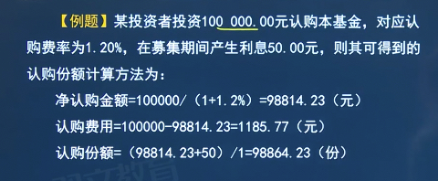
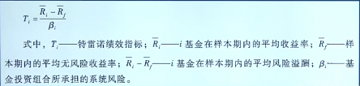
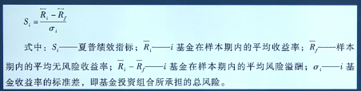
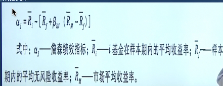
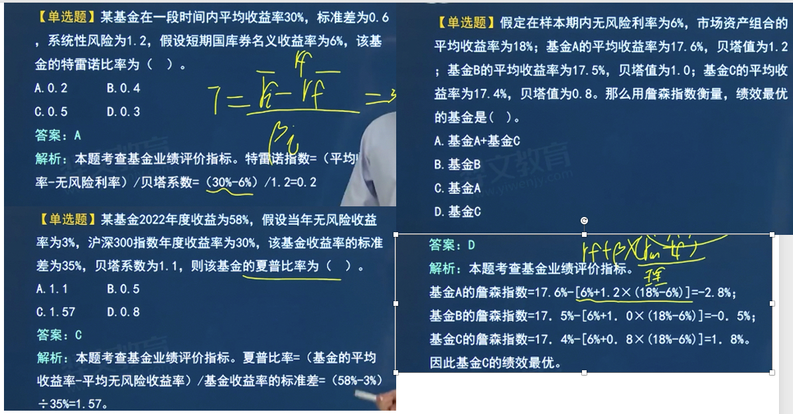
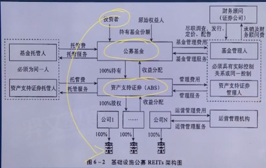

# 6.证券投资基金
## 第一节 证券投资基金概述🌟

### 6.1.1 证券投资基金概念和分类

1. 概念
   1. 通过**向投资者募集资金**，形成独立基金财产，由专业投资机构（基金管理人）进行基金投资与管理，由基金托管人进行资产托管，
      由基金投资人**共享投资收益、共担投资风险**的一种**集合投资**方式
2. 证券投资基金在不同地区的称谓
   - 美国：**共同基金**
   - 英国和香港：**单位信托基金**
   - 欧洲一些国家：**集合投资基金或集合投资计划**
   - 日本和台湾：**证券投资信托基金**🌟
3. 根据基金投资对象的不同，可以将投资基金分为**证券投资基金与另类投资基金**
   1. (1)证券投资基金主要以股票、债券等具有较好流动性的**金融证券**为投资对象；
   2. (2)另类投资基金则主要以**未上市公司股权**、不动产、黄金、大宗商品、衍生品等**金融与非金融资产**为投资对象。
4. 证券投资基金的特点🌟
   - 集合理财、专业管理
   - 组合投资、分散风险
   - 利益共享、风险共担
   - 严格监管、信息透明
   - 独立托管、保障安全
5. 证券投资基金与股票、债券的区别🌟
   - 反映的**经济关系**不同
       - 股票：**所有权**关系
       - 债券：**债权债务**关系
       - 基金：**信托**关系（公司型基金除外）
   - 筹集资金的**投向**不同
       - 股票：直接投资，投向实业
       - 债券：直接投资，投向实业
       - 基金：**间接投资**，投向有价证券等金融工具
   - **收益风险水平**不同
       - 股票：风险较大
       - 债券：风险较小
       - 基金：收益可能高于债券，投资风险又可能小于股票

### 6.1.2 证券投资基金的分类🌟

1. 按基金的组织形式划分，契约型基金和公司型基金
   1. **契约型**基金：
     - 依据**基金合同**设立的一类基金（目前我国的基金全部是契约型基金）
     - 在我国，契约型基金依据基金管理人、基金托管人之间所签署的基金合同设立，基金投资者购买基金份额后成为**基金持有人**，依法享受权利并承担义务
   2. **公司型**基金：
      - 依据**基金公司**章程设立，是在法律上具有**独立法人地位**的股份投资公司
      - 基金投资者是公司的股东，凭其持有的股份依法享有投资收益
      - 公司型基金在组织形式上与股份有限公司类似，由股东选举董事会，由董事会选聘基金管理公司，基金管理公司负责管
        理基金的投资业务。
   3. 两者的区别
      - 资金的性质
          - 契：通过发行基金份额筹集起来的**信托财产**
          - 公：通过发行普通股票凑集的**公司法人资本**
      - 投资者的地位
          - 契：委托人、受益人
          - 公：公司的股东
      - 营运依据
          - 契：基金合同
          - 公：公司章程
2. 按基金的运作方式划分，封闭式基金和开放式基金
    - 封闭式基金
        - 基金份额**固定不变**
        - **有封闭期**，封闭期内不能申请赎回
        -  封闭期内基金份额可在二级市场交易买卖
    - 开放式基金
        - 基金份额**可变**
        - 可**随时申购赎回**
        - 份额不可在二级市场交易
    - 区别
        - 期限
            - 封：通常在**5年以上**，一般为**10年或15年**
            - 开：没有固定期限
        - 发行规模
            - 封：**固定**
            - 开：**不固定**
        - 基金份额交易方式
            - 封：只能在**证券交易场所**交易, 封闭期内不能赎回
            - 开：向基金管理人申购或赎回
        - 价格形成方式
            - 封：受**供求关系**影响
            - 开：**基金份额净资产值**为基础
        - 激励约束机制与投资策略
            - 封：
              - 激励约束机制**较差**；
              - 封闭式基金由于无须考虑资金流进流出的影响，更便于基金经理进行**长期投资**和**全额投资**
            - 开：
              - 激励约束机制**较好**；
              - 压力较大，**不能全额投资**

3. 按基金的投资标的划分，股票基金、债券基金、混合型基金、货币市场基金
   1. 股票基金：以**股票**为主要投资对象（80%以上）
      1. 股票基金的风险较高，但预期收益也较高，其投资目标侧重于追求**资本利得和长期资本增值**，比较适合长期投资
      2. 分类
         1. 按**投资市场**分类
            1. 国内股票基金
            2. 国外股票基金
         2. 按持有股票的**性质**分类
            1. **价值型**股票基金
               1. 主要投资于**收益稳定、价值被低估、安全性较高**的股票
            2. **成长型**股票基金
               1. 主要投资于**收益增长速度快**、**未来发展潜力大**的股票
            3. **平衡型**股票基金
               1. 同时投资于价值型股票和成长型股票的基金是平衡型基金
   2. 债券基金：以债券为主要投资对象（80%以上）
   3. 混合型基金：
      1. **同时投资**于股票与债券
      2. 分类：由于资产配置比例不同
         1. 偏股型基金
         2. 偏债型基金
         3. 股债平衡型基金
         4. 灵活配置型基金
   4. 货币市场基金
      1. 仅以**货币市场工具**为投资对象的（100%）
      2. 投资期限一般在**1年**以内
      3. 包括**银行短期存款、国库债、公司短期债券、银行承兑票据及商业票据**等货币市场工具
      4. 资本安全性高， 通常被认为是**低风险的投资工具**

4. 按基金的投资目标划分，成长型基金、收入型基金和平衡型基金
    - 成长型基金：追求基金资产的**长期增值**, **最常见**
    - 收入型基金：
      - 以获取当期的**最大收入**为目的
      - 主要投资对象是债券和绩优股
      - 容易受到股市波动的影响
    - 平衡型基金：分别投资于两种特性的证券上

5. 按基金的投资理念划分，主动型基金和被动型基金
    - 主动型基金：通过**积极选股和择时**，力图取得超越基准组合表现的基金
    - 被动型基金：
      - 又称**指数基金**，以特定指数为跟踪对象，力图复制指数表现
      - 优势
        - 管理费，交易非低
        - 可有效降低非系统性风险
    - 指数增强型基金
      - 指数增强型基金是一类介于主动型基金和被动型基金之间的基金
      - 它通过指数增强策略，以期获得**高于标的指数**回报水平的投资业绩

6. 按基金的募集方式划分，公募基金和私募基金
    - 公募基金
        - 面向**社会公众公开**发售
        - 可以向社会公众公开发售基金份额和宣传推广，基金募集对象**不固定**
        - 基金份额的投资基金要求较低，适合**中小投资者参**与
        - 接受监管， 定期公开信息
    - 私募基金
        - 向**特定合格投资者**发售
        - 投资金额较高，风险较大，监管机构对投资者的资格和人数会加以限制（不超过200人）
        - 不能进行公开发售和宣传推广，只能采取**非公开方式**发行
        - 相比公募基金，在基金运作和信息披露方面所受的限制和约束较少

7. 特殊类型基金

   1. 交易所交易基金（ETF）
        - 定义
          - --一种在交易所上市交易的、**基金份额可变**的一种基金运作方式，
          - 结合了封闭式基金与开放式基金的运作特点的开放式基金
            - 既可以在二级市场买卖
            - 又可以像开封式基金一样申购 赎回
          - ETF通常是以某一选定的指数所包含的**成分证券**为投资对象，依据构成指数的证券种类和比例，采用完全复制或抽样复
            制的方法进行**被动投资的指数型基金**
          - ETF联接基金是指将大部分基金资产（通常在90%以上)投资于跟踪同一标的指数的ETF,密切跟踪标的指数表现，追求跟踪误差最小化的**开放式基金**
          - 黄金ETF是指将绝大部分基金财产投资于黄金交易所挂盘交易的黄金品种，紧密跟踪黄金价格，使用黄金品种组合
            或基金合同约定的方式进行申购赎回，并在证券交易所上市交易的开放式基金
          - 商品期货ETF是指以商品期货交易所挂盘交易的**商品期货合约**为主要投资标的，以跟踪商品期货价格或价格指数为目标，
            使用商品期货合约组合或基金合同约定的方式进行申购赎回，并在证券交易所上市交易的开放式基金。
        - 分类:股票类ETF 债券ETF
        - 特点
            - **实物申购、赎回基金**，即它的申购是用一篮子股票换取ETF份额，赎回时是以基金份额换回一篮子股票而不是现金
            - 有最小申购、赎回份额的规定
              - 通常最小申购、赎回单位在**30万份**、50万份或100万份
              - 申购、赎回必须以最小申购、赎回单位的整数倍进行，一般只有机构投资者才有实力参与一级市场的实物申购与赎回交易
            - 实行**一级市场和二级市场**并存的交易制度
              - 在一级市场，投资者可以在交易时间内以ETF指定的一篮子股票申购ETF份额或以ETF份额赎回一篮子股票。
              - 在二级市场，ETF与普通股票一样在证券交易所挂牌交易， 基金买入申报数量为100份或其整数倍，不足100份的基金可以
                卖出，机构投资者和中小投资者都可以按市场价格进行ETF份额交易
              - 这种双重交易机制使ETF的二级市场价格不会过度偏离基金份额净值。
            - 一般采用指数基金模式
            
   2. 上市开放式基金（LOF）
      1. 定义
         - 同时在场外市场和交易所进行申购赎回，通过份额转托管机制将场外市场与场内市场有机地联系在一起的一种开放式基金
         - 特点
             - 与ETF不同，不一定采用指数基金模式，也可以是主动管理型基金
             - 申购和赎回均**以现金**进行，对申购赎回**没有规模上**的限制】
             - 可在交易所申购，赎回，也可在代销网点进行
   3. 避险策略基金
        - --通过一定的避险投资策略进行运作，同时引入相关保障机制，以便在避险策略周期到期时，力求避免基金份额持有人本金出现亏损的公开募集证券投资基金
        - 极端情况下仍然存在本金损失风险
   4. QDII基金
        - --在一国境内设立，经该国有关部门批准从事境外证券市场的股票、债券等有价证券投资的基金
        - 特点
            - 根据证监会规定，QDII基金投资目的地为与证监会签署了双边监管合作谅解备忘录的国家或地区
            - 投资工具为股票、基金、债券、金融衍生品等
   5. 分级基金
        - --又称结构性基金、可分离交易基金，指在一只基金内部通过结构化的设计或安排，将普通基金份额拆分为具有不同预期收益与风险的两类（级）或多类（级）份额并可分离上市交易的一种基金产品
   6. 基金中基金（FOF）
        - --以**其他基金**为投资对象的基金，80%以上投资于其他基金份额
   7. 伞形基金
        - --又称**系列基金**，指多个基金共用**一个基金合同**，子基金独立运作并直接可以相互转换的一种基金结构形式
   8. 养老目标基金
        - --以追求养老资产的长期稳健增值为目的，鼓励投资人长期持有，采用成熟的资产配置策略，合理控制投资组合波动风险的**公开募集证券投资基金**
        - 应当采用基金中基金形式或证监会认可的其他形式运作
   9. 管理人中管理人(M0M)
        - 指母管理人将资产管理产品部分或者全部资产委托给多个子管理人进行管理的资产管理产品。
        - 母管理人是产品管理人，履行法定的受托职责；
        - 子管理人是母管理人的投资顾问，属于基金服务机构，受母管理人委托提供投资建议等基金服务。
        - 母管理人依法应承担的责任不因委托而免除
    - 基础设施公募（REITs)

### 6.1.3 证券投资基金起源与发展

荷兰于1774年创立世界上第一个封闭式投资基金。**19世纪90年代初**，美国有了首只封闭式基金。

证券投资基金在我国的发展可分为四个阶段。
1. (一)早期探索阶段(1990-1997年)
2. (二)规范发展阶段(1998-2003年)
3. (三)1创新发展阶段（2004-2012年)
4. (四)稳步发展阶段(2013年至今)

## 第二节 证券投资基金的运作与市场参与主体

### 6.2.1 基金运作
1. 概述
    - --包括基金的募集、基金投资管理、基金资产托管、基金份额的登记与交易、基金资产的估值与会计核算、基金的信息披露以及其他相关环节🌟
    - 基金运作中，**基金管理人**据**主导与核心**位置
    - 分成三部分
        - **市场营销**：募集
        - **投资管理**：投资管理、资产托管
        - **后台管理**：份额的注册登记、基金资产的估值、会计核算、信息披露等🌟
2. 证券投资基金的运作关系
   1. 基金投资者、基金管理人与基金托管人是基金的**主要当事人**，基金市场上的各类中介服务机构通过提供自己的专业服务
      参与基金市场，监管机构则对基金市场上的各类参与主体实施全面监管。

### 6.2.2 基金市场参与主题（熟悉）

依据所承担的责任与作用的不同，可以将基金市场的参与主体分为**基金当事人**、**基金服务机构**、**基金的监管机构和自律组织**

1. 基金当事人 
   1. 概念
      1. 我国证券投资基金依据基金合同设立，**基金份额持有人**、**基金管理人**与**基金托管人**是基金合同的当事人，简称基金当事人。
   2. 基金份额持有人
      1. 即基金**投资者**，基金的出资人、基金资产的**所有者**和基金投资收益的**受益者**，是基金一切活动的中心
      2. 权利
         1. 分享基金财产收益
         2. 参与分配清算后的剩余基金财产
         3. 依法转让或者申请赎回其持有的基金份额
         4. 按照规定要求召开基金份额持有人大会
         5. 对基金份额持有人大会审议事项行使表决权
         6. 查阅或者复制公开披露的基金信息资料
         7. 对基金管理人、基金托管人、基金销售机构损害其合法权益的行为依法提起诉讼等
   3. 基金管理人
        - 为了保证基金资产的安全，《证券投资基金法》规定，基金资产必须由独立于基金管理人的基金托管人保管，从而使得基金托管人成为基金的当事人之一。
        - 基金的**募集者和管理者**，基金的运作中起着**核心**作用
        - 负责基金的投资管理、产品设计、基金营销、基金注册登记、基金估值、会计核算等🌟
        - 在我国基金管理人只能由**依法设立的基金管理公司**承担
   4. 基金托管人
        - 负责**资产保管、资金清算、会计核算**以及对投资运作的**监督**🌟
        - 在我国基金托管人只能由依法设立并取得基金托管资格的商业银行或其他金融机构承担
2. 基金市场服务机构
   1. **基金管理人**、**基金托管人**既是基金的当事人，又是基金的主要服务机构。
   2. 基金销售机构
      1. 是指经中国证券监督管理委员会或者其派出机彬注册，取得基金销售业务资格的机构。 
      2. 未经注册，任何单位或者个人不得从事基金销售业务。
   3. 基金销售支付机构
      1. 基金销售支付机构受基金销售机构委托，为基金销售机构提供基金销售结算**资金划转服务**。 
      2. 基金销售机构应当选择具备**下列条件**的商业银行或者支付机构办理基金销售支付业务：
         1. (1)制定了有效的风险控制制度，有安全、高效的办理支付业务的信息系统；
         2. (2)商业银行取得基金销售业务资格，支付机构取得《支付业务许可证》；
         3. (3)最近3年没有受到刑事处罚或者重大行政处罚；
            最近1年没有被采取重大行政监管措施；没有因重大违法违规行为处**于整改**期间，或者因涉嫌重大违法违规行为正在被监管机构调查
         4. (4)中国证监会规定的其他条件。
   4. 基金份额登记机构
      1. 基金份额登记机构应当确保基金份额的登记、存管和结算业务处理安全、准确、及时、高效
      2. 其主要职责包括
         1. (1)建立并管理投资人基金份额账户
         2. (2)负责基金份额的登记
         3. (3)基金交易确认
         4. (4)代理发放红利
         5. (5)建立并保管基金份额持有人名册
         6. (6)服务协议约定的其他职责
         7. (7)中国证监会规定的其他职责
   5. 基金估值核算机构、
   6. 基金投资顾问机构、
      1. 基金投资顾问机构是向基金投资者提供基金投资咨询、建议服务的机构。
   7. 基金评价机构、
      1. 基金评价机构是指从事对基金管理人、基金绩效进行评价、排名、评级、评奖活动的机构
      2. 基金评价机构从事**公募基金评价业务**并以公开形式发布基金评价结果的，应向中国证券投资基金业协会**申请注册**。
   8. 基金信息技术系统服务机构
      1. 基金信息技术系统服务机构是指向基金管理人、基金托管人和基金服务机构提供基金业务核心应用软件开发、信息系统
         运营维护、信息系统安全保障和基金交易电子商务平台等业务活动的机构。
   9. 律师事务所和会计师事务所
      1. 律师事务所和会计师事务所作为专业、独立的中介服务机构，为基金提供法律和会计服务。
3. 基金的监管机构和自律组织
   1. 监管机构：证监会
   2. 自律组织：
      1. 基金行业自律组织（中国证券投资基金业协会）
      2. 证券交易所
         1. 一方面，部分封闭式基金不通过证券交易所募集和交易，上市开放式基金和交易型开放式指数基金需要通过证券交易所募集和交易，必须遵守证券交易所的规则；
         2. 另一方面，经中国证监会授权，证券交易所对基金的投资交易行为还承担着重要的一线监控管理职责。
         

## 第三节 基金的募集、申购、赎回与交易🌟

### 5.3.1 基金的募集

1. 概念
   1. 基金管理公司根据规定向**证监会**提交募集申请文件、发售基金份额、募集基金的行为
   2. 步骤：**申请**->**注册**->**发售**->**基金合同生效**
2. 基金募集申请
   1. ①基金管理人进行基金的募集，必须根据《证券投资基金法》的有关规定，向中国证监会提交相关文件。
   2. ②申请募集基金应提交的主要文件包括：募集基金的申请报告、基金合同草案、基金托管协议草案、招募说明书草案、法律意见书等。
3. 基金注册
   1. 国务院证券监督管理机构应当自受理公开募集基金的募集注册申请之日起，**6个月内**作出注册或者不予注册的决定
   2. 目前，基金注册程序分为**简易程序**和**普通程序**。
      1. 对**常规基金产品**，如常规股票基金、混合基金、债券基金、指数基金、货币基金、QDII基金、ETF及其联接基金等，按简
         **易程序**注册，注册审查时间原则上**不超过20个工作日**；
      2. 对其他产品，按照普通程序注册，注册审查时间不超过6个月。
4. 基金份额的发售
   1. ①基金经**注册**后，方可发售基金份额。
   2. ②基金管理人应当自收到准予注册文件之甲**起6个月**内进行基金份额的发售。
   3. ③基金的募集期限自基金份额**发售日**开始计算，募集期限不**得超过3个月**
   4. ④基金管理人应当在基金份额发售的3日前公布招募说明书、基金合同及其他有关文件
   5. ⑤投资人缴纳认购的基金份额的款项时，基金合同成立
5. 基金合同生效
   1. ①基金募集期限届满，基金募集份额总额不少于2亿份，基金募集金额不少于2亿元人民币；基金份额持有人的人数不少于200人，
      基金管理人应当自募集期限届满之日起**10日内**聘请法定验资机构验资，向中国证监会提交验资报告，办理基金备案手续。
      1. 基金备案自中国证监会**书面确认之日**起，基金合同生效。
      2. 基金管理人应当在收到中国证监会确认文件的**次日**发布基金合同**生效公告**
   2. ②基金募集失败，基金管理人应当以**固有财产**承担因募集行为而产生的**债务和费用**，并在基金募集期限届满后**30日内**返
      还投资者已缴纳的款项，并加计银行**同期存款利息**。

### 5.3.2 开放式基金的认购

1. 定义
   1. 在基金募集期内购买基金份额的行为称认购🌟
2. 步骤
   1. 开户
      1. 开立**基金账户**和**资金账户**
   2. 认购
      1. 投资人在办理开放式基金认购申请时，须按销售机构规定的方式全额缴款。投资者在募集期内可以多次认购基金份额。一般
         情况下，已经正式受理的认购申请不得撤销。
   3. 确认
      1. ①销售机构对认购申请的受理并不代表该申请一定成功，而仅代表销售机构接受了认购申请，
         申请的成功与否应**以注册登记机构的确认结果**为准。
      2. ②投资者于T日提交认购申请后，可于**T+2日**起到办理认购的网点查询认购申请的受理情况。
      3. ③认购的**最终结果**要待基金募集期**结束后**才能确认。
3. 认购方式：**金额认购**
   1. 开放式基金的认购采取金额认购的方式，即投资者在办理认购时，认购申请上不是直接填写需要认购多少份基金份额，
      而是填写需要认购多少金额的基金份额，基金注册登记人在基金认购结束后，再按基金份额的认购价格，将申请认购基金的
      金额换算成投资人应得的基金份额。
4. 认购费率：
   1. 股票型基金（1-1.5%）
   2. 债券型基金（1%以下）
   3. 货币市场基金（一般不收取认购费）
5. 收费模式：
   1. 前端收费（认购时叫）
      1. 前端收费是指在**认购**基金份额时就**支付认购**费用的付费模式。
   2. 后端收费（赎回时扣）
      1. ①后端收费是指在认购基金份额时**不收费**，在**赎回**金份额时**才支付**认购费用的收费模式
      2. ②后端收费模式设计的目的是鼓励投资者能**长期持有**基金，所以后端收费的认购费率一般设计为随着基金份额
         持有时间的**延长而递减**，甚至不再收取认购费用
6. 开放式基金认购份额的计算
   1. 开放式基金认购费用统一按照**净认购金额为**基础收取
   2. 相应的基金认购费用与认购份额的计算公式为
      1. `净认购金额=认购金额/(1+认购费率)`
      2. `认购费用=认购金额一净认购金额`
      3. `认购份额=（净认购金额+认购利息）/基金份额初始面值`
   3. 例题
      1. 
7. 开放式指数基金的认购
   1. (1)基金管理人可以采用网上和网下两种方式发售基金份额
      1. ①采用网上发售方式的，投资者应当使用在证券登记结算机构开立的证券账户，按照基金合同、基金招募说明书、
         基金发售公告书确定的网上发售认购方式进行申报
      2. ②采用网下发售方式的，投资者按基金合同、基金招募说明书、基金发售公告书的规定进行认购
   2. (2)投资者网上认购基金份额申报的，应当要求投资者足额交付认购资金或者组合证券
      1. ①网上发售时，投资者以**组合证券**认购基金份额的，交易所按照基金合同和基金招募说明书的规定，
         确认其是否拥有对应的足额组合证券。无足额组合证券的，其认购申报**全部无效**
      2. ②网上发售时，投资者以现金认购基金份额的，应即时冻结投资者用于认购的资金，并不得挪用

### 5.3.3 开放式基金的申购、赎回

1. 申购/赎回的概念
   1. 申购：基金合同**生效后**， **申请购买**基金份额的行为
   2. 赎回：基金份额持有人要求基金管理人**购回**所持有的开放式基金份额的行为
   3. 开放式基金的申购和赎回与认购一样，可以通过基金管理人的**直销中心**与基金销售机构的**代销网点**办理。
2. 申购、赎回的原则
    - 对**固定净值型货币基金**而言，基金份额价格固定为1元人民币，因此投资者在申购、赎回货币基金时，按**固定价格**进行申购、赎回。
    - 货币市场：按固定价格1元人民币进行申购、赎回
    - **一般开放式基金**：遵循“未知价”交易原则🌟
      - 投资者在申购、赎回一般开放式基金份额时并不能即时获知成交价格。申购、赎回价格只能以申购、赎回日交易时间结束后基
        金管理人公布的基金份额净值为基准进行计算，这与股票、封闭式基金等金融产品按“已知价”原则进行买卖不同。
    - “金额申购、份额赎回”原则🌟
      - 即申购以**金额申请**，赎回以份额申请。 
      - 这是适应**未知价下**进行申购、赎回最方便、安全的方式。 货币基金也遵循一样的原则。
3. 认购与申购的区别
   1. 概念
      1. 认购
         1. 认购指在基金设立**募集期内**，投资者申请购买基金份额的行为
      2. 申购
         1. 申购指在**基金合同生效后**，投资者申请购买基金份额的行为
   2. 费率
      1. 认购
         1. 在认购期内购买基金，基金认购价格通常为1元/份
         2. 在认购期内产生的利息在基金合同生效时，自动转换为投资者的基金份额
         3. 基金份额在基金合同**生效时确认**，并且年**建仓期后**能赎回
      2. 申购
         1. 申购基金时，基金**申购价格未知**，投资人交付申购款项，申购成立
         2. 基金份额登记机构确认基金份额时，申购生效

5. 申购、赎回费用及销售服务费
    - 申购费用
        - 可采用**前端收费**或**后端收费**方式
        - 持有**低于3年**的，基金管理人**不得**免收其后端申购费用
    - 赎回费用
        - 基金管理人可以根据基金份额持有人持有期限适用不同的赎回费标准
        - 通常持有时间**越长**，适用的赎回费率**越低**
    - 销售服务费🌟
        - 货币市场基金，申购和赎回费一般为0
        - 一般从基金财产中计提**不高于0.25%**的销售服务费

6. 开放式基金份额的申购，赎回，交易
   1. 投资者申购基金份额的，应当拥有对应的足额组合证券及替代现金。投资者赎回基金份额的，应当拥有对应的足额基金份额
      1. (1)当日申购的基金份额，同日可以卖出，但不得赎回
      2. (2)当日买入的基金份额，同日可以赎回，但不得卖出
      3. (3)当日赎回的证券，同日可以卖出，但不得用于申购基金份额
      4. (4)当日买入的证券，同日可以用于申购基金份额，但不得卖出；
         1. 交易型指数基金上市首日证券行情显示的**前收盘价，**为基金管理人向交易所提供的基金上市前一日的基金份额净值。

### 5.3.4 开放式基金份额的转换、非交易过户、转托管与冻结（熟悉）

1. (一)开放式基金份额的**转换**
   1. 开放式基金份额转换，是指投资者将其所持有的某基金份额转换为另一只基金份额的行为，基金转换业务所涉及
      的基金，必须是由**同一基金管理人**管理的、**同一注册登记人**处注册登记的基金
   2. 投资者采用“份额转换”的原则提交申请，即在销售人处以“份额”为单位提交转换申请，以转出和转入基金
      **申请当日的份额净值**为基础计算转入份额。
2. (二)开放式基金的**非交易过户**
   1. 开放式基金非交易过户，是指**不采用申购、赎回等交易方**式，将一定数量的基金份额按照一定规则从某一投资者基金账户转移
      到另一投资者基金账户的行为，主要包括**继承、捐赠、司法强制执行**和经注册登记机构认可的其他情况下的非交易过户
3. (三)开放式基金份额的**转托管**
   1. **概念**：是指基金份额持有人申请将其托管在某一交易账户中的全部或部分基金份额转出并转入另一交易账户的行为。
   2. 投资人可通过办理转托管业务，实现其变更办理基金业务销售渠道（或网点）的需要
4. (四)开放式基金份额的冻结
   1. 基金份额冻结期间，冻结部分不能进行除**份额解冻**、**基金收益分配之**外的基金交易。
   2. 被冻结基金份额的现金红利自动转成基金份额且该再投资部分**一并子以冻结**，直至份额解冻
   3. 对于同一基金份额，如当事人T日同时提交份额冻结或解冻申请和一般申购、赎回交易申请，注册登记机构将优先处
      理基金份额冻结与解冻申请，而拒绝一般交易申请。

### 5.3.5 封闭式基金的交易投资（熟悉）

1. (一)交易规则
   1. 投资者买卖封闭式基金必须开立**深、沪证券账户**或**深、沪基金账户及资金账户**。基金账户只能用于基金、国债及其他
      债券的认购及交易
   2. 封闭式基金的交易时间是每周一~周五（法定公众节假日除外)，上午9：30~11：30、下午13：00~15：00
   3. 封闭式基金的交易遵从“价格优先、时间优先”的原则
   4. 封闭式基金的报价单位为每份基金价格
      1. 基金的申报价格最小变动单位为0.001元人民币，买入与卖出封闭式基金份额申报数量应当为**100份或其整数倍**，
         单笔最大数量应低于100万份
   5. 沪、深证券交易所对封闭式基金交易实行与对A股交易同样的10%的涨跌幅限制
      1. 同时，与A股一样实行T十1交割、交收，即达成交易后，相应的基金交割与资金交收在交易日的下一个营业日(T十1)完成
2. (二)交易费用
   1. 按照沪、深证券交易所公布的收费标准，我国基金交易佣金不得高于成交金额的**0.5%**（深圳证券交易所特别规定该佣金
      水平不得低于代收的证券交易监管费和证券交易经手费，上海证券交易所无此规定)，**起点5元**，由证券公司向投资者收取。
   2. 目前，封闭式基金交易**不收取印花税**。

## 第四节 基金的估值、费用与利润分配

### 5.4.1 基金资产的估值

1. 概念
   1. 基金资产估值是指通过对基金所拥有的全部资产及所有负债按一定的原则和方法**进行估算**，
       进而确定基金资产**公允价值**的过程。
   - 基金资产总值：基金全部资产的价值总和
   - 基金资产净值：从基金资产总值中扣除所有负债
   - 基金份额净值：基金资产净值除以基金当期的总份额
   2. 公式
      1. `基金资产净值=基金资产总值一基金负债`
      2. `基金份额净值=基金资产净值/基金总份额`
2. 估值需考虑的因素
   - 估值频率🌟
     - 基金一般都按照固定的时间间隔对基金资产进行估值，通常相关法规会规定一个最小的估值频率🌟
     - 开放式基金**每个交易日**估值，并**不晚于下一交易日**公告份额净值
     - 封闭式基金和定期开发式基金**每个交易日**估值，但**每周披露**一次份额净值
   - 交易价格的公允性
     - 当基金投资标的为交易活跃的证券时，对其资产估值较为容易，**直接采用市场交易价格**对标的资产估值
     - 不活跃证券估值问题——侧袋机制(2020年8月1日)
         - --将基金投资组合中的**特定资产**从原有账户分离至一**个专门账户**进行处置清算
         - **目的**在于有效隔离并化解风险，确保投资者得到公平对待，属于**流动性风险管理工具**
         - 原有账户称主袋账户，专门账户称侧袋账户
         - 特定资产：
           - 无可参考的活跃市场价格且采用估值技术仍导致公允价值存在重大不确定性的资产
           - 按摊余成本计量且计提资产减值准备仍导致资产价值存在重大不确定性的资产
           - 其他资产价值存在重大不确定性的资产
   - 估值方法的一致性及公开性
     - 估值方法的**一致性**，是指基金在进行资产估值时均应采用**同样的估值方法**，遵守同样的**估值规则**
     - 估值方法的**公开性**，是指基金采用的估值方法需要在法定募集文件中公开披露。若基金变更了估值方法，必须及时进行披露
3. 基金资产估值原则
   1. 基金资产估值的责任人及其义务
      1. 我国基金资产估值的责任人是**基金管理人**，但基金托管人对基金管理人的估值及净值计算结负有**复核义务**
      2. 当对估值原则或程序有异议时，托管人有义务要求基金管理人作出合理解释，通过积极商讨达成一致意见
   2. 基本原则
   3. (1)对**存在活跃市场**且能够获取相同资产或负债报价的投资品种，在估值日**有报价的**，
      除会计准则规定的例外情况外，应将该报价不加调整地应用于该资产或负债的公允价值计量
      1. ①估值日无报价且最近交易日后**未发生**影响公允价值计量的重大事件的，应采用**最近交易日的报价**确定公允价值
      2. ②有充分证据表明估值日或最近交易日的报价不能真实反映公允价值的，应对报价进行调整，确定公允价值
   4. (2)对不存在活跃市场的投资品种，应采取在当前情况下适用并且可利用数据和其他信息支持的估值技术确定公允价值
      采用估值技术确定公允价值时，应优先使用可观察输入值，只有在无法取得相关资产或负债可观察输入值或取得不切实可行
      的情况下，才可以使用不可观察输入值
   5. (3)如经济环境发生重大变化或证券发行人发生影响证券价格的重大事件，使潜在估值调整对前一估值日的基金资产净
      值的影响在0.25%以上的，应对估值进行调整并确认公允价值

### 5.4.2 基金的费用（熟悉）

1. 费用的种类🌟
   1. 不参与基金的会计核算
      1. 基金销售过程中发生由基金投资者承担的费用：申购费，认购费，赎回费及基金转换费等
   2. 参与基金的会计核算
      1. 基金管理过程中发生的费用：基金管理人的管理费、托管人的托管费、基金份额持有人大会费用、信息披露费等，均由基金资产承担
2. 根据有关规定，下列与基金有关的费用可以从基金财产中列支
   1. 基金管理人的管理费、基金托管人的托管费、基金合同生效后的会计师费和律师费、基金份额持有人大会费用、
      基金的证券交易费用、按照国家有关规定和基金合同规定可以在基金财产中列支的其他费用
3. 各种费用的计提标准及计提方式
   1. 基金管理费、基金托管费和基金销售服务费
      1. (1)我国的基金管理费、基金托管费及基金销售服务费均是按照前一日基金资产净值的一定比例**逐日计提，按月支付**
      2. (2)基金管理人可以按照法律法规及基金合同的约定，将与侧袋账户有关的费用丛侧袋账户资产中列支，
         但应待特定资产变现后方可列支，且不得收取管理费及业绩报酬
   2. 基金交易费
      1. 基金交易费是指基金在进行证券买卖交易时所发生的相关交易费用
      2. 我国基金的交易费主要包括印花税、佣金、过户费、经手费、证管费
      3. 佣金由证券公司按成交金额的一定比例向基金收取，印花税、过户费、经手费、证管费等则由登记公司或交易所按有关规定收取
      4. 参与银行间债券交易的，还需向中央国债登记结算有限责任公司支付银行间账户服务费，向全国银行间同业拆借中心支付交易手续费等服务费用
   3. 基金运作费
      1. 基金运作费是指为保证基金正常运作而发生的可以由基金承担的费用，包括审计费、律师费、上市年费、信息披露费、
         分红手续费、持有人大会费、开户费、银行汇划手续费等
4. 不列入基金管理过程中发生费用的项目
    - 基金管理人和托管人因**未履行或未完全履行义务**导致的费用支出或基金财产的损失
    - 管理人和托管人处理与**基金运作无关**的事项发生的费用
    - 基金合同**生效前**的相关费用，包括但不限于验资费、会计师和律师费、信息披露费等

### 5.4.3 基金利润与利润分配（熟悉）

1. 基金利润
   1. 基金利润主要来自基金收入减去基金费用后的**净额**、**公允价值变动损益**等。
      - 基金收入：
        - **利息收入**：包括债券利息收入、资产支持证券利息收入、存款利息收入，买入返售金融资产收入等。
        - **投资收益**：实卖**差价收益**，可分为股票投资收益、债券投资收益、资产支持证券投资收益、基金投资收益、衍生工具收益、股利收益等。
        - **其他收入**:除上述收入以外的其他各项收入，包括赎回费扣除基本手续费后的余额、手续费返还、ETF替代损益，以及基金管理人等机构为弥补基金财产损失而支付给基金的**赔偿款项**等。
      - 公允价值变动损益：
        - 公允价值变动形成的应计入当期损益的利得或损失
2. 基金利润分配
   1. 封闭期基金的利润分配
      1. 分配比例
         1. 每年不得少于一次
      2. 分配要求
         1. 收益分配比例**不得低于**基金年度可供分配利润的90%
      3. 分红方式
         1. 只能采用**现金**方式分红
   2. 一般开放式基金
       1. 分配比例
       2. 分配要求
          1. 需在基金合同和招募说明书中约定每年基金收益分配的**最多次数**和每次分配的**最低比例**
          2. 同时要求基金利润分配后基金份额净值**不得低于面值**
       3. 分红方式
          1. **现金分红**：
          2. **红利再投资**：将投资人应分配的净利润折算为等值的新的基金份额**记入投资人基金账户**的分红方式。
       4. 一般开放式基金利润分配默认的方式应当采用现金分红。
          1. 开放式基金的基金份额持有人可以事先选择分红再投资。
          2. 基金份额持有人事先未作出选择的，基金管理人应当支付现金。
   3. 货币市场基金（一块钱一份额，类比余额宝）
       1. (1)对于每日按照面值进行报价的货币市场基金，可以在基金合同中将收益分配的方式约定为红利再投资，并当每日进行收益分配
       2. (2)货币市场基金在每日进行利润分配时，当日申购的基金份额**自下一个工作日**起享有基金的分配权益，
          当日赎回的基金份额自下一个工作日起**不享有**基金的分配权益

### 5.4.3 基金的税收（熟悉）

1. 基金自身投资活动产生的税收🌟
   1. 增值税
      - 基金运营过程中发生的增值税应税行为，以管理人为**增值税纳税人**
      - 基金管理人运用基金买卖股票、债权转让收入免征增值税
      - 资管产品管理人运营资管产品过程中发生的增值税按3%的征收率
   2. 印花税
      1. 基金卖出股票按照0.1%的税率征收
      2. 买入股票不征收，即印花税实行**单向征收**
   3. 所得税
      1. 企业所得税（全免）
         1. 证券投资基金从证券市场中取得的收入，包括买卖股票、债券的差价收入、股权的股息、红利收入、债券的利息收入及其他收入，暂不征收企业所得税
      2. 个人所得税
         1. 对基金取得的**储蓄存款利息收**入，免征
         2. 对基金取得的债券利息收入
            1. 发行债券的企业和银行在向基金支付上述收入时代扣**代缴20%**的个税
            2. 国债及国家发行的金融债券（央行票据、政策性金融债券等）利息免征
            3. 铁路债减半征收
         3. 对基金取得的公开发行和转让的上市公司股票取得的股息红利
            1. 持股期限**超过一年**，免征
            2. 持股期限1个月（含），股息红利所得**全额计入**应纳税所得额
            3. 持股期限1个月以上、1年内（含），按**减50%计**入
            4. 上述所得统一适**用20%计**征个人所得税
2. 基金投资者投资基金的税收
   1. 机构投资者
      1. 买卖基金份额属于金融商品转让，应按照卖出价扣除买入价后**的余额**为销售额计征增值税
      2. 持有到期，则不属于金融商品转让
      3. 买卖基金份额**免征印花税**
      4. 在境内买卖基金份额获得的**差价收入**，**应并入**企业的应纳税所得额，征收企业所得税；从基金分配中获得的收入，**暂不征收所得税**
   2. 个人投资者（全不收）
       - 买卖基金份额**免征增值税**
       - 买卖基金份额**免征印花税**
       - 从基金分配中取得的收入，**免征个人所得税**
       - 买卖基金份额取得的差距收入，免征个人所得税

## 第五节 基金的管理

基金投资管理在基金运作中处于**核心**作用，其他活动都围绕和服务于这一核心活动

- 基金的投资理念与投资风格

    - 投资理论：对投资目的的认识和对投资方法的认知
    - 投资风格：基金经理在资产组合管理过程中所采用的某一种特定方式或投资目标

1. 基金投资管理过程--**基金经理负责制**
   - (1)研究部门提供研究报告
   - (2)投资决策委员会决定基金总体投资计划
   - (3)基金经理拟定投资组合具体方案
   - (4)交易部门依据基金经理的投资指令执行交易
     - (1)基金的交易实行集中交易管理制度，基金管理人设有中央交易室，以保证**公正、公平**为原则，实行统一交易、统一管理，确保各投资组合享有公平的交易执行机会
     - (2)按规定，基金经理不得直接向交易员下达投资指令或者直接进行交易，投资指令经风险控制部门的审核，确认其合法、合规与完整后方可执行。
       这样，可实现决策人与执行人的分离，防止基金经理决策的**随意性与道德风险**
2. 风险管理🌟
   - 外部风险
       - 市场风险、政策风险等**系统性风险**
       - 信息风险、经营风险等**非系统性风险**
   - 内部风险
     - 来着基金管理人方面的风险, 管理人的**管理水平，管理手段，管理技术**都影响基金的收益水平
     - **合规风险**、操作风险和职业道德风险等
     - 内部风险多属于非系统性风险

3. 基金的业绩评估
   1. 考虑因素
      1. 投资目标与范围
         1. 投资目标与范围不同的基金，其投资策略、业绩比较基准都可能不同。
      2. 基金风险水平
         1. **风险越大，所要求的报酬率就越高**。
      3. 基金规模
         1. 与小规模基金相比，规模**较大**的基金的**平均成本更低**。
      4. 时期选择
         1. 同一基金在不同时间段内的表现可能有很大的差距。
   2. 评估指标
       - 特雷诺指数
           - 
           - 表示基金承受**每单位系统风险**所获取风险收益的大小
           - 该指数越大，基金的绩效表现越好
           - 缺点：不能评估基金经理分散和降低非系统性风险的能力
       - 夏普指数
           - 
           - 表示基金承受**每单位总风险所获取的风险收益**的大小
           - 反映基金经理的市场调整能力，该指数越大，基金绩效越好
           - 能反映基金经理分散和降低非系统性风险的能力
       - 詹森指数
           - 一种以资本资产定价模型（CAPM）为基础的评价基金业绩的绝对指标
           - 能评估基金的业绩**优于**基准的程度
           - 该指数大于0表示**优于**市场指数，反之，**弱于**市场指数
           - 
       - 在比较不同基金的投资收益时，用特雷诺指数和夏普指数可对其进行排序，
        而詹森指数优于这二者的地方是可以告诉我们各基金表现优于基准组合的具体大小。
   - 例题
     - 

## 第六节 证券投资基金的监管与信息披露

### 6.6.1 基金监管

1. 基金监管定义和作用
   1. 监管部门运用法律的、经济的以及必要的行政手段，对基金市场参与者行为进行的监督和管理🌟
2. 监管目标🌟
   1. 保护投资人及相关当事人的合法权益
   2. 规范基金活动，保证市场的公平、效率和透明，降低系统风险
   3. 促进证券投资基金和资本市场的健康发展
3. 基金监管机构和自律组织
   1. 证监会
      1. 中国证监会依法担负基金监管职责，各地证监局依照中国证监会的授权履行有关职责
      2. 中国证监会通过内部基金监管部门具体施行基金市场准入监管与日常持续监管
   2. 协会的行业自律组织
      1. 中国证券投资基金业协会是我国证券投资基金行业的自律性组织
   3. 证券交易所的自律管理
      1. 证券交易所作为自律管理的法人，依法对**基金上市**及**相关信息披露等活动**进行管理，对基金在交易所的投资交易实行监控。
4. 对基金机构的监管
   1. 对基金管理人的监管 
      1. 担任公募基金的基金管理人只能由**基金管理公司**或者证监会按照规定核准的其他机构担任
   2. 对基金托管人的监管 
      1. 由依法设立的商业银行或者其他金融机构担任
   - 对基金服务机构的监管
      - 应按照证监会规定进行**注册或备案**
5. 对基金募集的监管
   1. 公开募集基金应当经**证监会**注册，
   2. 未经注册**不得公开、变相公开**募集基金
   3. 基金募集期满，达到设立标准的，应向中国证监会办理基金备案手续。
6. 对基金募集的监管
   1. 独立基金销售机构发生下列事项的，应当在5个工作旦内向**住所地**中国证监会派出机构备案
      1. (1)变更公司章程、名称、住所、组织形式、经营范围、注册资本、高级管理人员；
      2. (2)新增持有5%以上股权的股东，变更控股股东、实际控制人
      3. (3)持有5%以上股权的股东变更姓名、名称，或者质押所持独立基金销售机构的股权
      4. (4)设立、撤销分支机构，变更分支机构名称、营业场所；
      5. (5)对外进行股权投资或者提供担保
      6. (6)中国证监会规定的其他事项
   2. 对公募基金投资与交易行为的监管
      - 可投资国内依法公开发行上市的股票、非公开发行股票、国债、企业债券和金额债券、公司债券、货币市场工具、资产支持证券等🌟
      - 基金财产的禁止用途🌟
         - 承销证券
         - 向他人贷款或者提供担保
         - 买卖其他基金份额，但国务院另有规定的除外
         - 向其基金管理人、托管人出资
         - 从事内幕交易、操纵证券交易价格及其他不正当的证券交易活动
         - 由国务院证券监督管理机构规定禁止的其他活动
      - 基金管理人运用基金财产进行证券投资，不得有下列情形：
        - ①一只基金持有一家公司发行的**证券**其市值超过基金资产**净值的10%**；
        - ②同一基金管理人管理的全部基金持有一家公司发行的证券，其市值超过该证券的10%；
        - ③基金财产参与股票发行申购，单只基金所申报的金额超过该基金的总资产，单只基金所申报的股票数量超过拟发行股
          票公司本次发行股票的总量；
        - ④一只基金持有其他基金（不含货币市场基金），其市值超过基金资产净值的10%，但基金中基金除外；
        - ⑤基金中基金持有其他单只基金，其市值超过基金资产净值的20%，或者投资于其他**基金中基金**；
        - ⑥每只开放式公募产品的总资产超过该产品净资产的140%，每只封闭式公募产品、每只私募产品的总资产超过该产品净资产的200%；
        - ⑦违反基金合同关于**投资范围**、**投资策略**和**投资比例**等约定；
        - ⑧中国证监会规定禁止的其他情形。
        - 完全按照有关指数的构成比例进行证券投资的基金品种可以不受前款第(1)项、第(2)项规定的比例限制。
   3. 对公募基金信息披露的监管
      - 基金管理人、托管人和其他基金信息披露义务人应当依法披露基金信息，并保证所披露信息的**真实性、准确性和完整性**
   4. 对公募基金销售活动的监管🌟
         - 独立基金销售机构发生下列事项的，应当在5个工作日日向所住地证监会派出机构备案
            - 变更公司章程、名称、住所、组织形式、经营范围、注册资本、高级管理人员
            - 新增持有5%以上股权的股东，变更控股股东、实际控制人
            - 持有5%以上股权的股东变更姓名、名称，或者质押所持独立基金销售机构的股权
            - 设立、撤销分支机构，变更分支机构名称、营业场所
            - 对外进行股票投资或者提供担保
            - 证监会规定的其他事项

### 6.6.2 基金信息披露

1. (一)基金信息披露的含义与作用
   1. 基金信息披露义务人包括基金管理人、基金托管人、召集基金份额持有人大会的基金份额持有人等法律、行政法规和
   中国证监会规定的自然人、法人和其他组织。
   2. 在我国，基金的信息披露**具有强制性**。
2. (二)基金信息披露的**禁止性**规定
   1. 禁止进行虚假记载、误导性陈述或者重大遗漏。
   2. 禁止对基金的证券投资业绩**进行预测**
   3. 禁止违规承诺收益或者承担损失
   4. 禁止诋毁其他基金管理人、托管人或者基金销售机构
   5. 禁止登载任何自然人、法人或者其他组织的**祝贺性、恭维性或推荐性**的文字。
3. (三)基金信息披露的分类
   1. 募集信息披露
      1. (1)基金募集信息披露可以分为**首次募集信息披露**和**存续期募集信息披露**
         1. 首次募集信息披露主要包括基金份额发售勖至基拿合同生效期间进行的信息披露。
      2. (2)基金管理人应当在基金合同**生效的次日**在指定报刊和指定网站上登载**基金合同生效公告**。
         1. 基金合同是约定基金管理人、基金托管人和基金份额持有人权利义务关系的**基本法律文件**。
      3. (3)**基金招募说明书**是基金管理人为发售基金份额而依法制作的、供投资者了解管理人基本情况、说明基金募集有关事
         宜、指导基金投资者认购基金份额的规范性文件。
      4. (4)基金合同生效后，基金招募说明书、基金产品资料概要的信息发生**重大变更**的，基金管理人应当**在3个工作日**内，更
         新基金招募说明书和基金产品资料概要，并登载在指定网站上。
      5. (5)基金管理人还应当在基金合同、招募说明书等法律文件中针对侧袋机制明确约定以下事项：
         1. ①实施条件、实施程序和特定资产范围；
         2. ②侧袋账户运作安排，包括但不限于特定资产处置清算、对基金赎回的影响、信息披露、费用列支等；
         3. ③主袋账户的投资安排；
         4. ④基金份额持有人大会表决权等安排；
         5. ⑤相关风险揭示；
         6. ⑥其他对投资者权益有重大影响的事项。
   2. 运作信息披露
      1. (1)基金运作信息披露主要指在基金合同**生效后**至**基金合同终止前**，基金信息披露义务人**依法定期披露**基金的上市交易、投资运作及经营业绩等信息
      2. (2)对开放式基金而言，在开放申购和赎回后，会披露**每个开放日**的份额净值和份额累计净值
      3. (3)对货币基金而言，货币基金每日分配收益，份额净值保持1元不变，因此货币基金不像一般开放式基金那样披露
         每个开放日的份额净值，而是需要披露**收益公告**，包括每万份基金收益和最近7日年化收益率
      4. (4)基金管理人应在每个季度结束之日起**15个工作日**内编制完成基金**季度报告**，并将季度报告登载在指定网站上，将季度报告提示性公告登载在指定报刊上
      5. (5)基金管理人应在会计年度的上半年结束之日起**2个月内**编制完成基金中期报告，将中期报告登载在指定网站上，并将中期报告提示性公告登载在指定报刊上
      6. (6)基金年度报告是基金的各类信息披露文件中信息量最大的文件，在会计年度结束后**3个月内**经过审计后予以公告
   3. 临时信息披露
      1. 基金临时信息披露主要指在基金存续期间，当**发生重大事件**或市场上**流传误导性信息**，可能引致对基金份额特有人权益
         或者基金份额价格产生重大影响时，基金信息披露义务人依法对外披露**临时报告**或**澄清公告**。
      
      
## 第七节 非公开募集证券投资基金

### 6.7.1 私募证券投资基金的基本规范（掌握）

1. 在我国，单只非公开募集证券投资基金（私募基金）合格投资者累计不得超过200人。
2. 合格投资者是指具备相应**风险识别**和**承担能力**，投资于**单只**私募基金的金额不低于100万元人民币且符合下列标准的单位和个人：
   1. (1)净资产不低1000万无的单位
   2. (2)金融资产不低于300万元或者最近3年个人年均收入不低于50万元的个人。
3. 社会保障基金、企业年金等**养老基金**、慈善基金等**社会公益基金**，依法设立并在中国证券投资基金业协会**备案的投资计划**，
 投资于所管理私募基金的私募基金管理人及其从业人员视为合格投资者。
4. 担任非公开募集基金的基金管理人，应当按照规定向中国证券投资基金业协会履行登记手续，报送基本情况。除基金合同另有约定外，非公开募集基金应当由基金托管人托管。
5. 非公开募集基金，不得向合格投资者之外的单位和个人募集资金，不得通过报刊、电台、电视台、互联网等**公众传播媒体**或者讲座、报告会、分析会等方式**向不特定对象**宣传推介。

6. 按照基金合同约定，非公开募集基金可以由部分基金份额持有人作为基金管理人负责基金的投资管理活动，并在基金财产不足以清偿其债务时对基金财产的债务承担**无限连带责任**。
7. 私募基金可采用公司型、合伙型、契约型三种组织形式。 
   1. 合伙型私募基金由**普通合伙人**和**有限合伙人**组成，普通合伙人是指私募基金管理人，他们和**不超过49人**的有限合伙人共同组建一只私募基金
8. 私募证券投资基金区别于私募股权投资基金，主要体现在
   1. (1)**投资方向**不同
      1. 私募证券投资基金主要投资于**二级市场**的股票、债券、期货等上市交易品种
      2. 而私募股权基金主要投资于**非上市公司**股权或上市公司非公开交易股权
   2. (2)投资周期不同
      1. 私募证券投资基金二级市场的退出渠道较多且容易成交，单个投资周期较短；
      2. 而私募股权基金投资周期通常在2一3年，加上前期调研，整个投资周期会更长。
   3. (3)收益来源不同
      1. 私募证券投资基金收益来源基本为资本利得和分红；
      2. 而私募股权基金的收益来源根据退出方式的不同而有所差异，但相较私募证券投资基金，私募股权基金通赏**收益更高，但风险更大**
   4. (4)附加服务
      1. 私募证券投资基金单纯投资于股票、债券、期货等上市交易品种
      2. 而私募股权基金投资于企业的同时还会为被投企业带来先进的管理经验、再融资、拓展销售渠道等**附加增值服务**。

### 6.7.2 私募基金的募集（掌握）

1. 各类私募基金管理人在**初次开展**资金募集、基金管理等私募基金业务活动**前**，应当按照规定在中国**证券投资基金业协会**完成**登记**
   1. **未经登记**，任何单位或者个人**不得使用**“基金”或者“基金管理”字样或者近似名称进行私募基金业务活动，法律、行政法规另有规定的除外。 
2. 在中国证券投资基金业协会办理私募基金管理人登记的机构可以**自行募集**其设立的私募基金，
  在中国证监会**注册**取得基金销售业务资格并已成为中国证券投资基金业协会会员的机构可以**受私募基金管理人**的委托募集私募基金
   1. 其他任何机构和个人不得从事私募基金的募集活动。
   
3. 私募基金募集应当履行下列程序：
   1. (1)特定对象确定
   2. (2)投资者适当性匹配
   3. (3)基金风险揭示
   4. (4)合格投资者确认
   5. (5)投资冷静期
   6. (6)回访确认
4. 在向投资者推介私募基金**之前**，募集机构应当采取问卷调查等方式履行**特定对象确定程序**，对投资者**风险识别能力**和**风险承担能力**进行评估。
   1. 投资者应当以书面形式承诺其符合合格投资者标准
   2. 投资者的评估结果有效期最长不得超过3年
5. 募集机构不得通过下列媒介渠道推介私募基金
   1. (1)**公开**出版资料；
   2. (2)**面向社会公众**的宣传单、布告、手册、信函、传真
   3. (3)海报、户外广告
   4. (4)电视、电影、电台及其他音像等**公共传播媒体**
   5. (5)公共、门户网站链接广告、博客等
   6. (6)**未设置特定对象**确定程序的募集机构官方网站、微信朋友圈等互联网媒介
   7. (7)**未设置特定对象确定程序**的讲座、报告会、分析会；
   8. (8)**未设置特定对象确定程序**的电话、短信和电子邮件等通讯媒介；
   9. (9)法律、行政法规、中国证监会规定和中国证券投资基金业协会自律规则禁止的其他行为
6. 私募基金管理人、私募基金销售机构及其从业人员在私募基金募集过程中**不得直接或者间接存在**下列行为
   1. (1)向《私募投资基金监督管理暂行办法》规定的合格投资者**之外**的单位、个人募集资金，或者为投资者提供多**人拼凑、资金借贷**等满足合格投资者要求的便利。
   2. (2)通过报刊、电台、电视、互联网等公众传播媒体，讲座、报告会、分析会等方式，布告、传单、短信、即时通讯
      工具、博客和电子邮件等载体，向**不特定对象**宣传推介，但是通过**设置特定对象**确定程序的官网、客户端等互联网媒介向**合格投资者**进行宣传推介的情形除外
   3. (3)口头、书面或者通过短信、即时通讯工具等方式**直接或者间接**向投资者**承诺保本保收益**，包括投**资本金不受损失**、
      **固定比例损失**或者**办诺最低收益**等情形
   4. (4)夸大、片面宣传私募基金，包括使用安全、保本、零风险、收益有保障、高收益、本金无忧等可能导致投资者**不能准确认识**私募基金风险的表述，
      或者向投资者宣传预期收益率、目标收益率、基准收益率等类似表述
   5. (5)向投资者宣传的私募基金投向与私募基金合同**约定投向**不符
   6. (6)宣传推介材料有虚假记载、误导性陈述或者重大遗漏，包括未真实、准确、完整披露私募基金交易结构、各方主要权利义务、收益分配、费用安排、关联交易、委托第三方机
      构以及私募基金管理人的出资人、实际控制人等情况
   7. (7)以登记备案、金融机构托管、政府出资等名义为增信手段进行**误导性宣传推介**
   8. (8)委托**不具有**基金销售业务资格的单位或者个人从事资金募集活动。

7. 基金合同应当约定给投资者设置**不少于24小时**的投资冷静期。
   1. 募集机构应当在**投资冷静期满后**，指令本机构从事基金销**售推介业务以外的人员**以录音电话、电邮、信函等适当方式进**行投资回访**。 
   2. 投资者在募集机构**回访确认成功**前有权解除基金合同。

8. 私募基金募集完毕，私募基金管理人应当按照规定到中国证券投资基金业协会履行**备案手续**，报送以下基本信息：私募基金管理**人不得管理未备案**的私募基金
   1. (1)主要投资方向及根据主要投资方向注明的基金类别
   2. (2)基金合同、公司章程或者合伙协议。 
      1. 资金募集过程中向投资者提供基金招募说明书的，应当报送**基金招募说明书**。
      2. 以**公司、合伙**等企业形式设立的私募基金，还应当报送**工商登记和营业执照**正副本复印件。
   3. (3)采取委托管理方式的，应当报送委**托管理协议**。
      1. 委托托管机构托管基金财产的，还应当报**送托管协议**。
   4. (4)中国证券投资基金业协会规定的其他信息。

9. 中国证券投资基金业协会应当在私募基金备案材料齐备后的**20个工作目内**，通过网站**公告私募基金**名单及其基本情况的方式，为私募基金办结备案手续。
10. 私募基金管理人依法解散、被依法撤销，或者被依法宣告破产的，其**法定代表人或者普通合伙人**应当在**20个工作日**
内向中国证券投资基金业协会报告，中国证券投资基金业协会应当**及时注销基金管理人登记并通过网站公告。**

### 6.7.3 私募基金的投资运作要求（熟悉）

1. 私募基金投资活动应遵循“利益共享、风险共担”原则， 
   1. 严禁使用基金财产从事**借（存）贷、担保、明股实债**等非私募基金投资活动，
   2. 严禁投向类信贷**资产或其收（受）益权**，
   3. 不得从事**承担无限责任**的投资，
   4. 不得从事国家禁止投资、限制投资以及**不符合国家产业**政策、环保政策、土地管理政策的项目等
2. 允许私募基金以**股权投资**为目的，为被投企业提供**短期借款、担保，借款或者担保**余额不得超过该私募基金实缴金额的**20%**。
3. 同一私募基金管理人管理不同类别私募基金的，应当坚持**专业化**管理原则；
   管理可能导致利益输送或者利益冲突的不同私募基金的，应当建立防范利益输送和利益冲突的机制。
4. 私募基金管理人应当于每个会计年度结束后的**4个月内**，向中国证券投资基金业协会报送经会计师事务所审计的年度财务报告和所管理私募基金年度投资运作基本情况
5. 私募基金管理人、私募基金托管人及私募基金销售机构应当妥善保存私募基金投资决策、交易和投资者适当性管理等
方面的记录及其他相关资料，**保存期限**自基金清算终止之目起**不得少于10年**。

### 6.7.3 私募基金的估值方法（熟悉）

基金管理人应当采用多种分属不同估值技术的方法对非**上市股权进行**估值。

1. 市场法
   1. 概念
      1. 在估计非上市股权的公允价值时，通常使用的市场法包括参考**最近融资价格法**、**市场乘数法**、**行业指标法**。
   2. **参考最近融资价格法**
      1. 是指基金管理人可采用**被**投资企业**最近一次**融资的价格对私募基金持有的**非上市股权**进行估值。
   3. 市场乘数法
      1. 是根据被投资企业的所处发展阶段和所属行业的不同，基金管理人可运用**各种市场乘数**（如市盈率、市净率、企业价值/销售收入、企业价值/息税折摊前利润等)对非
         上市股权进行估值
      2. 市场乘数法通常在被投资企业**相对成熟**，可**产生持续**的利润或收入的情况下使用。
   4. 行业指标法
      1. 是指**某些行业**中存在特定的与公允价值直接相关的行业指标，此指标可作为被**投资企业公允价值估值**的参考依据。 
      2. 行业指标法通常只在有限的情况下运用，一般被用于检验其他估值法得出的估值结论**是否相对合理**，而**不作为**主要的估值方法单独运用
2. 收益法 
   1. 在估计非上市股权的公允价值时，通常使用的收益法为**观金流折现法**。 
   2. 现金流折现法具有较**高灵活性**，在其他估值方法受限制之时仍可使用。

3. 成本法 
   1. 在估计非上市股权的公允价值时，通常使用的成本法为**净资产法**。 
   2. 净资产法适用于企业的价值主要来源于**其占有的资产**的情况，如重**资产型**的企业或者**投资控股**企业。 
   3. 此外，此方法也可以用于**经营情况不佳，可能面临清算**的被投资企业。

### 6.7.4 私募基金管理人及从业人员等主体规范要求（了解）

私募基金管理人、私募基金托管人、私募基金销售机构、其他服务机构及从业人员应践行诚实信用、谨慎勤勉的义务，秉承
投资者合法利益优先原则从事私募基金业务，**不得有下列**行为：
1. (1)未对不同私募基金**单独管理**、**单独建账**、**单独核算**，将其固有财产、他人财产**混同于**私募基金财产，将不同私募基金财产**混同运作**，或者不公平对待不同私募基金财产。
2. (2)使用私募基金管理人及其关联方**名义**、**账户**代私募基金收付基金财产。
3. (3)开展或者参与具有**滚动发行**、**集合运作**、**期限错配**、**分离定价**等特征的资金池业务
4. (4)以套取私募基金财产为目的，使用私募基金财产直接或者间接**投资于**私募基金管理人、控股股东、实际控制人及其实际控制的企业或项目等**自融行为**
5. (5)**不公平对待**同一私募基金的不同投资者，损害投资者合法权益
6. (6)私募基金收益**不与**投资项目的资产、收益、风险等情况**挂钩**，包括不按照投资标的实际经营业绩或者收益情况向投资者分红、支付收益等
7. (7)直接或者间接侵占、挪用私募基金财产
8. (8)不按照合同约定进行投资运作或者向投资者进行信息披露
9. (9)利用私募基金财产或者职务之便，以向私募基金、私募基金投资标的及其关联方收取咨询费、手续费、财务顾问
   费等名义，为**自身或者投资者以外的人**牟取非法利益、进行利益输送
10. (10)泄露因职务便利获取的未公开信息、利用该信息从事或者明示、暗示他人从事相关的交易活动。
11. (11)从事内慕交易、操纵证券期货市场及其他不正当交易活动
12. (12)玩忽职守，不按照监管规定或者合同约定履行职责
13. (13)法律、行政法规和中国证监会禁止的其他行为。

### 6.7.4 私募基金的信息披露（了解）

1. 私募基金管理人应当按照规定通过中国证券投资基金业协会指定的**私募基金信息披露备份平台**报送信息，
    投资者可以登录中国证券投资基金业协会指定的私募基金信息披露备份平台进行查询。
2. 私募基金运行期间，信息披露义务人应当在每季度**结束之日起10个工作日以内**向投资者披露**基金净值**、主要**财务指标**
以及**投资组合**情况等信息。
3. **单只**私募证券投资基金管理规模金额达到**5000万元**以上的，应当持续在每月结束之日起**5个工作日**以内向投资者披露**基金净值信息**。
4. 私募基金运行期间，信息披露义务人应当在每年结束之日起4个月以内向投资者披露以下信息:
   1. (1)报告期末**基金净值****和基金份额**总额
   2. (2)基金的财务情况
   3. (3)基金**投资运作情况**和**运用杠杆**情况
   4. (4)投资者账户信息，包括**实缴出资额**、**未缴出资额**以及报告期末所持有基金份额总额等；
   5. (5)投资收益分配和损失承担情况
   6. (6)基金管理人取得的管理费和业绩报酬，包括**计提基准**、**计提方式**和**支付方式**
   7. (7)基金合同约定的其他信息

### 6.7.4 外商开展私募基金业务的要求和流程（了解）

1. 经中国证监会同意，**外商独资和合资**私募证券基金管理机构在中国境内开展私募证券基金管理业务，应当在中国证券
投资基金业协会登记为**私募证券基金**管理人，并应当符合以下条件：
   1. (1)该私募证券基金管理机构为在**中国境内**设立的公司：
   2. (2)该私募证券基金管理机构的**境外股东**为所在国家或者地区金融监管当局批准或者许可的**金融机构**，且境外股东所
      在国家或者地区的证券监管机构已与中国证监会或者中国证监会认可的其他机构签订**证券监管合作谅解备忘录**；
   3. (3)该私募证券基金管理机构及其境外股东**最近3年**没有受到监管机构和司法机构的**重大处罚**。
   4. (4)有境外实际控制人的私募证券基金管理机构，该境外实际控制人也应当符合上述第(2)和第(3)项条件
2. 外商独资和合资私募证券基金管理机构开展私募证券投资基金业务，除应当符合《证券投资基金法》《私募投资基金
   监督管理暂行办法》《私募投资基金管理人登记和基金备案办法（试行）》及其他法律法规规定外，还应当遵守以下规定：
   1. (1)资本金及其结汇所得**人民币资金**的使用，应当符合国家外汇管理部门的相关规定
   2. (2)**在境内**从事证券及期货交易，**应当独立**进行投资决策，不得通过境外机构或者境外系统下达交易指令，中国证监会另有规定的除外
3. 外商独资和合资私募证券基金管理机构提供的登记申请材料完备的，中国证券投资基金业协会将自收齐材料之日起**20个工作日**内，
   以通过**协会官方网站**公示私募基金管理人基本情况的方式，为其办结**登记手续**。

### 6.7.5 基础设施公募REITs的基本概念（熟悉）

1. 我国公开募集基础设施证券投资基金（以下简称基础设施公募REITs)是指依法向社会投资者公开募集资金形成基金财
产，通过**基础设施资产支持证券等特殊目的载体**持有基础设施项目，由基金管理人等**主动管理运营**上述基础设施项目，并将
产生的绝大部分收益分配给投资者的**标准化金融产品**。
2. 我国基础设施公募REITs在证券交易所**上市交易**。 
3. 基础设施资产支持证券是指依据《证券公司及基金管理公司子公司资产证券化业务管理规定》等有关规定，以基础设
施项目产生的现金流为偿付来源，以基础设施资产支持专项计为载体，向投资者发行的代表基础设施财产或财产权益份额的有价证券。
   1. 基础设施项目主要包括仓储物流，收费公路、机场港口等**交通设施**，
   2. 水电气热等**市政设施**，
   3. 污染治理、信息网络、产业园区等**其他基础设施**。
4. 基础设施公募REITs要求
   1. (1)**80%以上**基金资产投资于基础设施**资产支持**证券，并持有其全部份额；
      基金通过基础设施资产支持证券持有基础设施项目公司**全部股权**
   2. (2)基金通过**资产支持证券**和**项目公**司等特殊目的载体取得基础设施项目**完全所有权或经营权利**
   3. (3)基金管理**人主动运营管理**基础设施项目，以获取基础设施项目**租金、收费**等稳定现金流为主要目的
   4. (4)采取**封闭式运作**，收益分配比例**不低于**合并后基金年度可供分配**金额的90%**。

   

5. 基础设施公募REITs.具备以下**特点**
   1. (1)公募REITs**可盘活存量资产**，提升基础设施资产估值，获得**流动性溢价**，同时提供**增量投资资金**，改善负债水平，降
      低企业杠杆率，助力企业“轻资产”运营模式转型，更好地推动资本市场服务实体经济
   2. (2)公募REITs产品将90%的基金年度可分配利润用于分配，高比例分红，同时由于基础设施项目权属清晰，现金流持
      续、稳定，投资回报良好，填补了当前金融产品的空白，丰富了投资品种，方便投资者投资于流动性较弱的基础设施项目
   3. (3)公募REITs产品规则透明健全，比照公开发行证券要求建立上市审查制度，制定了完备的发售、上市、交易、收购、信息披露、退市等具体业务规则。

6. 基础设施公募REITs的申请与确认（了解）
   1. 基金管理人提交的申请文件应确保内容真实、准确、完整，简明清晰、通俗易懂
   2. 交易所在接收申请文件后的**5个工作日内**对申请文件是否齐备和符合形式要求进行**形式审核**。
      1. 文件齐备的，予以受理
      2. 文件不齐备或不符合形式要求的，一次性告知补正
   3. 首次书面反馈意见在受理之日起的**30个工作日**内出具无异议函或者作出终止审核的决定，基金管理人在收到书面反馈意
      见后30个工作日内**予以书面回复**
   4. 若不能在规定期限内予以回复的，应当提出延期回复申请，并说明理由和拟回复时间，延期时间不得超过30个工作日
   5. 申请文件应当包括以下内容：
      1. (1)上市申请；
      2. (1)基金合同草案；
      3. (2)基金托管协议草案；
      4. (3)招募说明书草案；
      5. (4)律师事务所对基金出具的法律意见书；
      6. (5)基金管理人及资产支持证券管理人相关说明材料，包括但不限于：投资管理、项目运营、风险控制制度和流程，
         部门设置与人员配备，同类产品与业务管理情况等
7. 公募REITs的发售、上市与交易（熟悉） 
   1. 基础设施基金份额的发售分为**战略配售、网下询价并定价、网下配售、公众投资者认购**等，其中战略配售的比例合计
   **不得低于**本次基金份额发售总量的20%，
   2. 基金份额发售总量的20%持有期自上市之日起**不少于60个**月，超过20%部分持有期自上市之日起**不少于36个月**，
      基金份额持有期间**不允许质押**。
   3. 基金管理人应当在基金份额上市交易的**3个工作日前**，公告**上市交易公告**书
   4. 基础设施基金采用**竞价交易**的，单笔申报的最大数量**应当不超过1亿**份；
      基础设施基金采用询价和大宗交易的，单笔申报数量应当为1000份或者其整数倍；
      最小变动单位为0.001元。
   5. 基础设施基金**上市首日**涨跌幅限制比例为30%，非上市首日涨跌幅限制比例为10%
   6. 基金开盘价为当日该证券的**第一笔成交价格**，收盘价为当日该证券**最后一笔交易前一分钟**所有交易的成交量**加权平均价**（含最后一笔交易）。 
   7. 基础设施基金可作为质押券按照交易所规定参与**质押式协议回购**、**质押式三方回购**等业务
8. 公募REITs的运营管理与信息披露（了解）
   1. 基金管理人**应当主动履行**基础设施项目**运营管理职责**，通过设立**专门子公司**或者**委托运营管理机构**负责基础设施项目运营管理的，应当符合有关规定
   2. 基金管理人根据基础设施基金的特点，在基金合同中明确约定包括但不限于基础设施项目**无法维持正常**、**持续运营**，
      **难以再产生持续**、**稳定现金流等**基金合同终止情形
   3. 触发基金合同终止情形的，基金管理人应当按照法律、行政法规等规定和甚金合同约定**办理基金清算**。
   4.涉及基础设施**项目处置**的，应当遵循份额持有人利益优先的原则，资产支持证券管理人应当配合基金管理人按照有关
   规定和约定进行资产处置，并尽快完成剩余财产分配。
9. 开展基础设施基金经纪业务的证券公司和基金管理人及基金销售机构应当制定《公开募集基础设施证券投资基金(REITs)
   交易风险揭示书》（以下简称《风险揭示书》），向参与首次认购或买入基础设施基金份额的**普通投资者**充分揭示风险。
   1. (1)基金价格波动风险
   2. (2)基础设施项目运营风险
   3. (3)流动性风险
      1. 基础设施基金**采取封闭式运作**，**不开通申购赎回**，只能在二级市场交易，存在流动性不足的风险
   4. (4)终止上市风险
   5. (5)税收等政策调整风险
      1. 投资者需要在《风险揭示书》上签字，表明已经理解并愿意**自行承担**参与基础设施基金相关业务的风险和损失。

