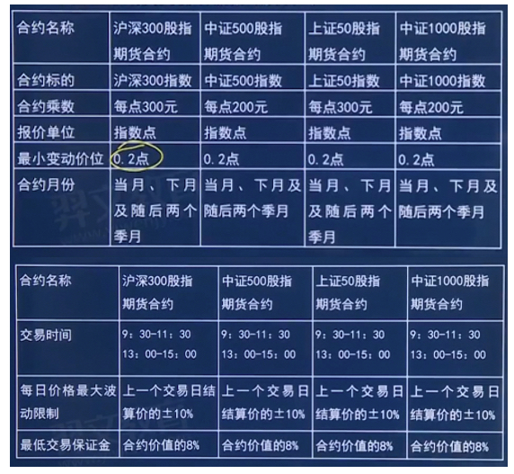
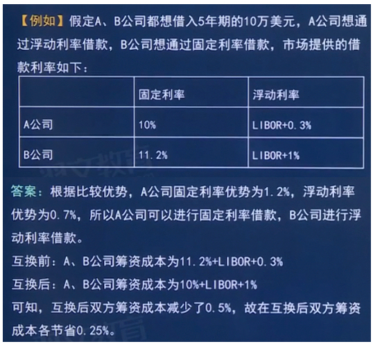

# 7.金融衍生工具

## 第一节 金融衍生工具概述

### 7.1.1 金融衍生工具概述
1. 金融衍生工具概述 
   1. 又称金融衍生产品，是与**基础金融产品**（股票、债券、货币等）相对应的概念，指建立在基础产品或基础变量**之上**，、 
   2. 其价格取决于基础金融产品价格（或数值）变动的**派生金融产品**
2. 基础产品
   1. ①基础产品不仅包括**现货金融产品**（如债券、股票、银行定期存款单等)，也包括**金融衍生工具**。 
   2. ②作为金融衍生工具基础的变量种类繁多，主要是各类资产价格、价格指数、利率、汇率、费率、通货膨胀率以及信用等级等；
    近些年来，某些自然现象（如气温、降雪量、霜冻、飓风)甚至人类行为（如选举、温室气体排放）也逐渐成为金融衍生工具的基础变量。

3. 基本特征🌟
   - 跨期性：
     - 金融衍生工具是交易双方通过对利率、汇率、股价等因素变动趋势的预测，
     - 约定在未来某一时间按照一定条件**进行交易**或选择**是否交易**的合约
     - 大部分金融衍生工具是约定未来某个期限交易基础金融产品的合约
   - 杠杆性
     - 金融衍生工具交易一般只需要支付少量的保证金或权利金就可签订远期大额合约或互换不同的金融工具
   - 联动性：
     - 金融衍生工具的价值与基础产品或基础变量紧密联系、规则变动。
   - 不确定性或高风险性
     - 金融衍生工具的交易后果取决于交易者对基础工具（变量）未来价格（数值）的**预测和判断**的
       准确程度。基础金融工具价格不确定性仅仅是金融衍生工具风险性的一个方面
     - 金融衍生工具还可能有**有以下风险**：
       - (1)交易中**对方违约**，没有履行承诺造成损失的**信用风险**
       - (2)因资产或指数**价格不利变动**可能带来损失的**市场风险**
       - (3)因市场**缺乏交易对手**而导致投资者**不能平仓或变现**所带来的**流动性风险。**
       - (4)因交易对手**无法按时付款**或交割可能带来的**结算风险**
       - (5)因交易或管理人员的人为错误或系统故障、控制失灵而造成的**操作风险**
       - (6)因合约不符合所在国法律，无法履行或合约条款遗漏及模糊导致的**法律风险**

4. 大宗商品类金融衍生工具的概念及分类（掌握）
   1. 大宗商品类金融衍生工具，
      1. 是指**标的资产为大宗商品**或者**商品价格指数**及**相关指数**的远期、期货、期权及互换
      2. 常见的标的有衣产品、金属、原油和其他石化产品、天然气、电力、海运费和天气指数等
   2. 大宗商品类金融衍生工具按照**其自身交易的方法及特点**可分为**商品期货**、**商品期权**、**商品远期及商品互换**
   3. 大宗商品类金融衍生工具按照**交易场所**可以分为**在交易所交易的衍生工具**和在**场外交易市场（**简称“0TC”）交易的衍生工具
5. 金融衍生工具的分类（掌握
   1. 按产品形态分类
      - 独立衍生工具：
        - 概念
          - 独立衍生工具指本身即为**独立存在**的金融合约
          - 远期合同、期货合同、互换合同和期权合同等
        - 特征：
          - ①其价值随特定利率、金融工具价格、商品价格、汇率、价格指数、费率指数、信用等级、信用指数或其他类似变量的
            **变动而变动**。变量为非金融变量的，该变量与合同的任一方不存在特定关系。
          - ②**不要求初始净投资**，或与对市场情况变化有类似反应的其他类型合同相比，要求很少的初始净投资
          - ③**在未来**某一日期结算
      - 嵌入式衍生工具（在主合同中嵌入一个衍生合同）：
        - 概念
          - 指嵌入非衍生工具（即主协议）中，使混合工具的全部或部分现金流量随**特定利率**、金融工具价格、商品价格、汇率、
            价格指数、费率指数、信用等级、信用指数或其他类似变量的变动而**变动**的衍生工具。
          - 可转换公司债券、公司债券条款中包含的赎回条款、返售条款等
   2. 按金融衍生工具自身交易的方式及特点分类
      1. 金融远期合约
         1. 指交易双方在**场外市场**上通过协商，按约定价格（称为远期价格)在约定的**未来日期**（交割日）买卖某种标的金融资产
            (或金融变量)的合约。
         2. 金融远期合约规定了将来**交割的盗产**、**交割的日期**、**交割的价格和数量**，合约条款根据双方需求协商确定
         3. 金融远期合约主要包括**远期利率协议**、**远期外汇合约**、**远期股票合约等**。
      2. 金融期货
         1. 指交易双方在**集中的交易场所**以**公开竞价**方式进行的**标准化**金融期货合约的交易
         2. 金融期货是以**金融工具**（或金融变量）为**基础工具**的期货交易
         3. 主要包括**货币**期货、**利率**期货、**股票指**数期货和**股票**期货四种。
      3. 金融期权
         1. 指**合约买方**向卖方支付一定费用（被称为期权费或期权价格)，在约定日期内（或约定日期）享有按事先确定的价格向
            合约卖方买卖某种金融工具的权利的契约。
         2. 包括**现货期权**和**期货期权**两大类。
      4. 金融互换
         1. 指两个或两个以上的当事人按共同商定的条件，在约定的时间内**定期交换现金流**的金融交易
         2. 可分为**货币互换、利率互换、股权互换、信用违约互换**等
      5. 结构化金融衍生工具
         1. 前述四种常见的金融衍生工具通常也被称作建构模块工具，它们是最简单和最基础的金融衍生工具，而利用其结构化特性
            ,通过相互结合或者与基础金融工具相结合，能够开发设计出更多具有复杂特性的金融衍生产品，后者通常被称为结构化金
            融衍生工具，或被简称为**结构化产品**。

   3. 按基础工具种类分类
       - 股权类产品的衍生工具：
         - 指以**股票或股票指数**为基础工具的金融衍生工具
         - 股票期货、股票期权、股票指数期货、股票指数期权等
       - 货币衍生工具：
         - 指以各种货币作为基础工具的金融衍生工具
         - 远期外汇合约🌟、货币期货、货币期权、货币互换以及上述合约的混合交易合约
       - 利率衍生工具：
         - 指以**利率或利率的载体**为基础工具的金融衍生工具，
         - 远期利率协议、利率期货、利率期权、利率互换以及上述合约的混合交易合约
       - 信用衍生工具：
         - 指以基础产品所蕴含的信用风险或违约风险为基础变量的金融衍生工具，用于转移或防范信用风险
         - 是20世纪90年代以来发展最为迅速的一类衍生产品
         - 主要包括信用互换、信用联结票据以及信用风险缓释合约、信用风险缓释凭征等信用风险缓释工具。
       - 其他衍生工具：
         - （交易变量不是金融产品）
         - 例如用于管理气温变化风险的天气期货、管理政治风险的政治期货、管理巨灾风险的巨
           灾衍生产品等。
   4. 按交易场所分类
      1. 交易所交易的衍生工具
         1. 指在**有组织的交易所上市交易**的衍生工具，例如在股票交易所交易的股票期权产品，
            在期货交易所和专门的期权交易所交易的各类期货合约、期权合约等。
      2. 场外交易市场（OTC）交易的衍生工具
         1. 指通过各种通讯方式，不通过集中的交易所，实行分散的、一对一交易的衍生工具，例如金融机构之间、金融机构与大规
            模交易者之间进行的各类互换交易和信用衍生产品交易。

### 7.1.2 金融衍生工具的发屠及现状（了解）
1. 金融衍生工具的发展动因
   1. 金融衍生工具产生的最基本原因是**避险**
   2. 20世纪80年代以来的金融自由化进一步推动了金融衍生工具的发展
   3. 金融机构的**利润驱动**是金融衍生工具产生和迅速发展的又一重要原因。（金融衍生工具业务属于表外业务）
   4. 新技术革命为金融衍生工具的产生与发展提供了**物质基础与手段**
2. 金融衍生工具的发展现状
   1. 第一，金融衍生工具以**场外交易**为主
   2. 第二，按基础产品比较，利率衍生品无论在场内还是场外，均是**名义金额最大**的衍生品种类，其中，**场外交易的利率**互换
      占所有衍生品名义金额的半数以上，是最大的单个衍生品种类
   3. 第三，按产品形态比较，**远期和互换**这两类具有对称性收益的衍生产品比收益不对称的期权类产品大得多
   4. 第四，近年来，由于场外利率类衍生品名义金额下降较多，场外衍生品整体呈下降趋势，而场内衍生品却大幅增长
3. 我国的金融衍生工具市场
   1. 我国金融衍生工具市场分为**交易所交易市场、场外交易市场**。
      其中，场外交易市场包括**银行间与银行柜台衍生工具市场**、**证券公司机构间与证券公司柜台衍生工具**市场两大部分。
   2. 金融衍生工具的**交易所市场**
      1. **2006年9月8日**，**中国金融期货交易所**成立，并于2010年4月16日正式上市交易沪深300指数期货。
      2. 经中国证监会批准，上海证券交易所于**2015年2月9日**上市交易了**上证50ETF**期权合约品种，这是内地交易市场第一只期权品种。
   3. 金融衍生工具的**场外交易市场**
      1. (1)银行间与银行柜台衍生工具市场
         1. ①中国银行间衍生工具市场主要集中于中国外汇交易中心全国银行间同业拆借中心。
         2. ②银行柜台衍生工具市场
            1. 根据原中国银监会的规定，取得衍生产品交易资格的银行业金融机构可与**机构客户**进行衍生产品交易，
            2. 目前主要涉及**远期结售汇、外汇远期与掉期、利率衍生品交易**等
            3. 商业银行在个人理财产品和业务的经营活动中，也较多涉及嵌入式金融衍生品的交易
      2. (2)证券公司机构间与证券公司柜台衍生工具市场
         1. ①机构间市场又被称为**机构间私募产品报价与服务系统**(简称报价系统)，是经中国证监会批准设立的为机构投资者提
            供私募产品报价、发行、转让及相关服务的专业化电子平台。
         2. ②证券公司柜台市场
            1. 根据中国证监会的规定，获得**场外期权、互换业务资格**的证券公司，可以**在证券公司柜台**开展相关衍生产品业务
4. 《期货和衍生品法》的颁布及特点 
   1. 2022年4月20日全国人大常委会审议通过了《期货和衍生品法》，自2022年8月1日起施行。
   2. 《期货和衍生品法》在立法上的特点主要体现在四个方面。
      1. (1)以期货为主，兼顾其他衍生品。
      2. (2)以场内为主，兼顾场外。
      3. (3)以境内为主，兼顾境外。
      4. (4)以标准化产品为主，兼顾非标产品。
   3. 交易报告库制度
      1. 首次明确了交易报告库的法律地位及主要职责，规定“应当**建立衍生品交易报告库**，对衍生品交易标的、规模、对手方
         等信息进行集中收集、保存、分析和管理，并按照规定及时向市场披露有关信息”。
      2. 目前，共建成**中证报价场外业务交易报告库**、**中国期货市场监控中心交易报告库**两家交易报告库，并相继被金融稳定理
         事会(FSB)认证为正式交易报告库(TR),表明我国交易报告库建设已初步达到国际标准。

### 7.1.3 金融衍生工具市场的功能及作用（了解）
1. 功能
   1. 价格发现的功能
      1. 指金融衍生工具市场能够预期未来现货价格的变动，发现未来的现货价格
   2. 风险管理的功能
      1. 任何一个衍生工具的推出都是出于**避险**的需要，
      2. **管理风险**是衍生工具市场的**初始功能**，是衍生工具市场发展的一个**立足点。**
   3. 资源配置的功能
2. 金融衍生工具市场的作用
   1. 金融衍生工具市场在宏观经济中的作用
      1. (1)提供分散、转移价格风险的工具，有助于稳定国民经济
      2. (2)为政府制定宏观经济政策提供参考依据
         1. 例如上海期货交易所的铜、铝、锌等期货报价已经为国家和行业所认可，成为资源定价的依据，并在国际上产生了影响
            ,充分体现了金融衍生工具市场的价格发现功能。
      3. (3)促进本国经济的国际化
      4. (4)有助于市场经济体系的完善。 
         1. 融衍生工具市场是市场经济发展到一定历史阶段的产物，是市场体系中的**高级形式**。
   2. 金融衍生工具市场在微观经济中的作用
      1. (1)锁定生产成本，实现预期利润。
         1. 利用金融衍生工具市场进行套期保值，可以帮助生产经营者规避现货市场的价格风险，达到**锁定生产成本、实现预期利**
            润的目的，避免企业生产活动受到价格波动的干扰，保证生产活动的平稳进行、
      2. (2)利用金融衍生工具价格信号，组织安排现货生产
      3. (3)金融衍生工具市场**拓展现货销售和采购渠道**
         1. 在现货市场发展不完善的情况下，持有或需要现货的生产经营者利用期货市场进行实物交割，可以弥补现货市场流通功能的不足。

## 第二节 金融远期、期货与互换

### 7.2.1 商品期货合约与商品期货市场（了解）

1. 商品期货概念及分类
   1. 概念
      1. 期货交易是指以**期货合约**或者**标准化期权**合约为交易标的的交易活动
      2. 期货合约是指期货交易场所**统一制定**的、约定在将来某一特定的时间和地点交割一定数量标的物的**标准化合约**
      3. 商品期货是指标的物为**实物商品**的期货合约，主要包括**农产品期货**、**金属期货**和**能源化工期货**等
   2. 商品期货市场
      1. 自**1990年10月**我国第一家商品期货交易所一**郑州商品交易**所前身郑州粮食批发市场成立以来，我国商品期货市场得到了较快发展。
      2. 目前，我国共有**上海**期货交易所、**大连**商品交易所、**郑州**商品交易所和2021年4月19日揭牌成立的**广州**期货交易所四大商品期货交易所。
      3. 期货市场监管方面，我国形成了中国证监会、地方证监局、期货交易所、中国期货业协会和中国期货市场监控中心
        “五位一体”的监管体系与较为完善的期货监管法律体系
   3. 商品期权市场
      1. 期权合约
         1. 是指约定买方有权在将来某一时间以**特定价格**买入或者卖出约定标的物（包括期货合约）的**标准化或非标准化**合约
      2. 期权是指在未来一定时期**可以买卖**的权利，是买方向卖方支付一定数量的金额（指权利金）后拥有的在未来一段时间内（指美式期权）
         或未来某一特定日期（指欧式期权）以事先确定的价格（指履约价格）向卖方购买或出售一定数量的特定标的物的权利，但不负有必须买进或卖出的义务
      3. 按期权规定的交易方向可以分为**看涨期权**和**看跌期权**
         1. 按行使期权的时间可以分为**美式期权**和**欧式期权**
         2. 按期权标的资产可以分为商品期权和金融期权
         3. 按期权的交易场所可以分为场内期权和场外期权
         4. 按期权标的资产形式可以分为现货期权和期货期权
         5. 标的资产为实物资产的期权称为商品期权，也称为实物期权，如我国大连商品交易所挂牌交易的豆粕期权是以豆粕期货
            合约为标的的期权，即商品期货期权。

### 7.2.2 金融期货合约与金融期货市场（掌握）

1. 金融期货的定义和特征
   1. 金融期货是期货交易的一种
      1. 金融期货是以**金融工具**（或金融变量）为基础工具的期货交易。
      2. 金融期货合约的基础工具是各种金融工具（或金融变量），如外汇、债券、股票、股价指数等。

   2. 金融期货的特征🌟
      - 金融期货交易VS金融现货交易
          - **交易对象**不同
            - **金融期货合约**是由期货交易所设计的一种对指定金融工具的种类、规格、数量、交收月份、交收地点都作出统一规定的**标准化协议**。
            - 金融现货交易的对象是**某一具体形态**的金融工具，通常，它代表着一定所有权或债权关系的股票、债券或其他金融工具；
            - 而金融期货交易的对象是金融期货合约。
          - **交易目的**不同（规避风险/投资）
            - 金融工具现货交易的首要目的**是筹资或投资**，即为生产和经营筹集必要的资金，或为暂时闲置的货币资金寻找生息获利的投 资机会。
            - **金融期货交易**与金融现货交易不同，它不能创造价值，不是投资工具，而是一种**风险管理工具**。 
            - 风险厌恶者可以利用它进行套期保值、规避风险，风险喜好者则利用它承担更大的风险。
          - **交易价格的含义**不同（预期未来现货的价格/金融产品现货价格）
            - 金融现货的交易价格是在交易过程中通过**公开竞价或协商议价**形成的，这一价格是实时的成交价，代表在某一时点上供
              求双方均能接受的**市场均衡价格**。
            - 金融期货的交易价格也是在交易过程中形成的，但这一交易价格是对**金融现货未来价格的预期**，这相当于在交易的同时
              发现了金融现货基础工具（或金融变量）的**未来价格**。
          - **交易方式**不同（无需有满足交易量的/手上必须有满足交易量的金融产品）
            - 金融工具现货交易一般要求在成交后的几个交易日内完成资金与金融工具的**全额结算**，成熟市场中通常也允许进行保证
              金买入或卖空，但所涉及的资金或证券缺口部分是由经纪商出借给交易者，要收取相应利息
            - 期货交易则实行保证金交易和逐日盯市制度，交易者并不需要在成交时拥有或借入全部资金或基础金融工具。
          - **结算方式**不同（大部分不采用到期交割，而是采用对冲平仓的方式🌟/一手交钱一手交货）
            - 金融现货交易通常以基础金融工具与货币的转手而结束交易活动，
            - 而在金融期货交易中，仅有极少数的合约到期进行交割交收，绝大多数的期货合约是通过做相反交易实现对冲而平仓的。

      - 金融期货交易VS普通远期交易
          - 交易场所和交易组织形式不同（场内/场外）
            - **金融期货**必须在有组织的交易所进行**集中交易**；
            - 而**远期交易**在场外市场进行**双边交易**
          - 交易的监管程度不用（场内更严格）
            - 在世界各国，金融期货交易至少要受到一家以上的监管机构监管，交易品种、交易者行为均须符合监管要求；
            - 而远期交易则较少受到监管
          - 期货交易是标准化交易，远期交易的内容可协商确定
          - 保证金制度和每日结算制度导致违约风险不同
            - 金融期货交易实行保证金制度和每目结算制度，交易者均以交易所（或期货清算公司）为交易对手，基本不用担心交易违约；
            - 而远期交易通常不存在上述安排，存在一定的交易对手违约风险。

2. 金融期货的主要制度
   1. 集中交易制度 
      1. 金融期货**在期货交易所**或**证券交易所**进行集中交易。 
      2. 期货交易所是专门进行期货合约买卖的场所，是期货市场的核心，承担着组织、监督期货交易的重要职能。
   2. 标准化的期货合约和对冲机制 
      1. (1)期货合约是由**交易所设计**、经监管机构批准后向市场公布的**标准化合约**。
      2. (2)期货合约设计成标准化的合约是为了便于交易双方在合约**到期前**分别做一笔相反的交易进行对冲，从而**避免实物交收**
      3. (3)绝大多数期货合约并不进行实物交割，通常在到期日之前即已**对冲平仓**
   3. 保证金制度 
      1. (1)为了控制期货交易的风险和提高效率，期货交易所的会员经纪公司必须向交易所或结算所缴纳**结算保证金**，而期
         货交易双方在成交后都要通过经纪人向交易所或结算所缴纳一定数量的保证金
      2. (2)期货交易的保证金比率很低，因此有高度的杠杆作用，这一杠杆作用使套期保值者能用少量的资金为价值量很大
         的现货资产找到回避价格风险的手段，也为投机者提供了用少量资金获取盈利的机会
   4. 结算所和无负债结算制度（每日结算，也叫每日盯市制度） 
      1. (1)结算所是期货交易的**专门清算机构**，通常附属于交易所，但又以独立的公司形式组建
      2. (2)结算所实行无负债的每目结算制度，又被称为“逐日盯市制度”，就是以每种期货合约在交易日收盘前规定时间
         内的**平均成交价**作为当日结算价，与每笔交易**成交时的价格**作对照，计算每个结算所会员账户的浮动盈亏，进行**随市清算**。
   5. 限仓制度（有最大仓位限制，为了保证金融市场稳定，防控风险） 
      1. 对于同一客户在不同会员处开仓交易的情况，其在某一合约的**单边持仓合计不得超出**该客户的持仓限额。
      2. 当会员、客户持仓达到或者超过持仓限额的，**不得同方向**开仓交易。
   6. 大户报告制度（大户要及时报告） 
      1. 大户报告制度是交易所建立限仓制度后，当会员或客户的持仓量达到交易所规定的数量时，必须向**交易所**申报有关开户、
         交易、资金来源、交易动机等情况，以便交易所审查大户是否有过度投机和操纵市场行为，并判断大户交易风险状况的风险控制制度。
   7. 每日价格波动限制及断路器规则 
      1. 为防止期货价格出现过大的非理性变动，交易所通常对每个交易时段允许的最大波动范围作出规定，一旦达到涨（跌）
         幅限制，则高于（低于）该价格的买入（卖出）委托无效，又称**涨跌停板制度**。
   8. 强行平仓制度（平仓就是对冲） 
      1. 包括交易所对**会员持仓**、客户持仓进行的强行平仓及期货公司对其客户持仓进行的强行平仓
      2. 《中国金融期货交易所风险控制管理办法》规定了在下**列五种**情形下会强行平仓：
         1. (1)会员结算准备金**余额小于零**，并未能在规定时限内补足的
         2. (2)持仓超出**持仓限额标准**，并未能在规定时限内平仓的
         3. (3)因违规受到中金所**强行平仓处罚**的
         4. (4)根据中金所的紧急措施应予以强行平仓的
         5. (5)其他应予以强行平仓的
   9. 强行减仓制度
      1. 指交易所将当日以涨跌停板价格申报的未成交平仓报单，以当日涨跌停板价格与该合约净持仓盈利客户按照持仓比例自
         动撮合成交
      2. 除上述常规制度之外，期货交易所为了确保交易安全，还规定了临时调整保证金比例（金额)等交易规则。

3. 种类
    - 外汇期货
        - 又称**货币期货**
        - 以**外汇为基础工具**的期货合约
        - 是金融期货中**最先产生**的品种
        - 主要用于**规避外汇风险**
    - 利率期货
        - 基础资产是一定数量的**与利率相关**的某种金融工具
        - 主要是各类**固定收益金融工具**
        - 目的：**规避利率风险**
        - 固定利率有价证券的价格受到**现行利率和预期利率**的影响，价格变化与利率变化一般呈**反向**关系。
        - 品种🌟
            - 债券期货：以国债期货为主的债券期货是各主要交易所**最重要**的利率期货品种
            - 主要参考利率期货：
              - 除国债利率外，常见的参考利率包括伦敦银行间同业拆放利率（Libor）、香港银行间同业拆放利率（Hibor）、欧洲美元定期存款单利率、联邦基金利率等
    - 股权类期货
        - 以**单只股票**、**股票组合或者股票价格指数**为基础资产的期货合约
        - 是为适应人们控制股市风险，尤其是**系统性风险**的需要而产生的
        - 股票价格指数期货的交易单位等于**基础指数的数值**与交易所规定的**每点价值**之乘积，采用**现金结算**。
        - 品种
            - 股票价格指数期货
                - 是以**股票价格指数**为基础变量的期货交易，是为适应人们控制股市风险，尤其是**系统性风险**的需要而产生的。
                - **股票价格指数期货**的交易单位等于基础指数的数值与交易所规定的每点价值之乘积，**采用现金结**算🌟
                - 新加坡交易所（SGX）于2006.9.5推出以新华富时50指数为基础变量的全球首个中国A股指数期货
            - 单只股票期货
              - 是以**单只股票**作为基础工具的期货，买卖双方约定，以约定的价格在合约到期日**买卖规定数量的股票**。
              - 事实上，股票期货均实行**现金**交割
              - 为防止操纵市场行为，并不是所有上市交易的股票均有期货交易，交易所通常会选取**流通盘较大、交易比较活跃**的股票
                推出相应的期货合约，并且对投资者的**持仓数量进行限制**。
            - 股票组合的期货
              - 是金融期货中最新的一类，是**以标准化的股票组合**为基础资产的金融期货。

4. 中国金融期货交易所与期货合约
   1. 中国金融期货交易所
      1. (1)中国金融期货交易所于2006年9月8日在上海成立，是经**国务院同意、中国证监会批准**，由上海期货交易所、郑州
         商品交易所、大连商品交易所、上海证券交易所和深圳证券交易所共同发起设立的中国**首家公司制**交易所，注册资本为5亿元人民币
         1. 股东大会是公司的权力机构，公司设董事会，对股东大会负责，并行使股东大会授予的权力
      2. (2)中国金融期货交易所实行会员分级结算制度，会员分为**结算会员**和**交易会员**。
         结算会员按照业务范围分为**交易结算会员**、**全面结算**会员和**特别结算**会员。
   2. 期货合约
      1. (1)沪深300股指期货合约
         1. ①中国金融期货交易所**首个股**票指数期货合约为沪深300股指期货合约。
         2. ②合约乘数定为每点价值300元人民币，假设期货报价为3000点，则每张合约名义金额为3000×300=900000元人民币。
      2. (2)中证500股指期货合约：合约乘数为每点价值200元人民币
      3. (3)上证50股指期货合约：合约乘数为每点价值300元人民币
      4. (4)中证1000股指期货合约：合约乘数为每点人民币200元
      5. 
   3. 投资者适当性制度
      1. 将投资者分为**自然人投资**者、**一般单位客户**和**特殊单位客户**
   4. 交易规则
      1. (1)交易编码。
         1. 交易编码是客户、从事自营业务的交易会员进行期货交易的**专用代码**
         2. 投资者可以根据不同投资目的，分别申请**套期保值**、**套利**和投机用途的客户号
      2. (2)保证金
         1. 保证金分为**结算准备金**和**交易保证金**。
         2. 结算准备金是指**未被合约占用**的保证金；交易保证金是指**已被合约占**用的保证金。
         3. 经交易所批准，会员可以根据有关规定提交有**价证券**作为保证金。
      3. (3)竞价交易
         1. 股指期货竞价交易采用**集合竞价**交易和**连续竟**价交易两种方式。
         2. 集合竞价交易采用**最大成交量**原则确定成交价，即以此价格成交能够得到最大成交量
         3. 连续竞价交易按照**价格优先、时间优先**的原则撮合成交
         4. 以当前价格波动限制申报的指令，按照**平仓优先、时间优先**的原则撮合成交
      4. (4)结算价
         1. 结算价是指某一合约当日一定时间内成交价格**按照成交量的加权平均价**
         2. 结算价是进行当**日未平仓合约盈亏**结算和计算下一交易日**交易价格限制**的依据。
      5. (5)最大波动限制
         1. 股指期货合约的每日最大波动限制为上一交易日结算价的±10%
         2. 2年期国债期货合约的每日最大波动限制为上一交易日结算价的±0.5%；
         3. 5年期国债期货合约的每日最大波动限制为上一交易日结算价的士1.2%；
         4. 10年期国债期货合约的每日最大波动限制为上一交易日结算价的士2%。
      6. (6)持仓限额制度
         1. 对于沪深300股指期货合约，进行**投机交易**的客户某一合约单边持仓限额为**5000手**；
         2. 中证500、上证50合约均**为1200手**
         3. 某一股指期货合约结算后单边总持仓**量超过10万手**的
         4. 结算会员下一交易日该合约单边持仓量不得超过该合约单边总持仓量**的25%**
      7. (7)大户报告制度
      8. (8)若干重要风险控制手段
         1. 交易所有权根据市场情况采取提高交易保证金标准、限制
            开仓、限制出仓、限期平仓、强行平仓、暂停交易、调整涨跌
            停板幅度、强制减仓或者其他风险控制措施。

### 7.2.3 金融期货合约与金融期货市场（掌握）
1. 金融期权的定义
   1. 金融期权是指以金融工具或金融变量为基础工具的**期权交易**形式
   2. 具体地说，其购买者在向出售者**支付一定费用**后，就获得了能在规定期限内以某一特定价格向出售者**买进或套出**
   3. 期权交易实际上是一种权利的**单方面有偿让渡**。 
2. 金融期权的特征
   1. 与金融期货相比，金融期权的主要特征在于它仅仅是**买卖权利**的交换。
   2. 期权的买方在支付了期权费后，就获得了期权合约所赋予的权利，但并没有必须履行该期权合约的义务。
   3. 期权的卖方在收取期权费后就承担着在规定时间内履行该期权合约的义务，而**没有选择**的权利。
3. 金融期货VS金融期权🌟
    - 基金资产不同
        - 期货（范围相对小）：可作期货交易的金融工具都可作期权交易
        - 期权：可作期权交易的金融工具**未必**可作期货交易
        - 在实践中，只有金融期货期权，而没有金融期权期货，一般而言，金融期权的基础资产**多于**金融期货的基础资产。
    - 交易者权利与义务的对称性不同
        - 期货：权利和义务对称
        - 期权：交易双方的权利与义务**不对称性**
          - 期权的买方**只有权利**没有义务，
          - 而期权的卖方**只有义务**没有权利。
    - 履约保证不同
        - 期货：双方**均需开立保证金**账户，并按规定缴纳违约保证金
        - 期权：
          - 只有期权出售者需开立保证金账户，并按规定缴纳保证金。
          - 期权的**购买者无需**缴纳保证金
    - 现金流转不同
        - 期货：
          - 交易双方都必须**保有一定的流动性较高**的资产，以备不时之需（如金融产品价格变化，补交保证金）
        - 期权：
          - 成交后，除了**到期履约**外，交易双方不发生任何现金流转
    - 盈亏特点不同
        - 期货：
          - 金融期货交易双方都无权违约，也无权要求提前交割或推迟交割，而只能在到期前的任一时间通过**反向交易**实现对冲或
            到期进行交割。
          - 双方潜在的盈利和亏损都是无限的
        - 期权：
          - 买方盈利无限，亏损有限；
          - 卖方盈利有限，亏损无限
    - 套期保值的作用与效果不同
        - 期货：在避免价格不利变动造成损失的同时，也**必须放弃**价格有利变动获得的利益
        - 期权：即可避免价格不利变动造成的损失，又可在相当程度上**保住价格有利变动**带来的利益
4. 金融期权的分类
    - 按照选择权的性质划分
        - **认购期权**：被称为看涨期权（买权）
          - 指期权的买方具有在约定期限内（或合约到期日）按行权价格（也称为敲定价格或执行价格)向期权的卖方**买入**一定数量标的资产的权利
          - 交易者之所以买入认购期权，是因为他预期基础金融工具的价格在合约期限内**将会上涨**
        - **认沽期权**：被称为看跌期权（卖权）、
          - 指期权的买方具有在约定期限内按行权价格向期权的卖方卖出一定数量标的资产的权利
          - 交易者买入认沽期权，是因为他预期基础金融工具的价格在近期内将会下跌。
    - 按照合约所规定的履行时间的不同
        - **欧式期权**：只能在**期权到期日**执行
        - **美式期权**：可在**到期日或到期日之前的任何一个营业日**执行
        - **修正的美式期权**：也称百慕大期权、大西洋期权，在到期日之前的一系列**规定日期**执行
    - 按照**金融期权基础资产性质**不同🌟
        - **股权类期权**：
          - 单只股票期权
            - ①单只股票期权（以下简称“股票期权”）指买方在交付了期权费后，即取得在合约规定的到期日或到期日以前按协定
              价格买入或卖出一定数量相关股票的权利。
          - 股票组合期权
            - ②股票组合期权是以**一篮子股票为基础资产**的期权，代表性品种是交易所交易基金的期权。
          - 股价指数期权
            - ③股价指数期权是以股价指数为基础资产，买方在支付了期权费后，即取得在合约有效期内或到期时以**协定指数**与**市场**
              **实际指数**进行**盈亏结算**的权利。股价指数期权没有可作实物交割的具体股票，只能采取**现金轧差**的方式结算。
        - **货币期权**
          - 利率期权指买方在支付了期权费后，即取得在合约有效期内或到期时以一定的利率（价格）买入或卖出一定面额的**利率工具**的权利。
          - 利率期权合约通常以政府短期、中期、长期债券，欧洲美元债券，大面额可转让存单等**利率工具**为基础资产。
        - **互换期权**
          - 货币期权又称为外币期权、外汇期权，指买方在支付了期权费后，即取得在合约有效期内或到期时以约定的汇率购买或
            出售一定数额某种**外汇资产**的权利。
          - 货币期权合约主要以美元、欧元、日元、英镑、瑞士法郎、加拿大元及澳大利亚元等为基础资产
        - **利率期权**
          - 金融期货期权是一种以**金融期货合约为交易**对象的期权，它赋予期权的买方在规定时间内以协定价格买卖**特定金融期货合约**的权利。
        - **金融期权合约期权**
          - 互换期椒是以金融互换合约为交易对象的期权，它赋予其持有者在规定时间内以规定条件与交易对手进行**互换交易**的权利。
        - **奇异性期权**：任选期权、百慕大期权、障碍期权、平均期权 
          - 例如，有的期权合约具有两种基础资产，可以择优执行其中一种（**任选期权**）；
            - 有的可以在规定的一系列时点行权（**百慕大期权**)；
            - 有的对行权设置一定条件（**障碍期权**）；
            - 有的行权价格可以取基础资产在一段时间内的平均值（**平均期权**）等。
5. 金融期权的主要风险指标
   1. Delta值
      1. **概念**：反映期权标的证券价格变化对期权价格的影响程度
      2. `Delta=期权价格变化/期权标的证券价格变化。`
      3. 标的证券价格与认购期权价值为**正相关**关系，与认沽期权价值为负相关关系。
   2. Gamma值
      1. **概念**：反映期权标的证券价格变化对Delta值的影响程度
      2. `Gamma=Delta的变化/期权标的证券价格变化`
   3. Ro值
      1. **概念**：反映无风险利率变化对期权价格的影响程度
      2. `Rho=期权价格的变化/无风险利率的变`
      3. 市场无风险利率与认购期权价值为正相关，与认沽期权为负相关。
   4. Theta值
      1. **概念**：反映到**期时间变化**对期权价值的影响程度
      2. `Theta=期权价值变化/到期时间变化`
      3. 到期期限与认购、认沽期权价值均为**正相关**关系。
   5. Vega值
      1. **概念**：反映合约标的证券价格波动率变化对期权价值的影响程度
      2. `Vega=期权价值变化/波动率的变化`
      3. 波动率与认购、认沽期权价值均**为正相关**关系。
6. 我国主要期权品种
   1. 上证50ETF期权
      1. 概念
         1. 经中国证监会批准，上海证券交易所**于2015年2月9日**上市交易了上证50ETF期权合约品种
         2. 合约标的为**上证50交易型开放式指数证券投资基金**
         3. 认购期权、认洁期权两类；
         4. 到期月份分别为当月、下月及随后的两个季月；
         5. 采用实物交割方式
      2. **个人投资者**参与上海证券交易所期权交易，**应当符合下列条件**：
         1. 申请开户前20个交易日日均托管在其委托的期权经营机构的证券市值与资金账户可用余额（不含通过融资融券交易融入的证券和资金)，合计**不低于人民币50万**元；
         2. 指定交易在证券公司**6个月以上**并具备融资融券业务参与资格或者金融期货交易经历；
         3. 或者在期货公司开户**6个月以上**并具有金融期货交易经历等。
      3. **普通机构投资者**参与期权交易，应当符合下列条件：
         1. 申请开户前**20个交易日**日均托管在其委托的期权经营机构的证券市值与资金账户可用余额（不含通过融资融券交易融入的证券和资金)，合计不低于人民币100万元； 
         2. 净资产不低于人民币100万元等
      4. 为提高期权交易的流动性，上海证券交易所引入了**做市商制度**。
         1. 做市商分为**主做市商**和**一般做市商**。主做市商提供的服务包括：
            1. (1)向投资者提供双边持续报价；
            2. (2)对投资者询价提供双边回应报价；
            3. (3)交易所规定或者做市协议约定的其他业务。
            4. 一般做市商提供上述第(2)(3)项规定的做市服务。
         2. 根据目前交易所规则规定，投资者单日**买入开仓限额**为总持仓限额的2倍，最大不超过1万张； 
         3. 单笔申报最大数量为30张，市价申报的单笔申报最大数量为10张
   2. 沪深300ETF期权
      1. 经中国证监会批准，深圳证券交易所于2019年12月23日又上市了沪深300ETF期权合约品种。
      2. 该产品是以沪深300为标的物的**沪深300ETF交易型指数基金**为标的衍生的标准化合约。
   3. 沪深300股指期权
      1. 经中国证监会批准，中国金融期货交易所于2019年12月23日开展沪深300股指期权上市交易。
   4. 中证1000股指期权
      1. 2022年7月22日中国金融期货交易所同时推出了中证1000股指期货和期权交易
7. 场外期权
   1. 概念
      1. 证券公司场外期权业务是指**证券公司**在**机构间市场或在柜台**，根据与交易对手达成的协议，与交易对手**直接开展的**期权交易
      2. 场外期权业务自2013年开始试点，合约标的主要为以沪深300、中证500、上证50为主的股指，A股个股，黄金期现货及部分境外标的
   2. 与场内期权相比，场外期权具有**如下**特点：
      1. 第一，合约非标准化。交易所期权合约是标准化的，场外期权合约可以是非标准化的。
      2. 第二，交易品种多样、形式灵活、规模巨大。
      3. 第三，交易对手机构化
      4. 第四，流动性风险和信用风险大
         1. 交易所期权随时可以转让，保证金制度和结算制度以及结算机构的参与可以保证**买方几乎不会承担违约风险**，而场外期
            权交易以上两点都无法保证。
         2. 通过场外期权交易，投资者可以实现风险管理、收益管理

## 第三节 远期与互换交易
1. 金融远期合约与远期合约市场（熟悉）
   1. 定义
      1. 金融远期合约是**最基础的**金融衍生产品
      2. 它是交易双方在**场外市场**上通过协商，按约定价格（称为“远期价格”）在约定的未来日期（交割日）买卖某种标的金融资产（或金融变量)的合约
      3. 由于采用了一对一交易的方式，交易事项可协商确定，较为灵活，金融机构或大型工商企业通常利用远期交易作为**风险管理手段**。
      4. 但是，非集中交易同时也带来了搜索困难、交易成本较高、存在对手违约风险等缺点。
   2. 根据**基础资产**划分，常见的金融远期合约包括四个大类。
      1. **股权类**资产的远期合约
         1. 股权类资产的远期合约包括单个股票的远期合约、一篮子股票的远期合约和股票价格指数的远期合约三个子类。
      2. 债权类资产的远期合约
         1. 债权类资产的远期合约主要包括**定期存款单**、**短期债券**、**长期债券**、**商业票据**等固定收益证券的远期合约
      3. 远期利率协议
         1. 指交易双方约定在未来某一日交换协议期间内，在一定名义本金基础上，分别以**合同利率**和**参考利率**计算利息的金融合约。
         2. 远期利率协议的**买方支付以合同利率计算**的利息，卖方支付**以参考利率计算**的利息。
         3. 远期利率协议的参考利率应为经中国人民银行授权的**全国银行间同业拆借中心**等机构发布的银行间市场具有基准性质的
            市场利率或中国人民银行公布的基准利率，具体由交易双方共同约定。
         4. 全国银行间债券市场参与者中，具有**做市商或结算代理业务资格**的金融机构可**与其他所有**市场参与者进行远期利率协议交易，
            其他金融机构可以与**所有金融机构**进行远期利率协议交易，非金融机构只能与具有做市商或结算代理业务资格的金融
            机构进行**以套期保值为目的**的远期利率协议交易。
         5. 远期利率协议交易既可以通过交易中心的交易系统达成，也可以通过电话、传真等其他方式达成
      4. 远期汇率协议
         1. 是指按照约定的汇率，交易双方在约定的未来日期买卖约定数量的某种外币的远期协议。
         2. 目前，与我国证券市场直接相关的**金融远期交易**是**全国银行间债券市场**的债券远期交易
         3. 目前，与我国证券市场直接相关的金融远期交易是全国银行间债券市场的债券远期交易。
         4. 该交易从2005年6月15日起开始在**全国银行间同业拆借中心**进行，中心为市场参与者债券远期交易提供**报价、交易和信息**
            服务，并接受中国人民银行的监管。
         5. 债券远期交易数额最小为**债券面额10万元**，交易单位为债券面额1万元。
2. 金融互换交易
    - 互换的概念🌟
        - --两个或两个以上的当事人按共同商定的条件，在约定的时间内**定期交换现金流**的金融交易
        - 从交易结构上，可将互换交易视为**一系列远期交易的组合**
        - 目前，按名义金额计算的互换交易已成为**最大的**衍生品交易品种
    - 类别
      - 可分为货币互换、利率互换、权益互换、信用互换等类别
    - 利率互换（固定利率和浮动利率互换）
        - 利率互换是一种**最为普遍**的互换类型
        - 甲方同意向乙方支付若干年的现金流（名义本金乘以事先约定的**固定利率**产生的利息），
         同时乙方同意在同样期限内向甲方支付相当于同一名义本金（也是同一货币）按**浮动利率**产生的利息的现金流
        - 这两种利差现金流使用同一币种，互换时间期限一般为2~15年。
        - 2006.1.24，人行发布《关于开展人民币利率互换交易试点有关事宜的通知》，批准在全国银行间同业拆借中心开展人民币利率互换交易试点
        - 人民币利率互换根据约定的人民币本金和利率计算利息，并进行利息交换的金融合约
        - 利率互换之所以会发生，是因为存在以下两种交易需求： 
          - 一是存在不同的**筹资意向**。 
          - 二是存在比较优势，通过互换可以**降低资金成本**。
        - 
    - **货币**互换
        - 将一种货币的本金和固定利率与几乎等价的另一种货币的本金和固定利率进行交换
        - 人民币利率互换，是指交易双方约定在未来的一定期限内，根据约定的人民币本金和利率计算利息并进行利息交
          换的金融合约。
    - **股权类**互换
        - 一种重要的权益衍生工具交易形式
        - 中国证券业协会于2012年底启动股票收益互换业务试点工作
        - 股票收益互换指证券公司于客户根据协议约定，在未来某一期限内针对特定股票的**收益表现**与**固定利率**进行现金交换
    - **信用违约**互换（CDS）
        - 概念
          - 在信用违约互换交易中，违约互换**购买者**将定期向违约互换出售者支付一定费用（称为信用违约互换点差），
            而一旦出现信用类事件（主要指债券主体无法偿付），违约互换购买者将有权利将债券以面值递送给违约互换出售者，从而有
            效规避信用风险。
          - 信用违约互换是国外债券市场中最常见的**信用衍生**产品
        - 危险
          - (1)具有较高的杠杆性。信用保护买方只需要支付少量保费，最多可以获得等于名义金额的赔偿。
          - (2)由于信用保护的买方并不需要真正持有作为参考的信用工具（常见的有按揭贷款、按揭支持证券、各国国债及公
            司债券或者债券组合、债券指数)，因此，特定信用工具可能同时在多起交易中被当作CD$的参考，有可能极大地放大风险
            敞口总额，在发生危机时，市场往往恐慌性地高估涉险金额。
          - (3)因为场外市场**缺乏充分的信息披露和监管**，交易者并不清楚自己的交易对手卷入了多少此类交易，所以，在危机期
            间，每起信用事件的发生都会引起市场参与者的相互猜疑，担心自己的交易对手因此倒下从而使自己的敞口头寸失去着落。
    - 其他类型互换
      - **本金增长型**互换、本金减少型互换和过山车型互换，可延长型互换和可赎回型互换等。
3. 证券公司收益互换业务
   1. 收益互换是指交易双方在约定日期**交换收益金额**的互换交易，其中交易一方或交易双方支付的金额**与标的的表现相关**。 
   2. 中国证监会认可的**场外期权一级交易商**或协会备案的**场外期权二级交易商**，可以开展收益互换业务。
   

- 可转换债券和可交换债券

    - 可转换债券

        - 定义：其持有者可以在一定时期内按一定比例或价格将之转换成一定数量的另一种证券的证券，通常是转换成普通股票
        - 实质是嵌入了普通股票的看涨期权，因此将其列入期权类衍生产品
        - 特征

            - 是一种附有转股权的特殊债券
            - 具有双重选择权的特征（最主要特征，投资人选择是否转换，发行人选择是否赎回）🌟

        - 要素

            - 有效期限和转换期限：最短1年，最长6年，自发行结束之日起6个月后方可转换为公司股票
            - 票面利率或股息率
            - 转换比例或转换价格🌟

                - 转换比例：一定面额可转换债券可转换成普通股票的股数（=可转换债券面额/转换价格）
                - 转换价格：转换为每股普通股票所支付的价格

            - 赎回与回售

                - 赎回：当公司股票价格在一段时间后可以赎回未到期在外的可转换债券
                - 回售：公司股票在一段时间内连续低于转换价格到达某一幅度时，持有人按事先约定的价格将所持可转换债券卖给发行人的行为🌟

            - 转换价格修正条款

    - 可交换债券

        - 定义：上市公司的股东依法发行、在 一定期限内依据约定的条件可以交换成该股东所持的上市公司股份的公司债券
        - 特征

            - 期限最短1年，最长6年
            - 自发行结束之日起12个月后方可交换为预备交换的股票
            - 公司债券交换为每股股份的价格应不低于公告募集说明书日前20个交易日股票均价和前一个交易日的均价

    - 可交换VS可转换🌟

        - 发行主体不同

            - 交：上市公司的股东
            - 转：上市公司本身

        - 用于转股的股份来源不同

            - 交：发行人持有的其他公司已发行在外股份
            - 转：发行人本身未来将发行的新股

        - 转股对公司股本的影响不同

            - 交：不影响标的股票总股本数量
            - 转：标的股票总股本扩大

## 第四节 其他衍生工具简介

### 7.4.1 存托凭证
1. 概念
   1. 国证券市场流通的**代表外国公司有价证券的可转让凭证**，
   2. 一般代表外国公司股票，有时也代表债券
   3. 又被成为预托凭证
2. 优点
   1. 对**发行人**的优点
      1. (1)市场容量大，筹资能力强
      2. (2)避开直接发行股票与债券的法律要求，上市手续简单，发行成本低。
   2. 对投资者的优点，以ADR为例：
      1. (1)以美元交易，且通过投资者熟悉的**美国清算公司进**行清算。
      2. (2)上市交易的ADR须经SEC注册，有助于保障投资者权益。
      3. (3)上市公司发放股利时，ADR投资者能及时获得，而且是以**美元**支付。
      4. (4)某些机构投资者受投资政策限制，不能投资非美国上市证券，ADR可以规避这些限制。
3. 美国存托凭证的有关业务机构
   1. 存券银行：
      1. ADR的发行人和市场中介，为ADR的投资者提供所需的一切服务。
      2. (1)作为ADR的发行人，存券银行在**ADR基础证券**的发行国安排托管银行，当基础证券被解入托管账户后，立即向投资者发出ADR;
         ADR被取消时，指令托管银行把基础证券重新投入当地市场
      3. (2)在ADR交易过程中，存券银行负责ADR的注册和过户，安排ADR在存券信托公司的保管和清算，
         及时通知托管银行变更股东或债券持有人的登记资料，并与经纪人保持经常联系，保证ADR交易的顺利进行。
         同时，存券银行还要向ADR的持有者**派发美元红利或利息**，代理ADR持有者行使投票权等股东权益。
      4. (3)存券银行为ADR持有者和基础证券发行人**提供信息和咨询服务**。
      5. 作为ADR持有者、发行公司的**代理者和咨询者**，存券银行向ADR持有者提供基础证券发行人及ADR的市场信息，解答投资者的询问；
         向基础证券发行人提供ADR持有者及ADR市场信息，帮助发行人建立和改进ADR计划，特别是提供法律、会计、审计等方面的咨询和代理服务；
         协调ADR持有者和发行公司的一切事宜，并确保发行公司符合法律要求。
   2. 托管银行：
      1. 由存券银行在基础证券发行国安排的银行，它通常是存券银行在当地的**分行、附属行或代理行**
      2. 托管银行**负责保管**ADR所代表的**基础证券**；
      3. 根据存券银行的指令**领取红利或利息**，用于再投资或汇回ADR发行国；
      4. 向存券银行提供当地市场信息。
   3. 中央托管公司：ADR的保管和清算
      1. 中央存托公司是指美国的证券中央保管和清算机构，负责ADR的保管和清算。
      2. 美国证券中央保管和清算机构的成员为金融机构，如证券经纪公司、自营商、银行、信托投资公司、清算公司等，其他
         机构和个人也可以通过与以上成员建立托管或清算代理关系，间接地参加证券中央保管和清算机构。
4. 美国存托凭证的种类
   1. 按照基础证券**发行人是否参与存托凭**证的发行，美国存托凭证可分为**无担保的存托凭证**和**有担保的存托凭证**。
   2. 无担保的存托凭证
      1. 无担保的存托凭证由一家或多家银行根据**市场的需求发行**，基础证券发行人**不参与**，存券协议只规定存券银行与存托凭证持
         有者之间的权利义务关系。无担保的存托凭证目前已很少应用
   3. 有担保的存托凭证
      1. 有担保的存托凭证由**基础证券发行人的承销商委**托一家存券银行发行。
      2. 承销商、存券银行和托管银行三方签署存券协议。
      3. 协议内容包括存托凭证与基础证券的关系，存托凭证持有者的权利，存托凭证的转让、清偿、红利或利息的支付以及协
         议三方的权利义务等。
      4. 采用有担保的存托凭证，发行公司可以自由选择存券银行
      5. 有担保的存托凭证分为一级、二级、三级公开募集存托凭证和美国144A规则下的私募存托凭证。
         1. 一级存托凭证允许外国公司无须改变现行的报告制度就可以享受**公开交易证券**的好处；
         2. 想在一家美国交易所上市的外国公司可采用**二级存托凭证**；
         3. 如果要在美国市场上**筹集资本**，则须采用**三级存托凭证**。
         4. 存托凭证的级别越高，所反映的美国证券交易委员会(SEC)登记要求也越高，对投资者的吸引力就越大。
5. 中国存托凭证(CDR)
   1. 概念
      1. 指由存托人签发、**以境外证券**为基础在中**国境内发行**、代表**境外基础证券权益**的证券。
   2. 参与主体
      1. (1)发行人：在境外发行基础证券。
      2. (2)存托人：
         1. 存托人持有基础证券，在境内签发相应的存托凭证； 
         2. 按照存托协议约定，根据存托凭证持有人意愿行使境外基础证券相应权利，办理存托凭证分红、派息等业务。
      3. 持有人：
         1. 存托凭证持有人依法享有存托凭证代表的**境外基础证券权**益，
         2. 并按照存托协议约定，通过**存托人**行使其权利
6. 存托协议
   1. 基础证券发行人、存托人及存托凭证持有人通过**存托协议**明确存托凭证所代表的**权益及各方权利义务**。
   2. 存托协议约定因存托凭证发生的纠纷适用中国法律法规规定，由境内法院管辖。
7. 基础财产
   1. 存托凭证基础财产包括**境外基础证券及其衍生权益**
   2. 存托人可在境外委托金融机构担任托管人。
   3. 托管人负责托管存托凭证基础财产，并负责办理与托管相关的其他业务。

### 7.4.2 结构化金融衍生产品

1. 定义
   1. 运用**金融工程机构化方法**，将若干种**基础金融商品**和**金融衍生产**品相结合设计出的新型金融产品 
   2. 目前最为流行的主要是由商业银行开发的**各类结构化理财产**品以及在交易所市场上市交易的**各类结构化票据**
2. 类别
   - 按联结的基础产品分类
     - 商品联结型产品
     - 股权联结型产品
     - 汇率联结型产品
     - 利率联结型产品
   - 按收益保障性分类
       - 收益保证型产品
         - 本金保障型产品
         - 保证最低收益产品
       - 非收益保证型产品
   - 按发行方式分类
       - 公开募集的结构化产品（通常可以在交易所交易）
       - 私募机构化产品 
   - 按嵌入式衍生产品的属性分类
     - 可以分为**基于互换**的结构化产品、、
     - 基于**期权的结构化**产品等类别。
       
   - 当然，还可以按照币种、期限、发行地等进行分类。
3. 结构化金融衍生产品的收益与风险
   1. 由于结构化金融衍生产品挂钩的基础资产具有不同的风险特征，嵌入式衍生产品的种类、结构各异，导致结构化产品的
      收益与风险**出现非常大的差异**。

