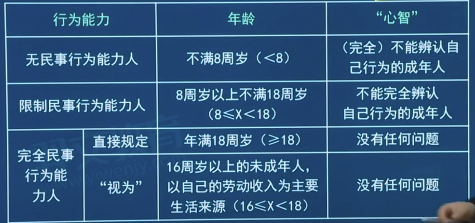
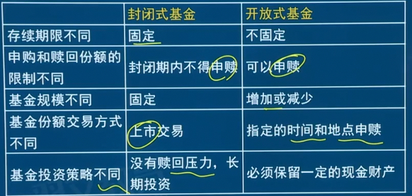

# 第一章：证券市场的法律法规体系
## 1.1 证券市场的法律法规体系
- 【本节考点】 
  - 【考点1】法的概念与特征（了解） 
  - 【考点2】法律关系的概念、特征、种类与基本构成 
  - 【考点3】证券市场法律法规体系的构成（了解）

1. 法的概念
   1. 由国家制定或认可并由**国家强制力**保证实施的，反映**特定物质生活条件**所决定的统治阶级意志，
   2. 以**权利和义务**为内容，以确认、保护和发展对统治阶级有利的社会关系和社会秩序为目的的规范系统
2. 法的特征
   1. 规范性
   2. 国家意志性
   3. 权利义务性
   4. 国家强制性
3. 法律关系的概念
   1. 以法律规范为基础形成的、以**权利和义务**为内容的**社会关系**
4. 法律关系的特征
   - 是以**法律规范**为基础形成的社会关系
     - 首先，**法律规范是法律关系产生的前提和基础**，任何一种法律关系均以特定的法律规范为依据。
     - 其次，一种社会关系只有经过法律规范的确认或认可才会上升为法律关系。
   - 是以权利和义务为内容的社会关系
   - 是法律主体之间的社会关系
5. 法律关系的种类
    - 按依据部门划分
        - 宪法法律关系、民商事法律关系、行政法律关系、劳动法律关系、诉讼法律关系
    - 按发生的方式划分
        - 确认性法律关系、创设性法律关系
    - 按法律主体的地位划分
        - 纵向法律关系、横向法律关系
    - 按主体数量划分
        - 双边法律关系、多边法律关系
    - 按因果关系划分（直接、间接因果）
        - 第一性法律关系、第二性法律关系
6. 法律关系的基本构成
   - 主体
       - --享有权利和承担义务的人，简称法律主体
       - 种类：
         - 自然人（最基本）:我国公民、在我国境内的外国人和无国籍人
         - 组织:国家机关、公司、合伙企业、非营利性法人（政党、行业协会、基金会)
         - 国家: 
       - 资格：权利能力和行为能力（自然人不同步）
         - 
   - 客体
       - --法律关系主体的权利和义务所指向的对象
       - 种类：物、人身人格、精神成果（著作权商标权专利权等）、行为
   - 内容
       - --法律关系中的权利和义务
       

7. 证券市场法律法规系统的构成
   1. 以《证券法》为核心，以规范证券市场的运行为目的。
   
   - 法律
     - （**全国人大或全国人大常务委员会**制定）的规范性法律文件
     - 《证券法》《公司法》《刑法》《证券投资基金法》《信托法》
   - 行政法规（国务院制定）
     - 国务院制定 效力低于法律
     - 以某某**条例**或某某**办法**结尾
     - 《证券公司监督管理条例》《证券公司风险处置条例》《证券、期货投资咨询管理暂行办法》《证券交易所风险基金管理暂行办法》《期货交易管理条例》《企业债券管理条例》
   - 部门规章
       - （国务院各组成部门、直属特设机构、直属机构和证监会）
       - 以某某**办法**或某某**规定**结尾
       - 《证券公司和证券投资基金管理公司合规管理办法》《证券期货投资者适当性管理办法》《证券投资基金管理公司管理办法》《私募投资基金监督管理暂行办法》《证券公司风险控制指标管理办法》《内地与香港股票市场交易互联互通机制若干规定》
   - 规范性文件
       - 有关部门或具有行政管理职能的机构
       - 《证券公司内部控制指引》《证券公司治理准则》《证券公司开立客户账户规范》《证券账户非现场开户实施暂行办法》
   - 行业自律规则
       - 行业自律组织：交易所、中国证券业协会、中登
       - **证券交易所**制定的自律规则
           - 《上海证券交易所交易规则》《上海证券交易所会员管理规则》《上海证券交易所股票上市规则》/《深圳……》
       - **中国证券业协会**制定的
           - 《中国证券业协会会员管理办法》《证券公司合规管理实施指引》《证券公司柜台交易业务规范》《证券公司另类投资子公司管理规范》《证券公司私募投资基金子公司管理规范》《发布证券研究报告执业规范》
       - **中国证券登记结算**有限公司
           - 《中登开户代理机构管理业务指南》《中登特殊机构及产品证券账户业务指南》

## 1.2 公司法

- 【本节考点】 
  - 【考点1】法规概述（重点掌握） 
  - 【考点2】总论（重点掌握） 
  - 【考点3】有限责任公司（重点掌握） 
  - 【考点4】股份有限公司（重点掌握） 
  - 【考点5】董事、监事和高级管理人员的义务和责任 
  - 【考点6】公司财务会计制度的基本要求和内容（重点掌握)
  - 【考点7】公司合并、分立的种类及程序（重点掌握） 
  - 【考点8】高级管理人员、控股股东、实际控制人、关联关系的概念 
  - 【考点9】法律责任（了解）

### 1.2.1 法规概述（重点掌握）

1. 立法沿革
   1. 1994年7月1日起正式实施。
   2. 现行《公司法》全文共十三章二百一十八条
2. 立法宗旨
   1. 规范公司的组织和行为，
   2. 保护公司股东和债权人的合法权益，
   3. 维护社会经济秩序，
   4. 促进社会主义市场经济的发展。
3. 法律体系
   1. 以《公司法》为核心，由相关法律、行政法规、部门规章等共同组成。
   2. 《宪法》《刑法》《民法典》《反垄断法》等法律法规中涉及公司的规定都包含在实质意义上的公司法中。

4. 总论（重点掌握）
   1. 公司是指以**营利**为目的，由一个股东单独投资组建或者特定人数的股东联合投资组建，
   2. 股东以其投资额为限对公司负责，公司以**其全部财产对外承担民事责任**的企业法人。

### 1.2.2 **公司概述**

1. 概念
   1. 依法设立的，以营利为目的，由股东投资形成的企业法人
   2. 公司的独立人格
       - 公司是企业法人，有独立的法人财产，享有**法人财产权**
       - 公司以其全部财产对公司的债务承担责任
       - 公司股东应当遵守法律、行政法规和公司章程，依法行使股东权利，不得滥用股东权利损害公司或者其他股东的利益；
       - 不得滥用公司法人独立地位和股东有限责任损害公司债权人的利益。
   3. 公司经营原则
      1. 公司从事经营活动，必须遵守法律、行政法规，遵守社会公德、商业道德，诚实守信，接受政府和社会公众的监督，承担社会责任。

2. 公司的种类
   1. 按股东人数和股份流动性分类
      - 有限责任公司
        - --由特定人数（有上限**，不超过50人**）的股东组成，
        - 股东以其**认缴的出资额**为限对公司承担责任，
        - 公司以**其全部资产对外**承担民事责任的企业法人
        - 股份转让前须征求其他股东意见
        - 不可以公开募集资金
      - 股份有限公司（股份不一定上市，上市一定股份）
        - --由一定人数以上（有下限，无上限）的股东组成，公司全部资本分为等额股份，
        - 股东以其**认购的股份为**限对公司承担责任，
        - 公司以**其全部资产**对外承担民事责任的企业法人
        - 股份转让相对便捷、自由
        - 可以公开发行股份募集资金
      - 按相互之间的组织关系分类
        - 母公司与子公司、总公司与分公司、企业集团与成员企业
      - 按公司注册地分类
        - 中国公司、外国公司
      - 按股份是否在证交所挂牌交易分类
        - 上市公司、非上市公司
      - 按公司是否有国有资本及其所占比重分类
        - 国有独资公司、国有控股公司、国有参股公司、非国有公司

3. 分公司和子公司的法律地位
    - 分公司（影子、分部）
        - --在业务、资金、人事等方面受本公司管辖而**不具有法人资格**的分支机构
        - 不具**有法人**资格
        - 不能独立享有权利，承担责任
        - 无独立公司名称，总公司名义及章程
        - 无独立财产
        - 经营无自主权，总公司委托或授权
        - 行为的后果及责任总公司承担
    - 子公司（母子）
        - 一定数额的股份被另一公司控制或依照协议被另一公司控制、支配的公司
        - 具有独立法人资格
        - 有独立公司名称，自己名义公司章程
        - 有独立财产，自负盈亏，独立核算
        - 有经营自主权
        - 行为的后果及责任独自承担
        - 重大决策仍需母公司决定
4. 公司的设立
    - 公司设立方式
        - 发起设立
            - 由发起人**认购**公司应发行的全部股份而设立的公司
            - 有限责任公司/股份有限公司
        - 募集设立
            - 由**发起人****认购**公司应发行股份的**一部分**，其余股份向社会公开募集或向特定对象募集而设立的公司
            - 股份有限公司
            - **发起人**认购的股份不得少于公司股份总数**的35**%，但法律、行政法规另有规则的，从其规定
    - 公司设立登记
        - 1、设立人向公司登记机关申请
            - 发起设立
                - 发起人书面认足公司章程规定的股份
                - ->按照公司章程规定缴纳出资
                - ->选举董事会和监事会
                - ->董事会向登记机关保送公司章程及其他文件
            - 募集设立
                - 资金凑齐->董事会应于创立大会结束后30日内，向登记机关保送公司登记申请书、创立大会的会议记录、公司章程、验资证明、法定代表人、董事、监事的任职文件及其身份证明、发起人的法人资格证明或者自然人身份证明、公司住所证明申请设立登记

        - 2、公司登记机关颁发营业执照

            - 营业执照签发日期为公司成立日期
            - 营业执照应当载明公司名称、住所、注册资本、经营范围、法定代表人姓名等事项
            - 记载的事项发生变更，应依法办理变更登记，由公司登记机关换发营业执照
            - 有限、股份字样标识清楚，按条件变更
        - 3.公司设立登记的要求
          - 设立公司，应当依法向公司登记机关申请设立登记。
          - 公司成立日期：营业执照签发之日
          - 执照上有名称、住所、注册资本、经营范围、法定代表人姓名等。如果要变更，需要变更登记，换发执照
            - 名称要求
              - 有限责任公司名称中应有“有限责任公司”或“有限公司”字样；
              - 股份有限公司名称中应有“股份有限公司或“股份公司”字样。

### 1.2.3 公司章程的概念与意义
1. 公司章程的概念与意义
    - 概念
      - 公司章程，是指公司依法制定的，规定公司名称住所、经营范围、经营管理制度等重大事项的基本文件。
      - 公司章程是公司组织或活动的基本准则。设立公司必须依法制定公司章程。
    - 公司章程对公司、股东、董事、监事、高级管理人员具有约束力
      - 第一，公司章程是公司成立的必要条件 
      - 第二，公司章程是公司治理的重要依据 
      - 第三，公司章程是一种自治性规则
    - 意义
      - 是公司成立的必要条件
      - 是公司治理的重要依据
      - 是一种自治性规则
    
2. 公司章程的记载事项
    - 有限责任公司的记载
        - 公司名称和住所
        - 公司经营范围
        - 公司注册资本
        - 股东的姓名或者名称
        - 股东的出资方式、出资额和出资时间
        - 公司的机构及其产生办法、职权、议事规则
        - 公司法定代表人
        - 股东会会议认为需要规定的其他事项
    - 股份有限公司的记载
        - 公司名称和住所
        - 公司经营范围
        - 公司设立方式（发起设立、募集设立）
        - 公司股份总数、每股金额和注册资本
        - 发起人的姓名或者名称、认购的股份数、出资方式和出资时间
        - 董事会的组成、职权和议事规则
        - 公司法定代表人
        - 监事会的组成、职权和议事规则（股份有限公司必备监事会）
        - 公司利润分配办法
        - 公司的解散是由与清算办法
        - 公司的通知和公告办法
        - 股东大会会议认为需要规定的其他事项

### 1.2.4 公司对外投资和担保
- 
- 公司对外投资和担保规范
    - 公司可以对外投资和提供担保
    - 对外投资和为他人提供担保需承担相应的责任
    - 上市公司不得为任何非法人单位和个人提供担保
    - 上市公司对外担保必须要求对方提供反担保（如果没还上就怎么样），且反担保的提供方应当具有实际承担能力
- 提供担保的方式
    - 保证
    - 抵押（占有权不转移）
    - 质押（东西占有权转移）
- 提供担保的规定
    - 公司对外担保的规定
        - 由董事会或股东会、股东大会决议
        - 不得超过公司章程对投资或担保的限额规定
    - 公司对内担保的规定
        - 为公司股东或者实际控制人提供担保的，必须经股东会或股东大会决议
        - 对于被担保人股东或者受被担保实际控制人支配的股东，不得参加该担保事项的表决
        - 该项表决由出席会议的其他股东所持表决权的**过半数**通过
    - 股份有限公司提供担保的规定
        - 《公司法》和公司章程规定对外提供担保等事项必须经股东大会作出决议的，董事会应当及时召集股东大会会议，由股东大会就上述事项进行表决
    - 上市公司提供担保的规定
        - 上市公司在一年内担保金额超过**公司资产总额30%**的，应当由股东大会作出决议，并经出席会议的股东所持表决权的**2/3**以上通过

### 1.2.5 有限责任公司
1. 有限责任公司设立及注册资本制度
   1. 有限责任公司注册资本制度
        - 注册资本的规定
            - **注册资本**为在公司登记机关登记的全体股东**认缴**（不是实缴）的**出资额**
        - 股东出资的形式
            - 可以**货币**出资，也可以用**实物、知识产权、土地使用权**等可以用货币估价并可以依法转让的非货币财产作价出资
            - 法律、性质法规规定不得作为出资的财产除外
            - 非货币资产不得高估
        - 股东认缴出资的义务
            - 股东应当**按期足额缴纳公司**章程中规定的各自所认缴出资额
            - 货币出资：足额存入有限责任公司在银行开设的账户
            - 非货币财产出资：依法办理财产权转移手续
        - 股东未足额出资的责任
            - 向公司足额缴纳，向已按期足额缴纳出资的股东承担违约责任
            - 非货币财产显著低：交付该出资的股东补足差额；公司设立时的其他股东承担连带责任

   - 有限责任公司**设立条件**
       - 股东符合法定人数，**50以下**
       - 有符合公司章程规定的全体股东**认缴的出资额**
       - 股东共同制定公司章程
       - 有**公司名称**，建立符合有限责任公司要求的组织机构
       - 有**公司住所**
2. 有限责任公司的组织结构
    - 组织结构
        - 股东会
            - 由全体股东组成的，公司的**最高权利机构**
        - 董事会/执行董事
            - 董事会人数[3,13]
                - 股东**人数较少或者规模较小**的有限责任公司可以设1名执行董事，不设董事会
                - 执行董事可以兼任公司经理

            - 职工代表
                - **两个以上**的国有企业或者两个以上的其他国有投资主体投资设立的有限责任公司：董事会成员中**应当有**公司职工代表
                - 其他有限责任公司：董事会成员可以有公司职工代表
                - 董事会中的职工代表有公司职工通过职工代表大会、职工大会或者其他形式民主选举产生
            - 董事长与副董事长
                - 董事会设董事长1人，可以设副董事长
                - 董事长和副董事长的产生办法由公司章程规定
            - 董事任期
                - 由公司章程规定，但每届任期**不得超过3年**
                - 董事任期届满，连选可以连任
        - 经理
          - 有限责任公司可以设经理，由董事会决定聘任或者解聘。
          - **经理对董事会负责**
        - 监事会/监事
            - 监事会人数：不得少于3人
                - 股东人数较少或者规模较小的有限责任公司，可以**设1至2名监事**，不设监事会
            - 职工代表
                - 监事会应当包括股东代表和适当比例的公司职工代表，其中职工代表的比例不得低于1/3，具体由公司章程规定
                - 职工代表由公司职工通过职工代表大会、职工大会或者其他形式民主选举产生
            - 监事会主席
                - 设主席1人，由全体监事**过半数**选举产生
                - 监事会主席召集和主持监事会议
                - 监事会主席不能或不履行职务，由过半数以上监事共同推举**1名监事**召集和主持监事会会议
            - 限制：董事、高级管理人员不得兼任监事
            - 监事任期
                - 每届3年
                - 监事任期届满，连选可以连任
    - 职权（分辨，不必背）
        - 股东会
            - 决定公司的**经营方针和投资计划**
            - 选举和更换非由职工代表担任的董事、监事，决定有关董事、监事的报酬事项
            - 审议批准董事会的报告
            - 审议批准监事会或者监事的报告
            - 审议批准公司的年度财务预算方案、决算方案
            - 审议批准公司的利润分配方案和弥补亏损方案
            - 对公司**增加或者减少注册资本**作出决议
            - 对发行公司债券作出决议
            - 对公**司合并、分立、解散、清算**或者变更公司形式作出决议
            - **修改公司章程**
            - 公司章程规定的其他职权
        - 董事会
            - 召集股东会会议，并向股东会报告工作
            - 执行股东会的决议
            - 决定公司的**经营计划**和**投资方案**🌟
            - 制定公司的年度财务预算方案、决算方案
            - 制定公司的利润分配方案和弥补亏损方案
            - 制定公司增加或者减少注册资本以及发行公司债券的方案
            - 制定公司合并、分立、解散或变更公司形式的方案
            - 决定公司**内部管理机构**的设立🌟
            - 决定聘任或解聘公司经理及其报酬事项，并根据经理的提名决定聘任或解聘公司副经理、财务负责人及其报酬事项
            - 制定公司的**基本管理制度**
            - 公司章程规定的其他职权
        - 经理
          - (1)主持公司的生产经营管理工作，**组织实施董事会决议**；
          - (2)组织实施公司年度经营计划和投资方案
          - (3)拟订公司内部管理机构设置方案
          - (4)拟订公司的基本管理制度；
          - (5)**制定公司的具体规章**；
          - (6)提请聘任或者解聘公司副经理、财务负责人；
          - (7)决定聘任或者解聘除应由董事会决定聘任或者解聘以外的负责管理人员；
          - (8)董事会授予的其他职权。 
          - 公司章程对经理职权另有规定的，从其规定。
          - 经理列席董事会会议。
        - 监事会
            - 检查公司**财务**🌟
            - 对董事、高级管理人员执行公司职务的行为进行监督，对违反法律、性质法规、公司章程或者股东会决议的董事、高管提出**罢免**的建议
            - 当董事、高管的行为损害公司的利益时，要求董事、高管予以**纠正**
            - 提议召开临时股东会会议，在董事会不履行本法规定的召集和主持股东会会议职责时召集和主持股东会会议
            - 向股东会会议提出**提案**
            - 按照《公司法》第一百五十一条的规定，对董事、高管提起**诉讼**
            - 公司章程规定的其他职权
            - 监事可以列席董事会会议，并对董事会决议事项提出质询或者建议。
            - 监事会、不设监事会的公司的监事发现公司经营情况异常，可以进行调查；必要时，可以聘请会计师事务所等协助其工作，费用由公司承担。
            - 监事会、不设监事会的公司的监事行使职权所必需的费用，由公司承担

3. 有限责任公司股权转让的相关规定
    - 股权的**自愿转让**
        - 股东之间可以相互转让其全部或者部分股权
        - 股东向股东以外的人转让股权
            - 应该经其他股东**过半数**同意
            - 股东应就其股权转让事项**书面通知**其他股东征求意见
                - 其他股东接到书面通知之日起满30日未答复的，视为同意转让
                - 其他股东半数以上不同意转让的，不同意的股东应当购买该转让的股权，不购买的视为同意转让
        - 经股东同意转让的股权，在同等条件下其他股东有优先购买权。
          - 两个以上股东主张行使优先购买权的，协商确定各自的购买比例；
          - 协商不成的，按照转让时各自的出资比例行使优先购买权
    - **强制执行**中的股权转移
        - 法院按照法律规定的强制执行程序转让股东的股权时，应当通知公司及全体股东，其他股东在同等条件下有优先购买权
        - 其他股东自法院通知之日**起满20日**不行使优先购买权的，视为**放弃优先**购买权
    - 股权转让后的变更
        - 公司应注销原股东的出资证明书
        - 向新股东签发出资证明书
        - 相应修改公司章程和股东名册中有关股东及其出资额的记载（不需股东会表决）
    - **瑕疵股权**转让的效力
        - 股东未履行或未全面履行出资义务即转让股权，受让人对**此知道或应当知道**
        - 公司：公司可以请求该股东履行出资义务、受让人**对此承担连带责任**
        - 债权人：
          - 可以请求未履行或未全面履行出资义务的股东在未出资本息范围内对公司债务不能清偿的部分承担补充赔偿责任，
          - 并可同时**请求前述受让人对此承担连带责任**
        - 受让人：
          - 根据前款规定承担责任后，可以向该未履行或未全面履行出资义务的股东追偿。
          - 但是当事人另有约定的除外
    - 公司回购股权
        - 下列情形之一，对决议投反对票的股东**可以请求公司按合理价格收购其**股权🌟
            - 公司**连续5年**不向股东**分配利润**，而公司该**5年连续**盈利，并符合《公司法》规定的分配利润条件的
            - 公司合并、分立、转让主要财产的
            - 公司章程规定的营业期限届满或章程规定的其他解散是由出现，股东会议通过决议修改章程是公司存续的
        - 自股东会会议决议通**过之日起60日内**，股东与公司不能达成股权收购协议的，股东可以自股东会会议决议通过之日**起90日内向**人民法院提起诉讼
    - 股权继承
        - 自然人股东死亡后，其合法继承人可以继承股东资格；
        - 但是公司章程另有规定的除外

### 1.2.5 股份优先公司
1. 股份有限公司的设立
    - 设立条件
        - 发起人符合法定人数，**2人以上200人以下**，且半数以上在境内有住所
        - 有符合公司章程规定的全体发起人认购的股本总额（发起设立）或募集的实收股本总额（募集设立）
        - 股份发行、筹办事项符合法律规定
        - 发起人制订公司**章程**，采用募集方式设立的经创立大会通过
        - 有**公司名称**，建立符合股份有限公司要求的组织机构
        - 有**公司住所**
    - 设立方式
        - **发起设立、募集设立**
    - 设立程序
        - 订立发起人协议
        - 订立公司章程
            - 发起人制定，募集设立的需经创立大会审议通过
        - 认缴资本
            - 发起设立：发起人书面认足
            - 募集设立
                - 发起人认购股份不得少于**总数的35%**，法律、行政法规另有规定的从其规定
                - 发起人向社会公开募集股份
                    - 必须公告招股说明书，并制作认股书
                    - 发起人应当与依法设立的证券经营机构签订承销协议，与银行签订代收股款协议
                    - 发行股份的股款募足后，必须经法定的验资机构验资并出具证明
        - 选举董事会和监事会，申请设立登记
            - 董事会应于创立大会结束后30日内，向公司登记机关保送下列文件，申请设立登记
                - 公司登记申请书
                - 创立大会的会议记录
                - 公司章程
                - 验资证明
                - 法定代表人、董事、监事的任职文件及其身份证明
                - 发起人的法人资格证明或自然人身份证明
                - 公司住所证明
            - 以募集方式设立股份有限公司公开发行股票的，还应当向公司登记机关保送国务院证券监督管理机构的核准文件

2. 股份有限公司的组织机构
    - 股东大会（有限责任公司是股东会）
        - 由全体股东组成，是公司的权力机构
        - 职权：完全同有限责任公司
    - 董事会
        - 人数：**5到19人**，
        - 成员中可以有公司**职工代表**。
          - 职工代表由公司职工通过职工代表大会、 
          - 职工大会或者其他形式民主选举产生
          - 职权同有限责任公司
        - 任期（同有限责任）
            - 由公司章程规定，但每届任期不得超过3年
            - 董事任期届满，连选可以连任
        - 董事长
            - 董事会设董事长1人，可以设副董事长。由董事会全体董事的过半数选举产生
            - 董事长召集和主持董事会会议，副董事长协助董事长工作，董事长不能履行职务或者不履行职务的，由副董事长履行职务；副董事长不能履行职务或者不履行职务的，由半数以上董事共同推举1名董事履行职务
        - 职权：完全同有限责任公司
    - 经理
      - 由董事会决定聘任或解聘
    - 监事会
        - 人数：**不得少于3人**，
          - 监事会应当包括股东代表和适当比例的公司职工代表，其中职工代表的比例不得**低于1/3**，具体比例由公司章程规定
        - 任期：每届3年，届满可以连选连任
        - 主席
            - 监事会设主席1人，可以设副主席。由全体监事的过半数选举产生
            - 监事会主席召集和主持监事会会议；
            - 主席不能履行职务或者不履行职务的，由副主席履行职务；
            - 副主席不能履行职务或者不履行职务的，由半数以上监事共同推举1名监事履行职务
        - 职权：同有限责任公司
            - 监事可以列席董事会会议，并对董事会决议事项提出质询或者建议

3. 股份有限公司的股份发行
    - 发行的原则
        - 公平公正原则、同股同价原则（同股同权）
    - 发行的价格🌟
        - 按票面金额、超过票面金额、但不得低于票面金额
        - **平价发行**和**溢价发行**
    - 发行的形式
        - 股票是公司签发的证明股东所持股份的凭证，
        - 采用**纸面形式**或国务院证券监督管理机构规定的其他形式
    - 股票应当载明的事项
        - 公司名称
        - 公司成立日期
        - 股票种类、票面金额及代表的股份数
        - 股票的编号
        - 股票由法定代表人签名，公司盖章，发起人的股票应当标明发起人股票字样
    - 股票发行的种类
        - 记名股票
            - 备置股东名册
            - 记载其股东的姓名或者名称及住所、各股东所持股份数、各股东所持股票的编号及各股东取得股票的日期
        - 无记名股票
            - 记载其股票数量、编号及发行日期
        - 公司向发起人、法人发行的股票，应当为记名股票，并应当记载该发起人、法人的名称或者姓名，不得另立户名或者代表人姓名记名
    - 发行新股
        - 公司发行新股，股东大会应对下列事项作出决议
            - 新股种类及数额
            - 发行价格
            - 发行的起止日期
            - 向原有股东发行新股的种类及数额
        - 公司经国务院证券监督管理机构核准公开发行新股时，必须公告新股招股说明书和财务会计报告，并制作**认股书**
        - 发起人向社会公开募集股份，应当由依法设立的证券公司承销，签订承销协议，还应当同银行签订代收股款协议
        - 公司发行新股募足股款后，必须向公司登记机关办理变更登记，并公告

4. 股份有限公司股份转让的相关规定
    - 记名股票的转让
        - 由股东以背书方式或法律、行政法规规定的其他方式转让🌟
        - 转让后由公司将受让人的姓名或者名称及住所记载于股东名册
        - 股东大会召开**前20日内**或者公司决定分配股利的基准日**前5日**内，不得进行前款规定的股东名称的变更登记。
        - 但是法律对上市公司股东名册变更登记另有规定的，从其规定
    - 无记名股票的转让
        - 由股东将其股票交付给受让人后即发生转让的效力
        - 发起人及董事、监事、高级管理人员股份转让的限制，自公司成立之日**起1年内**不得转让
        - 公司公开发行股份前已发行的股份，自公司股票在证交所上市交易之日**起1年内**不得转让
        - 公司董事、监事、高管应当向公司申报所持有的本公司的股份及其变动情况，在任职期间**每年转让**的股份**不得超过**其所持有本公司股份总数**的25%，**所持本公司股份自公司股票上市交易之日起1年内不得转让
        - 上述人员离职后**半年内**，不得转让其所持本公司股份🌟
    - 股票的上市交易
      - 上市公司必须公开其财务状况经营情况及重大诉讼，在每会计年度内半年公布一次财务会计报告。
    - 公司股份回购
        - 公司不得收购本公司股票，但有下列情形之一的除外
            - 减少公司注册资本
            - 与持有本公司股份的其他公司合并
            - 将股份用于员工持股计划或者股权激励
            - 股东因对股东大会作出的公司合并、分立决议持异议，要求公司收购其股份
            - 将股份用于转换上市公司发行的**可转换**为股票的公司债券
            - 上市公司为维护公司价值及股东权益所必需
        - 公司因前款第(1)项、第(2)项规定的情形收购本公司股份的，应当经股东大会100%决议；
        - 公司因前款第(3)项、第(5)项、第(6)项规定的情形收购本公司股份的，可以依照公司章程的规定或者股东大会的授权，
          经**2/3以上**董事出席的董事会会议决议。
        
5. 上市公司组织机构的特别规定
    - 上市公司的定义
        - --股票在证交所上市交易的股份有限公司
    - 上市公司设立独立董事、董事会秘书的规定
        - 独立董事
            - 上市公司设立独立董事，具体办法由**国务院**规定
        - 董事会秘书
            - 上市公司**设董事会秘书，**负责公司股东大会和董事会会议的筹备、文件保管以及公司股东资料的管理，办理信息披露事务等事宜

    - 上市公司的其他特别规定（资产变动、有关联关系）
        - 上市公司**在1年内购**买、出售重大资产或担保金额超过公司资产**总额30%的**，应当由**股东大会**作出决议，并经出席会议的股东所持表决权的**2/3**以上通过🌟
        - 上市公司董事与董事会会议决议事项所涉及的企业有关联关系的，不得对该项决议行使表决权，也不得代理其他董事行使表决权
        - 该董事会会议由过半数的无关联关系董事出席即可举行，董事会会议所作决议须经无关联关系董事过半数通过
        - 出席董事会的无关联关系董事人数不足3人的，应将该事项提交上市公司股东大会审议

6. 董事、监事和高级管理人员的义务与责任
    - 高级管理人员
        - --指公司的经理、副经理、财务负责人，上市公司董事会秘书和公司章程规定的其他人员
    - 控股股东
        - --指其出资额占有限责任公司资本总额50%以上或其持有的股份占股份有限公司股本总额50%以上的股东
        - --出资额或持有股份的比例虽然不足50%，但依其出资额或持有的股份所享有的表决权已足以对股东会、股东大会的决议产生重大影响的股东
    - 实际控制人
        - --指虽不是公司的股东，但通过投资关系、协议或者其他安排，能够实际支配公司行为的人
    - 关联关系
        - --指公司控股股东、实际控制人、董事、监事、高管与其直接或者间接控制的企业之间的关系，以及可能导致公司利益转移的其他关系
    - 董事、监事、高管的责任
        - 应当遵守法律、行政法规和公司章程，对公司负有忠实义务和勤勉义务，不得利用职权收受贿赂或者其他非法收入，不得侵占公司的财产
        - 股东会或股东大会要求董事、监事、高管列席会议的，董事、监事、高管应当列席并接受股东的质询。董事、高管应当如实向监事会或者不设监事会的有限责任公司的监事提供有关情况和资料，不得妨碍监事会或监事行使职权

    - 公司董事、高管的**禁止行为**
        - 挪用公司资金
        - 将公司资金以其个人名义或以其他个人名义开立账户存储
        - **违反公司章程的规定**，未经股东会、股东大会或董事会同意，将公司资金借贷给他人或以公司财产为他人提供担保
        - 违反公司章程的规定或者未经股东会、股东大会同意，与本公司订立合同或进行交易
        - 未经股东会或股东大会同意，利用职务便利为自己或他人谋取属于公司的商业机会，自营或者为他人经营与所任职公司同类的业务
        - 接受他人与公司交易的佣金归为己有
        - **擅自披露公司秘密**
        - 违反对公司忠实义务的其他行为
        - 董事、高管违反营业义务所得的**收入应当归公司所有**
        - 董事、监事、高管执行公司职务时违反法律、行政法规或公司章程的规定，给公司造成损失的，应当**承担赔偿责任**

7. 公司财务会计制度的基本要求与内容
    - 基本要求
        - 公司应按照法律、行政法规和国务院财政部门的规定建立本公司的财务、会计制度
        - 公司应在每一会计年度终了时**编制财务会计**报告，并依法经会计师事务所审计
            - 有限责任公司
                - 按照公司章程规定的期限将财务会计报告交送各股东
            - 股份有限公司
                - 在召开股东大会的20日前置备于本公司，供股东查阅

        - 公司除法定**的会计账簿**外，不得另立会计账簿。对公司资产，不**得以任何个人名义开立**账户存储🌟
        - 公司应当向聘用的会计师事务所提供真实、完整的会计凭证、会计账簿、财务会计报告及其他会计资料，不得拒绝、隐匿、谎报
    - 内容
        - 公积金及利润分配
            - 税后利润->弥补亏损->提取公积金->分配利润
            - 公积金
                - 资本公积金
                    - 以超过股票票面金额的发行价格发行股份所得的溢价款
                    - 国务院财政部门规定列入资本公积金的其他收入
                - 法定公积金🌟
                    - 提取比例：**10**%。法定公积金**累积额**为公司注册资本的**50%以上**的，可以不再提取
                    - 公司的法定公积金不足以弥补以前年度亏损的，在提取法定公积金之前，应当先用**当年利润弥补亏损**
                    - 法定公积金转为资本时（扩张经营），所留存的该项公积金不得少于**转增前公司注册资本的25%**
                - 任意公积金
            - 公积金的用途
                - **弥补公司的亏损**、扩大公司生产经营或者转为增加公司资本
                - 注：**资本公积金**不得用于弥补公司的亏损🌟
            - 分配利润
                - 有限责任公司
                    - 股东按照实缴的出资比例分取红利；
                    - 公司新增资本时，股东有权有限按照实缴的出资比例认缴出资，另有约定的除外
                - 股份有限公司
                    - 按照股东**持有的股份比例分配**，
                    - 但公司章程另有约定的除外
                - 注意
                    - 股东会、股东大会或董事会违反规定，在公司弥补亏损和提取法定公积金之前向股东分配利润的，股东必须将违反规定分配的利润退还公司
                    - 公司持有的本公司股份不得分配利润🌟

        - 聘用、解聘会计师事务所
            - 由股东会、股东大会或董事会决定
            - 进行表决时，应当允许会计师事务所陈述意见

### 1.2.6 公司合并、分立

1. 公司合并的种类
    - 吸收合并
        - 一个公司吸收其他公司为吸收合并，被吸收的公司解散
        - A+B=A
    - 新设合并
        - 两个以上公司合并设立一个新的公司为新设合并，合并各方解散
        - A+B=C
2. 公司分立的种类
    - 派生分立（存续分立）
        - 一个公司分离除其他公司，原公司法律主体仍存在，但将其部分业务划出去，另设一个以上新公司
        - A=A+B
    - 新设分立（解散分立）
        - 一个公司分解为两个或两个以上新公司，原公司解散
        - A=B+C
        
3. 公司合并、分立的程序
  - 股东大会决议
      - 有限责任公司：必须经代表**2/3以**上表决权的股东通过
      - 股份有限公司：必须经出席会议的股东**所持表决权**的**2/3**以上通过
  - 编制资产负债表及财产清单
  - 对债权人的通知或公告
      - 公司应当自作出合并、分立决议**起10日内**通知债权人，并与**30日内在**报纸上公告🌟
  - 债务承担
      - 公司合并
          - 债权人自接到通知书之日起**30日内**，未接到通知书的自公**告日起45日内**，可以要求公司清偿债务或提供相应的担保
          - 公司合并时，合并各方的债权、债务，应当由合并**后存续的公司****或新设的公司**承继
      - 公司分立
          - 分立前的债务由**分立后的公司**承担连带责任
          - 但是公司在分立前与债权人就债务清偿达成的书面协议另有规定的除外
  - 办理合并登记手续
      - 公司合并或分立，登记事项发生变更的，应当依法向公司登记机关办理变更登记；解散，注销登记；设立新公司，设立登记
      - 公司增加或减少注册资本，应当依法向公司登记机关办理变更登记🌟
      - 公司需要减少注册资本时，必须编制资产负债表及财产清单。公司应当自作出减少注册资本决议之日起10日内通知债权人，并于30日内在报纸上公告。债权人自接到通知书之日起30日内，未接到通知书的自公告之日起45日内，有权要求公司清偿债务或者提供相应的担保🌟

### 1.2.7 法律责任

1. 主要法律责任 
   1. 虚报注册资本、欺诈取得公司登记的法律责任
      1. 虚报注册资本金额：5%以上15%以下的罚款；
      2. 提交虚假材料、欺诈：5万元以上50万元以下的罚款；
      3. 情节严重的，撤销登记或者吊销营业执照。 
   2. 虚假出资的法律责任：5%以上15%以下的罚款。 
   3. 抽逃出资的法律责任：5%以上15%以下的罚款。
   4. 另立会计账簿的法律责任
      1. 由县级以上人民政府财政部门责令改正，处以5万元以上50万元以下的罚款
   5. 财务会计报告虚假记载的法律责任
      1. 对任管和其他直接责任人员处以3万元以上30万元以下的罚款
   6. 其他
      1. 公司不依照《公司法》规定提取法定公积金的，**要求补足，可罚20万以下**；
      2. 公司在合并、分立、减少注册资本或者进行清算时，不依照《公司法》规定通知或者公告债权人的，由公司登记机关责
         令改正，对公司处以**1万元以上10万元以下**的罚款。
      3. 公司在进行清算时，隐匿财产，对资产负债表或者财产清单作虚假记载或者在未清偿债务前分配公司财产的，由公司登机关责令改正，处5%以上10%以下的罚款；
      4. 对主管和其他直接责任人员处以1万元以上10万元以下的罚款。

## 1.3 合伙企业法

- 【考点1】合伙企业法概述（了解） 
- 【考点2】普通合伙企业（重点掌握） 
- 【考点3】有限合伙企业（重点掌握） 
- 【考点4】合伙企业的解散和清算（掌握）

### 1.3.1 合伙企业概述

1. 概念 
   1. --由自然人、法人和其他组织按照《合伙企业法》订立合伙协议，**共同出资，共担风险，共享收益，**对合伙企业债务承担责任的经营性组织

2. 合伙企业VS公司
    - 法律地位不同
        - 合伙企业：**非法人企业**
        - 公司：法人企业
    - 财产独立性不同
        - 合伙企业：合伙企业财产与合伙人仅相对独立，财产属于合伙人共有
        - 公司：公司财产独立于股东
    - 承担的责任不同
        - 合伙企业：普通合伙人对合伙企业**承担无限责任**（无限连带责任）
        - 公司：股东对公司的责任以出资为限，承担有限责任

3. 合伙企业的种类
    - 种类
        - 有限合伙企业：有普通合伙人、有限合伙人两类人
        - 普通合伙企业：仅普通合伙人一类人
    - 普通合伙企业VS有限合伙企业
        - 合伙人对企业债务的责任🌟
            - 有限合伙企业
                - 普通合伙人承担无限责任或无限连带责任
                - 有限合伙人以其认缴的出资额为限承担责任
            - 普通合伙企业
                - 所有出资人承担无限连带责任
        - 合伙人数量
            - 有限合伙企业：投资人数2-50，其至少有1个普通合伙人
            - 普通合伙企业：投资人数2人以上，无上限规定
        - 合伙人权力🌟
            - 有限合伙企业：有限合伙人不得执行合伙企业中的事务
            - 普通合伙企业：合伙人对执行合伙事务享有同等权利
        - 利润分配
            - 有限合伙企业：合伙协议约定可将全部利润分配给部分合伙人，但不得约定企业全部亏损由部分合伙人承担
            - 普通合伙企业：出资人不得在合伙协议中约定将全部利润分配给部分合伙人或由部分合伙人承担企业的全部亏损
        - 竞业禁止
            - 有限合伙企业：有限合伙人可自营或与他人合作经营与本企业相竞争的业务
            - 普通合伙企业：普通合伙人不得自营或与他人合作经营与合伙企业相竞争的业务
        - 关联交易
            - 有限合伙企业：有限合伙人可以与合伙企业进行交易
            - 普通合伙企业：普通合伙人不得同本企业进行交易
        - 出资份额出质
            - 有限合伙企业：有限合伙人可将出资份额出质
            - 普通合伙企业：合伙人以其出资份额出质，须经全体合伙人一致同意，否则出质行为无效
    - 普通合伙人的主体限制
        - 国有独资公司、国有企业、上市公司、**公益性**的事业单位、社会团体不得成为普通合伙人
    - 合伙协议的形式、订立程序与基本原则
      - 在订立合伙协议、设立合伙企业时，也应当遵循民法下的**自愿、平等、公平、诚实信用**原则
      - 合伙协议应由全体合伙人协商一致，且必须以书面形式订立

### 1.3.2 普通合伙企业

4. 普通合伙企业的设立
    - 符合要求的合伙人人数
        - **2个或2个以上自然人**、法人或其他组织作为合伙人
    - 有书面合伙协议
        - 合伙协议内容
            - 合伙企业名称和主要经营场所的地点
            - 合伙目的和经营范围
            - 合伙人的姓名或者名称、住所
            - 合伙人的出资方式、数额和缴付期限
            - 利润分配、亏损分担方式
            - 合伙事务的执行
            - 入伙与退伙
            - 争议解决办法
            - 合伙企业的解散与清算
            - 违约责任
        - 合伙协议经全体合伙人签名、盖章后生效
        - 修改或者补充应当经全体合伙人一致同意
        - 合伙协议未约定或者约定不明确的事项，由合伙人协商决定；协商不成的，依照《合伙企业法》和其他相关法律、行政法规的规定处理
    - 有合伙人认缴或实际缴付的出资
        - 货币、土地使用权、实物、劳务🌟、知识产权、其他财产权利
    - 有合伙企业的名称和主要经营场所
        - 合伙企业名称中应当标明“普通合伙”字样
        - 合伙企业从事经营活动必须具备生产经营场所

5. 普通合伙企业财产的分割、转让和处分
    - 合伙企业的财产
        - 包括由合伙人的出资、以合伙企业名义取得的收益和依法取得的其他财产
    - 财产分割
        - 合伙人在合伙**企业清算前**，不得请求分割合伙企业的财产
        - 合伙人在合伙企业清算前私自转移或者处分合伙企业财产的，合伙企业不得以此对抗善意第三人
    - 财产转让
        - 合伙人转让其部分或者全部财产份额时，**应当通知其他合伙人**；
        - 除合伙协议另有约定外，须经**其他合伙人一致同意**
        - 其他合伙人**有优先购买**权
    - 财产处分
        - 合伙人以其财产份额出质的，**须经其他合伙人一致同**意
        - 未经其他合伙人一致同意的，其行为无效，由此给善意第三人造成损失的，由行**为人依法承担赔偿**责任

6. 合伙事务的执行
   1. 合伙企业经营中应当经全体合伙人**一致同意**的重要事项
      1. ①改变合伙企业的名称；
      2. ②改变合伙企业的经营范围、主要经营场所的地点；
      3. ③处分合伙企业的不动产；
      4. ④转让或者处分合伙企业的知识产权和其他财产权利；
      5. ⑤以合伙企业名义为他人提供担保；
      6. ⑥聘任合伙人以外的人担任合伙企业的经营管理人员。
   2. 合伙企业的利润分配、亏损分担，按照合伙协议的约定办理；
      1. 合伙协议未约定或者约定不明确的，由合伙人协商决定；
      2. 协商不成的，由合伙人按照实缴出资比例分配、分担；
      3. 无法确 定出资比例的，由合伙人平均分配、分担。（协协实平）】 
      4. 合伙协议不得约定将全部利润分配给部分合伙人或者由部分合伙人承担全部亏损。

7. 合伙企业的债务清偿
   1. 合伙企业对其债务，应先以其全部财产进行清偿
   2. 合伙企业不能清偿到期债务的，合伙人承担无限连带责任。
   3. 合伙人由于承担无限连带责任，清偿数额超过其亏损分担比例的，有权向其他合伙人追偿。 
   4. 合伙人的自有财产不足清偿其与合伙企业无关的债务的该合伙人可以以其从合伙企业中分取的收益用于清偿； 
   5. 债权人也可以依法请求人民法院强制执行该合伙人在会伙企业中的财产份额用于清偿。 
   6. 人民法院强制执行合伙人的财产份额时，应当通知全体合伙人，其他合伙人**有优先购买**权。
8. 退伙
   1. (1)种类：
      1. 退伙包括自愿退伙、
      2. 法定退伙（当然退伙》
      3. 除名。
   2. (2)合伙协议约定合伙期限的，在合伙企业存续期间，有下列情形之一的，合伙人可以退伙：
      1. ①合伙协议约定的退伙事由出现；
      2. ②经全体合伙人一致同意；
      3. ③发生合伙人难以继续参加合伙的事由；
      4. ④其他合伙人严重违反合伙协议约定的义务。
   3. (3)合伙人有下列情形之一的，**当然退伙**
      1. ①作为合伙人的自然人死亡或者被依法宣告死亡；
      2. ②个人丧失偿债能力；
      3. ③作为合伙人的法人或者其他组织依法被吊销营业执照、责令关闭、撤销，或者被宣告破产；
      4. ④法律规定或者合伙协议约定合伙人必须具有相关资格而丧失该资格
      5. ⑤合伙人在合伙企业中的全部财产份额被人民法院强制执行。
   4. (4)合伙人有下列情形之一的，经其他合伙人一致同意，可以**决议将其除名**：
      1. ①未履行出资义务；
      2. ②因故意或者重大过失给合伙企业造成损失
      3. ③执行合伙事务时有不正当行为；
      4. ④发生合伙协议约定的事由。
9. 入伙
   1. 条件
      1. 新合伙人入伙，除合伙协议有约定外，应当经**全体合伙人一致同意**，并依法订立书面入伙协议。
      2. 且应当向新合伙人如实告知原合伙企业的经营状况和财务状况。
   2. 入伙的新合伙人与原合伙**人享有同等权利，承担同等责任**。入伙协议另有约定的，从其约定。
      合伙人对入伙前合伙企业的债务**承担无限连带责任**。
10. 特殊普通合伙企业
    1. 一般是以专业知识和专门技能为客户提供有偿服务的专业服务机构，名称中应当标明“**特殊普通合伙**”字样。
    2. (1)一个合伙人或者数个合伙人在执业活动中因故意或者重大过失造成合伙企业债务的，应当承担无限责任或者无限
       连带责任，其他合伙人以其在合伙企业中的财产份额为限承担责任
    3. (2)合伙人在执业活动中**非因故意或者重大过失**造成的合伙企业债务以及合伙企业的其他债务，由全体合伙人承担无限连带责任。
    4. (3)合伙人执业活动中因**故意或者重大过失**造成的合伙企业债务，以合伙企业财产对外承担责任后，该合伙人应当按
       照合伙协议的约定对给合伙企业造成的损失承担赔偿责任。
       1. 特殊的普通合伙企业应当建立执业风险基金、办理职业保险。

### 1.3.3 有限合伙企业（重点掌握）
1. 合伙人 
   1. 由**2个以上50个以**下合伙人设立；
   2. **至少有1个**普通合伙人。 
2. 名称：应当标明“有限合伙”字样。
3. 出资
   1. (1)有限合伙人可以用货币、实物、知识产权土地使用权或者其他财产权利作价出资
   2. (2)**有限合伙人不得以劳务出资**
   3. (3)有限合伙人应当按照合伙协议的约定按期足额缴纳出资
      未按期足额缴纳的，应当承担补缴义务，并对其他合伙人承担违约责任。
4. 有限合伙企业事务的执行
   1. 有限合伙企业由**普通合伙人执行合伙事务**。
   2. 执行事务合伙人可以要求在合伙协议中确定执行事务的报酬及报酬提取方式。 
   3. 有限合伙人不执行合伙事务，不得对外代表有限合伙企业。
5. 有限合伙企业的特殊性
   1. (1)有限合伙人可以同本有限合伙企业进行交易；
      1. 有限合伙人可以自营或者同他人合作经营与本有限合伙企业相竞争的业务
   2. (2)有限合伙人可以将其在有限合伙企业中的财产份额出质；
   3. (3)有限合伙人可以按照合伙协议的约定何今伙人以外的人转让其在有限合伙企业中的财产份额，但应当提前30日通知其他合伙人。
   4. (4)第三人有理由相信有限合伙人为普通合伙人并与其交易的，该有限合伙人对该笔交易承担与普通合伙人同样的责任。
      有限合伙人未经授权以有限合伙企业名义与他人进行交易，给有限合伙企业或者其他合伙人造成损失的，该有限合伙人应当承担赔偿责任。
   5. (5)有限合伙人的自有财产不足清偿其与合伙企业无关的债务的，该合伙人可以以其从有限合伙企业中分取的收益用于清偿；
      债权人也可以依法请求人民法院强制执行该合伙人在有限合伙企业中的财产份额用于清偿。
      人民法院强制执行有限合伙人的财产份额时，应当通知全体合伙人。在同等条件下，其他合伙人有优先购买权。
   6. (6)新入伙的有限合伙人对入伙前有限合伙企业的债务，以其认缴的出资额为限承担责任。
6. 有限合伙和普通合伙的转化
   1. 有限合伙企业仅剩有限合伙人的，应当解散；
   2. 有限合伙企业仅剩普通合伙人的，转为普通合伙企业。
   3. 除合伙协议另有约定外，普通合伙人转变为有限合伙人，或者有限合伙人转变为普通合伙人，应当经全体合伙一致同意。
   4. 有限合伙人转变为普通合伙人的，对其作为有限合伙人期间有限合伙企业发生的债务承担无限连带责任。普通合伙人转
      变为有限合伙人的，对其作为普通合伙人期间合伙企业发生的债务承担无限连带责任。

### 1.3.4 合伙企业的解散和清算（掌握）

1. 合伙企业的**解散事由**
   1. ①合伙期限届满，合伙人决定不再经营。
   2. ②合伙协议约定的解散事由出现；
   3. ③全体合伙人决定解散；
   4. ④合伙人已不具备法定人数满30天；
   5. ⑤合伙协议约定的合伙目的已经实现或者无法实现；
   6. ⑥依法被吊销营业执照、责令关闭或者被撤销；
   7. ⑦法律、行政法规规定的其他原因
2. 合伙企业的清算规则
   1. (1)合伙企业解散，应当由清算人进行清算。
   2. (2)清算人由全体合伙人担任；经全体合伙人过半数同意，可以自合伙企业解散事由出现后**15日内**指定一个或者数个
      合伙人，或者委托第三人，担任清算人。
   3. (3)清算人的义务
      1. 清理合伙企业财产，分别编制资产负债表和财产清单；
      2. 处理与清算有关的合伙企业未了结事务；
      3. 清缴所欠税款；
      4. 清理债权、债务；
      5. 处理合伙企业清偿债务后的剩余财产；
      6. 代表合伙企业参加诉讼或者仲裁活动。
   4. (4)清算人自被确定之日起10日内将合伙企业解散事顶通知债权人，并**于60日内在报**纸上公告。
        债权人应当自接到通知书之**日起30日内**，未接到通知书的自公告之日**起45日内**，向清算人申报债权。
   5. (5)清算期间，合伙企业存续，但不得开展与清算无关 经营活动。
   6. (6)清偿顺序：清算费用-工资、社保、补偿金一税款-债务-合伙人
   7. (7)清算结束，编制清算报告，在15日报送登记机关，申请注销
3. 合伙企业注销后的**债务承担**
   1. (1)合伙企业注销后，原普通合伙人对合伙企业存续期间的债务仍应**承担无限连带责任**
   2. (2)合伙企业不能清偿到期债多的，债权人可以依法向人民法院提出破产清算申请，也可以要求普通合伙人清偿。
      合伙企业依法被宣告破产的，普通合伙人对合伙企业债务仍应承担无限连带责任。
4. 法律责任
   1. (1)提交虚假文件或者采取其他欺骗手段取得合伙企业登记的，由企业登记机关责令改正，处**以5000元以上5万元以下**的罚款；
      情节严重的，撤销企业登记，并处以**5万元以上20万元以下**的罚款。
   2. (2)合伙企业未在其名称中标明“普通合伙”、“特殊普通合伙”或者“有限合伙”字样的，由企业登记机关责令限期改正，处**以2000元以上1万元以下**的罚款
   3. (3)未领取营业执照，而以合伙企业或者合伙企业分支机构名义从事合伙业务的，由企业登记机关责令停止，处以5000元以上5万元以下的罚款。
   4. (4)合伙人执行合伙事务，或者合伙企业从业人员利用职务上的便利，将应当归合伙企业的利益据为己有的，
      或者采取其他手段侵占合伙企业财产的，应当将该利益和财产退还合伙企业；
      给合伙企业或者其他合伙人造成损失的，依法承担赔偿责任。
   
## 1.4 证券法
- 【本节考点】 
  - 《证券法》的立法宗旨与立法沿革 
  - 公开发行证券的有关规定、证券承销业务的种类 
  - 证券交易的条件及方式 
  - 上市公司收购的方式、上市公司收购的程序和规则； 
  - 信息披露制度、定期报告、临时报告和法律责任； 
  - 投资者保护制度 
  - 证券交易场所的组织架构、交易规则； 
  - 证券登记结算机构 
  - 法律责任

### 1.4.1 法规概述

1. 《证券法》的立法宗旨 
   1. 为规范证券发行和交易行为，**保护投资者的合法权益**，维护社会经济秩序和社会公共利益，促进社会主义市场经济的发展，
   2. 《证券法》于1999年7月1日起正式实施。
2. 《证券法》的立法沿革
   1. 现行适用的《证券法》为根据2019年12月28日第十三届全国人民代表大会常务委员会第十五次会议修订后的《证券法》,于**2020年3月1日起**施行
   2. 现行《证券法》全文共十四章二百二十六条，涉及证券发行、证券交易、上市公司的收购、信息披露、投资者保护、证
      券交易场所、证券公司、证券登记结算机构、证券服务机构、证券业协会、证券监督管理机构和法律责任等内容。
3. 《证券法》的修订要点
   1. 一是全面推行证券发行注册制度
   2. 二是显著**提高**证券**违法违规成本**
      1. 本次修订的《证券法》大幅提高了对证券违法行为的处罚力度。如对于欺诈发行行为从原来最高可处募集资金5%的罚款，提高至募集资金的1倍；
      2. 对于上市公司信息披露违法行为，从原来最高可处以60万元罚款，提高至1000万元等。
      3. 同时，本次修订的《证券法》对证券违法民事赔偿责任也做了完善。
   3. 三是完善投资者保护制度 
   4. 四是进一步强化信息披露要求
   5. 五是完善证券交易制度 
   6. 六是落实“放管服”要求取消相关行政许可 
   7. 七是压实中介机构市场“看门人”法律职责
   8. 八是建立健全多层次资本市场体系 
   9. 九是强化监管执法和风险防控 
   10. 十是扩大《证券法》的适用范围
4. 证券法法律体系的组成
   1. 法律-《证券法》和《公司法》等。
   2. 行政法规-《证券交易所风险基金管理暂行办法》《证券公司风险处置条例》《证券公司监督管理条例》和《证券、
      期货投资咨询管理暂行办法》等。
   3. 部门规章及规范性文件-《证券发行与承销管理法》《首次公开发行股票并上市管理办法》
      《创业板首次公开发行股票注册管理办法（试行）》等。
   4. 证券交易所、中国证券业协会等制定的自律性规则-《上海证券所交易规则》《深圳证券交易所交易规则》等
5. 总则
   1. (一)适用范围
      1. 一是在中华人民共和国境内，股票、公司债券、存托凭证和国务院依法认定的其他证券的发行和交易；
      2. 二是**政府债券**、证券投资基金份额的上市交易；
      3. 三是资产支持证券、资产管理产品发行、交易的管理办法,由国务院依照《证券法》的原则规定；
      4. 四是在中华人民共和国境外的证券发行和交易活动，扰乱中华人民共和国境内市场秩序，损害境内投资者合法权益的，
         依照《证券法》有关规定处理并追究法律责任。
   2. (二)证券的发行、交易活动，必须遵循**公开、公平、公正**的“三公”原则
   3. (三)证券发行、交易活动的当事人具有平等的法律地位应当遵守自愿、有偿、诚实信用的原则。
   4. (四)证券发行、交易活动的禁止行为证券的发行、交易活动，必须遵守法律、行政法规；
      禁止欺诈、内幕交易和操纵证券市场的行为。

### 1.4.2 证券发行

1. 发行证券
   1. 证券发行包括公开发行和非公开发行。
   2. **公开发行证券**，必须符合法律、行政法规规定的条件，并依法报经国务院证券监督管理机构或者国务院授权的部门注册。
   3. 未经依法注册，任何单位和个人不得公开发行证券
   4. **非公开发行证券**的，不得采用广告、公开劝诱和变相公开方式。
2. 公开发行的定义
   1. (1)向不特定对象发行证券的；
   2. (2)向特定对象发行证券累计**超过200人**的，但依法实施员工持股计划的员工人数不计算在内；
   3. (3)法律、行政法规规定的其他发行行为。
3. 公开**发行新股**的条件和规则
   1. (1)具备健全且运行良好的组织机构：
   2. (2)具有持续经营能力；
   3. (3)**最近3年**财务会计报告被出具无保留意见审计报告；
   4. (4)发行人及其控股股东、实际控制人最近3年不存在贪污、贿赂、侵占财产、挪用财产或者破坏社会主义市场经济秩序的刑事犯罪；
   5. (5)经国务院批准的国务院证券监督管理机构规定的其他条件。
   6. 公司对公开发行股票所**募集资金**，必须按照招股说明书或者其他公开发行募集文件所列资金**用途**使用。
   7. 改变资金用途，必须经股东大会作出决议。
   8. 擅自改变用途，未作纠正的，或者未经股东大会认可的，不得公开发行新股。
4. 公开发行债券的条件和规则
   1. (1)具备健全且**运行良好**的组织机构；
   2. (2)最近3**年平均可分配利润足**以支付**公司债券1年**的利息
   3. (3)国务院规定的其他条件。
   4. 公开发行公司债券筹集的资金，必须按照公司债券募集办法所列资金用途使用； 
   5. 改变资金用途，必须经债券持有人会议作出决议。 
   6. 公开发行公司债券筹集的资金，不得用于弥补亏损和非生产性支出。
5. 有下列情形之一的，不得再次公开发行公司债券：
   1. (1)对已公开发行的公司债券或者其他债务有违约或者延迟支付本息的事实，仍处于继续状态；
   2. (2)违反《证券法》规定，改变公开发行公司债券所募资金的用途。
6. 公开发行证券的程序
   1. 发行人报送的证券发行申请文件，应当充分镀露投资者作出价值判断和投资决策所必需的信息，内容应当真实、准确、完整。
   2. 国务院证券监督管理机构或者国务院授权的部门依照法定条件负责证券发行申请的注册。
      应当自受理证券发行申请文件之日**起3个月内**，依照法定条件和法定程序作出予以注册或者
      不予注册的决定，发行人根据要求补充、修改发行申请文件的时间不计算在内；不予注册的，应当说明理由。
   3. 证券发行申请经注册后，发行人应当依照法律、行政法规的规定，在证券公开发行前公告公开发行募集文件，并将该文件置备于指定场所供公众查阅。
   4. 发行证券的信息依法公开前，任何知情人不得公开或者泄露该信息。发行人不得在公告公开发行募集文件前发行证券。
   5. 国务院证券监督管理机构或者国务院授权的部门对已作出的证券发行注册的决定，发现不符合法定条件或者法定程序，尚未发行证券的，应当予以撤销，停止发行
 
### 1.4.3 证券承销

1. 证券承销的种类
   1. 代销、包销。
2. 签订承销协议
3. 证券公司承销证券的**禁止性行为**
   1. (1)进行**虚假**的或者误导投资者的广告宣传；
   2. (2)以**不正当**竞争手段招揽承销业务；
   3. (3)其他违反证券承销业务规定的行为。造成损失的，应当依法承担赔偿责任。
4. 承销团和主承销人
   1. 向不特定对象发行证券聘请**承销团**承销的
   2. 承销团应当由主承销和参与承销的证券公司组成
5. 证券的销售期限
   1. 证券的代销、包销期限最长**不得超过90日**
   2. 证券公司在代销、包销期内，对所代销、包销的证券应当保证先行出售给认购人，证券公司不得为本公司预留所代销的证券和预先购入并留存所包销的证券。
6. 代销制度
   1. 股票发行采用代销方式，代销期限届满，向投资者出售的股票数量未达到拟公开发行股票数量**70%**的，为发行失败。
   2. 发行人应当按照发行价并加算银行同期存款利息返还股票认购人

### 1.4.4 证券交易
1. 证券交易的条件及方式
   1. 证券交易的条件
      1. 证券交易当事人依法买卖的证券，必须是依法发行拼交付的证券。非依法发行的证券，**不得买卖**。
      2. 对转让期限**有限制性**规定的，在限定的**期限内**不得转让。
   2. 证券交易的方式
      1. 公开发行的证券，应当在依法设立的证券交易所上市交易或者在国务院批准的其他**全国性证券交易场所**交易
      2. 非公开发行的证券，可以在证券交易所、国务院批准的其他全国性证券交易场所、按照国务院规定设立的**区域性股权市场转让**
      3. 证券在证券交易所上市交易，应当采用公开的集中交易方式或者国务院证券监督管理机构批准的其他方式。
2. 证券上市的条件和终止上市交易的情形
   1. 证券上市的条件
      1. 申请证券上市交易，应当向证券交易所提出**申请**，由证券交易所依法审核同意，并由双方签订上市协议。
      2. 证券交易所根据国务院授权的部门的决定安排政府债券上市交易。
      3. 申请证券上市交易，应当符合证券交易所上市规则规定的上市条件。
         证券交易所上市规则规定的上市条件，应当对发行人的经营年限、财务状况、最低公开发行比例和公司治理、诚信记录等提出要求
   2. 证券终止上市交易的情形
      1. 上市交易的证券，有证券交易所规定的终止上市情形的，由证券交易所按照业务规则终止其上市交易。
      2. 证券交易所决定终止证券上市交易的，应当及时公告，并报国务院证券监督管理机构备案
      3. 对证券交易所作出的不予上市交易、终止上市交易决定不服的，可以向证券交易所设立的复核机构申请复核。
3. 禁止的交易行为
   1. 禁止**内幕交易**
      1. 禁止证券交易内幕信息的知情人和非法获取内幕信息的人利用内幕信息从事证券交易活动
   2. 证券交易内幕信息的知情人包括
      1. (1)发行人及其董事、监事、高级管理人员；
      2. (2)持有公司**5%以上**股份的股东及其董事、监事、高级管理人员，公司的实际控制人及其董事、监事、高级管理人员；
      3. (3)发行人控股或者实际控制的公司及其董事、监事、高级管理人员；
      4. (4)由于所任公司职务或者因与公司业务往来可以获取公司有关内幕信息的人员；
      5. (5)上市公司收购人或者重大资产交易方及其控股股东、实际控制人、董事、监事和高级管理人员；
      6. (6)因职务、工作可以获取内幕信息的证券交易场所、证券公司、证券登记结算机构、证券服务机构的有关人员；
      7. (7)因职责、工作可以获取内幕信息的证券监督管理机构工作人员：
      8. (8)因法定职责对证券的发行、交易或者对上市公司及其收购、重大资产交易进行管理可以获取内幕信息的有关主管部门、监管机构的工作人员；
      9. (9)国务院证券监督管理机构规定的可以获取内幕信息的其他人员。
   3. 内幕信息
      1. 证券交易活动中，涉及发行人的经营、财务或者对该发行人证券的市场价格有重大影响的尚未公开的信息，为内幕信息。
         1. (1)公司的经营方针和经营范围的重大变化；
         2. (2)公司的重大投资行为，公司在一年内购买、出售重大资产超过公司**资产总额30%**，
             或者公司营业用主要资产的抵押、质押、出售或者报废一次超过该资产的**30%**
         3. (3)公司订立**重要合同、提供重大担保**或者从事关联交易可能对公司的资产、负债、权益和经营成果产生重要影响：
         4. (4)公司发生重大债务和未能清偿到期**重大债务**的违约情况；
         5. (5)公司发生**重大亏损或者重大损失**；
         6. (6)公司生产经营的外部条件发生的重大变化；
         7. (7)公司的董事、1/3以上监事或者经理发生变动，董事长或者经理无法履行职责；
         8. (8)持有公司5%股份的股东或者实际控制人持有股份或者控制公司的情况发生较大变化，
             公司的实际控制人及其控制的其他企业从事与公司相同或者相似业务的情况发生较大变化：
         9. (9)公司分配股利、增资的计划，公司股权结构的重要变化，公司减资、**合并、分立**、解散及申请破产的决定，或者依法进入破产程序、被责令关闭；
         10. (10)涉及公司的**重大诉讼、仲裁**，股东大会、董事会决议被依法撤销或者宣告无效；
         11. (11)公司涉嫌犯罪被依法立案调查，公司的控股股东、实际控制人、董事、监事、高级管理人员涉嫌犯罪被依法采取强制措施；
         12. (12)国务院证券监督管理机构规定的其他事项。
      2. 证券交易内幕信息的知情人和非法获取内幕信息的人，在内幕信息公开前，**不得买卖该公司的证券**，或者泄露该信息，或者建议他人买卖该证券。
      3. 内幕交易行为给投资者造成损失的，行为人应当依法承担赔偿责任。
      4. 禁止证券交易场所、证券公司、证券登记结算机构、证券服务机构和其他金融机构的从业人员、有关监管部门或者行业
         协会的工作人员，利用**因职务便利获取的内幕**信息以外的其他未公开的信息，违反规定，从事与该信息相关的证券交易活动
         ，或者明示、暗示他人从事相关交易活动。利用未公开信息进行交易给投资者造成损失的，应当依法承担赔偿责任。
   4. 禁止操纵征券市场行为
      1. 禁止任何人以下列手段操纵证券市场，影响或者意图影响证券交易价格或者证券交易量：
         1. (1)单独或者通过合谋，集中资金优势持股优势或者利用信息优势联合或者连续买卖；
         2. (2)与他人串通，以事先约定的时间价格和方式相互进行证券交易；
         3. (3)在自己实际控制的账户之间进行证券交易；
         4. (4)不以成交为目的，频繁或者大量申报并撤销由报；
         5. (5)利用虚假或者不确定的重大信息，诱导投资者进行证券交易：
         6. (6)对证券、发行人公开作出评价、预测或者投资建议,并进行反向证券交易；
         7. (7)利用在其他相关市场的活动操纵亚券市场；
         8. (8)操纵证券市场的其他手段。
      2. 操纵证券市场行为给投资者造成损失的，行为人应当依法承担赔偿责任。
   5. 禁止**虚假陈述或信息误导**行为
      1. 禁止任何单位和个人编造、传播虚假信息或者误导性信息扰乱证券市场
   6. 禁止损害客户利益的行为
      1. (1)违背客户的委托为其买卖证券；
      2. (2)不在规定时间内向客户提供交易的确认文件；
      3. (3)未经客户的委托，擅自为客户买卖证券，或者假借客户的名义买卖证券；
      4. (4)为牟取佣金收入，诱使客户进行不必要的证券买卖；
      5. (5)其他违背客户真实意思表示，损害客户利益的行为。
      6. 违反上述规定给客户造成损失的，应当依法承担赔偿责任。
   7. 其他禁止的交易行为
      1. 任何单位和个人不得违反规定，出借自己的证券账户或者借用他人的证券账户从事证券交易。
      2. 依法拓宽资金入市渠道，禁止资金违规流入股市。禁止投资者违规利用财政资金、银行信贷资金买卖证券
      3. 国有独资企业、国有独资公司、国有资本控股公司买卖上市交易的股票，必须遵守国家有关规定。
      4. 证券交易场所、证券公司、证券登记结算机构、证券服务机构及其从业人员对证券交易中发现的禁止的交易行为，应当
         及时向证券监督管理机构报告。

### 1.4.5 上市公司的收购

1. 上市公司的收购方式
   1. 要约收购
      1. 收购要约约定的收购期限**不得少于30日，并不得超过60日**。在收购要约确定的承诺期限内，收购人不得撤销其收购要约
      2. 收购人需要变更收购要约的，应当及时公告，载明具体变更事项，且不得存在下列情形：
         1. (1)降低收购价格：
         2. (2)减少预定收购股份数额；
         3. (3)缩短收购期限；
         4. (4)国务院证券监督管理机构规定的其他情形。
   2. 协议收购
      1. 以协议方式收购上市公司时，达成协议后，收购人必须**在3日内**将该收购协议向国务院证券监督管理机构及证券交易所作出书面报告，并予公告。
         在公告前不得履纡收购协议。
      2. 采取协议收购方式的，收购人收购或者通过协议、其他安排与他人共同收购一家上市公司已发行的有表决权股份达到
         **30%时**，继续进行收购的，应当依法向该上市公司所有股东发出收购上市公司全部或者部分股份的要约。
2. 上市公司收购的程序和规则
   1. 持股比例**达到5%时**的程序和规则
      1. 通过证券交易所的证券交易，投资者持有或者通过协议、其他安排与他人共同持有一家上市公司已发行的有表决权股份**达到5%**时，
         应当在该事实发生之日**起3日内**，向国务院证券监督管理机构、证券交易所作出书面报告，通知该上市公司，并予公告
      2. 在上述期限内不得再行买卖该上市公司的股票
   2. 持股比例**每增减5%**时的程序和规则
      1. **已有5%，每增加或者减少5%，**应当依照前款规定进行报告和公告。在该事实发生之日起至公告后**3日内**，不得再行买卖该上市公司的股票。
      2. 违反上述规定买人上市公司有表决权的股份的，在买入后的**36个月内**，对该超过规定比例部分的股份不得行使表决权
   3. 持股比例**每增减1%**时的程序和规则
      1. 每**增加或者减少1%**，应当在该事实发生的次日通知该上市公司，并予公告。
   4. 持股比例达到30%时的程序和规则
      1. 通过证券交易所的证券交易，投资者持有或者通过协议、其他安排与他人共同持有一家上市公司已发行的有表决权股份
         达到**30%**时，继续进行收购的，应当依法向该上市公司所有股东发出收购上市公司全部或者部分股份的**要约**
      2. 采取协议收购方式的，收购人收购或者通过协议、其他安排与他人共同收购一家上市公司已发行的有表决权股份达到
         30%时，继续进行收购的，应当依法向该上市公司所有股东发出收购上市公司全部或者部分股份的要约。
3. 收购行为完成后的事项
   1. 在上市公司收购中，收购人持有的被收购的上市公司的股票，在收购行为完成后的**18个月内**不得转让

### 1.4.6 信息披露
1. 信息披露制度
   1. 信息披露义务人披露的信息，应当**真实、准确、完整，简明清晰，通俗易懂，不得有虚假记载、误导性陈述或者重大遗漏**。
   2. 证券同时在境内境外公开发行、交易的，其信息披露义务人在境外披露的信息，应当在境内同时披露。
2. 定期报告
   1. 在每一会计年度结束之日**起4个月内**，报送并公告年度报告，其中的年度财务会计报告应当经符合《证券法》规定的会计师事务所审计；
   2. 在每一会计年度的**上半年结束之日起2个月**内，报送并公告中期报告。
3. 临时报告
   1. 发生可能对上市公司、股票、债券在国务院批准的其他全国性证券交易场所交易的公司的股票交易价格产生较大影响的
      **重大事件**，投资者尚未得知时，公司应当立即将有关该重大事件的情况向国务院证券监督管理机构和证券交易场所报送临时
      报告，并予公告，说明事件的起因、目前的状态和可能产生的法律后果。
   2. 重大事件
      1. (1)公司的经营方针和经营范围的重大变化；
      2. (2)公司的重大投资行为，公司在一年内购买、出售重大资产超过公司资产总额30%，或者公司营业用主要资产的抵押、质押、出售或者报废一次超过该资产的30%
      3. (3)公司订立重要合同、提供重大担保或者从事关联交易, 可能对公司的资产、负债、权益和经营成果产生重要影响：
      4. (4)公司发生重大债务和未能清偿到期重大债务的违约情况；
      5. (5)公司发生重大亏损或者重大损失；
      6. (6)公司生产经营的外部条件发生的重大变化：
      7. (7)公司的董事、1/3以上监事或者经理发生变动，董事长或者经理无法履行职责
      8. (8)持有公司5%以上股份的股东或者实际控制人持有股份或者控制公司的情况发生较大变化，公司的实际控制人及其
         控制的其他企业从事与公司相同或者相似业务的情况发生较大变化
      9. (9)公司分配股利、增资的计划，公司股权结构的重要变化，公司减资、合并、分立、解散及申请破产的决定，或者依法进入破产程序、被责令关闭；
      10. (10)涉及公司的重大诉讼、仲裁，股东大会、董事会决议被依法撤销或者宣告无效
      11. (11)公司涉嫌犯罪被依法立案调查，公司的控股股东实际控制人、董事、监事、高级管理人员涉嫌犯罪被依法采取强制措施；
      12. (12)国务院证券监督管理机构规定的其他事项。
4. 法律责任
   1. 信息披露义务人未按照规定披露信息，或者公告的证券发行文件、定期报告、临时报告及其他信息披露资料存在虚假记
      载、误导性陈述或者重大遗漏，致使投资者在证券交易中遭受损失的，信息披露义务人应当承担赔偿责任；
   2. 发行人的控股股东、实际控制人、董事、监事、高级管理 人员和其他直接责任人员以及保荐人、承销的证券公司及其直
      接责任人员，应当与发行人承担连带赔偿责任，但是能够证明自己没有过错的除外。

### 1.4.7 投资者保护
1. 投资者的分类
   1. 根据财产状况、金融资产状况、投资知识和经验、专业能力等因素，投资者可以分为**普通投资者**和**专业投资者**
2. 投资者保护的具体方式
   1. 投资者保护机构
      1. 上市公司董事会、独立董事、持有1%以上有表决权股份的股东或者依照法律、行政法规或者国务院证券监督管理机构的规定设立的投资者保护机构，
         可以作为征集人，自行或者委托证券公司、证券服务机构，公开请求上市公司股东委托其代为出席股东大会，并代为行使**提案权、表决权**等股东权利。
      2. 依照上述规定征集股东权利的，征集人应当披露征集文件，上市公司应当予以配合。
      3. 禁止以有偿或者变相有偿的方式公开征集股东权利
   2. 债券持有人会议
      1. 公开发行公司债券的，应当设立**债券持有人会议**，并应当在募集说明书中说明债券持有人会议的召集程序、会议规则和其他重要事项。
      2. 公开发行公司债券的，发行人应当为债券持有人聘请债券受托管理人，并订立债券受托管理协议。
      3. 债券发行人未能按期兑付债券本息的，债券受托管理人可以接受全部或者部分债券持有人的委托，以自己名义代表债券持有人提起、参加民事诉讼或者清算程序
3. 法律责任
   1. 发行人因欺诈发行、虚假陈述或者其他重大递法行为给投资者造成损失的，发行人的控股股东、实际控制人、相关的证
      券公司可以委托投资者保护机构，就赔偿事宜与受到损失的投资者达成协议，予以先行赔付。
   2. 先行赔付后，可以依法向发行人以及其他连带责任人**追偿**。
4. 诉讼规则
   1. 投资者与发行人、证券公司等发生纠纷的，双方可以向投资者保护机构申请调解。普通投资者与证券公司发生证券业务纠纷，普通投资者提出调解请求的，证券公司不得拒
   2. 投资者保护机构对损害投资者利益的行为，可以**依法支持**投资者向人民法院**提起诉讼**。
   3. 投资者保护机构受**五十名以上投资者**委托，可以作为代表人参加诉讼，并为经证券登记结算机构确认的权利人向人民法院登记，但投资者明确表示不愿意参加该诉讼的除外。

### 1.4.8 证券交易场所

1. 概念
   1. 国务院批准的其他全国性证券交易场所为证券集中交易提供场所和设施，组织和监督证券交易，实行**自律管理**，依法登记，取得法人资格
   2. 证券交易所、国务院批准的其他全国性证券交易场所的设立、变更和解散，由国务院决定
2. 一般规定
   1. 证券交易所履行自律管理职能，应当遵守社会公共利益优先原则，维护市场的**公平、有序、透明**
   2. 设立证券交易所必须制定章程。证券交易所章程的制定和修改，必须经国务院证券监督管理机构批准
   3. 实行会员制的证券交易所的财产积累归会员所有，其权益由会员共同享有，在其存续期间，不得将其财产积累分配给会员
3. 证券交易所的组织架构
   1. 实行会员制的证券交易所设理事会、监事会。证券交易所**设总经理1人**，由国务院证券监督管理机构任免
   2. 有下列情形之一的，不得担任证券交易所的负责人：
      1. 一是因违法行为或者违纪行为被解除职务的证券交易场所证券登记结算机构的负责人或者证券公司的董事、监事、高级管理人员，自被解除职务之日起**未逾5年**
      2. 二是因违法行为或者违纪行为被吊销执业证书或者被取消资格的律师、注册会计师或者其他证券服务机构的专业人员，
         自被吊销执业证书或者被取消资格之日起**未逾5年**。
         1. 因违法行为或者违纪行为被开除的证券交易场所、证券公司、证券登记结算机构、证券服务机构的从业人员和被开除的国家机关工作人员，
            不得招聘为证券交易所的从业人员。
4. 证券交易所的交易规则
   1. 进入实习会员制的证券交易所参与集中交易的，必须是证券交易所的**会员**。
   2. 证券交易所**不得允许**非会员直接参与股票的集中交易
   3. 投资者应当与证券公司**签订证券交易委托协议**，并在证券公司实名开立账户，以书面、电话、自助终端、网络等方式，委托该证券公司代其买卖证券
   4. 证券公司为投资者开立账户，应当按照规定对投资者提供的身份信息进行核对。
   5. 证券公司不得将投资者的账户提供给他人使用。投资者应当使用**实名开立**的账户进行交易。
   6. 证券交易所应当为组织公平的集中**交易提供保障**，
      1. 实时公布证券交易即时行情，并按交易日制作证券市场行情表，予以公布
      2. 证券交易即时行情的权益由证券交易所依法享有。
      3. 未经证券交易所许可，任何单位和个人不得发布证券交易即时行情
5. 证券交易所的责任和义务
   1. 因不可抗力、意外事件、重大技术做障人重大人为差错等突发性事件而影响证券交易正常进行时，为维护证券交易正常秩序和市场公平，
     证券交易所可以按照业务规则采取技术性停牌、临时停市等处置措施，并应当及时向国务院证券监督管理机构报告。
   2. 证券交易所对证券交易实行**实时监控**，并按照国务院证券监督管理机构的要求，对异常的交易情况提出报告，
      证券交易所根据需要，可以按照业务规则对出现重大异常交易情况的证券账户的投资者限制交易，并及时报告国务院证券监督管理机构
6. 风险基金
   1. 证券交易所应当从其收取的交易费用和会员费、席位费中提取一定比例的金额设立**风险基金**。
   2. 风险基金由证券交易所理事会管理
   3. 证券交易所应当将收存的风险基金存入开户银行专门账户,不得擅自使用。

### 1.4.9 证券登记结算机构

1. 设立证券登记结算机构的条件 
   1. 自有资金**不少于人民币2亿元**： 
   2. 具有证券登记、存管和结算服务所必需的场所和设施 
   3. 国务院证券监督管理机构规定的其他条件。 
      1. 证券登记结算机构的名称中应当标明“证券登记结算”字样。
2. 证券登记结算机构的职能
   1. 证券账户、结算账户的设立；
   2. 证券的存管和过户
   3. 证券持有人名册登记
   4. 证券交易的清算和交收
   5. 受发行人的委托派发证券权益
   6. 办理与上述业务有关的查询、信息服务
   7. 国务院证券监督管理机构批准的其他业务
3. 证券登记结算机构的业务规则
   1. 在证券交易所和国务院批准的其他全国性证券交易场所交易的证券的登记结算，应当采取**全国集中统一**的运营方式
   2. 上述规定以外的证券，其登记、结算可以委托证券登记结算机构或者其他依法从事证券登记、结算业务的机构办理。
   3. 证券登记结算机构应当依法**制定章程和业务规则**，并经国务院证券监督管理机构批准。证券登记结算业务参与人应当遵守证券登记结算机构制定的业务规则。
   4. 在证券交易所或者国务院批准的其他全国性证券交易场所交易的证券，应当全部存管在证券登记结算机构。
   5. **证券登记结算机构不得挪用客户的证券**
   6. 证券登记结算机构应当向证券发行人提供证券持有人名册及有关资料。证券登记结算机构应当妥善保存登记、存管和结算的原始凭证及有关文件和资料。
     其保存期限**不得少于20年**。
   7. 投资者委托证券公司进行证券交易，应当通过证券公司申请在证券登记结算机构**开立证券账户**。证券登记结算机构应当
      按照规定为投资者开立证券账户。投资者申请开立账户，应当持有证明中华人民共和国公民、法人、合伙企业身份的合法证件，国家另有规定的除外。
   8. 证券登记结算机构作为**中央对手方**提供证券结算服务的，是结算参与人共同的清算交收对手，进行**净额结算**，为证券交易提供集中履约保障。
   9. 证券登记结算机构按照业务规则收取的各类结算资金和证券，必须存放于专门的清算交收账户，只能按业务规则用于已成交的证券交易的清算交收，不得被强制执行。
4. 证券结算风险基金
   1. 证券登记结算机构应当设立证券结算风险基金，**用于垫付或者弥补因违约交收、技术故障、操作失误、不可抗力造成**的证券登记结算机构的损失。
   2. 证券结算风险基金从证券登记结算机构的业务收入和收益中提取，并可以由结算参与人按照证券交易业务量的一定比例缴纳。

### 1.4.10 法律责任（简单看下，考的很少）
1. 违反证券发行规定的法律责任
   1. 违反证券发行规定
      1. 发行人擅自公开或变相公开发征券发行人在其公告的证券发行文件中隐瞒重要事实或编造重大虚假内容；
         擅自改变公开发行证券所募集资金的用途。
      2. 证券公司承销或销售擅自公开发行或变相公开发行的证券
      3. 保荐人出具有虚假记载、误导性陈述或重大遗漏的保荐书，或不履行其他法定职责
   2. 违反证券交易规定
      1. 违反证券转让/程序化交易规定；
      2. 内幕交易
      3. 操纵市场
      4. 虚假陈述、信息误导
      5. 证券从业人员、服务机构
         1. 禁止参与股票交易的人员，在任期或法定限期内，不得直接或以化名、借他人名义持有、买卖股票或其他具有股权性质证券，
         2. 也不得收受他人赠送的股票或其他具有股权性质的证券。
   3. 违反上市公司收购
      1. 收购人未按照《证券法》规定履行上市公司收购的公告、发出收购要约义务
   4. 违反信息披露规则
      1. 信息披露义务人未按照《证券法》规定报送有关报告或履行信息披露义务
      2. 信息披露义务人报送的报告或披露的信息有虚假记载、误导性陈述或重大遗漏。
   5. 违反投资者保护规则
      1. 未履行或未按照规定履行投资者适当性管理义务。违反规定征集股东权利。

2. 证券公司的法律责任 
   1. 未对投资者开立账户提供的身份信息进行核对； 
   2. 擅自设立证券公司、非法经营证券业务或未经批准以证券公司名义开展证券业务活动：
   3. 提交虚假证明文件或采取其他欺诈手段骗取证券公司设立许可、业务许可或重大事项变更核准；
   4. 未经核准变更证券业务范围，变更主要股东或公司的实际控制人，合并、分立、停业、解散、破产； 
   5. 为其股东或股东的关联人提供融资或担保；
   6. 未采取有效隔离措施防范利益冲突，未分开办理相关业务、混合操作；
   7. 违反规定从事证券自营业务；
   8. 将客户的资金和证券归入自有财产，或挪用客户的资金和证券；
   9. 接受客户的全权委托买卖证券
   10. 允许他人以证券公司的名义直接参与证券的集中交易：
   11. 私下接受客户委托买卖证券
   12. 未报送、提供信息和资料，或报送、提供的信息和资料有虚假记载、误导性陈述或重大遗漏。

3. 证券登记结算机构：
   1. 擅自设立证券登记结算机构款。 
4. 证券服务机构的法律责任 
   1. 擅自从事证券服务业务； 
   2. 会计师事务所、律师事务所以及从事资产评估、资信评级、财务顾问、信息技术系统服务的机构违反规定，从事证券服务业务未报备案；
   3. 未勤勉尽责，制作、出具的文件有虚假记载、误导性陈述或重大遗漏；
   4. 未按照规定保存有关文件和资料。
5. 国务院证券监督管理机构或国务院授权的部门
   1. 不履行职责，滥用职权、玩忽职守，利用职务便利牟取不正当利益，或泄露所知悉的有关单位和个人的商业秘密
   2. 拒绝、阻碍监督管理机构及其工作人员依法行使监督检查、调查职权；
   3. 构成犯罪的，依法追究刑事责任；应当承担民事赔偿责任和缴纳罚款、罚金、违法所得，违法行为人的财产不足以支付的，优先用于承担民事赔偿责任。
6. 证券市场禁入
   1. 在一定期限内直至终身不得从事证券业务、证券服务业务，不得担任证券发行人的董事、监事、高级管
      理人员，或一定期限内不得在证券交易所、国务院批准的其他全国性证券交易场所交易证券的制度。

## 1.5 证券投资基金法

### 1.5.1 法规概述

1. 历史
   1. 《证券投资基金法》的立法沿革
   2. 《证券投资基金法》自2004年6月1日起施行。2015年4月修改 
2. 立法宗旨 
   1. 规范证券投资基金活动 
   2. 保护投资人及相关当事人的合法权益 
   3. 促进证券投资基金和资本市场的健康发展
3. 证券投资基金法律体系的组成
   1. 法律
      1. 《证券投资基金法》《证券法》《合伙企业法》《信托法》
   2. 部门规章
      1. 《公开募集证券投资基金管理人监督管理办法》《公开募集证券投资基金运作管理办法》《公开募集证券投资基金销售机构监督管理办法》《公开募集证券投资基金信息披露管理办法》《私募投资基金监督管理暂行办法》等
   3. 行业自律规则 
      1. 包括《公开募集证券投资基金销售公平竞争行为规范》《基金管理公司风险管理指引（试行）》《基金从业人员执业行为自律准则》等。

### 1.5.2 基金合同当事人

1. 基金合同当事人的概念 
   1. 包括基金份额持有人、基金管理人、基金托管人 
   2. 基金份额持有人一基金的出资人，基金财产的所有者、基金投资的受益人
   3. 基金管理人—一 依法设立的么司，合伙企业 
   4. 基金托管人一一承担基金资产保管、资金清算、交易监督、会计核算等职责的商业银行或其他金融机构。 
2. 基金份额持有人的权利
   1. ①分**享基金财产收益**
   2. ②参与分配清算后的剩余基金财产；
   3. ③依法转让或者申请赎回其持有的基金份额； 
   4. ④按照规定要求召开基金份额持有人大会或者召集基金份额持有人大会；
   5. ⑤对基金份额持有人大会审议事项行使表决权； 
   6. ⑥对基金管理人、基金托管人、基金销售机构损害其合法权益的行为依法提起诉讼；
   7. ⑦公开募集基金的基金份额持有人有权查阅或者复制公开披露的基金信息资料；
       非公开募集基金的基金份额持有人对涉及自身利益的情况，有权查阅基金的财务会计账簿等财务资料 
   8. ⑧基金合同约定的其他权利。 
3. 基金份额持有人大会的职权： 
   1. ①决定基金扩募或者延长基金合同期限；
   2. ②决定修改基金合同的重要内容或者提前终止基金合同 
   3. ③决定更换基金管理人、基金托管人； 
   4. ④决定调整基金管理人、基金托管人的报酬标准； 
4. 基金份额持有人大会日常机构的职权 
   1. 日常机构的人员由基金份额持有人大会选举产生
   2. 职权：
      1. (1)召集基金份额持有人大会
      2. (2)提请更换基金管理人、基金托管人；
      3. (3)监督基金管理人的投资运作、基金托管人的托管活
      4. (4)提请调整基金管理人、基金托管人的报酬标准。 
5. 基金管理人的职责 
   1. ①依法**募集资金**，办理基金份额的发售和登记事宜。 
   2. ②**办理基金备案**手续。
   3. ③对所管理的不同基金财产分别管理,分别记账，进行证券投资。 
   4. ④按照基金合同的约定确定基金收益分配方案，及时向基金份额持有人分配收益。
   5. ⑤进行基金会计核算并编制基金财务会什报告。
   6. ⑥编制中期和年度基金报告。 
   7. **⑦计算并公告基金资产净值，确定基金份额申购、赎回价格**。 
   8. ⑧办理与基金财产管理业务活动有关的信息披露事项。 
   9. ⑨按照规定召集基金份额持有人大会。 
   10. ⑩保存基金财产管理业务活动的记录、账册、报表和其他相关资料。 
   11. ①以基金管理人名义，代表基金份额持有人利益行使诉讼权利或者实施其他法律行为。 
   12. ②国务院证券监督管理机构规定的其他职责。
6. 基金托管人的职责
   1. ①安全保管基金财产。
   2. ②按照规定开设基金财产的**资金账户**和**证券账户**
   3. ③对所托管的不同基金财产分别设置账户，确保基金财产的完整与独立。
   4. ④保存基金托管业务活动的记录、账册、报表和其他相关资料。
   5. ⑤按照基金合同的约定，根据基金管理人的投资指令，及时办理清算、交割事宜。
   6. ⑥办理与基金托管业务活动有关的信息披露事项。
   7. ⑦对基金财务会计报告、中期和年度基金报告出具意见。
   8. ⑧**复核、审查**基金管理人计算的基金资产净值和基金份额申购、赎回价格。
   9. ⑨按照规定召集基金份额持有人大会。
   10. ⑩按照规定监督基金管理人的投资运作。

7. 基金管理公司的条件和基金管理人的禁止行为
   1. 基金管理公司的条件
      1. (1)有符合《证券投资基金法》和《公司法》规定的章程
      2. (2)注册资本**不低于1亿元**人民币，且必须为实缴货币资本
      3. (3)主要股东应当具有经营金融业务或者管理金融机构的良好业绩、良好的财务状况和社会信誉，资产规模达到国务院规定的标准，**最近3年**没有违法记录
      4. (4)取得基金从业资格的人员达到法定人数
      5. (5)董事、监事、高级管理人员具备相应的任职条件
      6. (6)有符合要求的营业场所、安全防范设施和与基金管理业务有关的其他设施
      7. (7)有良好的内部治理结构、完善的内部稽核监控制度、风险控制制度
   2. 基金管理人的禁止行为
      1. 公开募集基金的**基金管理人**及其董事、监事、高级管理人员和其他从业人员，私募基金管理人、私募基金托管人、私募
         基金销售机构及其他私募服务机构及其从业人员从事私募基金业务，不得有以下行为：
         1. (1)将**其固有财产或者他人财产混同于基金财产从事证券投资**。
         2. (2)**不公平地对**待其管理的不同基金财产。
         3. (3)利用基金财产或者职务之便为基金份额持有人以外的人牟取利益。
         4. (4)向基金份额持有人违规承诺收益或者承担损失。
         5. (5)**侵占、挪用基金财产**。
         6. (6)泄露因职务便利获取的未公开信息、利用该信息从事或者明示、暗示他人从事相关的交易活动。
         7. (7)玩忽职守，不按照规定履行职责。
         8. (8)法律、行政法规和国务院证券监督管理机构规定禁止的其他行为。
      2. 公开募集基金的基金管理人**的股东、实际控制人**不得有下列行为：
         1. (1)虚假出资或者抽逃出资；
         2. (2)未依法经股东会或者董事会决议擅自干预基金管理人的基金经营活动；
         3. (3)要求基金管理人利用基金财产为自己或者他人牟取利益，损害基金份额持有人利益；
      3. 私募基金管理人及其从业人员从事私募基金业务，不得有以下行为；
         1. (1)将其固有财产或者他人财产混同于基金财产从事投资活动；
         2. (2)不公平地对待其管理的不同基金财产；
         3. (3)利用基金财产或者职务之便，为本人或者投资者以外的人牟取利益，进行利益输送；
         4. (4)侵占、挪用基金财产；
         5. (5)泄露因职务便利获取的未公开信息，利用该信息从事或者明示、暗示他人从事相关的交易活动；
         6. (6)从事损害基金财产和投资者利益的投资活动；
         7. (7)玩忽职守，不按照规定履行职责；
         8. (8)从事内幕交易、操纵交易价格及其他不正当交易活动。
8. 基金财产的独立性
   1. 基金财产的独立性要求
      1. 基金财产独立厅基金管理人、基金托管人的固有财产。
         1. 基金管理人、基金托管人不得将基金财产归入其固有财产。
         2. 基金销售结算资金、基金份额独立于基金销售机构、基金销售支付机构或者基金份额登记机构的自有财产。
      2. 基金管理人、基金托管人因基金财产的管理、运用或者其他情形而取得的财产和收益，归人基金财产。
      3. 基金管理人、基金托管人因依法解散、被依法撤销或者被依法宣告破产等原因进行清算的，基金财产不属于其清算财产。
         基金销售机构、基金销售支付机构或者基金份额登记机构破产或者清算时，基金销售结算资金、基金份额不属于其破产财产或者清算财产。
      4. 基金财产的债权，不得与基金管理人、基金托管人固有财产的债务相抵销；不同基金财产的债权债务，不得相互抵销
   2. 基金财产债权债务独立性的意义
      1. 有利于维护基金财产的独立性
      2. 有利于保障基金财产的安全
      3. 有利于保护基金份额持有人的合法权益
      4. 有利于基金财产的稳定运作，提高基金的运作效率

### 1.5.3 基金的公开募集和非公开募集（掌握）

1. 基金公开募集与非公开募集的区别 
   1. 定义
      1. 公开募集基金，是指以公开方式发售基金份额募集资金设立的证券投资基金，又称"公募基金”。
      2. 非公开募集基金，是指以非公开方式向合格投资者募集资金设立的证券投资基金，又称"私募基金”。
   2. 募集方式和对象
      1. 公开募集：
         1. 向不特定对象募集资金、向特定对象募集资金累计超过200人
      2. 非公开募集
         1. 合格投资者累计不得超过200人，不能公开宣传
   3. 基金管理人的类型及产生方式不同
       1. 公开募集
          1. 基金管理公司域者经国务院证券监督管理机构按照规定核准的其他机构
       2. 非公开募集
          1. 依法设立的公司或者合伙企业担任
   4. 投资范围不同
       1. 公开募集
          1. 只能用于投资上市交易的股票债券或国务院证券监督管理机构规定的其他证券及其衍生品种
       2. 非公开募集
          1. 包括买卖股票、股权、债券、期货、期权、基金份额及投资合同约定的其他投资标的
   5. 信息披露不同
       1. 公开募集
          1. 公开募集基金的基金管理人、基金托管人和其他基金信息披露义务人依法负有公开披露信息的义务
       2. 非公开募集
          1. 仅负有按照基金合同的约定，向基金份额持有人提供基金信息的义务
2. 公募基金的运作方式 
   1. 基金合同应当约定基金的运作方式。基金的运作方式可以采用**封闭式、开放式或者其他方式**。 
      1. 【知识链接】**封闭式基金与开放式基金的区别**
      2. 

3. 非公开募集基金的合格投资者的要求
   1. 非公开募集基金的合格投资者是指具备相应风险识别能力和风险承担能力、其基金份额认购金额不低于规定限额的单位和个人。
      1. (1)具有2年以上投资经历，且满足以下条件之一：
         1. 家庭金融净资产不低于300万元，家庭金融资产不低于500万元，
         2. 或者近3年本人年均收入不低于40万元。
      2. (2)最近1年末净资产**不低于1000万元**的法人单位。
      3. (3)金融管理部门视为合格投资者的其他情形
4. 非公开募集基金管理人的登记 
   1. 担任非公开募集基金的基金管理人，应当按照中国基金业协会的规定向中国基金业协会申请登记手续，报送基本情况。
   2. 私募基金管理人提供的登记申请材料完备的，中国基金业协会应当自收齐登记材料之日起**20个工作日**内，
       以通过网站公示私募基金管理人基本情况的方式，为私募基金管理人办结登记手续。
   3. 经登记后的私募基金管理人依法解散、被依法撤销或者被依法宣告破产的，中国基金业协会应当及时注销基金管理人登记。

5. 非公开募集基金的备案
   1. 非公开募集基金募集完毕**后20个工作日**内，基金管理人应当向中国基金业协会备案，报送**以下基本信息**：
      1. 主要投资方向及根据主要投资方向注明的基金类别；
      2. 基金合同、公司章程或者合伙协议以及中国基金业协会规定的其他信息。
   2. 私募基金备案材料**完备且符合要求**的，中国基金业协会应当在私募基金备案材料齐备后**20个工作日内**，
      通过网站公告私募基金名单及其基本情况的方式，为私募基金**办结备案手续**。
   3. 经备案的私募基金可以申请开立证券相关账户。
6. 法律责任（了解）
   1. (一)非法从事证券投资基金活动的法律渍任
      1. **未经批准擅自设立**基金管理公司或者未经核准从事公开募集基金管理业务的法律责任一一取缔、改正、没收、1-5、不足100万，10万-100万，负责人警告+3-30万
      2. 未经核准，擅自从事基金托管业务的法律责任一停止、1-5、不足100万，10万-100万，负责人警告+3-30万
      3. 未经注册，擅自公开或者变相公开募集基金的法律责任停止、返钱+利息、没收+1%-5%罚款、责任人警告+5-50万
      4. 未经登记，使用"基金"或者"基金管理"字样或者近似名称进行证券投资活动的法律责任一没收、1-5、不足100万，10万-100万，负责人警告+3-30万
      5. 擅自从事公开募集基金的基金服务业务的法律责任改正、没收、1-5、不足30万、10万-30万，负责人警告3-10万
   2. (二)基金管理人、基金托管人的法律责任(25条，不用背)
   3. (三)基金服务机构的法律责任(9条，不用背)
   4. (四)其他行政责任 
      1. 基金监管机构的行政责任 
         1. 证券监督管理机构工作人员玩忽职守、滥用职权、徇私舞弊或者利用职务上的便利索取或者收受他人财物的，依法给予行政处分
      2. 2.被调查、检查的单位和个人的行政责任
         1. 国务院证券监督管理机构依法履行职责时，被调查、检查的单位和个人应当配合，如实提供有关文件和资料，不得拒绝、阻碍和隐瞒。
         2. 拒绝、阻碍证券监督管理机构及其工作人员依法行使监督检查、调查职权未使用暴力、威胁方法的，依法给予治安管理处罚。
      3. 证券市场禁人措施的适用
         1. 违反法律、行政法规或者国务院证券监督管理机构的有关规定，情节严重的
   5. (五)其他法律责任
      1. 民事责任
         1. 给基金财产或者基金份额持有人造成损害的，应当分别对各自的行为依法承担赔偿责任；
         2. 因共同行为给基金财产或者基金份额持有人造成损害的，应当承担连带赔偿责任。
      2. 刑事责任
         1. 违反《证券投资基金法》的规定，构成犯罪的，依法追究刑事责任。
         

## 1.6 期货和衍生品法

### 1.6.1 法规概述

1. 期货和衍生品法》的立法沿革
   1. 我国《期货和衍生品法》于2022年4月20日由中华人民共和国第十三届全国人民代表大会常务委员会第三十四次会议通过，自2022年8月1日起施行。 
2. 立法宗旨 
   1. 重点规范期货市场，兼顾衍生品市场，统一确立了衍生品市场发展和监管亟须、国际通行的基础制度 
3. 期货市场法律体系的组成 
   1. 法律 如《期货和衍生品法》等。 
   2. 行政法规  如《期货交易管理条例》等。 
   3. 部门规章及其他规范性文件 
      1. 如《期货交易所管理办法》《期货公司监督管理办法》《期货从业人员管理办法》
      《期货公司董事、监事和高级管理人员任职管理办法》等。
   4. 自律规则
      1. 如《期货公司居间人管理办法（试行）》《期货经营机构资产管理业务备案管理规则》《期货经营机构投资者适当性管理实施指引(试行)》等。
4. 总则
   1. (一)适用范围
      1. 《期货和衍生品法》的适用范围包括**境内和境外**
      2. 在中华人民共和国境内，期货交易和衍生品交易及相关活动，适用《期货和衍生品法》
      3. 在中华人民共和国境外的期货交易和衍生品交易及相关活动，扰乱中华人民共和国境内市场秩序，损害境内交易者合法权益的，
         依照《期货和衍生品法》有关规定处理并追究法律责任。
   2. (二)调整对象及相关定义
      1. **期货交易**，是指以期货合约或者标准化期权合约为交易标的的交易活动。
      2. **衍生品交易**，是指期货交易以外的，以互换合约、远期合约和非标准化期权合约及其组合为交易标的的交易活动。
      3. **期货合约**，是指期货交易场所统一制定的约定在将来某一特定的时间和地点交割一定数量标的物的标准化合约。
      4. **期权合约**，是指约定买方有权在将来某一时间以特定价格买入或者卖出约定标的物（包括期货合约）的标准化或非标准化合约。
      5. **互换合约**，是指约定在将来某一特定时间内相互交换特定标的物的金融合约。
      6. **远期合约**，是指期货合约似外的，约定在将来某一特定的时间和地点交割一定数量标的物的金融合约。
      7. **套期保值**，是指交易者为管理因其资产、负债等价值变化产生的风险而达成与上述资产、负债等基本吻合的期货交易和衍生品交易的活动。

### 1.6.2 期货交易和衍生品交易   

1. 交易的方式
   1. 期货交易
      1. 期货交易应当在依法设立的**期货交易所**或者国务院期货监督管理机构依法批准组织开展期货交易的**其他期货交易场所**(以下统称"期货交易场所")，
       采**用公开的集中交易方式**或者国务院期货监督管理机构批准的其他方式进行。
      2. 禁止在期货交易场所之外进行期货交易。
   2. 衍生品交易
      1. 衍生品交易，可以采用协议交易或者国务院规定的其他交易方式进行。
2. 期货交易
   1. 合约品种的上市
      1. 注册期货合约品种和标准化期权合约品种的上市应当符合国务院期货监督管理机构的规定，由期货交易场所依法报经国务院期货监督管理机构注册
   2. 期货交易的基本制度
      1. (1)账户实名制
         1. 以本人名义申请开立账户
         2. 任何单位和个人不得违反规定，出借己的期货账户或者借用他人的期货账户从事期货交易。
      2. (2)保证金制度
         1. 期货交易实行保证金制度、期货结算机构向结算参与入收取保证金，结算参与人向交易者收取保证金。保证金用于结算和履约保障。
         2. 保证金的**形式**包括现金，国债、股票、基金份额、标准仓单等流动性强的有价证券，以及国务院期货监督管理机构规定的其他财产。
         3. 以有价证券等作为保证金的，可以依法通过质押等具有履约保障功能的方式进行。
         4. 交易者进行标准化期权合约交易的，卖方应当缴纳保证金，买方应当支付权利金。
         5. 权利金是指买方支付的用于购买**标准化期权合约**的资金。
      3. (3)持仓限额制度
         1. 期货交易实行持仓限额制度，防范合约持仓过度集中的风险。
         2. 从事套期保值等风险管理活动的，可以申请持仓限额豁免。
         3. 持仓限额、套期保值的管理办法由国务院期货监督管理机构制定。
      4. (4)实际控制关系报备制度
         1. 期货交易实行交易者实际控制关系报备管理制度。
         2. 交易者应当按照国务院期货监督管理机构的规定向期货经营机构或者期货交易场所报备实际控制关系。
      5. (5)程序化交易报备制度 
         1. 通过计算机程序自动生成或者下达交易指令进行程序化交易的，应当符合国务院期货监督管理机构的规定，并向期货交
            易场所报告，不得影响期货交易场所系统安全或者正常交易秩序
3. 衍生品交易
   1. 衍生品交易的**审批机制**
      1. (1)交易场所及其规则的审批
         1. 依法设立的场所，经国务院授权的部门或者国务院期货监督管理机构审批，可以组织开展衍生品交易。
         2. 组织开展衍生品交易的场所制定的交易规则，应当公平保护交易参与各方合法权益和防范市场风险，
            并报国务院授权的部门或者国务院期货监督管理机构批准。
      2. (2)业务资格的审批
         1. 金融机构开展衍生品交易业务，应当依法经过批准或者核准，履行交易者适当性管理义务，并应当遵守国家有关监督管理规定。
   2. 衍生品交易的基本制度
      1. (1)单一协议制度
         1. 衍生品交易采用**主协议方式**的，主协议、主协议项下的全部补充协议以及交易双方就各项具体交易作出的约定等，
            共同构成交易双方之间一个完整的单一协议，具有法律约束力。
         2. **主协议**等合同范本，应当按照国务院授权的部门或者国务院期货监督管理机构的规定报送**备案**
      2. (2)履约保障机制
         1. 进行衍生品交易，可以依法通过质押等方式提供履约保障。
      3. (3)终止净额结算制度
         1. 依法采用主协议方式从事衍生品交易的
         2. 发生约定的情形时，可以依照协议约定终止交易，并按**净额对协议**项下的全部交易盈亏进行结算。
      4. (4)交易报告库制度
         1. 国务院授权的部门、国务院期货监督管理机构应当建立衍生品交易报告库，对衍生品交易标的、规模、对手方等信息进行集中收集、保存、分析和管理，并按照规定及时向市场披露有关信息。
         2. 具体办法由国务院授权的部门、国务院期货监督管理机构规定。
   3. 衍生品的结算制度
      1. 衍生品交易，由国务院授权的部门或者国务院期货监督管理机构批准的结算机构作为中央对手方进行集中结算的，可以依法进行终止净额结算；
      2. 结算财产应当优先用于结算和交割，不得被查封、冻结、扣押或者强制执行；
      3. 在结算和交割完成前，任何人不得动用。
      4. 依法进行的集中结算，不因参与结算的任何一方依法进入破产程序而中止、无效或者撤销。
4. 期货结算与交割
   1. (一)当日无负债结算制度
      1. 期货交易实行当日无负债结算制度。在期货交易场所规定的时间，期货结算机构应当在当日按照结算价对结算参与人进行结算；
      2. 结算参与人应当根据期货结算机构的结算结果对交易者进行结算。
      3. 结算结果应当在当日**及时通知**结算参写人和交易者。
   2. (二)期货保证金的存管要求
      1. 根据《期货和衍生品法》第四十条的规定，期货结算机构、结算参与人收取的保证金、权利金等，应当与其自有资金分开，
         按照国务院期货监督管理机构的规定，在期货保证金存管机构专户存放，分别管理，禁止违规挪用。
   3. (三)期货合约的结算与交割
      1. 未到期期货合约
         1. (1)追加保证金或平仓 
            1. 结算参与人的保证金不符合期货结算机构业务规则规定标准的，期货结算机构应当按照业务规则的规定通知结算参与人
               在规定时间内追加保证金或者自行平仓；
            2. 结算参与人未在规定时间内追加保证金或者自行平仓的，通知期货交易场所强行平仓。
            3. 交易者的保证金不符合结算参与人与交易者约定标准的，结算参与人应当按照约定通知交易者在约定时间内追加保证金或者自行平仓；
            4. 交易者未在约定时间内追加保证金或者自行平仓的，按照约定**强行平**仓。
            5. 以有价证券等作为保证金，期货结算机构、结算参与人按照上述两款规定强行平仓的，可以对有价证券等进行处置。
         2. (2)结算违约
            1. 结算参与人在结算过程中**违约**的，期货结算机构按照业务规则动用结算参与人的保证金、结算担保金以及结算机构的风险准备金、自有资金等完成结算；
            2. 期货结算机构以其风险准备金、自有资金等完成结算的，可以**依法对该结算参与人**进行追偿。
            3. 交易者在结算过程中违约的，其委托的结算参与人按照合同约定动用该交易者的保证金以及结算参与人的风险准备金和自有资金完成结算；
            4. 结算参与人以其风险准备金和自有资金完成结算的，可以依法对该交易者进行追偿。
            5. 结算担保金，是指结算参与人以自有资金向期货结算机构缴纳的，用于担保履约的资金。
      2. 到期期货合约
         1. (1)实物交割或者现金交割
            1. 期货合约到期时，交易者应当通过实物交割或者现金交割，了结到期未平仓合约。
            2. 在标准化期权合约规定的时间，合约的买方有权以约定的价格买人或者卖出标的物，或者按照约定进行现金差价结算，合约的卖方应当按照约定履行相应的义务。
            3. 标准化期权合约的行权，由期货结算机构组织进行。
            4. 期货合约采取实物交割的，由期货结算机构负责组织货款与标准仓单等合约标的物权利凭证的交付。
            5. 期货合约采取现金交割的，由期货结算机构以交割结算价为基础，划付持仓双方的盈亏款项。\
            6. 标准仓单，是指交割库开具并经期货交易场所登记的标准化提货凭证。
         2. (2)交割违约
            1. 结算参与人在交割过程中违约的，期货结算机构有权对结算参与人的标准仓单等合约标的物权利凭证进行处置。
            2. 交易者在交割过程中违约的，结算参与人有权对交易者的标准仓单等合约标的物权利凭证进行处置。 
5. 期货交易者
   1. (一)交易者适当性管理制度
      1. 交易者分类与举证责任
         1. 根据财产状况、金融资产伏况交易知识和经验、专业能力等因素，交易者可以分为普通交易者和专业交易者。
         2. 专业交易者的标准由国务院期货监督管理机构规定。
      2. 经营机构的了解及告知义务
         1. 期货经营机构向交易者提供服务时，应当按照规定充分了解交易者的基本情况、财产状况、金融资产状况、交易知识和经验、专业能力等相关信息；
         2. 如实说明服务的重要内容，充分揭示交易风险；
         3. 提供与交易者上述状况相匹配的服务。
         4. 期货经营机构违反前述规定导致交易者损失的，应当承担相应的**赔偿责任**。
   2. (二)对交易者的保护措施
      1. 重要信息的**查询权**
         1. 交易者有权查询其委托花录交易记录、保证金余额、与其接受服务有关的其他重要信息。
      2. 对信息的**保密义务**
         1. 期货经营机构、期货交易场所、期货结算机构、期货服务机构及其工作人员应当依法为交易者的信息保密，不得非法买卖、提供或者公开交易者的信息。
         2. 期货经营机构、期货交易场所、期货结算机构、期货服务机构及其工作人员不得泄露所知悉的商业秘密。
6. 期货经营机构
   1. (一)期货公司的行政许可事项
      1. 根据《期货和衍生品法》第六十二条的规定，期货公司办理下列事项，应当经国务院期货监督管理机构核准：
         1. (1)合并、分立、停业、解散或者申请破产；
         2. (2)变更主要股东或者公司的实际控制人；
         3. (3)变更注册资本且调整股权结构；
         4. (4)变更业务范围；
         5. (5)国务院期货监督管理机构规定的其他重大事项。
         6. 上述第(3)项、第(5)项所列事项，国务院期货监督管理机构应当自受理申请之**日起20日内**作出核准或者不予核准的决定；
         7. 上述所列其他事项，国务院期货监督管理机构应当自受理申请之日**起60日内**作出核准或者不予核准的决定。
   2. (二)期货公司的业务范围
      1. (1)期货经纪；
      2. (2)期货交易咨询；
      3. (3)期货做市交易；
      4. (4)其他期货业务。
      5. 期货公司从事资产管理业务的，应当符合《证券投资基金法》等法律、行政法规的规定。
7. 期货交易所
   1. (一)期货交易所的职责
      1. (1)提供交易的场所、设施和服务；
      2. (2)设计期货合约、标准化期权合约品种，安排期货合约、标准化期权合约品种上市；
      3. (3)对期货交易进行实时监控和风险监测；
      4. (4)依照章程和业务规则对会员、交易者、期货服务机构等进行自律管理；
      5. (5)开展交易者教育和市场培育工作；
      6. (6)国务院期货监督管理机构规定的其他职责。
      7. 期货交易场所**不得直接或者间接参**与期货交易。
      8. 未经国务院批准，期货交易场所**不得从事信托投资、股票级资非自用不动产投资等**与其职责无关的业务。
   2. (二)期货交易所的内部管理制度
      1. 交易规则的制定和修改
         1. 期货交易所依照法律、行政法规和国务院期货监督管理机构的规定，制定有关业务规则；
         2. 其中交易规则的制定和修改应当报国务院期货监督管理机构批准。
      2. 市场异常情况的处理及免责
         1. 根据《期货和衍生品法》第八十七条的规定，当期货市场出现异常情况时，期货交易所可以按照其章程规定的权限和程序，
            决定采取下列紧急措施，并应当立即报告国务院期货监督管理机构
            1. (1)调整保证金；
            2. (2)调整涨跌停板幅度；
            3. (3)调整会员、交易者的交易限额或持仓限额标准；
            4. (4)限制开仓；
            5. (5)强行平仓；
            6. (6)暂时停止交易；
            7. (7)其他紧急措施。
            8. 异常情况消失后，期货交易场所应当及时取消紧急措施。
         2. 根据《期货和衍生品法》第八十九条的规定，因突发性事件影响期货交易正常进行时，为维护期货交易正常秩序和市场公平，期货交易场所可以按照本法和业务规则规定采取必要的处置措施，并应当及时向国务院期货监督管理机构报告。
         3. 因突发性事件导致期货交易结果出现重大异常，按交易结果进行结算、交割将对期货交易正常秩序和市场公平造成重大影响的，期货交易场所可以按照业务规则采取取消交易等措施，并应当及时向国务院期货监督管理机构报告并公告。

8. 跨境交易与监管协作
   1. (一)跨境监督管理
      1. 境外期货交易场所提供直接接入境外交易服务
         1. 根据《期货和衍生品法》第一百一十八条的规定，境外期货交易场所向境内单位或者个人提供直接接人该交易场所交易系统进行交易服务的，
            应当向国务院期货监督管理机构申请注册，接受国务院期货监督管理机构的监督管理，国务院期货监督管理机构另有规定的除外。
      2. 境外合约挂钩境内合约
         1. 根据《期货和衍生品法》第一百一十九条的规定，境外期货交易场所上市的期货合约、期权合约和衍生品合约，
            以境内期货交易场所上市的合约价格进行挂钩结算的，应当符合国务院期货监督管理机构的规定
      3. 境内单位、个人跨境交易委托和境内期货经营机构转委托
         1. 根据《期货和衍生品法》第一百二十条的规定，境内单位或者个人从事境外期货交易，应当委托具有境外期货经纪业务资格的境内期货经营机构进行，国务院另有规定的除外。
         2. 境内期货经营机构转委托境外期货经营机构从事境外期货交易的，该境外期货经营机构应当向国务院期货监督管理机构申请注册，接受国务院期货监督管理机构的监督管理，国务院期货监督管理机构另有规定的除外。
      4. 境外期货交易场所在境内代表机构及人员
         1. 根据《期货和衍生品法》第一百二十一条的规定，境外期货交易场所在境内设立代表机构的，应当向国务院期货监督管理机构备案。
         2. 境外期货交易场所代表机构及其工作人员，不得从事或者变相从事任何经营活动。
      5. 境外机构在境内营销活动根据
         1. 《期货和衍生品法》第一百二十二条的规定，境外机构在境内从事期货市场营销、推介及招揽活动，应当经国务院期货监督管理机构批准、适用本法的相关规定。
         2. 境内机构为境外机构在境内从事期货市场营销、推介及招揽活动，应当经国务院期货监督管理机构批准。
         3. 任何单位或者个人不得从事违反上述两款规定的期货市场营销、推介及招揽活动。
   2. (二)跨境监管协作
      1. 国务院期货监督管理机构可以按照与境外期货监督管理机构达成的监管合作安排，接受境外期货监督管理机构的请求，依照本法规定的职责和程序为其进行调查取证。
      2. **境外**期货监督管理机构应当提供有关案件材料，并说明其正在就被调查当事人涉嫌违反**请求**方当地期货法律法规的行为进行调查。
      3. **境外**期货监督管理机构**不得**在中华人民共和国境内直接进行**调查取证**等活动。
      4. 未经国务院期货监督管理机构和国务院有关主管部门同意，任何单位和个人**不得擅自**向**境外**监督管理机构提供与期货业务活动有关的文件和资料。
      5. 国务院期货监督管理机构可以依照与境外期货监督管理机构达成的监管合作安排，请求境外期货监督管理机构进行调查取证。
9. 法律责任
   1. (一)违反交易规定的法律责任
      1. 操纵市场的法律责任
         1. 操纵期货市场或者衍生品市场的，责令改正，没收违法所得，并处以违法所得1倍以上10倍以下的罚款；
         2. 没有违法所得或者违法所得不足100万元的，处以100万元以上1000万元以下的罚款。
         3. 单位操纵市场的，还应当对直接负责的主管人员和其他直接责任人员给予警告，并处以50万元以上500万元以下的罚款。
         4. 操纵市场行为给交易者造成损失的，应当依法承担赔偿责任。
      2. 内幕交易的法律责任
         1. 根据《期货和衍生品法》第一百二十六条的规定，违反本法第十三条的规定从事内幕交易的，责令改正，没收违法所得，并处以违法所得1倍以上10倍以下的罚款；
         2. 没有违法所得或者违法所得不足50万元的，处**以50万元以上500万元以下**的罚款。
         3. 单位从事内幕交易的，还应当对直接负责的主管人员和其他直接责任人员给予警告，并处以20万元以上200万元以下的罚款。
         4. 国务院期货监督管理机构、国务院授权的部门、期货交易场所、期货结算机构的工作人员从事内幕交易的，从重处罚。
         5. 内幕交易行为给交易者造成损失的，应**当依法承担赔偿责任**。
      3. 编造、传播虚假信息的法律责任
      4. 出借账户的法律责任
      5. 直接或者以化名、借他人名义参与期货交易的法律责任
      6. 采取程序化交易扰乱市场秩序的法律责任
   2. (二)非法设立、经营期货公司的法律责任
   3. (三)跨境交易过程中的法律责任(以上了解即可，考试概率很低，分值少)】
   

## 1.7 证券公司监督管理条例

1. 法规概述
   1. (一)《证券公司监督管理条例》自2008年6月1日起施行。
   2. (二)《证券公司监督管理条例》的立法宗旨
      1. 加强对证券公司的监督管理
      2. 规范证券公司的行为
      3. 防范证券公司的风险
      4. 保护投资者的合法权益和社会公共利益
      5. 促进证券业健康发展
2. 证券公司的一般性规定
   3. (一)依法审慎经营、履行诚信义务的规定
      1. 依法审慎经营
         1. **依法经营**，是指证券公司在经营过程中，应当遵守法律、行政法规和国务院证券监督管理机构的规定，确保经营行为的“合规性”。
         2. **审慎经营**，是指证券公司应结合自身的财务状况、内控水平、合规程度、高级管理人员素质、专业人员数量等方面的实际情况，
            开展经营活动，确保各项经营活动可能给证券公司带来的风险处于可控范围内。
      2. 履行诚信义务 
         1. 证券公司对客户负有诚信义务，不得侵犯客户的财产权、选择权、公平交易权、知情权及其他合法权益。
         2. 证券公司的股东和实际控制人不得占用客户资产，损害客户合法权益
   4. (二)证券公司股东和实际控制人的禁止行为
      1. 证券公司的股东和实际控制人不得滥用权力，占用证券公司或者客户的资产，损害证券公司或者客户的合法权益。
      2. 证券公司的股东，特别是控股股东以及证券公司的实际控制人，对公司的经营具有绝对的控制优势，
         可以通过股东会、股东大会或股资关系、协议及其他安排对证券公司的经营施加影响。
3. 证券公司的设立与变更
   1. (一)证券公司的设立条件
      1. 设立证券公司，应当具备下列条件，并经国务院证券监督管理机构批准：
         1. 有符合法律、行政法规规定的公司章程；
         2. 主要股东及公司的实际控制人具有良好的财务状况和诚信记录，最近三年无重大违法违规记录；
         3. 有符合本法规定的公司注册资本；
         4. 董事、监事、高级管理人员、从业人员符合本法规定的条件；
         5. 有完善的风险管理与内部控制制度；
         6. 有合格的经营场所、业务设施和信息技术系统；
         7. 法律、行政法规和经国务院批准的国务院证券监督管理机构规定的其他条件
   2. (二)证券公司股东出资的规定
      1. 货币或者证券公司经营必需的非货布财产出资。
      2. 非货币财产出资总额不得超过证券**公司注册资本的30%**。
      3. 债权转为证券公司股权的，不受前述规定的限制。
   3. (三)成为持有证券公司5%以上股权的股东、实际控制人资格的禁止性规定有
      1. 下列情形之一的单位或者个人，不得成为持有证券公司5%以上股权的股东、实际控制人：
         1. 因故意犯罪被判处刑罚，刑罚执行完毕未逾3年；
         2. 净资产低于实收资本的50%，或者或有负债达到净资产的50%；
         3. 不能清偿到期债务。
4. 证券公司的业务范围
   1. 证券公司在设立时的业务范围应当与其财务伏况内部控制制度、合规制度和人力资源状况相适应。具体表现在以下几方面：
      1. 财务状况
         1. 证券公司经营相关业务应当符合法律对注册**资本最低限额的要求**，国务院证券监督管理机构根据审慎监管原则和各项业务的风险程度，
           可以调整注册资本最低限额，但不得少于法律规定的限额。
         2. 注册资本应当是**实缴资本**。
      2. 内部控制制度
         1. 证券公司内部控制是指证券公司为实现经营目标，根据经营环境变化，对证券公司经营与管理过程中的风险进行识别、评价和管理的制度安排、组织体系和控制措施。
         2. 根据该指引，证券公司内部控制的主要内容包括经纪业务内部控制、自营业务内部控制、投资银行业务内部控制、受托投资管理业务内部控制、研究咨询业务内部控制等方面。
      3. 合规制度
         1. 证券公司的合规，是指证券公司及其工作人员的经营管理和执业行为符合法律、法规、规章及规范性文件、行业规范和自律规则、
             公司内部规章制度，以及行业普遍遵守的职业道德和行为准则。
         2. 证券公司的合规管理，是指证券公司制定和执行合规管理制度，建立合规管理机制，**防范合规风险的行为**。
      4. 人力资源状况
         1. 人力资源状况主要涉及证券公司的高级管理人员、从业人员的素质与状况。证券公司应根据自身人力资源的实际情况开展各项业务。
         2. 证券公司在经营过程中，经其申请，国务院证券监督管理机构可以根据其财务状况、内部控制水平、合规程度、高级管理人员业务管理能力、
            专业人员数量，对其业务范围进行调整
5. 证券公司的合并、分立、停业、解散或者破产
   1. 证券公司合并、分立的，国务院证券监督管理机构应当对合并、分立的申请进行审查，并在自受理之日**起3个月内**作出批准或者不予批准的书面决定。
   2. 证券公司停业、解散或者破产的，国务院证券监督管理机构应当对停业、解散、破产的申请进行审查，
      并在自受理之日起**30个工作日**作出批准或者不予批准的书面决定。
   3. 证券公司违法经营或者出现重大风险，严重危害证券市场秩序、损害投资者利益的，国务院证券监督管理机构可以对该证券公司采取责令停业整顿、指定其他机构托管/接管或者撤销等监管措施。
   4. 证券公司**不能清偿到期债务**，并且资产不足以清偿全部债务或者明显缺乏清偿能力的，国务院金融监督管理机构可以向人民法院提出对该证券公司进行重整或者破产清算的申请。 
6. 证券公司的组织机构
   1. （一)一般规定
      1. 有限责任公司的组织机构包括股东会、董事会或执行董事、经理和监事会。股份有限公司的组织机构包括股东大会、董事会、经理和监事会。
      2. 上市公司除设立上述机构外，还要设**独立董事和董事会秘书**
   2. (二)证券公司组织机构
      1. 独立董事
         1. 证券公司可以设独立董事。
         2. 证券公司的独立董事，不得在本证券公司担任董事会外的职务，不得与本证券公司存在可能妨碍其作出独立、客观判断的关系。
      2. 薪酬与提名委员会、审计委员会和风险控制委员会
         1. 证券公司经营证券经纪业务、证券资产管理业务、融资融券业务和证券承销与保荐业务中两种及以上业务的，
            其董事会应当**设薪酬与提名委员会、审计委员会和风险控制委员会，行使公司章程规定的职权**。
         2. 证券公司董事会设薪酬与提名委员会、审计委负会的，委员会负责人由**独立董事**担任
      3. 董事会秘书
         1. 证券公司设董事会秘书，负责股东会和董事会会议的筹备、文件的保管以及股东资料的管理，
            按照规定或者根据国务院证券监督管理机构、股东等有关单位或者个人的要求，依法提供有关资料，办理信息报送或者信息披露事项。
         2. **董事会秘书为证券公司高级管理人员**。
   3. 行使证券公司经营管理职权的机构 
      1. 证券公司设立行使证券公司经营管理职权的机构，应当在公司章程中明确其名称、组成、职责和议事规则。
      2. 该机构的成员为证券公司高级管理人员。 
   4. 合规负责人 
      1. 证券公司设合规负责人，对证券公司经营管理行为的合法合规性进行审查、监督或者检查。
      2. 合规负责人为证券公司高级管理人员，由董事会决定聘任，并应当经**国务院证券监督管理机构认可**。
      3. 合规负责人不得在证券公司兼任负责经营管理的职务。合规负责人发现违法违规行为，应当向公司章程规定的机构报告，
         **同时**按照规定向国务院证券监督管理机构或者有关自律组织报告。
      4. 证券公司解聘合规负责人，应当有正当理由，并自解聘之日起**3个工作日**内将解聘的事实和理由书面报告国务院证券监督管理机构。 
7. 证券公司业务规则与风险控制的一般规定
   1. (一)证券公司及其分支机构的业务经营
      1. 在**外部**约束机制方面，证券公司及其分支机构在业务经营上应当符合国家法律、法规的规定，经营相关业务须获得监管部门的批准；
      2. 在**内部**约束机制方面，证券公司应当健全内部制度建设，防控风险，加强对分支机构实行**集中统一管理**。
      3. 外部约束
         1. (1)业务的审批
            1. 证券公司及其境内分支机构经营的业务应当经国务院证券监督管理机构批准，**不得经营未经批准的业务**。
            2. 对新设公司核准的业务**不超过4种**，但中国证监会另有规定的除外。
         2. (2)注册资本要求
            1. 证券公司经营证券经纪，证券投资咨询，与证券交易、证券投资活动有关**的财务顾问业务**的，注册资本最低限额为**人民币5000万元**；
            2. 经营证券承销与保荐、证券融资融券，证券做市交易、证券自营、其他证**券业务之**一的，注册资本最低限额为人民币1亿元：
            3. 经营证券承销与保荐、证券融资融券、证券做市交易、证券自营、其他证券业务**中两项以**上的，注册资本最低限额为民币5亿元
         3. (3)禁止同业竞争
            1. 2个以上的证券公司受同一单位、个人控制或者相互之间存在控制关系的，**不得经营相同的证券业务**
            2. 该规定主要是为了避免因母公司与子公司之间存在同业竞争而损害公司小股东的利益。
      4. 内部约束
         1. (1)防范和控制风险
            1. 证券公司应当按照**审慎经营**的原则，**建立健全风险省理与内部控制制度，防范和控制风险**。
            2. 证券公司从每年的业务收入中提取**交易风险准备金**，用于弥补证券经营的损失，其提取的具体比例由国务院证券监督管理机构会同国务院财政部门规定。
            3. 证券公司应当建立健全内部控制制度，采取有效隔离措施，防范公司与客户之间、不同客户之间的利益冲突
            4. 证券公司必须将其证券经纪业务、证券承销业务、证券自营业务、证券做市业务和证券资产管理业务分开办理，不得混合操作。
         2. (2)加强对分支机构的管理
            1. 证券公司应当对分支机构实行**集中统一管理**，不得与他人合资、合作经营管理分支机构，
              也不得将分支机构承包、租赁或者委托给他人经营管理。
   2. (二)证券账户的开立与管理
      1. 概念
         1. 中国证券登记结算有限责任公司对证券账户**实施统一管理**，具体账户业务可以委托取得中国证券登记结算有限责任公司开户代理资格，
             与中国证券登记结算有限责任公司签订开户代理协议，代理中国证券登记结算有限责任公司办理证券账户业务的证券公司等机构办理。
      2. 证券公司为客户开立证券账户应符合下列规定：
         1. 严格审查
            1. 证券公司受证券登记结算机构委托，为客户开立证券账户，应当按照证券账户管理规则，对客户申报的姓名或者名称、身份的真实性进行审查。
            2. **同一客户开立的资金账户和证券账户的姓名或者名称应当一致**
         2. 及时备案
            1. 证券公司为证券资产管理客户开立的证券账户，应当自开户之日起**3个交易日**内报证券交易所备案。
         3. 禁止提供给他人
8. 证券公司客户资产的保护
   1. 概念
      1. 证券公司的客户资产，包括客户的交易结算资金和证券、客户的委托资产等。
      2. 证券公司的客户资产独立于证券公司的自有财产，**不得随意挪用和侵占**
   2. (一)证券公司客户资产的管理
      1. 客户交易结算资金的管理
         1. 证券公司从事证券经纪业务，其客户的交易结算资金应当存放在指定商业银行，**以每个客户的名义单独立户管理**。
         2. 指定商业银行为证券公司开立客户的交易结算资金汇总账户。
         3. 指定商业银行应当保证客户能够随时查询客户交易结算资金的余额及变动情况。
      2. 客户委托资产的管理
         1. 证券公司从事证券资产管理业务，应当将客户的委托资产交由指定商业银行或者国务院证券监督管理机构认可的其他资产托管机构托管。
         2. 资产托管机构履行安全保管客户的委托资产、办理资金收付事项、监督证券公司投资行为等职责。
   3. (二)证券公司客户资产的**独立性**
      1. 客户的交易结算资金、证券资产管理客户的委托资产属于客户，应当与证券公司、指定商业银行、资产托管机构的自有资产相互独立、分别管理。
      2. 非因客户本身的债务或者法律规定的其他情形，任何单位或者个人不得对客户的交易结算资金、委托资产申请查封、冻结或者强制执行。
   4. (三)证券公司客户资产不得用于提供融资或者担保
   5. (四)商业银行、资产托管机构和证券登记结算机构的监督职责 
      1. 指定商业银行、资产托管机构和证券登记结算机构应当对存放在本机构的客户的交易结算资金、委托资金和客户担保账
         户内的资金、证券的动用情况进行监督，并按照规定**定期**向**国务院证券监督管理机构报送有关数据**。
   6. (五)证券公司客户资产不得动用的例外情形
      1. 证券公司客户资产并非在任何条件下均不可动用。
      2. 证券公司可以在符合一定条件的情况下，对客户交易结算资金或者委托资金、客户担保账户内的证券或者资金等客户资产进行单方面的处理。
         1. 动用客户的交易结算资金或者委托资金的情形
            1. (1)客户进行**证券的申购**、**证券交易的结算**或者**客户提款**；
            2. (2)客户支付与证券交易有关的**佣金、费用或者税款**
            3. (3)法律规定的其他情形。
         2. 动用客户担保账户内的证券或者资金的情形
            1. (1)法定情形
               1. 客户担保账户内的证券或者资金与其债务的比例低于规定的**最低维持担保比例**、
                 证券公司通知客户在一定的期限内补交差额但客户未能按期交足差额，或者到期未偿还融资融券债多的，
                 证券公司应当立即按照**约定处分其担保物**。
            2. (2)约定情形
               1. 出现法定情形以外的其他约定情形，如客户担保账户内的证券或者资金被司法冻结等。
9. 证券公司的监督管理
   1. (一)信息、材料的报送
      1. 证券公司的信息报送分为两类：
         1. 一类为**定期报送**，即证券公司依照法律、法规规定的时间及要求主动向国务院证券监督管理机构报送有关信息、资料
         2. 另一类为**不定期报送**，是指证券公司及其主要股东、实际控制人根据国务院证券监督管理机构的要求报送有关信息、资料。
      2. 定期报送
         1. (1)年度、月度报告的内容
            1. 证券公司应当自每一会计年度结束之日起**4个月内**，向国务院证券监督管理机构报送**年度报告**；
            2. 自每月结束之日起**7个工作日内**，报送**月度报告**。
            3. 年度报告中包括财务会计报告、风险控制指标报告以及国务院证券监督管理机构规定的其他专项报告，
               应当经会计师事务所审计，并应当附有该会计师事务所出具的内部控制评审报告。
         2. (2)临时报告的内容
            1. 发生影响或者可能影响证券公司经营管理、财务状况、风险控制指标或者客户资产安全的**重大事件**的，
              证券公司应当立即向国务院证券监督管理机构报送临时报告。
         3. (3)**报告的处理**
            1. 对证券公司报送的年度报告、月度报告，国务院证券监督管理机构应当指定专人进行审核，并制作审核报告。
      3. 不定期报送
         1. 国务院证券监督管理机构有权要求证券公司及其主要股东、实际控制人在指定的期限内提供有关信息、资料。
         2. 证券公司及其主要股东、实际控制人向国务院证券监督管理机构报送或者提供的信息、资料，必须**真实、准确、完整**。
      4. 报送要求 
         1. 资料、信息应当真实、准确、完整，不得有虚假记载、误导性陈述或者重大遗漏。
   2. (二)信息披露
      1. 证券公司应当依法向社会公开披露其基本情况、参股及控股情况、负债及或有负债情况、经营管理状况、财务收支状况、高级管理人员薪酬和其他有关信息。
   3. (三)检查
      1. 国务院证券监督管理机构有权采取下列措施，对证券公司的业务活动、财务状况、经营管理情况进行检查：
         1. 询问证券公司的董事、监事、工作人员，要求其对有关检查事项作出说明；
         2. 进入证券公司的办公场所或者营业场所进行检查；
         3. 查阅、复制与检查事项有关的文件、资料，对可能被转移、隐匿或者毁损的文件、资料、电子设备予以封存；
         4. 检查证券公司的计算机信息管理系统，复制有关数据资料。
   4. (四)行政监管措施
      1. 对经营混乱情形的监督管理措施
         1. 国务院证券监督管理机构对治理结构不健全、内部控制不完善、经营管理混乱、设立账外账或者进行账外经营、拒不执行监督管理决定、违法违规的证券公司，
            应当责令其限期改正，并可以采取下列措施：
            1. (1)责令增加内部合规检查的次数并提交合规检查报告；
            2. (2)对证券公司及其有关董事、监事、高级管理人员、境内分支机构负责人给予谴责；
            3. (3)责令处分有关责任人员，并报告结果；
            4. (4)责令更换董事、监事、高级管理人员或者限制其权利：
            5. (5)对证券公司进行临时接管，并进行全面核查
            6. (6)责令暂停证券公司或者其境内分支机构的部分或者全部业务、限期撤销境内分支机构。
               1. 在证券公司被责**令停业整顿**、被依法指定托管、接管或者清算期间，或者出现重大风险时，经国务院证券监督管理机构批准，
                   可以对该证券公司直接负责的董事、监事、高级管理人员和其他直接责任人员**采取以下措施**：
                  1. (1)通知出境人境管理机关依法**阻止其出境**；
                  2. (2)申请司法机**关禁止其转移、转让或者以其他方式处分财产**，或者在财产上设定其他权利。
         2. 对违法控制证券公司5%以上股权情形的监督管理措施
            1. 任何单位或者个人**未经批准**，持有或者实际控制证券公司**5%以上**股权的，国务院证券监督管理机构应当**责令其限期改正**；
            2. 改正前，相应股权不具有表决权。
10. 法律责任
    1. (一)违反**规定持有或者管理证券公司股权**的法律责任
       1. 未经批准，委托他人或者接受他人委托持有或者管理证券公司的股权，或者认购、受让或者实际控制证券公司的股权的，
          **责令改正，给予警告，没收违法所得，并处以违法所得1倍以上5倍以下的罚款**；
       2. 没有违法所得或者违法所得不足10万元的，处以10万元以上60万元以下的罚款；
       3. 情节严重的，撤销相关业务许可。对直接负责的主管人员和其他直接责任人员给予警告，并处**以3万元以上30万元以下的罚**款。
    2. (二)违反证券公司组织机构规定的法律责任 
       1. 合规负责人未按照规定向国务院证券监督管理机构或者有关自律组织报告违法违规行为的，责令改正，给予警告，没收违法所得，并处以违法所得等值罚款；
       2. 没有违法所得或者违法所得**不足3万元的，处以3万元以下**的罚款。
    3. (三)违反业务规则与风险控制一般规定的法律责任
       1. **违反有关分支机构管理规定的法律责任**
          1. 证券公司违反规定，与他人合资、合作经营管理分支机构，或者将分支机构承包、租赁或者委托给他人经营管理的，
            责令改正，给予警告，没收违法所得，并处以违法所得1倍以上5倍以下的罚款；
          2. 没有违法所得或者违法所得不足3万元的，处以3万元以上30万元以下的罚款。
          3. 对直接负责的主管人员和其他直接责任人员单处或者并处警告、**3万元以上10万元以下**的罚款。
       2. 违反账户实名制规定的法律责任
       3. 违反了解客户原则或适当性原则的法律责任
       4. 违反有关合同签订规定的法律责任
       5. 未按照规定编制并向客户送交对账单的法律责任
       6. 违反信息查询规定的法律责任
       7. 违反有关委托他人进行业务活动规定的法律责任
       8. 违反向客户提供投资建议有关规定的法律责任
       9. 未按照规定提取一般风险准备金的法律责任
    4. (四)违反证券经纪业务规定的法律责任
       1. 违反规定从事证券经纪业务的法律责任证券公司从事证券经纪业务，客户资金不足而接受其买入委托，或者客户证券不足而接受其卖出委托的，
          对直接负责的主管人员和其他直接责任人员**给予警告，并处以3万元以上30万元以下**的罚款。
       2. 证券经纪人违反规定开展业务的法律责任
       3. 诱使客户进行不必要的证券交易的法律责任
       4. 违反规定收取费用的法律责任
    5. (五)违反证券自营业务规定的法律责任
       1. 未按照规定将证券自营账户报证券交易所备案的，责令改正，给予警告，没收违法所得，并处以违法所得1倍以上5倍以下的罚款；
       2. 没有违法所得或者违法所得不足3万元的，处以3万元以上30万元以下的罚款。
       3. 对直接负责的主管人员和其他直接责任人员单处或者并处警告、**3万元以上10万元以下**的罚款。
    6. (六)违反证券资产管理业务规定的法律责任
       1. 使用客户资产进行不必要的证券交易的法律责任根据《证券公司监督管理条例》第八十条的规定，证券公司从事证券资产管理业务时，
           使用客户资产进行不必要的证券交易的，责令改正，**处以1万元以上10万元以下**的罚款。给客户造成损失的，依法**承担赔偿责任**
       2. 违反证券资产管理业务风险控制指标的法律责任
       3. 接受一个客户的单笔委托资产价值低于规定的最低限额的法律责任
       4. 违反隔离义务的法律责任
       
## 1.8 证券公司风险处置条例

1. 一、法规概述
   1. (一)《证券公司风险处置条例》的立法沿革
      1. 我国《证券公司风险处置条例》于**2008年4月23日**由国务院第**6次常务会**议通过，自公布之日起施行。
   2. (二)总体原则
      1. 《证券公司风险处置条例》是为**控制和化解**证券公司经营风险，**保护**投资者合法权益和社会公共利益，**保障**证券业健康发展，依法制定的行政法规。
2. 二、证券公司风险处置措施
   1. 证券公司风险处置措施包括停业整顿、托管、接管、行政重组、撤销及破产清算和重整。
   2. (一)**停业整顿**
      1. 证券公司风险控制指标不符合有关规定，在规定期限内未能完成整改的，国务院证券监督管理机构可以责令证券公司停止部分或者全部业务进行整顿，
         **停业整顿的期限不超过3个月**
      2. 证券经纪业务被责令停业整顿的，证券公司在规定的期限内可以将其证券经纪业务**委托**给国务院证券监督管理机构认可的证券公司管理，
         或者将客户**转移**到其他证券公司。
      3. 证券公司**逾期**未按照要求委托证券经纪业务或者未转移客户的，国务院证券监督管理机构应当将客户转移到其他证券公司。
   3. (二)行政托管
      1. **概念**
         1. 托管是对无自我整改能力的证券公司，委托专门的托管机构经营管理，保证正常交易，保护投资者利益
      2. 证券公司有下列情形之一的，国务院证券监督管理机构可以将其证券经纪等涉及客户的业务进行**托**管；情节严重的，可以对该证券公司进行**接管**；
         1. (1)**治理混乱、管理失控**；
         2. (2)**挪用客户资产并且不能自行弥补**：
         3. (3)在证券交易结算中多次发生交收违约或者交收违约数额较大；
         4. (4)风险控制指标不符合规定，发生重大财务危机：
         5. (5)其他可能影响证券公司持续经营的情形。
            1. 国务院证券监督管理机构决定对证券公司证券经纪等涉及客户的业务进行托管的，应当按照规定程序选择证券公司等专业机构成立托管组，
              行使被托管证券公司的证券经纪等涉及客户的业务的经营管理权。
      3. 托管组自托管之日行使下列**职责**：
         1. (1)保障证券公司证券经纪业务正常合规运行，必要时依照规定垫付营运资金和客户交易结算资金；
         2. (2)采取有效措施维护托管期间客户资产的安全；
         3. (3)核查证券公司存在的风险，及时向国务院证券监督管理机构报告业务运行中出现的紧急情况，并提出解决方案；
         4. (4)国务院证券监督管理机构要求履行的其他职责。
      4. 托管期限一般**不超过12个月**。满12个月，确实需要继续托管的，国务院证券监督管理机构可以决定延期，**延期最长不超过12个月**。
   4. (三)行政接管
      1. **概念**：
         1. 行政接管是监管部门对经营存在严重问题的证券公司介入，全面行使被接管证券公司的经营管理权，接管组负责人行使被接管证券公司法定代表人职权，
         被接管证券公司股东会或者股东大会、董事会、监事会以及经理、副经理停止履行职责，防止其经营**风险进一步恶化**的**行政强制措施**
      2. 国务院证券监督管理机构决定对证券公司进行接管的，应当按照规定程序组织专业人员成接管组，接管组自接管之日行使下列**职责**：
         1. (1)接管证券公司的**财产、印章和账簿、文书等资料**；
         2. (2)决定证券公司的管理事务；
         3. (3)保障证券公司证券经纪业务正常合规运行，完善内控制度；
         4. (4)清查证券公司风险，依法保全、追收资产；
         5. (5)控制证券公司风险，提出风险化解方案；
         6. (6)核查证券公司有关人员的违法行为；
         7. (7)国务院证券监督管理机构要求履行的其他职责。
      3. 接管期限一般**不超过12个月**。满12个月，确实需要继续接管的，国务院证券监督管理机构可以决定延期，延期**最长不超过12个月**。
   5. (四)行政重组
      1. 行政重组是对出现**重大风险，但财务信息真实、完整**，省级人民政府或者**有关方面予以支持**，
          有可行的重组计划的证券公司，国务院证券监督管理机构决定对其进行行政重组。
      2. 证券公司进行行政重组，可以采取注资、股权重组、债务重组、资产重组、合并或者其他方式。
      3. 行政重组期限一般**不超过12个月**。满12个月，行政重组未完成的，国务院证券监督管理机构可以决**定延长期限6个月**
   6. (五)行政撤销
      1. 证券公司同时有下列情形的，国务院证券监督管理机构可以直接撤销该证券公司：
         1. (1)**违法经营情节特别严重存在巨大经营风险**；
         2. (2)不能清偿到期债务，并且资产不足以清偿全部债务或者明显缺乏清偿能力
         3. (3)需要动用证券投资者保护基金。
         4. 证券公司经停业整顿、托管、接管或者行政重组在规定期限内仍达不到正常经营条件，
            并且有上述(2)(3)情形的，国务院证券监督管理机构应当撤销该证券公司
   7. (六)行政清理
      1. 概念
         1. 行政清理是被处置证券公司破产清算的前置程序，通过行政清理核查清查公司资产、债权债务，处理公司未履行完毕合同，以保护客户和债权人的利益。
      2. **行政清理主体**
         1. 国务院证券监督管理机构按照规定程序**选择律师事务所**、**会计师事务所等专业机构成立行政清理组**，对该证券公司进行行政清理。 
         2. 行政清理组清理被撤销证券公司账户的结果，应当经具有证券、期货相关业务资格的会计师事务所审计，并报国务院证券监督管理机构认定
         3. 行政清理组根据经国务院证券监督管理机构认定的账户清理结果，向证券投资者保护基金管理机构申请弥补客户的交易结算资金的资金。
      3. 行政清理组**职责** 行政清理组负责人行使被撤销证券公司法定代表人职权。
         1. (1)**管理**证券公司的财产、印章和账簿、文书等资料；
         2. (2)**清理账户**，核实资产负债有关情况，对符合国家规定的债权进行登记
         3. (3)协助**甄别**确认、收购符合国家规定的债权；
         4. (4)协助证券投资者保护基金管理机构**弥补**客户的交易结算资金
         5. (5)按照客户自愿的原则安置客户
         6. (6)转让证券类资产
         7. (7)国务院证券监督管理机构要求履行的其他职责。
         8. 被撤销证券公司股东会或者股东大会、董事会、监事会以及经理、副经理停止履行职责，**股东不得自行组织清算，不得参与行政清理工作**
      4. 行政清理托管及范围
         1. 证券公司行政清理期间，证券经纪等涉及客户的业务，由国务院证券监督管理机构按照规定程序选择的证券公司等专业机构进行托管，
            以**保证正常经纪客户的交易稳定**
         2. 证券公司设立和实际控制的关联公司，其资产、人员、财务或者业务与被撤销证券公司混合的，经国务院证券监督管理机构审查批准，纳入行政清理范围。
      5. 行政清理期限
         1. **行政清理期限一般不超过12个月**。满12个月，行政清理未完成的，国务院证券监督管理机构可以决定延长期限，**最长不超过12个月**。
      6. 行政清理组的工作范围
         1. (1)管理公司
            1. 管理证券公司的财产、印章和账簿、文书等资料，确保经纪业务的正常进行，保护客户交易结算资金的安全。
         2. (2)确定处置日
            1. 国务院证券监督管理机构对证券公司作出撤销决定的，应当予以公告，并按照规定程序选择律师事务所、会计师事务所等专业机构成立行政清理组，
              对该证券公司进行行政清理撤销决定的公告日期为处置日，撤销决定自公告之时性效，证券公司的债权债务关系不因处置决定而变化。
            2. 自证券公司被撤销之日起，证券公司的**债务停止**计算利息。
         3. (3)登记符合国家收购规定的债权
            1. 行政清理组应当自成立之日**起10日内**，将债权人需要登记的相关事项**予以公告**。
            2. 符合国家有关规定的债权人应当自公告之**日起90日**内，持相关证明材料向行政清理组申报债权，行政清理组按照规定登记。 
               1. 无正当理由逾期申报的，不予登记。
               2. 已登记债权经甄别确认符合国家收购规定的，行政清理组应当及时按照国家有关规定申请收购资金并协助收购；
               3. 经甄别确认不符合国家收购规定的，行政清理组应当告知申报的债权人
         4. (4)账户清理
            1. 行政清理组清理被撤销证券公司账户的绪果，应当经具有证券、期货相关业务资格的会计师事务所审计，并报国务院证券监督管理机构认定。
            2. 行政清理组根据经国务院证券监督管理机构认定的账户清理结果，向证券投资者保护基金管理机构申请弥补客户的交易结算资金的资金。
         5. (5)收购符合国家收购规定的债权
            1. 根据被处置证券公司以及其分支机构所在地人民政府甄别确认的已登记的个人账户清理结果，
               由证券投资者保护基金管理机构按照国家规定，收购债权、弥补客户的交易结算资金。
         6. (6)清理债权债务
            1. 行政清理组不得对债务进行个别清偿，但为保护客户和债权人利益下列情形除外：
               1. ①因行政清理组请求对方当事人履行双方**均未**履行完毕的合同所产生的债务：
               2. ②为维持业务正常进行而应当支付的职工劳动报酬和社会保险费用等正常支出；
               3. ③行政清理组履行职责所产生的其他费用。
         7. (7)处置资产
            1. 行政清理组不得转让证券类资产以外的资产，但经证券监管机构批准，易贬损并可能遭受损失的资产或者确为保护客户和债权人利益的其他情形除外。
            2. 为保护债权人利益，经国务院证券监督管理机构批准，行政清理组可以向人民法院申请对处置前被采取**查封、扣押、冻结**等强制措施的证券类资产
                以及其他资产进行变现处置，变现后的资金应当予以冻结。
         8. (8)证券类资产
            1. 转让证券类资产是指证券公司为维持证券经纪业务正常进行所必需的计算机信息管理系统、交易系统、通信网络系统、交易席位等资产。
            2. 行政清理组采用招标、公开询价等方式转让证券类资产。
         9. (9)税收政策
            1. 行政清理期间，被处置证券公司免缴行政性收费和增值税等行政法规规定的税收
      7. (七)破产清算和重组
         1. **破产申请**
            1. 证券公司被依法撤销、关闭时，有《企业破产法》第二条规定情形的，行政清理工作完成后，
               国务院证券监督管理机构或者其委托的行政清理组依法法律有关规定，可以向人民法院申请对被撤销、关闭证券公司进行破产清算。
         2. **审批标准**
            1. 对不需要动用证券投资者保护基金的证券公司，国务院证券监督管理机构应当在批准破产清算前撤销其证券亚务许可。
            2. 对需要动用证券投资者保护基金的证券公司，国务院证券监督管理机构对该证券公司或者其债权人的破产清算申请不予批准，
               并依照《证券公司风险处置条例》第三章的规定撤销该证券公司，进行**行政清理**
         3. **重整计划表决与批准**
            1. 证券公司或者管理人应当按照以下规定提出重整计划申请。
               1. (1)自债权人会议各表决组通过重整计划**草案之日起10日内**，证券公司或者管理人应当向人民法院提出批准重整计划的申请。
                  1. 重整计划涉及《证券法》第一百二十二条规定相关事项的，证券公司或者管理人应当同时向国务院证券监督管理机构提出批准相关事项的申请，
                     国务院证券监督管理机构应当自收到申请之日**起15日**内作出批准或者不予批准的决定。
               2. (2)债权人会议部分表决组未通过重整计划草案，但重整计划草案符合《企业破产法》第八十七条第二款规定条件的证券公司或者管理人可以申请人民法院批准重整计划草案。
                   重整计划草案涉及《证券法》第一百二十二条规定相关事项的，证券公司或者管理人应当同时向国务院证券监督管理机构提出批准相关事项的申请，
                   国务院证券监督管理机构应当自收到申**请之日起15日内**作出批准或者不予批准的决定。
                  1. 经批准的重整计划由证券公司执行，管理人负责监督。监督期届满，管理人应当向人民法院和国务院证券监督管理机构提交监督报告。
                  2. 重整计划的相关事项未获国务院证券监督管理机构批准，或者重整计划未获人民法院批准的，人民法院裁定终止重整程序，并宣告证券公司破产
3. 三、证券公司风险处置的监督协调机制
   1. (一)国务院证券监督管理机构在处置证券公司风险工作中的职责
      1. (1)**制订**证券公司风险处置方案并组织实施，
      2. (2)**派驻**风险处置现场工作组，对被处置证券公司、托管组、接管组、行政清理组、管理人以及参与风险处置的其他机构和人员进行**监督和指导**
      3. (3)**协调**证券交易所、证券登记结算机构、证券投资者保护基金管理机构，保障被处置证券公司证券经纪业务正常进行；
      4. (4)对证券公司的违法行为**立案稽查**并予以处罚；
      5. (5)及时向公安机关等通报涉嫌刑事犯罪的情况，按照有关规定移送涉嫌犯罪的案件；
      6. (6)向有关地方人民政府通报证券公司风险状况以及影响社会稳定的情况；
      7. (7)法律、行政法规要求履行的其他职责。
   2. (二)地方人民政府的责任和义务：
      1. (1)**支持和配合**公安部门查处证券公司风险处置中涉嫌犯罪的案件；
      2. (2)按照国家有关规定配合证券公司风险处置工作，制订维护社会稳定的预案，排查、预防和化解不稳定因素，维护被处置证券公司正常的营业秩序；
      3. (3)组织相关单位的人员成立**个人债权甄别确认**小组，按照国家规定对已登记的个人债权进行甄别确认。
   3. (三)公安机关的责任和义务
      1. 处置证券公司风险过程中，发现涉嫌犯罪的案件，属公安机关管辖的，应当由国务院公安部门统一组织依法查处。
      2. 风险处置现场工作组、行政清理组和管理人需要从公安机关扣押资料中查询、复制与其工作有关资料的，公安机关应当支持和配合
      3. 证券公司进入破产程序的，公安机关应当依法将冻结的涉案资产移送给受理破产案件的人民法院，并留存必需的相关证据材料
   4. (四)证券投资者保护基金管理机构的责任和义务
      1. 证券投资者保护基金管理机构应当按照国家规定，**收购债权、弥补客户的交易结算资金**。
      2. 证券投资者保护基金管理机构可以对证券投资者保护基金的使用情况进行检查。
   5. (五)被处置证券公司的有关人员的责任和义务
      1. 被处置证券公司的股东、实际控制人、债权人以及与被处置证券公司有关的机构和人员，应当配合证券公司风险处置工作。
   6. (六)托管组、接管组、行政清理组以及被采取措施的证券公司的责任和义务
      1. 托管组、接管组、行政清理组以及被责令停业整顿、托管和行政重组的证券公司，应当按照规定向国务院证券监督管理机构报告工作情况。
      2. 托管组、接管组、行政清理组以及其工作人员应当勤勉尽责，**忠实履行职责**。
      3. 被处置证券公司的股东以及债权人有证据证明托管组、接管组、行政清理组以及其工作人员未依法履行职责的，可以向国务院证券监督管理机构投诉。
   7. (七)禁止参与处置证券公司风险作的机构或人员
      1. (1)曾受过刑事处罚或者涉嫌犯罪正在**被立案侦查、起诉**；
      2. (2)涉嫌严重违法正在被行政管理部门立案稽查或者曾因严重违法行为受到行政处罚**未逾3年**；
      3. (3)仍处于**证券市场禁入期**
      4. (4)内部控制薄弱、存在重大风险隐患；
      5. (5)与被处置证券公司处置事项有利害关系
      6. (6)国务院证券监督管理机构认定不宜参与处置证券公司风险工作的其他情形。
4. 四、法律责任
   1. (一)证券公司的董事、监事、高级管理人员的法律责任
      1. 证券公司的董事、监事、高级管理人员等对该证券公司被处置负有主要责任的，暂停**其任职资格1至3年**；
      2. 情节严重的，撤销其任职资格、证券从业资格，并可以按照规定对其采取证券市场禁人的措施。
   2. (二)被处置证券公司的董事、监事、高级管理人员等人员的法律责任
      1. 被处置证券公司的董事、监事、高级管理人员等有关人员有下列情形之一的，处以其年收入1倍以上2倍以下的罚款，并可以暂停其任职资格、证券从业资格；
      2. 情节严重的，撤销其任职资格、证券从业资格，处以其年收入2倍以上5倍以下的罚款，并可以按照规定对其采取证券市场禁入的措施：
         1. (1)拒绝配合现场工作组、托管组、接管组、行政清理组依法履行职责；
         2. (2)拒绝向托管组、接管组、行政清理组移交财产、印章或者账簿、文书等资料；
         3. (3)隐匿、销毁、伪造有关资料，或者故意提供虚假情况；
         4. (4)隐匿财产，擅自转移、转让财产；
         5. (5)妨碍证券公司正常经营管理秩序和业务运行，诱发不稳定因素；
         6. (6)妨碍处置证券公司风险工作正常进行的其他情形。
      3. 其中，证券公司控股股东或者实际控制人指使董事、监事、高级管理人员有前款规定的违法行为的，对**控股股东、实际控制人**依照前款规定从重处罚
   3. (三)其他规定证券公司
      1. 因分立、合并或者出现公司章程规定的解散事由需要解散的，应向国务院证券监督管理机构提出解散申请，
        并附解散理由和转让证券类资产、了结证券业务、安置客户等方案，经国务院证券监督管理机构批准后依法解散并清算。

         

