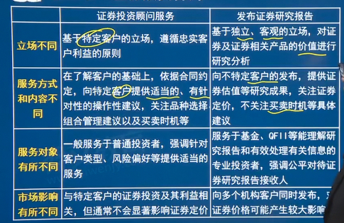
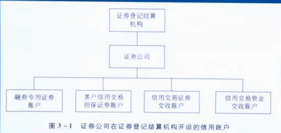

# 第三章：证券公司业务规范

## 3.1 证券经济
- 【本节考点】
  - 一、法规概述
  - 二、证券经纪业务的概念与特点
  - 三、证券经纪业务的营销管理
  - 四、证券经纪业务的营运管理
  - 五、沪港通、深港通业务
  - 六、科创板与创业板特别交易机制
  - 七、存托凭证与沪伦通
  - 八、证券经纪业务的主要风险及其防范

### 3.1.1 法规概述

1. (一)法律、行政法规
   1. 《证券法》“第七章证券交易场所”“第八章证券公司”对证券公司的证券经纪业务作出了原则性规定，《证券公司监督管理条例》“第四章业务规则与风险控制”“第二节证券经纪业务”对证券经纪业务作出了一般规定。
   2. 上述法律及行政法规是中国证监会等监管机构制定证券经纪业务相关监管政策、实施监督管理的重要法律依据。
2. (二)部门规章及规范性文件
   1. 除上述法律及行政法规外，证券公司经纪业务涉及的主要部门规章及规范性文件包括《客户交易结算资金管理办法》证券登记结算管理办法》
      《关于加强证券经纪业务管理的规定》等，对证券经纪业务进行了具体要求。

### 3.1.2 证券经纪业务的概念与特点

1. 概念
   1. 证券经纪业务，是指在证券交易中，**接受投资者委托，处理交易指令、办理清算交收的经营性活动**。
   2. 证券经纪商，是指接受客户委托、代理客户买卖证券并以此收取佣金的中间人。
   3. 证券经纪商以代理人的身份从事证券交易，与客户是委托代理关系。
   4. 证券经纪商必须遵照客户发出的委托指令进行证券买卖，其向客户提供服务以**收取佣金**作为报酬。
2. (二)证券经纪业务的特点
   1. 业务对象的广泛性
   2. 证券经纪商的中介性
   3. 客户指令的权威性
   4. 客户资料的保密性
3. (三)客户和证券经纪商的委托代理事项
   1. 接受并执行客户依照《证券交易委托代理协议》约定的方式下达的合法有效的委托指令；
   2. 代理客户进行**资金、证券的清算、交收**；
   3. 代理保管客户买入或存入的有价证券；
   4. 代理理客户**领取红利股息及其他利益分配**；
   5. 接受客户对其委托、成交及账户内的资产及变化情况的查询，并应客户的要求提供相应的清单；
   6. 法律、法规、规章、自律规则规定的、证券公司可以代理客户进行的其他活动。

### 3.1.3 证券经纪业务的营销管理

1. (一)证券公司经纪业务营销的主要内容
   1. 证券公司经纪业务的营销，是**市场营销管理与证券经纪业务相结合的产物**。
   2. 客户招揽
      1. 客户招揽，即证券经纪业务营销人员通过营销渠道，与客户建立关系并促成交易的过程
   3. 客户服务
      1. 在证券经纪业务营销中，客户服务主要包括**交易通道服务**、有形服务和信息咨询服务等附加服务
2. (二)证券公司经纪业务营销的主要渠道
   1. 目前，我国证券公司的营销渠道包括通过证券公司内部营销人员**进行直接营销和委托证券**经纪人开展证券经纪业务营销活动。
3. (三)证券经纪人制度
   1. 证券经纪人制度的历史沿革（略）
   2. 证券经纪人制度的主要内容
      1. (1)证券公司应当建立健全**证券经纪人管理制度**，采取有效措施，对证券经纪人及其执业行为实施集中统一管理，
         保障证券经纪人具备基本的职业道德和业务素质，防止证券经纪人在执业过程中从事违法违规或者超越代理权限、损害客户合法权益的行为。
      2. (2)证券经纪人为证券从业人员，应当符合规定的条件。
         1. 证券经纪人**只能接受一家证券公司**的委托，并应当专门代理证券公司从事客户招揽和客户服务等活动。
         2. 证券公司应当在与证券经纪人签订委托合同前，**对其资格条件进行严格审查**。
      3. (3)证券公司应当对证券经纪人进行**不少于60个小时**的执业前培训，其中法律法规和职业道德的培训时间**不少于20个小时**。
         1. 此外，证券公司应当按照中国证券业协会的规定，组织对证券经纪人的后续职业培训。
      4. (4)证券公司应当在与证券经纪人签订委托合同、对其进行执业前培训并经测试合格后，为其向中国证券业协会进行登记。
      5. (5)证券公司应当建立健全**信息查询制度**，保证客户能够通过现场、电话或者互联网络的方式随时查询证券经纪人的姓名、代理权限、代理期间、
          服务的证券营业部、执业地域范围及登记编号等信息。
      6. (6)证券公司应当**建立健全客户回访制度**，指定人员定期通过面谈、电话、信函或者其他方式对证券经纪人招揽和服务的客户进行回访。
         负责客户回访的人员**不得从事客户招揽和客户服务活动**。
      7. (7)证券公司应当建立健全**异常交易和操作监控制度**，采取技术手段，对证券经纪人所招揽和服务客户的账户进行有效监控，
          发现异常情况的，立即查明原因并按照规定处理。
      8. (8)证券公司应当建立**健全客户投诉和纠纷处理机制**，明确处理流程，妥善处理客户投诉和与客户之间的纠纷，持续做好客户投诉和纠纷处理工作
      9. (9)证券公司应当将证券经纪人的**执业行**为纳入合规管理范围，并建立科学合理的证券经纪人绩效考核制度，将证券经纪人执业行为的合规性纳人其绩效考核范围。
      10. (10)证券公司应当建立健全**证券经纪人档案**，实现证券经纪人执业过程留痕
   3. 委托合同必备事项
      1. 证券公司与证券经纪人签订委托合同，应当遵循平等、自愿、诚实信用的原则，公平地确定双方的权利和义务。
   4. 证券经纪业务营销中的禁正性行为
      1. 具体内容详见本书“第五章行业文化、职业道德与从业人员行为规范”“第四节从业人员行为规范”相关叙述。

### 3.1.4 证券经纪业务的营运管理

1. (一)账户管理
   1. 概念
      1. 证券经纪业务中客户账户主要包括：
      2. 客户在证券公司开立的资金账户、代理中国结算开立的各市场证券账户、代理基金注册登记机构开立的开放式基金账户,以及经核准允许受理的其他金融产品账户等。
   2. 账户开立的**总体要求**
      1. (1)证券公司为客户办理开户，应当遵循**合法、自愿、审慎原**则，审核客户身份的真实性/确保客户资料真实、准确和完整；
      2. (2)证券公司应**建立健全客户账户开户管理制度**、操作流程和风险识别、评估与控制体系，确保风险可测、可控、可承受；
      3. (3)证券公司可以在经营场所内为客户现场开立账户，也可以通过见证、网上及中国证监会认可的其他方式为客户开立账户。
   3. 账户开立的业务规则
      1. 证券公司在受理客户开户申请时，应当要求客户出具真实有效的身份证明文件，并采取必要措施对客户身份的真实性进行审核。
      2. 客户账户开立前，证券公司应当指定专人向客户讲解相关业务规则和开户协议等内容，并将**风险揭示书**交由客户签字，按规定履行投资者教育职责。
      3. 客户账户开立前，证券公司应当按照规定了解客户情况，对客户风险承受能力进行评估，履行适当性管理义务，并将评估结果以书面或电子方式记载和保存。
      4. 证券公司应当采取有效措施对客户开户资料的真实性、准确性、完整性进行审核。
      5. 证券公司应当统一组织回访客户对新开户客户应当在**1个月内**完成回访，对原有客户的回访比例应当不低于上年末客户总数（不含休眠账户及中止交易账户客户）的10%。客户回
         访应当留痕，相关资料应当保存**不少于3年**。
   4. 证券账户的管理
      1. (1)证券账户的开立
         1. ①证券账户的开立方式。
            1. 证券账户开立方式包括现场方式和非现场方式。其中，非现场方式包括**见证开户、网上开户**，以及中国结算认可的其他非现场开户方式。
            2. **现场开户**，
               1. 是指证券公司等开户代理机构工作人员在**营业场所内**为客户现场办理证券账户的开立手续，该开户方式适用于机构与自然人。
            3. **见证开户**，
               1. 是指证券公司等开户代理机构工作人员在营业场所外面心投资者，验证投资者身份并见证投资者签署开户申请表后，为投资者办理证券账户开立手续，该开户方式适用于机构与自然人。
            4. **见证开户的特殊要求**：
               1. 证券公司等开户代理机构当面见证客户开户的，证券公司可以委派2名或以上工作人员为投资者办理开户手续，其中**至少1名**应为见证人员；
               2. 视频见证开户的，证券公司等开户代理机构可以委派1名或以上工作人员面见投资者，并由证券公司等开户代理机构见证人员通过实时视频方式完成见证。
            5. **网上开户**，
               1. 是指证券公司等开户代理机构通过数字证书验证投资者身份，并通过互联网为投资者办理证券账户开立手续,该开户方式仅适用于自然人。
            6. **网上开户的特殊要求**：
               1. 开户代理机构应通过其公司网站为投资者办理网上开户业务，不得利用第三方网站办理网上开户业务。
               2. 投资者应当使用中国结算或其认可的其他机构颁发的数字证书作为网上开户的身份认证工具。
         2. ②证券账户的开立数量。
            1. 1个投资者只能申请开立**1个一码通账户**，1个投资者在同一市场最多可以申请开立**3个A股账户、3个封闭式基金账户**，只能申请开立**1个停角账户**、1个B股账户。
            2. 投资者申请开立A股账户时，除投资确需要开立单边A股账户之外，证券公司等开户代理机构应当为其同时开立沪市及深市双边A股账户。
      2. (2)**特殊法人与产品**开立证券账户的开立
         1. 特殊机构及产品证券账户可由申请主体到中国结算北京、上海或深圳分公司任意一地临柜提交申请，也可以通过中国结算证券账户在线业务平台提交账户开立申请。
         2. 为进一步提高开户效率，申请主体应当优先通过中国结算证券账户在线业务平台申请办理。
         3. 其中，“特殊机构”是指证券公司及其资管子公司、基金管理公司及其子公司、保险公司、信托公司、银行（含商业银行、农村合作银行、城市信用社、农村信用社等其他银行类金融机构)及商业银行理财子公司、外国战略投资者等特殊市场参与主体。
         4. 产品”，是指证券公司单一资产管理计划及集合资产管理计划、基金管理公司单一资产管理计划及集合资产管理计划、期货公司单一资产管理计划及集合资产管理计划、保险资产管理公司特定客户资产管理计划及集合资产管理计划、证券投资基金、信托产品、保险产品、银行理财产品（含商业银行理财子公司发行的理财产品)、企业年金计划、职业年金计划、养老金产品、全国社会保障基金投资组合、地方社保基金、私募基金、合格境外机构投资者(QFI1)、人民币合格境外机构投资者(RQFII)等依法设立的证券投资产品。
         5. 特殊机构及产品证券账户在开立及使用中应严格遵守账户实名制有关要求：
            1. ①特殊机构及产品证券账户持有人不得通过在证券账户下设立子账户、分账户、虚拟账户等方式违规进行证券交易；**不得出借**证券账户给他人使用。
            2. ②产品的管理人应加强自律，不得为专门申购新股、炒作风险警示股票($T股票)的产品申请开立证券账户；
            3. ③为产品、员工持股计划申请开立证券账户时，相关当事人应当申报登记产品、员工持股计划存续期。
            4. ④当证券公司单一资产管理计划及集合资产管理计划、基金管理公司单一资产管理计划及集合资产管理计划、期货公司单一资产管理计划及集合资产管理计划、保险资产管理公司特定客户资产管理计划及集合资产管理计划，信托产品、保险产品、银行理财产品、企业年金计划、私募基金等依役立的证券投资产品发生开户后**6个月内**没有进行交易、产品终止、合同失效或被撤销等情形时，相关当事人应于上述情形发生后15个交易日内办理证券账片注销手续；相关当事人未按要求注销该证券账户的，中国结算有妆注销该账户或限制该账户的使用
            5. ⑤对于各类特殊机构及产品证券账户存在下设子账户、分账户、虚拟账户，开户后相关证券投资产品并未依法成立仍使用相关证券账户，借用他人证券账户或将名下的本人证券账户出借给他人使用等违反账户实名制有关要求的，以及存在利用证券账户从事法律法规禁止的其他行为的，中国结算或有委托交易关系的证券公司有权注销相关账户或限制相关账户的使用
      3. (3)证券账户的信息变更
         1. 客户变更证券账户信息的办理方式如下：
            1. ①**关键信息变更**：
               1. 投资者姓名或名称》有效身份证明文件类型及号码三项为关键信息。
               2. 对于上述关键信息的变更，投资者应通过临柜、见证等方式办理。
            2. ②其他非关键信息变更：
               1. 开户代理机构可通过**临柜、见证、网络、电话等**方式受理投资者申请，核实投资者身份后予以办理。
      4. (4)证券账户的注销
         1. 证券公司在接到投资者销户申请后，应当在与该证券账户相关的业务了结后**两个交易日**内办理完毕，不得无故拒绝或拖延。
         2. 根据中国结算要求，对于**非现场开户**（包括见证开户和网上开户)的投资者，开户代理机构应当至少提供与开户方式一致的非现场销户（见证销户和网上销户）服务。
         3. ①申请账户注销的条件。
            1. 投资者申请注销证券账户应当同时满足以下条件：**证券账户持有余额为零且不存在与该证券账户相关的未了结业务**。
         4. ②应当主动申请注销的情形。
            1. 发生自然人投资者**死亡**的、法人以及合伙企业等非法人组织因依法被解散或破产清算等原因导致主体资格丧失、产品到期或其他终止情形的，
               证券账户持有人、证券资产合法继承人或承继人等相关当事人应当申请注销证券账户。
            2. **特殊机构与产品开户后6个月内**出现没有进行交易、产品终止、合同失效或被撤销等情形时，应当及时办理证券账户注销手续
      5. (5)不合格账户业务的认定与规范
         1. ①**违规以他人名义或利用虚假身份开立的账户**、违规使用他人账户或使用以虚假身份开立的账户，证券公司应当要求投资者办理账户注销手续，
             有证券余额的，应当督促投资者清空证券后予以注销。
         2. ②**代理关系不规范**，即投资者委托他人代理开立证券账户，但缺少经公证的授权委托书等能够证明委托代理关系的相关材料，
             证券公司应当督促投资者补齐经公证的授权委托书能证明其委托代理关系的材料。
         3. ③**账户关键信息不全、不准确或关键凭证缺失**，即证券账户名称、有效身份证明文件类型、有效身份证明文件号码三项关键信息不全、不准确，
            或有效身份证明文件复印件等关键凭证缺失，证券公司应当督促投资者变更证券账户关键信息或补齐账户资料
      6. (6)证券账户的网络服务功能
         1. 投资者可通过证券公司向中国结算申请开通证券账户网络服务功能，**在线办理证券查询、上市公司股东大会网络投票**等业务。
      7. (7)非交易过户
         1. 登记在中国结算开立的证券账户（不含开放式基金账户）中的股票（不含非流通股）、存托凭证、债券、基金等在证券交易所、
           全国中小企业股份转让系统交易的证券品种，因发生证券继承、捐赠、依法进行的财产分割、法人资格丧失、私募资产管理等情形之一涉及证券持有人变更的，
           作为过出方和过入方（以下统称“申请人”）可以申请办理非交易过户登记。
   5. 客户交易结算资金存管制度
      1. 客户交易结算资金必须全额存入具有从事证券交易结算资金存款业务资格的商业银行，**单独立户管理**。严禁挪用客户交易结算资金。
      2. (1)客户交易结算资金三方存管制度的历史沿革
         1. 证券公司客户的交易结算资金应当存放在商业银行，以每个客户的名义单独立户管理
      3. (2)客户交易结算资金三方存管的定义
         1. 根据《客户交易结算资金管理办法》，客户交易结算资金三方存管，是指证券公司将客户交易结算资**金存放指定的画业银行**，
           并以每个客户的名义单独立户管理，商业银行负责资金存取，发挥第三方监督作用，以保障客户资金安全为目的的资金存管模式。
      4. (3)客户交易结算资金三方存管制度的主要内容
         1. ①明确“单独立户”要求，防止资金被混合使用。
         2. ②明确“封闭运行”要求，防止资金被违规动用。
         3. ③除向客户收取与证券交易有关的佣金、费用或者代扣税款等特定情形外，证券公司不得将客户资金转入自有资金账户
2. (二)客户适当性管理
   1. 关于客户适当性管理的具体内容详见本书"第二章证券营机构管理规范”中"第三节投资者适当性管理”。
3. (三)委托交易
   1. 委托方式
      1. 客户向证券公司下达委托指令的方式由双方约定，其中客户委托指令的下达方式包括柜台委托、自助委托以及证券公司认可的其他合法委托方式，
         自助委托包括**网上委托、电话委托、热键委托**等。
   2. 委托指令
      1. (1)委托指令的要求
         1. ①客户委托证券公司代理其进行证券交易而发出的委托及撤销委托等指令的内容和方式应符合证券市场的**交易规则及协议的相关约定**。
         2. ②客户通过证券公司委托系统进行证券交易时，如**因客户操作失误或因客户指令违反**证券市场交易规则或协议约定，或其他可归咎于客户的原因而造成损失的，由客户承担。
         3. ③对于客户可能影响正常交易秩序的异常交易行为，证券公司有权按照证券交易所的要求对客户的交易委托采取限制措施。
      2. (2)委托指令的无效
         1. 客户在进行委托前须确保已完全了解有关交易规则，避免发出无效委托指令。如客户发出的指令被证券公司委托系统或证券交易所交易系统拒绝受理，
            则该委托应视为**无效委托**。
      3. (3)委托指令的**撤销**
         1. 客户在委托有效期内可对未显示成交回报的委托发出撤销委托指令（交易规则另有规定的除外），
         2. 但由于市场价格随时波动及成交回报速度的原因客户的撤销委托指令虽经证券公司发出，但客户委托可能已在市场成交，此时客户应承认并接受该成交结果。
      4. (4)委托指令的**成交**
         1. 客户委托指令成交与否以证券登记结算机构发送的**清算数据为准**，成交即时回报仅供参考。
      5. (5)委托结果的查询
         1. 证券公司接受客户对其委托成交及账户资金和证券变化情况的查询，并应根据客户的要求提供相应的清单。
         2. 客户**逾期未办理**查询或未对有异议的查询结果**以书面方式向证券公司提出质询**的，视同客户对该委托结果无异议。
4. (四)交易席位与交易单元
    1. 席位的定义
        1. 及一般规定根据上交所、深交所的相关规定，席位代表了会员（证券公司)在证券交易所的**权益**，会员（证券公司）须拥有席位方可在证券交易所进行交易。
        2. 会员（证券公司）应当至少取得并持有一个席位，但会员(证券公司)**不得共有席位**。
        3. 会员（证券公司）取得的席位**可向其他会员转让**，但**不得退回证券交易所**。
        4. 未经证券交易所同意，会员（证券公司）不得将席位出租、质押，或将席位所属权益以其他任何方式转给他人。
    2. 交易单元定义及一般规定
       1. 根据上交所、深交所的相关规定，**交易单元**是指会员（证券公司)向交易所申请设立的、参与证券交易与接受监管及服务的基本业务单位。
       2. 会员（证券公司）可以根据需要，向交易所申请设立一个或多个交易单元；不同的会员（证券公司）不得使用同一交易单元。
       3. 证券公司从事证**券经纪、自营、融资融券**等业务，应当分别通过**专用的交易单元**进行。
5. (五)委托交易证券托管与转销户
   1. **指定交易**
      1. 除境外投资者从事B股交易外，上交所证券交易从1998年起实行全面指定交易制度。
      2. 指定交易，是指凡在上交所市场进行证券交易的投资者，必须事先指定上交所市场交易参与人，作为其证券交易的受托人，
         并由该交易参与人通过其特定的交易单元参与上交所市场证券交易的制度。
      3. **其中，交易参与人即指证券公司，每一个证券账户只能指定一个交易参与人（证券公司)**
   2. **证券托管**
      1. 深交所实行证券托管制度，证券托管制度是指投资者可以**以同一证券账户在单个或者多个证券公司的不同证券营业部买入证券**。
      2. 投资者买入的证券可以通过原买入证券的交易单元委托卖出，也可以向原买入证券的交易单元发出转托管指令，转托管完成后，在转入的交易单元委托卖出。
   3. 转销户
      1. 证券公司不得违反规定**限制客户终止交易代理关系、转移资产**。
      2. 客户申请转托管、撤销指定交易和销户的，应当在接受客户申请并完成其账户交易结算（包括但不限于交易、基金代销、新股申购等业务)后的**两个交易日内**办理完毕，
      3. 法律法规、中国证监会及证券交易所、证券登记结算机构另有规定的从其规定。
6. (六)客户交易安全监控
   1. 第一，证券公司应当要求客户在开立资金账户时**自行设置密码**，提醒客户适时修改密码和增强密码强度，
       并在证券营业部经营场所、公司网站、网上证券客户端及自助证券交易客户端提示客户加强身份证件、账号、密码的保护。
   2. 第二，证券公司应当根据法律法规、中国证监会的规定及合同约定，以信函、电子邮件、手机短信、网上查询或者与客户约定的其他方式，
      保证客户至少在证券公司营业时间内能够查询其委托、交易记录、证券和资金余额等信息。
   3. 第三，**证券公司应当配合监管部门、证券交易所建立健全客户交易安全监控制度，保护客户资产安全**。
      1. 证券公司发现盗买盗卖等异常交易行为疑点时，应当及时通知客户并核实确认、留存证据； 
      2. 基本确认盗买盗卖等异常交易行为的，应当立即采取措施控制资产，并协助客户向公安机关报案。
7. (七)异常交易行为管理
   1. 证券交易所对证券交易实时监控事项
      1. 上交所和深交所对下列可能影响证券交易价格或者证券交易量的异常交易行为，予以重点监控：
         1. (1)可能对证券交易价格产生重大影响的信息披露前，大量买入或者卖出相关证券；
         2. (2)以同一身份证明文件、营业执照或其他有效证明文件开立的证券账户之间，大量或者频繁进行互为对手方的交易
         3. (3)委托、授权给同一机构或者同一个人代为从事交易的证券账户之间，大量或者频繁进行互为对手方的交易；
         4. (4)两个或两个以上固定的或涉嫌关联的证券账户之间，大量或者频繁进行互为对手方的交易；
         5. (5)大笔申报、连续申报或者密集申报，以影响证券交易价格；
         6. (6)频繁申报或频繁撤销申报，以影响证券交易格或其他投资者的投资决定；
         7. (7)巨额申报，申报价格明显偏离申报时的证券市场成交价格；
         8. (8)一段时期内进行大量且连续的交易；
         9. (9)在同一价位或者相近价位大量或者频繁进行回转交易
         10. (10)大量或者频繁进行高买低卖交易；
         11. (11)进行与自身公开发布的投资分析、预测或建议相背离的证券交易；
         12. (12)在大宗交易中进行虚假或其他扰乱市场秩序的申报；
         13. (13)证券交易所认为需要重点监控的其他异常交易。
      2. 出现异常交易行为需采取的措施
         1. (1)证券交易所会员如果发现投资者的证券交易出现上述所列的异常交易行为之一，且可能严重影响证券交易秩序的，应当予以提醒，并及时向证券交易所报告。
            1. 另外，出现上述所列异常交易行为之一，且对证券交易价格或者交易量产生重大影响的，证券交易所可采取非现场调查和现场调查措施，
              要求相关会员及其营业部提供投资者开户资料、授权委托书、资金存取凭证、资金账户情况、相关交易情况等资料；
            2. 如异常交易涉及投资者的，证券交易所可以直接要求相关投资者提供有关材料。
            3. 证券交易所会员及其营业部、投资者应当配合证券交易所进行相关调查，及时、真实、准确、完整地提供有关文件和资料。
         2. (2)对情节严重的异常交易行为，证券交易所可以视情况采取下列措施：
            1. ①口头或书面警示；
            2. ②约见谈话；
            3. ③要求相关投资者提交书面承诺/④限制相关证券账户交易；
            4. ⑤报请中国证监会冻结相关证券账户或资金账户；
            5. ⑥上报中国证监会查处。
         3. 如果相关人对其中第④项限制相关证券账户交易措施有异议的，可以向证券交易所提出复核申请，复核期间不停止相关措施的执行。
   2. 北京证券交易所对异常交易情况的认定
      1. 北交所对异常交易行为的界定在沪深交易所的基础上，新增以下重点监控情形：
         1. (1)通过策划、实施虚假重大事项，误导投资者作出投资决策，并进行相关交易；
         2. (2)通过控制发行人、上市公司信息的生成或者控制信息披露的内容、时点、节奏，误导投资者作出投资决策，并进行相关交易。
      2. 北交所对交易异常情况的处理措施
         1. 交易异常情况出现后，北交所将及时向市场公告，并可视情况需要单独或者同时采取技术性停牌、临时停市、通知证券登记结算机构暂缓交收等措施。
         2. 北交所如采取前款规定措施的，应及时报告中国证监会。
8. (八)佣金管理
   1. 佣金收费标准
      1. 证券经纪商向客户收取的佣金（包括代收的证券交易监管费和证券交易所手续费等)**不得高于证券交易金额的3%**，
      2. **也不得低于代**收的证券交易监管费和证券交易所手续费等。
   2. 具体标准如下：
      1. (1)A股、证券投资基金每笔交易佣金**不足5元的，按5元收取**。
      2. (2)B股每笔交易佣金**不足1美元或5港元**的，按1美元或5港元收取。
      3. (3)国债现券、企业债（含可转换债券)、国债回购以及以后出现的新的交易品种，其交易佣金标准由证券交易所制定并报中国证监会和原国家计委备案，
         **备案15天内**无异议后实施
   3. 佣金收取标准公示
      1. 证券公司收取的交易佣金应当与代收的印花税、证券监管费、证券交易经手费、登记过户费等其他费用分开列示，
        并按照规定与约定提供给投资者，证券公司应当在公司网站、营业场所、客户端公示对应类别的投资者具体证券交易佣金收取标准，
      2. **证券公司实际收取的证券交易佣金应当与公示标准一致**

### 3.1.5 沪港通、深港通业务
1. (一)沪港通(2014年4月10日)
   1. 沪港通定义
      1. (1)沪港通，即“**沪港股票市场交易互联互通机制**”，指内地和香港投资者委托上交所会员或者联交所参与者，
          通过上交所或者联交所在对方所在地设立的证券交易服务公司，买卖规定范围内的对方交易所上市股票。
      2. 沪港通包括**沪股通**和**港股通**两部分。
      3. (2)**沪股通**，
         1. 是指香港投资者委托香港经纪商，经由联交所设立的证券交易服务公司，向上交所进行申报，买卖规定范围内的上交所上市的股票。
      4. (3)**港股通**，
         1. 是指内地投资者委托内地证券公司，经由上交所设立的证券交易服务公司，向联交所进行申报，买卖规定范围内的联交所上市的股票。
   2. 沪港通可交易的证券品种
      1. 沪股通股票包括以下范围内的股票：
         1. ①上证180指数成分股；
         2. ②上证380指数成分股；
         3. ③A+H股上市公司的证券交易所上市A股。
      2. 不纳入沪股通
         1. 在上交所上市公司股票风险警示板交易的股票（即ST、ST股票和退市整理股票)、 
         2. 以外币报价交易的股票（即B'和
         3. 具有上交所认定的其他特殊情形的股票，
   3. 港股通的股票包括以下范围内的股票； 
      1. ①恒生综合大型股指数的成分股； 
      2. ②恒生综合中型股指数的成分股； 
      3. ③A+H股上市公司的H股。
   4. 同时在上交所以外的内地证券交易所和联交所上市的股票**不纳入港**股通股票范围；
         1. 在联交所以**人民币报**价交易的股票不纳入港股通范围；
         2. A十H股上市公司若其A股被上交所实施风险警示，则其相应的H股也不纳入港股通股票。
2. (二)深港通(2016)
   1. 深港通的概念
      1. 深港通，是“深港股票市场交易互联互通机制”的简称，是指深交所和联交所建立技术连接，
         使内地和香港投资者通过当地证券公司或经纪商买卖规定范围内的对方交易所上市的股票。
      2. 深港通包括**深股通**和深港通下的**港股通**（以下简称“港股通”)两部分。
   2. 深港通的标的范围
      1. 深股通的股票范围
         1. 是市值**60亿元人民币及以上**的深证成分指数和深证中小创新指数的**成分**股，
         2. 以及深交所上市的A+H股公司股票。
         3. 与沪股通标的偏重大型蓝筹股相比，深股通标的充分展现了深交所**新兴行业集中、成长特征鲜明**的市场特色。
      2. 深港通下港股通的股票范围
         1. 恒生综合**大型**股指数的**成分股**、
         2. 恒生综合**中型**股指数的**成分股**、
         3. 市值**50亿元港币及以上**的恒生综合小型股指数的成分股，
         4. 以及联交所上市的A+H股公司股票。

### 3.1.6 科创板与创业板特别交易机制

1. (一)科创板
   1. 我国于2019年在上交所设立科创板并试点注册制。
      1. 科创板定位
         1. 在上交所新设科创板，坚持面向世界科技前沿、面向经济主战场、面向国家重大需求，主要服务于**符合国家战略、突破关键核心技术、市场认可度高**的科技创新企业。
         2. 重点支持新一代信息技术、高端装备、新材料新能源节能环保以及生物医药等高新技术产业和战略性新兴产业，
            推动互联网、大数据、云计算、人工智能和制造业深度融合，具体行业范围由上交所发布并适时更新。
      2. 投资者适当性管理
         1. 2019年3月上交所公布《上海证券交易所科创板股票交易特别规定》，明确投资者参与科创板股票交易的具体条件：
            1. 个人投资者申请权限开通前20个交易日证券账户及资金账户内的资产**日均不低于人民币50万元**，并且参与**证券交易24个月以**上；
            2. 符合法律法规及上交所规定的机构投资者，可直接申请开通科创板股票交易权限
            3. 。投资者仅需向其委托的证券公司申请，在已有沪市A股证券账户上开通科创板股票交易权限即可，无须在中国结算开立新的证券账户
      3. 交易机制特别规定
         1. **引入盘后固定价格交易盘后固定价格交易**
            1. 指在竞价交易结束后，投资者通过收盘定价委托，按**照收盘价买卖股票**的交易方式。
         2. **优化融券交易机制**
            1. 科创板股票自上市首个交易日起可作为融资融券标的，且融券标的证券选择标准与A股有所差别。
         3. (3)新增两种市价申报方式
            1. 新增**本方最优价格申报**和**对手方最优价格申报**两种市价申报方式。
         4. (4)放宽涨跌幅限制
            1. 科创板股票的涨跌幅限制放宽至**20%为**尽快形成合理价格，新股上市后的**前5个交易日**不设涨跌幅限制。
         5. (5)调整单笔申报数量
            1. 对于**市价订单和限价订**单，规定单笔申报数量应**不小于200股**，每笔申报可以1股为单位递增。
            2. **市价订单**单笔申报**最大数量为5万股**，限价订单单笔申报最大数量**为10万股**。
         6. (6)可以根据市场情况调整微观交易机制
            1. 为防止过度投机炒作，维护正常交易秩序，对有效申报价格范围和盘中临时停牌情形另行规定；
            2. 实施差异化的最小价格变动单位，依据股价高低，实施不同的申报价格最小变动单位，以降低低价股的买卖价差。
         7. (7)调整交易信息公开指标
         8. (8)交易行为监督方面
2. (二)创业板
   1. 创业板定位
      1. 创业板设立于2009年10年多来创业板市场逐步发展壮大，聚集了一批优秀企业，在落实创新驱动发展战略、服务实体经济等方面发挥了重要作用。
      2. 根据近年来经济形势变化和多层次资本市场发展实际，改革后创业板将定位为：
         1. 深入贯彻创新驱动发展战略，适应发展更多依靠创新、创造、创意的大趋势，主要服务**成长型创新**创业企业，
            支**持传统产业与新技术、新产业、新业态、新模式**深度融合
   2. **适当性管理**
      1. 新申请开通创业板**交易权限的投资者条件**：
         1. 个人投资者申请权限开通**前20个交易日证券账户**及资金账户内的资产日均应**不低于人民币10万元**，并参与证券交易**24个月以上**。
         2. 本次修**订取消了原规则中2日、5日的冷静期要求。**
   3. 特别交易机制
      1. 一方面，创业板在整体上充分借鉴科创板改革经验，在**涨跌幅限制、限价申报限制、盘后定价交易机制、两融交易标的**等方面均**沿用科创板的交易机制**，
      2. 同时创业板针对自身特殊情况作出了部分针对性的安排，
         1. 如单笔申报数量方面，**限价申报**的单笔买卖申报数量不得**超过30万股**，市**价申报**的单笔买卖数量**不得超过15万股**。

### 3.1.7 存托凭证与沪伦通

1. 存托凭证
   1. 存托凭证(DR)定义 
      1. 是指由存托人签发、以**境外证券**为基础在**中国境内发行、代表境外基础证券权益**的证券。
      2. 存托凭证的境外基础证券发行人应当参与存托凭证发行，依法履行发行人、上市公司的义务，承担相应的法律责任。
   2. 公开发行以股票为基础证券的存托凭证的，境外基础证券发行人应当符合**下列条件**：
      1. (1)《证券法》第十二条第（一）项至第（四）项关于股票公开发行的基本条件；
      2. (2)为依法设立且持续经**营三年以上**的公司，公司的主要资产不存在重大权属纠纷；
      3. (3)**最近三年**内实际控制人未发生变更，且控股股东和受控股股东、实际控制人支配的股东持有的境外基础证券发行人股份不存在**重大权属纠纷**；
      4. (4)境外基础证券发行人及其控股股东、实际控制人**最近三年内**不存在损害投资者合法权益和社会公共利益的**重大违法行**为；
      5. (5)会计基础工作规范、内部控制制度健全；
      6. (6)董事、监事和高级管理人员应当信誉良好，符合公司注册地法律规定的任职要求，近期无重大违法失信记录；
      7. (7)中国证监会规定的其他条件。
   3. 信息披露
      1. 境外基础证券发行人具**有股东投票机差异**，**企业协议控制架构**或者类似特殊安排的，
        应当在招股说明书等公开发行文件显要位置充分、详细披露相关情况，特别是风险、公司治理等信息，并以专章说明依法落实保护投资者合法权益规定的各项措施。
   4. 存托与托管
      1. (1)存托
         1. 以依法担任存托人的机构有：
            1. **中国证券登记结算有限责任公司及其子公司**；
            2. 经**国务院银行业监督管理机构**批准的商业银行、证券公司。
         2. 存托人应当承担以下职责：
            1. ①与境外基础证券发行人签署存托协议，并根据存托协议约定协助完成存托凭证的发行上市。
            2. ②**安排存放**存托凭证基础财产
            3. ③建立并**维护**存托凭证持有人名册。
            4. ④办理存托凭证的**签发与注销**。
            5. ⑤按照中国证监会规定和存托协议约定，向存托凭证持有人发送通知等文件
            6. ⑥按照存托协议约定，向存托凭证持有人**派发红利、股息**等权益，根据存托凭证持有人意愿行使表决权等权利。
            7. ⑦境外基础证券发行人股东大会审议有关存托凭证持有人权利义务的议案时，存托人应当参加股东大会并为存托凭证持有人权益行使表决权
            8. 。⑧中国证监会规定和存托协议约定的其他职责。
      2. (2)托管】
         1. 定义
            1. 存托人可以委托境外金融机构担任托管人。
            2. 存托人委托托管人的，应当在存托协议中明确基础财产由托管托管。
         2. 托管人应当承担**下列职责**：
            1. ①托管基础财产；
            2. ②按照托管协议约定，**协助办理分红派息、投票**；
            3. ③向存托人提供基础证券的市场信息；
            4. ④中国证监会规定和托管协议约定的其他职责
   5. 投资者保护
      1. (1)境外基础证券发行人应当确保存托凭证持有人实际享有的资产收益、参与重大决策、剩余财产分配等权益与境外基础证券持有人权益相当。
            境外基础证券发行人不得作出任何损害存托凭证持有人合法权益的行为。
      2. (2)中证中小投资者服务中心建立投资者保护机制。
         1. ①中证中小投资者服务中心有限责任公司可以购买最小交易份额的存托凭证，依法行使存托凭证持有人的各项权利；
         2. ②中证中小投资者服务中心有限责任公司可以接受存托凭证持有人的委托，**代为行使存托凭证持有人的各项权利**；
         3. ③中证中小投资者服务中心有限责任公司可以支持受损害的存托凭证持有人依法向人民法院**提起民事诉讼**
         4. ④存托凭证持有人与境外基础证券发行人、存托人、证券服务机构等主体发生纠纷的，可以向中证中小投资者服务中心有限责任公司及其他依法设立的调解组织申请调解。

2. (二)“沪伦通”存托凭证业务
   1. “沪伦通”定义
      1. 沪伦通，即**上交所与伦交所**互联互通机制，
      2. 是指符合条件的两地上市公司，依照对方市场的法律法规，发行存托凭证并在对方市场上市交易；
      3. 同时，通过存托凭证与基础证券之间的跨境转换机制安排，实现两地市场的互联互通。
   2. 沪伦通包括东、西两个业务方向。
      1. **东向业务**，
         1. 是指**伦交所上市公司在上交所挂牌中国存托凭证**，
         2. 即由存托人签发、以境外证券为基础，在中国境内发行,代表境外基础证券权益的证券；
      2. 西向业务，
         1. 是指**上交所A股上市公司在伦交所挂牌全球存托凭证**。
         2. 沪伦通下的全球存托凭证是由存托人签发、以沪市A股为基础，在英国发行、代表中国境内基础，证券权益的证券
   3. 与沪深港通业务模式的区别
      1. 沪深港通是两地的投资者互相到对方市场直接买卖股票，“投资者”跨境，但产品仍在对方市场。
      2. 而**沪伦通**是将对方市场的股票转换成存托凭证到本地市场挂牌交易，“产品”跨境，但投资者仍在本地市场
   4. 投资者适当性管理
      1. (1)个人投资者, 个人投资者参与中国存托凭证交易，应当**符合下列条件**
         1. ①申请权限开通**前20个交易日**证券账户及资金账户内的资产日均不低于人民币**300万元**（不包括该投资者通过融资融券交易融入的资金和证券)；
         2. ②不存在严重的不良诚信记录；
         3. ③不存在境内法律、上交所业务规则等规定的禁止或限制参与证券交易的情形。
      2. (2)机构投资者
         1. 机构投资者参与中国存托凭证交易，应当符合境内法律及上交所业务规则的规定。
   5. 沪伦通标的企业选取的考虑因素
      1. 沪伦通采用存托凭证两地市场互相挂牌模式。
      2. 符合条件的沪伦两所上市公司均可向对方的证券监管机构和交易所提出相应的发行上市申请，参与东、西向业务。
      3. **东向业务方面**，
         1. 境外基础证券发行人应为伦交所主板高级上市公司，**上市年限和市值规模**应符合一定标准，其
           目的是选取在英国市场流动性较好、有较为广泛投资者基础的发行人参与东向业务，实现项目平稳起步。
      4. **西向业务方面**，
         1. 伦交所欢迎上交所主板市值规模达一定标准的公司发行全球存托凭证。
   6. 存托凭证与基础股票的跨境转换安排具体操作方式
      1. 跨境转换分为基础股票转换成存托凭证的“生成”过程和存托凭证转回基础股票的“兑回”过程。
      2. 整个跨境转换由投资者、存托人、托管人以及跨境转换机构等市场主体协同完成。
      3. **生成过程**是指基础股票的持有人将基础股票交付存托人，由存托人根据存托协议的安排，办理存托凭证签发手续，
         在存托凭证上市交易地使基础股票持有人转为持有存托凭证的过程
      4. **兑回过程**是指存托凭证的持有人将存托凭证交付存托人后，由存托人根据存托协议的安排，办理存托凭证注销手续，
         并在基础股票的上市交易地将基础股票转为由存托凭证持有人持有的过程。

### 3.1.8 北京证券交易所

1. (一)设立背景与意义
   1. **2021年9月2日**，习近平总书记在2021年中国国际服务贸易交易会全球服务贸易峰会上的致辞中宣布设立北京证券交易所，
   2. 打造服务创新型中小企业主阵地，北京证券交易所于2021年9月3日注册成立，是经国务院批准设立的我国**第一家公司制**证券交易所，受中国证监会监督管理。
2. (二)设立的定位与原则
   1. 坚守"一个定位”
      1. 北京证券交易所将牢牢坚持服务创新型中小企业的市场定位，尊重创新型中小企业发展规律和成长阶段，提升制度包容性和精准性。
   2. 处理好"两个关系”
      1. (1)北京证券交易所与沪深交易所、区域性股权市场**坚持错位发展与互联互通**，发挥好转板上市功能。
      2. (2)北京证券交易所与新三板现有创新层、基础层坚持统筹协调与制度联动，维护市场结构平衡。
3. (三)交易机制
   1. 按照精选层各项制度基本平移至北交所的总体思路，北交所交易制度整体延续精选层相关交易安排。
   2. 交易方式包括**竞价交易、大宗交易、协议转让与其他交易方式**，同时采取多种价格稳定机制。
4. (四)**投资者适当性管理**, 个人参与北交所股票交易需满足以下条件
   1. (1)申请权限开通**前20个交易日证券**账户和资金账户内资产日均不低于人**民币50万元**（不包括该投资者通过融资融券融入的资金和证券)。
   2. (2)参与证券交易**24个月以上**。机构投资者参与北交所股票交易应当符合法律法规及北交所业务规则的规定。

    
### 3.1.9 证券经纪业务的主要风险及其防范

1. (一)证券经纪业务的主要风险证券
   1. 定义
      1. 经纪业务的风险，是指证券公司在开展证券经纪业务过程中因种种原因而导致其**自身利益遭受损失的可能性**。
      2. 按风险起因不同，经纪业务的风险主要包**括合规风险、管理风险和技术风险**等。
   2. 合规风险
      1. 证券经纪业务的合规风险，主要是指证券公司在经纪业务活动中违反法律、行政法规和监管部门规章及规范性文件、
         行业规范和自律规则、公司内部规章制度、行业公认并普遍遵守的职业道德和行为准则等行为，
         可能使证券公司**麦到法律制裁、被采取监管措施、遭受财产损失或声誉损失**的风险
   3. 管理风险
      1. 管理风险主要是指证券公司在经纪业务经营中由子**管理制度不健全、内部控制不严，或工作人员有章不循**、违规操作等而导致客户账户管理差错或违规、
        侵害客户权益、造成客户资产损失、引发客户纠纷，而使证券公司受到监管处罚或因承担赔偿责任遭受财产损失或声誉损失的风险。
   4. 技术风险
      1. 技术风险，是指证券公司信息技术系统（包括电脑设备、供电、通讯设施等)发生技术故障，导致行情中断、交易停滞、银证转账不畅，
         或在容量、运作等方面不能保障交易业务正常、有序、高效心顺利地进行，从而可能给客户造成损失，证券公司因承担赔偿责任而带来经济或声誉损失的风险。
      2. 技术风险主要来自**硬件设备**和**软件**两个方面
2. (二)证券经纪业务风险的防范
   1. 合规风险的防范
      1. (1)证券公司要**加强合规文化建设**，
         1. 从高级管理人员到普通员工都要增强法治观念和合规意识。
         2. 要从指导思想上牢固树立依法、合规、诚信、公平的经营理念，进而转化成全体员工在业务经营中的自觉行为。
      2. (2)**要建立健全各项规章制度**，严格按经纪业务内部控制的要求完善内部控制机制和制度
      3. (3)对客户交易结算资金实行**第三方存管**，
         1. 对经纪业务账户管理、交易、清算、核算、操作权限、风险控制等实行集中统一管理；
         2. 对风险程度和重要性不同的业务，实行实时复核、分级审批。加强对经纪业务主要环节和风险点的控制。
      4. (4)强化岗位制约和监督，**对经纪业务主要部门和岗位实行相互分离的管理制度**。
         1. 经纪业务营销、账户管理、信息系统管理、会计核算等部门或岗位应严格分开，不得兼职或混合操作。严格限定不同岗位人员的操作权限。
   2. 管理风险的防范
      1. (1)**加强经纪业务营销管理**
      2. (2)**严格执行经纪业务操作规程**
      3. (3)建立**经纪业务营销和账户管理操作信息管理系统**，防范从业人员执业行为引发的风险，保护客户合法权益。
      4. (4)加强员工培训，提高员工素质。
      5. (5)建立客户投诉处理及责任追究机制
      6. (6)建立经纪业务检查稽核制度
   3. 技术风险的防范
   

## 3.2 证券投资咨询

- 【本节考点】
  - 一、概念和基本关系
  - 二、证券投资咨询机构及人员从业管理
  - 三、发布证券研究报告业务的有关规定
  - 四、证券投资顾问业务的有关规定
  - 五、证券投资咨询机构及其执业人员向社会公众投资咨询业务活动的有关规定
  - 六、利用“荐股软件”从事证券投资咨询业务的规范要求
  - 七、证券基金经营机构使用香港机构证券投资咨询服务的有关规定
  - 八、证券投资咨询人员执业行为准则
  - 九、法律责任和监管措施

### 3.2.1 概念和基本关系

1. (一)证券投资咨询、证券投资顾问、发布证券研究报告的概念
   1. **证券投资咨询**
      1. 证券投资咨询，是指从事证券投资咨询业务的机构及其投资咨询人员以下列形式为证券投资人或者客户提供证券投资分析、
        预测或者建议等直接或者间接有偿咨询服务的活动：
         1. (1)接受投资人或者客户委托，提供证券投资咨询服务
         2. (2)举办有关证券投资咨询的讲座、报告会、分析会等
         3. (3)在报刊上发表证券投资咨询的文章、评论、报以及通过电台、电视等公众传播媒体提供证券投资咨询服务
         4. (4)通过电话、传真、电脑网络等电信设备系统，提供证券投资咨询服务；
         5. (5)中国证监会认定的其他形式。
         6. 总体而言，证券投资咨询业务包括证券投资顾问业务及发布证券研究报告。
      2. 证券投资顾问
         1. 证券投资顾问业务，是证券投资咨询业务的一种基本形式，
         2. 指证券公司、证券投资咨询机构接受客户委托，按照约定向客户提供涉及证券及证券相关产品的投资建议服务，助客户作出投资决策，
           并直接或者间接获取经济利益的经营活动。投资建议服务内容包括投资的**品种选择、投资组合以及理财规划建议**等。
      3. 发布证券研究报告
         1. 发布证券研究报告，是证券投资咨询业务的一种基本形式，
         2. 指证券公司、证券投资咨询机构对证券及证券相关产品的价值、市场走势或者相关影响因素进行分析，形成证券估值投资评级等投资分析意见，
          制作证券研究报告，并向客户发布的行为。
         3. 证券研究报告主要包括涉及证券及证券相关产品的价值分析报告、行业研究报告、投资策略报告等。证券研究报告可以采用书面或者电子文件形式。
2. (二)基本关系
   1. 定义
      1. 证券投资顾问业务和发布证券研究报告是证券投资咨询业务的两种基本形式，也是证券经营机构服务客户的重要手段。
      2. 两者既具有显著区别，又密切联系。
   2. 证券投资顾问业务和发布证券研究报告的**区别**
      1. 
   3. 证券投资顾问业务和发布证券研究报告的联系
      1. (1)在**服务流程**上，
         1. 证券研究报告一般是证券投资顾问服务的重要基础，证券投资顾问团队依据证券研究报告以及其他公开证券信息，
         2. 整合形成有针对性的证券投资顾问建议，再按照协议约定向客户提供。
      2. (2)在**制度规范要求**上，
         1. 证券投资顾问向客户提供投资建议，应当具有合理的依据；
         2. 投资建议的依据包括证券研究报告或者基于证券研究报告、理论模型以及分析方法形成的投资分析意见等。
         
### 3.2.2 证券投资咨询机构及人员从业管理

1. (一)证券投资咨询机构从业管理
   1. 证券投资咨询机构应当具备下列条件：
      1. 单独从事证券投资咨询业务的机构，
         1. 有**5名以上**符合证券投资咨询从业条件的专职人员；
         2. 同时从事证券和期货投资咨询业务的机构，**有10名以上**符合证券、期货投资咨询从业条件的专职人员；
         3. 其高级管理人员中，至少有**1名**符合规定的证券投资咨询从业条件；
      2. 有**100万元**人民币以上的注册资本；
      3. 有固定的业务场所和与业务相适应的通讯及其他信息传递设施
      4. 有公司章程；
      5. 有健全的内部管理制度；
      6. 具备中国证监会要求的其他条件。
      7. 符合设立条件的证券投资咨询机构，由中国证监会颁发业务许可证。证券公司亦可申请业务许可证，从事证券投资咨询业务。
2. (二)证券投资咨询人员从业管理
   1. 从事证券投资咨询业务的人员，必须符合证券投资咨询从业条件**并加人一家有从业资格的证券投资咨询**机构后，方可从事证券投资咨询业务。
   2. 证券投资咨询人员不得同时在2个或者2个以上的证券投资咨询机构执业。
   3. 从事证券投资咨询业务的人员**分为两类**：
      1. 第一，在发布的证券研究报告上**署名**的人员，应当符合相关从业条件，并在中国证券业协会注册登记为证券分析师。
      2. 第二，向客户提供证券投资顾问服务的人员，应当符合相关从业条件，并在中国证券业协会注册登记为证券投资顾问。
      3. **同一人员不得同时注册为证券分析师和证券投资顾问。**
      4. 证券投资咨询人员通过所在机构向中国证券业务协会登记。登记信息完备的，中国证券业协会于**5个工作日**内办结登记并生成唯一登记编码。

   
### 3.2.3 发布证券研究报告业务的有关规定

1. (一)基本原则
   1. 经营机构发布证券研究报告，应当遵守法律、行政法规和其他有关规定，
   2. 遵循**独立、客观、公平、审慎**原则，有效防范利益冲突，
   3. 公平对待发布对象，禁止传播虚假、不实、误导性信息，
   4. 禁止从事或者参与内幕交易、操纵证券市场活动。
2. (二)发布证券研究报告业务关键环节的规范要求
   1. 经营机构发布的证券研究报告，应当载明下列事项：
      1. (1)**“证券研究报告”字样**
      2. (2)经营机构名称；
      3. (3)具备证券投资咨询业务资格的说明；
      4. (4)证券分析师姓名及其登记编码：
      5. (5)发布证券研究报告的时间；
      6. (6)证券研究报告采用的信息和资料来源；
      7. (7)使用证券研究报告的风险提示。
   2. 证券研究报告覆盖范围管理
      1. 经营机构发布证券研究报告，应当加强研究对象覆盖范围管理。
      2. 将上市公司纳入研究对象覆盖范围并**作出证券估值或投资评级**，或者将该上市公司移出研究对象覆盖范围的，应当由研究部门或者研究子公司独立作出决定并履行内部审核程序。
   3. 证券研究报告信息来源管理
      1. (1)**建立证券研究报告信息来源管理制度**
         1. 经营机构应当建立证券研究报告的信息来源管理制度，加强信息收集环节的管理，维护信息来源的**合法合规性**。
      2. (2)证券研究报告可使用的**信息来源**
         1. ①政府部门、行业协会、证券交易所等机构发布的政策，、市场、行业以及企业相关信息。
         2. ②上市公司按照法定信息披露义务通过指定媒体公开披露的信息。
         3. ③上市公司及其子公司通过公司网站、新闻媒体等公开渠道发布的信息，以及上市公司通过股东大会、新闻发布会、产品推介会等非正式公告方式发布的信息。
         4. ④经营机构通过上市公司调研或者市场调查，从上市公司及其子公司、供应商、经销商等处获取的信息，但内幕信息和未公开重大信息除外。
         5. ⑤经营机构从信息服务机构等第三方合法取得的市场、行业及企业相关信息。
         6. ⑥经公众媒体报道的上市公司及其子公司的其他相关信息。
         7. ⑦其他合法合规信息来源。
      3. (3)证券研究报告信息使用的**禁止要求**
         1. 经营机构发布证券研究报告，应当**审慎使用**信息，
         2. 对引用信息和数据来源进行核实，不得将无法确认来源合法合规性的信息写人证券研究报告；
         3. 不得将无法认定真实性的市场传言作为确定性研究结论的依据；
         4. 不得以任何形式使用或者泄露国家保密信息、内幕信息以及上市公司未公开重大信息。
   4. 调研活动管理
      1. 经营机构应当建立调研活动的管理制度，分别针对非客户服务性质的独立调研和带有客户服务性质的联合调研制定相应规范，加强对调研活动的管理。
      2. **发布证券研究**报告相关人员进行上市公司调研活动，应当符合**以下要求**：
         1. (1)**事先履行所在经营机构的审批程序**；
         2. (2)不得向证券研究报告相关销售服务人员、特定客户和其他无关人员泄露研究部门或研究子公司的调研底稿、
            调研后发布证券研究报告的计划、研究观点的调整信息，以及未一段时间的非客户服务性质的独立调研计划；
         3. (3)不得主动寻求上市公司相关内幕信息或者未公开重大信息；
         4. (4)被动知悉上市公司内幕信息或者未公开重大信息的，应当对有关信息内容进行保密，
            并及时向所在机构的合规管理部门报告本人已获知有关信息的事实，在有关信息公开前不得发布涉及该上市公司的证券研究报告；
         5. (5)上市公司调研纪要仅供内部存档或撰写研究报告使用，不得对外发布或提供给客户；
         6. (6)在证券研究报告中使用调研信息的，应当保留必要的信息来源依据。
   5. 证券研究报告质量控制、合规审查
      1. (1)研究方法要求
         1. 经营机构制作证券研究报告应当秉承专业的态度，采用严谨的研究方法和分析逻辑，重点围绕宏观经济形势、资本市场走势、行业发展、上市公司投资价值等进行深入分析，
            **并基于合理的数据基础和事实依据，审慎提出研究结论**。
      2. (2)报告用语要求
         1. 经营机构制作证券研究报告应当**坚持客观原则**，避免使用夸大、低俗、诱导性、煽动性的标题或者用语，不得对证券估值、投资评级作出任何形式的**保证**。
      3. (3)**投资评级要求**
         1. 证券研究报告中对证券及证券相关产品提出投资评级的，应当**披露**所使用的**投资评级分类及其含义**。
      4. (4)**工作底稿管理**
         1. 经营机构应当建立发布证券研究报告**工作底稿制度**。工作底稿包括必要的信息资料、调研纪要、分析模型等内容，
            纳入发布证券研究报告相关业务档案予以保存和管理。
      5. (5)证券研究报告署名人员资质要求
         1. 证券分析师应当对其署名的证券研究报告的内容和观点负责，保证信息来源合法合规，研究方法专业审慎，分析结论具怎合理依据。
         2. 参与制作证券研究报告，但尚未登记为证券分析师的研究部门或者研究子公司相关人员，如果已通过证券分析师胜任能力考试并已完成一般证券业务登记的，
           经署名证券分析师和研究部门或研究子公司同意，可以用**“研究助理”或“联系人”**的名义在证券研究报告中列示。
      6. (6)证券研究报告质量审核
         1. 经营机构应当建立健全证券研究报告发布前的质量控制机制，细化质量控制的目标、程序和岗位职责，建立清晰的质量审核清单和工作底稿，
           列明审核工作应当涵盖的内容。通过合理的流程安排避免审核工作流于形式，并确保审核意见得到回应和有效落实。
         2. 证券研究报告应当由登记为证券分析师的**专职质量审核人员**进行质量审核；
         3. 证券分析师数量**少于10人的**可以由署名证券分析师之外的证券分析师进行质量审核。
      7. (7)证券研究报告**合规审查**
         1. 证券研究报告应当由公司合规部门或者研究部门、研究子公司的专职人员进行合规审查。
         2. 合规审查应当涵盖人员资质、信息来源、风险提示等内容，重点关注证券研究报告可能涉及的利益冲突事项。
      8. (8)证券研究报告**市场影响评估**
         1. 经营机构应当建立拟发布的证券研究报告市场影响评估机制，在证券研究报告制作和合规审查环节，
            对证券研究报告重要敏感信息可能对市场产生的影响进行审慎评估，不得基于个别数据夸大或臆测行业或市场整体风险。
         2. 对于可能产生重要影响的结论和信息，应当提高审核人员层级，加大审核力度。
   6. 证券研究报告发布管理
      1. 经营机构在证券研究报告发布前，可以就证券研究报告涉及上市公司相关信息的真实性向该上市公司进行确认，
        但不得透露该证券研究报告的**发布时间、观点、盈利预测和结论**。
      2. 在证券研究报告发布之前，制作发布证券研究报告的相关人员不得向证券研究报告相关销售服务人员、
        客户及其他无关人员泄露研究对象覆盖范围的调整制作与发布研究报告的计划，证券研究报告的发布时间、观点和结论，
         以及涉及盈利预测、投资评级、目标价格等内容的调整计划。
   7. 绩效考核和激励机制
      1. 经营机构应当建立合理的发布证券研究报告相关人员绩效考核和激励机制，以维护发布证券研究报告行为的**独立性**。
      2. 经营机构应当综合考虑合规情况、研究质量、客户评价、工作量等多种因素，设立发布证券研究报告相关人员的考核激励标准。
      3. 外部评选结果仅作为对分析师个人社会评价的参考，**不得作为证券分析师薪酬激励**的依据。
      4. 证券分析师跨越信息隔离墙参与公司承销保荐、财务顾问业务等项目的，**其个人薪酬不得与相关项目的业务收入直接挂钩**。
      5. **研究销售人员不得参与对分析师等研究人员的考核**。
   8. 定制证券研究报告服务的有关要求
      1. 经营机构的研究部门或者研究子公司接受特定客户委托，就尚未覆盖的具体股票提供含有证券估值或投资评级的研究成果或者投资分析意见的，
        自提供之日起**6个月内**不得就该股票发布证券研究报告。
      2. 经营机构的研究部门或者研究子公司不得就已经覆盖的具体股票接受委托提供仅供特定客户使用的、与最新已发布证券研究报告结论不一致的研究成果或者投资分析意见。
   9. 媒体刊载、转发证券研究报告的管理要求
      1. (1)授权媒体刊载、转发证券研究报告的管理要求
         1. 经营机构授权公众媒体及其他机构刊载或者转发涉及具体上市公司的证券研究报告、评论意见，应当慎重评估，充分论证必要性。
      2. (2)防止媒体未经授权刊载、转发证券研究报告
   10. 证券分析师发表言论、客户服务的管理要求
       1. (1)**客户服务统一规范管理**
          1. 经营机构应当对证券分析师服务客户的方式、内容、渠道进行统一规范管理，覆盖各种形式的服务客户行为，
            包括与客户举行座谈会、交流会、路演活动，为客户解读其撰写的证券研究报告，使用互联网工具等传播媒介向客户提供服务等。
          2. 应针对发布证券研究报告业务及转载、提供、解读证券研究报告,使用新媒体工具制定相应的内部管理规范。
       2. (2)证券分析师发表言论管理
          1. 以经营机构的名义发布研究观点、提供研究服务的人员必须是公司正式员工。
          2. 经营机构应当建立证券分析师向客户发布信息和言论的事前报备程序，拟发布的主要内容应当经所在部门负责人或公司分管高管人员签批同意，并报合规部门备案。
          3. 证券分析师可以将已经在公司证券研究报告发布平台上统一发布过的证券研究报告，
             通过在公司**报备后的微信群、微信公众号、微博、云共享平台、邮箱**等其他形式提供给客户并进行解读
       3. (3)客户服务工作档案管理
          1. 经营机构应当建立健全证券分析师服务客户工作档案，对使用互联网工具等传播媒介向客户提供服务的，
           应当要求证券分析师向公司备案其使用的与提供证券研究报告服务有关的聊天群、自媒体账号、云共享平台账号等，并报备与业务有关的使用记录和发布内容；
          2. 对其他方式服务客户的，应当做好客户服务记录，并及时存档检查。
   11. 外请专家服务的管理要求
       1. 外部专家是指在某一领域具备一定的知识或信息、非经营机构雇用的人员，不包括上市公司负责信息披露的人员。
       2. 经营机构邀请第三方为客户提供证券投资咨询服务以外的咨询服务，应当维持在适度、合理水平，相关服务的费用应当单独列支，并对相关咨询服务的内容归档留存。
   12. 业务留痕管理和档案保存要求
       1. 经营机构发布证券研究报告，应当对发布**的时间、方式、内容、对象和审阅过程**实行留痕管理。
       2. 发布证券研究报告相关业务档案的保存期限自证券研究报告发布之日起**不得少于五年**
       
### 3.2.4 证券投资顾问业务的有关规定

1. (一)基本原则
   1. 守法合规
   2. 诚实信用
   3. 忠实客户利益
2. (二)证券投资顾问业务关键环节的规范要求
   1. **了解客户环节的规范要求**
      1. 证券公司、证券投资咨询机构向客户提供证券投资顾问服务，应当按照公司制定的程序和要求，了解客户的身份、财产与收人状况、证券投资经验、投资需求与风险偏好，
        评估客户的风险承受能力，并以书面或者电子文件形式**予以记载、保存**
   2. 风险揭示环节的规范要求
      1. 证券公司、证券投资咨询机构向客户提供证券投资顾问服务，应当告知客户下列基本信息：
         1. (1)公司名称、地址、联系方式、投诉电话、证券投资咨询业务资格等；
         2. (2)证券投资顾问的姓名及其登记编码；
         3. (3)证券投资顾问服务的内容和方式；
         4. (4)投资决策由客户作出，投资风险由客户承担；
         5. (5)证券投资顾问不得代客户作出投资决策。
      2. 证券公司、证券投资咨询机构应当**向客户提供风险揭示书**，并由客户签收确认。
   3. 签订证券投资顾问服务协议环节的规范要求
      1. 证券公司、证券投资咨询机构提供证券投资顾问服务，应当与客户签订证券投资顾问服务协议，并对协议实行编号管理。
      2. 证券投资顾问服务协议应当约定，自签订协议之日**起5个工作日内，**客户可以书面通知方式提出解除协议。
      3. 证券公司、证券投资咨询机构收到客户解除协议书面通知时，证券投资顾问服务协议解除。
   4. 提供投资建议服务环节的规范要求
      1. (1)服务适当性要求
         1. 证券投资顾问应当根据了解的客户情况，**在评估客户风险承受能力和服务需求的基础上，向客户提供适当的投资建议服务**。
      2. (2)具有合理依据
         1. 证券投资顾问向客户提供投资建议，应当具有合理的依据。投资建议的依据包括证券研究报告或者基于证券研究报告、理论模型以及分析方法形成的投资分析意见等。
      3. (3)研究支持
         1. 证券公司、证券投资咨询机构应当为证券投资顾问服务提供必要的研究支持。
         2. 证券公司、证券投资咨询机构的证券研究不足以支持证券投资顾问服务需要的，
            应当向其他具有证券投资咨询业务资格的证券公司或者证券投资咨询机构购买证券研究报告，提升证券投资顾问服务能力。
      4. (4)告知客户有关信息
         1. 证券投资顾问依据本公司或者其他证券公司、证券投资咨询机构的证券研究报告作出投资建议的，应当向客户说明证券研究报告的**发布人、发布日期**。
      5. (5)**风险提示和底线要求**
         1. 证券投资顾问向客户提供投资建议，应当提示潜在的投资风险，**禁止以任何方式向客户承诺或者保证投资收益**。
         2. 鼓励证券投资顾问向客户说明与其投资建议不一致的观点，作为辅助客户评估投资风险的参考。
      6. (6)信息保密
         1. 证券投资顾问向客户提供投资建议，知悉客户作出具体投资决策计划的，不得向他人泄露该客户的投资决策计划信息。
   5. 客户回访和投诉处理环节的规范要求
      1. 证券公司、证券投资咨询机构从事证券投资顾问业务，应当建立客户投诉处理机制，及时、妥善处理客户投诉事项。
   6. 收费环节的规范要求
      1. 证券投资顾问服务费用应当以公司账户收取。禁止证券公司、证券投资咨询机构及其人员以个人名义向客户收取证券投资顾问服务费用
   7. 业务推广和客户招揽环节的规范要求
      1. (1)底线要求
         1. 证券公司、证券投资咨询机构应当规范证券投资顾问业务推广和客户招揽行为，禁止对服务能力和过往业绩**进行虚假、不实、误导性的**营销宣传，
         2. 禁止以任何方式承诺或者保证投资收益。
      2. (2)公众媒体广告宣传的规范要求
         1. 证券公司、证券投资咨询机构通过广播、电视、网络、报刊等公众媒体对证券投资顾问业务进行广告宣传，应当遵守《广告法》和证券信息传播的有关规定，
           广告宣传内容不得存在虚假、不实、误导性信息以及其他违法违规情形。
         2. 证券投资顾问**不得通过**广播、电视、网络、报刊等公众媒体，作出买入、卖出或者持有具体证券的**投资建议**
   8. 以软件工具、终端设备等为载体提供投资建议的规范要求
      1. (1)客观说明软件工具、终端设备的功能，不得对其功能进行虚假、不实、误导性宣传
      2. (2)揭示软件工具、终端设备的固有缺陷和使用风险，不得隐瞒或者有重大遗漏；
      3. (3)说明软件工具、终端设备所使用的数据信息来源；
      4. (4)表示软件工具、终端设备具有选择证券投资品种或者提示买卖时机功能的，应当说明**方法和局限性**。
   9. 以合作方式提供证券投资顾问服务的规范要求
      1. 证券公司、证券投资咨询机构以合作方式向客户提供证券投资顾问服务，应当对服务方式、报酬支付、投诉处理等作出约定，明确当事人的权利和义务。
3. (三)证券投资顾问业务的内部控制要求
   1. 证券投资顾问人员管理制度要求
      1. 证券公司、证券投资咨询机构应当制定证券投资顾问人员管理制度，加强对证券投资顾问人员注册登记、岗位职责、执业行为的管理。
   2. 证券投资顾问业务管理制度、合规管理和风险控制机制要求
      1. 证券公司、证券投资咨询机构应当建立健全证券投资顾问业务管理制度、合规管理和风险控制机制，
        覆盖**业务推广、协议签订、服务提供、客户回访、投诉处理**等业务环节
   3. 保证与服务方式、业务规模相适应
   4. 业务留痕管理和档案保存要求
   5. 证券投资顾问业务档案的保存期限自协议终止之日起**不得少于5年**
   6. 人员培训要求
      1. 证券公司、证券投资咨询机构应当加强人员培训，提升证券投资顾问的职业操守、合规意识和专业服务能力。
      
### 3.2.5 证券投资咨询机构及其执业人员向社会公众投资咨询业务活动的有关规定

1. (一)资质要求
   1. 任何机构或个人从事就证券市场、证券品种的走势、投资证券的可行性，以口头、书面、电脑网络或者中国证监会认定的其他形式向公众提供分析、预测或建议的业务，
      必须先行符合相关从业条件。
2. (二)基本原则
   1. 证券投资咨询机构及其执业人员从事证券投资咨询活动必须遵循**客观公正、诚实信用**的基本原则：
   2. 第一，不得以虚假信息、内幕信息或者市场传言为依据向客户或投资者提供分析、预测或建议。
   3. 第二，预测证券市场、证券品种的走势或者就投资证券的可行性进行建议时需有充分的理由和依据，不得主观臆断。
   4. 第三，证券投资分析报告、投资分析文章等形式的咨询服务产品不得有建议投资者在具体证券品种上进行具体价位买卖等方面的内容。
   5. 第四，证券投资咨询机构及其执业人员不得参加媒体等机构举办的荐股“擂台赛”、模拟证券投资大赛或类似的栏目或节目。
   6. 第五，证券投资咨询机构及其执业人员有权拒绝媒体对其所提供的稿件进行断章取义、作有损原意的删节和修改，并自提供之日起将其稿件以书面形式**保存3年**。
   7. 第六，证券投资咨询执业人员向公众提供证券投资分析报告、投资分析文章等形式的咨询服务时，须先行取得所在机构的同意或认可。
3. (三)执业回避
   1. 证券投资咨询机构及其执业人员在与自身有利害冲突的下列情况下应当进行执业回避：
      1. 第一，经中国证监会核准的公开发行证券的企业的承销商或上市推荐人及其所属的证券投资咨询机构和证券投资咨询执业人员
        （包括自有关证券公开发行之日起**18个月内**调离的证券投资咨询执业人员)，不得在公众传播媒体上刊登或发布其为客户撰写的投资价值分析报告，
         也不得以假借其他机构和个人名义等方式变相从事前述业务。
      2. 第二，证券公司的自营、受托投资管理、财务顾问和投资银行等业务部门的专业人员在离开原岗位后的**6个月内**不得从事面向社会公众开展的证券投资咨询业务。
      3. 第三，证券投资咨询机构或其执业人员在知悉本机构、本人以及财产上的利害关系人与有关证券有利害关系时，不得就该证券的走势或投资的可行性提出评价或建议。
      4. 第四，中国证监会根据合理理由认定的其他可能存在利益冲突的情形。
   2. (四)信息披露
      1. 证券投资咨询机构或其执业人员在预测证券品种的走势或对投资证券的可行性提出建议时，
          应明确表示在自己所知情的范围内本机构、本人以及财产上的利害关系人与所评价或推荐的证券**是否有利害关系**

### 3.2.6 利用“荐股软件”从事证券投资咨询业务的规范要求

1. (一)“荐股软件”的概念
   1. “荐股软件”，是指具备下列一项或多项证券投资咨询服务功能的软件产品、软件工具或者终端设备：
      1. 第一，提供涉及具体证券投资品种的**投资分析意见**，或者预测具体证券投资品种的价格走势；
      2. 第二，提供具体证券投资**品种选择**建议；
      3. 第三，提供具体证券投资品种的**买卖时机**建议；
      4. 第四，提供其他证券**投资分析、预测或者建议**。
   2. 具备证券信息汇总或者证券投资品种历史数据统计功能，但不具备上述第一至第四点所列功能的软件产品、软件工具或者终端设备，不属于“荐股软件”。
2. (二)从业管理
   1. 向投资者销售或者提供“荐股软件”，并直接或者间接获取经济利益的，属于从事证券投资咨询业务，应当经中国证监会许可，符合证券投资咨询业务条件。
3. (三)基本原则
   1. 证券投资咨询机构利用“荐股软件”从事证券投资咨询业务，应当遵循**客观公正、诚实信用**原则，**不得误导、欺诈客户，不得损害客户利益**。

### 3.2.7 证券基金经营机构使用香港机构证券投资咨询服务的有关规定

1. (一)业务模式
   1. 港股研究报告业务模式
      1. 允许证券公司或者其子公司（以下统称“证券公司”）经香港机构授权，将香港机构发布的就港股通股票提供投资分析意见的证券研究报告（以下统称“港股研究报告”）转发给客户。
   2. 港股投资顾问业务模式
      1. 允许证券基金经营机构委托香港机构，为证券基金经营机构管理的参与港股通的证券投资基金，提供关于港股通股票的投资建议服务（以下统称“港股投资顾问服务”）。
2. (二)机构资质管理
   1. 转发港股研究报告的内地机构
      1. 从事发布证券研究报告业务的证券公司可以向客户转发港股研究报告，
         但**最近3年因发**布证券研究报告业务违法违规行为受到行政处罚或者被采取重大行政监管措施的证券公司除外
   2. 发布港股研究报告的香港机构
      1. 证券公司转发香港机构发布的港股研究报告，应当对该香港机构进行审查，
        确保其经香港证券及期货事务监察委员会(以下简称“香港证监会”)批准取得就证券提供意见牌照，并具有发布证券研究报告业务经验
   3. 提供港股投资顾问服务的香港机构
      1. 证券基金经营机构委托香港机构提供港股投资顾问服务，应当履行尽职调查义务，
         确保其经香港证监会批准取得就证券提供意见和资产管理牌照，并具有**资产管理业务经验**。
3. (三)内地机构转发港股研究报告的业务规范
   1. 建立港股研究报告转发审查机制
      1. 证券公司不得转发不符合前述规定要求的港股研究报告。
   2. 告知内地发布证券研究报告规定
   3. 符合内地发布证券研究报告规定
   4. 对客户承担责任
   5. 陪同参与客户交流活动
   6. 签订协议
4. (四)内地证券基金经营机构使用港股投资顾问服务的业务规范
   1. 履行主动管理职责
      1. 证券基金经营机构应当履行主动管理职责，自主作出投资决策，不得委托提供港股投资顾问服务的香港机构直接执行投资指令
      2. 证券基金经营机构作为基金管理人依法应当承担的责任不因委托而免除。
   2. 签订协议
   3. 信息披露
   4. 留痕管理一相关业务档案的保存期限自协议终止之日起**不得少于5年**。
5. (五)香港机构的业务规范
   1. 符合内地和香港的规定
      1. 香港机构应当确保**发布**港股研究报告、授权证券公司转发港股研究报告、为证券基金经营机构提供港股投资顾问服务的行为，
         符合内地和香港有关发布证券研究报告及证券投资顾问业务有关规定。
   2. 责任承担
      1. 香港机构依法就港股研究报告的内容和发布行为对证券公司承担责任，证券公司依法就港股研究报告的内容和转发行为对客户承担责任。
   3. 与客户交流
   4. 配合监管工作
6. (六)备案管理
   1. 证券基金经营机构使用符合下列情形之一的香港机构的证券投资咨询服务的，应当自签订协议之日**起5个工作日**内，
      将协议、香港机构签署的承诺书、香港机构符合资质的证明文件报住所地或者经营所在地中国证监会派出机构备案：
      1. (1)与证券基金经营机构**存在控制关系**或者**受同一金融机构控制**；
      2. (2)提供港股研究报告的香港机构从事发布证券研究报告业务**3年以上，且有20名以上**经香港证监会批准取得就证券提供意见牌照的持牌代表；
      3. (3)提供港股投资顾问服务的香港机构从事资产管理业务**5年以上**，且**最近一个会计年度管理的证券资产不少于100亿港元**或者等值货币。

### 3.2.8 证券投资咨询人员执业行为准则
1. (一)证券投资咨询人员执业行为的总体要求
   1. 谨慎、诚实、勤勉尽责
   2. 完整、客观、准确
   3. 规范在传播媒体上发表投资咨询文章、报告、意见
   4. 禁止行为
2. (二)证券分析师执业行为准则
   1. 证券分析师应当自觉遵守法律、法规、中国证监会的有关规定、行业自律规则以及所在经营机构的内部管理制度，
     规范执业行为；遵循独立、客观、公平、审慎、专业、诚信的执业原则，
   2. 自觉弘扬行业优秀文化，加强自身职业道德修养，规范自身行为，履行社会责任，遵守社会公德。
   3. 保持独立性
      1. 证券分析师应当保持独立性，不因所在公司内部其他部门、证券发行人、上市公司、基金管理公司、资产管理公司等利益相关者的不当要求而放弃自己的独立立场。
   4. 保持客观性
   5. 公平对待发布对象
   6. 认真审慎、专业严谨
   7. 格守诚信原则
   8. 信息保密
   9. 充分尊重知识产权
   10. 报告违法违规事项
   11. 防范利益冲突
       1. 证券分析师只能与一家经营机构签订劳动合同，不得以任何形式同时在两家或两家以上的机构执业；
       2. 证券分析师不得在公司内部或外部兼任有损其独立性与客观性的其他职务，包括担任上市公司的独立董事。
   12. 珍惜职业称号和职业声誉
   13. 防范不正当竞争
   14. 规范参与公众交流活动
   15. 备案客户服务
   16. 维护所在机构利益
   17. 规范外请专家服务
   18. 加强后续培训
   19. 引导市场预期、传递正能量
3. (三)**证券投资顾问执业行为准则**
   1. 证券投资顾问应当遵循诚实信用原则，勤勉、审慎地为客户提供证券投资顾问服务。
      1. 忠实客户利益
      2. 提供适当的投资建议服务
      3. 提供投资建议应具有合理依据
      4. 规范参与媒体证券节目
      5. 禁止行为证券投资顾问不得从事下列活动：
         1. (1)以任何方式向客户承诺或者保证投资收益；
         2. (2)对服务能力和过往业绩进行**虚假、不实、误导性**的营销宣传；
         3. (3)向他人泄露客户的投资决策计划信息；
         4. (4)以个人名义向客户收取证券投资顾问服务费用；
         5. (5)通过广播、电视、网络、报刊等公众媒体作出买人、卖出或者持有具体证券的投资建议。

### 3.2.9 法律责任和监管措施

1. (一)法律责任
   1. 对证券投资咨询业务的行政处罚
      1. (1)未经中国证监会许可，擅自从事证券投资咨询业务的，由证监会派出机构责令停止，**并处没收违法所得和违法所得等值以下的罚款**。
      2. (2)证券投资咨询机构有下列行为之一的，由证监会派出机构处**1万元以上5万元以下**的罚款；
         情节严重的，证监会派出机构应当向中国证监会报告，由中国证监会作出暂停或者撤销其业务资格的处罚：
         1. ①向证券监管部门报送的文件、资料有虚假陈述或者重大遗漏的。
         2. ②未按照规定履行报告和年检义务的。
         3. ③未按照规定履行对本机构有关情况发生变化的变更手续的。
         4. ④本机构证券投资咨询人员违反规定，受到证券监管部门行政处罚的。
         5. ⑤干扰、阻碍证监会派出机构检查、调查，或者隐瞒、销毁证据的。
   2. 对发布证券研究报告业务和证券投资顾问业务的监管措施
      1. 证券公司、证券投资咨询机构及其人员违反法律、行政法规和《发布证券研究报告暂行规定》、《证券投资顾问业务暂行规定》的，
        中国证监会及其派出机构可以采取责令改正、监管谈话、出具警示函、责令增加内部合规检查次数并提交合规检查报告、责令暂停发布证券研究报告、
         责令处分有关人员等监管措施；情节严重的，中国证监会依照法律、行政法规和有关规定作出行政处罚；涉嫌犯罪的，依法移送司法机关。
2. (二)自律组织对证券投资咨询业务的自律管理措施
   1. 经营机构及其人员违反《发布证券研究报告执业规范》证券分析师违反《证券分析师执业行为准则》的，中国证券业协会将根据自律规定，视情节轻重采取谈话提醒、
     要求提交书面承诺、要求参加强化培训、警示、责令改正等自律管理措施或行业内通报批评、公开谴责、暂停会员权利、暂停执业、停止执业等纪律处分，
     并按规定将相关自律措施记人协会诚信信息管理系统，相关纪律处分信息将记入证监会诚信档案数据库

   
## 3.3 证券交易，证券投资活动有关的财务咨询

- 【本节考点】
  - 一、财务顾问业务资格的核准与备案
  - 二、财务顾问业务的业务规则
  - 三、财务顾问的监管和法律责任

### 3.3.1 财务顾问业务资格的核准与备案

1. (一)基本概念
   1. 上市公司并购重组财务顾问业务是指为上市公司收购、重大资产重组、合并、分立、分拆、股份回购、激励事项等对上市公司股权结构、资产和负债、
      收入和利润等具有重大影响的相关事项**提供方案设计、出具专业意见**等证券服务业务
2. (二)业务资格
   1. 证券公司从事财务顾问业务，需经中国证监会核准，其他证券服务机构从事财务顾问业务，应当报中国证监会备案。
      1. 证券公司、证券投资咨询机构和其他财务顾问机构有下列情形之一的，不得担任财务顾问：
         1. (1)最近**24个月内**存在违反诚信的不良记录；
         2. (2)最近**24个月内**因执业行为违反行业规范而受到行业自律组织的纪律处分；
         3. (3)最近**36个月内**因违法违规经营受到处罚或者因涉嫌违法违规经营正在被调查。
   2. 证券公司、证券投资咨询机构或者其他财务顾问机构受聘担任上市公司独立财务顾问的，应当保持独立性，不得与上市公司存在利害关系；
   3. 存在下列情形之一的，不得担任独立财务顾问：
      1. (1)持有或者通过协议、其他安排与他人共同持有上市公司股份达到或者**超过5%**，或者选派代表担任上市公司董事；
      2. (2)上市公司持有或者通过协议、其他安排与他人共同持有财务顾问的股份达到或者**超过5%**，或者选派代表担任财务顾问的董事；
      3. (3)**最近2年**财务顾问与上市公司存在资产委托管理关系、相互提供担保，或者**最近一年**财务顾问为上市公司提供融资服务；
      4. (4)财务顾问的董事、监事、高级管理人员、财务顾问主办人或者其直系亲属有在上市公司任职等影响公正履行职责的情形；
      5. (5)在并购重组中为上市公司的交易对方提供财务顾问服务；
      6. (6)上市公司董事会或者独立董事聘请的独立财务顾问,不得同时担任收购人的财务顾问或者与收购人的财务顾问存在关联关系
      7. (7)与上市公司存在利害关系、可能影响财务顾问及其财务顾问主办人独立性的其他情形。
   4. 

### 3.3.2 财务顾问业务的业务规则
1. (一)财务顾问的职责
   1. 接受并购重组当事人的委托，对上市公司并购重组活动进行**尽职调查**，全面评估相关活动所涉及的风险；
   2. 就上市公司并购重组活动向委托人提供专业服务，帮助委托人分析并购重组相关活动所涉及的法律、财务、经营风险,提出对策和建议，**设计并购重组方案**，
     并指导委托人按照上市公司并购重组的相关规定制作申报文件；
   3. 对委托人进行证券市场**规范化运作的辅导**，使其熟悉有关法律、行政法规和中国证监会的规定，充分了解其应承担的义务和责任，督促其依法履行报告、公告和其他法定义务；
   4. 在对上市公司并购重组活动及申报文件的真实性、准确性、完整性进行充分核查和验证的基础上，依据中国证监会的规定和监管要求，**客观、公正地发表专业意见**；
   5. 接受委托人的委托，向中国证监会报送有关上市公司并购重组的申报材料，并根据中国证监会的审核意见，组织和协调委托人及其他专业机构进行答复；
   6. 根据中国证监会的相关规定，持续督导委托人依法履行相关义务；
   7. 中国证监会要求的其他事项。
2. (二)业务规则
   1. 接受或终止委托财务顾问应当与委托人签订委托协议，明确双方的权利和义务，就委托人配合财务顾问履行其职责的义务、
      应提供的材料和责任划分、双方的保密责任等事项作出约定。
   2. 财务顾问接受上市公司并购重组多方当事人委托的，不得存在利益冲突或者潜在的利益冲突。接受委托的，财务顾问应当指定2名财务顾问主办人负责，
     同时，可以安排**1名项目协人**参与。
   3. 在终止委托关系后，财务顾问应根据终止事项的不同原因、时点等及时履行相应的报告、公告程序，主要规定包括：
      1. (1)委托人应当配合财务顾问进行**尽职调查**，提供相应的文件资料。若委托人不能提供必要的材料、不配合进行尽职调查或者限制调查范围的，财务顾问应当终止委托关系或者相应修改其结论性意见。
      2. (2)财务顾问将申报文件报中国证监会审核期间，委托人和财务顾问终止委托协议的，财务顾问和委托人应当自终止之日起**5个工作日**内向中国证监会报告，
         申请撤回申报文件，并说明原因。委托人重新聘请财务顾问就同一并购重组事项进行申报的，应当在报送中国证监会的申报文件中予以说明。
      3. (3)在持续督导期间，财务顾问解除委托协议的，应当及时向中国证监会派出机构做出书面报告，说明无法继续履行持续督导职责的理由，
         并予以公告。委托人应当在**1个月内**另行聘请财务顾问对其进行持续督导。
   4. 尽职调查财务
      1. 顾问应当建立尽职调查制度和具体工作规程，对上市公司并购重组活动进行充分、广泛、合理的调查，核查委托人提供的为出具专业意见所需的资料，
        对委托人披露的内容进行独立判断，有充分理由确信所作的判断与委托人披露的内容不存在实质性差异，并据此在专业意见中对重要事项进行分析和说明。
      2. 委托人应当配合财务顾问进行尽职调查，提供相应的文件资料。
      3. 此外，财务顾问在开展工作时**可利用其他证券服务机构出具的专业意见**，但应当对其进行必要的审慎核查，对委托人提供的资料和坡露的信息进行**独立判断**。
      4. 财务顾问对同一事项所作的判断与其他证券服务机构的专业意见存在重大差异的，应当进一步调查、复核，并可自行聘请相关专业机构提供专业服务。
   5. 辅导与验收
      1. 财务顾问应当采取有效方式对新进入上市公司的董事、监事和高级管理人员、控股股东和实际控制人的主要负责人进行证券市场规范化运作的**辅导**，
         1. 包括上述人员应履行的责任和义务、上市公司治理的基本原则、公司决策的法定程序和信息披露的基本要求，
         2. 并对辅导结果进行验收，将验收结果存档。
         3. **验收不合格的，财务顾问应当重新进行辅导和验收**
   6. 发表专业意见
      1. 财务顾问应当设立由专业人员组成的内部核查机构，内部核查机构应当恪尽职守，保持独立判断，对相关业务活动进行充分论证与复核，
        并就所出具的财务顾问专业意见提出**内部核查意见**。
   7. **接受监管机构审核**
      1. 财务顾问代表委托人向中国证监会提交申请文件后，应当配合中国证监会的审核。
   8. 持续督导
      1. 根据中国证监会有关并购重组的规定，自上市公司收购、重大资产重组、发行股份购买资产、合并等事项完成后的规定期限内，财务顾问承担持续**督导**责任。
   9. 工作底稿
      1. 财务顾问应当建立并购重组工作档案和工作底稿制度，为每一个项目建立独立的工作档案财务顾问的工作档案和工作底稿应当真实、准确、完整，保**存期不少于10年**。
   10. 保密责任财
       1. 务顾问及其财务顾问主办人应当严格履行保密责任，不得利用职务之便买卖相关上市公司的证券或者牟取其他不当利益，
          并应当督促委托人、委托人的董事、监事和高级管理人员及其他内幕信息知情人**严格保密，不得进行内幕交易**

### 3.3.3 财务顾问的监管和法律责任

1. (一)财务顾问的监管
   1. 中国证监会及其派出机构可以根据审慎监管原则，要求财务顾问提供按规定履行尽职调查义务的证明材料、工作档案和工作底稿，
     并对财务顾问的公司治理、内部控制、经营运作、风险状况、从业活动等方面进行**非现场检查或者现场检查**。
   2. 财务顾问及其有关人员应当配合中国证监会及其派出机构的检查工作，提交的材料应当**真实、准确、完整**，不得以任何理由拒绝、拖延提供有关材料，或者提供不真实、不准确、不完整的材料。

2. (二)财务顾问的法律责任
   1. 发行人、证券登记结算机构、证券公司、证券服务机构
      1. 未按照规定保存有关文件和资料的，责令改正，给予警告，并处以10万元以上100万元以下的罚款；
      2. 泄露、隐匿、伪造、篡改或者毁损有关文件和资料的，给予警告，并处以**20万元以上200万元以下**的罚款；
      3. **情节严重的**，处以50万元以上500万元以下的罚款，并处暂停、撤销相关业务许可或者禁止从事相关业务。
        对直接负责的主管人员和其他直接责任人员给予警告，并处以10万元以上100万元以下的罚款。
   2. 财务顾问及其财务顾问主办人出现下列情形之一的，中国证监会对其采**取监管谈话、出具警示函、责令改正**等监管措施：
      1. (1)内部控制机制和管理制度、尽职调查制度以及相关业务规则存在重大缺陷或者未得到有效执行的；
      2. (2)未按照相关规定发表专业意见的；
      3. (3)在受托报送申报材料过程中，未切实履行组织、协调义务、申报文件制作质量低下的；
      4. (4)未依法履行持续督导义务的；
      5. (5)未按照相关规定向中国证监会报告或者公告的；
      6. (6)违反其就上市公司并购重组相关业务活动所作承诺的；
      7. (7)违反保密制度或者未履行保密责任的；
      8. (8)采取不正当竞争手段进行恶性竞争的；
      9. (9)唆使、协助或者伙同委托人干扰中国证监会审核工作的；
      10. (10)中国证监会认定的其他情形。
   3. **责令改正的**，财务顾问及其财务顾问主办人在**改正期间**，或者按照要求完成整改并经中国证监会验收合格之前，不得接受新的上市公司并购重组财务顾问业务。
   4. 上市公司就并购重组事项出具盈利预测报告的，在相关并购重组活动完成后，
      1. 凡不属于上市公司管理层事前无法获知且事后无法控制的原因，上市公司或者购买资产实现的利润未达到盈利预测报告或者资产评估报告**预测金额80%的**，
         中国证监会责令财务顾问及其财务顾问主办人在股东大会及中国证监会指定报刊上公开说明未实现盈利预测的原因并向股东和社会公众投资者道款；
      2. 利润实现数未达到**盈利预测50%的**，中国证监会可以同时对财务顾问及其财务顾问主办人采取监管谈话，出具**警示函、责令定期报告**等监管措施。
   5. 财务顾问不再符合《上市公司并购重组财务顾问业务管理办法》规定条件的，应当在**5个工作日**内向中国证监会报告并依法进行公告，由中国证监会责令改正。
      1. 责令改正期满后，仍不符合规定条件的，中国证监会撤销其从事上市公司并购重组财务顾问业务资格。
      2. 财务顾问主办人发生变化的，财务顾问应当在5个工作日内向中国证监会报告。财务顾问主办人不再符合规定条件的，
        中国证监会将其从财务顾问主办人名单中去除，付务顾问不得聘请其作为财务顾问主办人从事相关业务。
   

## 3.4 证券承销与保存
- 【本节考点】
  - 一、证券发行上市保荐业务的一般规定
  - 二、证券发行与承销信息披露的有关规定
  - 三、证券公司发行与承销业务的内部控制规定
  - 四、证券发行与承销业务的监管措施

### 3.4.1 证券发行上市保荐业务的一般规定

1. (一)证券发行上市保荐业务的一般规定
   1. 保荐业务资格
      1. 证券公司从事证券发行上市保荐业务，应当依照《证券发行上市保荐业务管理办法》相关规定向中国证监会申请保荐业务资格。
      未经中国证监会核准，任何机构不得从事保荐业务。
   2. 具体而言，证券公司申请保荐业务资格，应当**具备下列条件**：
      1. (1)注册资本**不低于人民币1亿元**，净资本**不低于人民币5000万元**；
      2. (2)具有完善的公司治理和内部控制制度，风险控制指标符合相关规定；
      3. (3)保荐业务部门具有健全的业务规程、内部风险评估和控制系统，内部机构设置合理，具备相应的研究能力、销售能力等后台支持；
      4. (4)具有良好的保荐业务团队且专业结构合理，**从业人员不少于35人，其中最近3年从事保荐相关业务的人员不少于20**人；
      5. (5)保荐代表人**不少于4人**；
      6. (6)**最近3年**内未因重大违法违规行为受到行政处罚；
      7. (7)中国证监会规定的其他条件。
   3. 需聘请保荐机构的情形
      1. 发行人申请从事下列发行事项，依法采取承销方式的，应当聘请具有保荐业务资格的证券公司（即保荐机构）履行保荐职责：
         1. (1)首次公开发行股票；
         2. (2)上市公司发行新股、可转换公司债券；
         3. (3)公开发行存托凭证；
         4. (4)中国证监会认定的其他情形。
   4. **保荐机构的聘请与撤换**
      1. (1)聘请保荐机构相关规定
         1. 发行人聘请保荐机构，应当与其签订保荐协议，明确双方的权利和义务，按照行业规范协商确定履行保荐职责的相关费用。
         2. 保荐协议签订后，保荐机构应当在**5个工作日内**向承担辅导验收职责的中国证监会派出机构报告。
         3. 保荐机构受聘履行保荐职责应遵守以下规定：
            1. ①同次发行的证券，其发行保荐和上市保荐应当由同一保荐机构承担
            2. ②证券发行规模达到一定数量的，可以采用联合保荐，但参与联合保荐的保荐机构**不得超过2家**。
            3. ③证券发行的主承销商可以由该保荐机构担任，也可以由其他具有保荐业务资格的证券公司与该保荐机构共同担任。
            4. ④保荐机构及其控股股东、实际控制人、重要关联方持有发行人股份的，或者发行人持有、控制保荐机构股份的，
               保荐机构在推荐发行人证券发行上市时，应当进行利益冲突审查，出具合规审核意见，并按规定充分披露。
            5. **通过披露仍不能消除影响的，保荐机构应联合1家无关联保荐机构共同履行保荐职责，且该无关联保荐机构为第一保荐机构**。
      2. (2)撤换保荐机构相关规定
         1. ①刊登证券发行募集文件前终止保荐协议的，保荐机构和发行人应当自终止之日起5个工作日内分别向中国证监会报告，并说明原因。
            1. 在实施证券发行注册制的板块出现上述情形的,保荐机构应同时向证券交易所报告。
         2. ②刊登证券发行募集文件以后直至持续督导工作结束，**保荐机构和发行人不得终止保荐协议**，但存在合理理由的情形除外。
         3. 发行人因再次申请发行证券另行聘请保荐机构、保荐机构被中国证监会撤销保荐业务资格的，应当终止保荐协议。终止保荐协议的，
           保荐机构和发行人应当自终止之日起5个工作日内向中国证监会、证券交易所报告，说明原因。
         4. ③持续督导期间，保荐机构被撤销保荐业务资格的，发行人应**当在1个月内**另行聘请保荐机构，
            1. 未在规定期限内另行聘请的，中国证监会可以为其指定保荐机构。
            2. 因原保荐机构被撤销保荐业务资格而另行聘请保荐机构的，另行聘请的保荐机构持续督导的时间不得少于1个完整的会计年度。
   5. 保荐职责
      1. 保荐机构履行保荐职责，应当指定**2名**品行良好、具备组织实施保荐项目专业能力的保荐代表人具体负责**1家**发行人的保荐工作
         1. (1)尽职推荐职责
            1. 保荐机构应当尽职推荐发行人证券发行上市，在此过程中主要承担下列工作：
               1. ①遵循诚实守信、勤勉尽责的原则，按照中国证监会对保荐机构尽职调查工作的要求，对**发行人进行全面调查**，
                 **充分了解发行人的经营状况及其面临的风险和问题**。
               2. ②在推荐发行人首次公开发行股票并上市前，对发行人进行辅导，并在辅导工作完成后向发行人所在地的中国证监会派出机构**申请辅导验收。**
                  1. 其中，辅导内容包括对发行人的董事、监事和高级管理人员、持有5%以上股份的股东和实际控制人（或者其法定代表人)进**行系统的法规知识**、
                    **证券市场知识蛴训**，使其全面掌握发行上市、规范运作等方面的有关法律法规和规则，知悉信息披露和履行承诺等方面的责任和义务，
                     树立进入证券市场的诚信意识、自律意识和法制意识，以及中国证监会规定的其他事项
               3. ③与发行人签订保荐协议，**明确双方的权利和义务**，按照行业规范协商确定履行保荐职责的相关费用，并在**5个工作日内**向承担辅导验收职责的中国证监会派出机构报告。
               4. ④在确信发行人符合法律、行政法规和中国证监会、证券交易所的有关规定的前提下，根据发行人的委托，组织编制申请文件并出具推荐文件，向中国证监会或证券交易所推荐其证券发行上市。
                  1. 其中，保荐机构出具的推荐文件主要包括发行保荐书保荐代表人专项授权书、上市保荐书以及中国证监会、证券交易所要求的其他与保荐业务有关的文件。
               5. ⑤推荐证券发行上市后，配合中国证监会的审核工作。
         2. (2)**持续督导职责**
            1. 保荐机构应当针对发行人的具体情况，确定证券发行上市后持续督导的内容，在持续督导期内督导发行人履行有关上市公司规范运作、信守承诺和信息披露等义务，
               审阅信息披露文件及向中国证监会、证券交易所提交的其他文件。
            2. 因证券发行品种及上市板块不同，持续督导的期间有所差异，**具体规定**如下：
               1. ①首次公开发行股票并在主板上市的，持续督导的期间为证券上市当年剩余时间及其后**2个完整会计年度**
               2. ②主板上市公司发行新股、可转换公司债券的，持续督导的期间为证券上市当年剩余时间及其**1个完整会计年度**；
               3. ③首次公开发行股票并在创业板、科创板上市的，持续督导的期间为证券上市**当年剩余时间及其后3个完整会计年度**；
               4. ④创业板、科创板上市公司发行新股、可转换公司债券的,持续督导的期间为证券上市**当年剩余时间及其后2个完整会计年度**。
                  1. 持续督导的期间自**证券上市之日**起计算。持续督导期届满如有尚未完结的保荐工作，保荐机构应当继续完成。

2. (二)债券发行业务的一般规定
   1. 公司债券发行业务的一般规定
      1. (1)**公司债券**，是指公司依照法定程序发行、约定在一定期限还本付息的有价证券。
      2. (2)公司债券可以公开发行，也可以非公开发行，包括在中华人民共和国境内。
         1. 公开发行公司债券并在**证券交易所、全国中小企业股份转**让系统交易或转让，
         2. **非公开发行公司债券**并按照规定承销或自行销售，
            1. 或在证券交易所、全国中小企业股份转让系统、机构间私募产品报价与服务系统、
            2. 证券公司柜台转让的情形以及法律法规和中国证监会另有规定的其他情形。
      3. (3)发行人及其控股股东、实际控制人应当诚实守信，发行人的董事、监事、高级管理人员应当勤勉尽责，维护债券持有人享有的法定权利和债券募集说明书约定的权利。
      4. (4)为公司债券发行提供服务的承销机构、受托管理人,以及资信评级机构、会计师事务所、资产评估机构、律师事务所等专业机构和人员应当勤勉尽责，
        严格遵守执业规范和监管规则，按规定和约定履行义务。
      5. (5)发行人、承销机构及其相关工作人员在发行定价和配售过程中，**不得有违反公平竞争**、进行利益输送、直接或间接谋取不正当利益以及其他破坏市场秩序的行为。
      6. (6)中国证监会对公司债券发行的注册，证券交易所对公司债券发行出具的审核意见，
         1. 或者中国证券业协会按照《公司债券发行与交易管理办法》对公司债券发行的报备，不表明其对发行人的经营风险、偿债风险、诉讼风险以及公司债券的投资风险或收益等**作出判断或事保证**
         2. 公司债券的投资风险，由投资者自行承担。
      7. (7)中国证监会依法对公司债券的发行及其交易或转让活动进行监督管理。
      8. (8)发行公司债券，可以附认股权、可转换成相关股票等条款。
      9. (9)根据财产状况、金融资产状况、投资知识和经验、专业能力等因素，公司债券投资者可以分为普通投资者和专业投资者。
      10. (10)公开发行公司债券筹集的资金，必须按照公司债券募集办法所列资金用途使用；
          1. 改变资金用途，必须经债券持有人会议作出决议。
          2. 公开发行公司债券筹集的资金，**不得用于弥补亏损和非生产性支出**。
          3. 非公开发行公司债券，募集资金应当用于约定的用途。
          4. 除金融类企业外，募集资金不得转借他人。
          5. 发行人应当**指定专项账户**，用于公司债券募集资金的接收、存储、划转与本息偿付。
      11. (11)公开发行公司债券，应当符合下列条件；
          1. ①具备健全且运行良好的组织机构；
          2. ②最近3年平均可分配利润足以支付公司债券1年的利息；
          3. ③具有合理的资产负债结构和正常的现金流量；
          4. ④国务院规定的其他条件。公开发行公司债券，由证券交易所负责**受理、审核，并报中国证监会注册**
      12. (12)存在下列情形之一的，不得再次公开发行公司债券；
          1. ①对已公开发行的公司债券或者其他债务有违约或者延迟支付本息的事实，仍处于继续状态；
          2. ②违反《证券法》规定，改变公开发行公司债券所募资金用途。
      13. (13)资信状况符合以下标准的公开发行公司债券，专业投资者和普通投资者可以参与认购：
          1. ①发行人最近3年无债务违约或者延迟支付本息的事实；
          2. ②发行人最近3年平均可分配利润不少于债券1年利息的1.5倍；
          3. ③发行人最近一期末净资产规模**不少于250亿元**
          4. ④发行人最近36个月内累计公开发行债券**不少于3期**，发行规模**不少于100亿元**
   2. **企业债券**发行业务的一般规定
      1. (1)**企业债券**，是指企业依照法定程序发行、约定在一定期限内还本付息的有价证券，
         1. 适用于境内具有法人资格的企业（以下简称“企业”）在境内发行的债券，但是金融债券和外币债券除外。
         2. 企业进行有偿筹集资金活动，必须通过**公开发行企**业债券的形式进行，法律和国务院另有规定的除外。
      2. (2)发行和购买企业债券应当遵循**自愿、互利、有偿**的原则。
      3. (3)企业债券持有人有权按照约定期限取得利息、收回本金，但是**无权参与**企业的经营管理。
      4. (4)企业债券持有人对企业的经营状况不承担责任。
      5. (5)企业债券可以转让、抵押和继承。
      6. (6)国家发展和改革委员会会同中国人民银行、财政部、原国务院证券委员会（现中国证监会）拟订全国企业债券发行的年度规模和规模内的各项指标，
          报国务院批准后，下达各省、自治区、直辖市、计划单列市人民政府和国务院有关部门执行
         1. **未经国务院同意**，任何地方、部门不得擅自突破企业债券发行的年度规模，**并不得擅自调整年度规模内的各项指标**。
   3. 金融债券发行业务的一般规定
      1. (1)**金融债券**，
         1. 是指依法在中华人民共和国境内设立的金融机构法人在全国银行间债券市场发行的、按约定还本付息的有价证券。
         2. 上述金融机构法人，包括**政策性银行、商业银行、企业集团财务公司及其他金融机构**。
      2. (2)中国**人民银行**依法对**金融债券的发行**进行监督管理。未经中国人民银行核准，任何金融机构不得擅自发行金融债券。
      3. (3)金融债券的**投资风险由投资者**自行承担。
      4. (4)中国人民银行核准金融债券发行申请的期限，适用《中国人民银行行政许可实施办法》的有关规定。
      5. (5)金融债券可在全国银行间债券市场**公开发行或定向发行**。
      6. (6)金融债券的发行可以采取**一次足额发行**或**限额内分期发**行的方式。发行人分期发行金融债券的，应在募集说明书中说明每期发行安排。
      7. (7)金融债券的发行应由具有债券评级能力的信用评级机构进行**信用评级**。
         1. 金融债券发行后信用评级机构应每年对该金融债券进行跟踪信用评级。
         2. 如发生影响该金融债券信用评级的重大事项，信用评级机构应及时调整该金融债券的信用评级，并向投资者公布。
      8. (8)金融债券定向发行的，经认购人同意，可免于信用评级。**定向发行的金融债券只能在认购人**之间进行转让
   4. 非金融企业债务融资工具发行业务的一般规定
      1. (1)非金融企业债务融资工具（以下简称“债务融资工具”)，是指具有法人资格的非金融企业（以下简称“企业”)在银行间债券市场发行的，
       约定在一定期限内还本付息的有价证券。
      2. (2)债务融资工具发行与交易应遵循**诚信、自律原则**
      3. (3)企业发行债务融资工具应在中国银行间市场交易商协会（以下简称“交易商协会”）注册。
      4. (4)债务融资工具在中央国债登记结算有限责任公司(以下简称“中央结算公司”)**登记、托管、结算**。
      5. (5)**全国银行间同业拆借中心**（以下简称“同业拆借中心”)为债务融资工具在银行间债券布砀的交易提供服务。
      6. (6)企业发行债务融资工具应在银行间债券市场披露信息。信息披露应遵循诚实信用原则，不得有虚假记载、误导性陈述或重大遗漏。
      7. (7)企业发行债务融资工具应由金融机构**承销**， 企业可自主选择主承销商。需要组织承销团的，由主承销商组织承销团。
      8. (8)企业发行债务融资工具应由在中国境内注册且具备债券评级资质的评级机构进行信用评级。
      9. (9)为债务融资工具提供服务的承销机构、信用评级机构、注册会计师、律师等专业机构和人员应勤勉尽责，严格遵守执业规范和职业道德，按规定和约定履行义务。
      10. (10)债务融资工具发行利率、发行价格和所涉费率以**市场化方式确定**，任何商业机构不得以欺诈、操纵市场等行为获取不正当利益。
      11. (11)债务融资工具投资者应**自行判断和承担投资风险**。

### 3.4.2 证券发行与承销信息披露的有关规定

1. (一)证券**发行与承销**信息披露的有关规定
   1. 证券发行与承销信息披露的有关规定
      1. (1)信息披露的总体要求
         1. 发行人和主承销商在发行过程中，应当按照中国证监会规定的要求编制信息披露文件，**履行信息披露义务**。
         2. 发行人和承销商在发行过程中披露的信息，应当**真实、准确、完整、及时**不得有虚假记载、误导性陈述或者重大遗漏。
      2. (2)**信息披露的时点要求**
         1. ①首次公开发行股票申请文件受理后至发行人发行申请经中国证监会核准、依法刊登招股意向书前，
           发行人及与本次发行有关的当事人不得采取任何公开方式或变相公开方式进行与股票发行相关的推介活动，
           也不得通过其他利益关联方或委托他人等方式进行相关活动。
         2. ②首次公开发行股票招股意向书刊登后，发行人和主承销商可以向网下投资者进行推介和询价，并通过互联网等方式向公众投资者进行推介。
            1. 发行人和主承销商向公众投资者进行推介时，向公众投资者提供的发行人信息的内容及完整性应与向网下投资者提供的信息保持一致
      3. (3)信息披露的一般要求
         1. ①发行人和主承销商在推介过程中**不得夸大宣传**，或以虚假广告等不正当手段诱导、误导投资者，不得披露除招股意向书等公开信息以外的发行人其他信息。
            1. 承销商应当保留推介、定价、配售等承销过程中的相关资料**至少3年并存档备查**，
              包括推介宣传材料、路演现场录音等，如实、全面反映询价、定价和配售过程。
         2. ②发行人和主承销商在发行过程中公告的信息**只需选择家中国证监会指定的报刊**披露，同时将其刊登在中国证监会指定的互联网网站，并置备于中国证监会指定的场所，供公众查阅。
         3. ③发行人披露的招股意向书除不含发行价格、筹资金额以外，其内容与格式应当与招股说明书一致，并与招股说明书具有同等法律效力。
      4. (4)**信息披露的具体内容**, 首次公开发行股票的发行人和主承销商应当在发行和承销过程中公开披露以下信息：
         1. ①招股意向书刊登首日在发行公告中披露发行定价方式、定价程序、参与网下询价投资者条件、股票配售原则、配售方式、
           有效报价的确定方式、中止发行安排、发行时间安排和路演推介相关安排等信息；
            1. 发行人股东拟老股转让的，还应披露预计老股转让的数量上限，老股转让股东名称及各自转让老股数量，并明确新股发行与老股转让数量的调整机制。
         2. ②网上申购前披露**每位网下投资者的详细报价情况**，
            1. 包括投资者名称、申购价格及对应的拟申购数量；剔除最高报价有关情况；
            2. 剔除最高报价部分后网下投资者报价的中位数和加权平均数以及公募基金报价的中位数和加权平均数；
            3. 有效报价和发行价格（或发行价格区间）的确定过程；发行价格（或发行价格区间)及对应的市盈率；
            4. 网下、网上的发行方式和发行数量
            5. 回拨机制；
            6. 中止发行安排；
            7. 申购缴款要求等。
         3. ③如公告的发行价格（或发行价格区间上限）市盈率高于同行业上市公司二级市场平均市盈率，发行人和主承销商应当在披露发行价格的同时，
            在投资风险特别公告中明示该定价可能存在估值过高给投资者带来损失的风险，提醒投资者关注。
      5. (5)信息披露的特别规定
         1. 发行人和主承销商在披露发行市盈率时，应同时披露发行市盈率的计算方式。
         2. 发行人还可以同时披露市净率等反映发行人所在行业特点的估值指标。
         3. 发行人**尚未盈利的，可以不披露**发行市盈率及与同行业市盈率比较的相关信息，应当披露市销率、市净率等反映**发行人所在行业特点的估值指标**。
   2. 创业板首次公开发行证券发行与承销信息披露的特别规定
      1. (1)首次公开发行证券采用**询价**方式的，
         1. 发行人和主承销商可以在符合中国证监会相关规定和深交所、中国证券业协会自律规则前提下，协商设置参与询价的网下投资者具体条件,并在**发行公告中**披露。
      2. (2)发行人的高级管理人员与核心员工可以通过**设立资产管理计划参与本次发行战略配售**。
         1. 发行人的高级管理人员与核心员工参与战略配售的，应当经发行人董事会审议通过，并在招股说明书中披露参与人员的姓名、担任职务、参与比例等事项。
   3. 科创板股票发行与承销信息披露的特别规定
      1. (1)**首次公开**发行股票应当以**询价**的方式确定股票发行价格。
         1. 发行人和主承销商可以根据上交所和中国证券业协会相关自律规则的规定，在规定的网下投资者范围内设置其他条件,并在发行公告中预先披露。
      2. (2)发行人和主承销商应当在申购前，披露网下投资者剔除最高报价部分后有效报价的中位数和加权平均数，
         以及公开募集方式设立的证券投资基金和其他偏股型资产管理产品、全国社会保障基金和基本养老保险基金的报价中位数和加权平均数等信息。
         1. 初步询价结束后，发行人和主承销商确定的发行价格（或者发行价格区间中值)超过前述规定的中位数、加权平均数的孰低值的，
           发行人和主承销商应当在申购前**至少一周**发布投资风险特别公告。
      3. (3)发行人应当与战略投资者**事先签署配售协议**。
         1. 发行人和主承销商应当在发行公告中披露战略投资者的选择标准、向战略投资者配售的股票总量、占本次发行股票的比例以及持有期限等。
      4. (4)**发行人的高级管理人员与核心员工可以设立专项资产管理计划参与本次发行战略配售**。
         1. 发行人的高级管理人员与核心员工按照前款规定参与战略配售的, 应当经发行人董事会审议通过，并在招股说明书中披露参与的人员姓名、担任职务、参与比例等事宜。
   4. 北交所股票发行与承销信息披露的特别规定
      1. (1)公开发行并上市、上市公司公开发行（以下统称"股票公开发行")可以通过发行人和主承销商自主协商直接定价、
         合格投资者网上竞价或网下询价等方式确定发行价格。
         1. 发行人和主承销商应当在发行方案中**说明本次发行采用的定价方式**,并在招股文件和发行公告中披露。
      2. (2)公开发行并上市采用询价方式的，承销商应当向网下投资者提供投资价值研究报告；
         1. 采用竞价方式的，承销商应当**提供投资价值研究报告并公开披露**。投资价值研究报告应当符合中国证券业协会的相关规定。
      3. (3)公开发行并上市采用直接定价或询价方式，发行人和主承销商确定的发行价格存在下列情形之一的，应当至少在申购日一周前发布投资风险特别公告：
         1. ①超过历史交易价格或历史**发行价格1倍**；
         2. ②超过网下投资者有效报价**剔除最高报价**部分后的中位数或加权平均数。
      4. (4)公开发行并上市采用直接定价或竞价方式的，全部向网上投资者发行，不进行网下询价和配售。
      5. 

2. (二)债券发行与承销信息披露的有关规定
   1. 公司信用类债券信息披露的有关规定
      1. 公司信用类债券（以下简称"债券"）包括企业债券、公司债券和非金融企业债务融资工具。
         1. (1)信息披露应当遵循**真实、准确、完整、及时、公平**的原则，不得有虚假记载、误导性陈述或重大遗漏
         2. (2)企业应当及时、公平地履行信息披露义务。企业及其董事、监事、高级管理人员应当忠实、勤勉地履行信息披露职责，
            保证信息披露内容**真实、准确、完整**，不存在虚假记载误导性陈述或重大遗漏。
         3. (3)企业应当建立信息披露事务管理制度。信息披露事务管理制度应当经企业董事会或其他有权决策机构审议通过。
         4. (4)企业应当设置并披露信息披露事务负责人。
            1. 信息披露事务负责人负责组织和协调债券信息披露相关工作，接受投资者问询，维护投资者关系。
            2. 信息披露事务负责人应当由企业董事、高级管理人员或具有同等职责的人员担任。
         5. (5)企业发行债券，应当于发行前披露以下文件：
            1. ①企业最近3年经审计的财务报告及最近一期会计报表；
            2. ②募集说明书；
            3. ③信用评级报告（如有
            4. ④公司信用类债券监督管理机构或市场自律组织要求的其他文件。
         6. (6)企业发行债券时应当披露募集资金使用的合规性、使用主体及使用金额。
         7. (7)企业发行债券时应当披露治理结构、组织机构设置及运行情况、内部管理制度的建立及运行情况。
         8. (8)企业应当披露与控股股东、实际控制人在资产、人员、机构、财务、业务经营等方面的相互独立情况。
         9. (9)企业应当在投资者缴款截止日后一个工作日（交易日)内公告债券发行结果。公告内容包括但不限于本期债券的实际发行规模、价格等信息
         10. (10)债券存续期内，企业信息披露的时间应当不晚于企业按照监管机构、市场自律组织、证券交易场所的要求或者将有关信息刊登在其他指定信息披露渠道上的时间。
         11. (11)债券存续期内，企业应当按以下要求披露定期报告
             1. ①企业应当在每个会计年度结束之日起4个月内披露上一年年度报告。年度报告应当包含报告期内企业主要情况、审计机构出具的审计报告、经审计的财务报表、附注以及其他必要信息；
             2. ②企业应当在每个会计年度的上半年结束之日起**2个月内**披露半年度报告；
             3. ③定期报告的财务报表部分应当至少包含资产负债表、利润表和现金流量表。编制合并财务报表的企业，除提供合并财务报表外，还应当披露母公司财务报表。
         12. (13)债券存续期内，企业发生可能影响偿债能力或投资者权益的重大事项时，应**当及时披露**，并说明事项的起因、目前的状态和可能产生的影响。
         13. (18)债券存续期内，企业应当在债券本金或利息兑付日前披露本金、利息兑付安排情况的公告。
         14. (22)为债券提供担保的机构应当在每个会计年度结束之日起**4个月内**披露上一年财务报告。
         15. (其余条款不重要)
      2. 金融债券发行与承销信息披露的有关规定
         1. (1)金融债券的发行应遵循公平、公正、诚信、自律的原则，金融债券发行人及相关中介机构**应充分披露**有关信息，并提示投资风险。
         2. (2)发行人应在金融债券**发行前和存续期间**履行信息披露义务。信息披露应通过中国货币网、中国债券信息网进行
         3. (3)发行人应保证信息披露真实、准确、完整、及时，不得有虚假记载、误导性陈述和重大遗漏。
            1. **发行人及相关知情人在信息披露前不得泄露其内容**。
         4. (4)对影响发行人履行债务的重大事件，发行人应在第一时间向中国人民银行报告，并按照中国人民银行指定的方式披露。
         5. (5)经中国人民银行核准发行金融债券的，发行人应于每期金融债券发行**前3个工作日**披露募集说明书和发行公告。
         6. (6)金融债券存续期间，发行人应于**每年4月30日**前向投资者披露年度报告，年度报告应包括发行人上一年度的经营情况说明、经注册会计师审计的财务报告以及涉及的重大诉讼事项等内容。
            1. 采用担保方式发行金融债券的，发行人还应在其年度报告中披露担保人上一年度的经营情况说明、经审计的财务报告以及涉及的重大诉讼事项等内容。
         7. (7)发行人应于金融债券每次付息日**前2个工作日**公布付息公告，最后一次付息暨**兑付日前5个工作**日公布兑付公告。
         8. (8)金融债券存续期间，发行人应于**每年7月31日前披露债券跟踪信用评级报告**。
         9. (9)信息披露涉及的财务报告，应经注册会计师审计，并出具审计报告；信息披露涉及的法律意见书和信用评级报告,应分别由执业律师和具有债券评级能力的信用评级机构出具。
            1. 上述注册会计师、律师和信用评级机构所出具的有关报告文件**不得含有虚假记载、误导性陈述或重大遗漏**。
         10. (10)发行人应将相关信息披露文件分别送全国银行间同业拆借中心（以下简称“同业拆借中心”）和中央结算公司，
             由同业拆借中心和中央结算公司分别通过中国货币网和中国债券信息网披露。
         11. (11)金融债券定向发行的，其信息披露的内容与形式应在发行章程与募集说明书中约定；信息披露的对象限于其认购
      3. 

### 3.4.3 证券公司发行与承销业务的内部控制规定

### 3.4.4 证券发行与承销业务的监管措施

1. (一)证券承销与保荐业务的监管措施
   1. 证券发行上市保荐业务的主要监管措施
      1. (1)中国证监会可以对保荐机构及其与发行上市保荐工作相关的人员，证券服务机构、发行人及其与证券发行上市工作相关的人员等进行定期或者不定期现场检查，
         相关主体应当积极配合检查，如实提供有关资料，不得拒绝、阻挠、逃避检查，不得谎报、隐匿、销毁相关证据材料。
      2. (2)中国证监会对保荐机构及其相关人员进行持续动态的跟踪管理，记录其业务资格、执业情况、违法违规行为、其他不良行为以及对其采取的监管措施等。保荐信用记录向社会公开。
      3. (3)保荐机构、保荐代表人、保荐业务负责人、内核负责人、保荐业务部门负责人及其他保荐业务相关人员违反本办法，未诚实守信、勤勉尽责地履行相关义务的，
           中国证监会责令改正，并对其采取监管谈话、重点关注、责令进行业务学习、出具警示函、责令公开说明、
           认定为不适当人选、责令增加内部合规检查的次数并提交合规检查报告、责令处分有关责任人员并报告结果、
          对保荐机构及其有关董事、监事、高级管理人员给予谴责等监管措施；
         1. 依法应给予行政处罚的，依照有关规定进行处罚；情节严重涉嫌犯罪的，依法移送司法机关，追究其刑事责任。
      4. (4)保荐机构出现下列情形之一的，中国证监会可以视情节轻重，暂停保荐业务资格**3个月到36个月**，
         并可以责令保荐机构更换董事、监事、高级管理人员或者限制其权利；情节特别严重的，撤销其保荐业务资格：
         1. ①向中国证监会、证券交易所提交的与保荐工作相关的文**件存在虚假记载、误导性陈述或者重大遗漏**；
         2. ②重大事项未报告、未披露；
         3. ③内部控制制度存在重大缺陷或者未有效执行；
         4. ④尽职调查制度、内部核查制度、持续督导制度、保荐工作底稿制度等保荐业务制度存在重大缺陷或者**未有效执行**；
         5. ⑤廉洁从业管理内控体系、反洗钱制度存在重大缺陷或者未有效执行；
         6. ⑥保荐工作底稿存在虚假记载、误导性陈述或者重大遗漏；
         7. ⑦唆使、协助或者参与发行人及证券服务机构提供存在虚假记载、误导性陈述或者重大遗漏的文件；
         8. ⑧唆使、协助或者参与发行人干扰中国证监会及其发行审核委员会、证券交易所及其上市委员会的审核工作；
         9. ⑨通过从事保荐业务谋取不正当利益；
         10. ⑩伪造或者变造签字、盖章；
         11. ①严重违反诚实守信、勤勉尽责义务的其他情形。
   2. 证券发行与承销业务的主要监管措施
      1. (1)中国证监会对证券发行承销过程实施事中事后监管发现涉嫌违法违规或者存在异常情形的，
           可责令发行人和承销商暂停或中止发行，对相关事项进行调查处理
      2. (2)中国证券业协会应当建立对承销**商询价、定价、配售行为和网下投资者报价行为的日常监管制度**，加强相关行为的监督检查，发现违规情形的，应当及时采取自律监管措施。
         1. 中国证券业协会还应当建立对网下投资者和承销商的跟踪分析和评价体系，并根据评价结果采取奖惩措施。
      3. (3)发行人、证券公司、证券服务机构、投资者及其直接负责的主管人员和其他直接责任人员有失诚信、违反法律、行政法规或者《证券发行与承销管理办法》规定的，
         1. 中国证监会可以视情节轻重采取责令改正、监管谈话、出具警示函、责令公开说明、认定为不适当人选等监管措施，或者采取市场禁入措施，并记人诚信档案；
         2. 依法应予行政处罚的，依照有关规定进行处罚；
         3. 涉嫌犯罪的，依法移送司法机关，追究其刑事责任。
2. (二)债券发行与承销业务的监管措施
   1. 公司债券发行与承销业务的监管措施
      1. 中国证监会依法对公司债券的公开发行、非公开发行及其交易或转让活动进行监督管理。
   2. 企业债券发行与承销业务的监管措施
      1. (1)国家发展和改革委员会根据工作需要授权省级发展改革部门对本行政区域内企业债券发行及其相关活动进行监督检查，
         省级发展改革部门应当及时将监督检查结果报告国家发展和改革委员会。
      2. (2)在企业债券发行过程中，各承销商面向社会公开零售企业债券的所有营业网点及每个营业网点的承销份额，均须在各营业网点所在地省级发展改革部门备案，并自觉接受当地省级发展改革部门的监督检查。
      3. (3)国家发展和改革委员会和省级发展改革部门在履行监督检查职责时，有关单位和当事人应给予积极配合，对违法违规行为的，依法制止，责令纠正。涉嫌犯罪的，移送司法机关处理。
   3. 非金融企业债务融资工具发行与承销业务的监管措施
      1. (1)交易商协会依据《银行间债券市场非金融企业债务融资工具管理办法》及中国人民银行相关规定对债务融资工具的发行与交易实施自律管理。
         1. 交易商协会应制定相关自律管理规则，并报中国人民银行备案。
      2. (2)同业拆借中心负责债务融资工具交易的日常监测，**每月汇总债务融资工具交易情况向交易商协会报送**。
      3. (3)中央结算公司负责债务**融资工具登记、托管、结算的日常监测**，每月汇总债务融资工具发行、登记、托管、结算、兑付等情况向交易商协会报送。
      4. (4)交易商协会应每月向中国人民银行报告债务融资工具注册汇总情况、自律管理工作情况、市场运行情况及自律管理规则执行情况。

### 3.4.5 违反证券发行与承销有关规定的法律责任
1. (一)**违反证券承销与保荐业务有关规定的法律责任**
   1. 违反证券**发行上市保荐业务有关规定**的主要法律责任
      1. 《证券法》第一百八十二条规定，保荐人出具有虚假记载、误导性陈述或者重大遗漏的保荐书，或者不履行其他法定职责的,责令改正，给予警告，没收业务收入，并处以业务收入1倍以上10倍以下的罚款；
      2. 没有业务收入或者业务收人不足100万元的,处以100万元以上1000万元以下的罚款；
      3. 情节严重的，并处暂停或者撤销保荐业务许可。
      4. 对直接负责的主管人员和其他直接责任人员给予警告，并处以**50万元以上500万元以**下的罚款。
   2. 违**法证券发行与承销有关规定**的主要法律责任
      1. (1)《证券法》第一百八十三条规定，
         1. 证券公司承销或者销售擅自公开发行或者变相公开发行的证券的，责令停止承销或者销售，没收违法所得，并处以违法所得1倍以上10倍以下的罚款；
         2. 没有违法所得或者违法所得不足100万元的，处以100万元以上1000万元以下的罚款；情节严重的，并处暂停或者撤销相关业务许可。
         3. 给投资者造成损失的，应当与发行人承担连带赔偿责任。对直接负责的主管人员和其他直接责任人员给予警告，并处以50万元以上500万元以下的罚款。
      2. (2)《证券法》第一百八十四条规定，
         1. 证券公司承销证券违反本法第二十九条规定的，责令改正，给予警告，没收违法所得，可以并处**50万元以上500万元以下**的罚款；
         2. 情节严重的，暂停或者撤销相关业务许可。对直接负责的主管人员和其他直接责任人员给予警告，可以**并处20万元以上200万元以下**的罚款；
         3. 情节严重的，并处以**50万元以上500万元以下**的罚款。
   3. 违反企业债券发行与承销有关规定的法律责任
      1. (1)未经批准发行或者变相发行企业债券的，以及未通过证券经营机构发行企业债券的，责令停止发行活动，退还非法所筹资金，处以相当于非法所筹资金金额5%以下的罚款。
      2. (2)超过批准数额发行企业债券的，责令退还超额发行部分或者核减相当于超额发行金额的贷款额度，处以相当于超额发行部分5%以下的罚款。
      3. (3)超过《企业债券管理条例》第十八条规定的最高利率发行企业债券的，责令改正，处以相当于所筹资金金额5%以下的罚款
   4. 违反金融债券发行与承销有关规定的法律责任
      1. (1)发行人有下列行为之一的，由中国人民银行按照《中国人民银行法》第四十六条的规定予以处罚
         1. 。①未经中国人民银行核准擅自发行金融债券；
         2. ②超规模发行金融债券；
         3. ③以不正当手段操纵市场价格、误导投资者；
         4. ④未按规定报送文件或披露信息；
         5. ⑤其他违反《全国银行间债券市场金融债券发行管理办法》的行为。
   5. 违反非金融企业债务融资工具发行与承销有关规定的法律责任
      1. (1)交易商协会对违反自律管理规则的机构和人员，可**采取警告、诫勉谈话、公开谴责**等措施进行处理。
      2. (2)中国人民银行依法对交易商协会、同业拆借中心和中央结算公司进行监督管理。
         1. 交易商协会、同业拆借中心和中央结算公司应按照中国人民银行的要求，及时向中国人民银行报送与债务融资工具发行和交易等有关的信息。
      3. (3)对违规机构和人员，中国人民银行可依照《中国人民银行法》第四十六条规定进行处罚，构成犯罪的，依法追究刑事责任。
   

## 3.5 证券公司融资融券及其他信用业务

- 【本节考点】
  - 一、融资融券业务
  - 二、转融通业务
  - 三、科创板与创业板转融通证券出借和转融券业务特别规定
  - 四、股票质押式回购、约定式购回、质押式报价回购业
  - 五、信用业务的监管措施及法律责任

### 3.5.1 融资融券业务

1. (一)融资融券业务的基本概念
   1. 概念
      1. **融资融券业务**，是指在证券交易所或者国务院批准的其他证券交易场所进行的证券交易中，证券公司向客户出借资金供其买入证券或者出借证券供其卖出，
         并由客户交存相应担保物的经营活动。
2. (二)融资融券业务管理的基本原则
   1. 合法合规性原则
      1. 证券公司开展**融资融券业务**，应当遵守法律法规和准则的规定，加强内部控制，严格防范和控制风险，切实维护客户合法权益。
   2. 集中管理原则
      1. **证券公司应当对融资融券业务实行集中统一管理**。
      2. 融资融券业务的决策和主要管理职责应当由证券公司总部承担，并应加强对分支机构融资融券业务活动的控制，
      3. 禁止分支机构未经总部批准向客户融资、融券，禁止分支机构自行决定签约、开户、授信、保证金收取等应当由总部决定的事项。
   3. 业务隔离原则
      1. 证券公司应确保融资融券业务与证券资产管理、证券自营、投资银行等业务在机构、人员、信息、账户等方面相互分离。
   4. 了解客户原则
      1. 证券公司开展融资融券业务应加强客户适当性管理，充分了解客户，不得诱导不适当的客户开展融资融券业务。

3. (三)证券公司融资融券业务资格的取得
   1. 证券公司申请融资融券业务资格应具备的条件
      1. (1)具有证券经纪业务资格；
      2. (2)公司治理健全，内部控制有效，能有效识别、控制和防范业务经营风险和内部管理风险；
      3. (3)公司**最近2年内**不存在因涉嫌违法违规正被中国证监会立案调查或者正处于整改期间的情形；
      4. (4)财务状况良好，**最近2年**各项风险控制指标持续符合规定，注册资本和净资本符合增加融资融券业务后的规定；
      5. (5)客户资产安全、完整，客户交易结算资金第三方存管有效实施，客户资料完整真实；
      6. (6)已建立完善的客户投诉处理机制，能够及时、妥善处理与客户之间的纠纷；
      7. (7)已建立符合监管规定和自律要求的客户适当性制度,实现客户与产品的适当性匹配管理；
      8. (8)信息系统安全稳定运行，最近1年未发生因公司管理问题导致的重大事件，融资融券业务技术系统已通过证券交易所、证券登记结算机构组织的测试；
4. (四)融资融券业务的决策授权体系
   1. 证券公司应当建立融资融券业务的决策与授权体系。融资融券业务的决策与授权体系原则上按**照“董事会一业务决策机构—一业务执行部门一一分支机构”的**架构设立和运行。
      1. 董事会负责制定融资融券业务的基本管理制度，决定与融资融券业务有关的部门设置及各部门职责，**确定融资融券业务的总规模**
      2. 业务决策机构由有关高级管理人员及部门负责人组成，负责制定融资融券业务操作流程，选择可从事融资融券业务的分支机构，
         确定对单一客户和单一证券的授信额度、融资融券的期限和利率（费率）、保证金比例和最低维持担保比例、可充抵保证金的证券种类及折算率、客户可融资买入和融券卖出的证券种类。
      3. **业务执行部门**负责融资融券业务的具体管理和运作，制定融资融券合同的标准文本，确定对具体客户的授信额度，对分支机构的业务操作进行审批、复核和监督。
      4. 分支机构在公司总部的集中监控下，按照公司的统一规定和决定，具体负责客户**征信、签约、开户、保证金收取和交易执行**等业务操作。

5. (五)融资融券业务的账户体系
   1. 证券公司信用业务账户体系
      1. (1)证券公司在证券登记结算机构开设的信用账户
         1. 
         2. **融券专用证券账户**：用于记录证券公司持有的拟向客户融出的证券和客户归还的证券，不得用于证券买卖。
         3. **客户信用交易担保证券账户**：用于记录客户委托证券公司持有、担保证券公司因向客户融资融券所生债权的证券。
         4. **信用交易证券交收账户**：用于客户融资融券交易的证券结算。
         5. **信用交易资金交收账户**：用于客户融资融券交易的资金结算。
      2. (2)证券公司在商业银行开设的信用账户
         1. 证券公司经营融资融券业务，应当以自己的名义，在商业银行分别开立融资专用资金账户和客户信用交易担保资金账户。
         2. **融资专用资金账户**：用于存放证券公司拟向客户融出的资金及客户归还的资金。
         3. **客户信用交易担保资金账户**：用于存放客户交存的、担保证券公司因向客户融资融券所生债权的资金。
   2. 客户信用账户
      1. 客户通过证券公司开展融资融券业务，应当在证券公司开立实名信用资金台账和信用证券账户，
         在指定的商业银行开立实名信用资金账户。
         1. (1)**客户信用资金台账**
            1. 客户在证券公司开立的用于记载客户交存的担保资金及融资融券负债明细数据的账户。
         2. (2)**客户信用证券账户**
            1. 证券公司客户信用交易担保证券账户的二级账户，用于记录客户委托证券公司持有的担保证券的明细数据。
            2. 客户用于一家证券交易所上市证券交易的信用证券账户只能有一个
         3. (3)**客户信用资金账户**
            1. 客户在指定的商业银行开立的用于记载客户交存的担保资金的明细数据的账户。
            2. 该账户是证券公司客户信用交易担保资金账户的二级账户。
6. (六)融资融券业务的客户
   1. 融资融券业务客户的申请
      1. 客户向证券公司申请开展融资融券业务，应当由客户本人向证券公司营业部提出申请，并应根据证券公司营业部的要求提供相应的书面申请材料，
         1. 一般包括有效身份证明文件、融资融券业务申请表、客户已开设相关账户的基本信息、客户财务状况证明、担保品证明等相关材料。
         2. 机构客户除提交以上基本信息外，还需提交公司章程、法人代表授权文件、法人代表身份证明、法人代表身份证件及？办人身份证明等文件。
      2. 融资融券业务客户的**征信调查**
         1. (1)客户基本情况
         2. (2)财产与收入状况
         3. (3)证券投资经验及风险偏好
         4. (4)诚信合规记录
            1. 客户近几年证券投资交易清算履约情况、商业银行信用记录、其他信用记录等。
         5. (5)融资融券需求
      3. 证券公司不得为客户开立信用业务账户的情形
         1. (1)未按照要求提供有关情况；
         2. (2)从事证券交易时间不足半年；
         3. (3)缺乏风险承担能力；
         4. (4)最近**20个交易日日均证券类资产低于50万元或者有重大违约记录的客户**；
         5. (5)本公司的股东（不包括仅持有上市证券公司5%以下流通股份的股东)、关联人。
      4. 客户的选择标准
         1. (1)从事证券交易的府间
            1. 客户申请开立信用业务证券账户前，应当已经在申请开展融资融券业务的证券公司所属营业部及与其具有控制关系的其他证券公司营业部开设普通证券账户**且从事证券交易的时间满半年以**上。
         2. (2)账户状态
            1. 客户开户手续齐全、资料完备，资金账户与证券账户对应关系清晰，交易结算状态正常。
         3. (3)信誉状况
            1. 要求客户信誉良好，无重大违约记录。
         4. (4)资产状况
            1. **最近20个交易日日均证券类资产不低于50万元**，具有符合要求的担保品及较强的还款能力。
         5. (5)投资风格
            1. 具有较强的风险承受能力，符合适当性相关规定。
         6. (6)关联关系
            1. 不属于本公司的股东（持有上市证券公**司5%以上**流通股伤的股东除外)或关联人。
         7. 专业机构投资者参与融资、融券，可不受前款从事证券**交易时间及证券类资产条件限**制。

7. (七)融资融券业务合同的基本内容
   1. 当事人姓名、住所等相关信息。
   2. 订立合同的目的和依据。
   3. 对融资融券交易所涉及的信用账户、融资与融券交易、担保物、保证金比例、维持担保比例、强制平仓等专业术语进行解释或定义。
   4. 合同应载明甲乙双方对主体资格、交易资产来源、身份证明材料的真实性等方面的声明与保证。
   5. 合同应载明开立信用业务相关账户的有关内容。
   6. 合同应约定融资融券特定的财产信托关系，即信托目的、信托财产范围、信托的成立和生效、信托财产的管理、信托财产的处分及信托的终止。
   7. 合同应约定甲方从事融资融券交易的**保证金比例及计算公式、保证金可用余额计算公式、可充抵保证金的证券范围和折算率、标的证券范围等**。
   8. 合同应约定甲方从事融资融券交易的信用额度、融资融券期限、融资利率和融券费用的确定方式及相应的计算公式等事项。
   9. 合同应对融资融券交易的主要业务操作环节加以约定。
   10. 合同应约定甲方从事融资融券交易的维持担保比例和计公式、补仓时间、补仓期限、补仓后应达到的维持担保比例以及乙方要求甲方补仓的通知方式。
       1. **约定内容应当符合证券交易所的有关规定**。
   11. 合同应约定乙方强制平仓的各类情形、平仓开始与停止条件、平仓顺序等事项。合同还可以约定，如甲方逾期偿还债务的，乙方将收取违约金，并明确违约金的计算方式。
   12. 合同应约定甲方清偿债务的范围、方式、期限以及债务清偿后信用账户的处理方式等有关事项。
   13. 合同应约定在融资融券交易期间，当出现可充抵保证金证券范围和折算率调整；保证金比例与维持担保比例调整；标的证券范围调整；标的证券暂停交易或终止上市；
       乙方被取消或限制融资融券交易权限；司法机关对甲方信用证券账户记载的权益采取财产保全或强制执行措施；
       甲方信用证券账户记载的权益被继承、财产细分或无偿转让等特殊情况时，对尚未了结的融资融券交易的处理方式。
   14. 约定融资融券交易所涉及的权益处理事项。
   15. 合同应载明通知与送达的有关事项。
   16. 合同应明确载入因火灾、地震等不可抗力；非因乙方自身原因导致的技术系统异常事故；政策法规修改；
       法律法规规定的其他情形等因素，导致合同任何一方不能及时或完全履行合同，**免除其相应责任的条款**。
   17. 合同应明确载明“乙方确认已向甲方说明融资融券交易的风险，不保证甲方获得投资收益或承担甲方投资损失；甲方确认，已充分理解本合同内容，自行承担风险和损失。”合同还应规定，
      合同应由甲方本人签署，当甲方为机构投资者时，应由法定代表人或其授权代表人签署。
8. (八)融资融券业务交易风险揭示书的基本内容
   1. 提示客户注意融资融券交易具有普通证券交易所具有的**政策风险、市场风险、违约风险、系统风险**等各种风险，以及其特有的投资风险放大等风险。
   2. 提示客户在开户从事融资融券交易前，必须了解所在的证券公司是否具有开展融资融券业务的资格。
   3. 提示客户在从事融资融券交易期间，如果不能按照约定的期限清偿债务，或上市证券价格波动导致担保物价值与其融资融券债务之间的比例低于维持担保比例，
      且不能按照约定的时间、数量追加担保物时，**将面临担保物被证券公司强制平仓的风险**。
   4. 提示客户在从事融资融券交易期间，如果其信用资质状况降低，证券公司会相应降低对其的授信额度，
      或者证券公司提高相关警戒指标、平仓指标所产生的风险，可能会给客户道成经济损失。
   5. 提示客户在从事融资融券交易期间，如果中国人民银行规定的同期金融机构贷款基准利率调高，证券公司将相应调高融资利率或融券费率，
     客户将面临融资融券成本增加的风险。
   6. 提示客户在从事融资融券交易期间，如果因自身原因导致其资产被司法机关采取**财产保全或强制执**行措施，或者出现丧失民事行为能力、破产、解散等情况时，
      客户将面临被证券公司提前了结融资融券交易的风险，可能会给客户造成经济损失。
   7. 提示客户在从事融资融券交易期间，如果发生融资**融券标的证券范围调整、标的证券暂停交易或终止上市等情况**，
      客户将可能面临被证券公司提前了结融资融券交易的风险，可能会给客户造成经济损失。
   8. 提示客户在从事融资融券交易期间，证券公司将以《融资融券合同》约定的通知与送达方式及通讯地址，向客户发送通知。通知发出并经过约定的时间后，
      将视作证券公司已经履行对客户的通知义务。客户无论因何种原因没有及时收到有关通知，都会面临担保物被证券公司强制平仓的风险，可能会给客户造成经济损失。
   9. 提示客户应妥善保管信用账户卡、身份证件和交易密码等资料，如客户将信用账户、身份证件、交易密码等出借给他人使用，由此造成的后果由客户承担。
   10. 除上述九项风险提示外，各证券公司还可以根据具体情况在其制定的《融资融券交易风险揭示书》中对融资融券交易存在的风险进一步列举。

9. (九)融资融券业务所涉债权担保的基本规定
   1. 证券公司向客户融资、融券，应当向客户**收取一定比例的保证金**。保证金除现金形式外还可以证券充抵。
   2. 证券公司应当将收取的保证金以及客户融资买入的全部证券和融券卖出所得全部价款，分别存放在客户信用交易担保证券账户和客户信用交易担保资金账户，
      作为对该客户融资融券所生债权的担保物。
   3. 证券公司应当在符合证券交易所规定的前提下，根据客户信用状况、担保物质量等情况，与客户约定最低维持担保比例补足担保物的期限以及违约处置方式等。
   4. 证券公司应**当逐日计算**客户交存的担保物价值与其所欠债务的比例。
   5. **当该比例低于约定的维持担保比例时，应当通知客户在约定的期限内补交担保物，**客户经证券公司认可后，
      可以提交除可充抵保证金证券以外的其他证券、不动产、股权等资
   6. 客户未能按期交足担保物或者到期未偿还债务的，证券公司可以按照约定处分其担保物。

10. (十)融资融券业务相关交易要素
    1. **标的证券**
       1. (1)标的证券为股票的，应当符合下列条件：
          1. ①在交易所上市交易**超过3个月**。但科创板与实施注册制的创业板股票上市首日即可成为标的证券。
          2. ②融资买入标的股票的流通股本**不少于1亿股**或流通市值**不低于5亿元**，融券卖出标的股票的流通股本**不少于2亿**股或流通市值**不低于8亿元**。
          3. ③股东人数**不少于4000人**。
          4. ④在最近3个月内没有出现下列情形之一：
             1. 日均换手率低于基准指数**日均换手率的15%**，
             2. 且日均成交金额**小于5000万元**；
             3. 日均涨跌幅平均值与基准指数涨跌幅平均值的偏离值**超过4%**；
             4. 波动幅度达到基准指数波动幅度的**5倍以**上。
          5. ⑤股票发行公司已完成股权分置改革。
          6. ⑥股票交易未被交易所实施风险警示。
          7. ⑦交易所规定的其他条件。
       2. (2)标的证券为交易型开放式指数基金(ETF)的，应当符合下列条件：
          1. ①上市交易**超过5个交易日**；
          2. ②最近5个交易日内的日平均资产规模**不低于5亿元**；
          3. ③基金持有户数**不少于2000户**；
          4. ④交易所规定的其他条件。
       3. (3)标的证券为上市开放式基金的，应当符合下列条件：
          1. ①上市交易**超过5个交易日**；
          2. ②最近5个交易日内的日平均资产规模**不低于5亿元**；
          3. ③基金持有户数**不少于2000户**；
          4. ④基金份额不存在**分拆、合并**等分级转换情形；
          5. ⑤交易所规定的其他条件。
       4. (4)标的证券为债券的，应当符合下列条件：
          1. ①债券托管面值在**1亿元以上**；
          2. ②债券剩余期限在**1年以上**；
          3. ③债券信用评级达到**AA级（含）**以上；
          4. ④交易所规定的其他条件。
       5. 交易所按照**从严到宽、从少到多、逐步扩大的**原则，从满足上述规定的证券范围内选取和确定标的证券的名单，并向市场公布。
       6. 交易所可根据市场情况调整标的证券的选择标准和名单，证券公司向其客户公布的标的证券名单，不得超出交易所公布的标的证券范围。
       7. 标的证券**暂停**交易的，证券公司与其客户可以根据双方约定了结相关融资融券合约。
       8. 如恢复交易日在融资融券债务到期日之后的，融资融券的期限可以顺延，顺延的具体期限由证券公司与其客户自行约定。
       9. 标的股票交易被实施风险警示的，交易所自该股票被实施风险警示当日起将其调整出标的证券范围。
       10. 标的证券进人终止上市程序的，交易所自发行人作出相关公告当日起将其调整出标的证券范围。
       11. 证券被调整出标的证券范围的，在调整实施前未了结的融资融券合同仍然有效。
       12. 证券公司与其客户可以根据双方约定提前了结相关融资融券合约。
    2. 保证金和担保物管理
       1. **证券公司向客户融资、融券，应当向客户收取一定比例的保证金，除现金外，保证金可以证券充抵。**
       2. 证券公司向客户收取的**保证金以及客户融资买**的全部证券和融券卖出所得全部资金，整体作为客户对证券公司融资融券所生债务的担保物
       3. (1)可充抵保证金的证券的折算率
          1. 可充抵保证金的证券，在计算保证金金额时应当以证券市值或净值按下列折算率进行折算：
             1. ①上证180指数成分股股票及深证100指数成分股股票的**折算率最高不超过70%**，**其他股票折算率最高不超过65%**；
             2. ②交易型开放式指数基金折算率最高不超过90%；
             3. ③证券公司现金管理产品、货币市场基金、国债折算率最高不超过95%；
             4. ④被实施风险警示、暂停上市、进人退市整理期的证券，静态市盈率在300倍以上或者为负数的A股股票，以及权证的折算率为0；
             5. **⑤其他上市证券投资基金和债券折算率最高不超过80%。**
          2. 交易所可以根据市场情况调整可充抵保证金证券的名单和折算率。
          3. 证券公司公布的可充抵保证金证券的名单，不得超出交易所公布的可充抵保证金证券范围。
          4. 公布的可充抵保证金证券的折算率，不得高于交易所规定的标准。
       4. (2)融资融券保证金比例及计算
          1. 投资者融资买入证券时，融资保证金比例**不得低于100%**。
             1. 融资保证金比例保证金/（融资买入证券数量x买入价格）×100%
          2. 投资者融券卖出时，融券保证金比例**不得低于50%。**
             1. 融券保证金比例保证金/（融券卖出证券数量X卖出价格）×100%
       5. (3)保证金可用余额及计算
          1. **保证金可用余额**是指投资者用于充抵保证金的现金、证券市值及融资融券交易产生的浮盈经折算后形成的保证金总额，
             减去投资者未了结融资融券交易已占用保证金和相关利息、费用的余额。
          2. 其计算公式为：保证金可用余额=现金十Σ（可充抵保证金的证券市值X折算率)十Σ[（融资买入证券市值一融资买入金额）×折算率]+Σ[（融券卖出金额一融券卖出证券市值）×折算率]-Σ融券卖出金额-Σ融资买入证券金额×融资保证金比例Σ融券卖出证券市值×融券保证金比例一利息及费用。
          3. 公式中：
             1. **融券卖出金额**=融券卖出证券的数量x卖出价格
             2. **融券卖出证券市值**=融券卖出证券数量 * 市价
             3. **融券卖出证券数量**，指融券卖出后尚未偿还的证券数量。
             4. Σ[（融资买入证券市值-融资买入金额）x折算率]、Σ[(融券卖出金额一融券卖出证券市值)×折算率]中的折算率，是指融资买入、融券卖出证券对应的折算率。
                当融资买入证券市值低于融资买入金额或融券卖出证券市值高于融券卖出金额时,折算率按100%计算。
       6. (4)客户担保物的监控
          1. 维持担保比例是指客户担保物价值与其融资融券债务之间的比例。
          2. **维持担保比例（现金+信用证券账户内证券市值总和+其他担保物价值)/（融资买入金额+融券卖出证券数量x当前市价+利息及费用总和)**
          3. 上述公式中，
             1. “其他担保物”是指客户维持担保比例低于最低维持担保比例时，客户经证券公司认可后提交的除现金及信用证券账户内证券以外的其他担保物，
             其价值根据证券公司与客户约定的估值方式计算或双方认可的估值结果确定。
          4. 当客户维持担保比例低于最低维持担保比例时，证券公司应当通知客户在约定的**期限内追加担保物**，
               客户经证券公司认可后，可以提交除可充抵保证金证券外的其他证券、不动产、股权等依法可以担保的财产或财产权利作为其他担保物。
          5. 证券公司可以与客户自行约定追加担保物后的维持担保比例要求，仅计算现金及信用证券账户内证券市值总和的维持担保**比例超过300%时，**
             客户可以提取保证金可用余额中的现金、充抵保证金的证券，但提取后仅计算现金及信用证券账户内证券市值总和的维持担保比例不得低于300%。
          6. 维持担保比例超过证券公司与客户约定的数值时，客户可以解除其他担保物的担保，**但解除担保后的维持担保比例不得低于证券公司与客户约定的数值**。
          7. 交易所对提取现金、充抵保证金的证券，或解除其他担保物的担保另有规定的除外。
          8. 客户不得将已设定担保或其他第三方权利及被采取查封、冻结等司法强制措施的证券提交为担保物，证券公司不得向客户借出此类证券。
          9. 客户担保物中单一证券市值占比达到一定比例时，证券公司应当按照与客户的约定，暂停接受其融资买入该证券的委托或采取其他风险控制措施。
          10. 除下列情形外，**任何人不得动用证券公司客户信用交易担保证券账户内的证券和客户信用交易担保资金账户内的资金**：
              1. ①为客户进行融资融券交易的结算；
              2. ②收取客户应当归还的**资金、证券**；
              3. ③收取客户应当支付的利息、费用、税款；
              4. ④按照该办法的规定以及与客户的约定处分担保物；
              5. ⑤收取客户应当支付的违约金；
              6. ⑥客户提取还本付息、支付税费及违约金后的剩余证券和资金
              7. ⑦法律、行政法规和该办法规定的其他情形。
              8. 司法机关依法对客户信用证券账户或者信用资金账户记载的权益采取财产保全或者强制执行措施的，证券公司应当处分担保物，实现因向客户融资融券所生债权，并协助司法机关执行。
       7. (十一)权益处理
          1. 对证券发行人权利的行使
             1. 根据《证券公司融资融券业务管理办法》，证券发行人的权利，是指请求召开证券持有人会议、参加证券持有人会议、提案、表决、配售股份的认购、
               请求分配投资收益等因持有证券而产生的权利。
             2. 证券登记结算机构依据证券公司客户信用交易担保证券账户内的记录，确认证券公司受托持有证券的事实，并以证券公司为名义持有人，登记于证券持有人名册。
             3. 对客户信用交易担保证券账户记录的证券，**由证券公司以自己的名义，为客户的利益，行使对证券发行人的权利**。
             4. 证券公司行使对证券发行人的权利，**应当事先征求客户的意见**，并按照其意见办理。客户未表达意见的，证券公司不得行使对发行人的权利。
          2. 证券发行人分派投资收益的处理
             1. 证券登记结算机构受证券发行人委托**以证券形式**分派投资收益的，应当将分派的证券记录在证券公司客户信用交易担保证券账户内，并相应变更客户信用证券账户的明细数据。
             2. 证券登记结算机构受证券发行人委托**以现金形式**分派投资收益的，应当将分派的资金划入证券公司信用交易资金交收账户。证券公司应当在资金到账后，通知商业银行对客户信用资金账户的明细数据进行变更。
          3. 融券交易期间权益的处理
             1. 客户融入证券后、归还证券前，证券发行人分配投资收益、向证券持有人配售或者无偿派发证券、发行证券持有人有优先认购权的证券的，
                客户应当按照融资融券合同的约定，在偿还债务时，向证券公司支付与所融人证券可得利益相等的证券或者资金。
          4. 

### 3.5.2 转融通业务

1. (一)转融通业务的基本概念
   1. 转融通业务，是指**证券金融公司**将自有或者依法筹集的资金和证券出借给证券公司，以供其办理融资融券业务的经营活动。
   2. 证券金融公司是中国证监会根据国务院的决定，批准设立专司转融通业务的股份有限公司，证券金融公司**不以营利为目的**，履行下列职责：
      1. 第一，为证券公司融资融券业务提供资金和证券的转融通服务。
      2. 第二，对证券公司融资融券业务运行情况进行监控。
      3. 第三，监测分析全市场融资融券交易情况，运用市场化手段防控风险。
      4. 第四，中国证监会确定的其他职责。
2. (二)转融通业务规则
   1. 专用证券账户证券
      1. 金融公司开展转融通业务，应当以自己的名义，在证券登记结算机构分别开立：
         1. **转融通传用证券账户**用于记录证券金融公司持有的拟向证券公司融出的证券和证券公司归还的证券；
         2. **转融通但保征券账户**用于记录证券公司委托证券金融公司持有、担保证券金融公司因向证券公司转融通所生债权的证券
         3. **转融通证券交收账户**用于办理证券金融公司与转融通业多有关的证券结算
   2. 专用资金账户证券
      1. 金融公司开展转融通业务，应当以自己的名义，在**商业银行开立转融通专用资金账户**，在证券登记结算机构分别开立：
         1. **转融通专用资金账户**用于存放证券金融公司拟向证券公司融出的资金及证券公司归还的资金；
         2. **转融通担保资金账户**用于记录证券公司交存的、担保证券金融公司因向证券公司转融通所生债权的资金；
         3. **转融通资金交收账户**用于办理证券金融公司与转融通业务有关的资金结算。
   3. **了解客户及信用评估**
      1. 证券金融公司开展转融通业务，应当了解证券公司的基本情况、业务范围、财务状况、违约记录、风险控制能力等，并以书面和电子的方式予以记录和保存。
      2. 证券金融公司应当建立客户信用评估机制，对证券公司的信用状况进行评估，并根据评估结果确定和调整对证券公司的授信额度。
   4. **转融通业务合同**
      1. 证券金融公司应当制定转融通业务合同标准格式，报中国证监会备案。合同应约定转融通的资金数额、标的证券的种类和数量、期限、费率、保证金的比例、证券权益处理办法、违约责任等事项。
   5. 转融通期限
      1. 证券金融公司向证券公司转融通的期限**不得超过6个月**。
      2. 转融通的期限，自资金或者证券实际交付之日起算。
   6. 证券公司担保账户
      1. 证券金融公司与证券公司签订转融通业务合同后，应当根据证券公司的申请，以证券公司的名义，**为其开立转融通担保证券明细账户和转融通担保资金明细账户**。
   7. 转融通保证金
      1. 证券金融公司开展转融通业务，应当向证券公司收取一定比例的保证金。保证金可以证券充抵
      2. **但货币资金占应收取保证金的比例不得低于15%**。可充抵保证金证券的种类和折算率由证券金融公司确定并公布。
         1. 证券金融公司应当逐日计算证券公司交存的保证金价值与其所欠债务的比例。
         2. 当该比例低于约定的维持保证金比例时，应当通知证券公司在一定的期限内补交差额，直至达到约定的初始保证金比例。
         3. 证券公司违约的，证券金融公司可以按照**约定处分保证金**以实现对证券公司的债权；
         4. 处分保证金不足以完全实现对证券公司的债权的，证券金融公司应当依法向证券公司追偿。
   8. 转融通互保基金
      1. 证券金融公司可以根据化解证券公司违约风险的需要，建立转融通互保基金。
      2. 转融通互保基金的管理办法，由证券金融公司制定，报中国证监会备案后实施。
   9. 转融通的暂停
      1. 市场交易活动出现异常，已经或者可能危及市场稳定，有必要暂停转融通业务的，证券金融公司可以按照业务规则和合同约定，暂停全部或者部分转融通业务并公告。
   10. 转融通业务涉及的证券和资金的划转
       1. 证券登记结算机构根据证券账户和资金账户持有人发出或者认可的指令，办理转融通业务涉及的证券和资金的划转
   11. **协助司法强制执行**
3. (三)资金和证券的来源
   1. 证券金融公司开展转融通业务，可以使用下列资金和证券：
      1. 第一，自有资金和证券；
      2. 第二，通过证券交易所的业务平台融入的资金和证券；
      3. 第三，通过证券金融公司的业务平台融入的资金；
      4. 第四，依法筹集的其他资金和证券。
4. (四)权益处理
   1. 对证券发行人权利的行使证券
      1. 发行人的权利，是指请求召开证券持有人会议、参加证券持有人会议、提案、表决、配售股份的认购、请求分配投资收益等因持有证券而产生的权利。
      2. 证券登记结算机构根据转融通担保证券账户内的记录，确认证券金融公司受托持有证券的事实，并以证券金融公司为**名义持有人**，登记于证券持有人名册。
      3. 对转融通担保证券账户内记录的证券，**由证券金融公司以自己的名义，行使对证券发行人的权利**。
      4. 证券金融公司行使对证券发行人的权利，应当事先征求委托其持有该证券的证券公司意见，并按照其意见办理。
   2. **证券持有人的收益权利**
      1. 证券登记结算机构受证券发行人委托以证券或者现金形式分派投资收益的，应当分别将分派的证券或者现金记录在转融通担保证券账户或者转融通担保资金账户内，
         并相应变更证券公司转融通担保证券明细账户或者转融通担保资金明细账户的数据。
   3. **证券持有人的信息报告与披露义务**
      1. 证券金融公司通过转融通担保证券账户持有的证券不计人其自有证券，证券金融公司无须因该账户内证券数量的变动而履行信息报告、披露或者要约收购义务。
5. (五)其他主要规定
   1. 制定业务规则
      1. 证券金融公司应当依照办法的规定制定转融通业务规则，明确**账户管理、授信管理、标的证券管理、保证金管理、费率管理、信息披露**等事项，**报中国证监会备案后实施**。
   2. 公布信息
      1. **证券金融公司应当每个交易日公布转融资余额、转融券余额、转融通成交数据及转融通费率**。
   3. 建立合规管理与风险控制机制
      1. 证券金融公司应当遵守以下风险控制指标规定：
         1. (1)**净资本与各项风险资本准备之和的比例不得低于100%;**
         2. (2)对单一证券公司转融通的余额，不得超过证券金融公司净资本的**50%**；
         3. (3)融出的每种证券余额不得超过该证券上市可流通才值的**10%**；
         4. (4)充抵保证金的每种证券余额不得超过该证券总市值**的15%。**
      2. **证券金融公司不得为他人的债务提供担保**。
      3. **证券金融公司应当每年按照税后利润的10**%提取风险准备金。
      4. **中国证监会可以根据防范证券金融公司风险的需要，对提取比例进行调整。**
   4. 资金用途
      1. 证券金融公司的资金，除用于履行相关法规的规定职责和维持公司正常运转外，只能用于**购买银行存款**；
      2. **购买国债、证券投资基金份额等经中国证监会认可的高流动性金融产品**；
      3. **购置自用不动产及中国证监会认可的其他用途**。
   5. 信息系统安全管理
      1. 证券金融公司应当建立信息系统安全管理机制，保障公司信息**系统安全、稳定运行**。
   6. 报告制度
      1. 证券金融公司应当按时向中国证监会报送**年度报告、月度报告**。
      2. 年度报告应当包含按照规定编制并经具有证券相关业务资格的会计师事务所审计的财务会计报告。
      3. 月度报告应当包含各项风险控制指标和转融通业务专项报表，以及中国证监会要求报送的其他信息。
      4. **发生影响或者可能影响公司经营管理的重大事件的，证券金融公司应当立即向中国证监会报送临时报告**，说明事件的起因、目前的状态、可能产生的后果和应对措施。
   7. 信息共享与保密机制
      1. 交易所、证券登记结算机构、证券金融公司应当建立融资融券信息共享机制。
      2. 证券金融公司及其工作人员应当对因履行职责而获悉的信息保密。法律、行政法规和中国证监会另有规定的除外。
      3. 证券金融公司应当妥善保存履行中国证监会有关规定职责所形成的各类文件、资料，**保存期限不少于20年**。
   8. 违规处罚
      1. 证券金融公司或者证券公司违反中国证监会规定的，由中国证监会视具体情形，采取责令改正、出具警示函、责令公开说明、责令定期报告等监管措施；
      2. 应当给予行政处罚的，由中国证监会对公司及其有关责任人员单处或者并处警告、罚款。
      
### 3.5.3 科创板与创业板转融通证券出借和转融券业务特别规定

1. (一)基本概念
   1. 科创板与创业板转融通证券出借，是指**证券出借人**（以下简称“出借人”)以一定的费率向证券金融公司出借科创 板或创业板证券，
     证券金融公司到期归还所借证券及相应权益补偿并支付费用的业务。
   2. **科创板与创业板转融券业务**，是指证券金融公司将自有或者依法筹集的科创板或创业板证券出借给科创板或创业板转融券借入人（以下简称“借入人”），
      供其办理融券的业务。
2. (二)科创板与创业板证券出借业务的主要规则
   1. 出借人
      1. 符合条件的**公募基金、社保基金、保险资金等机构投资者以及参与科创板或创业板发行人首次公开发行的战略投资者**，可以作为出借人，
        通过约定申报和非约定申报方式参与科创板或创业板证券出借
   2. 标的证券
      1. **科创板或创业板证券出借的标的证券范围，与相应板块可融券卖出的标的证券范围一致**。
      2. 可通过约定申报和非约定申报方式参与科创板或创业板证券出借的证券类型包括：
         1. 无限售流通股；
         2. 战略投资者配售获得的在承诺的持有期限内的股票；
         3. 符合规定的其他证券。
      3. 战略投资者在承诺的持有期限内，不得通过与关联方进行约定申报、与其他主体合谋等方式，锁定配售股票收益、实施利益输送或者谋取其他不当利益。
   3. 其他规定
      1. 通过约定申报方式参与科创板或创业板证券出借的，**证券出借期限可在1天至182天的区间内协商确定**。
3. (三)科创板与创业板转融券业务的主要规则
   1. 借入人
      1. 符合以下条件的证券公司，可以作为借人人通过约定申报和非约定申报方式参与科创板或创业板转融券业务：
         1. (1)**具有融资融券业务资格**，并已开通转融通业务权限；
         2. (2)业务管理制度和风险控制制度健全，具有切实可行的业务实施方案；
         3. (3)技术系统准备就绪；
         4. (4)参与科创板转融券业务应当具备证券金融公司规定的其他条件。
   2. 标的证券
      1. 证券金融公司根据市场状况，确定可以参与科创板或创业板转融券业务的标的证券名单，在每一交易日开市前公布。
      2. 证券公司向证券金融公司借人证券用于融资融券业务的，需使用证券公司融券专用证券账户。
   3. 转融券期限、费率、保证金
      1. 通过约定申报方式参与科创板或创业板转融券业务的，转融券期限可**在1天至182天**的区间内协商确定。
      2. 其转融券费率应符合以下要求：
         1. (1)**借入人申报的费率=出借人申报的费率+转融券费率差**；
         2. (2)**借入人申报的费率不得低于或等于转融券费率差**。
            1. 科创板或创业板转融券费率差按证券金融公司公布的标准执行，并可以根据市场供求等因素调整科创板转融券费率差。
            2. 证券金融公司可根据借入人资信情况和转融通担保证券、资金明细账户的资产情况，按照一定的综合比例，确定对借入人开展科创板转融券业务应收取的保证金。
            3. **应收取的保证金比例可低于20%，其中货币资金占应收取保证金的比例不得低于15%**。
   4. 展期及提前了结
      1. 借人人和出借人协商一致，可申请科创板或创业板转融券约定申报的展期、提前了结，经证券金融公司同意后可以展期或提前了结。
      2. **借人人和出借人应在原合约到期日前的同一交易月向证券金融公司提交展期指令**；
      3. **在商定的归还日前的同一交易日提交提前了结指令**。
      
### 3.5.4 股票质押式回购、约定式购回、质押式报价回购业
1. (一)业务的主要规则
   1. 股票质押式回购业务
      1. (1)基本概念
         1. **股票质押式回购业务**是符合条件的资金融入方以所持有的股票或其他证券质押，向符合条件的资金融出方融人资金，并约定在未来返还资金、解除质押的交易。
         2. 资金融出方一般为**证券公司**、证券公司管理的集合资产管理计划或定向资产管理客户、证券公司资产管理子公司管理的集合资产管理计划或定向资产管理客户。
      2. (2)其他主要规则
         1. ①证券公司应当建立健全股票质押回购风险控制机制，根据相关规定和自身风险承受能力确定业务规模。
            1. **证券交易所据此对证券公司股票质押回购交易规模进行前端控制**。
         2. ②融入方、融出方、证券公司各方根据相关法律法规、部门规章及《股票质押式回购交易及登记结算业务办法》的规定，
             签署《股票质押回购交易业务协议》（本节简称《业务协议》)
            1. 证券公司代理进行股票质押回购交易申报的，应当依据所签署的《业务协议》、基于交易双方的真实委托进行，
               未经委托进行虚假交易申报，或者擅自伪造、篡改交易委托进行申报的，证券公司应承担全部法律责任，并赔偿由此造成的损失。
         3. ③证券公司应当建立健全**融入方资质审查制度**，对融入方进行尽职调查，调查内容包括融人方的身份、财务状况、经营状况、信用状况、担保状况、融资投向、风险承受能力等。
         4. ④证券公司及其资产管理子公司管理的公开募集集合资产管理计划不得作为融出方参与股票质押回购。
         5. ⑤《业务协议》应明确约定融入方融入资金存放于其在证券公司指定银行开立的专用账户，并用于实体经济生产经营，不得直接或者间接用于下列用途：
            1. **投资于被列入国家相关部委发布的淘汰类产业目录，或者违反国家宏观调控政策、环境保护政策的项目**；
            2. **进行新股申购**；
            3. **通过竞价交易或者大宗交易方式买入上市交易的股票**；
            4. **法律法规、中国证监会相关部门规章和规范性文件禁止的其他用途**。
         6. 融入资金违反上述规定使用的，《业务协议》应明确约定改正措施和相应后果。
   2. 约定购回式证券交易
      1. (1)基本概念
         1. **约定购回式证券交易**，是指符合条件的客户以约定价格向其指定交易的证券公司卖出标的证券，
           并约定在未来某一日期由客户按照另一约定价格从证券公司购回标的证券，证券公司根据与客户签署的协议将待购回期间标的证券产生的相关孳息返还给客户的交易。
      2. (2)其他主要规则
         1. ①**证券公司应当建立健全约定购回式证券交易风险控制机制，根据相关规定和自身风险承受能力确定业务规模**。
         2. ②证券公司应当按照相关规定和与客户的协议约定基于客户的真实委托向交易所交易系统进行申报，由交易系统予以确认。
            1. 中国结算依据交易所确认的成交结果为约定购回式证券交易提供证券登记和资金划付服务。
         3. ③证券公司与客户之间的纠纷，不影响中国结算依据交易所成交结果已经办理或正在办理的证券登记和资金划付等业务
   3. 质押式报价回购业务
      1. (1)基本概念
         1. **质押式报价回购**，是指证券公司将符合沪、深证券交易所“质押式报价回购交易及登记结算业务办法”规定的自有资产作为质押券，
            以质押券折算后的标准券总额为融资额度，向其指定交易客户以证券公司报价、客户接受报价的方式融入资金，
             在约定的购回日客户收回融出资金并获得相应收益的交易。
      2. (2)其他主要规则
         1. ①证券公司应当建立健全**报价回购业务风险控制机制，**对质押券价值进行管理。
            1. 证券公司应当合理确定和控制报价回购业务规模，并向交易所报备。
            2. 交易所据此对证券公司的报价回购业务规模实行总量控制。
         2. ②证券公司应当按照规定的格式向**交易所交易系统申报报价**，并代客户申报接受报价的委托。
            1. 交易系统对双方的申报按相关规则**予以成交确认**，并将成交结果发送中国结算。
            2. 中国结算依据交易所确认的成交结果为报价回购的初始交易与购回交易提供相关登记结算服务。
         3. ③证券公司应遵循**诚实信用**原则，如实向交易所交易系统申报其与客户已经达成的真实交易意向，不得擅自伪造、篡改或进行虚假申报。
         4. ④证券公司与客户之间的纠纷，不影响中国结算依据交易所成交结果已经办理或正在办理的相关登记结算业务。

2. (二)业务风险管理、违约处置及异常情况处理一般规定
   1. 股票质押式回购业务
      1. (1)风险管理
         1. ①证券公司应当对股票质押回购实行**集中统一管理**，并建立完备的管理制度、操作流程和风险识别、评估与控制体系，确保风险可测、可控、可承受。
         2. ②证券公司应当健全**业务隔离制度**，确保股票质押回购与有可能形成冲突的业务在机构、人员、信息、账户等方面相互隔离。
         3. ③证券公司应当建立标的证券的管理制度，在交易所规定的标的证券范围内确定和调整标的证券范围，
           合理确定用于质押的单一标的证券数量占其发行在外证券数量的最大比例，确保选择的标的证券合法合规、风险可控。
            1. 以有限售条件股份作为标的证券的，**解除限售日应当早于回购到期日**。
         4. ④证券公司作为融出方的，
            1. **单一证券公司接受单只A股股票质押的数量不得超过该股票A股股本的30**%，
            2. 集合资产管理计划或定向资产管理客户作为融出方的，**单一集合资产管理计划或定向资产管理客户接受单只A股股票质押的数量不得超过该股票A股股本的15**%。
            3. 因履约保障比例达到或低于约定数值，补充质押导致超过上述比例或超过上述比例后继续补充质押的情况除外。
            4. **单只A股股票市场整体质押比例不得超过50%**。市场**整体质押比例**，是指单只A股股票质押数量与其A股股本的比值。
         5. ⑤融入方所持有股票涉及业绩承诺股份补偿协议的，在相关业绩承诺履行完毕前，证券公司不得允许集合资产管理计划或者定向资产管理客户作为融出方参与相应股票质押回购；
            1. 证券公司作为融出方参与相应股票质押回购的，应当切实防范因融入方履行业绩承诺股份补偿协议可能产生的风险。
         6. ⑥**股票质押率上限不得超过60**%。以有限售条件股份作为标的证券的质押率原则上低于同等条件下无限售条件股份的质押率。
            1. 证券交易所可以根据市场情况，对质押率上限进行调整,并向市场公布。
         7. ⑦证券公司应当建立以净资本为核心的股票质押回购规模监控和调整机制，建立、健全待购回期间融入方跟踪监测机制,
            1. 建立、健全盯市机制，持续跟踪质押标的证券价格波动和可能对质押标的证券产生重大影响的风险事件，
            2. 建立融入方融入资金跟踪管理制度，采取措施对融入资金的使用情况进行跟踪并按照交易所要求报送股票质押回购相关数据信息。
         8. ⑧融出方为集合资产管理计划的，**可通过证券公司或其他第三方的信用增级措施保障融出方权益。证券交易所可以根据市场情况暂停或恢复单一标的证券用于股票质押回购**。
            1. 持有上市公司股份**5%以上**的股东，将其持有的该上市公司股票进行股票质押回购的，不得违反有关信息披露的规定。
            2. 新增股票质押回购融入资金全部用于偿还违约合约债务的，证券公司可在完售风险管理措施的前提下不适用上述④、⑤、⑥相关规定。
      2. (2)违约处置
         1. 融入方违约，根据《业务协议》的约定须处置质押标的证券的，对于无限售条件股份，通过交易所进行处置的，证券公司按以下程序处理：
            1. ①证券公司应及时通知交易双方并报告证券交易所。
            2. ②T日证券公司根据《业务协议》约定，向证券交易所交易系统提交违约处置申报。
            3. ④违约处置后，证券公司应向交易所提交终止购回申报。质押标的证券及相应孳息如有剩余的，中国结算相应解除剩余标的证券及相应孳息的质押登记。
            4. ⑤违约处置完成后，证券公司向交易所、中国结算和中国证券投资者保护基金有限责任公司提交违约处置结果报告。
         2. 对于仍处于限售期的有限售条件股份，证券公司应当按照《业务协议》的约定处理。
      3. (3)异常情况处理异常情况一般包括以下情形：
         1. ①质押标的证券、证券账户或资金账户被司法等机关冻结或强制执行；
         2. ②质押标的证券被作出终止上市决定；
         3. ③集合资产管理计划提前终止；
         4. ④证券公司被暂停或终止股票质押回购交易权限；
         5. ⑤证券公司进人风险处置或破产程序；
         6. ⑥交易所认定的其他情形。
         7. 发生异常情况的，交易各方可以按《业务协议》中约定的提前购回、延期购回、终止购回及交易所认可的其他约定方式等处理。
   2. 约定购回式证券交易
      1. (1)**风险管理**
         1. 证券公司开展约定购回式证券交易，应当建立完备的管理制度、操作流程和风险识别、评估与控制体系，确保风险可测、可控、可承受。
         2. 证券公司应当健全业务隔离制度，确保约定购回式证券交易与有可能形成业务冲突的证券资产管理、证券自营、
           投资银行等业务在机构、人员、信息、账户等方面相互隔离。
         3. 证券公司应当对约定购回式证券交易**实行集中统一管理**。
         4. 证券公司应当确定标的证券筛选标准，建立标的证券的管理制度，确保选择的标的证券合法合规、风险可控。
         5. 证券公司应当建立以净资本为核心的约定购回式证券交易规模监控和调整机制，根据监管要求和自身财务状况，
            合理确定总体规模、单一客户、单一证券的金额占净资本的比例等风险控制指标。
         6. 证券公司应当对约定购回式证券交易进行**盯市管理**，监控标的证券的市场风险。
      2. (2)违约处置
         1. 因**客户原因**导致购回交易或证券、资金划付无法完成的，证券公司应当于次一交易日报告交易所，并按以下程序处理：
            1. ①证券公司应当及时向交易所申请终止购回，并告知客户。
            2. ②证券公司应当向交易所提交处置申请、承诺书和合规意见书等相关材料。
         2. 因**证券公司原因**导致购回交易或证券、资金划付无法完成的，应当于次一交易日报告交易所，并与客户协商延期购回。
         3. 证券公司无法延期购回或客户不同意延期购回的，按以下程序处理：
            1. ①证券公司应当及时向交易所申报终止购回；
            2. ②证券公司应当及时通知客户，并与其按照《客户协的约定处理；
            3. ③违约处置完成后，证券公司应当将违约处置结果到交易所备案。
      3. (3)**异常情况处理**， 异常情况一般包括以下几种情形：
         1. ①证券公司专用证券账户或其中的证券被司法等机关冻结或强制执行；
         2. ②证券公司被暂停或终止约定购回式证券交易权限；
         3. ③证券公司进入风险处置或破产程序；
         4. ④客户资金账户或证券账户被司法等机关冻结或强制执行；
         5. ⑤标的证券暂停上市或终止上市；
         6. ⑥交易所认定的其他情形。
   3. 3.质押式报价回购交易
      1. (1)风险管理
         1. 证券公司开展报价回购业务，应当建立完备的管理制度、操作流程和风险识别、评估与控制体系，确保风险可测、可控、可承受。
         2. 证券公司应建立运行高效、控制严密的内部控制机制，制定科学合理、切实有效的内部控制制度。
         3. 证券公司应当对报价回购业务**实行集中统一管理**。
         4. 证券公司应当对报价回购业务进行盯市管理，监控市场风险及提前做好当日资金划付安排。
      2. (2)违约处置
         1. 因客户原因或证券公司原因导致初始交易、到期购回或提前购回的交易或资金划付无法完成的，违约方按《客户协议》承担违约责任，
           并由证券公司与客户按照约定自行办理资金结算。
      3. (3)**异常情况处**， 理异常情况一般包括以下几种情形：
         1. ①证券公司质押专用账户中质押券或质押现金被司法等机关冻结或强制执行的；
         2. ②证券公司被暂停或终止报价回购业务权限的；
         3. ③证券公司进入风险处置或破产程序的；
         4. ④客户资金账户被司法等机关冻结或强制执行的；
         5. ⑤质押券中的债券到期的。
         6. 发生前三项情形的，证券公司应及时通知客户。其中，证券公司被暂停报价回购交易权限的，应在权限暂停之日开市前，通过其网络或系统公告。
         7. 证券公司因违约导致异常情况发生的，应向受影响的客户承担违约责任。

### 3.5.5 信用业务的监管措施及法律责任

1. (一)信用业务的相关监管措施及法律责任
   1. 《证券公司融资融券业务管理办法》的有关规定
      1. (1)证券公司或其分支机构违反《证券公司融资融券业务管理办法》，中国证监会或者其派出机构可采取责令改正、监管谈话、出具警示函、责令公开说明、
         责令参加培训、责令定期报告、暂不受理与行政许可有关的文件、暂停部分或者全部业务、撤销业务许可等相关监管措施。
   2. 《转融通业务监督管理试行办法》的有关规定
      1. 证券金融公司或者证券公司违反《转融通业务监督管理试行办法》规定的，由中国证监会视具体情形，采取责令改正、出具警示函、责令公开说明、
        责令定期报告等监管措施；
      2. 应当给予行政处罚的，由中国证监会对公司及其有关责任人员单处或者并处警告、罚款。
      

## 3.6 证券自营

1. 一、证券自营业务的含义及投资范围
   1. (一)证券自营业务的基本概念
      1. 证券自营业务，是指经中国证监会批准经营证券自营业务的**证券公司用自有资金以自己名义开设的证券账户**买卖依法公开发行的股票、
          债券、证券投资基金或者国务院证券监督管理机构认可的其他证券，以获取盈利的行为。
   2. (二)证券自营业务的投资范围
      1. 关于投资范围的一般性规定证券公司从事证券自营业务，可以买卖此规定附件《证券公司证券自营投资品种清单》所列证券，主要包括：
         1. (1)已经和依法可以在境内证券交易所上市交易和转让的证券。这是证券自营业务主要的投资对象，主要包括**股票、债券、证券投资基金**等。
         2. (2)已经在全国中小企业股份转让系统挂牌转让的证券。
         3. (3)已经和依法可以在符合规定的区域性股权交易市场挂牌转让的私募债券，已经在符合规定的区域性股权交易市场挂牌转让的股票。
         4. (4)已经和依法可**以在境内银行间市场交易**的证券
            1. 主要包括政府债券、国际开发机构人**民币债券、央行票据、金融债券、短期融资券、公司债券、中期票据、企业债券**。
         5. (5)经国家金融监管部门或者其授权机构依法批准或备案发行并在境内金融机构柜台交易的证券。
      2. 关于投资范围的特别规定
         1. 证券公司将自有资金投资于依法公开发行的国债、投资级公司债、货币市场基金、央行票据等中国证监会认可的风险较低、流动性较强的证券，
           或者委托其他证券公司或者基金管理公司进行证券投资管理，**且投资规模合计不超过其净资本80%的**，无须取得证券自营业务资格。
         2. 具备证券自营业务资格的证券公司可以从事金融衍生产品交易，
         3. 不具备证券自营业务资格的证券公司**只能以对冲风险**为目的，从事金融衍生产品交易。
2. 二、证券自营业务管理及操作
   1. (一)证券自营业务的基本管理及内控要求
      1. 根据《证券公司内部控制指引》，证券公司应加强自营业务投资决策、资金、账户、清算、交易和保密等的管理，
         **重点防范规模失控、决策失误、超越授权、变相自营、账外自营、操纵市场、内幕交易**等风险。
   2. (二)证券自营业务的决策与授权
      1. 证券公司应建立**健全相对集中、权责统一的投资决策与授权机制**。
      2. **投资决策机制**自营业务决策机构原则上应当按照**董事会一投资决策机构一自营业务部门**的三级体制设立
         1. (1)**董事会是自营业务的最高决策机构**，在严格遵守监管法规中关于自营业务规模等风险控制指标规定基础上，
            根据公司资产、负债、损益和资本充足等情况确定自营业务规模、可承受的风险限额等，并以董事会决议的形式进行落实，
            自营业务具体投资运作管理由董事会授权公司投资决策机构决定。
         2. (2)**投资决策机构是自营业务投资运作的最高管理机构,负责确定具体的资产配置策略、投资事项和投资品种等。**
         3. (3)**自营业务部门为自营业务的执行机构**, 应在投资决策机构作出的决策范围内，根据授权负责具体投资项目的决策和执行工作。
      3. **授权机制**
         1. 证券公司应建立**健全自营业务授权制度**，明确授权权限、时效和责任，对授权过程做书面记录，保证授权制度的有效执行。
         2. 同时建立**层次分明、职责明确**的业务管理体系，制定标准的业务操作流程，明确自营业务相关部门、相关岗位的职责。
   3. (三)**证券自营业务的具体操作要求**
      1. 账户
         1. 证券自营业务必须**以证券公司自身名义、通过专用自营席位**进行，并由非自营业务部门负责自营账户的管理，包括开户、销户、使用登记等。
         2. 证券公司需建立健全自营账户的审核和稽核制度，严禁出借自营账户、使用非自营席位变相自营、账外自营。
      2. 投资管理
         1. 证券公司需完善可投资证券品种的**投资论证机制**，建立证券池制度，自营业务部门只能在确定的自营规模和可承受风险限额内，从证券池内选择证券进行投资。
         2. 并建立健全**自营业务运作止盈止损机制**，止盈止损的决策、执行与实效评估应当符合规定的程序并进行书面记录。
      3. 资金
         1. 证券自营业务需加强自营业务资金的调度管理和自营业务的会计核算，由非自营业务部门负责自营业务所需资金的调度。
         2. 自营业务资金的出入必须**以公司名义**进行，禁止以个人名义从自营账户中调入调出资金，**禁止从自营账户中提取现金**。
      4. 清算
         1. 证券自营业务的清算、统计应由专门人员执行，并与财务部门资金清算人员及时对账，对账情况要有相应记录及相关人员签字。
         2. **对自营资金执行独立清算制度**，**自营清算岗位应当与经纪业务、资产管理业务及其他业务的清算岗位分离**。
   4. (四)证券自营业务的风险控制指标
      1. 证券公司经营自营业务，其持仓规模必须符合下列规定：
         1. 第一，**自营权益类证券及其衍生品的合计额不得超过净资本的100%**。
         2. 第二，**自营非权益类证券及其衍生品的合计额不得超过净资本的500%。**
         3. 第三，**持有一种权益类证券的成本不得超过净资本的30%。**
         4. 第四，**持有一种权益类证券的市值与其总市值的比例不得超过5%**，
            因包销、中国证监会认可的做市业务以及股票质押违约处理等导致的情形及中国证监会另有认定的除外。
         5. 第五，**持有一种非权益类证券的规模不得超过其总规模的20%**,不含同业存单，国债、中央银行票据、国开债及基金名称显示投资方向为此类债券的指数基金（含TF)。
            因包销、成立发起式基金、中国证监会认可的做市业务、买入信用衍生品(合约名义本金未超过持有标的债券规模)或卖出信用衍生品履行保护义务等导致的情形及中国证监会另有认定的除外。

   5. (五)证券自营业务的禁止性行为
      1. 禁止内幕交易
      2. 禁止操纵市场
      3. 其他禁止的行为包括：
         1. 假借他人名义或者个人名义进行自营业务；
         2. 违反规定委托他人代为买卖证券；
         3. 违反规定购买本证券公司控股股东或者与本证券公司有其他重大利害关系的发行人发行的证券；
         4. 将自营账户借给他人使用；
         5. 将自营业务与经纪业务混合操作；
         6. 法律、行政法规或中国证监会禁止的其他行为。
3. 三、关于债券交易的专项规定
   1. (一)债券交易范围
      1. 债券交易包**括现券买卖、债券回购、债券远期、债券借贷**等符合规定的债券交易业务。
   2. (二)强化合规风控作用，建立有效监督制衡机制
      1. 证券公司债券交易的中后台部门应集中统一管理，债券交易相关部门下设二级部门的，应授权明确，纳人部门统一管理，不得以“团队制”替代部门管理。
      2. 债券有关业务应按照经纪、自营、承销、资管、投资顾问等类型分开办理，并在人员、账户、资金、信息等方面严格分离，防范利益冲突；
         1. 债券交易的投资决策、交易执行、风险控制、清算交收等关键岗位应专人负责，禁止岗位兼任或者混合操作。
   3. (三)加强各类债券交易的业务和人员管理，强化关键环节管控
   4. (四)不得违反规定在债券交易场所和系统以外开展线下债券交易
   5. (五)证券公司及其从业人员依法合规开展各类债券交易业务
4. 四、证券自营业务的监管措施和法律责任
   1. (一)自营业务的监管措施
      1. 《证券公司监督管理条例》的有关规定
      2. 《证券法》的有关规定
      3. 《刑法》的有关规定
         1. (1)证券、期货交易内幕信息的知情人员或者非法获取证券、期货交易内幕信息的人员，在涉及证券的发行，证券、期货交易
            1. 或者其他对证券、期货交易价格有重大影响的信息尚未公开前，买人或者卖出该证券，
            2. 或者从事与该内幕信息有关的期货交易，或者泄露该信息，
            3. 或者明示、暗示他人从事上述交易活动，情节严重的，处5年以下有期徒刑或者拘役，并处或者单处违法所得1倍以上5倍以下罚金；
            4. 情节特别严重的，处5年以上10年以下有期徒刑，并处违法所得1倍以上5倍以下罚金。
            5. **单位**犯前述罪的，对单位判处罚金，并对其直接负责的主管人员和其他直接责任人员，处5年以下有期徒刑或者拘役。
         2. (2)编造并且传播影响证券、期货交易的虚假信息，扰乱证券、期货交易市场，造成严重后果的，
             处5年以下有期徒刑或者拘役，并处或者单处1万元以上10万元以下罚金。
         3. (3)有下列情形之一，操纵证券、期货市场，情节严重的，处5年以下有期徒刑或者拘役，并处或者单处罚金；
            情节特别严重的，处5年以上10年以下有期徒刑，并处罚金：
            1. 单独或者合谋，集中资金优势、持股或者持仓优势或者利用信息优势联合或者连续买卖，操纵证券、期货交易价格或者证券、期货交易量的；
            2. 与他人串通，以事先约定的时间、价格和方式相互进行证券、期货交易，影响证券、期货交易价格或者证券、期货交易量的；
            3. 在自己实际控制的账户之间进行证券交易，或者以自己为交易对象，自买自卖期货合约，影响证券、期货交易价格或者证券、期货交易量的；
            4. 以其他方法操纵证券、期货市场的。
            

## 3.7 证券资产管理

- 【本节考点】
  - 一、资产管理业务的含义与分类
  - 二、关于规范金融机构资产管理业务的指导意见
  - 三、证券公司私募资产管理业务基本要求
  - 四、证券公司大集合资产管理业务
  - 五、证券资产管理业务的一般规定
  - 六、资产证券化业务
  - 七、合格境外机构投资者境内证券投资业务
  - 八、合格境内机构投资者境外证券投资业务

### 3.7.1 资产管理业务的含义与分类

1. 概念
   1. 资产管理业务是指银行、信托、证券、基金、期货、保险**资产管理机构**、金融资产投资公司等**金融机构**接受投资者委托,对受托的投资者财产进行投资和管理的金融服务
2. 分类
   1. (一)按照募集方式不同进行分类， 
      1. 资产管理产品按照募集方式的不同，可分为公募产品和私募产品。
      2. **公募产品**面向**不特定社会公众公开发行，公开发行**的认定标准依照《证券法》执行。
      3. **私募**产品面向合格投资者通过非公开方式发行
   2. (二)按照投资性质不同进行分类
      1. **固定收益类**产品投资于存款、债券等债权类资产的比例**不低于80%**。
      2. **权益类产品**投资于股票、非上市企业股权等权益类资产的比例**不低于80%**。
      3. **商品及金融衍生品类**产品投资于商品及金融衍生品的比例**不低于80%**。
      4. **混合类产品**投资于债权类资产、权益类资产、商品及金融衍生品类资产且任一资产的投资比例未达到前三类产品标准。
   3. (三)按照投资者人数不同进行分类
      1. 私募资产管理产品按照投资者人数不同，可分为**单一资产管理产品、集合资产管理产品。**
      2. 证券期货经营机构可以为单一投资者设立单一资产管理计划，也可以为多个投资者设立集合资产管理计划。
      3. **集合资产管理计**划的投资者人数**不少于2人，不超过200人**

### 3.7.2 关于规范金融机构资产管理业务的指导意见
1. (一)规范金融机构资产管理业务主要遵循的原则
   1. 第一，**坚持严控风险的底线思维**。把防范和化解资产管理业务风险放到更加重要的位置，**减少存量风险，严防增量风险**
   2. 第二，**坚持服务实体经济的根本目标**。
      1. 既充分发挥资产管理业务功能，切实服务实体经济投融资需求，
      2. 又严格规范引导,避免资金脱实向虚在金融体系内部自我循环，防止产品过于复杂，加剧风险跨行业、跨市场、跨区域传递。
   3. 第三，**坚持宏观审慎管理与微观审慎监管相结合、机构监管与功能监管相结合的监管理念。**
   4. 第四，**坚持有的放矢的问题导向**
   5. 第五，**坚持积极稳妥审慎推进**。
2. (二)**金融机构运用受托资金进行投资，应当遵守审慎经营规则，制定科学合理的投资策略和风险管理制度，有效防范和控制风险**
3. (三)金融机构代理销售其他金融机构发行的资产管理产品，应当符合金融监督管理部门规定的资质条件
   1. 未经金融监督管理部门许可，**任何非金融机构和个人不得代理销售资产管理产品**。
   2. 金融机构应当建立资产管理产品的销售授权管理体系，明确代理销售机构的准入标准和程序，明确界定双方的权利与义务，明确相关风险的承担责任和转移方式。
4. (四)**金融机构应当做到每只资产管理产品的资金单独管理、单独建账、单独核算，不得开展或者参与具有滚动发行、集合运作、分离定价特征的资金池业务**
   1. 金融机构应当合理确定资产管理产品所投资资产的期限，加强对期限错配的流动性风险管理，金融监督管理部门应当制定流动性风险管理规定。
   2. 为降低期限错配风险，**金融机构应当强化资产管理产品久期管理，封闭式资产管理产品期限不得低于90天**。
      1. 资产管理产品直接或者间接投资于非标准化债权类资产的，非标准化债权类资产的终止日不得晚于封闭式资产管理产品的到期日或者开放式资产管理产品的最近一次开放日。
5. (五)金融机构对资产管理产品应当实行净值化管理
   1. 金融资产坚持公允价值计量原则，鼓励使用市值计量。符合以下条件之一的，可按照企业会计准则**以摊余成本**进行计量:
      1. 资产管理产品为封闭式产品，且所投金融资产以收取合同现金流量为目的并持有到期；
      2. 资产管理产品为封闭式产品，且所投金融资产暂不具备活跃交易市场，或者在活跃市场中没有报价，也不能采用估值技术可靠计量公允价值。
6. (六)关于刚性兑付的相关规定
   1. 经金融管理部门认定，存在以下行为的视为**刚性兑付**：
      1. 金融机构为资产管理产品投资的非标准化债权类资产或者股权类资产提供任何直接或间接、显性或隐性的担保、回购等代为承担风险的承诺。
   2. 资产管理产品的发行人或者管理人违反真实公允确定净值原则，对产品进行保本保收益；
      1. 采取滚动发行等方式，使资产管理产品的本金、收益、风险在不同投资者之间发生转移，实现产品保本保收益；
      2. 资产管理产品不能如期兑付或者兑付困难时，发行或者管理该产品的金融机构自行筹集资金偿付或者委托其他机构代为偿付；
      3. 金融管理部门认定的其他情形。
7. (七)关于分级要求的相关规定
   1. 公募产品和开放式私募产品不得进行份额分级。
   2. 分级私募产品应当根据所投资资产的风险程度设定分级比例（优先级份额/劣后级份额，中间级份额计人优先级份额)。
   3. **固定收益类产品的分级比例不得超过3：1，权益类产品的分级比例不得超过1：1，商品及金融衍生品类产品、混合类产品的分级比例不得超过2：1。**
   4. 发行分级资产管理产品的金融机构应当对该资产管理产品进行自主管理，不得转委托给劣后级投资者。
8. (八)金融机构不得为其他金融机构的资产管理产品提供规避投资范围、杠杆约束等监管要求的通道服务
   1. 资产管理产品可以再投资一层资产管理产品，但所投资的资产管理产品不得再投资公募证券投资基金以外的资产管理产品。
9. (九)运用人工智能技术开展投资顾问业务应当取得投资顾问资质，非金融机构不得借助智能投资顾问超范围经营或者变相开展资产管理业务
   1. 金融机构运用人工智能技术开展资产管理业务应**当严格遵守意见有关投资者适当性**、投资范围、信息披露、风险隔离等一般性规定，
   2. 不得借助人工智能业务夸大宣传资产管理产品或者误导投资者。
10. (十)对资产管理业务实施监管遵循的原则
    1. 机构监管与功能监管相结合，按照产品类型而不是机构类型实施功能监管，同一类型的资产管理产品适用同一监管标准，减少监管真空和套利；
    2. **实行穿透式监管，对于多层嵌套资产管理产品，向上识别产品的最终投资者，向下识别产品的底层资产**（公募证券投资基金除外)；
    3. 强化宏观审慎管理，建立资产管理业务的宏观审慎政策框架，完善政策工具，从宏观、逆周期、跨市场的角度加强监测、评估和调节；
    4. 实现实时监管，对资产管理产品的发行销售、投资、兑付等各环节进行全面动态监管，建立综合统计制度。
11. (十一)**资产管理业务作为金融业务，属于特许经营行业,必须纳入金融监管。非金融机构不得发行、销售资产管理产品，国家另有规定的除外**
12. (十二)标准化债权类资产应当同时符合的条件
    1. **标准化债权类资产**是指依法发行的债券、资产支持证券等固定收益证券，
    2. 主要包括国债、中央银行票据、地方政府债券、政府支持机构债券、金融债券、非金融企业债务融资工具、公司债券、企业债券、国际机构债券、同业存单、信贷资产支持证券、资产支持票据、证券交易所挂牌交易的资产支持证券,以及固定收益类公开募集证券投资基金等。
    3. 其他债权类资产被认定为标准化债权类资产的，应当同时符合以下条件：
       1. **等分化，可交易**。
          1. 以簿记建档或招标方式非公开发行，发行与存续期间有2个（含）以上合格投资者，以票面金额或其整数倍作为最小交易单位，具有标准化的交易合同文本。
       2. **信息披露充分**。
       3. **集中登记，独立托管**。在人民银行和金融监督管理部门认可的债券市场登记托管机构集中登记、独立托管。
    4. **公允定价，流动性机制完善。采用询价、双边报价、竞价撮合等交易方式，有做市机构、承销商等积极提供做市、估值等服务**。
    5. 在银行间市场、**证券交易所市场等国务院同意设立的交易市场交易**
       1. 不符合上述所列条件的债权类资产，**为非标准化债权类资产**，但存款（包括大额存单）以及债券逆回购、同业拆借等形成的资产除外。
    
### 3.7.3 证券公司私募资产管理业务基本要求

1. (一)**业务资质**
   1. 证券公司从事私募资产管理业务，应当依法经中国证监会批准。
   2. 中国证监会及其派出机构依据法律、行政法规等规定，对证券公司私募资产管理业务实施监督管理。
2. (二)**审慎经营**
3. (三)**客户利益至上、勤勉尽责**
4. (四)**业务隔离**
   1. 证券公司从事私募资产管理业务，应当实行集中运营管理,建立健全内部控制和合规管理制度，
   2. 采取有效措施，将私募资产管理业务与公司其他业务分开管理，
   3. 控制敏感信息的不当流动和使用，防范内幕交易、利用未公开信息交易、利益冲突和利益输送。
   4. 资产管理计划财产独立于证券公司和托管人的固有财产，并独立于证券公司管理的和托管人托管的其他财产。

### 3.7.4 证券公司大集合资产管理业务
1. (一)定义
   1. 《操作指引》中证券公司大集合资产管理计划（以下简称“大集合产品”)，是指证券公司设立管理的投资者人数**不受200人**限制的集合资产管理计划。
   2. 通过专项资产管理计划形式设立的大集合产品亦属于上述范围。
2. (二)总体规范要求
   1. 证券公司应严格遵照《证券投资基金法》等公募基金相关法律、行政法规及中国证监会的规定管理运作**大集合产品**。
   2. 自《操作指引》公布之日起，大集合产品新开展的投资应当遵守公募基金法定投资范围和投资限制，加强投资组合的流动性风险管理，
   3. 并按照公募基金的有关规定计提风险准备金。
   4. 存量大集合产品应当在2021年12月31日前对标公募基金进行管理。
3. (三)转化为私募资产管理计划的情形
   1. 《操作指引》公布后，**连续60个工作日投资者不足200人或资产净值低于5000万元的存量大集合产品**,应当在过渡期内逐步转为符合法律法规规定的私募资产管理计划，
     并依法履行备案等程序，或者通过与其他产品合并、终止产品合同等方式予以规范。
   2. 证券公司执行上述规定时，应当按照产品合同约定的方式取得投资者和托管人的同意，保障投资者选择退出大集合产品的权利，有效控制流动性风险，对相关后续事项作出公平、合理安排。

4. (四)禁止性行为
   1. 大集合产品在未完成前述规范前，应当控制产品规模，非现金管理类大集合产品原则上不得新增净申购额，现金管理类大集合产品不得新增客户。
   2. 具体来说，不得新增以下行为：
      1. (1)未完成整改规范前，公开或变相公开募集产品份额；
      2. (2)通过分期发行独立核算子份额等方式变相发起设立新的大集合产品；
      3. (3)违规为大集合产品聘请投资顾问；
      4. (4)未经注册擅自对合同条款进行实质性调整或变更；
      5. (5)法律、行政法规及中国证监会规定的其他事项。
      
### 3.7.5 证券资产管理业务的一般规定
1. (一)人员
   1. **证券公司开展私募资产管理业务，应具备符合条件的高级管理人员和3名以上投资经理，应具有投资研究部门，且专职从事投资研究的人员不少于3人**
2. (二)合同
   1. **证券公司募集资产管理计划，应当与投资者、托管人签订资产管理合同**。
3. (三)募集推广
   1. 资产管理计划的初始募集规模**不得低于1000万元**。
   2. 集合资产管理计划的初始募集期自资产管理计划份额发售之日起**不得超过60天**，
   3. 专门投资于未上市企业股权的集合资产管理计划的初始募集期自资产管理计划份额发售之日**起不得超过12个月。**
   4. 封闭式单一资产管理计划的投资者可以分期缴付委托资金,但应当在资产管理合同中事先明确约定分期缴付资金的数额、期限，且首期缴付资金不得少于1000万元，
     全部资金缴付期限自资产管理计划成立之**日起不得超过3年**。
4. (四)委托资产
   1. 投资者应当以真实身份和自有资金参与资产管理计划，并承诺委托资金的来源符合法律、行政法规的规定。
   2. 投资者未作承诺，或者证券公司、销售机构知道或者应当知道投资者身份不真实、委托资金来源不合法的，证券公司不得接受其参与资产管理计划。
   3. 集合资产管理计划募集期间，证券公司、销售机构应当在规定期限内，将投资者参与资金存入集合资产管理计划份额登记机构指定的专门账户。
   4. **集合资产管理计划成立前，任何机构和个人不得动用投资者参与资金**。
5. (五)成立及转让
   1. 资产管理计划的成立， 集合资产管理计划成立应当具备下列条件
      2. 第一，募集过程符合法律、行政法规和中国证监会的规定。
      3. 第二，募集金额达到资产管理合同约定的成立规模，且不违反中国证监会规定的最低成立规模。
      4. 第三，**投资者人数不少于2人**。
      5. 第四，符合中国证监会规定以及资产管理合同约定的其他条件。
      6. 集合资产管理计划的募集金额缴足之日**起10个工作内**，证券公司应当委托具有证券相关业务资格的会计师事务所进行验资并出具验资报告。
      7. 集合资产管理计划在取得验资报告后，由证券公司公告资产管理计划成立；
      8. 单一资产管理计划在受托资产入账后，由证券公司书面通知投资者资产管理计划成立。
      9. 证券公司应当在资产管理计划成立之日起**5个工作日内**，将资产管理合同、投资者名单与认购金额、验资报告或者资产缴付证明等材料报证券投资基金你会备案，并抄报中国证监会相关派出机构。
      10. 资产管理计划完成备案前**不得开展投资活动**，以现金管理为目的，投资于银行活期存款、国债、中央银行票据、政策性金融债、地方政府债券、货币市场基金等中国证监会认可的投资品种的除外。
   2. 资产管理计划份额转让
      1. 投资者可以通过证券交易所以及中国证监会认可的其他方式，向合格投资者转让其持有的集合资产管理计划份额，并按规定办理份额变更登记手续。
      2. 转让后，**持有资产管理计划份额的合格投资者合计不得超过200人**。
6. (六)投资交易
   1. 证券公司设立集合资产管理计划进行投资，除中国证监会另有规定外，应当采用资产组合的方式。
   2. 资产管理计划可以投资于以下资产：
      1. 银行存款、同业存单，以及符合《关于规范金融机构资产管理业务的指导意见》规定的标准化债权类资产，
      2. 包括但不限于在证券交易所、银行间市场等国务院同意设立的交易场所交易的可以划分为均等份额、具有合理公允价值和完善流动性机制的债券、中央银行票据、资产支持证券、非金融企业债务融资工具等。
      3. 上市公司股票、存托凭证，以及中国证监会认可的其他标准化股权类资产。
      4. 在证券期货交易所等国务院同意设立的交易场所集中交易清算的期货及期权合约等标准化商品及金融衍生品类资产。
      5. 公开募集证券投资基金（以下简称“公募基金”），以及中国证监会认可的比照公募基金管理的资产管理产品。
      6. 第1项至第3顶规定以外的非标准化债权类资产、股权类资产、商品及金融衍生品类资产。
      7. 第4项规定以外的其他受国务院金融监督管理机构监管的机构发行的资产管理产品。
      8. 中国证监会认可的其他资产。前款第1项至第4项为标准化资产，第5项至第6项为非标准化资产。
         1. **资产管理计划**可以依法参与证券回购、融资融券、转融通以及中国证监会认可的其他业务。法律、行政法规和中国证监会另有规定的除外。
         2. 证券公司可以依法设立资产管理计划在境内募集资金，投资于中国证监会认可的境外金融产品。
         3. **资产管理计划不得直接投资商业银行信贷资产**；
         4. **不得违规为地方政府及其部门提供融资，不得要求或者接受地方政府及其部门违规提供担保**；
         5. **不得直接或者间接投资法律、行政法规和国家政策禁止投资的行业或领域。**
7. (七)证券公司自有资金参与
   1. 证券公司自有资金参与集合资产管理计划的持有期限**不得少于6个月**。
   2. 参与、退出时，应当提前5个工作日告知投资者和托管人。
   3. 证券公司以自有资金参与单个集合资产管理计划的份额不得超过**该计划总份额的20%**。
   4. 证券公司及其附属机构以自有资金参与单个集合资产管理计划的份额合计**不得超过该计划总份额的50%**。
   5. 因集合资产管理计划规模变动等客观因素导致前述比例被动超标的，证券公司应当依照中国证监会规定及资产管理合同的约定及时调整达标。
8. (八)关联交易
   1. 证券公司不得以资产管理产品的资金与关联方进行不正当交易、利益输送、内幕交易和操纵市场，
     **包括但不限于投资于关联方虚假项目、与关联方共同收购上市公司、向本机构注资等**。
   2. 证券公司的资产管理产品投资本机构、托管人及其控股股东、实际控制人或者与其有其他重大利害关系的公司发行或者承销的证券，
     或者从事其他重大关联交易的，应当建立健全内部审批机制和评估机制，并向投资者充分披露信息。
9. (九)投资者权利与义务
   1. 资产管理计划的投资者主要享有的**权利**
      1. (1)**分享资产管理计划财产收益**。
      2. (2)取得分配清算后的**剩余资产管理计划财产**。
      3. (3)对于单一资产管理计划按照合同的约定追加、提取委托财产，对于集合资产管理计划按照合同约定参与、退出和转让资产管理计划份额。
      4. (4)根据合同的规定，参加或申请召集资产管理计划份额持有人大会，行使相关职权。
      5. (5)按照法律法规及合同约定的时间和方式获得资产管理计划的信息披露资料。
      6. (6)监督管理人、托管人履行投资管理及托管义务的情况。
      7. (7)法律法规、中国证监会及中国证券投资基金业协会规定的和资产管理合同约定的其他权利。
   2. 资产管理计划的投资者主要应履行的**义务**
10. (十)信息披露与报告
    1. 资产管理计划运作期间，证券期货经营机构应当按照以下要求向投资者提供相关信息：
       1. **投资标准化资产的资产管理计划至少每周披露一次净值，投资非标准化资产的资产管理计划至少每季度披露一次净值**
       2. 开放式资产管理计划净值的披露频率不得低于资产管理计划的开放频率，分级资产管理计划应当披露各类别份额净值。
       3. **每季度结束之日起1个月内披露季度报告，每年度结束之日起4个月内披露年度报告**。
       4. 4.发生资产管理合同约定的或者可能影响投资者利益的重大事顶时，在事项发生之日起5且内向投资者披露。
       5. **中国证监会规定的其他要求**。
       6. 资产管理计划成**立不足3个月或者存续期间不足3个月的**，证券公司可以不编制资产管理计划当期的季度报告和年度报告
11. (十一)**终止**， 下列情形之一的，资产管理计划应当终止：
    1. 资产管理计划存续期届满且不展期。
    2. 证券公司被依法撤销资产管理业务资格或者依法解散、被撤销、被宣告破产**，且在6个月内**没有新的管理人承接。
    3. 托管人被依法撤销基金托管资格或者依法解散、被撤销、被宣告破产，**且在6个月内**没有新的托管人承接。
    4. 经全体投资者、证券公司和托管人协商一致决定终止的。
    5. 发生资产管理合同约定的应当终止的情形。
    6. 集合资产管理计划存续期间，**持续5个工作日投资者少于2人**。
    7. 法律、行政法规及中国证监会规定的其他情形。
    8. 证券公司应当自资产管理计划终止之日起**5个工作日内**报中国证券投资基金业协会备案，并抄报中国证监会相关派出机构。
    
### 3.7.6 资产证券化业务
1. (一)定义
   1. 资产证券化业务，是指**以基础资产所产生的现金流为偿付支持**，通过结构化等方式进行信用增级，在此基础上发行资产支持证券的业务活动。
   2. **基础资产**，是指符合法律法规规定，权属明确，可以产生独立、可预测的现金流且可特定化的财产权利或者财产。
   3. 基础资产可以是企业应收款、租赁债权、信贷资产、信托受益权等财产权利，基础设施、商业物业等不动产财产或不动产收益权，以及中国证监会认可的其他财产或财产权利。
   4. **原始权益人**是指按照业务管理规定及约定向专项计划转移其合法拥有的基础资产以获得资金的主体。
   5. **管理人**是指为资产支持证券持有人之利益，对专项计划进行管理及履行其他法定及约定职责的证券公司、基金管理公司子公司。
   6. **托管人**是指为资产支持证券持有人之利益，按照规定或约定对专项计划相关资产进行保管，并监督专项计划运作的商业银行或其他机构。
   7. **特殊目的载体**是指证券公司、基金管理公司子公司为开展资产证券化业务专门设立的资产支持专项计划（以下简称“专项计划”)或者中国证监会认可的其他特殊目的载体。
2. (二)基础资产的相关规定
   1. 法律法规规定基础资产转让应当办理纰准登记手续的，应当依法办理。
   2. 法律法规没有要求办理登记或者暂时不具备办理登记条件的，管理人应当采取有效措施，维护基础资产安全。
   3. 基础资产为债权的，应当按照有关法律规定将债权转让事项通知债务人。
   4. **基础资产不得附带抵押、质押等担保负担或者其他权利限制，但通过专项计划相关安排，在原始权益人向专项计划转移基础资产时能够解除相关担保负担和其他权利限制的除外**。
3. (三)原始权益人、管理人及托管人的相关规定
   1. 原始权益人
      1. 原始权益人不得侵占、损害专项计划资产，并应当履行下列**职责**：
         1. **依照法律、行政法规、公司章程和相关协议的规定或者约定移交基础资产**；
         2. **配合并支持管理人、托管人以及其他为资产证券化业务提供服务的机构履行职责**；
         3. **专项计划法律文件约定的其他职责**。
   2. 管理人， 
      1. 管理人应当履行下列职责：
         1. 对相关交冕住体和基础资产进行全面的尽职调查，可聘请会计师事务所、资产评估机构等相关中介机构出具专业意见；
         2. 在专项计划存续期间，督促原始权益人以及为专项计划提供服务的有关机构，履行法律规定及合同约定的义务；
         3. 办理资产支持证券发行事宜；
         4. 按照约定及时将募集资金支付给原始权益人；
         5. 为资产支持证券投资者的利益管理专项计划资产等。
      2. 管理人不得有下列行为：
         1. **募集资金不入账或者进行其他任何形式的账外经营**；
         2. **超过计划说明书约定的规模募集资金**；
         3. **侵占、挪用专项计划资产**；
         4. **以专项计划资产设定担保或者形成其他或有负债**；
         5. **违反计划说明书的约定管理、运用专项计划资产**；
         6. **法律、行政法规和中国证监会禁止的其他行为**。
      3. 管理人应当为专项计划**单独记账、独立核算**，不同的专项计划在账户设置、资金划拨、账簿记录等方面应当相互独立。
   3. 托管人
      1. 专项计划资产应当由具有相关业务资格的商业银行、中国证券登记结算有限责任公司、具有托管业务资格的证券公司，
      2. 或者中国证监会认可的其他资产托管机构托管。
      3. 托管人办理专项计划的托管业务，应当履行**下列职责**：
         1. 安全保管专项计划相关资产；
         2. 监督管理人专项计划的运作，发现管理人的管理指令违反计划说明书或者托管协议约定的，应当要求改正；
         3. 未能改正的，应当拒绝执行并及时向中国基金业协会报告，同时抄送对管理人有辖区监管权的中国证监会派出机构；
         4. **出具资产托管报告**；
         5. 计划说明书以及相关法律文件约定的其他事项。
4. (四)专项计划财产的相关规定
   1. 因专项计划资产的管理、运用、处分或者其他情形而取得的财产，归入专项计划资产。
   2. 因处理专项计划事务所支出的费用、对第三人所负债务，以专项计划资产承担。
   3. 专项计划的货币收支活动均应当通过专项计划账户进行。
   4. 专项计划资产独立于原始权益人、管理人、托管人及其他业务参与人的固有财产。
   5. 原始权益人、管理人、托管人及其他业务参与人因依法解散、被依法撤销或者宣告破产等原因进行清算的，专项计划资产不属于其清算财产。
   6. 管理人管理、运用和处分专项计划资产所产生的债权，不得与原始权益人、管理人、托管人、资产支持证券投资者及其他业务参与人的固有财产产生的债务相抵销。
   7. 管理人管理、运用和处分不同专项计划资产所产生的债权债务，不得相互抵销。

5. (五)资产支持证券的发行
   1. 发行对象
      1. 资产支持证券应当面向合格投资者发行，**发行对象不得超过200人，单笔认购不少于100万元人民币发行面值或等值份额**
   2. 增信
      1. 专项计划可以通**过内部或者外部信用增级方式**提升资产支持证券信用等级。
      2. 同一专项计划发行的资产支持证券可以划分为不同种类。
      3. 同一种类的资产支持证券，享有同等权益，承担同等风险。
      4. 对资产支持证券进行评级的，应当由取得中国证监会核准的证券市场资信评级业务资格的资信评级机构进行初始评级和跟踪评级。
   3. 专项计划设立及备案
      1. 专项计划应当指定资产支持证券募集资金专用账户，用于资产支持证券认购资金的接收与划转。
      2. 资产支持证券按照计划说明书约定的条件发行完毕，专项计划设立完成。
      3. 发行期结束时，资产支持证券发行规模未达到计划说明书约定的最低发行规模，或者专项计划未满足计划说明书约定的其他设立条件，专项计划设立失败。
      4. **管理人应当自发行期结束之日起10个工作日内，向投资者退还认购资金，并加算银行同期活期存款利息**。

6. (六)资产支持证券的挂牌、转让
   1. 资产支持证券可以按照规定在证券交易所、全国中小企业股份转让系统、机构间私募产品报价与服务系统、证券公司柜台市场以及中国证监会认可的其他证券交易场所进行挂牌、转让。
   2. 资产支持证券仅限于在合格投资者范围内转让。**转让后，持有资产支持证券的合格投资者合计不得超过200人**。
   3. **资产支持证券初始挂牌交易单位所对应的发行面值或等值份额应不少于100万元人民币**。
   4. 资产支持证券的登记结算业务应当由中国证券登记结算有限责任公司或中国证监会认可的其他机构办理。
   5. 证券公司等机构可以为资产支持证券转让提供双边报价服务。
7. (七)资产支持证券信息披露
   1. 管理人、托管人应当在每年4月30日之前向资产支持证券合格投资者披露上年度资产管理报告、年度托管报告。每次收益分配前，
     管理人应当及时向资产支持证券合格投资者披露专项计划收益分配报告。年度资产管理报告、年度托管报告应当由管理人向中国基金业协会报告，
      同时抄送对管理人有辖区监管权的中国证监会派出机构。
   2. 发生可能对资产支持证券投资价值或价格有实质性影响的重大事件，管理人应当及时将有关该重大事件的情况向资产支持证券合格投资者披露，
      说明事件的起因、目前的状态和可能产生的法律后果，并向证券交易场所、中国证券投资基金业协会报告，同时抄送对管理人有辖区监管权的中国证监会派出机构。

### 3.7.7 合格境外机构投资者境内证券投资业务

1. (一)定义及总体要求
   1. 合格境外机构投资者，是指符合该办法的规定，经中国证监会批准投资于中国证券市场的境外基金管理机构、保险公司、证券公司以及其他资产管理机构。
   2. 合格境外投资者应当委托境内商业银行作为托管人托管资产，委托境内证券公司办理在境内的证券交易活动。
   3. 合格境外投资者必须遵守中国的法律法规和其他有关规定。
   4. 中国证监会依法对合格境外投资者的境内证券投资实施监督管理，国家外汇管理局依法对合格境外投资者境内证券投资有关的资金汇兑等实施管理。
2. (二)合格境外投资者资格条件
   1. 合格境外投资者业务资格应经中国证监会审批，其应当具备下列条件；
      1. 财务稳健，资信良好，具备证券期货投资经验；
      2. 境内投资业务主要负责人员符合其所在境外国家或者地区有关从业资格的要求（如有）；
      3. 治理结构、内部控制和合规管理制度健全有效，按照规定指定督察员负责对其境内投资行为的合法合规性进行监督；
      4. 经营行为规范、近3年或者自成立以来未受到监管机构的重大处罚；
      5. 不存在对境内资本市场运行产生重大影响的情形。
3. (三)投资运作
   1. 合格境外投资者，可以投资于中国证监会批准的人民币金融工具。
   2. 合格境外投资者的境内证券投资活动，应当遵守证券交易所、证券登记结算机构的有关规定。
   3. 合格境外投资者的境内证券投资，应当遵循下列持股比例限制：
      1. **单个合格境外投资者或其他境外投资者持有单个上市公司或者挂牌公司股票的持股比例不得超过该公司股份总数的10**%；
      2. 全部合格境外投资者及其他境外投资者持有单个公司A股或者境内挂牌股份的总和，不得超过该公司股**份总数的30%**。
   4. 合格境外投资者及其他境外投资者依法对上市公司战略投资的，其战略投资的持股不受前款规定的比例限制。
   5. 境内有关法律、行政法规、产业政策对合格境外投资者及其他境外投资者的持股比例有更严格规定的，从其规定。
4. (四)托管m
   1. 托管人应持续满足的**条件包**括：
      1. 有专门的资产托管部门和符合托管业务需要的人员、系统、制度；
      2. 具有经营外汇业务和人民币业务的资格；未发生影响托管业务的重大违法违规行为;
      3. 中国证监会、人民银行和国家外汇管理局根据审慎监管原则规定的其他要求。
   2. 托管人应当履行下列**职责**；
      1. 安全保管右格境外投资者托管的全部资产；
      2. 办理合格境外投资者的有关交易清算、交收、结汇、售汇、收汇、付汇和人民币资金结算业务；
      3. 监督合格境外投资者的投资运作，发现其投资指令违法、违规的，及时向中国证监会、人民银行和国家外汇管理局报告等。
      4. 托管人必须将其自有资产和受托管理的资产严格分开，对受托资产实行分账托管。
5. (五)登记和结算
   1. 合格境外投资者应当委托托管人申请开立证券期货账户。合格境外投资者可以开立多个证券期货账户，申请开立的证券期货账户应当与人民币专用存款账户对应。
   2. 合格境外投资者应当按照证券登记结算机构、期货交易场所和期货市场监控机构的业务规则开立、使用、管理证券期货账户。
6. (六)资金管理
   1. 合格境外投资者经国家外汇管理局批准，应当在托管人处开立外汇账户和人民币特殊账户，其收支范围应当符合国家外汇管理局的**有关规定**。
   
### 3.7.8 合格境内机构投资者境外证券投资业务

1. (一)定义及总体要求QDII
   1. 合格境内机构投资者是指符合该办法规定的条件，经中国证监会批准在中华人民共和国境内募集资金，
     运用所募集的部分或者全部资金以资产组合方式进行境外证券投资管理的境内基金管理公司和证券公司等证券经营机构。
   2. **合格境内投资者开展境外证券投资业务，应当由境内商业银行负责资产托管业务，可以委托境外证券服务机构代理买卖证券**。
2. (二)合格境内投资者资格条件和审批程序
   1. 境内机构投资者资格应经中国证监会审批，其应当具备下列条件：
      1. 申请人的财务稳健，资信良好，资产管理规模、经营年限等符合中国证监会的规定；拥有符合规定的具有境外投资管理相关经验的人员；
      2. 具有健全的治理结构和完善的内控制度经营行为规范；
      3. 最近3年没有受到监管机构的重大处罚，没有重大事项正在接受司法部门、监管机构的立案调查；
      4. 中国证监会根据审慎监管原则规定的其他条件。
      5. 合格境内投资者应当依照有关规定向国家外汇管理局申请经营外汇业务资格。
3. (三)境外投资顾问
   1. 合格境内投资者可以委托符合下列条件的投资顾问进行境外证券投资：
      1. 在境外设立，经所在国家或地区监管机构批准从事投资管理业务；
      2. 所在国家或地区证券监管机构已与中国证监会签订双边监管合作凉解备忘录，并保持着有效的监管合作关系；
      3. 经营投资管理业务达5年以上，最近一个会计年度管理的证券资**产不少于100亿美元或等值货币**；
      4. 有健全的治理结构和完善的内控制度，经营行为规范，**最近5年**没有受到所在国家或地区监管机构的重大处罚，没有重大事项正在接受司法部门、监管机构的立案调查。

4. (四)资金募集
   1. 取得合格境内投资者资格的证券公司可以通过设立集合计划等方式募集资金，运用所募集的资金投资于境外证券市场。
   2. 集合计划应当投资于中国证监会规定的金融产品或工具。
5. (五)投资运作
   1. 合格境内投资者、投资顾问挑选、委托境外证券服务机构代理买卖证券的，应当严格履行受信责任，并按照有关规定对投资交易的流程、信息披露、记录保存进行管理。
6. (六)额度和资金管理
   1. 合格境内投资者应当根据市场情况、产品特性等在募集方案中设定合理的额度规模上限，向国家外汇管理局备案，并按照有关规定到国家外汇管理局办理相关手续。
   2. 境内机构投资者应当定期向国家外汇管理局报告其额度使用及资金汇出入情况。
   3. 国家外汇管理局依法批准单个合格境内投资者境外投资额度。
7. (七)资产托管
   1. 合格境内投资者开展境外证券投资业务时，应当由具有证券投资基金托管资格的银行负责资产托管业务。
   2. 托管人可以委托符合下列条件的境外资产托管人负责境外资产托管业务：
      1. 在中国境外的国家或地区设立，受当地政府、金融或证券监管机构的监管；
      2. 最近一个会计年度实收资本不少于10亿美元或等值货币或托管资产规模**不少于1000亿美元**或等值货币；
      3. 有足够的熟悉境外托管业务的专职人员；具备安全保管资产的条件；
      4. 具备安全、高效的清算、交割能力；
      5. **最近3年没**有受到监管机构的重大处罚没有重大事项正在接受司法部门、监管机构的立案调查。

****

## 3.8 证券公司全国股份转让业务及柜台市场业务
- 【本节考点】
  - 一、证券公司全国股转系统业务
  - 二、证券公司柜台市场业务

### 3.8.1 证券公司全国股转系统业务
1. (一)全国股转系统业务的主要法律法规
2. (二)全国股转系统业务的一般规定
   1. 全国股转系统的定位和功能
      1. 全国股转系统是经国务院批准，依据证券法设立的全国性证券交易场所，主要为**创新型、创业型、成长型中**小微企业发展服务。
      2. 境内符合条件的股份公司均可通过主办券商申请在全国股转系统挂牌，公开**转让股份，进行股权融资、债权融资、资产重组**等。
   2. 全国股转系统业务规则
      1. (1)全国股转系统的证券公开转让及相关活动，实行公开、公平、公正的原则，禁止证券欺诈、内幕交易、操纵市场等违法违规行为。
         1. 市场参与人应当遵循**自愿、有偿、诚实信用**的原则。
      2. (2)申请挂牌公司、挂牌公司及其董事、监事、高级管理人员、股东、实际控制人，
          主办券商、会计师事务所、律师事务所、其他证券服务机构及其相关人员，投资者应当遵守法律、行政法规、部门规章、业务规则及全国股转公司其他业务规定。
      3. (3)申请挂牌公司、挂牌公司及其他信息披露义务人、主办券商应当真实、准确、完整、及时地披露信息，不得有虚假记载、**误导性陈述或者重大遗漏**。
   3. 全国股转系统分层管理办法
      1. (1)全国股转系统设置创新层和基础层，全国股转公司对挂牌公司实行分层管理。
         1. 挂牌公司的分层管理包括公司申请挂牌同时进入创新层，基础层挂牌公司进入创新层，以及创新层挂牌公司调整至基础层。
      2. (2)全国股转系统制定客观、差异化的各层级进入和调整条件，并据此调整挂牌公司所属市场层级。
      3. (3)全国股转公司每年设置6次创新层进层实施安排。进层启动日分别为每年1月、2月、3月、4月、5月和8月的最后一个交易日。
      4. (4)全国股转公司在各市场层级实行差异化的投资者适当性标准、股票交易方式、发行融资制度，以及不同的公司治理和信息披露等监督管理要求。
   4. 主办券商管理的相关规定
      1. (1)证券公司在全国股转系统开展相关业务前，应当向全国股转公司申请备案，成为主办券商。
         1. 未经备案的证券公司不得在全国股转系统开展相关业务。
      2. (2)主办券商及其董事、监事、高级管理人员和相关业务人员，应当遵守法律法规和全国股转系统相关规定，勤勉尽责、诚实守信，接受全国股转公司的自律管理。
      3. (3)主办券商可在全国股转系统从事以下部分或全部业务；
         1. 推荐业务、经纪业务、做市业务，以及全国股转公司规定的其他业务。
3. (三)全国中小企业股份转让系统主要业务的有关规定
   1. 挂牌推荐业务
      1. (1)**挂牌推荐业务**，是指主办券商推荐股份公司股票进入全国股转系统挂牌的业务。
      2. (2)主办券商从事挂牌推荐业务，主办券商内部控制应当符合《证券公司投资银行类业务内部控制指引》的规定。
      3. (3)全国股转公司对主办券商挂牌推荐业务进行自律管理，审查推荐文件，履行审查程序。
         1. **股东人数超过200人的公司申请其股票挂牌公开转让**，应当按照中国证监会有关规定制作公开转让的申请文件，向中国证监会申请核准。
      4. (4)主办券商及相关人员应勤勉尽责、诚实守信地开展挂牌推荐业务，履行保密义务，不得利用在挂牌推荐业务中获取的尚未公开信息谋取不正当利益。
      5. (5)股份有限公司申请股票在全国股份转让系统挂牌，不受股东所有制性质的限制，不限于高新技术企业，应当符合下列条件
         1. ①依法设立且存续满两年。有限责任公司按原账面净资产值折股整体变更为股份有限公司的，存续时间可以从有限责任公司成立之日起计算；
         2. ②业务明确，具有持续经营能力；
         3. ③公司治理机制健全，合法规范经营；
         4. ④股权明晰，股票发行和转让行为合法合规
         5. ⑤主办券商推荐并持续督导；
         6. ⑥全国股转公司要求的其他条件。
   2. 股票定向发行业务
      1. (1)**股票定向发行**，
         1. 是指发行人向符合《公众公司办法》规定的特定对象发行股票的行为。
         2. 发行过程中，发行人可以**向特定对象推介股票**。
      2. (2)发行人定向发行后股东累计不超过200人的，由全国股转公司自律审查。
         1. 发行人定向发行后股东累计超过200人的,应当在取得全国股转公司出具的自律监管意见后，**报中国证监会核准**。
      3. (3)主办券商应当对发行人的信息披露文件和申请文件进行全面核查，独立作出专业判断，并对定向发行说明书及其所出具文件的**真实性、准确性、完整性负责**。
      4. (4)发行人定向发行应当符合《公众公司办法》关于合法规范经营、公司治理、信息披露、发行对象等方面的规定。
      5. (5)发行人向公司前十名股东、实际控制人、董事、监事、高级管理人员及核心员工定向发行股票，
         连续12个月内发行的股份未超过公司总股本10%融资总额不超过2000万元的，应当严格按照中国证监会和全国股转公司的相关规定，
         履行内部决议程序和信息披露义务，无须提供主办券商出具的推荐文件以及律师事务所出具的法律意见书。
   3. 重大资产重组业务
      1. (1)重大资产重组是指挂牌公司及其控股或者控制的企业在日常经营活动之外购买、出售资产或者通过其他方式进行资产交易，导致公司业务、资产发生重大变化的资产交易行为。
      2. (2)挂牌公司实施重大资产重组，应当符合下列要求；
         1. 重大资产重组所涉及的资产定价公允，不存在损害挂牌公司和股东合法权益的情形；
         2. 重大资产重组所涉及的资产权属清晰，资产过户或者转移不存在法律障碍，相关债权债务处理合法；
         3. 所购买的资产，应当为权属清晰的经营性资产；
         4. 实施重大资产重组后有利于提高挂牌公司资产质量和增强持续经营能力，不存在可能导致挂牌公司重组后主要资产为现金或者无具体经营业务的情形；
         5. 实施重大资产重组后有利于挂牌公司形成或者保持健全有效的法人治理结构。
      3. (3)挂牌公司实施重大资产重组，有关各方应当及时、公平地披露或者提供信息，保证所披露或者提供信息的真实、准确、完整，
          不得有虚假记载、误导性陈述或者重大遗漏。
      4. (4)挂牌公司的董事、监事和高级管理人员在重大资产重组中，应当诚实守信、勤勉尽责，维护公众公司资产的安全,保护公司和全体股东的合法权益。
      5. (5)挂牌公司实施重大资产重组，应当聘请符合《证券法》规定的独立财务顾问、律师事务所以及会计师事务所等证券服务机构出具相关意见。
      6. (6)任何单位和个人对知悉的挂牌公司重大资产重组信息在依法披露前负有保密义务，不得利用挂牌公司重大资产重组信息从事内幕交易、操纵证券市场等违法活动。
   4. **挂牌公司收购业务**
      1. (1)挂牌公司的收购及相关股份权益变动活动，必须遵守法律、行政法规及中国证监会的规定, 遵循公开、公平、公正的原则。
         2. 当事人应当诚实守信，遵守社会公德、商业道德，自觉维护证券市场秩序，接受政府、社会公众的监督。
      2. (2)挂牌公司的收购及相关股份权益变动活动涉及国家产业政策、行业准入、国有股份转让、外商投资等事项，需要取得国家相关部门批准的，应当在取得批准后进行。
      3. (3)收购人可以通过取得股份的方式成为挂牌公司的控股股东，可以通过投资关系、协议、其他安排的途径成为挂牌公司的实际控制人，
        也可以同时采取上述方式和途径取得挂牌公司控制权。**收购人包括投资者及其一致行动人**。
      4. (4)进行挂牌公司收购，收购人及其实际控制人应当具有良好的诚信记录，收购人及其实际控制人为法人的，应当具有健全的公司治理机制。
         1. 任何人不得利用挂牌公司收购损害被收购公司及其股东的合法权益。
      5. (5)收购人进行公众公司收购，按照《收购管理办法》规定应当聘请具有财务顾问业务资格的专业机构担任财务顾问的。

### 3.8.2 证券公司柜台市场业务

1. (一)主要法规
   1. 证券公司柜台市场业务涉及的主要规定包括《证券公司柜台交易业务规范》《证券公司柜台市场管理办法（试行）》等
2. (二)证券公司柜台交易、柜台市场的概念证券
   1. **公司柜台交易**
      1. 是指证券公司**与**特定交易对手方在集中交易场所之外进行的交易或为投资者在集中交易场所之外进行交易提供服务的行为。
   2. **证券公司柜台市场**
      1. 是指证券公司**为**与特定交易对手方在集中交易场所之外进行交易或为投资者在集中交易场所之外进行交易提供服务的场所或平台。
3. (三)证券公司开展柜台市场业务的总体要求
   1. 展业资格
      1. 证券公司进行柜台交易，应当具备中国证监会批准的与所开展业务相适应的资格条件，
      2. 即证券公司为投资者交易提供服务的，应经中国证监会**批准可从事证券经纪**业务；
      3. 证券公司与特定交易对手方进行柜台交易的，应经中国证监会批准可从事证券自营业务。
   2. 遵守法律法规，遵循诚实信用、公平自愿原则
4. (四)柜台市场发行、销售与转让
   1. 柜台市场发行、销售与转让的产品种类
      1. 在柜台市场发行、销售与转让的产品包括但不限于以下私募产品
         1. (1)证券公司及其子公司以非公开募集方式设立或者承销的资产管理计划、公司债务融资工具等产品；
         2. (2)银行、保险公司、信托公司等其他机构设立并通过证券公司发行、销售与转让的产品；
         3. (3)金融衍生品及中国证监会、中国证券业协会认可的产品。
         4. 除金融监管部门明确规定必须事前审批、备案的私募产品外，证券公司在柜台市场发行、销售与转让的私募产品，**直接实行事后备案**。
   2. 发行人资料审核及保存
   3. 柜台市场发行、销售与转让产品可采取的方式证券公司可以采取**协议、报价、做市、拍卖竟竞价、标购竞价**等方式发行、销售与转让私募产品，
      不得采用集中竞价方式,法律法规有明确规定的除外。
   4. **告知投资者事项**
      1. 证券公司应当根据相关约定组织私募产品在柜台市场发行、销售与转让。
      2. 因发生可能影响私募产品价值、投资者利益、诱发私募产品或者证券公司风险等的重大事项，证券公司拟暂停、终止、恢复发行、销售与转让的，应当事前公告或者以其他方式告知投资者。
   5. 收费管理
      1. 证券公司在柜台市场为投资者进行私募产品发行、销售与转让提供服务并向投资者或者产品发行人收取费用的，应当在相关协议中约定或者在证券公司网站公布收费标准。
5. (五)柜台交易合同签订、财产担保
   1. **合同签订**
      1. 证券公司进行柜台交易，应当与特定交易对手方或投资者以书面或电子方式签订柜台交易合同，约定双方的权利义务。
      2. 金融衍生产品的柜台交易合同应符合协会对金融衍生产品主协议及配套文件的相关规定。
   2. **财产担保**
      1. 证券公司与投资者约定抵押、质押等财产担保的，应当依法办理担保设定手续；
      2. 向投资者收取履约保证金的，应当在双方约定的金融机构开立专门账户存放，不得违约动用。
6. (六)账户、登记、托管与结算
   1. 开展柜台市场业务的证券公司可以为在其柜台市场发行、销售与转让的私募产品提供登记、托管与结算服务。
   2. 产品账户
      1. (1)**产品账户开立**
         1. 投资者在柜台市场交易私募产品，证券公司应当为其开立产品账户。
      2. (2)**柜台市场自有产品专用账户**
         1. 证券公司应当在产品登记机构开立柜台市场自有产品专用账户，并与其他自有产品账户相互隔离。
         2. 证券公司应当将柜台市场自有产品专用账户和参与柜台市场交易的自有资金专用存款账户向中国证券业协会**报备**。
      3. (3)**柜台市场客户资金专用存款账户**
         1. 证券公司应当在商业银行开立柜台市场客户资金专用存款账户，用于存放柜台市场客户的非第三方存管资金、
            第三方存管客户与非第三方存管客户的待交收资金，并与其他账户相互隔离。
         2. 证券公司应当将该账户向中国证监会证券市场交易结算资金监控系统报备。
   3. 登记
      1. 证券公司进行柜台交易的，应当记录投资者柜台交易产品的持有及变动状况，及时、准确、完整地记载与柜台交易有关的信息，并按照《证券法》的规定予以妥善保存。
      2. 证券公司为在柜台市场发行、销售与转让的私募产品提供登记服务的，应当保证产品持有人名册和登记过户记录真实、准确、完整，不得隐匿、伪造或者毁损相关资料。
7. (七)柜台市场内控制度建设
   1. 证券公司在柜台市场开展业务，应当建立健全柜台市场产品管理、业务管理、合规管理和风险管理等制度，保障柜台市场安全、有序运行。
   
## 3.9 证券其他业务
- 【本节考点】 
  - 一、代销金融产品业务 
  - 二、证券公司中间介绍业务 
  - 三、另类投资业务
  - 四、股票期权业务 
  - 五、场外衍生品 
  - 六、区域性股权市场业务

### 3.9.1 代销金融产品业务
1. (一)法规概述
   1. 法律、行政法规:《证券公司监督管理条例》
   2. 部门规章及规范性文件
      1. 除上述法律及行政法规外，证券公司代销业务涉及的主要部门规章及规范性文件包括
         1. 《公开募集证券投资基金销售机构监督管理办法》《证券公司代销金融产品管理规定》《证券投资基金销售适用性指导意见》
         2. 《证券投资基金销售机构内部控制指导意见》《公开募集证券投资基金宣传推介材料管理暂行规定》《证券期货经营机构私募资产管理业务运作管理暂行规定》等。
2. (二)证券公司代销金融产品的相关规定
   1. 政策背景
      1. 中国证监会于2012年制定并发布了《证券公司代销金融产品管理规定》。
   2. 定义及原则
      1. 定义
         1. 代销金融产品，是指接受金融产品发行人的委托，为其销售金融产品或者介绍金融产品购买人的行为。
      2. 基本原则
         1. ①**避免利益冲突**。证券公司代销金融产品应遵循平等、自愿、公平、诚实信用和适当性原则，避免利益冲突，不得损害客户合法权益。
         2. ②**集中统一管理**。
            1. 证券公司应当对代销金融产品活动实行集中统一管理，明确内设部门和分支机构在代销金融产品活动中的职责，防止分支机构擅自代销金融产品。
            2. 证券公司应当集中进行委托人资格审查、金融产品审慎调查、风险评估，统一与委托人签署合同，统一制作产品宣传推介材料。
      3. 基本要求
         1. (1)代销合同必备内容
            1. 证券公司应与委托人通过签署书面代销合同明确双方的权利义务以及在信息披露、风险揭示、咨询查询、投诉处理、违约方面应急预案和后续处理机制等方面的分工， 
            2. 因金融产品设计、运营和委托人提供的信息不真实、不准确、不完整而产生的责任由委托人承担，证券公司不承担任何担保责任。
         2. (2)委托人资格审查和产品尽职调查
            1. ①**委托人资格审查**。
               1. 证券公司审查确认委托人依法设立并可以发行金融产品后方可接受其委托；
               2. 委托人明确约定购买人范围的，证券公司不得超出委托人确定的购买人范围销售金融产品。
            2. ②**产品尽职调查**。
               1. 证券公司应当设立产品准入委员会或者专门小组，对销售产品准入实行集中统一管理。
         3. (3)资金支付
            1. 客户购买金融产品的资金，**既可以由客户直接向委托人支付，也可通过证券公司支付**。
            2. 在通过证券公司支付时，证券公司不得使用除证券公司客户交易结算资金专用存款账户外的其他账户，代委托人接收客户购买金融产品的资金。
         4. (4)资格要求
            1. ①业务资格。证券公司代销金融产品，应当按照《证券公司监督管理条例》的规定取得代销金融产品业务资格。
            2. ②从业人员管理。证券公司从事代销金融产品活动的人员,应当符合规定的条件，并遵守证券从业人员的管理规定。
      4. 金融产品销售中的宣传推介
         1. (1)公募基金
            1. ①公募基金宣传推介材料。证券公司作为基金销售机构应当建立健全基金宣传推介材料的合规审查机制。
               1. 相关审查材料应当存档备查。证券公司应当集中统一制作、使用宣传推介材料，制作、使用的基金宣传推介材料，
                  应当事先经基金销售业务负责人和合规风控负责人（或者合规风控人员）检查，**出具合规意见书**。
               2. 中国证监会及其派出机构可以对基金宣传推介材料的制作、内容、内部合规审查等进行定期或者不定期检查，证券公司应当予以配合。
               3. 基金宣传推介材料应当加强对投资人的教育和引导，积极培养投资人的长期投资理念，注重对行业公信力及公司品牌、形象的宣传。
            2. ②公募基金宣传推介材料**禁止性行为**。基金宣传推介材料不得存在以下情形：
               1. 在未提供客观证据的情况下，使用业绩稳健业绩优良，名列前茅、位居前列、唯一等表述；
               2. 违规使用安全、保证、承诺、保险、有保障、高收益、无风险、坐享财富增长、安心享受成长、尽享牛市等可能使投资人认为没有风险或者忽视风险的表述；
               3. 使用欲购从速、申购良机等片面强调集中营销时间限制的表述；
               4. 诋毁、贬低其他基金管理人、基金托管人或者基金销售机构，或者其他基金管理人管理的基金；
               5. 夸大或者片面宣传基金管理人、基金经理或者其管理的基金的过往业绩；
               6. 使用或者登载单位、个人的推荐性文字；
               7. 使用广告法、反不正当竞争法、反垄断法禁止的内容；中国证监会规定的其他情形。
            3. ③公募基金宣传推介规范。基金销售机构应制定客户服务标准，对服务对象、服务内容、服务程序等业务进行规范。
               1. 宣传推介活动应遵循诚实信用原网，不得欺诈、误导投资人。
               2. 遵循销售适用性原则，关注投资者风险承受能力和基金产品风险收益特征的匹配性，不得误导投资人购买与其风险承担能力不相匹配的基金产品；
               3. 及时准确地为投资人办理各类基金销售业务手续，识别客户有效身份，严格管理投资人账户。
               4. 在投资人开立基金交易账户时，向投资人提供《投资人权益须知》。
               5. 为基金份额持有人提供良好的持续服务，保障基金份额持有人有效了解所投资基金的相关信息。
               6. 证券公司同时销售多只基金时，不得实施歧视性、排他性、绑定性销售安排。
         2. (2)私募类金融产品
            1. ①私募类金融产品**宣传推介材料**。
               1. 私募基金推介材料应由私募基金管理人制作并使用，私募基金管理人应对其基金推介材料内容的真实性、完整性、准确性负责。
               2. 除私募基金管理人委托募集的基金销售机构可以使用推介材料向特定对象宣传推介外，其他任何机构或个人不得使用、更改、变相使用私募基金推介材料。
            2. ②私募类金融产品宣传推介规范。
               1. 可以公开宣传的信息。
               2. 募集机构仅可以通过合法途径公开宣传私募基金管理人的品牌、发展战略、投资策略、管理团队、高管信息以及由中国证券投资基金业协会公示的已备案私募基金的基本信息。
                  1. **特定对象确定**。
                  2. **在线特定对象确定程序**。
                  3. **不得公开宣传**。
                  4. **风险揭示**。
                  5. **合格投资者确认**。
               3. 冷静期。
                  1. 各方应当在完成合格投资者确认程序后签署私募基金合同。
                  2. 基金合同应当约定给投资者设置不少于24小时的投资冷静期，募集机构在投资冷静期内不得主动联系投资者。
               4. 回访。
                  1. 募集机构应当在投资冷静期满后，指令本机构从事基金销售推介业务以外的人员进行投资回访。
                  2. 回访过程不得出现诱导性陈述，募集机构在投资冷静期内进行的回访确认无效。
      5. **信息披露义务**

### 3.9.2 证券公司中间介绍业务

1. (一)证券公司中间介绍业务的概念
   1. 证券公司中间介绍业务，是**指证券公司接受期货公司委托，为期货公司介绍客户参与期货交易并提供其他相关服务的业务活动**
2. (二)法规概述
   1. 证券公司中间介绍业务主要涉及的部门规章有《证券为期货公司提供中间介绍业务试行办法》
3. (三)证券公司中间介绍业务的业务范围
   1. 证券公司中间介绍业务的业务范围
      1. 根据《证券公司为期货公司提供中间介绍业务试行办法》第九条的规定，证券公司受期货公司委托从事介绍业务，应当提供下列服务：
         1. (1)**协助办理开户手续**；
         2. (2)**提供期货行情信息、交易设施**；
         3. (3)**中国证监会规定的其他服务**。
      2. 证券公司不得代理客户进行期货交易、结算或者交割，不得代期货公司、客户收付期货保证金，不得利用证券资金账户为客户存取、划转期货保证金。
   2. **与期货公司签订书面委托协议**
      1. 证券公司从事介绍业务，应当与期货公司签订书面委托协议。委托协议应当载明下列事项：
         1. (1)介绍业务的范围；
         2. (2)执行期货保证金安全存管制度的措施；
         3. (3)介绍业务对接规则；
         4. (4)客户投诉的接待处理方式；
         5. (5)报酬支付及相关费用的分担方式；
         6. (6)**违约责任**；
         7. (7)中国证监会规定的其他事项。
   3. 备案义务
      1. 证券公司与期货公司签订、变更或者终止委托协议的，双方**应当在5个工作日内**报各自所在地的中国证监会派出机构备案。
4. (四)证券公司开展中间介绍业务的业务规则与禁止行为
   1. 限定委托中间介绍业务的期货公司证券
      1. 公司只能接受其全资拥有或者控股的，或者被同一机构控制的期货公司的委托从事介绍业务，不能接受其他期货公司的委托从事介绍业务。
   2. **建立并执行相关制度**
      1. 证券公司应当定期对介绍业务规则、内部控制、风险隔离等制度的执行情况和营业部介绍业务的开展情况进行检查，
        每半年向中国证监会派出机构报送合规检查报告。
      2. **发生重大事项的**，证券公司应当**在2个工作日内**向所在地中国证监会派出机构报告。
   3. 隔离
      1. 证券公司与期货公司应当独立经营，保持财务、人员、经营场所等分开隔离。
      2. 证券公司应当配备足够的具有期货从业人员资格的业务人员，**不得任用**不具有期货从业人员资格的业务人员从事介绍业务。
      3. 证券公司从事介绍业务的工作人员不得进行期货交易。
   4. **信息公开**
      1. 证券公司应当在其经营场所显著位置或者其网站，公开下列信息：
         1. (1)受托从事的介绍业务范围；
         2. (2)从事介绍业务的管理人员和业务人员的名单和照片；
         3. (3)期货公司期货保证金账户信息、期货保证金安全存管方式；
         4. (4)客户开户和交易流程、出人金流程；
         5. (5)交易结算结果查询方式；
         6. (6)中国证监会规定的其他信息。
   5. **中间介绍业务中证券公司的协助及禁止事项**
      1. (1)证券公司的协助事项
         1. 证券公司应当建立完备的协助开户制度，对客户的开户资料和身份真实性等进行审查，向客户充分揭示期货交易风险，
           解释期货公司、客户、证券公司三者之间的权利义务关系，告知期货保证金安全存管要求。
      2. (2)证券公司的禁止事项证
         1. 券公司为期货公司介绍客户时，应当向客户明示其与期货公司的介绍业务委托关系，解释期货交易的方式、流程及风险，
           不得作获利保证、共担风险等承诺，不得虚假宣传，误导客户。
         2. 证券公司不得代客户下达交易指令，不得利用客户的交易编码、资金账号或者期货结算账户进行期货交易，不得代客户接收、保管或者修改交易密码。
         3. 证券公司不得直接或者间接为客户从事期货交易提供融许或者担保。
   6. 资料保存
      1. 证券公司应当在营业场所妥善保存有关介绍业务的凭证、单据、账簿、报表、合同、数据信息等资料。
      2. 证券公司保存上述文件资料的期**限不得少于5年**。
   
### 3.9.3 另类投资业务

1. (一)法规概述
   1. 另类投资业务涉及的规范性文件主要为《证券公司另类投资子公司管理规范》（本节简称《管理规范》)。
2. (二)另类投资业务的概念及范围
   1. 另类投资业务的概念另类投资业务，
      1. 是指证券公司设立另类投资子公司（本节简称“另类子公司”)，按照法律法规、监管要求和《管理规范》规定，
        从事《证券公司证券自营投资品种清单》所列品种以外的金融产品、股权等投资业务。
      
   2. 另类子公司的业务范围业务范围，
       1. 即“证券公司另类子公司从事《证券公司证券自营投资品种清单》所列品种以外的金融产品、股权等另类投资业务，应当符合法律法规、监管要求和规范规定。
       2. 另类子公司不得从事投资业务之外的业务。
       3. ”证券公司应当清晰划分证券公司与另类子公司及另类子公司与其他子公司之间的业务范围，**避免利益冲突和利益输送**。
3. (三)另类投资业务的总体要求
   1. **审慎设立另类子公司**
      1. 证券公司应当突出主业，充分考虑自身发展需要、财务实力和管理能力，审慎设立另类子公司。另类子公司不得再下设任何机构。
   2. 另类投资业务的基本原则
      1. 另类子公司开展业务，应当遵循稳健经营、诚实夺信勤勉尽责的原则，坚持专业化投资原则，防范利益冲突，不得损害国家利益、社会公共利益和他人合法权益。
   3. **建立完善有效的内控机制**
      1. 证券公司应当建立完善有效的内部控制机制，切实履行母公司的管理责任，对子公司统一实施管控，增强自我约束能力
   4. **合规与风险管理全覆盖**
      1. 证券公司应当将另类子公司的合规与风险管理纳入公司统一体系，加强对另类子公司的资本约束，
        实现对子公司合规与风险管理全覆盖，防范利益冲突和利益输送。
4. (四)另类投资子公司的设立
   1. 另类子公司的设立要求, 应当符合以下要求：
      1. (1)具有健全的公司治理结构完善有效的内部控制机制、风险管理制度和合规管理制度，防范与另类子公司之间出现风险传递和利益冲突；
      2. (2)具备中国证监会核准的证券自营业务资格；
      3. (3)最近6个月内各项风险控制指标符合中国证监会及中国证券业协会的相关要求，且设立另类子公司后，各项风险控制指标仍持续符合规定；
      4. (4)最近1年未因重大违法违规行为受到刑事或行政处罚,且不存在因涉嫌重大违法违规正受到监管部门和有关机关调查的情形；
      5. (5)公司章程有关条款中明确规定公司可以设立另类子公司，并经注册地中国证监会派出机构审批；
      6. (6)以自有资金全资设立另类子公司，不得采用股份代持等其他方式变相与其他投资者共同出资设立另类子公司；
      7. (7)中国证监会及中国证券业协会规定的其他条件。
      8. 证券公司未能做到突出主业、稳健经营、诚实守信、勤勉尽责、资本约束或内控有力的，不得设立另类子公司。
   2. 信息披露
      1. 另类子公司应当在完成工商登记**后5个工作日**内在本公司及证券公司网站上披露另类子公司的名称、注册地、注册资本、业务范围、法定代表人、
         高级管理人员以及防范风险传递、利益冲突的制度安排等事项，并及时更新。
5. (五)另类子公司的业务规则
   1. **合理运作**
      1. 另类子公司应该审慎考虑偿付能力和流动性要求，根据业务特点、资金结构、负债匹配管理需要及有关监管规定，合理运用资金，多元配置资产，分散投资风险
   2. **证券投资特别规定**
      1. 另类子公司投资境内证券交易所上市交易和转让的证券的,应当将另类子公司与母公司自营持有同一只证券的市值合并计算，
       合并计算后的市值应当符合《证券公司风险控制指标管理办法》的规定。
   3. **投资管理制度和流程**
      1. 另类子公司应当建立投资管理制度，设立专门的投资决策机构，明确决策权限和决策程序；
      2. 健全公司组织架构，明确各组织机构职责和权限；
      3. 完善投资论证、立项、尽职调查、投后管理等业务流程，有效防范投资风险。
   4. **融资及对外担保禁止**
      1. 另类子公司**不得融资，不得对外提供担保和贷款，不得成为对所投资企业的债务承担连带责任的出资人**。

### 3.9.4 股票期权业务
股票期权合约为沪深交易所统一制定的、规定买方有权在将来特定时间以特定价格买入或者卖出约定股票或者跟踪股票指数的交易型开放式指数基金(ETF)等标的物的标准化合约。
作为股票期权的首个试点品种，**上证50ETF**期权**于2015年2月9日**在上交所上市交易。

1. (一)法规概述
   1. 股票期权业务主要涉及的部门规章有《股票期权交易试点管理办法》《证券期货经营机构参与股票期权交易试点指引》，
   2. 涉及的规范性文件有《上海证券交易所股票期权试点交易规则》《深圳证券交易所股票期权试点交易规则》等。
2. (二)股票期权交易的主要制度安排
   1. 证券公司可以从事股票期权经纪业务、自营业务、做市业务，期货公司可以从事股票期权经纪业务、与股票期权备兑开仓以及行权相关的证券现货经纪业务。
   2. 中国证监会对股票期权市场实行集中统一的监督管理。
   3. 证券交易所、证券登记结算机构、相关行业协会按照章程及业务规则，分别对股票期权交易活动及经营机构实行自律管理。
3. (三)证券公司开展股票期权业务的条件
   1. **基本条件**
      1. 根据《证券期货经营机构参与股票期权交易试点指引》第三条的规定，证券公司从事股票期权经纪业务试点，应当符合下列基本条件：
         1. (1)具有证券经纪业务资格。
         2. (2)**股票期权经纪业务制度健全**，拟负责股票期权经纪业务的高级管理人员具备股票期权业务知识和相应的专业能力,**配备3名**具备相应专业能力的业务人员。
         3. (3)具有满足从事股票期权经纪业务相关要求的营业场所、经营设备、技术系统等软硬件设施；
            1. 业务设施和技术系统符合相关技术规范且运行状况良好，股票期权经纪业务技术系统已通过相关证券交易所、中国证券登记结算有限责任公司(以下统称“登记结算公司”)组织的测试。
         4. (4)公司及其董事、监事、高级管理人员最近1年内未因重大违法违规行为受到行政处罚或刑事处罚。
            1. 证券公司从事股票期权经纪业务试点，应于实际开展业务后5个工作日内报公司住所地中国证监会派出机构备案，并提交备案材料。
            2. 证券公司、期货公司应当指定专门部门、专人开展股票期权经纪业务，拟开展股票期权经纪业务的分支机构应当至少有1名具备相应专业能力的业务人员。
   2. 股票期权做市业务
      1. 符合下列条件的证券公司，经中国证监会批准，可以从事股票期权做市业务：
         1. (1)具有证券自营业务资格；
         2. (2)最近6个月净资本持续**不低于40亿元**；
         3. (3)**最近18个月**净资本等风险控制指标持续符合规定标准；
         4. (4)具有完备的做市业务实施方案、相关内部管理制度及开展做市商业务所需的专业人员；
         5. (5)具备健全的全面风险管理体系首席风险官具有相应的履职能力，具备对股票期权业务风险进行量化分析和评估的专业素质；
         6. (6)做市业务系统符合相关技术规范且运行状况良好，并通过相关证券交易所组织的测试；
         7. (7)中国证监会规定的其他条件。
4. (四)证券公司开展股票期权业务的主要业务规则
   1. **与投资者相关的注意事项**
      1. 证券公司、期货公司从事股票期权经纪业务，应当制定并严格执行股票期权经纪业务投资者适当性管理制度，全面介绍股票期权产品特征，
      \  充分揭示股票期权交易风险，准确评估投资者的风险承受能力，不得向客户作获利保证，不得在经纪业务中与客户约定分享利益或者共担风险，不得虚假宣传、误导客户。
      2. 投资者应当在证券公司、期货公司营业场所现场办理股票期权交易开户手续，并书面签署风险揭示书。
      3. 证券公司应当对客户的适当性进行评估并对个人投资者实施交易权限分级管理。
      4. 个人投资者申请的交易权限级别分为一级、二级、二级交易权限。
   2. **以自有资金参与股票期权业务**
      1. 证券公司以自有资金参与股票期权交易试点的，应当具备证券自营业务资格。不具备证券自营业务资格的证券公司，
        其自有资金只能以套期保值为目的，参与股票期权交易。
      2. 除法律法规另有规定外，期货公司不得以自有资金参与股票期权交易试点。
   3. **强化内控制度**
   4. **信息隔离**
   5. **风险管理制度**
   
### 3.9.5 场外衍生品

1. (一)法规概述
   1. 证券公司场外衍生品业务涉及的主要部门规章及规范性文件包括《关于证券公司证券自营业务投资范围及有关事项的规定》《证券公司柜台交易业务规范》等。
2. (二)交易范围、种类
   1. 根据《证券公司金融衍生品柜台交易业务规范》，金融衍生品是指远期、互换、期权等价值取决于股权、债权、信用、基金、利率、汇率、指数、期货等标的物的金融协议，以及其中一种或多种产品的组合
   2. 本文衍生品交易指证券公司在集中交易场所以外，根据与交易对手方达成的协议，与交易对手方直接开展的交易。
3. (三)交易商管理
   1. 证券公司参与场外期权交易实施分层管理，根据公司资本实力、分类结果、全面风险管理水平、专业人员及技术系统情况，分为一级交易商和二级交易商。
   2. **交易商资格要求**
      1. 最近一年分类评级**在A类AA级以上的**，经中国证监会认可，可以成为一级交易商。
      2. 最近一年分类评级在A类A级以上或B类BBB级以上，持续规范经营且专业人员、技术系统、风险管理等符合对应条件的证券公司，经协会备案，可以成为二级交易商；
      3. 展业一年情况良好、未有重大风险事件的，可向证监会申请成为一级交易商。
   3. **交易商具体交易要求**
      1. 证券公司、证券公司子公司及上述主体管理的产品均应当通过证监会认可或协会备案的证券公司交易商进行场外期权交易。
      2. 一级交易商应当在沪深证券交易所开立场内个股对冲交易专用账户，直接开展对冲交易。
      3. 二级交易商仅能与一级交易商进行场内个股对冲交易，不得自行或与一级交易商之外的交易对手开展场内个股对冲交易
      4. 二级交易商应确保其与对手方和一级交易商分别达成的个股期权合约挂钩标的、合约期限、合约名义本金、收益结构等交易要素基本保持一致。
      5. 一级交易商应当建立公平、公正的个股期权报价机制，不得利用交易优势地位等进行不正当竞争。
      6. 一级交易商应当履职尽责，对二级交易商及其对手方客户的交易目的、交易标的、交易行为等进行监测评估，
         并根据标的集中度确定是否接受二级交易商的个股期权对冲交易，发现不符合规定的，不得开展相关交易。
      7. 一级交易商拒绝接受对冲交易的，二级交易商不得与客户达成交易合约。
   4. **交易商持续管理**
      1. 交易商发生不符合备案条件、合并、分立等情形时，应当自发生之日起五个交易日内向协会报告，接受持续管理。
      2. 中国证监会、协会对交易商执业情况实施定期评估，并根据评估结果实行动态调整。
      3. 对于经评估不符合交易商条件的证券公司，设置一年过渡期，过渡期内不得新增业务规模；
      4. 过渡期结束，仍未符合一级或二级交易商条件的，调出相应级别交易商名单。

### 3.9.6 区域性股权市场业务

1. (一)法规概述
   1. 证券公司参与区域性股权市场涉及的主要规定包括《区域性股权市场监督管理试行办法》《区域性股权市场自律管理与服务规范（试行）》等。
2. (二)证券公司参与区域性股权市场的业务范围
   1. 根据《规范》相关规定，证券公司参与区域性股权市场的**业务范围**如下：
      1. 证券公司可以参股、控股区域性股权市场运营机构。
         1. **证券公司分支机构可以经证券公司批准并在授权范围内开展区域性股权市场相关业务**。
   2. 证券公司可以在区域性股权市场开展以下业务：
      1. (1)推荐企业挂牌；
      2. (2)承销可转换为股票的公司债券，推荐本公司承销的可转换为股票的公司债券在区域性股权市场挂牌转让；
      3. (3)代理开立区域性股权市场证券账户；
      4. (4)为在区域性股权市场开户的合格投资者买卖证券提供居间介绍服务；
      5. (5)利用自有资金或依法管理的资产管理等产品投资区域性股权市场的证券；
      6. (6)为证券的非公开发行组织合格投资者进行路演推介或其他促成投融资需求对接的活动；
      7. (7)为合格投资者提供企业研究报告和尽职调查信息；
      8. (8)与商业银行、小额贷款公司等开展业务合作，为企业提供融资服务；
      9. (9)改制辅导、管理培训、管理咨询、财务顾问等相关服务；
      10. (10)推荐企业展示；
      11. (11)**中国证监会或中国证券业协会规定的其他业务**。
      12. 证券公司作为运营机构股东或者在区域性股权市场开展上述业务，应当遵守**证券行业监管和自律规则以及区域性股权市场相关的管理规定**
      

