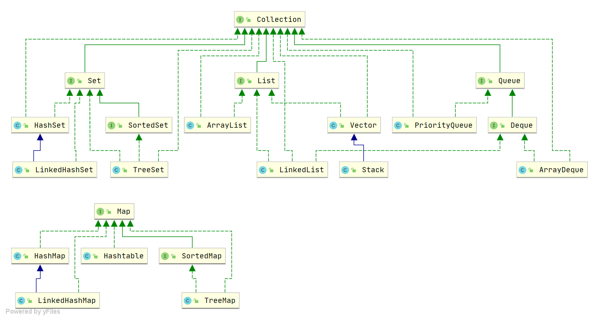

# 1.集合概述

## 1.1 Java 集合概览

Java 集合， 也叫作容器，主要是由两大接口派生而来：
一个是 `Collection`接口，主要用于存放单一元素；另一个是 `Map` 接口，主要用于存放键值对。
对于`Collection` 接口，下面又有三个主要的子接口：`List`、`Set` 和 `Queue`。

Java 集合框架如下图所示：



注：图中只列举了主要的继承派生关系，并没有列举所有关系。比方省略了`AbstractList`, 
`NavigableSet`等抽象类以及其他的一些辅助类，如想深入了解，可自行查看源码。

## 1.2 说说 List, Set, Queue, Map 四者的区别？

- `List`(对付顺序的好帮手): 存储的元素是有序的、可重复的。
- `Set`(注重独一无二的性质): 存储的元素不可重复的。
- `Queue`(实现排队功能的叫号机): 按特定的排队规则来确定先后顺序，存储的元素是有序的、可重复的。
- `Map`(用 key 来搜索的专家): 使用键值对（key-value）存储，类似于数学上的函数 y=f(x)，"x" 代表 key，"y" 代表 value，
           key 是无序的、不可重复的，value 是无序的、可重复的，每个键最多映射到一个值。

## 1.3 集合框架底层数据结构总结

先来看一下 `Collection` 接口下面的集合。

### 1.3.1 List

- `ArrayList`：`Object[]` 数组
- `Vector`：`Object[]` 数组
- `LinkedList`：双向链表(JDK1.6 之前为循环链表，JDK1.7 取消了循环)

### 1.3.2 Set

- `HashSet`(无序，唯一): 基于 `HashMap` 实现的，底层采用 `HashMap` 来保存元素
- `LinkedHashSet`: `LinkedHashSet` 是 `HashSet` 的子类， 并且其内部是通过 `LinkedHashMap` 来实现的。
             有点类似于我们之前说的 `LinkedHashMap` 其内部是基于 `HashMap` 实现一样，不过还是有一点点区别的
- `TreeSet`(有序，唯一): 红黑树(自平衡的排序二叉树)

### 1.3.3 Queue

- `PriorityQueue`: `Object[]` 数组来实现二叉堆
- `ArrayQueue`: `Object[]` 数组 + 双指针

再来看看 `Map` 接口下面的集合。

### 1.3.4 Map

- `HashMap`：JDK1.8 之前 `HashMap` 由数组+链表组成的，数组是 `HashMap` 的主体，
         链表则是主要为了解决哈希冲突而存在的（“拉链法”解决冲突）。
      JDK1.8 以后在解决哈希冲突时有了较大的变化，当链表长度大于阈值（默认为 8）
     （将链表转换成红黑树前会判断，如果当前数组的长度小于 64，那么会选择先进行数组扩容，而不是转换为红黑树）时，
      将链表转化为红黑树，以减少搜索时间
- `LinkedHashMap`：`LinkedHashMap` 继承自 `HashMap`，所以它的底层仍然是基于拉链式散列结构即由数组和链表或红黑树组成。
          另外，`LinkedHashMap` 在上面结构的基础上，增加了一条双向链表，使得上面的结构可以保持键值对的插入顺序。同
          时通过对链表进行相应的操作，实现了访问顺序相关逻辑。
           详细可以查看：[《LinkedHashMap 源码详细分析（JDK1.8）》](https://www.imooc.com/article/22931)
- `Hashtable`：数组+链表组成的，数组是 `Hashtable` 的主体，链表则是主要为了解决哈希冲突而存在的
- `TreeMap`：红黑树（自平衡的排序二叉树）

## 1.4 如何选用集合?

我们主要根据集合的特点来选择合适的集合。比如：

- 我们需要根据键值获取到元素值时就选用 `Map` 接口下的集合，需要排序时选择 `TreeMap`,
     不需要排序时就选择 `HashMap`,需要保证线程安全就选用 `ConcurrentHashMap`。
- 我们只需要存放元素值时，就选择实现`Collection` 接口的集合，
     需要保证元素唯一时选择实现 `Set` 接口的集合比如 `TreeSet` 或 `HashSet`，不
     需要就选择实现 `List` 接口的比如 `ArrayList` 或 `LinkedList`，然后再根据实现这些接口的集合的特点来选用。

## 1.5 为什么要使用集合？

当我们需要存储一组类型相同的数据时，数组是最常用且最基本的容器之一。但是，使用数组存储对象存在一些不足之处，
因为在实际开发中，存储的数据类型多种多样且数量不确定。这时，Java 集合就派上用场了。
与数组相比，Java 集合提供了更灵活、更有效的方法来存储多个数据对象。Java 集合框架中的各种集合类和接口可以存储不同类型和数量的对象，
同时还具有多样化的操作方式。相较于数组，Java 集合的优势在于它们的大小可变、支持泛型、具有内建算法等。

总的来说，Java 集合提高了[数据的存储和处理灵活性]，可以更好地适应现代软件开发中多样化的数据需求，并支持高质量的代码编写。


# 2 集合使用注意事项

## 2.1 集合判空 使用isEmpty()

《阿里巴巴 Java 开发手册》的描述如下：

> **判断所有集合内部的元素是否为空，使用 `isEmpty()` 方法，而不是 `size()==0` 的方式。**

这是因为 `isEmpty()` 方法的可读性更好，并且时间复杂度为 O(1)。

绝大部分我们使用的集合的 `size()` 方法的时间复杂度也是 O(1)，不过，也有很多复杂度不是 O(1) 的，
比如 `java.util.concurrent` 包下的某些集合（`ConcurrentLinkedQueue`、`ConcurrentHashMap`...）。

下面是 `ConcurrentHashMap` 的 `size()` 方法和 `isEmpty()` 方法的源码。

```java
public int size() {
    long n = sumCount();
    return ((n < 0L) ? 0 :
            (n > (long)Integer.MAX_VALUE) ? Integer.MAX_VALUE :
            (int)n);
}
final long sumCount() {
    CounterCell[] as = counterCells; CounterCell a;
    long sum = baseCount;
    if (as != null) {
        for (int i = 0; i < as.length; ++i) {
            if ((a = as[i]) != null)
                sum += a.value;
        }
    }
    return sum;
}
public boolean isEmpty() {
    return sumCount() <= 0L; // ignore transient negative values
}
```

## 2.2 集合转 Map 注意value判null

主要原因是stream()中的toMap方法[会首先调用 `Objects.requireNonNull()` 方法判断 value 是否为空]

《阿里巴巴 Java 开发手册》的描述如下：

> **在使用 `java.util.stream.Collectors` 类的 `toMap()` 方法转为 `Map` 集合时，
> 一定要注意当 value 为 null 时会抛 NPE 异常。**

```java
class Person {
    private String name;
    private String phoneNumber;
     // getters and setters
}

List<Person> bookList = new ArrayList<>();
bookList.add(new Person("jack","18163138123"));
bookList.add(new Person("martin",null));
// 空指针异常
bookList.stream().collect(Collectors.toMap(Person::getName, Person::getPhoneNumber));
```

下面我们来解释一下原因。

首先，我们来看 `java.util.stream.Collectors` 类的 `toMap()` 方法 ，
可以看到其内部调用了 `Map` 接口的 `merge()` 方法。

```java
public static <T, K, U, M extends Map<K, U>>
Collector<T, ?, M> toMap(Function<? super T, ? extends K> keyMapper,
                            Function<? super T, ? extends U> valueMapper,
                            BinaryOperator<U> mergeFunction,
                            Supplier<M> mapSupplier) {
    BiConsumer<M, T> accumulator
            = (map, element) -> map.merge(keyMapper.apply(element),
                                          valueMapper.apply(element), mergeFunction);
    return new CollectorImpl<>(mapSupplier, accumulator, mapMerger(mergeFunction), CH_ID);
}
```

`Map` 接口的 `merge()` 方法如下，这个方法是接口中的默认实现。

> 如果你还不了解 Java 8 新特性的话，请看这篇文章：
> [《Java8 新特性总结》](https://mp.weixin.qq.com/s/ojyl7B6PiHaTWADqmUq2rw) 。

```java
default V merge(K key, V value,
        BiFunction<? super V, ? super V, ? extends V> remappingFunction) {
    Objects.requireNonNull(remappingFunction);
    Objects.requireNonNull(value);
    V oldValue = get(key);
    V newValue = (oldValue == null) ? value :
               remappingFunction.apply(oldValue, value);
    if(newValue == null) {
        remove(key);
    } else {
        put(key, newValue);
    }
    return newValue;
}
```

`merge()` 方法会先调用 `Objects.requireNonNull()` 方法判断 value 是否为空。

```java
public static <T> T requireNonNull(T obj) {
    if (obj == null)
        throw new NullPointerException();
    return obj;
}
```

## 2.3 集合遍历 forEach中不要做增删操作

《阿里巴巴 Java 开发手册》的描述如下：

> **不要在 foreach 循环里进行元素的 `remove/add` 操作。remove 元素请使用 `Iterator` 方式，
> 如果并发操作，需要对 `Iterator` 对象加锁。**

通过反编译你会发现 foreach 语法底层其实还是依赖 `Iterator` 。不过， 
`remove/add` 操作直接调用的是集合自己的方法，而不是 `Iterator` 的 `remove/add`方法

这就导致 `Iterator` 莫名其妙地发现自己有元素被 `remove/add` ，然后，
它就会抛出一个 `ConcurrentModificationException` 来提示用户发生了并发修改异常。
这就是单线程状态下产生的 **fail-fast 机制**。

> **fail-fast 机制**：多个线程对 fail-fast 集合进行修改的时候，
> 可能会抛出`ConcurrentModificationException`。 即使是单线程下也有可能会出现这种情况，上面已经提到过。
>
> 相关阅读：[什么是 fail-fast](https://www.cnblogs.com/54chensongxia/p/12470446.html) 。

Java8 开始，可以使用 `Collection#removeIf()`方法删除满足特定条件的元素,如

```java
List<Integer> list = new ArrayList<>();
for (int i = 1; i <= 10; ++i) {
    list.add(i);
}
list.removeIf(filter -> filter % 2 == 0); /* 删除list中的所有偶数 */
System.out.println(list); /* [1, 3, 5, 7, 9] */
```

除了上面介绍的直接使用 `Iterator` 进行遍历操作之外，你还可以：

- 使用普通的 for 循环
- 使用 fail-safe 的集合类。`java.util`包下面的所有的集合类都是 fail-fast 的，
   而`java.util.concurrent`包下面的所有的类都是 fail-safe 的。
- ......

## 2.4 集合去重

《阿里巴巴 Java 开发手册》的描述如下：

> **可以利用 `Set` 元素唯一的特性，可以快速对一个集合进行去重操作，
> 避免使用 `List` 的 `contains()` 进行遍历去重或者判断包含操作。**

这里我们以 `HashSet` 和 `ArrayList` 为例说明。

```java
// Set 去重代码示例
public static <T> Set<T> removeDuplicateBySet(List<T> data) {

    if (CollectionUtils.isEmpty(data)) {
        return new HashSet<>();
    }
    return new HashSet<>(data);
}

// List 去重代码示例
public static <T> List<T> removeDuplicateByList(List<T> data) {

    if (CollectionUtils.isEmpty(data)) {
        return new ArrayList<>();

    }
    List<T> result = new ArrayList<>(data.size());
    for (T current : data) {
        if (!result.contains(current)) {
            result.add(current);
        }
    }
    return result;
}

```

两者的核心差别在于 `contains()` 方法的实现。

`HashSet` 的 `contains()` 方法底部依赖的 `HashMap` 的 `containsKey()` 方法，
时间复杂度接近于 O（1）（没有出现哈希冲突的时候为 O（1））。

```java
private transient HashMap<E,Object> map;
public boolean contains(Object o) {
    return map.containsKey(o);
}
```

我们有 N 个元素插入进 Set 中，那时间复杂度就接近是 O (n)。

`ArrayList` 的 `contains()` 方法是通过遍历所有元素的方法来做的，时间复杂度接近是 O(n)。

```java
public boolean contains(Object o) {
    return indexOf(o) >= 0;
}
public int indexOf(Object o) {
    if (o == null) {
        for (int i = 0; i < size; i++)
            if (elementData[i]==null)
                return i;
    } else {
        for (int i = 0; i < size; i++)
            if (o.equals(elementData[i]))
                return i;
    }
    return -1;
}

```

## 2.5 集合转数组

《阿里巴巴 Java 开发手册》的描述如下：

> **使用集合转数组的方法，必须使用[集合的 `toArray(T[] array)`，传入的是类型完全一致、长度为 0 的空数组]。**

`toArray(T[] array)` 方法的参数是一个泛型数组，如果 `toArray` 方法中没有传递任何参数的话返回的是 `Object`类型数组。

```java
String [] s= new String[]{
    "dog", "lazy", "a", "over", "jumps", "fox", "brown", "quick", "A"
};
List<String> list = Arrays.asList(s);
Collections.reverse(list);
//没有指定类型的话会报错
s=list.toArray(new String[0]);
```

由于 JVM 优化，`new String[0]`作为`Collection.toArray()`方法的参数现在使用更好，
`new String[0]`就是[起一个模板的作用，指定了返回数组的类型，0 是为了节省空间]，
因为它只是为了说明返回的类型。详见：<https://shipilev.net/blog/2016/arrays-wisdom-ancients/>

## 2.6 数组转集合

《阿里巴巴 Java 开发手册》的描述如下：

> **使用工具类 `Arrays.asList()` 把数组转换成集合时，不能使用其修改集合相关的方法， 
> 它的 `add/remove/clear` 方法会抛出 `UnsupportedOperationException` 异常。**

我在之前的一个项目中就遇到一个类似的坑。

`Arrays.asList()`在平时开发中还是比较常见的，我们可以使用它将一个数组转换为一个 `List` 集合。

```java
String[] myArray = {"Apple", "Banana", "Orange"};
List<String> myList = Arrays.asList(myArray);
//上面两个语句等价于下面一条语句
List<String> myList = Arrays.asList("Apple","Banana", "Orange");
```

JDK 源码对于这个方法的说明：

```java
/**
  *返回由指定数组支持的固定大小的列表。此方法作为基于数组和基于集合的API之间的桥梁，
  * 与 Collection.toArray()结合使用。返回的List是可序列化并实现RandomAccess接口。
  */
public static <T> List<T> asList(T... a) {
    return new ArrayList<>(a);
}
```

下面我们来总结一下使用注意事项。

**1、`Arrays.asList()`是泛型方法，传递的[数组必须是对象数组，而不是基本类型]。**

```java
int[] myArray = {1, 2, 3};
List myList = Arrays.asList(myArray);
System.out.println(myList.size());//1
System.out.println(myList.get(0));//数组地址值
System.out.println(myList.get(1));//报错：ArrayIndexOutOfBoundsException
int[] array = (int[]) myList.get(0);
System.out.println(array[0]);//1
```

当传入一个原生数据类型数组时，`Arrays.asList()` 的真正得到的参数就不是数组中的元素，而是数组对象本身！
此时 `List` 的唯一元素就是这个数组，这也就解释了上面的代码。

我们使用包装类型数组就可以解决这个问题。

```java
Integer[] myArray = {1, 2, 3};
```

**2、使用集合的修改方法: `add()`、`remove()`、`clear()`会抛出异常。**

```java
List myList = Arrays.asList(1, 2, 3);
myList.add(4);//运行时报错：UnsupportedOperationException
myList.remove(1);//运行时报错：UnsupportedOperationException
myList.clear();//运行时报错：UnsupportedOperationException
```

`Arrays.asList()` 方法返回的并不是 `java.util.ArrayList` ，而是 `java.util.Arrays` 的一个内部类,
这个[内部类并没有实现集合的修改方法或者说并没有重写这些方法]。

```java
List myList = Arrays.asList(1, 2, 3);
System.out.println(myList.getClass());//class java.util.Arrays$ArrayList
```

下图是 `java.util.Arrays$ArrayList` 的简易源码，我们可以看到这个类重写的方法有哪些。

```java
  private static class ArrayList<E> extends AbstractList<E>
        implements RandomAccess, java.io.Serializable
    {
        ...

        @Override
        public E get(int index) {
          ...
        }

        @Override
        public E set(int index, E element) {
          ...
        }

        @Override
        public int indexOf(Object o) {
          ...
        }

        @Override
        public boolean contains(Object o) {
           ...
        }

        @Override
        public void forEach(Consumer<? super E> action) {
          ...
        }

        @Override
        public void replaceAll(UnaryOperator<E> operator) {
          ...
        }

        @Override
        public void sort(Comparator<? super E> c) {
          ...
        }
    }
```

我们再看一下`java.util.AbstractList`的 `add/remove/clear` 方法就知道
为什么会抛出 `UnsupportedOperationException` 了。

```java
public E remove(int index) {
    throw new UnsupportedOperationException();
}
public boolean add(E e) {
    add(size(), e);
    return true;
}
public void add(int index, E element) {
    throw new UnsupportedOperationException();
}

public void clear() {
    removeRange(0, size());
}
protected void removeRange(int fromIndex, int toIndex) {
    ListIterator<E> it = listIterator(fromIndex);
    for (int i=0, n=toIndex-fromIndex; i<n; i++) {
        it.next();
        it.remove();
    }
}
```

**那我们如何正确的将数组转换为 `ArrayList` ?**

1、手动实现工具类

```java
//JDK1.5+
static <T> List<T> arrayToList(final T[] array) {
  final List<T> l = new ArrayList<T>(array.length);

  for (final T s : array) {
    l.add(s);
  }
  return l;
}


Integer [] myArray = { 1, 2, 3 };
System.out.println(arrayToList(myArray).getClass());//class java.util.ArrayList
```

2、最简便的方法

```java
List list = new ArrayList<>(Arrays.asList("a", "b", "c"))
```

3、[使用 Java8 的 `Stream`(推荐)]

```java
Integer [] myArray = { 1, 2, 3 };
List myList = Arrays.stream(myArray).collect(Collectors.toList());
//基本类型也可以实现转换（依赖boxed的装箱操作）
int [] myArray2 = { 1, 2, 3 };
List myList = Arrays.stream(myArray2).boxed().collect(Collectors.toList());
```

4、使用 Guava

对于不可变集合，你可以使用[`ImmutableList`]
(https://github.com/google/guava/blob/master/guava/src/com/google/common/collect/ImmutableList.java)类及其[`of()`](https://github.com/google/guava/blob/master/guava/src/com/google/common/collect/ImmutableList.java#L101)与[`copyOf()`](https://github.com/google/guava/blob/master/guava/src/com/google/common/collect/ImmutableList.java#L225)工厂方法：（参数不能为空）

```java
List<String> il = ImmutableList.of("string", "elements");  // from varargs
List<String> il = ImmutableList.copyOf(aStringArray);      // from array
```

对于可变集合，你可以使用[`Lists`](https://github.com/google/guava/blob/master/guava/src/com/google/common/collect/Lists.java)类及其[`newArrayList()`](https://github.com/google/guava/blob/master/guava/src/com/google/common/collect/Lists.java#L87)工厂方法：

```java
List<String> l1 = Lists.newArrayList(anotherListOrCollection);    // from collection
List<String> l2 = Lists.newArrayList(aStringArray);               // from array
List<String> l3 = Lists.newArrayList("or", "string", "elements"); // from varargs
```

5、使用 Apache Commons Collections

```java
List<String> list = new ArrayList<String>();
CollectionUtils.addAll(list, str);
```

6、 使用 Java9 的 `List.of()`方法

```java
Integer[] array = {1, 2, 3};
List<Integer> list = List.of(array);
```
