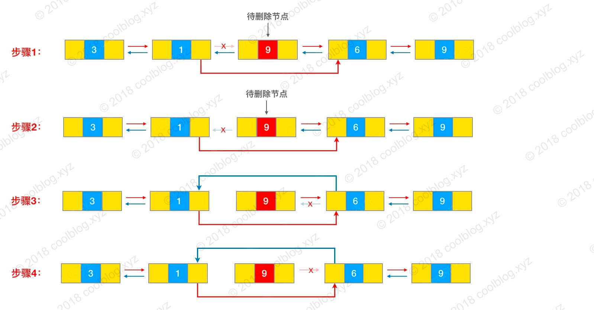
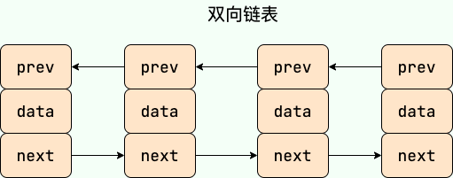
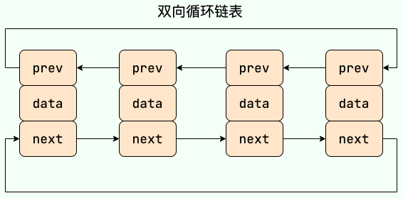
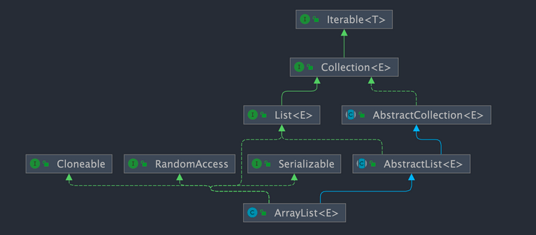
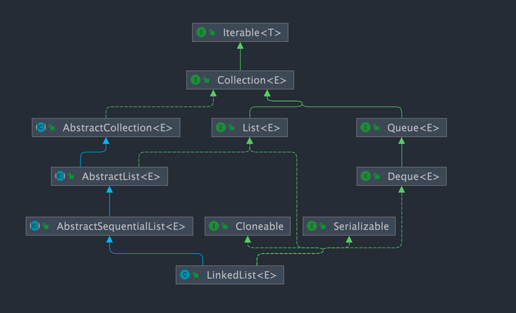

# 2.List 基础

## 1.1 ArrayList 和 Array（数组）的区别？

`ArrayList` 内部[基于动态数组]实现，比 `Array`（静态数组） 使用起来更加灵活：

- `ArrayList`会根据实际存储的元素[动态地扩容或缩容]，
      而 `Array` 被创建之后就不能改变它的长度了。
- `ArrayList` 允许你使用泛型来确保类型安全，`Array` 则不可以。
- `ArrayList` 中只能存储对象。对于基本类型数据，需要使用其对应的包装类（如 Integer、Double 等）。
   `Array` 可以直接存储基本类型数据，也可以存储对象。
- `ArrayList` 支持插入、删除、遍历等常见操作，并且提供了丰富的 API 操作方法，比如 `add()`、`remove()`等。
         `Array` 只是一个固定长度的数组，只能[按照下标访问其中的元素]，不具备动态添加、删除元素的能力。
- `ArrayList`创建时不需要指定大小，而`Array`创建时必须指定大小。

下面是二者使用的简单对比：

`Array`：

```java
 // 初始化一个 String 类型的数组
 String[] stringArr = new String[]{"hello", "world", "!"};
 // 修改数组元素的值
 stringArr[0] = "goodbye";
 System.out.println(Arrays.toString(stringArr));// [goodbye, world, !]
 // 删除数组中的元素，需要手动移动后面的元素
 for (int i = 0; i < stringArr.length - 1; i++) {
     stringArr[i] = stringArr[i + 1];
 }
 stringArr[stringArr.length - 1] = null;
 System.out.println(Arrays.toString(stringArr));// [world, !, null]
```

`ArrayList` ：

```java
// 初始化一个 String 类型的 ArrayList
 ArrayList<String> stringList = new ArrayList<>(Arrays.asList("hello", "world", "!"));
// 添加元素到 ArrayList 中
 stringList.add("goodbye");
 System.out.println(stringList);// [hello, world, !, goodbye]
 // 修改 ArrayList 中的元素
 stringList.set(0, "hi");
 System.out.println(stringList);// [hi, world, !, goodbye]
 // 删除 ArrayList 中的元素
 stringList.remove(0);
 System.out.println(stringList); // [world, !, goodbye]
```

## 1.2 ArrayList 和 Vector 的区别?（了解即可）

- `ArrayList` 是 `List` 的主要实现类，底层使用 `Object[]`存储，适用于频繁的查找工作，线程不安全 。
- `Vector` 是 `List` 的古老实现类，底层使用`Object[]` 存储，线程安全。

## 1.3 Vector 和 Stack 的区别?（了解即可）

- `Vector` 和 `Stack` 两者都是线程安全的，都是使用 `synchronized` 关键字进行同步处理。
- `Stack` 继承自 `Vector`，是一个后进先出的栈，而 `Vector` 是一个列表。

随着 Java 并发编程的发展，`Vector` 和 `Stack` 已经被淘汰，推荐使用并发集合类
（例如 `ConcurrentHashMap`、`CopyOnWriteArrayList` 等）或者手动实现线程安全的方法来提供安全的多线程操作支持。

## 1.4 ArrayList 可以添加 null 值吗？

`ArrayList` 中[可存储任何类型的对象]，包括 `null` 值。不过，不建议向`ArrayList` 中添加 `null` 值，
`null` 值无意义，会让代码[难以维护比如忘记做判空处理就会导致空指针异常]

示例代码：

```java
ArrayList<String> listOfStrings = new ArrayList<>();
listOfStrings.add(null);
listOfStrings.add("java");
System.out.println(listOfStrings);
```

输出：

```
[null, java]
```

## 1.5  ArrayList 插入和删除元素的时间复杂度？

对于插入：

- 头部插入：由于需要将所有元素都依次向后移动一个位置，因此时间复杂度是 O(n)。
- 尾部插入：当 `ArrayList` 的容量未达到极限时，往列表末尾插入元素的时间复杂度是 O(1),因为它只需要在数组末尾添加一个元素即可；
    当容量已达到极限并且需要扩容时，则[需要执行一次 O(n) 的操作将原数组复制到新的更大的数组中]，
     然后再执行 O(1) 的操作添加元素。
- 指定位置插入：需要将目标位置之后的所有元素都向后移动一个位置，然后再把新元素放入指定位置
            。这个过程需要移动平均 n/2 个元素，因此时间复杂度为 O(n)。

对于删除：

- 头部删除：由于需要将所有元素依次向前移动一个位置，因此时间复杂度是 O(n)。
- 尾部删除：当删除的元素位于列表末尾时，时间复杂度为 O(1)。
- 指定位置删除：需要将目标元素之后的所有元素向前移动一个位置以填补被删除的空白位置，
             因此需要移动平均 n/2 个元素，时间复杂度为 O(n)。
对于获取：
- O(1) 级别的时间复杂度

## 1.6 LinkedList 插入和删除元素的时间复杂度？

- 头部插入/删除：只需要修改头结点的指针即可完成插入/删除操作，因此时间复杂度为 O(1)。
- 尾部插入/删除：只需要修改尾结点的指针即可完成插入/删除操作，因此时间复杂度为 O(1)。
- 指定位置插入/删除：需要先移动到指定位置，再修改指定节点的指针完成插入/删除，因此需要移动平均 n/2 个元素，
         时间复杂度为 O(n)。

这里简单列举一个例子：假如我们要删除节点9 的话，需要先遍历链表找到该节点。然后，再执行相应节点指针指向的更改，
具体的源码可以参考：[LinkedList 源码分析](./linkedlist-source-code.md) 。



## 1.7 LinkedList 为什么不能实现 RandomAccess 接口？

`RandomAccess` 是一个标记接口，用来表明实现该接口的类支持随机访问（即可以通过索引快速访问元素）。
由于 `LinkedList` 底层数据结构是[链表]，内存地址不连续，只能通过指针来定位，不支持随机快速访问，
所以不能实现 `RandomAccess` 接口。

## 1.8 ArrayList 与 LinkedList 区别?

- **是否保证线程安全：** `ArrayList` 和 `LinkedList` 都是不同步的，也就是不保证线程安全；
- **底层数据结构：** `ArrayList` 底层使用的是 **`Object` 数组**；`LinkedList` 底层使用的是 **双向链表** 数据结构
         （JDK1.6 之前为循环链表，JDK1.7 取消了循环。注意双向链表和双向循环链表的区别，下面有介绍到！）
- **插入和删除是否受元素位置的影响：**
    - `ArrayList` 采用数组存储，所以插入和删除元素的时间复杂度受元素位置的影响。
      比如：执行`add(E e)`方法的时候， `ArrayList` 会默认在将指定的元素追加到此列表的末尾，这种情况时间复杂度就是 O(1)。
      但是如果要在指定位置 i 插入和删除元素的话（`add(int index, E element)`），时间复杂度就为 O(n)。
      因为在进行上述操作的时候集合中第 i 和第 i 个元素之后的(n-i)个元素都要执行向后位/向前移一位的操作。
    - `LinkedList` 采用链表存储，所以在头尾插入或者删除元素不受元素位置的影响
      （`add(E e)`、`addFirst(E e)`、`addLast(E e)`、`removeFirst()`、 `removeLast()`），时间复杂度为 O(1)，
       如果是要在指定位置 `i` 插入和删除元素的话（`add(int index, E element)`，`remove(Object o)`,`remove(int index)`）， 
       时间复杂度为 O(n) ，因为需要先移动到指定位置再插入和删除。
  
- **是否支持快速随机访问：** `LinkedList` 不支持高效的随机元素访问，而 `ArrayList`（实现了 `RandomAccess` 接口） 支持。
      快速随机访问就是通过元素的序号快速获取元素对象(对应于`get(int index)`方法)。
- **内存空间占用：** `ArrayList` 的空间浪费主要体现在在 list 列表的结尾会预留一定的容量空间，
               而 LinkedList 的空间花费则体现在它的每一个元素都需要消耗比 ArrayList 更多的空间（因为要存放直接后继和直接前驱以及数据）。

我们在项目中一般是不会使用到 `LinkedList` 的，需要用到 `LinkedList` 的场景几乎都可以使用 `ArrayList` 来代替，
并且，性能通常会更好！就连 `LinkedList` 的作者约书亚 · 布洛克（Josh Bloch）自己都说从来不会使用 `LinkedList` 。

另外，不要下意识地认为 `LinkedList` 作为链表就最适合元素增删的场景。我在上面也说了，
`LinkedList` 仅仅在头尾插入或者删除元素的时候时间复杂度近似 O(1)，其他情况增删元素的平均时间复杂度都是 O(n) 。

## 1.9 补充内容: 双向链表和双向循环链表

**双向链表：** 包含两个指针，一个 prev 指向前一个节点，一个 next 指向后一个节点。



**双向循环链表：** 最后一个节点的 next 指向 head，而 head 的 prev 指向最后一个节点，构成一个环。



## 1.10 补充内容:RandomAccess 接口

```java
public interface RandomAccess {
}
```

查看源码我们发现实际上 `RandomAccess` 接口中什么都没有定义。
所以，在我看来 `RandomAccess` 接口不过是一个标识罢了。标识什么？ 标识实现这个接口的类具有随机访问功能。

在 `binarySearch（)` 方法中，它要判断传入的 list 是否 `RandomAccess` 的实例，
如果是，调用`indexedBinarySearch()`方法，如果不是，那么调用`iteratorBinarySearch()`方法

```java
    public static <T>
    int binarySearch(List<? extends Comparable<? super T>> list, T key) {
        if (list instanceof RandomAccess || list.size()<BINARYSEARCH_THRESHOLD)
            return Collections.indexedBinarySearch(list, key);
        else
            return Collections.iteratorBinarySearch(list, key);
    }
```

`ArrayList` 实现了 `RandomAccess` 接口， 而 `LinkedList` 没有实现。为什么呢？
我觉得还是和底层数据结构有关！`ArrayList` 底层是数组，而 `LinkedList` 底层是链表。
数组天然支持随机访问，时间复杂度为 O(1)，所以称为快速随机访问。
链表需要遍历到特定位置才能访问特定位置的元素，时间复杂度为 O(n)，所以不支持快速随机访问。
`ArrayList` 实现了 `RandomAccess` 接口，就表明了他具有快速随机访问功能。 
`RandomAccess` 接口只是标识，并不是说 `ArrayList` 实现 `RandomAccess` 接口才具有快速随机访问功能的！


## 1.11 Arraylist 与 LinkedList 区别?

- **是否保证线程安全：**
  - `ArrayList` 和 `LinkedList` 都是不同步的，也就是不保证线程安全；
- **底层数据结构：
  - ** `ArrayList` 底层使用的是 **`Object` 数组**；
  - `LinkedList` 底层使用的是 **双向链表** 数据结构（JDK1.6 之前为循环链表，JDK1.7 取消了循环。注意双向链表和双向循环链表的区别）
- **插入和删除是否受元素位置的影响：**
    - `ArrayList` 采用数组存储，所以插入和删除元素的时间复杂度受元素位置的影响。
      - 比如：执行`add(E e)`方法的时候， `ArrayList` 会默认在将指定的元素追加到此列表的末尾，这种情况时间复杂度就是 O(1)。
        但是如果要在指定位置 i 插入和删除元素的话（`add(int index, E element)`），时间复杂度就为 O(n)。
        因为在进行上述操作的时候集合中第 i 和第 i 个元素之后的(n-i)个元素都要执行向后位/向前移一位的操作。
    - `LinkedList` 采用链表存储，所以在头尾插入或者删除元素不受元素位置的影响
      - （`add(E e)`、`addFirst(E e)`、`addLast(E e)`、`removeFirst()`、 `removeLast()`），时间复杂度为 O(1)，
      - 如果是要在指定位置 `i` 插入和删除元素的话（`add(int index, E element)`，`remove(Object o)`,`remove(int index)`）， 
         时间复杂度为 O(n) ，因为需要先移动到指定位置再插入和删除。

- **是否支持快速随机访问：** 
  - `LinkedList` 不支持高效的随机元素访问，
  - `ArrayList`（实现了 `RandomAccess` 接口）支持快速随机访问就是通过元素的序号快速获取元素对象(对应于`get(int index)`方法)。
- **内存空间占用：**
  - `ArrayList` 的空间浪费主要体现在在 list 列表的结尾会预留一定的容量空间，
  - LinkedList 的空间花费则体现在它的每一个元素都需要消耗比 ArrayList 更多的空间（因为要存放直接后继和直接前驱以及数据）。


# 2 ArrayList 源码分析

##  2.1 ArrayList 简介

`ArrayList` 的底层是数组队列，相当于动态数组。与 Java 中的数组相比，它的容量能动态增长。在添加大量元素前，
应用程序可以使用`ensureCapacity`操作来增加 `ArrayList` 实例的容量。这可以减少递增式再分配的数量。

`ArrayList` 继承于 `AbstractList` ，实现了 `List`, `RandomAccess`, `Cloneable`, `java.io.Serializable` 这些接口。

```java

public class ArrayList<E> extends AbstractList<E>
        implements List<E>, RandomAccess, Cloneable, java.io.Serializable{

  }
```

- `List` : 表明它是一个列表，支持[添加、删除、查找]等操作，并且可以通过下标进行访问。
- `RandomAccess` ：这是一个标志接口，表明实现这个接口的 `List` 集合是支持 **快速随机访问** 的。
                  在 `ArrayList` 中，我们即可以[通过元素的序号快速获取元素对象，这就是快速随机访问]
- `Cloneable` ：表明它具有拷贝能力，可以进行[深拷贝或浅拷贝]操作。
- `Serializable` : 表明它可以进行[序列化]操作，也就是可以将对象转换为字节流进行持久化存储或网络传输，非常方便。



## 2.2 ArrayList 核心源码解读

这里以 JDK1.8为例，分析一下 `ArrayList` 的底层源码。

```java
public class ArrayList<E> extends AbstractList<E>
        implements List<E>, RandomAccess, Cloneable, java.io.Serializable {
    private static final long serialVersionUID = 8683452581122892189L;

    /**
     * 默认初始容量大小
     */
    private static final int DEFAULT_CAPACITY = 10;

    /**
     * 空数组（用于空实例）。
     */
    private static final Object[] EMPTY_ELEMENTDATA = {};

    //用于默认大小空实例的共享空数组实例。
    //我们把它从EMPTY_ELEMENTDATA数组中区分出来，以知道在添加第一个元素时容量需要增加多少。
    private static final Object[] DEFAULTCAPACITY_EMPTY_ELEMENTDATA = {};

    /**
     * 保存ArrayList数据的数组
     */
    transient Object[] elementData; // non-private to simplify nested class access

    /**
     * ArrayList 所包含的元素个数
     */
    private int size;

    /**
     * 带初始容量参数的构造函数（用户可以在创建ArrayList对象时自己指定集合的初始大小）
     */
    public ArrayList(int initialCapacity) {
        if (initialCapacity > 0) {
            //如果传入的参数大于0，创建initialCapacity大小的数组
            this.elementData = new Object[initialCapacity];
        } else if (initialCapacity == 0) {
            //如果传入的参数等于0，创建空数组
            this.elementData = EMPTY_ELEMENTDATA;
        } else {
            //其他情况，抛出异常
            throw new IllegalArgumentException("Illegal Capacity: " +
                    initialCapacity);
        }
    }

    /**
     * 默认无参构造函数
     * DEFAULTCAPACITY_EMPTY_ELEMENTDATA 为0.初始化为10，也就是说初始其实是空数组 当添加第一个元素的时候数组容量才变成10
     */
    public ArrayList() {
        this.elementData = DEFAULTCAPACITY_EMPTY_ELEMENTDATA;
    }

    /**
     * 构造一个包含指定集合的元素的列表，按照它们由集合的迭代器返回的顺序。
     */
    public ArrayList(Collection<? extends E> c) {
        //将指定集合转换为数组
        elementData = c.toArray();
        //如果elementData数组的长度不为0
        if ((size = elementData.length) != 0) {
            // 如果elementData不是Object类型数据（c.toArray可能返回的不是Object类型的数组所以加上下面的语句用于判断）
            if (elementData.getClass() != Object[].class)
                //将原来不是Object类型的elementData数组的内容，赋值给新的Object类型的elementData数组
                elementData = Arrays.copyOf(elementData, size, Object[].class);
        } else {
            // 其他情况，用空数组代替
            this.elementData = EMPTY_ELEMENTDATA;
        }
    }

    /**
     * 修改这个ArrayList实例的容量是列表的当前大小。 应用程序可以使用此操作来最小化ArrayList实例的存储。
     */
    public void trimToSize() {
        modCount++;
        if (size < elementData.length) {
            elementData = (size == 0)
                    ? EMPTY_ELEMENTDATA
                    : Arrays.copyOf(elementData, size);
        }
    }
//下面是ArrayList的扩容机制
//ArrayList的扩容机制提高了性能，如果每次只扩充一个，
//那么频繁的插入会导致频繁的拷贝，降低性能，而ArrayList的扩容机制避免了这种情况。

    /**
     * 如有必要，增加此ArrayList实例的容量，以确保它至少能容纳元素的数量
     *
     * @param minCapacity 所需的最小容量
     */
    public void ensureCapacity(int minCapacity) {
        //如果是true，minExpand的值为0，如果是false,minExpand的值为10
        int minExpand = (elementData != DEFAULTCAPACITY_EMPTY_ELEMENTDATA)
                // any size if not default element table
                ? 0
                // larger than default for default empty table. It's already
                // supposed to be at default size.
                : DEFAULT_CAPACITY;
        //如果最小容量大于已有的最大容量
        if (minCapacity > minExpand) {
            ensureExplicitCapacity(minCapacity);
        }
    }

    // 根据给定的最小容量和当前数组元素来计算所需容量。
    private static int calculateCapacity(Object[] elementData, int minCapacity) {
        // 如果当前数组元素为空数组（初始情况），返回默认容量和最小容量中的较大值作为所需容量
        if (elementData == DEFAULTCAPACITY_EMPTY_ELEMENTDATA) {
            return Math.max(DEFAULT_CAPACITY, minCapacity);
        }
        // 否则直接返回最小容量
        return minCapacity;
    }

    // 确保内部容量达到指定的最小容量。
    private void ensureCapacityInternal(int minCapacity) {
        ensureExplicitCapacity(calculateCapacity(elementData, minCapacity));
    }

    //判断是否需要扩容
    private void ensureExplicitCapacity(int minCapacity) {
        modCount++;
        // overflow-conscious code
        if (minCapacity - elementData.length > 0)
            //调用grow方法进行扩容，调用此方法代表已经开始扩容了
            grow(minCapacity);
    }

    /**
     * 要分配的最大数组大小
     */
    private static final int MAX_ARRAY_SIZE = Integer.MAX_VALUE - 8;

    /**
     * ArrayList扩容的核心方法。
     */
    private void grow(int minCapacity) {
        // oldCapacity为旧容量，newCapacity为新容量
        int oldCapacity = elementData.length;
        //将oldCapacity 右移一位，其效果相当于oldCapacity /2，
        //我们知道位运算的速度远远快于整除运算，整句运算式的结果就是将新容量更新为旧容量的1.5倍，
        int newCapacity = oldCapacity + (oldCapacity >> 1);
        //然后检查新容量是否大于最小需要容量，若还是小于最小需要容量，那么就把最小需要容量当作数组的新容量，
        if (newCapacity - minCapacity < 0)
            newCapacity = minCapacity;
        //再检查新容量是否超出了ArrayList所定义的最大容量，
        //若超出了，则调用hugeCapacity()来比较minCapacity和 MAX_ARRAY_SIZE，
        //如果minCapacity大于MAX_ARRAY_SIZE，则新容量则为Interger.MAX_VALUE，否则，新容量大小则为 MAX_ARRAY_SIZE。
        if (newCapacity - MAX_ARRAY_SIZE > 0)
            newCapacity = hugeCapacity(minCapacity);
        // minCapacity is usually close to size, so this is a win:
        elementData = Arrays.copyOf(elementData, newCapacity);
    }

    //比较minCapacity和 MAX_ARRAY_SIZE
    private static int hugeCapacity(int minCapacity) {
        if (minCapacity < 0) // overflow
            throw new OutOfMemoryError();
        return (minCapacity > MAX_ARRAY_SIZE) ?
                Integer.MAX_VALUE :
                MAX_ARRAY_SIZE;
    }

    /**
     * 返回此列表中的元素数。
     */
    public int size() {
        return size;
    }

    /**
     * 如果此列表不包含元素，则返回 true 。
     */
    public boolean isEmpty() {
        //注意=和==的区别
        return size == 0;
    }

    /**
     * 如果此列表包含指定的元素，则返回true 。
     */
    public boolean contains(Object o) {
        //indexOf()方法：返回此列表中指定元素的首次出现的索引，如果此列表不包含此元素，则为-1
        return indexOf(o) >= 0;
    }

    /**
     * 返回此列表中指定元素的首次出现的索引，如果此列表不包含此元素，则为-1
     */
    public int indexOf(Object o) {
        if (o == null) {
            for (int i = 0; i < size; i++)
                if (elementData[i] == null)
                    return i;
        } else {
            for (int i = 0; i < size; i++)
                //equals()方法比较
                if (o.equals(elementData[i]))
                    return i;
        }
        return -1;
    }

    /**
     * 返回此列表中指定元素的最后一次出现的索引，如果此列表不包含元素，则返回-1。.
     */
    public int lastIndexOf(Object o) {
        if (o == null) {
            for (int i = size - 1; i >= 0; i--)
                if (elementData[i] == null)
                    return i;
        } else {
            for (int i = size - 1; i >= 0; i--)
                if (o.equals(elementData[i]))
                    return i;
        }
        return -1;
    }

    /**
     * 返回此ArrayList实例的浅拷贝。 （元素本身不被复制。）
     */
    public Object clone() {
        try {
            ArrayList<?> v = (ArrayList<?>) super.clone();
            //Arrays.copyOf功能是实现数组的复制，返回复制后的数组。参数是被复制的数组和复制的长度
            v.elementData = Arrays.copyOf(elementData, size);
            v.modCount = 0;
            return v;
        } catch (CloneNotSupportedException e) {
            // 这不应该发生，因为我们是可以克隆的
            throw new InternalError(e);
        }
    }

    /**
     * 以正确的顺序（从第一个到最后一个元素）返回一个包含此列表中所有元素的数组。
     * 返回的数组将是“安全的”，因为该列表不保留对它的引用。 （换句话说，这个方法必须分配一个新的数组）。
     * 因此，调用者可以自由地修改返回的数组。 此方法充当基于阵列和基于集合的API之间的桥梁。
     */
    public Object[] toArray() {
        return Arrays.copyOf(elementData, size);
    }

    /**
     * 以正确的顺序返回一个包含此列表中所有元素的数组（从第一个到最后一个元素）;
     * 返回的数组的运行时类型是指定数组的运行时类型。 如果列表适合指定的数组，则返回其中。
     * 否则，将为指定数组的运行时类型和此列表的大小分配一个新数组。
     * 如果列表适用于指定的数组，其余空间（即数组的列表数量多于此元素），则紧跟在集合结束后的数组中的元素设置为null 。
     * （这仅在调用者知道列表不包含任何空元素的情况下才能确定列表的长度。）
     */
    @SuppressWarnings("unchecked")
    public <T> T[] toArray(T[] a) {
        if (a.length < size)
            // 新建一个运行时类型的数组，但是ArrayList数组的内容
            return (T[]) Arrays.copyOf(elementData, size, a.getClass());
        //调用System提供的arraycopy()方法实现数组之间的复制
        System.arraycopy(elementData, 0, a, 0, size);
        if (a.length > size)
            a[size] = null;
        return a;
    }

    // Positional Access Operations

    @SuppressWarnings("unchecked")
    E elementData(int index) {
        return (E) elementData[index];
    }

    /**
     * 返回此列表中指定位置的元素。
     */
    public E get(int index) {
        rangeCheck(index);

        return elementData(index);
    }

    /**
     * 用指定的元素替换此列表中指定位置的元素。
     */
    public E set(int index, E element) {
        //对index进行界限检查
        rangeCheck(index);

        E oldValue = elementData(index);
        elementData[index] = element;
        //返回原来在这个位置的元素
        return oldValue;
    }

    /**
     * 将指定的元素追加到此列表的末尾。
     */
    public boolean add(E e) {
        ensureCapacityInternal(size + 1);  // Increments modCount!!
        //这里看到ArrayList添加元素的实质就相当于为数组赋值
        elementData[size++] = e;
        return true;
    }

    /**
     * 在此列表中的指定位置插入指定的元素。
     * 先调用 rangeCheckForAdd 对index进行界限检查；然后调用 ensureCapacityInternal 方法保证capacity足够大；
     * 再将从index开始之后的所有成员后移一个位置；将element插入index位置；最后size加1。
     */
    public void add(int index, E element) {
        rangeCheckForAdd(index);

        ensureCapacityInternal(size + 1);  // Increments modCount!!
        //arraycopy()这个实现数组之间复制的方法一定要看一下，下面就用到了arraycopy()方法实现数组自己复制自己
        System.arraycopy(elementData, index, elementData, index + 1,
                size - index);
        elementData[index] = element;
        size++;
    }

    /**
     * 删除该列表中指定位置的元素。 将任何后续元素移动到左侧（从其索引中减去一个元素）。
     */
    public E remove(int index) {
        rangeCheck(index);

        modCount++;
        E oldValue = elementData(index);

        int numMoved = size - index - 1;
        if (numMoved > 0)
            System.arraycopy(elementData, index + 1, elementData, index,
                    numMoved);
        elementData[--size] = null; // clear to let GC do its work
        //从列表中删除的元素
        return oldValue;
    }

    /**
     * 从列表中删除指定元素的第一个出现（如果存在）。 如果列表不包含该元素，则它不会更改。
     * 返回true，如果此列表包含指定的元素
     */
    public boolean remove(Object o) {
        if (o == null) {
            for (int index = 0; index < size; index++)
                if (elementData[index] == null) {
                    fastRemove(index);
                    return true;
                }
        } else {
            for (int index = 0; index < size; index++)
                if (o.equals(elementData[index])) {
                    fastRemove(index);
                    return true;
                }
        }
        return false;
    }

    /*
     * Private remove method that skips bounds checking and does not
     * return the value removed.
     */
    private void fastRemove(int index) {
        modCount++;
        int numMoved = size - index - 1;
        if (numMoved > 0)
            System.arraycopy(elementData, index + 1, elementData, index,
                    numMoved);
        elementData[--size] = null; // clear to let GC do its work
    }

    /**
     * 从列表中删除所有元素。
     */
    public void clear() {
        modCount++;

        // 把数组中所有的元素的值设为null
        for (int i = 0; i < size; i++)
            elementData[i] = null;

        size = 0;
    }

    /**
     * 按指定集合的Iterator返回的顺序将指定集合中的所有元素追加到此列表的末尾。
     */
    public boolean addAll(Collection<? extends E> c) {
        Object[] a = c.toArray();
        int numNew = a.length;
        ensureCapacityInternal(size + numNew);  // Increments modCount
        System.arraycopy(a, 0, elementData, size, numNew);
        size += numNew;
        return numNew != 0;
    }

    /**
     * 将指定集合中的所有元素插入到此列表中，从指定的位置开始。
     */
    public boolean addAll(int index, Collection<? extends E> c) {
        rangeCheckForAdd(index);

        Object[] a = c.toArray();
        int numNew = a.length;
        ensureCapacityInternal(size + numNew);  // Increments modCount

        int numMoved = size - index;
        if (numMoved > 0)
            System.arraycopy(elementData, index, elementData, index + numNew,
                    numMoved);

        System.arraycopy(a, 0, elementData, index, numNew);
        size += numNew;
        return numNew != 0;
    }

    /**
     * 从此列表中删除所有索引为fromIndex （含）和toIndex之间的元素。
     * 将任何后续元素移动到左侧（减少其索引）。
     */
    protected void removeRange(int fromIndex, int toIndex) {
        modCount++;
        int numMoved = size - toIndex;
        System.arraycopy(elementData, toIndex, elementData, fromIndex,
                numMoved);

        // clear to let GC do its work
        int newSize = size - (toIndex - fromIndex);
        for (int i = newSize; i < size; i++) {
            elementData[i] = null;
        }
        size = newSize;
    }

    /**
     * 检查给定的索引是否在范围内。
     */
    private void rangeCheck(int index) {
        if (index >= size)
            throw new IndexOutOfBoundsException(outOfBoundsMsg(index));
    }

    /**
     * add和addAll使用的rangeCheck的一个版本
     */
    private void rangeCheckForAdd(int index) {
        if (index > size || index < 0)
            throw new IndexOutOfBoundsException(outOfBoundsMsg(index));
    }

    /**
     * 返回IndexOutOfBoundsException细节信息
     */
    private String outOfBoundsMsg(int index) {
        return "Index: " + index + ", Size: " + size;
    }

    /**
     * 从此列表中删除指定集合中包含的所有元素。
     */
    public boolean removeAll(Collection<?> c) {
        Objects.requireNonNull(c);
        //如果此列表被修改则返回true
        return batchRemove(c, false);
    }

    /**
     * 仅保留此列表中包含在指定集合中的元素。
     * 换句话说，从此列表中删除其中不包含在指定集合中的所有元素。
     */
    public boolean retainAll(Collection<?> c) {
        Objects.requireNonNull(c);
        return batchRemove(c, true);
    }


    /**
     * 从列表中的指定位置开始，返回列表中的元素（按正确顺序）的列表迭代器。
     * 指定的索引表示初始调用将返回的第一个元素为next 。 初始调用previous将返回指定索引减1的元素。
     * 返回的列表迭代器是fail-fast 。
     */
    public ListIterator<E> listIterator(int index) {
        if (index < 0 || index > size)
            throw new IndexOutOfBoundsException("Index: " + index);
        return new ListItr(index);
    }

    /**
     * 返回列表中的列表迭代器（按适当的顺序）。
     * 返回的列表迭代器是fail-fast 。
     */
    public ListIterator<E> listIterator() {
        return new ListItr(0);
    }

    /**
     * 以正确的顺序返回该列表中的元素的迭代器。
     * 返回的迭代器是fail-fast 。
     */
    public Iterator<E> iterator() {
        return new Itr();
    }
```

## 2.3 ArrayList 扩容机制分析

### 2.3.1 先从 ArrayList 的构造函数说起

细心的同学一定会发现：**以无参数构造方法创建 `ArrayList` 时，实际上初始化赋值的是一个空数组。当真正对数组进行添加元素操作时，才真正分配容量。
即向数组中添加第一个元素时，数组容量扩为 10。** 下面在我们分析 `ArrayList` 扩容时会讲到这一点内容！

> 补充：JDK6 new 无参构造的 `ArrayList` 对象时，直接创建了长度是 10 的 `Object[]` 数组 `elementData` 。


ArrayList 有三种方式来初始化，构造方法源码如下（JDK8）：

```java
/**
 * 默认初始容量大小
 */
private static final int DEFAULT_CAPACITY = 10;

private static final Object[] DEFAULTCAPACITY_EMPTY_ELEMENTDATA = {};

/**
 * 默认构造函数，使用初始容量10构造一个空列表(无参数构造)
 */
public ArrayList() {
    this.elementData = DEFAULTCAPACITY_EMPTY_ELEMENTDATA;
}

/**
 * 带初始容量参数的构造函数。（用户自己指定容量）
 */
public ArrayList(int initialCapacity) {
    if (initialCapacity > 0) {//初始容量大于0
        //创建initialCapacity大小的数组
        this.elementData = new Object[initialCapacity];
    } else if (initialCapacity == 0) {//初始容量等于0
        //创建空数组
        this.elementData = EMPTY_ELEMENTDATA;
    } else {//初始容量小于0，抛出异常
        throw new IllegalArgumentException("Illegal Capacity: " + initialCapacity);
    }
}


/**
 *构造包含指定collection元素的列表，这些元素利用该集合的迭代器按顺序返回
 *如果指定的集合为null，throws NullPointerException。
 */
public ArrayList(Collection<? extends E> c) {
    elementData = c.toArray();
    if ((size = elementData.length) != 0) {
        // c.toArray might (incorrectly) not return Object[] (see 6260652)
        if (elementData.getClass() != Object[].class)
            elementData = Arrays.copyOf(elementData, size, Object[].class);
    } else {
        // replace with empty array.
        this.elementData = EMPTY_ELEMENTDATA;
    }
}
```

### 2.3.2 一步一步分析 ArrayList 扩容机制

这里以无参构造函数创建的 `ArrayList` 为例分析。

#### 2.3.2.1 add 方法

```java
/**
* 将指定的元素追加到此列表的末尾。
*/
public boolean add(E e) {
    // 加元素之前，先调用ensureCapacityInternal方法
    ensureCapacityInternal(size + 1);  // Increments modCount!!
    // 这里看到ArrayList添加元素的实质就相当于为数组赋值
    elementData[size++] = e;
    return true;
}
```

**注意**：JDK11 移除了 `ensureCapacityInternal()` 和 `ensureExplicitCapacity()` 方法

`ensureCapacityInternal` 方法的源码如下：

```java
// 根据给定的最小容量和当前数组元素来计算所需容量。
private static int calculateCapacity(Object[] elementData, int minCapacity) {
    // 如果当前数组元素为空数组（初始情况），返回默认容量和最小容量中的较大值作为所需容量
    if (elementData == DEFAULTCAPACITY_EMPTY_ELEMENTDATA) {
        return Math.max(DEFAULT_CAPACITY, minCapacity);
    }
    // 否则直接返回最小容量
    return minCapacity;
}

// 确保内部容量达到指定的最小容量。
private void ensureCapacityInternal(int minCapacity) {
    ensureExplicitCapacity(calculateCapacity(elementData, minCapacity));
}
```

`ensureCapacityInternal` 方法非常简单，内部直接调用了 `ensureExplicitCapacity` 方法：

```java
//判断是否需要扩容
private void ensureExplicitCapacity(int minCapacity) {
    modCount++;
    //判断当前数组容量是否足以存储minCapacity个元素
    if (minCapacity - elementData.length > 0)
        //调用grow方法进行扩容
        grow(minCapacity);
}
```

我们来仔细分析一下：

- 当我们要 `add` 进第 1 个元素到 `ArrayList` 时，`elementData.length` 为 0 （因为还是一个空的 list），因为执行了 `ensureCapacityInternal()` 方法 ，所以 `minCapacity` 此时为 10。此时，`minCapacity - elementData.length > 0`成立，所以会进入 `grow(minCapacity)` 方法。
- 当 `add` 第 2 个元素时，`minCapacity` 为 2，此时 `elementData.length`(容量)在添加第一个元素后扩容成 `10` 了。此时，`minCapacity - elementData.length > 0` 不成立，所以不会进入 （执行）`grow(minCapacity)` 方法。
- 添加第 3、4···到第 10 个元素时，依然不会执行 grow 方法，数组容量都为 10。

直到添加第 11 个元素，`minCapacity`(为 11)比 `elementData.length`（为 10）要大。进入 `grow` 方法进行扩容。

#### 2.3.2.2 grow 方法

```java
/**
 * 要分配的最大数组大小
 */
private static final int MAX_ARRAY_SIZE = Integer.MAX_VALUE - 8;

/**
 * ArrayList扩容的核心方法。
 */
private void grow(int minCapacity) {
    // oldCapacity为旧容量，newCapacity为新容量
    int oldCapacity = elementData.length;
    // 将oldCapacity 右移一位，其效果相当于oldCapacity /2，
    // 我们知道位运算的速度远远快于整除运算，整句运算式的结果就是将新容量更新为旧容量的1.5倍，
    int newCapacity = oldCapacity + (oldCapacity >> 1);

    // 然后检查新容量是否大于最小需要容量，若还是小于最小需要容量，那么就把最小需要容量当作数组的新容量，
    if (newCapacity - minCapacity < 0)
        newCapacity = minCapacity;

    // 如果新容量大于 MAX_ARRAY_SIZE,进入(执行) `hugeCapacity()` 方法来比较 minCapacity 和 MAX_ARRAY_SIZE，
    // 如果minCapacity大于最大容量，则新容量则为`Integer.MAX_VALUE`，否则，新容量大小则为 MAX_ARRAY_SIZE 即为 `Integer.MAX_VALUE - 8`。
    if (newCapacity - MAX_ARRAY_SIZE > 0)
        newCapacity = hugeCapacity(minCapacity);

    // minCapacity is usually close to size, so this is a win:
    elementData = Arrays.copyOf(elementData, newCapacity);
}
```

**`int newCapacity = oldCapacity + (oldCapacity >> 1)`,
所以 ArrayList 每次扩容之后容量都会变为原来的 1.5 倍左右（oldCapacity 为偶数就是 1.5 倍，否则是 1.5 倍左右）！** 
奇偶不同，比如：10+10/2 = 15, 33+33/2=49。如果是奇数的话会丢掉小数.

> ">>"（移位运算符）：>>1 右移一位相当于除 2，右移 n 位相当于除以 2 的 n 次方。
> 这里 oldCapacity 明显右移了 1 位所以相当于 oldCapacity /2。对于大数据的 2 进制运算,位移运算符比那些普通运算符的运算要快很多,
> 因为程序仅仅移动一下而已,不去计算,这样提高了效率,节省了资源

**我们再来通过例子探究一下`grow()` 方法：**

- 当 `add` 第 1 个元素时，`oldCapacity` 为 0，经比较后第一个 if 判断成立，`newCapacity = minCapacity`(为 10)。
  但是第二个 if 判断不会成立，即 `newCapacity` 不比 `MAX_ARRAY_SIZE` 大，则不会进入 `hugeCapacity` 方法。数组容量为 10，
  `add` 方法中 return true,size 增为 1。
- 当 `add` 第 11 个元素进入 `grow` 方法时，`newCapacity` 为 15，比 `minCapacity`（为 11）大，
    第一个 if 判断不成立。新容量没有大于数组最大 size，不会进入 huge`C`apacity 方法。数组容量扩为 15，
    add 方法中 return true,size 增为 11。
- 以此类推······

**这里补充一点比较重要，但是容易被忽视掉的知识点：**

- Java 中的 `length`属性是针对数组说的,比如说你声明了一个数组,想知道这个数组的长度则用到了 length 这个属性.
- Java 中的 `length()` 方法是针对字符串说的,如果想看这个字符串的长度则用到 `length()` 这个方法.
- Java 中的 `size()` 方法是针对泛型集合说的,如果想看这个泛型有多少个元素,就调用此方法来查看!

#### hugeCapacity() 方法

从上面 `grow()` 方法源码我们知道：如果新容量大于 `MAX_ARRAY_SIZE`,进入(执行) `hugeCapacity()` 方法来
比较 `minCapacity` 和 `MAX_ARRAY_SIZE`，如果 `minCapacity` 大于最大容量，则新容量则为`Integer.MAX_VALUE`，否则，新容量大小
则为 `MAX_ARRAY_SIZE` 即为 `Integer.MAX_VALUE - 8`。

```java
private static int hugeCapacity(int minCapacity) {
    if (minCapacity < 0) // overflow
        throw new OutOfMemoryError();
    // 对minCapacity和MAX_ARRAY_SIZE进行比较
    // 若minCapacity大，将Integer.MAX_VALUE作为新数组的大小
    // 若MAX_ARRAY_SIZE大，将MAX_ARRAY_SIZE作为新数组的大小
    // MAX_ARRAY_SIZE = Integer.MAX_VALUE - 8;
    return (minCapacity > MAX_ARRAY_SIZE) ?
        Integer.MAX_VALUE :
        MAX_ARRAY_SIZE;
}
```

### `System.arraycopy()` 和 `Arrays.copyOf()`方法

阅读源码的话，我们就会发现 `ArrayList` 中大量调用了这两个方法。比如：我们上面讲的扩容操作以及`add(int index, E element)`、`toArray()` 等方法中都用到了该方法！

#### `System.arraycopy()` 方法

源码：

```java
    // 我们发现 arraycopy 是一个 native 方法,接下来我们解释一下各个参数的具体意义
    /**
    *   复制数组
    * @param src 源数组
    * @param srcPos 源数组中的起始位置
    * @param dest 目标数组
    * @param destPos 目标数组中的起始位置
    * @param length 要复制的数组元素的数量
    */
    public static native void arraycopy(Object src,  int  srcPos,
                                        Object dest, int destPos,
                                        int length);
```

场景：

```java
    /**
     * 在此列表中的指定位置插入指定的元素。
     *先调用 rangeCheckForAdd 对index进行界限检查；然后调用 ensureCapacityInternal 方法保证capacity足够大；
     *再将从index开始之后的所有成员后移一个位置；将element插入index位置；最后size加1。
     */
    public void add(int index, E element) {
        rangeCheckForAdd(index);

        ensureCapacityInternal(size + 1);  // Increments modCount!!
        //arraycopy()方法实现数组自己复制自己
        //elementData:源数组;index:源数组中的起始位置;elementData：目标数组；index + 1：目标数组中的起始位置； size - index：要复制的数组元素的数量；
        System.arraycopy(elementData, index, elementData, index + 1, size - index);
        elementData[index] = element;
        size++;
    }
```

我们写一个简单的方法测试以下：

```java
public class ArraycopyTest {

	public static void main(String[] args) {
		// TODO Auto-generated method stub
		int[] a = new int[10];
		a[0] = 0;
		a[1] = 1;
		a[2] = 2;
		a[3] = 3;
		System.arraycopy(a, 2, a, 3, 3);
		a[2]=99;
		for (int i = 0; i < a.length; i++) {
			System.out.print(a[i] + " ");
		}
	}

}
```

结果：

```
0 1 99 2 3 0 0 0 0 0
```

#### `Arrays.copyOf()`方法

源码：

```java
    public static int[] copyOf(int[] original, int newLength) {
    	// 申请一个新的数组
        int[] copy = new int[newLength];
	// 调用System.arraycopy,将源数组中的数据进行拷贝,并返回新的数组
        System.arraycopy(original, 0, copy, 0,
                         Math.min(original.length, newLength));
        return copy;
    }
```

场景：

```java
   /**
     以正确的顺序返回一个包含此列表中所有元素的数组（从第一个到最后一个元素）; 返回的数组的运行时类型是指定数组的运行时类型。
     */
    public Object[] toArray() {
    //elementData：要复制的数组；size：要复制的长度
        return Arrays.copyOf(elementData, size);
    }
```

个人觉得使用 `Arrays.copyOf()`方法主要是为了给原有数组扩容，测试代码如下：

```java
public class ArrayscopyOfTest {

	public static void main(String[] args) {
		int[] a = new int[3];
		a[0] = 0;
		a[1] = 1;
		a[2] = 2;
		int[] b = Arrays.copyOf(a, 10);
		System.out.println("b.length"+b.length);
	}
}
```

结果：

```
10
```

#### 两者联系和区别

**联系：**

看两者源代码可以发现 `copyOf()`内部实际调用了 `System.arraycopy()` 方法

**区别：**

`arraycopy()` 需要目标数组，将原数组拷贝到你自己定义的数组里或者原数组，而且可以选择拷贝的起点和长度以及放入新数组中的位置 `copyOf()` 是系统自动在内部新建一个数组，并返回该数组。

### `ensureCapacity`方法

`ArrayList` 源码中有一个 `ensureCapacity` 方法不知道大家注意到没有，这个方法 `ArrayList` 内部没有被调用过，所以很显然是提供给用户调用的，那么这个方法有什么作用呢？

```java
    /**
    如有必要，增加此 ArrayList 实例的容量，以确保它至少可以容纳由minimum capacity参数指定的元素数。
     *
     * @param   minCapacity   所需的最小容量
     */
    public void ensureCapacity(int minCapacity) {
        int minExpand = (elementData != DEFAULTCAPACITY_EMPTY_ELEMENTDATA)
            // any size if not default element table
            ? 0
            // larger than default for default empty table. It's already
            // supposed to be at default size.
            : DEFAULT_CAPACITY;

        if (minCapacity > minExpand) {
            ensureExplicitCapacity(minCapacity);
        }
    }

```

理论上来说，最好在向 `ArrayList` 添加大量元素之前用 `ensureCapacity` 方法，以减少增量重新分配的次数

我们通过下面的代码实际测试以下这个方法的效果：

```java
public class EnsureCapacityTest {
	public static void main(String[] args) {
		ArrayList<Object> list = new ArrayList<Object>();
		final int N = 10000000;
		long startTime = System.currentTimeMillis();
		for (int i = 0; i < N; i++) {
			list.add(i);
		}
		long endTime = System.currentTimeMillis();
		System.out.println("使用ensureCapacity方法前："+(endTime - startTime));

	}
}
```

运行结果：

```
使用ensureCapacity方法前：2158
```

```java
public class EnsureCapacityTest {
    public static void main(String[] args) {
        ArrayList<Object> list = new ArrayList<Object>();
        final int N = 10000000;
        long startTime1 = System.currentTimeMillis();
        list.ensureCapacity(N);
        for (int i = 0; i < N; i++) {
            list.add(i);
        }
        long endTime1 = System.currentTimeMillis();
        System.out.println("使用ensureCapacity方法后："+(endTime1 - startTime1));
    }
}
```

运行结果：

```
使用ensureCapacity方法后：1773
```

通过运行结果，我们可以看出向 `ArrayList` 添加大量元素之前使用`ensureCapacity` 方法可以提升性能。不过，这个性能差距几乎可以忽略不计。
而且，实际项目根本也不可能往 `ArrayList` 里面添加这么多元素。

# 3. LinkedList 源码分析
## 3.1 LinkedList 简介

`LinkedList` 是一个基于双向链表实现的集合类，经常被拿来和 `ArrayList` 做比较。


不过，我们在项目中一般是不会使用到 `LinkedList` 的，需要用到 `LinkedList` 的场景几乎都可以使用 `ArrayList` 来代替，
并且，性能通常会更好！就连 `LinkedList` 的作者约书亚 · 布洛克（Josh Bloch）自己都说从来不会使用 `LinkedList` 。


另外，不要下意识地认为 `LinkedList` 作为链表就最适合元素增删的场景。我在上面也说了，
`LinkedList` 仅仅在头尾插入或者删除元素的时候时间复杂度近似 O(1)，其他情况增删元素的平均时间复杂度都是 O(n) 。

### 3.1.1 LinkedList 插入和删除元素的时间复杂度？

- 头部插入/删除：只需要修改头结点的指针即可完成插入/删除操作，因此时间复杂度为 O(1)。
- 尾部插入/删除：只需要修改尾结点的指针即可完成插入/删除操作，因此时间复杂度为 O(1)。
- 指定位置插入/删除：需要先移动到指定位置，再修改指定节点的指针完成插入/删除，因此需要移动平均 n/2 个元素，时间复杂度为 O(n)。

### 3.1.2 LinkedList 为什么不能实现 RandomAccess 接口？

`RandomAccess` 是一个标记接口，用来表明实现该接口的类支持随机访问（即可以通过索引快速访问元素）。
由于 `LinkedList` 底层数据结构是链表，内存地址不连续，只能通过指针来定位，不支持随机快速访问，所以不能实现 `RandomAccess` 接口。

## 3.2 LinkedList 源码分析

这里以 JDK1.8 为例，分析一下 `LinkedList` 的底层核心源码。

`LinkedList` 的类定义如下：

```java
public class LinkedList<E>
    extends AbstractSequentialList<E>
    implements List<E>, Deque<E>, Cloneable, java.io.Serializable
{
  //...
}
```

`LinkedList` 继承了 `AbstractSequentialList` ，而 `AbstractSequentialList` 又继承于 `AbstractList` 。

阅读过 `ArrayList` 的源码我们就知道，`ArrayList` 同样继承了 `AbstractList` ， 所以 `LinkedList` 会有大部分方法和 `ArrayList` 相似。

`LinkedList` 实现了以下接口：

- `List` : 表明它是一个列表，支持添加、删除、查找等操作，并且可以通过下标进行访问。
- `Deque` ：继承自 `Queue` 接口，具有双端队列的特性，支持从两端插入和删除元素，方便实现栈和队列等数据结构。
            需要注意，`Deque` 的发音为 "deck" [dɛk]，这个大部分人都会读错。
- `Cloneable` ：表明它具有拷贝能力，可以进行深拷贝或浅拷贝操作。
- `Serializable` : 表明它可以进行序列化操作，也就是可以将对象转换为字节流进行持久化存储或网络传输，非常方便。



`LinkedList` 中的元素是通过 `Node` 定义的：

```java
private static class Node<E> {
    E item;// 节点值
    Node<E> next; // 指向的下一个节点（后继节点）
    Node<E> prev; // 指向的前一个节点（前驱结点）

    // 初始化参数顺序分别是：前驱结点、本身节点值、后继节点
    Node(Node<E> prev, E element, Node<E> next) {
        this.item = element;
        this.next = next;
        this.prev = prev;
    }
}
```

### 3.2.1 初始化

`LinkedList` 中有一个无参构造函数和一个有参构造函数。

```java
// 创建一个空的链表对象
public LinkedList() {
}

// 接收一个集合类型作为参数，会创建一个与传入集合相同元素的链表对象
public LinkedList(Collection<? extends E> c) {
    this();
    addAll(c);
}
```

### 3.1.2 插入元素

`LinkedList` 除了实现了 `List` 接口相关方法，还实现了 `Deque` 接口的很多方法，所以我们有很多种方式插入元素。

我们这里以 `List` 接口中相关的插入方法为例进行源码讲解，对应的是`add()` 方法。

`add()` 方法有两个版本：

- `add(E e)`：用于在 `LinkedList` 的尾部插入元素，即将新元素作为链表的最后一个元素，时间复杂度为 O(1)。
- `add(int index, E element)`:用于在指定位置插入元素。这种插入方式需要先移动到指定位置，再修改指定节点的指针完成插入/删除，
    因此需要移动平均 n/2 个元素，时间复杂度为 O(n)。

```java
// 在链表尾部插入元素
public boolean add(E e) {
    linkLast(e);
    return true;
}

// 在链表指定位置插入元素
public void add(int index, E element) {
    // 下标越界检查
    checkPositionIndex(index);

    // 判断 index 是不是链表尾部位置
    if (index == size)
        // 如果是就直接调用 linkLast 方法将元素节点插入链表尾部即可
        linkLast(element);
    else
        // 如果不是则调用 linkBefore 方法将其插入指定元素之前
        linkBefore(element, node(index));
}

// 将元素节点插入到链表尾部
void linkLast(E e) {
    // 将最后一个元素赋值（引用传递）给节点 l
    final Node<E> l = last;
    // 创建节点，并指定节点前驱为链表尾节点 last，后继引用为空
    final Node<E> newNode = new Node<>(l, e, null);
    // 将 last 引用指向新节点
    last = newNode;
    // 判断尾节点是否为空
    // 如果 l 是null 意味着这是第一次添加元素
    if (l == null)
        // 如果是第一次添加，将first赋值为新节点，此时链表只有一个元素
        first = newNode;
    else
        // 如果不是第一次添加，将新节点赋值给l（添加前的最后一个元素）的next
        l.next = newNode;
    size++;
    modCount++;
}

// 在指定元素之前插入元素
void linkBefore(E e, Node<E> succ) {
    // assert succ != null;断言 succ不为 null
    // 定义一个节点元素保存 succ 的 prev 引用，也就是它的前一节点信息
    final Node<E> pred = succ.prev;
    // 初始化节点，并指明前驱和后继节点
    final Node<E> newNode = new Node<>(pred, e, succ);
    // 将 succ 节点前驱引用 prev 指向新节点
    succ.prev = newNode;
    // 判断尾节点是否为空，为空表示当前链表还没有节点
    if (pred == null)
        first = newNode;
    else
        // succ 节点前驱的后继引用指向新节点
        pred.next = newNode;
    size++;
    modCount++;
}
```

### 获取元素

`LinkedList`获取元素相关的方法一共有 3 个：

1. `getFirst()`：获取链表的第一个元素。
2. `getLast()`：获取链表的最后一个元素。
3. `get(int index)`：获取链表指定位置的元素。

```java
// 获取链表的第一个元素
public E getFirst() {
    final Node<E> f = first;
    if (f == null)
        throw new NoSuchElementException();
    return f.item;
}

// 获取链表的最后一个元素
public E getLast() {
    final Node<E> l = last;
    if (l == null)
        throw new NoSuchElementException();
    return l.item;
}

// 获取链表指定位置的元素
public E get(int index) {
  // 下标越界检查，如果越界就抛异常
  checkElementIndex(index);
  // 返回链表中对应下标的元素
  return node(index).item;
}
```

这里的核心在于 `node(int index)` 这个方法：

```java
// 返回指定下标的非空节点
Node<E> node(int index) {
    // 断言下标未越界
    // assert isElementIndex(index);
    // 如果index小于size的二分之一  从前开始查找（向后查找）  反之向前查找
    if (index < (size >> 1)) {
        Node<E> x = first;
        // 遍历，循环向后查找，直至 i == index
        for (int i = 0; i < index; i++)
            x = x.next;
        return x;
    } else {
        Node<E> x = last;
        for (int i = size - 1; i > index; i--)
            x = x.prev;
        return x;
    }
}
```

`get(int index)` 或 `remove(int index)` 等方法内部都调用了该方法来获取对应的节点。

从这个方法的源码可以看出，该方法通过比较索引值与链表 size 的一半大小来确定从链表头还是尾开始遍历。如果索引值小于 size 的一半，就从链表头开始遍历，反之从链表尾开始遍历。这样可以在较短的时间内找到目标节点，充分利用了双向链表的特性来提高效率。

### 删除元素

`LinkedList`删除元素相关的方法一共有 5 个：

1. `removeFirst()`：删除并返回链表的第一个元素。
2. `removeLast()`：删除并返回链表的最后一个元素。
3. `remove(E e)`：删除链表中首次出现的指定元素，如果不存在该元素则返回 false。
4. `remove(int index)`：删除指定索引处的元素，并返回该元素的值。
5. `void clear()`：移除此链表中的所有元素。

```java
// 删除并返回链表的第一个元素
public E removeFirst() {
    final Node<E> f = first;
    if (f == null)
        throw new NoSuchElementException();
    return unlinkFirst(f);
}

// 删除并返回链表的最后一个元素
public E removeLast() {
    final Node<E> l = last;
    if (l == null)
        throw new NoSuchElementException();
    return unlinkLast(l);
}

// 删除链表中首次出现的指定元素，如果不存在该元素则返回 fals
public boolean remove(Object o) {
    // 如果指定元素为 null，遍历链表找到第一个为 null 的元素进行删除
    if (o == null) {
        for (Node<E> x = first; x != null; x = x.next) {
            if (x.item == null) {
                unlink(x);
                return true;
            }
        }
    } else {
        // 如果不为 null ,遍历链表找到要删除的节点
        for (Node<E> x = first; x != null; x = x.next) {
            if (o.equals(x.item)) {
                unlink(x);
                return true;
            }
        }
    }
    return false;
}

// 删除链表指定位置的元素
public E remove(int index) {
    // 下标越界检查，如果越界就抛异常
    checkElementIndex(index);
    return unlink(node(index));
}
```

这里的核心在于 `unlink(Node<E> x)` 这个方法：

```java
E unlink(Node<E> x) {
    // 断言 x 不为 null
    // assert x != null;
    // 获取当前节点（也就是待删除节点）的元素
    final E element = x.item;
    // 获取当前节点的下一个节点
    final Node<E> next = x.next;
    // 获取当前节点的前一个节点
    final Node<E> prev = x.prev;

    // 如果前一个节点为空，则说明当前节点是头节点
    if (prev == null) {
        // 直接让链表头指向当前节点的下一个节点
        first = next;
    } else { // 如果前一个节点不为空
        // 将前一个节点的 next 指针指向当前节点的下一个节点
        prev.next = next;
        // 将当前节点的 prev 指针置为 null，，方便 GC 回收
        x.prev = null;
    }

    // 如果下一个节点为空，则说明当前节点是尾节点
    if (next == null) {
        // 直接让链表尾指向当前节点的前一个节点
        last = prev;
    } else { // 如果下一个节点不为空
        // 将下一个节点的 prev 指针指向当前节点的前一个节点
        next.prev = prev;
        // 将当前节点的 next 指针置为 null，方便 GC 回收
        x.next = null;
    }

    // 将当前节点元素置为 null，方便 GC 回收
    x.item = null;
    size--;
    modCount++;
    return element;
}
```

`unlink()` 方法的逻辑如下：

1. 首先获取待删除节点 x 的前驱和后继节点；
2. 判断待删除节点是否为头节点或尾节点：
    - 如果 x 是头节点，则将 first 指向 x 的后继节点 next
    - 如果 x 是尾节点，则将 last 指向 x 的前驱节点 prev
    - 如果 x 不是头节点也不是尾节点，执行下一步操作
3. 将待删除节点 x 的前驱的后继指向待删除节点的后继 next，断开 x 和 x.prev 之间的链接；
4. 将待删除节点 x 的后继的前驱指向待删除节点的前驱 prev，断开 x 和 x.next 之间的链接；
5. 将待删除节点 x 的元素置空，修改链表长度。

可以参考下图理解（图源：[LinkedList 源码分析(JDK 1.8)](https://www.tianxiaobo.com/2018/01/31/LinkedList-%E6%BA%90%E7%A0%81%E5%88%86%E6%9E%90-JDK-1-8/)）：


### 遍历链表

推荐使用`for-each` 循环来遍历 `LinkedList` 中的元素， `for-each` 循环最终会转换成迭代器形式。

```java
LinkedList<String> list = new LinkedList<>();
list.add("apple");
list.add("banana");
list.add("pear");

for (String fruit : list) {
    System.out.println(fruit);
}
```

`LinkedList` 的遍历的核心就是它的迭代器的实现。

```java
// 双向迭代器
private class ListItr implements ListIterator<E> {
    // 表示上一次调用 next() 或 previous() 方法时经过的节点；
    private Node<E> lastReturned;
    // 表示下一个要遍历的节点；
    private Node<E> next;
    // 表示下一个要遍历的节点的下标，也就是当前节点的后继节点的下标；
    private int nextIndex;
    // 表示当前遍历期望的修改计数值，用于和 LinkedList 的 modCount 比较，判断链表是否被其他线程修改过。
    private int expectedModCount = modCount;
    …………
}
```

下面我们对迭代器 `ListItr` 中的核心方法进行详细介绍。

我们先来看下从头到尾方向的迭代：

```java
// 判断还有没有下一个节点
public boolean hasNext() {
    // 判断下一个节点的下标是否小于链表的大小，如果是则表示还有下一个元素可以遍历
    return nextIndex < size;
}
// 获取下一个节点
public E next() {
    // 检查在迭代过程中链表是否被修改过
    checkForComodification();
    // 判断是否还有下一个节点可以遍历，如果没有则抛出 NoSuchElementException 异常
    if (!hasNext())
        throw new NoSuchElementException();
    // 将 lastReturned 指向当前节点
    lastReturned = next;
    // 将 next 指向下一个节点
    next = next.next;
    nextIndex++;
    return lastReturned.item;
}
```

再来看一下从尾到头方向的迭代：

```java
// 判断是否还有前一个节点
public boolean hasPrevious() {
    return nextIndex > 0;
}

// 获取前一个节点
public E previous() {
    // 检查是否在迭代过程中链表被修改
    checkForComodification();
    // 如果没有前一个节点，则抛出异常
    if (!hasPrevious())
        throw new NoSuchElementException();
    // 将 lastReturned 和 next 指针指向上一个节点
    lastReturned = next = (next == null) ? last : next.prev;
    nextIndex--;
    return lastReturned.item;
}
```

如果需要删除或插入元素，也可以使用迭代器进行操作。

```java
LinkedList<String> list = new LinkedList<>();
list.add("apple");
list.add(null);
list.add("banana");

//  Collection 接口的 removeIf 方法底层依然是基于迭代器
list.removeIf(Objects::isNull);

for (String fruit : list) {
    System.out.println(fruit);
}
```

迭代器对应的移除元素的方法如下：

```java
// 从列表中删除上次被返回的元素
public void remove() {
    // 检查是否在迭代过程中链表被修改
    checkForComodification();
    // 如果上次返回的节点为空，则抛出异常
    if (lastReturned == null)
        throw new IllegalStateException();

    // 获取当前节点的下一个节点
    Node<E> lastNext = lastReturned.next;
    // 从链表中删除上次返回的节点
    unlink(lastReturned);
    // 修改指针
    if (next == lastReturned)
        next = lastNext;
    else
        nextIndex--;
    // 将上次返回的节点引用置为 null，方便 GC 回收
    lastReturned = null;
    expectedModCount++;
}
```
