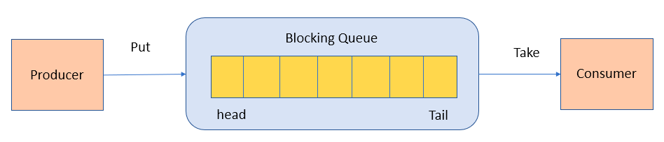
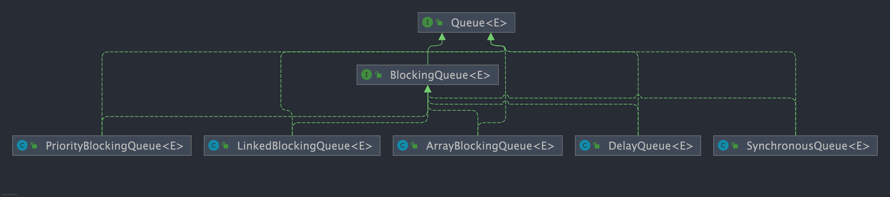

# 4. Queue基础

## 1.1 Queue 与 Deque 的区别
`Queue` 是单端队列，只能从一端插入元素，另一端删除元素，实现上一般遵循 **先进先出（FIFO）** 规则。

`Queue` 扩展了 `Collection` 的接口，根据 **因为容量问题而导致操作失败后处理方式的不同** 
可以分为两类方法: 一种在操作失败后会抛出异常，另一种则会返回特殊值。

| `Queue` 接口 | 抛出异常  | 返回特殊值 |
| ------------ | --------- | ---------- |
| 插入队尾     | add(E e)  | offer(E e) |
| 删除队首     | remove()  | poll()     |
| 查询队首元素 | element() | peek()     |

`Deque` 是双端队列，在队列的两端均可以插入或删除元素。

`Deque` 扩展了 `Queue` 的接口, 增加了在队首和队尾进行插入和删除的方法，同样根据失败后处理方式的不同分为两类：

| `Deque` 接口 | 抛出异常      | 返回特殊值      |
| ------------ | ------------- | --------------- |
| 插入队首     | addFirst(E e) | offerFirst(E e) |
| 插入队尾     | addLast(E e)  | offerLast(E e)  |
| 删除队首     | removeFirst() | pollFirst()     |
| 删除队尾     | removeLast()  | pollLast()      |
| 查询队首元素 | getFirst()    | peekFirst()     |
| 查询队尾元素 | getLast()     | peekLast()      |

事实上，`Deque` 还提供有 `push()` 和 `pop()` 等其他方法，可用于模拟栈。

## 1.2 ArrayDeque 与 LinkedList 的区别

`ArrayDeque` 和 `LinkedList` 都实现了 `Deque` 接口，两者都具有队列的功能，但两者有什么区别呢？

- `ArrayDeque` 是基于[可变长的数组和双指针]来实现，而 `LinkedList` 则通过链表来实现。

- `ArrayDeque` 不支持存储 `NULL` 数据，但 `LinkedList` 支持。

- `ArrayDeque` 是在 JDK1.6 才被引入的，而`LinkedList` 早在 JDK1.2 时就已经存在。

- `ArrayDeque` 插入时可能存在扩容过程, 不过均摊后的插入操作依然为 O(1)。
    虽然 `LinkedList` 不需要扩容，但是每次插入数据时均需要申请新的堆空间，均摊性能相比更慢。

从性能的角度上，选用 `ArrayDeque` 来实现队列要比 `LinkedList` 更好。此外，[`ArrayDeque` 也可以用于实现栈]

## 1.3 说一说 PriorityQueue

`PriorityQueue` 是在 JDK1.5 中被引入的, 其与 `Queue` 的区别在于元素出队顺序是与优先级相关的，
即总是优先级最高的元素先出队。

这里列举其相关的一些要点：

- `PriorityQueue` 利用了[二叉堆的数据结构]来实现的，底层使用可变长的数组来存储数据
- `PriorityQueue` 通过堆元素的[上浮和下沉]，实现了在 O(logn) 的时间复杂度内[插入元素和删除堆顶]元素。
- `PriorityQueue` 是非线程安全的，且不支持存储 `NULL` 和 `non-comparable` 的对象。
- `PriorityQueue` 默认是小顶堆，但可以接收一个 `Comparator` 作为构造参数，从而来自定义元素优先级的先后。

`PriorityQueue` 在面试中可能更多的会出现在手撕算法的时候，典型例题包括堆排序、求第 K 大的数、带权图的遍历等，
所以需要会熟练使用才行。

## 1.4 什么是 BlockingQueue？

`BlockingQueue` （阻塞队列）是一个接口，继承自 `Queue`。
`BlockingQueue`阻塞的原因是其支持[当队列没有元素时一直阻塞，直到有元素]；
还[支持如果队列已满，一直等到队列可以放入新元素时再放入]。

```java
public interface BlockingQueue<E> extends Queue<E> {
  // ...
}
```

`BlockingQueue` 常用于生产者-消费者模型中，生产者线程会向队列中添加数据，而消费者线程会从队列中取出数据进行处理。



## 1.5 BlockingQueue 的实现类有哪些？



Java 中常用的阻塞队列实现类有以下几种：

1. `ArrayBlockingQueue`：使用[数组]实现的[有界阻塞队列]。在[创建时需要指定容量大小]，
    并支持公平和非公平两种方式的锁访问机制。

2. `LinkedBlockingQueue`：使用[单向链表]实现的[可选有界阻塞]队列。
              在创建时可以指定容量大小，如果不指定则默认为`Integer.MAX_VALUE`。
              和`ArrayBlockingQueue`类似， 它也支持公平和非公平的锁访问机制。

3. `PriorityBlockingQueue`：支持优先级排序的[无界阻塞队列]。
      元素必须实现`Comparable`接口或者在构造函数中传入`Comparator`对象，并且[不能插入 null ]元素。

4. `SynchronousQueue`：同步队列，是一种不存储元素的阻塞队列。每个插入操作都必须等待对应的删除操作，
    反之删除操作也必须等待插入操作。因此，`SynchronousQueue`通常[用于线程之间的直接传递数据]。

5. `DelayQueue`：延迟队列，其中的元素[只有到了其指定的延迟时间，才能够从队列中出队]。
6. ......

日常开发中，这些队列使用的其实都不多，了解即可。

## 1.6 ArrayBlockingQueue 和 LinkedBlockingQueue 有什么区别？

`ArrayBlockingQueue` 和 `LinkedBlockingQueue` 是 Java 并发包中常用的两种阻塞队列实现，
它们都是线程安全的。不过，不过它们之间也存在下面这些区别：

- 底层实现：`ArrayBlockingQueue` 基于数组实现，而 `LinkedBlockingQueue` 基于链表实现。
- 是否有界：`ArrayBlockingQueue` 是有界队列，必须在创建时指定容量大小。
        `LinkedBlockingQueue` 创建时可以不指定容量大小，默认是`Integer.MAX_VALUE`，也就是无界的。但也可以指定队列大小，从而成为有界的。
- 锁是否分离： `ArrayBlockingQueue`中的锁是没有分离的，即[生产和消费用的是同一个锁]；
     `LinkedBlockingQueue`中的锁是分离的，即生产用的是`putLock`，消费是`takeLock`，这样可以防止生产者和消费者线程之间的锁争夺。
- 内存占用：`ArrayBlockingQueue` 需要提前分配数组内存，而 `LinkedBlockingQueue` 则是动态分配链表节点内存。
     这意味着，`ArrayBlockingQueue` 在创建时就会占用一定的内存空间，且往往申请的内存比实际所用的内存更大，
    而`LinkedBlockingQueue` 则是根据元素的增加而逐渐占用内存空间。

