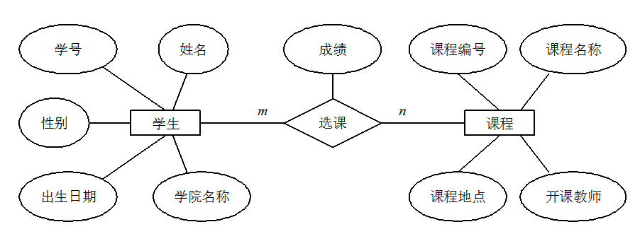
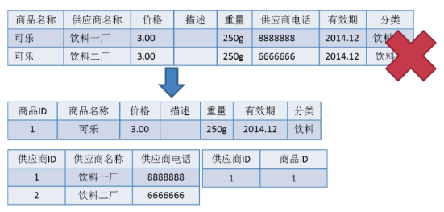
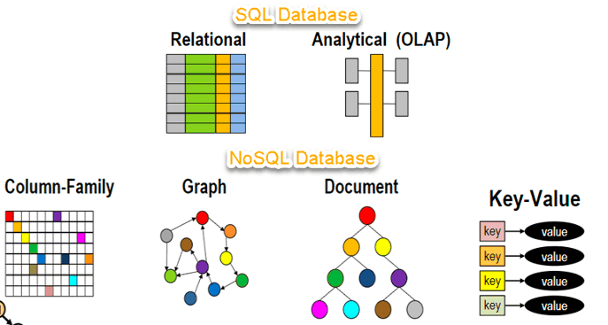
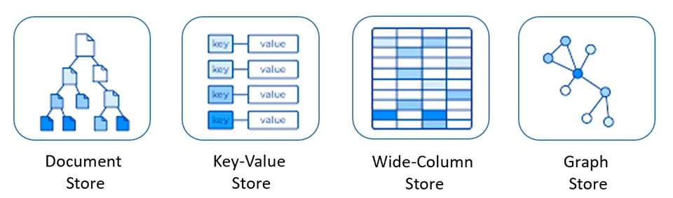
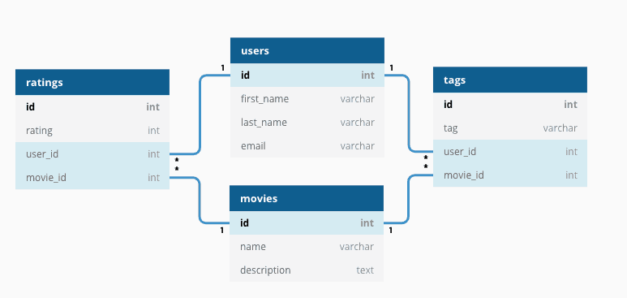

# 数据库基础知识总结
## 1.1 什么是数据库, 数据库管理系统, 数据库系统, 数据库管理员?
- **数据库** :
  - 数据库(DataBase 简称 DB)就是[信息的集合]或者说[数据库是由数据库管理系统管理的数据的集合]
- **数据库管理系统** : 数据库管理系统(Database Management System 简称 DBMS)
  - 是一种操纵和管理数据库的大型软件，通常用于建立、使用和维护数据库。
- **数据库系统** : 数据库系统(Data Base System，简称 DBS)
  - 通常由[软件、数据库和数据管理员(DBA)]组成。
- **数据库管理员** : 数据库管理员(Database Administrator, 简称 DBA)
  - 负责全面管理和控制数据库系统。

## 1.2 什么是元组, 码, 候选码, 主码, 外码, 主属性, 非主属性？
- **元组**：元组（tuple）-- 一行数据
  - 是关系数据库中的基本概念，关系是一张表，
  - 表中的[每行（即数据库中的每条记录）就是一个元组]
  - 每列就是一个属性。 在二维表里，元组也称为行。
- **码**：-- 列
  - 码就是能唯一标识实体的属性，对应表中的列。
- **候选码**：--可以用作唯一键
  - 若关系中的[某一属性或属性组的值能唯一的标识一个元组]，而其任何、子集都不能再标识，则称该属性组为候选码。
  - 例如：在学生实体中，“学号”是能唯一的区分学生实体的，同时又假设“姓名”、“班级”的属性组合足以区分学生实体，
  - 那么{学号}和{姓名，班级}都是候选码。
- **主码** : 主键
  - 主码也叫主键。主码是从候选码中选出来的。 一个实体集中只能有一个主码，但可以有多个候选码。
- **外码** : 外键
  - 外码也叫外键。如果一个关系中的一个属性是另外一个关系中的主码则这个属性为外码。
- **主属性**：
  - [候选码中出现过的属性称为主属性]。比如关系 工人（工号，身份证号，姓名，性别，部门）. 显然工号和身份证号都能够唯一标示这个关系，所以都是候选码。工号、身份证号这两个属性就是主属性。如果主码是一个属性组，那么属性组中的属性都是主属性。
- **非主属性：**
  - 不包含在任何一个候选码中的属性称为非主属性。
  - 比如在关系——学生（学号，姓名，年龄，性别，班级）中，主码是“学号”，那么其他的“姓名”、“年龄”、“性别”、“班级”就都可以称为非主属性。

## 1.3 什么是 ER 图？

我们做一个项目的时候一定要试着画 ER 图来捋清数据库设计，这个也是面试官问你项目的时候经常会被问到的。

**ER 图** 全称是 Entity Relationship Diagram（实体联系图），提供了表示实体类型、属性和联系的方法。

ER 图由下面 3 个要素组成：
- **实体**：
  - 通常是现实世界的业务对象，当然使用一些逻辑对象也可以。
  - 比如对于一个校园管理系统，会涉及学生、教师、课程、班级等等实体。在 ER 图中，实体使用矩形框表示。
- **属性**：
- 即[某个实体拥有的属性]，属性用来描述组成实体的要素，对于产品设计来说可以理解为字段。
  - 在 ER 图中，属性使用椭圆形表示。
- **联系**：
  - 即实体与实体之间的关系，在 ER 图中用菱形表示，
  - 这个关系不仅有业务关联关系，还能通过数字表示实体之间的数量对照关系。
  - 例如，一个班级会有多个学生就是一种实体间的联系。

下图是一个学生选课的 ER 图，每个学生可以选若干门课程，同一门课程也可以被若干人选择，
所以它们之间的关系是多对多（M: N）。另外，还有其他两种实体之间的关系是：1 对 1（1:1）、1 对多（1: N）。



## 1.4 数据库范式了解吗?

数据库范式有 3 种：
- 1NF(第一范式)：属性不可再分。
- 2NF(第二范式)：1NF 的基础之上，消除了非主属性对于码的部分函数依赖。
- 3NF(第三范式)：3NF 在 2NF 的基础之上，消除了非主属性对于码的传递函数依赖 。
### 1NF(第一范式)
属性（对应于表中的字段）不能再被分割，也就是这个字段只能是一个值，不能再分为多个其他的字段了。
**1NF 是所有关系型数据库的最基本要求** ，也就是说关系型数据库中创建的表一定满足第一范式。

### 2NF(第二范式)

2NF 在 1NF 的基础之上，消除了非主属性对于码的部分函数依赖。如下图所示，展示了第一范式到第二范式的过渡。
第二范式在第一范式的基础上增加了一个列，这个列称为主键，[非主属性都依赖于主键]



一些重要的概念：
- **函数依赖（functional dependency）**：
  - 若在一张表中，在属性（或属性组）X 的值确定的情况下，必定能确定属性 Y 的值，那么就可以说 Y 函数依赖于 X，写作 X → Y。
- **部分函数依赖（partial functional dependency）**：
  - 如果 X→Y，并且存在 X 的一个真子集 X0，使得 X0→Y，则称 Y 对 X 部分函数依赖。
  - 比如学生基本信息表 R 中（学号，身份证号，姓名）当然学号属性取值是唯一的，在 R 关系中，（学号，身份证号）->（姓名），（学号）->（姓名），（身份证号）->（姓名）；所以姓名部分函数依赖于（学号，身份证号）；
- **完全函数依赖(Full functional dependency)**：
  - 在一个关系中，若[某个非主属性数据项依赖于全部关键字]称之为完全函数依赖。
  - 比如学生基本信息表 R（学号，班级，姓名）假设不同的班级学号有相同的，班级内学号不能相同，在 R 关系中，（学号，班级）->（姓名），但是（学号）->(姓名)不成立，（班级）->(姓名)不成立，所以姓名完全函数依赖与（学号，班级）；
- **传递函数依赖**：
  - 在关系模式 R(U)中，设 X，Y，Z 是 U 的不同的属性子集，
  - 如果 X 确定 Y、Y 确定 Z，且有 X 不包含 Y，Y 不确定 X，（X∪Y）∩Z=空集合，则称 Z 传递函数依赖(transitive functional dependency) 于 X。
  - 传递函数依赖会导致数据冗余和异常。传递函数依赖的 Y 和 Z 子集往往同属于某一个事物，因此可将其合并放到一个表中。比如在关系 R(学号 , 姓名, 系名，系主任)中，学号 → 系名，系名 → 系主任，所以存在非主属性系主任对于学号的传递函数依赖。。

### 3NF(第三范式)
3NF 在 2NF 的基础之上，消除了非主属性对于码的传递函数依赖 。符合 3NF 要求的数据库设计，
**基本**上解决了数据冗余过大，插入异常，修改异常，删除异常的问题。比如在关系 R(学号 , 姓名, 系名，系主任)中，
学号 → 系名，系名 → 系主任，所以存在非主属性系主任对于学号的传递函数依赖，所以该表的设计，不符合 3NF 的要求。

## 1.5 主键和外键有什么区别?

- **主键(主码)**：主键用于唯一标识一个元组，不能有重复，不允许为空。一个表只能有一个主键。
- **外键(外码)**：外键用来和其他表建立联系用，外键是另一表的主键，外键是可以有重复的，可以是空值。一个表可以有多个外键。

## 1.6 为什么不推荐使用外键与级联？

对于外键和级联，阿里巴巴开发手册这样说到：

> 【强制】不得使用外键与级联，一切外键概念必须在应用层解决。
>
> 说明: 以学生和成绩的关系为例，学生表中的 student_id 是主键，那么成绩表中的 student_id 则为外键。如果更新学生表中的 student_id，同时触发成绩表中的 student_id 更新，即为级联更新。
> 外键与级联更新适用于单机低并发，不适合分布式、高并发集群；
1. 级联更新是强阻塞，存在数据库更新风暴的风险；
2. 外键影响数据库的插入速度

为什么不要用外键呢？大部分人可能会这样回答：

1. **增加了复杂性：** 
   1. 每次做 DELETE 或者 UPDATE 都必须考虑外键约束，会导致开发的时候很痛苦, 测试数据极为不方便; 
   2. 外键的主从关系是定的，假如那天需求有变化，数据库中的这个字段根本不需要和其他表有关联的话就会增加很多麻烦。
2. **增加了额外工作**：
   1. 数据库需要增加维护外键的工作，比如当我们做一些涉及外键字段的增，删，更新操作之后，需要触发相关操作去检查，保证数据的的一致性和正确性，这样会不得不消耗资源
3. **对分库分表不友好**：
   1. 因为分库分表下外键是无法生效的。
4. ......

我个人觉得上面这种回答不是特别的全面，只是说了外键存在的一个常见的问题。实际上，我们知道外键也是有很多好处的，比如：

1. 保证了数据库数据的一致性和完整性；
2. 级联操作方便，减轻了程序代码量；
3. ......

所以说，不要一股脑的就抛弃了外键这个概念，既然它存在就有它存在的道理，如果[系统不涉及分库分表，并发量不是很高]的情况还是可以考虑使用外键的。


阿里巴巴 Java 开发手册里要求禁止使用存储过程。

## 1.7 drop、delete 与 truncate 区别？

### 用法不同

- `drop`(丢弃数据): `drop table 表名` ，直接将表都删除掉，在删除表的时候使用。
- `truncate` (清空数据) : `truncate table 表名` ，只删除表中的数据，再插入数据的时候自增长 id 又从 1 开始，在清空表中数据的时候使用。
- `delete`（删除数据） : `delete from 表名 where 列名=值`，删除某一行的数据，如果不加 `where` 子句和`truncate table 表名`作用类似。

`truncate` 和不带 `where`子句的 `delete`、以及 `drop` 都会删除表内的数据，但是 **`truncate` 和 `delete` 只删除数据不删除表的结构(定义)，
执行 `drop` 语句，[此表的结构也会删除]，也就是执行`drop` 之后对应的表不复存在。**

### 属于不同的数据库语言

`truncate` 和 `drop` 属于 DDL(数据定义语言)语句，操作立即生效，原数据不放到 rollback segment 中，[不能回滚]，操作不触发 trigger。
而 `delete` 语句是 DML (数据库操作语言)语句，这个操作会放到 rollback segment 中，事务提交之后才生效。

**DML 语句和 DDL 语句区别：**

- DML 是数据库操作语言（Data Manipulation Language）的缩写，是指对数据库中表记录的操作，主要包括表记录的插入、更新、删除和查询，是[开发人员日常使用最频繁]的操作。
- DDL （Data Definition Language）是数据定义语言的缩写，简单来说，就是对[数据库内部的对象进行创建、删除、修改]的操作语言。
  它和 DML 语言的最大区别是 DML 只是对表内部数据的操作，而不涉及到表的定义、结构的修改，更不会涉及到其他对象。DDL 语句更多的被数据库管理员（DBA）所使用， 
  一般的开发人员很少使用。

另外，由于`select`不会对表进行破坏，所以有的地方也会把`select`单独区分开叫做数据库查询语言 DQL（Data Query Language）。

### 执行速度不同

一般来说：`drop` > `truncate` > `delete`（这个我没有实际测试过）。

- `delete`命令执行的时候会产生数据库的`binlog`日志，而日志记录是需要消耗时间的，但是也有个好处方便数据回滚恢复。
- `truncate`命令执行的时候不会产生数据库日志，因此比`delete`要快。除此之外，还会把表的自增值重置和索引恢复到初始大小等。
- `drop`命令会把表占用的空间全部释放掉。

Tips：你应该更多地关注在使用场景上，而不是执行效率。

## 1.8 数据库设计通常分为哪几步?

1. **需求分析** : 分析用户的需求，包括数据、功能和性能需求。
2. **概念结构设计** : 主要采用 E-R 模型进行设计，包括画 E-R 图。
3. **逻辑结构设计** : 通过将 E-R 图转换成表，实现从 E-R 模型到关系模型的转换。
4. **物理结构设计** : 主要是为所设计的数据库选择合适的存储结构和存取路径。
5. **数据库实施** : 包括编程、测试和试运行
6. **数据库的运行和维护** : 系统的运行与数据库的日常维护。

# 2.NOSQL的基础知识总结
## 2.1 NoSQL 是什么？

NoSQL（Not Only SQL 的缩写）泛指[非关系型的数据库]，主要针对的是[键值、文档以及图形类型]数据存储。
并且，NoSQL 数据库[天生支持分布式，数据冗余和数据分片]等特性，
旨在提供[可扩展的高可用高性能]数据存储解决方案。

一个常见的误解是 NoSQL 数据库或非关系型数据库不能很好地存储关系型数据。NoSQL 数据库可以存储关系型数据—它们与关系型数据库的存储方式不同。

NoSQL 数据库代表：HBase、Cassandra、MongoDB、Redis。


## 2.2 SQL 和 NoSQL 有什么区别？

|              | SQL 数据库                                                                 | NoSQL 数据库                                                                                                                            |
| :----------- | -------------------------------------------------------------------------- | --------------------------------------------------------------------------------------------------------------------------------------- |
| 数据存储模型 | 结构化存储，具有固定行和列的表格                                           | 非结构化存储。文档：JSON 文档，键值：键值对，宽列：包含行和动态列的表，图：节点和边                                                     |
| 发展历程     | 开发于 1970 年代，重点是减少数据重复                                       | 开发于 2000 年代后期，重点是提升可扩展性，减少大规模数据的存储成本                                                                      |
| 例子         | Oracle、MySQL、Microsoft SQL Server、PostgreSQL                            | 文档：MongoDB、CouchDB，键值：Redis、DynamoDB，宽列：Cassandra、 HBase，图表：Neo4j、 Amazon Neptune、Giraph                            |
| ACID 属性    | 提供原子性、一致性、隔离性和持久性 (ACID) 属性                             | 通常不支持 ACID 事务，为了可扩展、高性能进行了权衡，少部分支持比如 MongoDB 。不过，MongoDB 对 ACID 事务 的支持和 MySQL 还是有所区别的。 |
| 性能         | 性能通常取决于磁盘子系统。要获得最佳性能，通常需要优化查询、索引和表结构。 | 性能通常由底层硬件集群大小、网络延迟以及调用应用程序来决定。                                                                            |
| 扩展         | 垂直（使用性能更强大的服务器进行扩展）、读写分离、分库分表                 | 横向（增加服务器的方式横向扩展，通常是基于分片机制）                                                                                    |
| 用途         | 普通企业级的项目的数据存储                                                 | 用途广泛比如图数据库支持分析和遍历连接数据之间的关系、键值数据库可以处理大量数据扩展和极高的状态变化                                    |
| 查询语法     | 结构化查询语言 (SQL)                                                       | 数据访问语法可能因数据库而异                                                                                                            |

## 2.3 NoSQL 数据库有什么优势？

NoSQL 数据库非常适合许多现代应用程序，例如移动、Web 和游戏等应用程序，它们需要灵活、可扩展、高性能和功能强大的数据库以提供卓越的用户体验。

- **灵活性：** NoSQL 数据库通常提供灵活的架构，以实现更快速、更多的迭代开发。灵活的数据模型使 NoSQL 数据库成为半结构化和非结构化数据的理想之选。
- **可扩展性：** NoSQL 数据库通常被设计为通过使用分布式硬件集群来横向扩展，而不是通过添加昂贵和强大的服务器来纵向扩展。
- **高性能：** NoSQL 数据库针对特定的数据模型和访问模式进行了优化，这与尝试使用关系数据库完成类似功能相比可实现更高的性能。
- **强大的功能：** NoSQL 数据库提供功能强大的 API 和数据类型，专门针对其各自的数据模型而构建。

## 2.4 NoSQL 数据库有哪些类型？

NoSQL 数据库主要可以分为下面四种类型：

- **键值**：
  - 键值数据库是一种较简单的数据库，其中每个项目都包含键和值。这是极为灵活的 NoSQL 数据库类型，
  - 因为应用可以完全控制 value 字段中存储的内容，没有任何限制。Redis 和 DynanoDB 是两款非常流行的键值数据库。
- **文档**：
  - 文档数据库中的数据被存储在类似于 JSON（JavaScript 对象表示法）对象的文档中，非常清晰直观。每个文档包含成对的字段和值。
  - 这些值通常可以是各种类型，包括字符串、数字、布尔值、数组或对象等，并且它们的结构通常与开发者在代码中使用的对象保持一致。
  - MongoDB 就是一款非常流行的文档数据库。
- **图形**：
  - 图形数据库旨在[轻松构建和运行与高度连接的数据集]一起使用的应用程序。图形数据库的典型使用案例包括社交网络、推荐引擎、欺诈检测和知识图形。
  - Neo4j 和 Giraph 是两款非常流行的图形数据库。
- **宽列**：
  - 宽列存储数据库非常适合需要存储大量的数据。Cassandra 和 HBase 是两款非常流行的宽列存储数据库。
  



# 3. MySQL 基础

## 3.1 什么是关系型数据库？

顾名思义，关系型数据库（RDB，Relational Database）就是一种建立在关系模型的基础上的数据库。
关系模型表明了数据库中所存储的数据之间的联系（一对一、一对多、多对多）。

关系型数据库中，我们的数据都被存放在了各种表中（比如用户表），表中的每一行就存放着一条数据（比如一个用户的信息）



大部分关系型数据库都使用 SQL 来操作数据库中的数据。并且，大部分关系型数据库都支持事务的四大特性(ACID)。

**有哪些常见的关系型数据库呢？**

MySQL、PostgreSQL、Oracle、SQL Server、SQLite（微信本地的聊天记录的存储就是用的 SQLite） ......。

## 3.2 什么是 SQL？

SQL 是一种结构化查询语言(Structured Query Language)，专门用来与数据库打交道，目的是提供一种从数据库中读写数据的简单有效的方法。

几乎所有的主流关系数据库都支持 SQL ，适用性非常强。并且，一些非关系型数据库也兼容 SQL 或者使用的是类似于 SQL 的查询语言。

SQL 可以帮助我们：

- 新建数据库、数据表、字段；
- 在数据库中增加，删除，修改，查询数据；
- 新建视图、函数、存储过程；
- 对数据库中的数据进行简单的数据分析；
- 搭配 Hive，Spark SQL 做大数据；
- 搭配 SQLFlow 做机器学习；
- ......

## 3.3 什么是 MySQL？


**MySQL 是一种关系型数据库，主要用于[持久化存储]我们的系统中的一些数据比如用户信息。**

由于 MySQL 是[开源免费并且比较成熟]的数据库，因此，MySQL 被大量使用在各种系统中。
任何人都可以在 GPL(General Public License) 的许可下下载并根据个性化的需要对其进行修改。MySQL 的默认端口号是**3306**。

## 3.4 MySQL 有什么优点？

这个问题本质上是在问 MySQL 如此流行的原因。

MySQL 主要具有下面这些优点：

1. 成熟稳定，功能完善。
2. 开源免费。
3. 文档丰富，既有详细的官方文档，又有非常多优质文章可供参考学习。
4. 开箱即用，操作简单，维护成本低。
5. 兼容性好，支持常见的操作系统，支持多种开发语言。
6. 社区活跃，生态完善。
7. 事务支持优秀， InnoDB 存储引擎默认使用 REPEATABLE-READ 并不会有任何性能损失，并且，InnoDB 实现的 REPEATABLE-READ 隔离级别其实是可以解决幻读问题发生的。
8. 支持分库分表、读写分离、高可用。


## 3.5 MySQL 基础架构

> 建议配合 [SQL 语句在 MySQL 中的执行过程](./how-sql-executed-in-mysql.md) 这篇文章来理解 MySQL 基础架构。另外，“一个 SQL 语句在 MySQL 中的执行流程”也是面试中比较常问的一个问题。

下图是 MySQL 的一个简要架构图，从下图你可以很清晰的看到客户端的一条 SQL 语句在 MySQL 内部是如何执行的。


从上图可以看出， MySQL 主要由下面几部分构成：

- **连接器：** 身份认证和权限相关(登录 MySQL 的时候)。
- **查询缓存：** 执行查询语句的时候，会先查询缓存（MySQL 8.0 版本后移除，因为这个功能不太实用）。
- **分析器：** 没有命中缓存的话，SQL 语句就会经过分析器，分析器说白了就是要先看你的 SQL 语句要干嘛，再检查你的 SQL 语句语法是否正确。
- **优化器：** 按照 MySQL 认为最优的方案去执行。
- **执行器：** 执行语句，然后从存储引擎返回数据。 执行语句之前会先判断是否有权限，如果没有权限的话，就会报错。
- **插件式存储引擎**：主要负责数据的存储和读取，采用的是插件式架构，支持 InnoDB、MyISAM、Memory 等多种存储引擎。

## 3.6 MySQL 查询缓存

执行查询语句的时候，会先查询缓存。不过，MySQL 8.0 版本后移除，因为这个功能不太实用

`my.cnf` 加入以下配置，重启 MySQL 开启查询缓存

```properties
query_cache_type=1
query_cache_size=600000
```

MySQL 执行以下命令也可以开启查询缓存

```properties
set global  query_cache_type=1;
set global  query_cache_size=600000;
```

如上，**开启查询缓存后在同样的查询条件以及数据情况下，会直接在缓存中返回结果**。这里的查询条件包括查询本身、
当前要查询的数据库、客户端协议版本号等一些可能影响结果的信息。

**查询缓存不命中的情况：**

1. 任何两个查询在任何字符上的不同都会导致缓存不命中。
2. 如果查询中包含任何用户自定义函数、存储函数、用户变量、临时表、MySQL 库中的系统表，其查询结果也不会被缓存。
3. 缓存建立之后，MySQL 的查询缓存系统会跟踪查询中涉及的每张表，如果这些表（数据或结构）发生变化，那么和这张表相关的所有缓存数据都将失效。

**缓存虽然能够提升数据库的查询性能，但是缓存同时也带来了额外的开销，每次查询后都要做一次缓存操作，失效后还要销毁。** 因此，开启查询缓存要谨慎，
尤其对于写密集的应用来说更是如此。如果开启，要注意合理控制缓存空间大小，一般来说其大小设置为几十 MB 比较合适。
此外，**还可以通过 `sql_cache` 和 `sql_no_cache` 来控制某个查询语句是否需要缓存：**

```sql
SELECT sql_no_cache COUNT(*) FROM usr;
```


### 读写分离和分库分表了解吗？

读写分离和分库分表相关的问题比较多，于是，我单独写了一篇文章来介绍：[读写分离和分库分表详解](../../high-performance/read-and-write-separation-and-library-subtable.md)。


# 1.mysql有关权限的表都有哪几个？
MySQL服务器通过[**权限表**]来控制用户对数据库的访问，权限表存放在mysql数据库里，由mysql_install_db脚本初始化。

下面分别介绍一下这些表的结构和内容：
1. user：记录允许连接到服务器的用户帐号信息，里面的权限是全局级的。
2. db权限表：记录各个帐号在各个数据库上的操作权限。
3. table_priv权限表：记录数据表级的操作权限。
4. columns_priv权限表：记录数据列级的操作权限
5. host权限表：配合db权限表对给定主机上数据库级操作权限作更细致的控制。这个权限表不受GRANT和REVOKE语句的影响

# 2. mysql数据类型
## 2.1 整数类型

TINYINT、SMALLINT、MEDIUMINT、INT、BIGINT，表示1、2、3、4、8字节整数类型都可以加上UNSIGNED属性，表示数据是无符号的，即非负整数。
长度：整数类型可以被指定长度，例如：INT(11)表示长度为11的INT类型。	长度在大多数场景是没有意义的，它不会限制值的合法范围，只会影响显示字符的个数，而且需要和UNSIGNED ZEROFILL属性配合使用才有意义。
例子：假定类型设定为INT(5)，属性为UNSIGNED ZEROFILL，如果用户插入的数据为12的话，那么数据库实际存储数据为00012。

2、实数类型
FLOAT、DOUBLE、DECIMAL。DECIMAL可以用于存储比BIGINT还大的整型；
而FLOAT和DOUBLE是有取值范围的，并支持使用标准的浮点进行近似计算。
FLOAT类型数据可以存储至多8位十进制数，并在内存中占4字节。
DOUBLE类型数据可以存储至多18位十进制数，并在内存中占8字节。
计算时FLOAT和DOUBLE相比DECIMAL效率更高一些，
DECIMAL你可以理解成是用字符串进行处理。

3、字符串类型，
VARCHAR、CHAR、TEXT、BLOBVARCHAR用于存储可变长字符串，比定长类型更节省空间。
VARCHAR使用额外1或2个字节存储字符串长度。列长度小于255字节时，使用1字节表示，否则使用2字节表示。存储可变长字符串
VARCHAR和VACHAR存储的内容超出设置的长度时，内容会被截断。
CHAR是定长的，根据定义的字符串长度分配足够的空间。CHAR会根据需要用空格填充方便。CHAR适合存储很短的字符串，或所有值接近一个长度
4、枚举类型（ENUM）
把不重复的数据存储为一个预定义的集合。有时可以使用ENUM代替常用的字符串类型。ENUM存储非常紧凑，会把列表值压缩到一个或两个字节。
ENUM在内部存储时，其实存的是整数。尽量避免使用数字作为ENUM枚举的常量，因为容易混乱。排序是按照内部存储的整数
5、日期和时间类型，
尽量使用timestamp，空间效率高于datetime，用整数保存时间戳通常不方便处理。如果需要存储微秒，可使用bigint存储。
3.CHAR和vchar的区别？
1.CHAR和VARCHAR类型在存储和检索方面有所不同
2.CHAR列长度固定为创建表时声明的长度，长度值范围是1到255
当CHAR值被存储时，它们被用空格填充到特定长度，检索CHAR值时需删除尾随空格
VARCHAR用于存储可变长字符串，它比定长类型更节省空间。
VARCHAR使用额外1或2个字节存储字符串长度。
列长度小于255字节时，使用1字节表示，否则使用2字节表示。
VARCHAR存储的内容超出设置的长度时，内容会被截断。

CHAR是定长的，根据定义的字符串长度分配足够的空间。
CHAR会根据需要使用空格进行填充方便比较。
CHAR适合存储很短的字符串，或者所有值都接近同一个长度。
CHAR存储的内容超出设置的长度时，内容同样会被截断

使用策略：
对于经常变更的数据来说，CHAR比VARCHAR更好，因为CHAR不容易产生碎片。
对于非常短的列，CHAR比VARCHAR在存储空间上更有效率。
使用时要注意只分配需要的空间，更长的列排序时会消耗更多内存。
尽量避免使用TEXT/BLOB类型，查询时会使用临时表，导致严重的性能开销
3.int(10)和char(10)以及varchar(10)的区别？
int(10)的10表示显示的数据的长度，不是存储数据的大小；
数据长度 9999999999，占32个字节，int型4位
char(10)和varchar(10)的10表示存储数据的大小，即表示存储多少个字符。
10位固定字符串，不足补空格 最多10个字符，空格表示占位不算字符
varchar(10) 10位可变字符串，不足补空格 最多10个字符
表示存储10个变长的字符，存储多少个就是多少个，空格也按一个字符存储，

3.MyISAM索引与InnoDB索引的区别？
InnoDB索引是聚簇索引，MyISAM索引是非聚簇索引。
InnoDB的主键索引的叶子节点存储着行数据，因此主键索引非常高效。
MyISAM索引的叶子节点存储的是行数据地址，需要再寻址一次才能得到数据。
InnoDB非主键索引的叶子节点存储的是主键和其他带索引的列数据，因此查询时做到覆盖索引会非常高效。

4.百万级别或以上的数据如何删除？
关于索引：由于索引需要额外的维护成本，因为索引文件是单独存在的文件,所以当我们对数据的增加,修改,删除,都会产生额外的对索引文件的操作,这些操作需要消耗额外的IO,会降低增/改/删的执行效率。在我们删除数据库百万级别数据的时候，查询MySQL官方手册得知删除数据的速度和创建的索引数量是成正比的。
我们想要删除百万数据的时候
1.可以先删除索引（此时大概耗时三分多钟）
2.然后删除其中无用数据（此过程需要不到两分钟）
3.重新创建索引(此时数据较少了)创建索引也非常快，约十分钟左右

与之前的直接删除绝对是要快速很多，更别说万一删除中断,一切删除会回滚。

5.什么是最左前缀原则？什么是最左匹配原则？
顾名思义，就是最左优先，在创建多列索引时，要根据业务需求，where子句中使用最频繁的一列放在最左边。
最左前缀匹配原则，非常重要的原则，mysql会一直向右匹配直到遇到范围查询(>、<、between、like)就停止匹配，比如a = 1 and b = 2 and c > 3 and d = 4 如果建立(a,b,c,d)顺序的索引，d是用不到索引的，如果建立(a,b,d,c)的索引则都可以用到，a,b,d的顺序可以任意调整。
=和in可以乱序，比如a = 1 and b = 2 and c = 3 建立(a,b,c)索引可以任意顺序，mysql的查询优化器会帮你优化成索引可以识别的形式

6.大表数据查询如何优化?某个表有近千万数据，CRUD比较慢，如何优化？
1. 优化shema、sql语句+索引；
2. 加缓存，memcached, redis；
3. 主从复制，读写分离；
4.限定数据范围：务必禁止不带任何限制数据范围条件的查询语句
4.垂直拆分，根据你模块的耦合度，将一个大的系统分为多个小的系统，也就是分布式系统
5.水平切分，针对数据量大的表，这一步最麻烦，最能考验技术水平，要选择一个合理的sharding key, 为了有好的查询效率，表结构也要改动，做一定的冗余，应用也要改，sql中尽量带sharding key，将数据定位到限定的表上去查，而不是扫描全部的表

7.分库分表了是怎么做的？分表分库了有什么问题？有用到中间件么？他们的原理知道么？
1.垂直分区
根据数据库里面数据表的相关性进行拆分，简单来说垂直拆分是指数据表列的拆分，把一张列比较多的表拆分为多张表。
例如，用户表中既有用户的登录信息又有用户的基本信息，可以将用户表拆分成两个单独的表，甚至放到单独的库做分库。
适用场景：
1.如果一个表中某些列常用，另外一些列不常用
优点：
1.可以使得行数据变小，在查询时减少读取Block数，减少I/O次数。				2.垂直分区可以简化表的结构，易于维护
缺点：
1.主键会出现冗余，需要管理冗余列，
2.并会引起Join操作，可以通过在应用层进行Join来解决，
3.有些分表的策略基于应用层的逻辑算法，一旦逻辑算法改变，整个分表逻辑都会改变，扩展性较差
4.垂直分区会让事务变得更加复杂；

2. 水平分区
   保持数据表结构不变，通过某种策略存储数据分片。这样每一片数据分散到不同的表或者库中，达到了分布式的目的。 水平拆分可以支撑非常大的数据量。
   分割后可以降低在查询时需要读的数据和索引的页数，同时也降低了索引的层数，提高查询次数
   水平拆分是指数据表行的拆分，表的行数超过200万行时，就会变慢，这时可以把一张的表的数据拆成多张表来存放。。需注意:分表仅仅是解决了单一表数据过大的问题，但由于表的数据还是在同一台机器上，其实对于提升MySQL并发能力没有什么意义，所以 水平拆分最好分库 。
   适用场景：
   1、表中的数据本身就有独立性，例如表中分表记录各个地区的数据或者不同时期的数据，特别是有些数据常用，有些不常用。
   2、需要把数据存放在多个介质上。
   优点：
   1.水平拆分可以支持非常大的数据量
   2.应用端改造少
   缺点：
   1.分片事务难以解决；2.跨界点Join性能较差3.逻辑复杂
   4.应用复杂度增加，查询需多个表名，查询所有数据需UNION操作
   常见方案：
   客户端代理： 分片逻辑在应用端，封装在jar包中，通过修改或者封装JDBC层来实现。 当当网的 Sharding-JDBC 、阿里的TDDL是两种比较常用的实现。
   中间件代理： 在应用和数据中间加了一个代理层。分片逻辑统一维护在中间件服务中。 我们现在谈的 Mycat 、360的Atlas、网易的DDB等等都是这种架构的实

8.分表分库了有什么问题？有用到中间件么？他们的原理知道么？
1.事务支持
分库分表后，就成了分布式事务了。
如果依赖数据库本身的分布式事务管理功能去执行事务，耗费性能
如果由应用程序去协助控制，形成程序逻辑上的事务，编程复杂
2.跨库JOIN
1.，跨节点Join的问题是不可避免的。
解决方案：是分两次查询实现。在第一次查询的结果集中找出关联数据的id,
根据这些id发起第二次请求得到关联数据。
2.跨节点的count,order by,group by以及聚合函数问题 这些是一类问题，因为它们都需要基于全部数据集合进行计算。多数的代理都不会自动处理合并工作。
解决方案：1.分别在各个节点上得到结果后在应用程序端进行合并。和join不同的是每个结点的查询可以并行执行，因此很多时候它的速度要比单一大表快很多。但如果结果集很大，对应用程序内存的消耗是一个问题。
3.数据迁移，容量规划，扩容等问题
解决方案：
它利用对2的倍数取余具有向前兼容的特性（如对4取余得1的数对2取余也是1）来分配数据，避免了行级别的数据迁移，但是依然需要进行表级别的迁移，同时对扩容规模和分表数量都有限制。
总得来说，这些方案都不是十分的理想，多多少少都存在一些缺点，这也从一个侧面反映出了Sharding扩容的难度。。
3.ID问题
一旦数据库被切分到多个物理结点上，我们将不能再依赖数据库自身的主键生成机制。一方面，某个分区数据库自生成的ID无法保证在全局上是唯一的；另一方面，应用程序在插入数据之前需要先获得ID,以便进行SQL路由.

	常见的主键生成策略
		UUID 使用UUID作主键是最简单的方案，但是缺点也是非常明显的。由于UUID非常的长，除占用大量存储空间外，最主要的问题是在索引上，在建立索引和基于索引进行查询时都存在性能问题。
		 Twitter的分布式自增ID算法Snowflake 在分布式系统中，需要生成全局UID的场合还是比较多的，twitter的snowflake解决了这种需求，实现也还是很简单的，除去配置信息，核心代码就是毫秒级时间41位 机器ID 10位 毫秒内序列12位
	4.跨分片的排序分页
	般来讲，分页时需要按照指定字段进行排序。当排序字段就是分片字段的时候，我们通过分片规则可以比较容易定位到指定的分片，而当排序字段非分片字段的时候，情况就会变得比较复杂了。为了最终结果的准确性，我们需要在不同的分片节点中将数据进行排序并返回，并将不同分片返回的结果集进行汇总和再次排序，最后再返回给用户。如下图所示
7.超大分页怎么处理？
一般从两个方向上来解决:
数据库层面,
类似于select * from table where age > 20 limit 1000000,10这种查询其实也是有可以优化的余地的. 这条语句需要load1000000数据然后基本上全部丢弃,只取10条当然比较慢.
当时我们可以修改为select * from table where id in (select id from table where age > 20 limit 1000000,10).这样虽然也load了一百万的数据,但是由于索引覆盖,要查询的所有字段都在索引中,所以速度会很快.
同时如果ID连续的好,还可select * from table where id > 1000000 limit 10,效率也是不错的,
优化的可能性有许多种,但是核心思想都一样,就是减少load的数据从需求的角度减少这种请求
主要是靠缓存,可预测性的提前查到内容,缓存至redis等k-V数据库中,直接返回即可
8.为什么要尽量设定一个主键？
主键是数据库确保数据行在整张表唯一性的保障，即使业务上本张表没有主键，也建议添加一个自增长的ID列作为主键。设定了主键之后，在后续的删改查的时候可能更加快速以及确保操作数据范围安全。

9.主键使用自增ID还是UUID？
荐使用自增ID，不要使用UUID。
因为在InnoDB存储引擎中，主键索引是作为聚簇索引存在的，也就是说，主键索引的B+树叶子节点上存储了主键索引以及全部的数据(按照顺序)，如果主键索引是自增ID，那么只需要不断向后排列即可，
如果是UUID，由于到来的ID与原来的大小不确定，会造成非常多的数据插入，数据移动，然后导致产生很多的内存碎片，进而造成插入性能的下降。
总之，在数据量大一些的情况下，用自增主键性能会好一些。关于主键是聚簇索引，如果没有主键，InnoDB会选择一个唯一键来作为聚簇索引，如果没有唯一键，会生成一个隐式的主键。

10.字段为什么要求定义为not null？
1.null值会占用更多的字节，且会在程序中造成很多与预期不符的情况。
2.如果要存储用户的密码散列，应该使用什么字段进行存储？
密码散列，盐，用户身份证号等固定长度的字符串应该使用char而不是varchar来存储，这样可以节省空间且提高检索效率。

12.MySQL数据库cpu飙升到500%的话他怎么处理？
1. top观察是不是 mysqld 占用导致的，如果不是，找出占用高的进程，并进行相关处理。
2.若是 mysqld 造成的， show processlist，看看里面跑的 session 情况，是不是有消耗资源的 sql 在运行。找出消耗高的 sql，看看执行计划是否准确， index 是否缺失，或者实在是数据量太大造成。

	一般来说，肯定要 kill 掉这些线程(同时观察 cpu 使用率是否下降)，等进行相应的调整(比如说加索引、改 sql、改内存参数)之后，再重新跑这些 SQL。
也有可能是每个 sql 消耗资源并不多，但是突然之间，有大量的 session 连进来导致 cpu 飙升，这种情况就需要跟应用一起来分析为何连接数会激增，再做出相应的调整，比如说限制连接数等。
13.Mysql中有哪些不同的表格？
MyISAM  Heap  Merge INNODB  ISAM
14.为什么使用数据库？
数据保存在内存
优点： 存取速度快
缺点： 数据不能永久保存
数据保存在文件
优点： 数据永久保存
缺点：1）速度比内存操作慢，频繁的IO操作。2）查询数据不方便
数据保存在数据库
1）数据永久保存
2）使用SQL语句，查询方便效率高。
3）管理数据方便
15.什么是SQL？Sql语句类型？什么是mysql
结构化查询语言(Structured Query Language)简称SQL，是一种数据库查询语言。
作用：用于存取数据、查询、更新和管理关系数据库系统。
SQL语句类型?
数据定义语言:DDL（Data define language）：CREATE DROP ALTER
数据查询语言：DQL（Data QUERYlanguageL :SELECT
数据操纵语言DML（Data Manipulation Language）INSERT，UPDATE，DELETE
数据据控制DCL(Data Control Language) GRANT,REVOKE,COMMIT，ROLLBACK
什么是MySQL?
MySQL是一个关系型数据库管理系统，由瑞典MySQL AB 公司开发，属于 Oracle 旗下产品。MySQL 是最流行的关系型数据库管理系统之一，在 WEB 应用方面，MySQL是最好的 RDBMS (Relational Database Management System，关系数据库管理系统) 应用软件之一。在Java企业级开发中非常常用，因为 MySQL 是开源免费的，并且方便扩展。
16.超键、候选键、主键、外键分别是什么?
超键：在关系中能唯一标识元组的属性集称为关系模式的超键。一个属性可以为作为一个超键，多个属性组合在一起也可以作为一个超键。包含候选键和主键。
候选键：是最小超键，即没有冗余元素的超键。
主键：数据库表中对储存数据对象予以唯一和完整标识的数据列或属性的组合。一个数据列只能有一个主键，且主键的取值不能缺失，即不能为空值（Null）。
外键：在一个表中存在的另一个表的主键称此表的外键。
17.SQL 约束有哪几种?
NOT NULL: 用于控制字段的内容一定不能为空（NULL）。
UNIQUE: 控件字段内容不能重复，一个表允许有多个 Unique 约束。
PRIMARY KEY: 也是用于控件字段内容不能重复，但它在一个表只允许出现一个。
FOREIGN KEY: 用于预防破坏表之间连接的动作，也能防止非法数据插入外键列，因为它必须是它指向的那个表中的值之一。
CHECK: 用于控制字段的值范围。
18.什么是子查询?及三种情况
1.条件：一条SQL语句的查询结果做为另一条查询语句的条件或查询结果
2.嵌套：多条SQL语句嵌套使用，内部的SQL查询语句称为子查询
情况：
1.子查询是单行单列：结果集是一个值，父查询使用：=、 <、 > 等运算符
select  * from employee where salary=(select max(salary) from employee);
2.子查询是多行单列：结果集类似于一个数组，父查询使用：in 运算符
select  * from employee where salary=(select max(salary) from employee);
3.子查询是多行多列,结果集类似于一张虚拟表，不能用where条件，用于select子句中做为子表
select * from dept d,  (select * from employee where join_date > '2011-1-1') e where e.dept_id =  d.id;

19.业务系统的耗时统计?慢查询优化
结构在业务系统中,除了使用主键进行的查询,其他的我都会在测试库上测试其耗时,慢查询的统计主要由运维在做,会定期将业务中的慢查询反馈给我们.

	慢查询的优化首先要搞明白慢的原因是什么?
	 查询条件没有命中索引?
	是load了不需要的数据列?
	还是数据量太大?
所以优化也是针对这三个方向来的,

	1.首先分析语句,看看是否load了额外的数据,可能是查询了多余的行并且抛弃掉了,可能是加载了许多结果中并不需要的列,对语句进行分析以及重写.
	分析语句的执行计划,然后获得其使用索引的情况,之后修改语句或者修改索引,使得语句可以尽可能的命中索引.
如果对语句的优化已经无法进行,可以考虑表中的数据量是否太大,如果是的话可以进行横向或者纵向的分表统。
20.提到横向分表和纵向分表,分别举一个适合的例子?
1.横向分表是按行分表.假设我们有一张用户表,主键是自增ID且同时是用户的ID.数据量较大,有1亿多条,那么此时放在一张表里的查询效果就不太理想.我们可以根据主键ID进行分表,无论是按尾号分,或者按ID的区间分都是可以的.
假设按照尾号0-99分为100个表,那么每张表中的数据就仅有100w.这时的查询效率无疑是可以满足要求的.

纵向分表是按列分表.
假设我们现在有一张文章表.包含字段id-标题和摘要-内容
此时,如果数据量大,将内容这个很大且不经常使用的列放在一起会拖慢原表的查询速度.
我们可以将上面的表分为两张.id-摘要,id 内容.当用户点击详情,那主键再来取一次内容即可.而增加的存储量只是很小的主键字段.代价很小.
21.MyBatis中的#和$有什么区别?
# 会将传入的内容当做字符串,
$会直接将传入值拼接在sql语句中.
所以#可以在一定程度上预防sql注入攻击
22.Mysql中的in和exists有什么区别?
in语句是把外表和内表作hash 连接，
exists语句是对外表作loop循环，每次loop循环再对内表进行查询。
两者的效率是要区分环境的。
如果查询的两个表大小相当，那么用in和exists差别不大。
如果两个表中一个较小，一个是大表，则子查询表大的用exists，子查询表小的用in
not in 和not exists：
如果查询语句使用了not in，那么内外表都进行全表扫描，没有用到索引；
not extsts的子查询依然能用到表上的索引。所以无论那个表大，用not exists都比not in要快
23.drop delete truncate区别?
Delete	Truncate	DROP
类型	DML	DDL	DDL
回滚	可回滚	不可回滚	不可回滚
删除内容	表结构还在，删除部分或全部数据	表结构还在，删除所有	删除表，删除数据行，删除索引，权限
删除速度	慢，逐行删除	速度块	最快

	在不再需要一张表的时候，用drop；
	在想删除部分数据行时候，用delete；
	在保留表而删除所有数据的时候用truncate
25.SQL的生命周期？
1.应用服务器与数据库服务器建立一个连接
2.数据库进程拿到请求sql
3.解析并生成执行计划，执行
4.读取数据到内存并进行逻辑处理
5.通过步骤一的连接，发送结果到客户端
6.关掉连接，释放资源
26.MYSQL分页--limit使用？
LIMIT 子句可以被用于强制 SELECT 语句返回指定的记录数。
LIMIT 参数必须是整数常量。
如果两个参数,参数1指定第一个返回记录行的偏移量，参数2指定返回记录行的最大数目。初始记录行的偏移量是 0(而不是 1)
示例1
SELECT * FROM table LIMIT 5,10; // 检索记录行 6-15
SELECT * FROM table LIMIT 95, -1; // 检索记录行 96-last.，-1表示到结束
SELECT * FROM table LIMIT 5; //检索前 5 个记录行
27.数据表损坏的修复方式有哪些？
使用 myisamchk 来修复，具体步骤：
1）修复前将mysql服务停止。
2）打开命令行方式，然后进入到mysql的/bin目录。
3）执行myisamchk –recover 数据库所在路径/*.MYI
28.读写分离的方案？
读写分离是依赖于主从复制，而主从复制又是为读写分离服务的。因为主从复制要求slave不能写只能读（如果对slave执行写操作，那么show slave status将会呈现Slave_SQL_Running=NO，此时你需要按照前面提到的手动同步一下slave）。
方案一：使用mysql-proxy代理
优点：直接实现读写分离和负载均衡，不用修改代码，
master和slave用一样的帐号，mysql官方不建议实际生产中使用
缺点：降低性能， 不支持事务
方案二 使用AbstractRoutingDataSource+aop+annotation在dao层决定数据源。
如果采用了mybatis， 可以将读写分离放在ORM层，比如mybatis可以通过mybatis plugin拦截sql语句，所有的insert/update/delete都访问master库，所有的select 都访问salve库，这样对于dao层都是透明。 plugin实现时可以通过注解或者分析语句是读写方法来选定主从库。不过这样依然有一个问题， 也就是不支持事务， 所以我们还需要重写一下DataSourceTransactionManager， 将read-only的事务扔进读库， 其余的有读有写的扔进写库。

方案三使用AbstractRoutingDataSource+aop+annotation在service层决定数据源，可以支持事务
缺点：类内部方法通过this.xx()方式相互调用时，aop不会进行拦截，需进行特殊处理。

29.备份计划，mysqldump以及xtranbackup的实现原理
备份计划
库的容量<100G,用mysqldump；超过100G用xtranbackup，备份时间选在业务低峰期，
Mysqldump的优点	：
1.更加轻巧灵活，
2.可以每天进行都进行全量备份
3.mysqldump 备份出来的文件比较小，压缩之后更小
xtranbackup 优点
1.备份速度明显要比 mysqldump 要快。
2.一般是选择一周一个全备，其余每天进行增量备份，

备份恢复时间
物理备份恢复快，逻辑备份恢复慢，和硬盘的速率有关系，以下列举几个仅供参考
20G的2分钟（mysqldump）
80G的30分钟(mysqldump)
111G的30分钟（mysqldump)
288G的3小时（xtra)
3T的4小时（xtra)
逻辑导入时间一般是备份时间的5倍以上
备份恢复失败如何处理
1.首先在恢复之前就应该做足准备工作，避免恢复的时候出错。比如说备份之后的有效性检查、权限检查、空间检查等。
2.如果万一报错，再根据报错的提示来进行相应的调整。


(4)mysqldump和xtrabackup实现原理

mysqldump
mysqldump 属于逻辑备份。加入–single-transaction 选项可以进行一致性备份。
1.后台进程会先设置 session 的事务隔离级别为REPEATABLE READ
2.显式开启一个事务(START TRANSACTION /*!40100 WITH CONSISTENTSNAPSHOT */)，这样就保证了该事务里读到的数据都是事务事务时候的快照。
3.再把表的数据读取出来。如果加上–master-data=1 的话，在刚开始的时候还会加一个数据库的读锁(FLUSH TABLES WITH READ LOCK),等开启事务后，再记录下数据库此时 binlog 的位置(showmaster status)，马上解锁，再读取表的数据。等所有的数据都已经导完，就可以结束事务

Xtrabackup:
xtrabackup 属于物理备份，
1.直接拷贝表空间文件，
2.同时不断扫描产生的 redo 日志并保存下来。
3.最后完成 innodb 的备份后，会做一个 flush engine logs 的操作(老版本在有 bug，在5.6 上不做此操作会丢数据)，确保所有的 redo log 都已经落盘(涉及到事务的两阶段提交概念，因为 xtrabackup 并不拷贝 binlog，所以必须保证所有的 redo log 都落盘，否则可能会丢最后一组提交事务的数据)。
4.这个时间点就是 innodb完成备份的时间点，数据文件虽然不是一致性的，但是有这 段时间的 redo 就可以让数据文件达到一致性(恢复的时候做的情)。
5.还需要 flush tables with read lock，把 myisam 等其他引擎的表给备份出来，备份完后解锁。这样就做到了完美的热备。
30.MVCC如何解决幻读
什么是幻读？
事务A读取了一个范围内的数据，此时事务B在该范围内插入了一条数据，并立马提交了事务，此时事务A再次读取这个范围的数据时，发现多了一条，就好像幻觉一样。
什么是MVCC？
多版本并发控制。InnoDB为每行记录添加了一个版本号（系统版本号），每当修改数据时，版本号加一
聚簇索引记录中有两个必要的隐藏列（tx_id,+roll_pointer）
id		name		create_version		delete_version
MVCC的原理是查找create_version<=current_version,删除版本为空或 > current_version

31. mysql的主从复制
    主从同步的原理：
    1.master提交事务后写入binlog；
    2.slave连接master，获取binlog；
    3.master创建dump线程，推送binglog至slave
    4.slave启动一个IO线程读取同步过来的master的binglog，记录到relay log
    5.slave再开启一个sql线程读取relay log事件，并在slave执行，完成同步
    6.slave记录自己的binglog；
    主要分为3步：
    1.master提交事务时，把数据变作为EVENTS记录到binlog中
    2.主库推送binglog到从库的中继日志relay log中
    3.Slave重做中继日志中事件，同步数据

    由于mysql默认的复制方式是异步的，master把日志发送slave后，不关心slave是否已经处理
    这样会产生一个问题：假设主库宕机，从库处理失败，这时候将从库升级为主库后，日志丢失
    由此产生了两个概念：
    1.全同步复制
    master写入binlog强制同步日志到slave，且所有的slave执行完返回ack后，才返回客户端，显然，该方式的性能收到影响。
    2.半同步复制
    master写入binlog后，强制同步日志到slave，且需要slave写入日志成功后返回ack，master收到至少一个ack后就认为操作完成

主从同步的优势：
1.主库宕机，可以快速切换到slave提供服务
2.实现读写分离，降低master访问压力，master写，slave读
3.在从库中执行备份，防止备份期间影响主库服务

MySQL主从复制解决的问题？
数据分布：随意开始或停止复制，并在不同地理位置分布数据备份
负载均衡：降低单个服务器的压力
高可用和故障切换：帮助应用程序避免单点失败
升级测试：可以用更高版本的MySQL作为从库

33. 分表问题
    分库分表怎么实现的？
    分库分表分为垂直和水平两个方式，一般拆分的顺序是先垂直后水平
    1.垂直分库：
    基于现在微服务拆分说，都是已经做到了垂直分库
    订单---用户---商品---支付---库存---预算
    2.垂直分表：
    如果表字段比较多，将不常用的， 数据较大的等等做拆分
    |---->基础信息
    订单---- |---->订单扩展
    |---->收货地址
    3.水平分表
    首先根据业务场景决定分表字段（shareding——key），举例：
    比如我们现在日订单1000万，我们大部分的场景来源于C端，
    我们可以用user_id作为sharding_key，数据查询支持到最近
    3个月的订单，超过3个月的做归档处理，那么3个月的数据量
    就是9亿，可以分1024张表，那么每张表的数据大概就在100万
    左右，用户id为100，那我们都经过hash(100)，然后对1024
    取模，就可以落到对应的表上了
    分表后的ID如何保证唯一性？
    因为我们主键默认都是自增的，那么分表之后的主键在不同表就肯定
    会有冲突了，有以下几个办法考虑：

    1.设定步长，比如1-1024张表我们分别设定1-1024的基础步长，
    这样主键落到不同的表就不会冲突了
    2.分布式ID，自己实现一套分布式ID生成算法或者使用开源的
    比如雪花算法这种
    3.分表后不使用主键作为查询依据，而是每张表单独新增一个字段
    作为唯一主键使用，比如订单表订单号是唯一的，不管最终落
    在哪张表都基于订单号作为查询依据，更新也一样。

分表后非sharding_key的查询怎么处理呢？
1.可以做一个mapping表，比如商家要查询订单列表？不带user_id查询，可以做一个映射关系表，保存商家和用户的关系，查询的时候先通过商家查询到用户列表，再	通过user——id查询
2.打宽表，一般而言，商户端对数据实时性要求并不是很高，比如查询订单列表，可以把	订单表同步到离线（实时）数仓ß，再基于数仓做成一张宽表，再基于其他如es提供查询服务
3.数据量不是很大的话，比如后台的一些查询之类的，也可以通过多线程扫表，然后再聚合结果的方式来做。或者异步的形式也是可以的
