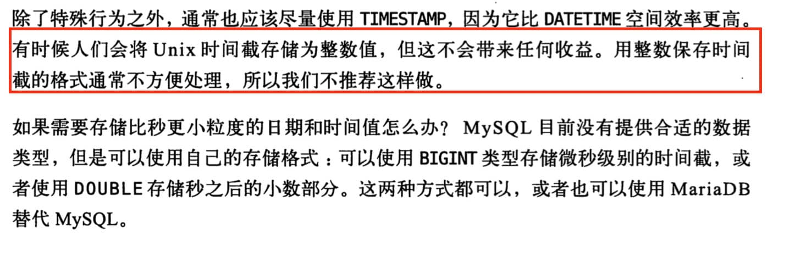

# MySQL 字段类型

MySQL 字段类型可以简单分为三大类：

- **数值类型**：整型（TINYINT、SMALLINT、MEDIUMINT、INT 和 BIGINT）、浮点型（FLOAT 和 DOUBLE）、定点型（DECIMAL）
- **字符串类型**：CHAR、VARCHAR、TINYTEXT、TEXT、MEDIUMTEXT、LONGTEXT、TINYBLOB、BLOB、MEDIUMBLOB 和 LONGBLOB 等，最常用的是 CHAR 和 VARCHAR。
- **日期时间类型**：YEAR、TIME、DATE、DATETIME 和 TIMESTAMP 等。


MySQL 字段类型比较多，我这里会挑选一些日常开发使用很频繁且面试常问的字段类型，以面试问题的形式来详细介绍。如无特殊说明，针对的都是 InnoDB 存储引擎。

另外，推荐阅读一下《高性能 MySQL(第三版)》的第四章，有详细介绍 MySQL 字段类型优化。

# 2. 整数类型的 UNSIGNED 属性有什么用？

MySQL 中的整数类型可以使用可选的 [UNSIGNED 属性来表示不允许负值的无符号整数]。使用 UNSIGNED 属性[可以将正整数的上限提高一倍]，因为它不需要存储负数值。

例如， TINYINT UNSIGNED 类型的取值范围是 0 ~ 255，而普通的 TINYINT 类型的值范围是 -128 ~ 127。
INT UNSIGNED 类型的取值范围是 0 ~ 4,294,967,295，而普通的 INT 类型的值范围是 2,147,483,648 ~ 2,147,483,647。

对于从 0 开始递增的 ID 列，使用 UNSIGNED 属性可以非常适合，因为不允许负值并且可以拥有更大的上限范围，提供了更多的 ID 值可用。

# 3. CHAR 和 VARCHAR 的区别是什么？

CHAR 和 VARCHAR 是最常用到的字符串类型，两者的主要区别在于：**[CHAR 是定长字符串，VARCHAR 是变长字符串]。**

CHAR 在存储时会在右边填充空格以达到指定的长度，检索时会去掉空格；VARCHAR 在存储时需要使用 1 或 2 个额外字节记录字符串的长度，检索时不需要处理。

CHAR 更适合[存储长度较短或者长度都差不多]的字符串，例如 Bcrypt 算法、MD5 算法加密后的密码、身份证号码。
VARCHAR 类型适合[存储长度不确定或者差异较大]的字符串，例如用户昵称、文章标题等。

CHAR(M) 和 VARCHAR(M) 的 M 都代表能够保存的字符数的最大值，无论是字母、数字还是中文，每个都只占用一个字符。

# 4. VARCHAR(100)和 VARCHAR(10)的区别是什么？

VARCHAR(100)和 VARCHAR(10)都是变长类型，表示能存储最多 100 个字符和 10 个字符。因此，VARCHAR (100) 可以满足更大范围的字符存储需求，有更好的业务拓展性。
而 VARCHAR(10)存储[超过 10 个字符时，就需要修改表结构才可以]。

虽说 VARCHAR(100)和 VARCHAR(10)能存储的字符范围不同，[但二者存储相同的字符串，所占用磁盘的存储空间其实是一样的]，这也是很多人容易误解的一点。

不过，VARCHAR(100) [会消耗更多的内存]。这是因为 VARCHAR 类型在内存中操作时，通常会分配固定大小的内存块来保存值，即使用字符类型中定义的长度。
例如在进行排序的时候，VARCHAR(100)是按照 100 这个长度来进行的，也就会消耗更多内存。

# 5. DECIMAL 和 FLOAT/DOUBLE 的区别是什么？

DECIMAL 和 FLOAT 的区别是：**DECIMAL 是定点数，FLOAT/DOUBLE 是浮点数。DECIMAL 可以存储精确的小数值，FLOAT/DOUBLE 只能存储近似的小数值。**

DECIMAL 用于存储具有精度要求的小数，例如与货币相关的数据，可以避免浮点数带来的精度损失。

在 Java 中，MySQL 的 DECIMAL 类型对应的是 Java 类 `java.math.BigDecimal`。

# 6. 为什么不推荐使用 TEXT 和 BLOB？

TEXT 类型类似于 CHAR（0-255 字节）和 VARCHAR（0-65,535 字节），但可以存储更长的字符串，即长文本数据，例如博客内容。

| 类型       | 可存储大小           | 用途           |
| ---------- | -------------------- | -------------- |
| TINYTEXT   | 0-255 字节           | 一般文本字符串 |
| TEXT       | 0-65,535 字节        | 长文本字符串   |
| MEDIUMTEXT | 0-16,772,150 字节    | 较大文本数据   |
| LONGTEXT   | 0-4,294,967,295 字节 | 极大文本数据   |

BLOB 类型主要用于存储二进制大对象，例如[图片、音视频]等文件。

| 类型       | 可存储大小 | 用途                     |
| ---------- | ---------- | ------------------------ |
| TINYBLOB   | 0-255 字节 | 短文本二进制字符串       |
| BLOB       | 0-65KB     | 二进制字符串             |
| MEDIUMBLOB | 0-16MB     | 二进制形式的长文本数据   |
| LONGBLOB   | 0-4GB      | 二进制形式的极大文本数据 |

在日常开发中，很少使用 TEXT 类型，但偶尔会用到，而 BLOB 类型则基本不常用。如果预期长度范围可以通过 VARCHAR 来满足，建议避免使用 TEXT。

数据库规范通常不推荐使用 BLOB 和 TEXT 类型，这两种类型具有一些[缺点和限制]，例如：
- 不能有默认值。
- 在使用临时表时[无法使用内存临时表]，只能在磁盘上创建临时表（《高性能 MySQL》书中有提到）。
- 检索[效率较低]。
- [不能直接创建索引]，需要指定前缀长度。
- 可能[会消耗大量的网络和 IO 带宽]。
- 可能导致表上的 DML 操作变慢。
- ......

# 7. DATETIME 和 TIMESTAMP 的区别是什么？

DATETIME 类型没有时区信息，[TIMESTAMP 和时区有关]。

TIMESTAMP 只需要使用 4 个字节的存储空间，但是 DATETIME 需要耗费 8 个字节的存储空间。但是，这样同样造成了一个问题，[Timestamp 表示的时间范围更小]。

- DATETIME：1000-01-01 00:00:00 ~ 9999-12-31 23:59:59
- Timestamp：1970-01-01 00:00:01 ~ 2037-12-31 23:59:59

关于两者的详细对比，请参考我写的[MySQL 时间类型数据存储建议](./some-thoughts-on-database-storage-time.md)。

# 8. NULL 和 '' 的区别是什么？

`NULL` 跟 `''`(空字符串)是两个完全不一样的值，区别如下：

- `NULL` 代表一个不确定的值,就算[是两个 `NULL`,它俩也不一定相等]。例如，`SELECT NULL=NULL`的结果为 false，
   但是在我们使用`DISTINCT`,`GROUP BY`,`ORDER BY`时,`NULL`又被认为是相等的。
- `''`的长度是 0，是不占用空间的，而`NULL` 是需要占用空间的。
- `NULL` [会影响聚合函数的结果]。例如，`SUM`、`AVG`、`MIN`、`MAX` 等聚合函数会忽略 `NULL` 值。 
   `COUNT` 的处理方式取决于参数的类型。如果参数是 `*`(`COUNT(*)`)，则会统计所有的记录数，包括 `NULL` 值；
    如果参数是某个字段名(`COUNT(列名)`)，则会忽略 `NULL` 值，只统计非空值的个数。
- 查询 `NULL` 值时，[必须使用 `IS NULL` 或 `IS NOT NULLl` 来判断]，而不能使用 =、!=、 <、> 之类的比较运算符。而`''`是可以使用这些比较运算符的。

看了上面的介绍之后，相信你对另外一个高频面试题：“为什么 MySQL 不建议使用 `NULL` 作为列默认值？”也有了答案。

# 9. Boolean 类型如何表示？

MySQL 中没有专门的布尔类型，而是用 TINYINT(1) 类型来表示布尔值。TINYINT(1) 类型可以存储 0 或 1，分别对应 false 或 true。

# 10. MYSQL日期类型选择

## 总结

MySQL 中时间到底怎么存储才好？Datetime?Timestamp?还是数值时间戳？

并没有一个银弹，很多程序员会觉得数值型时间戳是真的好，效率又高还各种兼容，但是很多人又觉得它表现的不够直观。

《高性能 MySQL 》这本神书的作者就是推荐 Timestamp，原因是数值表示时间不够直观。下面是原文：



每种方式都有各自的优势，根据实际场景选择最合适的才是王道。下面再对这三种方式做一个简单的对比，以供大家实际开发中选择正确的存放时间的数据类型：

| 类型         | 存储空间 | 日期格式                       | 日期范围                                                     | 是否带时区信息 |
| ------------ | -------- | ------------------------------ | ------------------------------------------------------------ | -------------- |
| DATETIME     | 5~8字节  | YYYY-MM-DD hh:mm:ss[.fraction] | 1000-01-01 00:00:00[.000000] ～ 9999-12-31 23:59:59[.999999] | 否             |
| TIMESTAMP    | 4~7字节  | YYYY-MM-DD hh:mm:ss[.fraction] | 1970-01-01 00:00:01[.000000] ～ 2038-01-19 03:14:07[.999999] | 是             |
| 数值型时间戳 | 4字节    | 全数字如1578707612             | 1970-01-01 00:00:01之后的时间                                | 否             |


## 10.1 不要用字符串存储日期

和绝大部分对数据库不太了解的新手一样，我在大学的时候就这样干过，甚至认为这样是一个不错的表示日期的方法。毕竟简单直白，容易上手。

但是，这是不正确的做法，主要会有下面两个问题：

1. 字符串占用的空间更大！
2. 字符串存储的日期效率比较低（逐个字符进行比对），无法用日期相关的 API 进行计算和比较。

## 10.2 Datetime 和 Timestamp 之间的抉择

Datetime 和 Timestamp 是 MySQL 提供的两种比较相似的保存时间的数据类型，可以精确到秒。他们两者究竟该如何选择呢？

下面我们来简单对比一下二者。

### 10.2.1 时区信息

**DateTime 类型是没有时区信息的（时区无关）** ，DateTime 类型保存的时间都是当前会话所设置的时区对应的时间。这样就会有什么问题呢？
当你的时区更换之后，比如你的服务器更换地址或者更换客户端连接时区设置的话，就会导致你从数据库中读出的时间错误。

**Timestamp 和时区有关**。Timestamp 类型字段的值会随着服务器时区的变化而变化，自动换算成相应的时间，说简单点就是在不同时区，
查询到同一个条记录此字段的值会不一样。

```sql
# 查看当前会话时区
SELECT @@session.time_zone;
# 设置当前会话时区
SET time_zone = 'Europe/Helsinki';
SET time_zone = "+00:00";
# 数据库全局时区设置
SELECT @@global.time_zone;
# 设置全局时区
SET GLOBAL time_zone = '+8:00';
SET GLOBAL time_zone = 'Europe/Helsinki';
```

### 10.2.2 占用空间

在 MySQL 5.6.4 之前，DateTime 和 Timestamp 的存储空间是固定的，分别为 8 字节和 4 字节。但是从 MySQL 5.6.4 开始，它们的存储空间会根据毫秒精度的不同而变化，
[DateTime 的范围是 5~8 字节，Timestamp 的范围是 4~7 字节]

### 10.2.3 表示范围

Timestamp 表示的时间范围更小，只能到 2038 年：

- DateTime：1000-01-01 00:00:00.000000 ~ 9999-12-31 23:59:59.499999
- Timestamp：1970-01-01 00:00:01.000000 ~ 2038-01-19 03:14:07.499999

### 10.2.4 性能

由于 TIMESTAMP 需要根据时区进行转换，所以从毫秒数转换到 TIMESTAMP 时，不仅要调用一个简单的函数，还要调用操作系统底层的系统函数。
这个系统函数为了保证操作系统时区的一致性，需要进行加锁操作，这就降低了效率。

DATETIME 不涉及时区转换，所以不会有这个问题。

为了避免 TIMESTAMP 的时区转换问题，建议使用指定的时区，而不是依赖于操作系统时区。

## 10.3 数值时间戳是更好的选择吗？

很多时候，我们也会使用 int 或者 bigint 类型的数值也就是数值时间戳来表示时间。

这种存储方式的具有 Timestamp 类型的所具有一些优点，并且使用它的进行日期排序以及对比等操作的效率会更高，跨系统也很方便，毕竟只是存放的数值。缺点也很明显，就是数据的可读性太差了，你无法直观的看到具体时间。

时间戳的定义如下：

> 时间戳的定义是从一个基准时间开始算起，这个基准时间是「1970-1-1 00:00:00 +0:00」，从这个时间开始，用整数表示，以秒计时，随着时间的流逝这个时间整数不断增加。这样一来，我只需要一个数值，就可以完美地表示时间了，而且这个数值是一个绝对数值，即无论的身处地球的任何角落，这个表示时间的时间戳，都是一样的，生成的数值都是一样的，并且没有时区的概念，所以在系统的中时间的传输中，都不需要进行额外的转换了，只有在显示给用户的时候，才转换为字符串格式的本地时间。

数据库中实际操作：

```sql
mysql> select UNIX_TIMESTAMP('2020-01-11 09:53:32');
+---------------------------------------+
| UNIX_TIMESTAMP('2020-01-11 09:53:32') |
+---------------------------------------+
|                            1578707612 |
+---------------------------------------+
1 row in set (0.00 sec)

mysql> select FROM_UNIXTIME(1578707612);
+---------------------------+
| FROM_UNIXTIME(1578707612) |
+---------------------------+
| 2020-01-11 09:53:32       |
+---------------------------+
1 row in set (0.01 sec)
```
