# Mysql 日志

MySQL 日志常见的面试题有：

- MySQL 中常见的日志有哪些？
- 慢查询日志有什么用？
- binlog 主要记录了什么？
- redo log 如何保证事务的持久性？
- 页修改之后为什么不直接刷盘呢？
- binlog 和 redolog 有什么区别？
- undo log 如何保证事务的原子性？
- ......

## 1. 执行一条update的流程
```sql
UPDATE t_user SET name = 'xiaolin' WHERE id = 1;
```
查询语句的那一套流程，更新语句也是同样会走一遍：

- 客户端先通过连接器建立连接，连接器自会判断用户身份；
- 因为这是一条 update 语句，所以不需要经过查询缓存，但是表上有更新语句，
  [是会把整个表的查询缓存清空的，所以说查询缓存很鸡肋]，在 MySQL 8.0 就被移除这个功能了；
- 解析器会通过词法分析识别出关键字 update，表名等等，构建出语法树，接着还会做语法分析，
   判断输入的语句是否符合 MySQL 语法；
- 预处理器会判断表和字段是否存在；
- 优化器确定执行计划，因为 where 条件中的 id 是主键索引，所以决定要使用 id 这个索引；
- 执行器负责具体执行，找到这一行，然后更新。

具体更新一条记录 `UPDATE t_user SET name = 'xiaolin' WHERE id = 1;` 的流程如下:
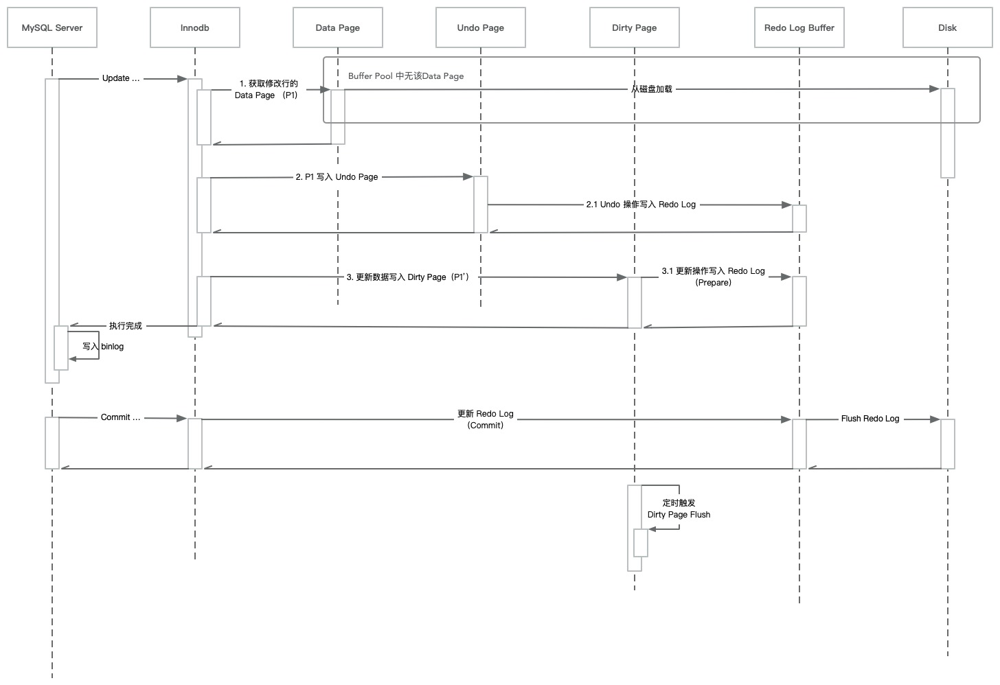


1. 执行器负责具体执行，会调用存储引擎的接口，通过主键索引树搜索获取 id = 1 这一行记录：
   - 如果 id=1 这一行所在的数据页本来就在 buffer pool 中，就直接返回给执行器更新；
   - 如果记录不在 buffer pool，将数据页从磁盘读入到 buffer pool，返回记录给执行器。
2. 执行器得到聚簇索引记录后，会看一下更新前的记录和更新后的记录是否一样：
   - 如果一样的话就不进行后续更新流程；
   - 如果不一样的话就把更新前的记录和更新后的记录都当作参数传给 InnoDB 层，让 InnoDB 真正的执行更新记录的操作；
3. 开启事务， InnoDB 层更新记录前，首先要记录相应的 undo log，因为这是更新操作，需要把被更新的列的旧值记下来，
    也就是要生成一条 undo log，undo log 会写入 Buffer Pool 中的 Undo 页面，不过在内存修改该 Undo 页面后，
     需要记录对应的 redo log。
4. InnoDB 层开始更新记录，会先更新内存（同时标记为脏页），然后将记录写到 redo log 里面，这个时候更新就算完成了。
   为了减少磁盘I/O，不会立即将脏页写入磁盘，后续由后台线程选择一个合适的时机将脏页写入到磁盘。
    这就是 **WAL 技术**，MySQL 的写操作并不是立刻写到磁盘上，而是先写 redo 日志，
     然后在合适的时间再将修改的行数据写到磁盘上。
5. 至此，一条记录更新完了。
6. 在一条更新语句执行完成后，然后开始记录该语句对应的 binlog，此时记录的 binlog 会被保存到 binlog cache，
   并没有刷新到硬盘上的 binlog 文件，在事务提交时才会统一将该事务运行过程中的所有 binlog 刷新到硬盘。
7. 事务提交（为了方便说明，这里不说组提交的过程，只说两阶段提交）：
   - **prepare 阶段**：将 redo log 对应的事务状态设置为 prepare，然后将 redo log 刷新到硬盘；
   - **commit 阶段**：将 binlog 刷新到磁盘，接着调用引擎的提交事务接口，将 redo log 状态设置为 commit（将事务设置为 commit 状态后，刷入到磁盘 redo log 文件）；
8. 至此，一条更新语句执行完成。


不过，更新语句的流程会涉及到  undo log（回滚日志）、redo log（重做日志） 、binlog （归档日志）这三种日志：

- **undo log（回滚日志）**：是 Innodb 存储引擎层生成的日志，实现了事务中的**原子性**，主要**用于事务回滚和 MVCC**。
- **redo log（重做日志）**：是 Innodb 存储引擎层生成的日志，实现了事务中的**持久性**，主要**用于掉电等故障恢复**；
- **binlog （归档日志）**：是 Server 层生成的日志，主要**用于数据备份和主从复制**；

所以这次就带着这个问题，看看这三种日志是怎么工作的。

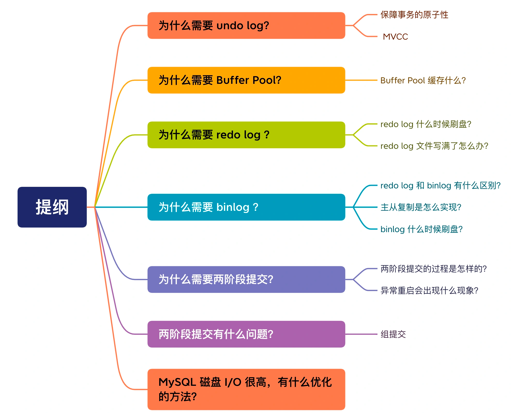

# 2 undo log
## 2.1 基本概念
- 内容：
  - 逻辑格式的日志，在执行undo的时候，仅仅是将数据从逻辑上恢复至事务之前的状态， 
     而不是从物理页面上操作实现的，这一点是不同于redo log的。
- 什么时候产生：
  - 事务开始之前，将当前是的版本生成undo log，
  - undo 也会产生 redo 来保证undo log的可靠性
- 什么时候释放：
  - 当事务提交之后，undo log并不能立马被删除，而是放入待清理的链表， 
    由purge线程判断是否由其他事务在使用undo段中表的上一个事务之前的版本信息，
    决定是否可以清理undo log的日志空间。
  
对应的物理文件：
- 5.6之前：
  - undo表空间位于[共享表空间的回滚段]，共享表空间默认名称是ibdata，位于数据文件目录
- 5.6之后：
  - undo表空间[可以配置成独立的文件]，但是提前需要在配置文件中配置，
     完成数据库初始化后生效且不可改变undo log文件的个数
    - innodb_undo_directory = /data/undospace/ 	  –undo独立表空间的存放目录
    - innodb_undo_logs = 128					  –回滚段为128KB
    - innodb_undo_tablespaces = 4 			  	  –指定有4个undo log文件


## 2.2 为什么要独立配置undo表空间：
undo是在事务开始之前保存的被修改数据的一个版本，产生undo日志的时候，
同样会伴随类似于保护事务持久化机制的redo log的产生。

[默认情况下undo文件是保持在共享表空间的]，也即ibdatafile文件中，当数据库中发生一些大的事务性操作的时候，
要生成大量的undo信息，全部保存在共享表空间中的。因此共享表空间可能会变的很大，默认情况下，
也就是undo 日志[使用共享表空间的时候，被“撑大”的共享表空间是不会也不能自动收缩的]

## 2.3 作用：
- **实现事务回滚，保障事务的原子性**。事务处理过程中，如果出现了错误或者用户执
  行了 ROLLBACK 语句，MySQL 可以利用 undo log 中的历史数据将数据恢复到事务开始之前的状态。
- **实现 MVCC（多版本并发控制）关键因素之一**。MVCC 是通过 ReadView + undo log 实现的。
   undo log 为每条记录保存多份历史数据，MySQL 在执行快照读（普通 select 语句）的时候，
   会根据事务的 Read View 里的信息，顺着 undo log 的版本链找到满足其可见性的记录。


## 2.4 为什么需要undo log
那么，考虑一个问题。一个事务在执行过程中，在还没有提交事务之前，如果MySQL 发生了崩溃，
要怎么回滚到事务之前的数据呢？

如果我们每次在事务执行过程中，都记录下回滚时需要的信息到一个日志里，那么在事务执行中途发生了 MySQL 崩溃后，
就不用担心无法回滚到事务之前的数据，我们可以通过这个日志回滚到事务之前的数据。

实现这一机制就是  **undo log（回滚日志），它保证了事务的 [ACID 特性](https://xiaolincoding.com/mysql/transaction/mvcc.html#%E4%BA%8B%E5%8A%A1%E6%9C%89%E5%93%AA%E4%BA%9B%E7%89%B9%E6%80%A7)中的原子性（Atomicity）**。

undo log 是一种用于撤销回退的日志。在事务没提交之前，MySQL 会先记录更新前的数据到 undo log 
日志文件里面，当事务回滚时，可以利用 undo log 来进行回滚。如下图：

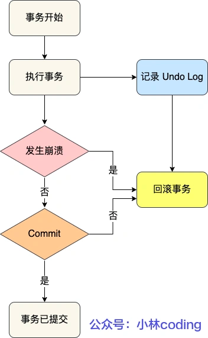

每当 InnoDB 引擎对一条记录进行操作（修改、删除、新增）时，要把回滚时需要的信息都记录到 undo log 里，比如：

- 在**插入**一条记录时，要把这条记录的主键值记下来，这样之后回滚时只需要把这个主键值对应的记录**删掉**就好了；
- 在**删除**一条记录时，要把这条记录中的内容都记下来，这样之后回滚时再把由这些内容组成的记录**插入**到表中就好了；
- 在**更新**一条记录时，要把被更新的列的旧值记下来，这样之后回滚时再把这些列**更新为旧值**就好了。

在发生回滚时，就读取 undo log 里的数据，然后做原先相反操作。比如当 delete 一条记录时，undo log 
中会把记录中的内容都记下来，然后执行回滚操作的时候，就读取 undo log 里的数据，然后进行 insert 操作。

不同的操作，需要记录的内容也是不同的，所以不同类型的操作（修改、删除、新增）产生的 undo log 的格式也是不同的，

一条记录的每一次更新操作产生的 undo log 格式都有一个 roll_pointer 指针和一个 trx_id 事务id：

- 通过 trx_id 可以知道该记录是被哪个事务修改的；
- 通过 roll_pointer 指针可以将这些 undo log 串成一个链表，这个链表就被称为版本链；

版本链如下图：

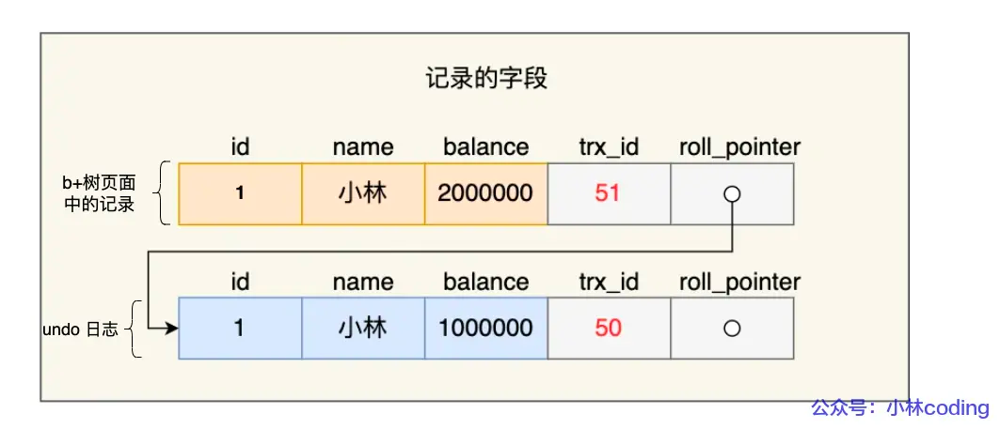

另外，**undo log 还有一个作用，通过 [ReadView + undo log 实现] MVCC（多版本并发控制）**。

对于「读提交」和「可重复读」隔离级别的事务来说，它们的快照读（普通 select 语句）是通过 Read View  
+ undo log 来实现的，它们的区别在于创建 Read View 的时机不同：

- 「读提交」隔离级别是在每个 select 都会生成一个新的 Read View，也意味着，事务期间的多次读取同一条数据，
  前后两次读的数据可能会出现不一致，因为可能这期间另外一个事务修改了该记录，并提交了事务。
- 「可重复读」隔离级别是启动事务时生成一个 Read View，然后整个事务期间都在用这个 Read View，
   这样就保证了在事务期间读到的数据都是事务启动前的记录。

这两个隔离级别实现是通过「事务的 Read View 里的字段」和「记录中的两个隐藏列（trx_id 和 roll_pointer）」
的比对，如果不满足可见行，就会顺着 undo log 版本链里找到满足其可见性的记录，从而控制并发事务访问同一个记录时的行为，
这就叫 MVCC（多版本并发控制）

# 3 Buffer Pool

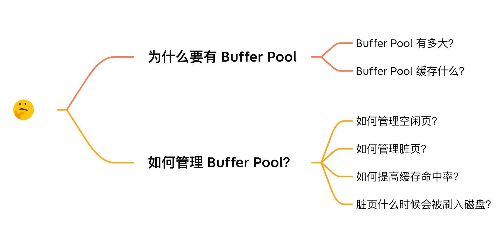

## 总结

Innodb 存储引擎设计了一个**缓冲池（*Buffer Pool*）**，来提高数据库的读写性能。

Buffer Pool 以页为单位缓冲数据，可以通过 `innodb_buffer_pool_size` 参数调整缓冲池的大小，默认是 128 M。

Innodb 通过三种链表来管理缓页：

- Free List （空闲页链表），管理空闲页；
- Flush List （脏页链表），管理脏页；
- LRU List，管理脏页+干净页，将最近且经常查询的数据缓存在其中，而不常查询的数据就淘汰出去。；

InnoDB 对 LRU 做了一些优化，我们熟悉的 LRU 算法通常是将最近查询的数据放到 LRU 链表的头部，而 InnoDB 做 2 点优化：

- 将 LRU 链表 分为**young 和 old 两个区域**，加入缓冲池的页，优先插入 old 区域；页被访问时，
  才进入 young 区域，目的是为了解决预读失效的问题。
- 当**「页被访问」且「 old 区域停留时间超过 `innodb_old_blocks_time` 阈值（默认为1秒）」**时，
  才会将页插入到 young 区域，否则还是插入到 old 区域，目的是[为了解决批量数据访问，大量热数据淘汰]的问题。

可以通过调整 `innodb_old_blocks_pc` 参数，设置  young 区域和 old 区域比例。

在开启了慢 SQL 监控后，如果你发现「偶尔」会出现一些用时稍长的 SQL，这可因为脏页在刷新到磁盘时导致数据库性能抖动。
如果在很短的时间出现这种现象，就需要[调大 Buffer Pool 空间或 redo log 日志的大小]。

## 3.1 Buffer Pool 的概念和作用
MySQL 的数据都是存在磁盘中的，那么我们要更新一条记录的时候，得先要从磁盘读取该记录，
然后在内存中修改这条记录。那修改完这条记录是选择直接写回到磁盘，还是选择缓存起来呢？

当然是[缓存起来好，这样下次有查询语句命中了这条记录，直接读取缓存中的记录]，就不需要从磁盘获取数据了。

为此，Innodb 存储引擎设计了一个**缓冲池（Buffer Pool）**，来提高数据库的读写性能。

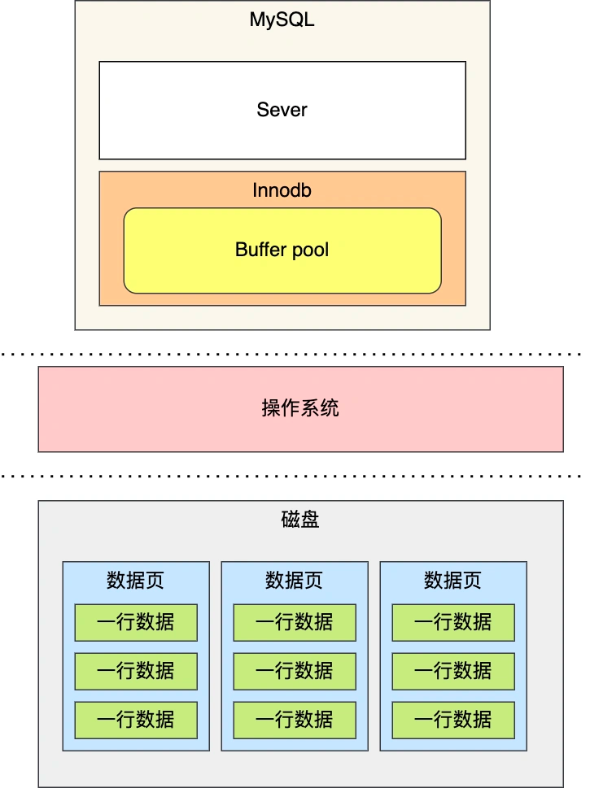

有了 Buffer Poo 后：

- 当读取数据时，如果数据存在于 Buffer Pool 中，客户端就会直接读取 Buffer Pool 中的数据，否则再去磁盘中读取。
- 当修改数据时，如果数据存在于  Buffer Pool  中，那直接修改 Buffer Pool 中数据所在的页，然后将其页设置为脏页（该页的内存数据和磁盘上的数据已经不一致），为了减少磁盘I/O，不会立即将脏页写入磁盘，后续由后台线程选择一个合适的时机将脏页写入到磁盘。

## 3.2 Buffer Pool 有多大？

Buffer Pool 是在 MySQL 启动的时候，向[操作系统申请的一片连续的内存空间]，
默认配置下 Buffer Pool 只有 `128MB` 。

可以通过调整 `innodb_buffer_pool_size` 参数来设置 Buffer Pool 的大小，
一般建议设置成[可用物理内存的 60%~80%]。


## 3.3  Buffer Pool 缓存什么？

InnoDB 会把存储的数据划分为若干个「页」，以页作为磁盘和内存交互的基本单位，一个页的默认大小为 16KB。
因此，Buffer Pool 同样需要按「页」来划分。

在 MySQL 启动的时候，**InnoDB 会为 Buffer Pool 申请一片连续的内存空间，然后按照默认的`16KB`的大小
划分出一个个的页， Buffer Pool 中的页就叫做缓存页**。此时这些缓存页都是空闲的，之后随着程序的运行，
会有磁盘上的页被缓存到 Buffer Pool 中。

所以，MySQL 刚启动的时候，你会观察到使用的虚拟内存空间很大，而使用到的物理内存空间却很小，
这是因为只有这些虚拟内存被访问后，操作系统才会触发缺页中断，申请物理内存，接着将虚拟地址和物理地址建立映射关系。

Buffer Pool 除了缓存[「索引页」和「数据页」，还包括了 Undo 页，插入缓存、自适应哈希索引、锁信息]等等。

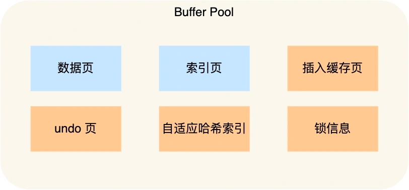

> Undo 页是记录什么？

开启事务后，InnoDB 层更新记录前，首先要记录相应的 undo log，如果是更新操作，需要把被更新的列的旧值记下来，
也就是要生成一条 undo log，undo log 会写入 Buffer Pool 中的 Undo 页面。

> 查询一条记录，就只需要缓冲一条记录吗？

不是的。

当我们查询一条记录时，InnoDB 是会把整个页的数据加载到 Buffer Pool 中，将页加载到 Buffer Pool 后，
再通过页里的「页目录」去定位到某条具体的记录。

> 控制快信息

为了更好的管理这些在 Buffer Pool 中的缓存页，InnoDB 为每一个缓存页都创建了一个**控制块**，
控制块信息包括[「缓存页的表空间、页号、缓存页地址、链表节点」]等等。

控制块也是占有内存空间的，它是放在 Buffer Pool 的最前面，接着才是缓存页，如下图：


上图中控制块和缓存页之间灰色部分称为碎片空间。

>  为什么会有碎片空间呢？

你想想啊，每一个控制块都对应一个缓存页，那在分配足够多的控制块和缓存页后，可能剩余的那点儿空间不够一对控制块和缓存页的大小，
自然就用不到喽，这个用不到的那点儿内存空间就被称为碎片了。

当然，如果你把 Buffer Pool 的大小设置的刚刚好的话，也可能不会产生碎片。


## 3.4  如何管理 Buffer Pool？

### 3.4.1 如何管理空闲页？-- free 链表

Buffer Pool 是一片连续的内存空间，当 MySQL 运行一段时间后，这片连续的[内存空间中的缓存页既有空闲的，也有被使用]的。

那当我们从磁盘读取数据的时候，总不能通过遍历这一片连续的内存空间来找到空闲的缓存页吧，这样效率太低了。

所以，为了能够快速找到空闲的缓存页，可以使用链表结构，将空闲缓存页的「控制块」作为链表的节点，
这个链表称为 **Free 链表**（空闲链表）。

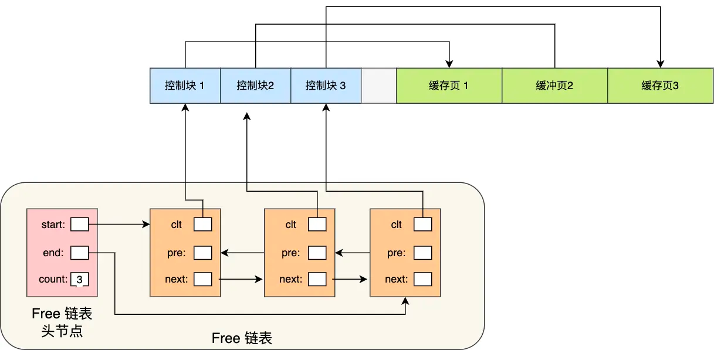

Free 链表上除了有控制块，还有一个[头节点]，该头节点包含链表的[头节点地址，尾节点地址，以及当前链表中节点的数量]等信息。

Free 链表节点是一个一个的控制块，而每个控制块包含着[对应缓存页的地址]，所以相当于[Free 链表节点都对应一个空闲的缓存页]。

有了 Free 链表后，每当需要从磁盘中加载一个页到 Buffer Pool 中时，就从 Free链表中取一个空闲的缓存页，
并且把该缓存页对应的控制块的信息填上，然后把该缓存页对应的控制块从 Free 链表中移除。

### 3.4.2 如何管理脏页？--flush 链表

设计 Buffer Pool 除了能提高读性能，还能提高写性能，也就是更新数据的时候，不需要每次都要写入磁盘，
而是将 Buffer Pool 对应的缓存页标记为**脏页**，然后再[由后台线程将脏页写入到磁盘]。

那为了能快速知道哪些缓存页是脏的，于是就设计出 **Flush 链表**，它跟 Free 链表类似的，链表的节点也是控制块，
区别在于 Flush 链表的元素都是脏页。


有了 Flush 链表后，后台线程就可以遍历 Flush 链表，将脏页写入到磁盘。

### 3.4.3 如何提高缓存命中率？

Buffer Pool  的大小是有限的，对于一些频繁访问的数据我们希望可以一直留在 Buffer Pool 中，
而一些很少访问的数据希望可以在某些时机可以淘汰掉，从而保证 Buffer Pool  不会因为满了而导致无法再缓存新的数据，
同时还能保证常用数据留在 Buffer Pool 中。

要实现这个，最容易想到的就是 LRU（Least recently used）算法。

该算法的思路是，链表头部的节点是最近使用的，而链表末尾的节点是最久没被使用的。那么，当空间不够了，
就淘汰最久没被使用的节点，从而腾出空间。

简单的 LRU 算法的实现思路是这样的：

- 当访问的页在 Buffer Pool  里，就直接把该页对应的 LRU 链表节点移动到链表的头部。
- 当访问的页不在 Buffer Pool 里，除了要把页放入到 LRU 链表的头部，[还要淘汰  LRU 链表末尾的节点]。

比如下图，假设 LRU 链表长度为 5，LRU 链表从左到右有 1，2，3，4，5 的页。

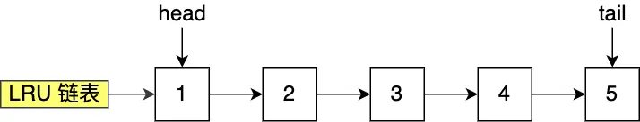

如果访问了 3 号的页，因为 3 号页在 Buffer Pool 里，所以把 3 号页移动到头部即可。

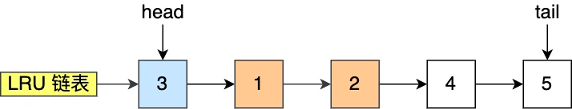

而如果接下来，访问了 8 号页，因为 8 号页不在 Buffer Pool  里，所以需要先淘汰末尾的 5 号页，然后再将 8 号页加入到头部。

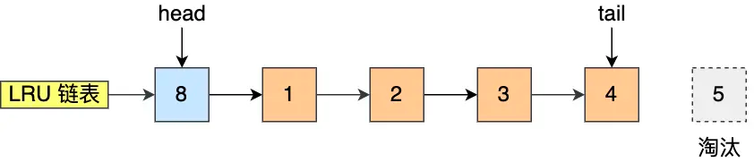

到这里我们可以知道，Buffer Pool 里有三种页和链表来管理数据。

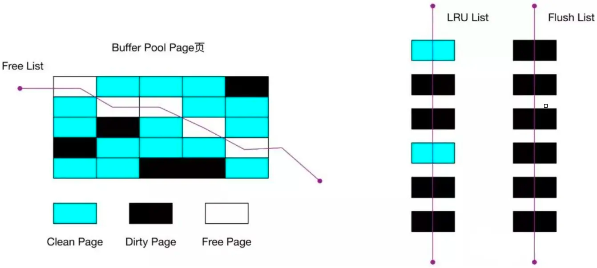

图中：

- Free Page（空闲页），表示此页未被使用，位于 Free 链表；
- Clean Page（干净页），表示此页已被使用，但是页面未发生修改，位于LRU 链表。
- Dirty Page（脏页），表示此页「已被使用」且「已经被修改」，其数据和磁盘上的数据已经不一致。当脏页上的数据写入磁盘后，内存数据和磁盘数据一致，那么该页就变成了干净页。脏页同时存在于 LRU 链表和 Flush 链表。

### 3.4.4 Mysql的LRU算法
简单的 LRU 算法并没有被  MySQL 使用，因为简单的 LRU 算法无法避免下面这两个问题：

- 预读失效；
-  Buffer Pool  污染；

> 什么是预读失效？

先来说说 MySQL 的预读机制。程序是有空间局部性的，靠近当前被访问数据的数据，在未来很大概率会被访问到。

所以，MySQL 在加载数据页时，会[提前把它相邻的数据页一并加载进来，目的是为了减少磁盘 IO]。

但是可能这些**被提前加载进来的数据页，并没有被访问**，相当于这个预读是白做了，这个就是**预读失效**。

如果使用简单的 LRU 算法，就会[把预读页放到 LRU 链表头部]，而当  Buffer Pool空间不够的时候，还需要把末尾的页淘汰掉。

如果这些预读页如果一直不会被访问到，就会出现一个很奇怪的问题，不会被访问的预读页却占用了 LRU 链表前排的位置，
而末尾淘汰的页，可能是频繁访问的页，这样就大大降低了缓存命中率。

> 怎么解决预读失效而导致缓存命中率降低的问题？

我们不能因为害怕预读失效，而将预读机制去掉，大部分情况下，局部性原理还是成立的。

要避免预读失效带来影响，最好就是**让预读的页停留在 Buffer Pool 里的时间要尽可能的短，
让真正被访问的页才移动到 LRU 链表的头部，从而保证真正被读取的热数据留在 Buffer Pool 里的时间尽可能长**。

那到底怎么才能避免呢？

MySQL 是这样做的，它改进了 LRU 算法，将 LRU 划分了 2 个区域：**old 区域 和 young 区域**。

young 区域在 LRU 链表的前半部分，old 区域则是在后半部分，如下图：

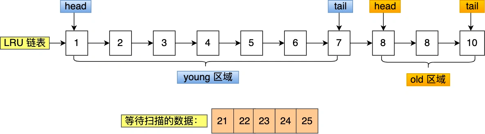

old 区域占整个 LRU 链表长度的比例可以通过 `innodb_old_blocks_pc` 参数来设置，默认是 37，
代表整个 LRU 链表中 young 区域与 old 区域比例是 63:37。

**划分这两个区域后，[预读的页就只需要加入到 old 区域的头部]，当页被真正访问的时候，才将页插入 young 区域的头部**。
如果预读的页一直没有被访问，就会从 old 区域移除，这样就不会影响 young 区域中的热点数据。

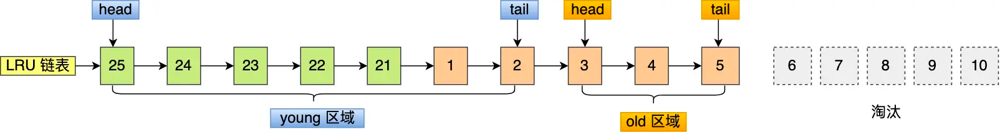

接下来，给大家举个例子。

假设有一个长度为 10 的 LRU 链表，其中 young 区域占比 70 %，old 区域占比 30 %。


现在有个编号为 20 的页被预读了，这个页只会被插入到  old 区域头部，而 old 区域末尾的页（10号）会被淘汰掉。

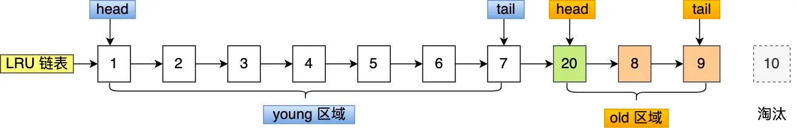

如果 20 号页一直不会被访问，它也没有占用到 young 区域的位置，而且还会比 young 区域的数据更早被淘汰出去。

如果 20 号页被预读后，立刻被访问了，那么就会将它插入到 young 区域的头部，young 区域末尾的页（7号），
会被挤到 old 区域，作为 old 区域的头部，这个过程并不会有页被淘汰。

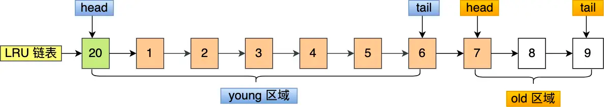

虽然通过划分 old 区域 和 young 区域避免了预读失效带来的影响，但是还有个问题无法解决，
那就是  Buffer Pool  污染的问题。

> 什么是  Buffer Pool  污染？

当某一个 SQL 语句**扫描了大量的数据**时，在  Buffer Pool 空间比较有限的情况下，
可能会将 **Buffer Pool 里的所有页都替换出去，导致大量热数据被淘汰了**，等这些热数据又被再次访问的时候，
由于缓存未命中，就会产生大量的磁盘 IO，MySQL 性能就会急剧下降，这个过程被称为 **[Buffer Pool  污染]**。

注意， Buffer Pool  污染并不只是查询语句查询出了大量的数据才出现的问题，即使查询出来的结果集很小，
也会造成 Buffer Pool  污染。

比如，在一个数据量非常大的表，执行了这条语句：

```sql
select * from t_user where name like "%xiaolin%";
```

可能这个查询出来的结果就几条记录，但是[由于这条语句会发生索引失效，所以这个查询过程是全表扫描的]，
接着会发生如下的过程：

- 从磁盘读到的页加入到 LRU 链表的 old 区域头部；
- 当从页里读取行记录时，也就是页被访问的时候，就要将该页放到 young 区域头部；
- 接下来拿行记录的 name 字段和字符串 xiaolin 进行模糊匹配，如果符合条件，就加入到结果集里；
- 如此往复，直到扫描完表中的所有记录。

经过这一番折腾，[原本 young 区域的热点数据都会被替换掉]。

举个例子，假设需要批量扫描：21，22，23，24，25 这五个页，这些页都会被逐一访问（读取页里的记录）。


在批量访问这些数据的时候，会被逐一插入到 young 区域头部。


可以看到，原本在 young 区域的热点数据 6 和 7 号页都被淘汰了，这就是  Buffer Pool  污染的问题。

> 怎么解决出现   Buffer Pool  污染而导致缓存命中率下降的问题？

像前面这种全表扫描的查询，很多缓冲页其实只会被访问一次，但是它却只因为被访问了一次而进入到 young 区域，
从而导致热点数据被替换了。

LRU 链表中 young 区域就是热点数据，只要我们提高进入到 young 区域的门槛，就能有效地保证 young 
区域里的热点数据不会被替换掉。

MySQL 是这样做的，进入到 young 区域条件增加了一个**停留在 old 区域的时间判断**。

具体是这样做的，在对某个处在 old 区域的缓存页进行第一次访问时，就在它对应的控制块中记录下来这个访问时间：

- 如果后续的访问时间与第一次访问的时间**在某个时间间隔内**，那么**该缓存页就不会被从 old 区域移动
  到 young 区域的头部**；
- 如果后续的访问时间与第一次访问的时间**不在某个时间间隔内**，那么**该缓存页移动到 young 区域的头部**；

这个间隔时间是由 `innodb_old_blocks_time` 控制的，默认是 1000 ms。

也就说，**只有同时满足「被访问」与「在 old 区域停留时间超过 1 秒」两个条件，才会被插入到 young 区域头部**，
这样就解决了 Buffer Pool  污染的问题 。

另外，MySQL 针对 young 区域其实做了一个优化，为了防止 young 区域节点频繁移动到头部。
young [区域前面 1/4 被访问不会移动到链表头部，只有后面的 3/4被访问了才会]。

### 3.4.5 脏页什么时候会被刷入磁盘？

引入了 Buffer Pool  后，当修改数据时，首先是修改  Buffer Pool  中数据所在的页，然后将其页设置为脏页，
但是磁盘中还是原数据。

因此，脏页需要被刷入磁盘，保证缓存和磁盘数据一致，但是若每次修改数据都刷入磁盘，则性能会很差，
因此一般都会在一定时机进行批量刷盘。

可能大家担心，如果在脏页还没有来得及刷入到磁盘时，MySQL 宕机了，不就丢失数据了吗？

这个不用担心，InnoDB 的更新操作采用的是 Write Ahead Log 策略，[即先写日志，再写入磁盘]，
通过 redo log 日志让 MySQL 拥有了崩溃恢复能力。

下面几种情况会触发脏页的刷新：

- 当 redo log 日志满了的情况下，会主动触发脏页刷新到磁盘；
- Buffer Pool 空间不足时，需要将一部分数据页淘汰掉，如果淘汰的是脏页，需要先将脏页同步到磁盘；
- MySQL 认为空闲时，[后台线程回定期将适量的脏页刷入到磁盘]
- MySQL 正常关闭之前，会把所有的脏页刷入到磁盘；

在我们开启了慢 SQL 监控后，如果你发现**「偶尔」会出现一些用时稍长的 SQL**，
这可能是因为脏页在[刷新到磁盘时可能会给数据库带来性能开销，导致数据库操作抖动]。

如果间断出现这种现象，就需要调大 Buffer Pool 空间或 redo log 日志的大小。

# 4. redo log 

Buffer Pool 是提高了读写效率没错，但是问题来了，Buffer Pool 是基于内存的，而内存总是不可靠，
万一断电重启，还没来得及落盘的脏页数据就会丢失。

为了防止断电导致数据丢失的问题，当有一条记录需要更新的时候，InnoDB 引擎就会先更新内存（同时标记为脏页），
然后将本次对这个页的修改以 redo log 的形式记录下来，**这个时候更新就算完成了**。

后续，InnoDB 引擎会在适当的时候，由后台线程将缓存在 Buffer Pool  的脏页刷新到磁盘里，这就是  **WAL 
（Write-Ahead Logging）技术**。

**WAL 技术指的是， MySQL 的写操作并不是立刻写到磁盘上，而是先写日志，然后在合适的时间再写到磁盘上**。

过程如下图：

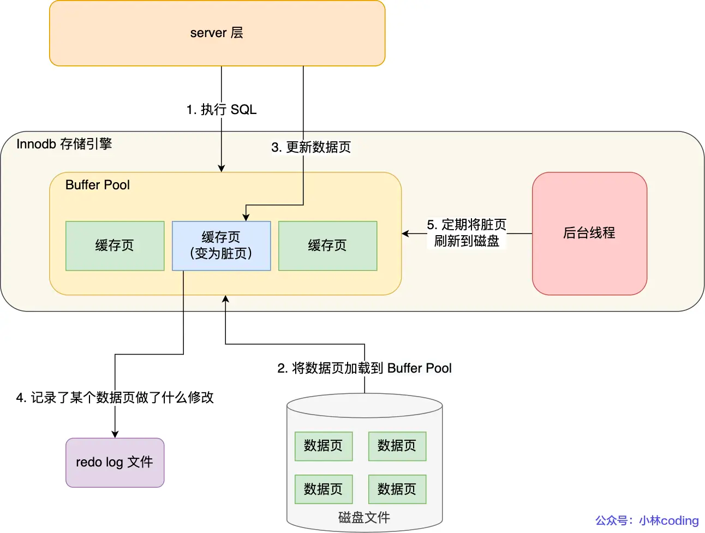

## 4.1 什么是  redo log？

redo log 是[物理日志]，记录了[某个数据页做了什么修改]，比如**对 XXX 表空间中的 YYY 数据页 ZZZ 偏移量的地方做了AAA 
更新**，每当执行一个事务就会产生这样的一条或者多条物理日志。

在事务提交时，只要[先将 redo log 持久化到磁盘即可]，可以不需要等到将缓存在  Buffer Pool  
里的脏页数据持久化到磁盘。

作用：**[确保事务的持久性]**
当系统崩溃时，虽然脏页数据没有持久化，但是 redo log 已经持久化，接着 MySQL 重启后，
可以根据 redo log 的内容，将所有数据恢复到最新的状态。

> 什么时候产生?

事务开始之后就产生redo log，redo log的落盘并不是随着事务的提交才写入的，
而是在事务的执行过程中，便开始写入redo log文件中

> 什么时候释放：

当对应事务的脏页写入到磁盘之后，redo log的使命也就完成了，
重做日志占用的空间就可以重用（被覆盖）。

> 对应的物理文件：

默认情况下，对应的物理文件位于数据库的data目录下的ib_logfile1&ib_logfile2
- innodb_log_group_home_dir 指定日志文件组所在的路径，默认./ ，表示在数据库的数据目录下。
- innodb_log_files_in_group 指定重做日志文件组中文件的数量，默认2
- 关于文件的大小和数量，由以下两个参数配置：
  - innodb_log_file_size 重做日志文件的大小。
  - innodb_mirrored_log_groups 指定了日志镜像文件组的数量，默认1
  
> redo log是什么时候写盘的？

  Innodb_log_buffer的默认大小为8M
1. Master Thread [每秒一次]执行刷新Innodb_log_buffer到重做日志文件
2. 每个事务提交时会将[重做日志刷新到]重做日志文件
3. 当[重做日志缓存可用空间少于一半]时，重做日志缓存被刷新到重做日志文件

> 被修改 Undo 页面，需要记录对应 redo log 吗？

需要的。

开启事务后，InnoDB 层更新记录前，[首先要记录相应的 undo log]，如果是更新操作，
需要把被更新的列的旧值记下来，也就是要生成一条 undo log，undo log 会写入 Buffer Pool 中的 Undo 页面。

不过，**在内存修改该 Undo 页面后，需要记录对应的 redo log**。

## 4.2 redo log 和 undo log 区别在哪？

- redo log 记录了此次事务「**完成后**」的数据状态，记录的是更新**之后**的值；
- undo log 记录了此次事务「**开始前**」的数据状态，记录的是更新**之前**的值；

事务提交之前发生了崩溃，重启后会通过 undo log 回滚事务，
事务提交之后发生了崩溃，重启后会通过 redo log 恢复事务，如下图：

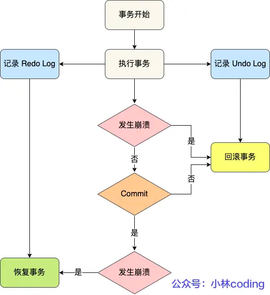

所以有了 redo log，再通过 WAL 技术，InnoDB 就可以保证即使数据库发生异常重启，之前已提交的记录都不会丢失，
这个能力称为 **crash-safe**（崩溃恢复）。可以看出来， **redo log [保证了事务四大特性中的持久性]**。

## 4.3  redo log 要写到磁盘，数据也要写磁盘，为什么要多此一举？

写入 redo log  的方式使用了追加操作， 所以磁盘操作是**顺序写**，而写入数据需要先找到写入位置，
然后才写到磁盘，所以磁盘操作是**随机写**。

磁盘的「顺序写 」比「随机写」 高效的多，因此  redo log 写入磁盘的开销更小。

针对「顺序写」为什么比「随机写」更快这个问题，可以比喻为你有一个本子，按照顺序一页一页写肯定比写一个
字都要找到对应页写快得多。

可以说这是 WAL 技术的另外一个优点：**MySQL 的写操作从磁盘的「随机写」变成了「顺序写」**，
提升语句的执行性能。这是因为 MySQL 的写操作并不是立刻更新到磁盘上，而是先记录在日志上，
然后在合适的时间再更新到磁盘上 。

至此， 针对为什么需要 redo log 这个问题我们有两个答案：

- **实现事务的持久性，让 MySQL 有 crash-safe 的能力**，能够保证 MySQL 在任何时间段突然崩溃，
  重启后之前已提交的记录都不会丢失；
- **将写操作从「随机写」变成了「顺序写」**，提升 MySQL 写入磁盘的性能。

## 4.4  产生的 redo log 是直接写入磁盘的吗？

不是的。

实际上， 执行一个事务的过程中，产生的 redo log 也不是直接写入磁盘的，因为这样会产生大量的 I/O 操作，
而且磁盘的运行速度远慢于内存。

所以，redo log 也有自己的缓存—— **redo log buffer**，每当产生一条 redo log 时，
会先写入到 redo log buffer，后续在持久化到磁盘如下图：

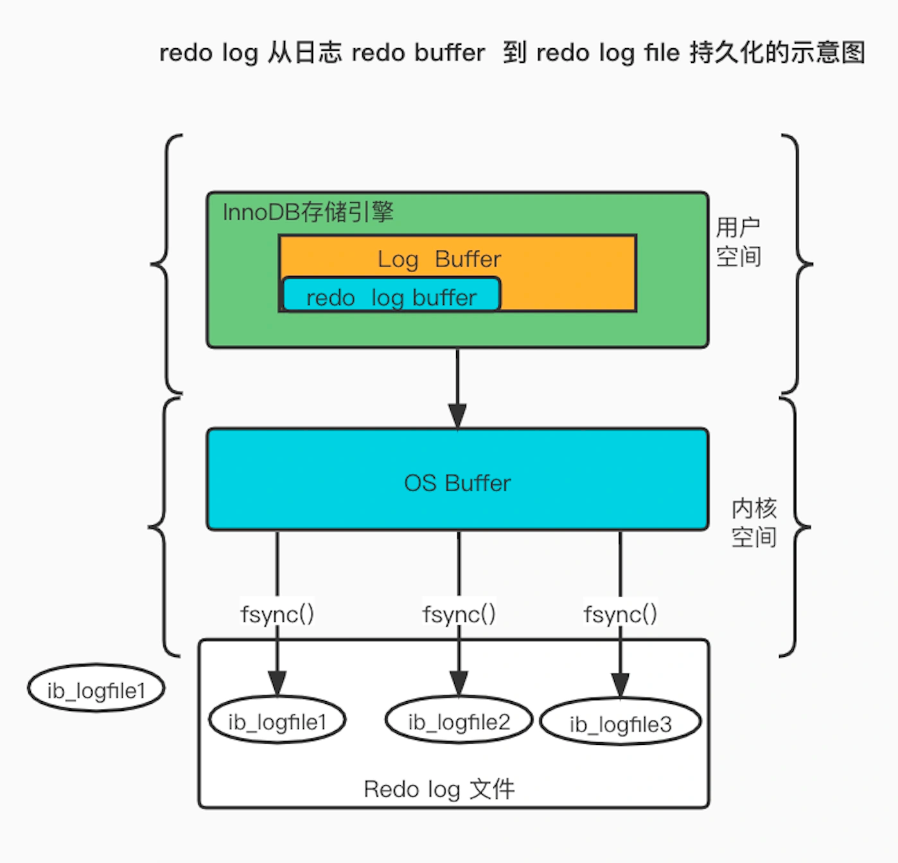

redo log buffer 默认大小 16 MB，可以通过 `innodb_log_Buffer_size` 参数动态的调整大小，
[增大它的大小可以让 MySQL 处理「大事务」是不必写入磁盘]，进而提升写 IO 性能。

## 4.5 redo log 什么时候刷盘？

主要有下面几个时机：

- MySQL 正常关闭时；
- 当 redo log buffer 中记录的[写入量大于 redo log buffer 内存空间的一半]时，会触发落盘；
- [事务日志缓冲区满]：InnoDB 使用一个事务日志缓冲区（transaction log buffer）来暂时存储事务的重做日志条目。当缓冲区满时，会触发日志的刷新，将日志写入磁盘。
- InnoDB [的后台线程每隔 1 秒]，将 redo log buffer 持久化到磁盘。
- 每次[事务提交]时都将缓存在 redo log buffer 里的 redo log 直接持久化到磁盘（这个策略可由 innodb_flush_log_at_trx_commit 参数控制，下面会说）。
- Checkpoint（检查点）：InnoDB 定期会执行检查点操作，将内存中的脏数据（已修改但尚未写入磁盘的数据）刷新到磁盘，并且会将相应的重做日志一同刷新，以确保数据的一致性。

## 4.5 innodb_flush_log_at_trx_commit 参数控制的是什么？

单独执行一个更新语句的时候，InnoDB 引擎会自己启动一个事务，在执行更新语句的过程中，生成的 redo log 
先写入到  redo log buffer 中，然后等事务提交的时候，再将缓存在 redo log buffer 中的 redo log 
按组的方式「顺序写」到磁盘。

上面这种 redo log 刷盘时机是在事务提交的时候，这个默认的行为。

除此之外，InnoDB 还提供了另外两种策略，由参数 `innodb_flush_log_at_trx_commit` 参数控制，
可取的值有：0、1、2，默认值为 1，这三个值分别代表的策略如下：

- 当设置该**参数为 0 时**，表示每次事务提交时 ，还是**将 redo log 留在  redo log buffer 中** ，
   该模式下在[事务提交时不会主动触发写入磁盘]的操作。
- 当设置该**参数为 1 时**，表示每次事务提交时，都**将缓存在  redo log buffer 里的  redo log 
  直接持久化到磁盘**，这样可以保证 MySQL 异常重启之后数据不会丢失。
- 当设置该**参数为 2 时**，表示[每次事务提交时，都只是缓存在  redo log buffer 里的  redo log
  **写到 redo log 文件，注意写入到「 redo log 文件」并不意味着写入到了磁盘]**，
  因为操作系统的文件系统中有个 [Page Cache]（如果你想了解  Page Cache，可以看[这篇](https://xiaolincoding.com/os/6_file_system/pagecache.html) ），Page Cache 是专门用来缓存文件数据的，所以写入「 redo log文件」意味着写入到了操作系统的文件缓存。

画了一个图，方便大家理解：

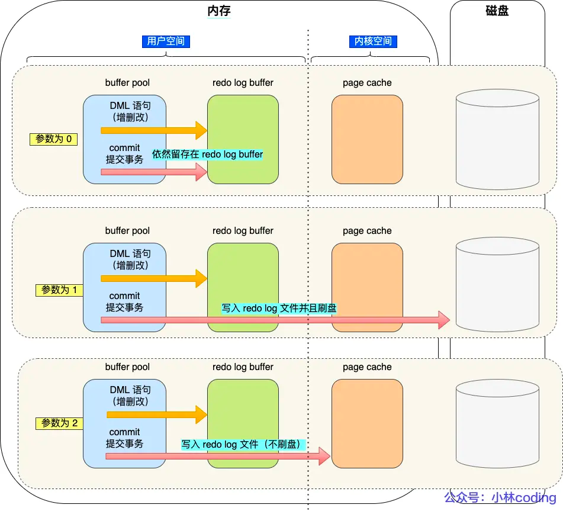

> innodb_flush_log_at_trx_commit 为 0 和 2 的时候，什么时候才将 redo log 写入磁盘？

InnoDB 的后台线程每隔 1 秒：

- 针对参数 0 ：会把缓存在 redo log buffer 中的 redo log ，通过调用 `write()` 写到操作系统的
  Page Cache，然后调用 `fsync()` 持久化到磁盘。**所以参数为 0 的策略，MySQL 进程的崩溃会导致上一秒钟所有事务数据的丢失**;
- 针对参数 2 ：调用 fsync，将缓存在操作系统中 Page Cache 里的 redo log 持久化到磁盘。
  **所以参数为 2 的策略，较取值为 0 情况下更安全，因为 MySQL 进程的崩溃并不会丢失数据，只有在[操作系统崩溃或者系统断电]的情况下，
  上一秒钟所有事务数据才可能丢失**。

加入了后台现线程后，innodb_flush_log_at_trx_commit 的刷盘时机如下图：

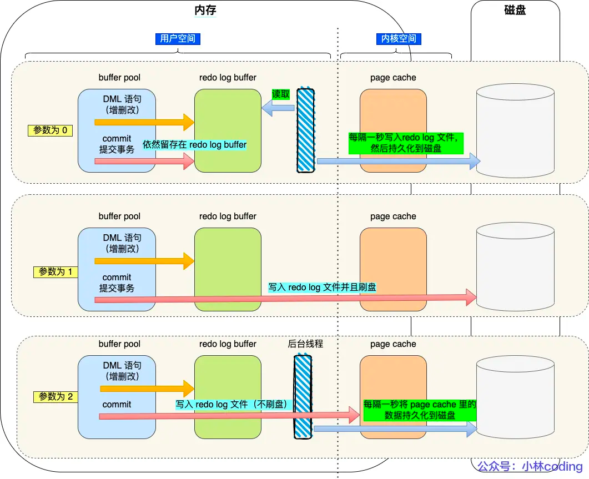

> 这三个参数的应用场景是什么？

这三个参数的数据安全性和写入性能的比较如下：

- 数据安全性：参数 1 > 参数 2 > 参数 0
- 写入性能：参数 0 > 参数 2> 参数 1

所以，数据安全性和写入性能是熊掌不可得兼的，**要不追求数据安全性，牺牲性能；要不追求性能，牺牲数据安全性**。

- 在一些对数据安全性要求比较高的场景中，显然 `innodb_flush_log_at_trx_commit`  参数需要设置为 1。
- 在一些可以容忍数据库崩溃时丢失 1s 数据的场景中，我们可以将该值设置为 0，这样可以明显地减少日志同步到磁盘的 I/O 操作。
- [安全性和性能折中的方案就是参数 2]，虽然参数 2 没有参数 0 的性能高，但是数据安全性方面比参数 0 强，
   因为参数 2 只要操作系统不宕机，即使数据库崩溃了，也不会丢失数据，同时性能方便比参数 1 高。

## 4.6 redo log 文件写满了怎么办？

默认情况下， InnoDB 存储引擎有 1 个重做日志文件组( redo log Group），「重做日志文件组」 可以由多个文件组成

在 MySQL 8.0.30 之前可以通过 innodb_log_files_in_group 和 innodb_log_file_size 配置日志文件组的文件数和文件大小
但在 MySQL 8.0.30 及之后的版本中，这两个变量已被废弃，即使被指定也是用来计算 innodb_redo_log_capacity 的值。而日志文件组的文件数则固定为 32，
文件大小则为 innodb_redo_log_capacity / 32 。


如由有 2 个 redo log 文件组成，这两个  redo  日志的文件名叫 ：`ib_logfile0` 和 `ib_logfile1` 。


在重做日志组中，每个 redo log File 的大小是固定且一致的，假设每个 redo log File 设置的上限是 1 GB，
那么总共就可以记录 2GB 的操作。

重做日志文件组是以**[循环写]**的方式工作的，从头开始写，写到末尾就又回到开头，相当于一个环形。

所以 InnoDB 存储引擎会先写 ib_logfile0 文件，当 ib_logfile0 文件被写满的时候，
会切换至  ib_logfile1 文件，当 ib_logfile1 文件也被写满时，会切换回 ib_logfile0 文件。

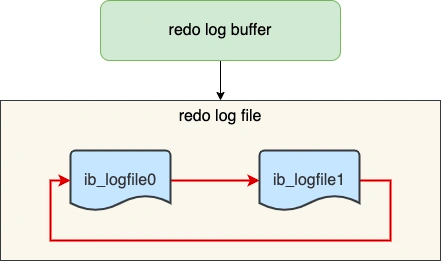

我们知道 redo log 是为了防止 Buffer Pool 中的脏页丢失而设计的，那么如果随着系统运行，
[Buffer Pool 的脏页刷新到了磁盘中，那么 redo log 对应的记录也就没用了，这时候我们擦除这些旧记录]，
以腾出空间记录新的更新操作。

redo log 是循环写的方式，相当于一个环形，InnoDB 用 write pos 表示 redo log 当前记录写到的位置，
用 checkpoint 表示当前要擦除的位置，如下图：

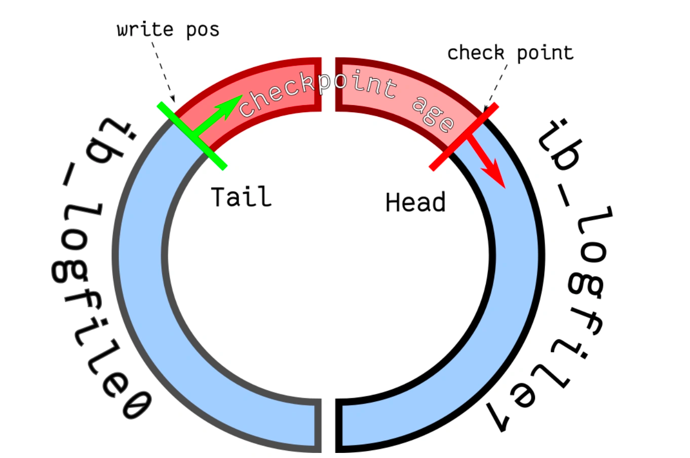

图中的：

- write pos 和 checkpoint 的移动都是顺时针方向；
- write pos ～ checkpoint 之间的部分（图中的红色部分），用来记录新的更新操作；
- check point ～ write pos 之间的部分（图中蓝色部分）：待落盘的脏数据页记录；

如果 write pos  追上了  checkpoint，就意味着 **redo log 文件满了，这时 [MySQL 不能再执行新的更新操作]，
也就是说 MySQL 会被阻塞**（*因此所以针对并发量大的系统，适当设置  redo log 的文件大小非常重要*），
此时**会停下来将 Buffer Pool 中的脏页刷新到磁盘中，然后标记 redo log 哪些记录可以被擦除，
接着对旧的 redo log 记录进行擦除，等擦除完旧记录腾出了空间，checkpoint 就会往后移动（图中顺时针）**，
然后 MySQL 恢复正常运行，继续执行新的更新操作。

所以，一次 checkpoint 的过程就是脏页刷新到磁盘中变成干净页，然后标记 redo log  哪些记录可以被覆盖的过程。

# 5. binlog 

前面介绍的 undo log 和 redo log 这两个日志都是 Innodb 存储引擎生成的。

MySQL 在完成一条更新操作后，Server 层还会生成一条 binlog，等之后事务提交的时候，
会将该事物执行过程中产生的所有 binlog 统一写 入 binlog 文件。

binlog 文件是记录了[所有数据库表结构变更和表数据修改]的日志，不会记录查询类的操作，比如 SELECT 和 SHOW 操作。

> 为什么有了 binlog， 还要有 redo log？

这个问题跟 MySQL 的时间线有关系。

最开始 MySQL 里并没有 InnoDB 引擎，MySQL 自带的引擎是 MyISAM，但是 MyISAM 没有 crash-safe 的能力，
binlog 日志只能用于归档。

而 InnoDB 是另一个公司以插件形式引入 MySQL 的，既然只依靠 binlog 是没有 crash-safe 能力的，
所以 InnoDB 使用  redo log 来实现 crash-safe 能力。

## 5.1 redo log 和 binlog 有什么区别？

这两个日志有四个区别。

*1、适用对象不同：*

- binlog 是 MySQL [的 Server 层实现的日]志，[所有存储引擎都可以使用]；
- redo log 是 Innodb 存储引擎实现的日志；

*2、文件格式不同：*

- binlog 有 3 种格式类型，分别是 STATEMENT（默认格式）、ROW、 MIXED，区别如下：
   - STATEMENT：每一条修改数据的 SQL 都会被记录到 binlog 中（相当于记录了逻辑操作，所以针对这种格式，
     binlog 可以称为逻辑日志），主从复制中 slave 端再根据 SQL 语句重现。但 STATEMENT 有动态函数的问题，
     比如你用了 uuid 或者 now 这些函数，你在主库上执行的结果并不是你在从库执行的结果，
     [这种随时在变的函数会导致复制的数据]不一致；
   - ROW：[记录行数据最终被修改成什么样了]（这种格式的日志，就不能称为逻辑日志了），不会出现 STATEMENT 下动态函数的问题。但 ROW 的缺点是每行数据的变化结果都会被记录，比如执行批量 update 语句，更新多少行数据就会产生多少条记录，使 binlog 文件过大，而在 STATEMENT 格式下只会记录一个 update 语句而已；
   - MIXED：包含了 STATEMENT 和 ROW 模式，它会根据不同的情况自动使用 ROW 模式和 STATEMENT 模式；
- redo log 是物理日志，记录的是在某个数据页做了什么修改，比如对 XXX 表空间中的 YYY 数据页 ZZZ 
   偏移量的地方做了AAA 更新；

*3、写入方式不同：*

- binlog 是追加写，写满一个文件，就创建一个新的文件继续写，不会覆盖以前的日志，保存的是全量的日志。
- redo log 是循环写，日志空间大小是固定，全部写满就从头开始，保存未被刷入磁盘的脏页日志。

*4、用途不同：*

- binlog 用于备份恢复、主从复制；
- redo log 用于掉电等故障恢复。

> 如果不小心整个数据库的数据被删除了，能使用 redo log 文件恢复数据吗？

不可以使用 redo log 文件恢复，只能使用 binlog 文件恢复。

因为 redo log  文件是循环写，是会边写边擦除日志的，只记录未被刷入磁盘的数据的物理日志，
已经刷入磁盘的数据都会从 redo log 文件里擦除。

binlog 文件保存的是全量的日志，也就是保存了所有数据变更的情况，理论上只要记录在 binlog 上的数据，
都可以恢复，所以如果不小心整个数据库的数据被删除了，得用 binlog 文件恢复数据。

## 5.2 主从复制是怎么实现？

MySQL 的主从复制依赖于 binlog ，也就是记录 MySQL 上的所有变化并以二进制形式保存在磁盘上。
复制的过程就是将 binlog 中的数据从主库传输到从库上。

这个过程一般是**异步**的，也就是主库上执行事务操作的线程不会等待复制 binlog 的线程同步完成。


MySQL 集群的主从复制过程梳理成 3 个阶段：

- **写入 Binlog**：主库写 binlog 日志，提交事务，并更新本地存储数据。
- **同步 Binlog**：把 binlog 复制到所有从库上，每个从库把 binlog 写到暂存日志中。
- **回放 Binlog**：回放 binlog，并更新存储引擎中的数据。

具体详细过程如下：

- MySQL 主库在收到客户端提交事务的请求之后，会先写入 binlog，再提交事务，更新存储引擎中的数据，
  事务提交完成后，返回给客户端“操作成功”的响应。
- 从库会创建一个专门的 I/O 线程，连接主库的 log dump 线程，来接收主库的 binlog 日志，再把 binlog 信息写入 
  [relay log 的中继日志]里，再返回给主库“复制成功”的响应。
- 从库会创建一个用于回放 binlog 的线程，去读 relay log 中继日志，然后回放 binlog 更新存储引擎中的数据，
  最终实现[主从的数据一致性]。

在完成主从复制之后，你就可以在写数据时只写主库，在读数据时只读从库，这样即使写请求会锁表或者锁记录,也不会影响读请求的执行。

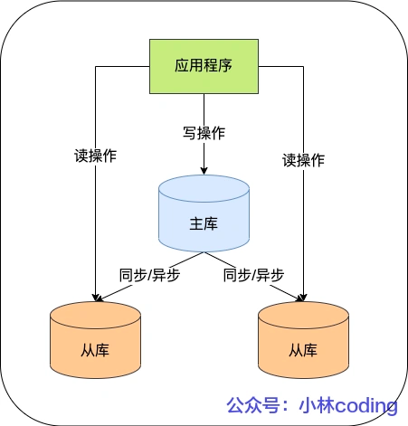

> 从库是不是越多越好？

不是的。

因为从库数量增加，从库连接上来的 I/O 线程也比较多，**主库也要创建同样多的 log dump 线程来处理复制的请求
，对主库资源消耗比较高，同时还[受限于主库的网络带宽]**。

所以在实际使用中，一个主库一般跟 2～3 个从库（1 套数据库，1 主 2 从 1 备主），
这就是一主多从的 MySQL 集群结构。

## 5.3  MySQL 主从复制还有哪些模型？

主要有三种：

- **同步复制**：MySQL 主库提交事务的线程要等待所有从库的复制成功响应，才返回客户端结果。
    这种方式在实际项目中，基本上没法用，原因有两个：一是性能很差，因为要复制到所有节点才返回响应；
    二是可用性也很差，主库和所有从库任何一个数据库出问题，都会影响业务。
- **异步复制**（默认模型）：MySQL 主库提交事务的线程并不会等待 binlog 同步到各从库，就返回客户端结果。
    这种模式一旦主库宕机，[数据就会发生丢失]。
- **半同步复制**：MySQL 5.7 版本之后增加的一种复制方式，介于两者之间,事务线程不用等待所有的从库复制成功响应，
   只要一部分复制成功响应回来就行，比如一主二从的集群，只要数据成功复制到任意一个从库上，
    主库的事务线程就可以返回给客户端。这种**半同步复制的方式，兼顾了异步复制和同步复制的优点，
   即使出现主库宕机，[至少还有一个从库有最新的数据，不存在数据丢失的风险]**。

## 5.4 binlog 什么时候刷盘？

事务执行过程中，先把日志写到 binlog cache（Server 层的 cache），
1. 事务提交的时候，再把 binlog cache 写到 binlog 文件中。

MySQL 给 binlog cache 分配了一片内存，每个线程一个，参数 binlog_cache_size 用于控制单个线程内 
binlog cache 所占内存的大小。
2. [如果超过了这个参数规定的大小]，就要暂存到磁盘。

> 什么时候 binlog cache 会写到 binlog 文件？

在事务提交的时候，执行器把 binlog cache 里的完整事务写入到 binlog 文件中，并清空 binlog cache。如下图：

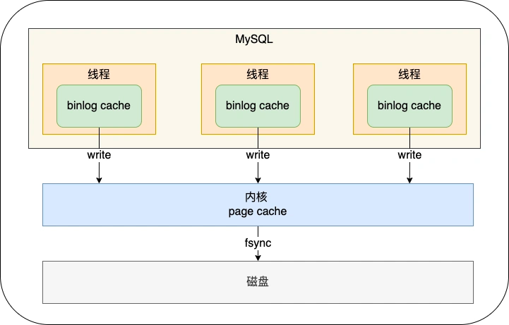

虽然每个线程有自己 binlog cache，但是最终都写到同一个 binlog 文件：

- 图中的 write，指的就是[指把日志写入到 binlog 文件，但是并没有把数据持久化到磁盘]，
   因为数据还缓存在文件系统的 page cache 里，write 的写入速度还是比较快的，因为不涉及磁盘 I/O。
- 图中的 [fsync，才是将数据持久化到磁盘的操作]，这里就会涉及磁盘 I/O，所以频繁的 fsync 会导致磁盘的 I/O 升高。

MySQL提供一个 sync_binlog 参数来控制数据库的 binlog 刷到磁盘上的频率：

- sync_binlog = 0 的时候，表示每次[提交事务都只 write]，不 fsync，
   后续交由操作系统决定何时将数据持久化到磁盘；
- sync_binlog = 1 的时候，表示每次提交事务都会 write，然后马上执行 fsync；
- sync_binlog =N(N>1) 的时候，表示每次提交事务都 write，但累积 N 个事务后才 fsync。

在MySQL中系统默认的设置是 sync_binlog = 0，也就是不做任何强制性的磁盘刷新指令，这时候的性能是最好的，
但是风险也是最大的。因为一旦主机发生异常重启，还没持久化到磁盘的数据就会丢失。

而当 sync_binlog 设置为 1 的时候，是最安全但是性能损耗最大的设置。因为当设置为 1 的时候，
即使主机发生异常重启，最多丢失一个事务的 binlog，而已经持久化到磁盘的数据就不会有影响，
不过就是[对写入性能影响太大]。

如果[能容少量事务的 binlog 日志丢失的]风险，为了提高写入的性能，一般会 sync_binlog 
设置为 100~1000 中的某个数值。


# 6 三个日志讲完了，至此我们可以先小结下，update 语句的执行过程。


当优化器分析出成本最小的执行计划后，执行器就按照执行计划开始进行更新操作。

具体更新一条记录 `UPDATE t_user SET name = 'xiaolin' WHERE id = 1;` 的流程如下:

1. 执行器负责具体执行，会调用存储引擎的接口，通过主键索引树搜索获取 id = 1 这一行记录：
   - 如果 id=1 这一行所在的数据页本来就在 buffer pool 中，就直接返回给执行器更新；
   - 如果记录不在 buffer pool，将数据页从磁盘读入到 buffer pool，返回记录给执行器。
2. 执行器得到聚簇索引记录后，会看一下更新前的记录和更新后的记录是否一样：
   - 如果一样的话就不进行后续更新流程；
   - 如果不一样的话就把更新前的记录和更新后的记录都当作参数传给 InnoDB 层，让 InnoDB 真正的执行更新记录的操作；
3. 开启事务， InnoDB 层更新记录前，首先要记录相应的 undo log，因为这是更新操作，需要把被更新的列的旧值记下来，也就是要生成一条 undo log，undo log 会写入 Buffer Pool 中的 Undo 页面，不过在内存修改该 Undo 页面后，需要记录对应的 redo log。
4. InnoDB 层开始更新记录，会先更新内存（同时标记为脏页），然后将记录写到 redo log 里面，这个时候更新就算完成了。为了减少磁盘I/O，不会立即将脏页写入磁盘，后续由后台线程选择一个合适的时机将脏页写入到磁盘。这就是 **WAL 技术**，MySQL 的写操作并不是立刻写到磁盘上，而是先写 redo 日志，然后在合适的时间再将修改的行数据写到磁盘上。
5. 至此，一条记录更新完了。
6. 在一条更新语句执行完成后，然后开始记录该语句对应的 binlog，此时记录的 binlog 会被保存到 binlog cache，并没有刷新到硬盘上的 binlog 文件，在事务提交时才会统一将该事务运行过程中的所有 binlog 刷新到硬盘。
7. 事务提交，剩下的就是「两阶段提交」的事情了，接下来就讲这个。

# 7. 两阶段提交
两阶段提交用来[保证主从节点在事务提交时保持数据一致性]，redo log 是用来帮助主节点服务崩溃恢复数据的，
binlog 是主从节点同步数据的，[保证redo log 和binlog 日志数据一致]。

## 7.1 如何保证redo log 和binlog的一致性
1. 先写binlog ，再写redo log 
- 当前事务提交后，写binlog 成功，突然发生主节点崩溃，但是binlog 已经同步到从节点，在主节点重启后，
- 由于崩溃之前没有写入redo log，导致不会恢复这条数据。这时候会发现[从节点比主节点多了一条数据]，
- 出现了主从不一致情况。

2. 先写redo log，再写binlog
- 当前事务提交后，写redo log 成功，突然发生主节点崩溃，但是binlog 没有同步到从节点，在主节点重启后，
- 利用redo log 进行恢复。这时候会发现[主节点比从节点多了一条数据]，出现了主从不一致情况。

举个例子，假设 id = 1 这行数据的字段 name 的值原本是 'jay'，然后执行 `UPDATE t_user SET name = 'xiaolin' WHERE id = 1;` 如果在持久化 redo log 和 binlog 两个日志的过程中，出现了半成功状态，那么就有两种情况：

- **如果在将 redo log 刷入到磁盘之后， MySQL 突然宕机了，而 binlog 还没有来得及写入**。MySQL 重启后，
  通过 redo log 能将 Buffer Pool 中 id = 1 这行数据的 name 字段恢复到新值 xiaolin，
  但是 binlog 里面没有记录这条更新语句，在主从架构中，binlog 会被复制到从库，由于 binlog 丢失了这条更新语句，
   从库的这一行 name 字段是旧值 jay，与主库的值不一致性；
- **如果在将 binlog 刷入到磁盘之后， MySQL 突然宕机了，而 redo log 还没有来得及写入**。由于 redo log 
  还没写，崩溃恢复以后这个事务无效，所以 id = 1 这行数据的 name 字段还是旧值 jay，而 binlog 
  里面记录了这条更新语句，在主从架构中，binlog 会被复制到从库，从库执行了这条更新语句，
  那么这一行 name 字段是新值 xiaolin，与主库的值不一致性；

可以看到，在持久化 redo log 和 binlog 这两份日志的时候，[如果出现半成功的状态，就会造成主从环境的数据不一致性]。
这是因为 redo log 影响主库的数据，binlog 影响从库的数据，所以 [redo log 和 binlog 必须保持一致]才能保证主从数据一致。

## 7.2 两阶段提交的实现

**MySQL 为了避免出现两份日志之间的逻辑不一致的问题，使用了「两阶段提交」来解决**，
两阶段提交其实是分布式事务一致性协议，它可以保证多个逻辑操作要不全部成功，要不全部失败，不会出现半成功的状态。

**两阶段提交把单个事务的提交拆分成了 2 个阶段，分别是「准备（Prepare）阶段」和「提交（Commit）阶段」**，
每个阶段都[由协调者（Coordinator）和参与者（Participant）]共同完成。

注意， 不要把提交（Commit）阶段和 commit 语句混淆了，commit 语句执行的时候，会包含提交（Commit）阶段。

### 7.2.1 两阶段提交的过程是怎样的？

在 MySQL 的 InnoDB 存储引擎中，开启 binlog 的情况下，MySQL 会同时维护 binlog 日志与 InnoDB 的 
redo log，为了保证这两个日志的一致性，MySQL 使用了**内部 XA 事务**（是的，也有外部  XA 事务，
跟本文不太相关，我就不介绍了），[内部 XA 事务由 binlog 作为协调者]，存储引擎是参与者。

当客户端执行 commit 语句或者在自动提交的情况下，MySQL 内部开启一个 XA 事务，**分两阶段来完成 XA 事务的提交**，
如下图：

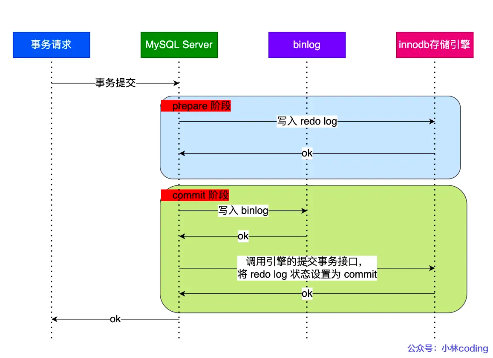

从图中可看出，事务的提交过程有两个阶段，就是**将 redo log 的写入拆成了两个步骤：prepare 和 commit，
中间再穿插写入binlog**，具体如下：

- **prepare 阶段**：将 XID（内部 XA 事务的 ID） 写入到 redo log，同时将 redo log 对应的事务状态设置为
   prepare，然后[将 redo log 刷新到硬盘]；

- **commit 阶段**：把 XID  [写入到 binlog，然后将 binlog 刷新到磁盘，接着调用引擎的提交事务接口]，
  将 [redo log 状态设置为 commit]（将事务设置为 commit 状态后，刷入到磁盘 redo log 文件，
   所以 commit 状态也是会刷盘的）；

### 7.2.2 异常重启会出现什么现象？

我们来看看在两阶段提交的不同时刻，MySQL 异常重启会出现什么现象？下图中有时刻 A 和时刻 B 都有可能发生崩溃：

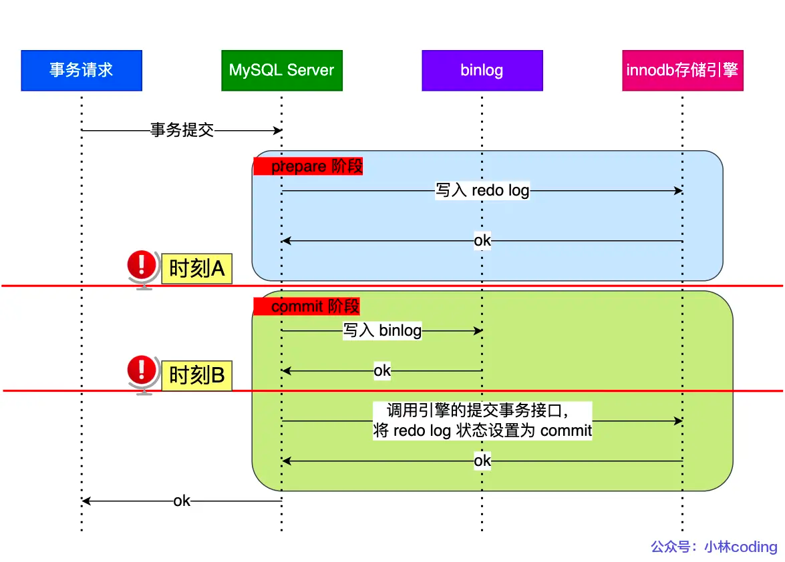

不管是时刻 A（已经 redo log，还没写入 binlog），还是时刻 B （已经写入 redo log 和 binlog，还没写入 commit 标识）崩溃，
**此时的 redo log 都处于 prepare 状态**。

在 MySQL 重启后会按顺序扫描 redo log 文件，碰到处于 prepare 状态的 redo log，就拿着 redo log 中的 XID 
去 binlog 查看是否存在此 XID：

- **如果 binlog 中没有当前内部 XA 事务的 XID，说明 redolog 完成刷盘，但是 binlog 还没有刷盘，则回滚事务**。
  对应时刻 A 崩溃恢复的情况。
- **如果 binlog 中有当前内部 XA 事务的 XID，说明 redolog 和 binlog 都已经完成了刷盘，则提交事务**。
  对应时刻 B 崩溃恢复的情况。

可以看到，**对于处于 prepare 阶段的 redo log，即可以提交事务，也可以回滚事务，
这取决于是否能在 binlog 中查找到与 redo log 相同的  XID**，如果有就提交事务，如果没有就回滚事务。
这样就可以[保证 redo log 和 binlog 这]两份日志的一致性了。

所以说，**两阶段提交是[以 binlog 写成功为事务提交成功的标识]**，因为 binlog 写成功了，
就意味着能在 binlog 中查找到与 redo log 相同的  XID。

### 7.2.3 处于 prepare 阶段的 redo log 加上完整 binlog，重启就提交事务，MySQL 为什么要这么设计?

binlog 已经写入了，之后就会被从库（或者用这个 binlog 恢复出来的库）使用。

所以，在主库上也要提交这个事务。采用这个策略，主库和备库的数据就保证了一致性。

### 7.2.4 事务没提交的时候，redo log 会被持久化到磁盘吗？

会的。

事务执行中间过程的 redo log 也是直接写在 redo log buffer 中的，这些缓存在  redo log buffer  
里的 redo log 也会被「后台线程」每隔一秒一起持久化到磁盘。

也就是说，事务没提交的时候，redo log 也是可能被持久化到磁盘的。

有的同学可能会问，如果 mysql 崩溃了，还没提交事务的 redo log 已经被持久化磁盘了，mysql 重启后，数据不就不一致了？

放心，这种情况 mysql 重启会进行回滚操作，因为事务没提交的时候，binlog 是还没持久化到磁盘的。

所以， [redo log 可以在事务没提交之前持久化到磁盘，但是 binlog 必须在事务提交之后，才可以持久化到磁盘]。


## 7.3 XID如何生成
MySQL 内部维护了一个全局变量 global_query_id，每次执行语句（包括select语句）的时候将它赋值给 Query_id，
然后给这个变量加 1。如果当前语句是这个事务执行的第一条语句，那么 MySQL [还会同时把 Query_id 赋值给这个事务的
Xid]。

InnoDB 进入 Prepare 阶段，写 redo log 时将事务的 xid 写入到 redo 日志中
binlog [都会添加一个 XID_EVENT 作为事务的结束]


## 7.4 两阶段提交有什么问题？

两阶段提交虽然保证了两个日志文件的数据一致性，但是性能很差，主要有两个方面的影响：

- **磁盘 I/O 次数高**：对于“双1”配置，每个事务提交都会进行两次 fsync（刷盘），
    一次是 redo log 刷盘，另一次是 binlog 刷盘。
- **锁竞争激烈**：两阶段提交虽然能够保证「单事务」两个日志的内容一致，但在「多事务」的情况下，
    却不能保证两者的提交顺序一致，因此，在两阶段提交的流程基础上，还需要加一个锁来保证提交的原子性，
    从而[保证多事务的情况下，两个日志的提交顺序]一致。

### 7.4.1 为什么两阶段提交的磁盘 I/O 次数会很高？

binlog 和 redo log 在内存中都对应的缓存空间，binlog 会缓存在 binlog cache，
redo log 会缓存在 redo log buffer，它们持久化到磁盘的时机分别由下面这两个参数控制。
[一般我们为了避免日志丢失的风险，会将这两个参数设置为 1]：

- 当 sync_binlog = 1 的时候，表示每次提交事务都会将  binlog cache 里的 binlog 直接持久到磁盘；
- 当 innodb_flush_log_at_trx_commit = 1 时，表示每次事务提交时，都将缓存在  redo log buffer 里的
   redo log 直接持久化到磁盘；

可以看到，如果 sync_binlog 和 当 innodb_flush_log_at_trx_commit 都设置为 1，
那么在每个事务提交过程中， 都会[至少调用 2 次刷盘操作，一次是 redo log 刷盘，一次是 binlog 落盘]，
所以这[会成为性能瓶颈]。


### 7.4.2 为什么锁竞争激烈？

在早期的 MySQL 版本中，通过使用[ prepare_commit_mutex [锁来保证事务提交的顺序]，在一个事务获取到锁时才能进入 prepare 阶段，一直到 commit 阶段结束才能释放锁，下个事务才可以继续进行 prepare 操作。

通过加锁虽然完美地解决了顺序一致性的问题，但在并发量较大的时候，就会导致对锁的争用，性能不佳。

### 7.4.3 组提交

**MySQL  引入了 binlog 组提交（group commit）机制，当[有多个事务提交的时候，会将多个 binlog 刷盘操作合并成一个，
从而减少磁盘 I/O 的次数]**，如果说 10 个事务依次排队刷盘的时间成本是 10，那么将这 10 个事务一次性一起刷盘
的时间成本则近似于 1。

引入了组提交机制后，prepare 阶段不变，只针对 commit 阶段，将 commit 阶段拆分为三个过程：

- **flush 阶段**：多个事务按进入的顺序将 binlog 从 cache 写入文件（不刷盘）；
- **sync 阶段**：对 binlog 文件做 fsync 操作（多个事务的 binlog 合并一次刷盘）；
- **commit 阶段**：各个事务按顺序做 InnoDB commit 操作；

上面的**每个阶段都有一个队列**，每个阶段有锁进行保护，因此保证了事务写入的顺序，第一个进入队列的事务会成为
leader，leader领导所在队列的所有事务，全权负责整队的操作，完成后通知队内其他事务操作结束。


对每个阶段引入了队列后，锁就只针对每个队列进行保护，不再锁住提交事务的整个过程，可以看的出来，
**锁粒度减小了，这样就使得多个阶段可以并发执行，从而提升效率**。

> 有  binlog 组提交，那有  redo log 组提交吗？

这个要看 MySQL 版本，MySQL 5.6 没有 redo log 组提交，MySQL 5.7 有 redo log 组提交。

在 MySQL 5.6 的组提交逻辑中，每个事务各自执行 prepare 阶段，也就是各自将  redo log 刷盘， 
这样就没办法对 redo log 进行组提交。

所以在 MySQL 5.7 版本中，做了个改进，在 prepare 阶段不再让事务各自执行 redo log 刷盘操作，
而是推迟到组提交的 flush 阶段，也就是说[ prepare 阶段融合在了  flush 阶段]。

这个优化是将 redo log 的刷盘延迟到了 flush 阶段之中，sync 阶段之前。通过[延迟写 redo log 的方式]，
为 redolog 做了一次组写入，这样 binlog 和 redo log 都进行了优化。


#### 7.4.3.1 flush 阶段
接下来介绍每个阶段的过程，注意下面的过程针对的是“双 1” 配置
（sync_binlog 和 innodb_flush_log_at_trx_commit 都配置为 1）。

第一个事务会成为 flush 阶段的 Leader，此时后面到来的事务都是 Follower ：

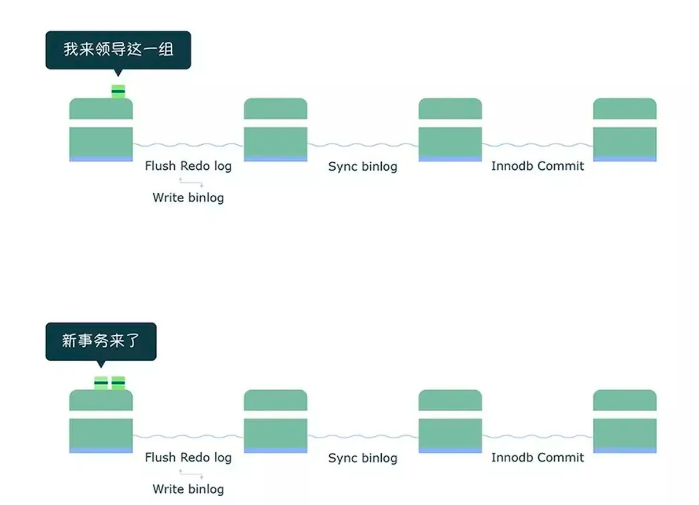

接着，获取队列中的事务组，由绿色事务组的 Leader 对 rodo log 做一次  write + fsync，
即一次将同组事务的 redolog 刷盘：

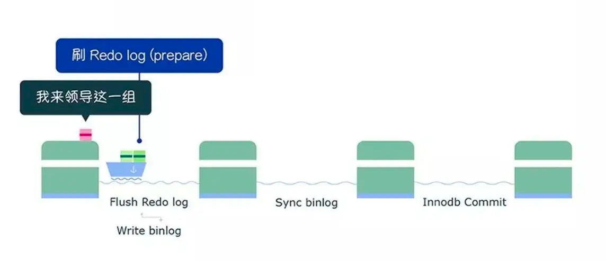

完成了 prepare 阶段后，将绿色这一组事务执行过程中产生的 binlog 写入 binlog 文件（调用 write，
不会调用 fsync，所以不会刷盘，binlog 缓存在操作系统的文件系统中）。

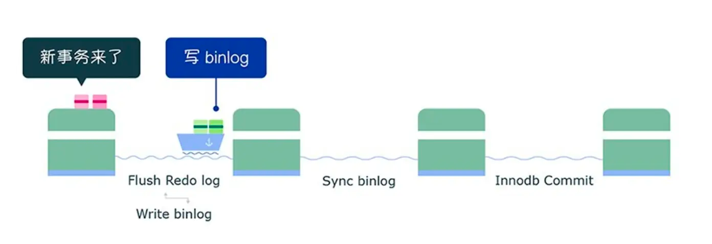

从上面这个过程，可以知道 flush 阶段队列的作用是**[用于支撑 redo log 的组提交]**。

如果在这一步完成后数据库崩溃，由于 binlog 中没有该组事务的记录，所以 MySQL 会在重启后回滚该组事务。

#### 7.4.3.2  sync 阶段

绿色这一组事务的 binlog 写入到 binlog 文件后，并不会马上执行刷盘的操作，而是**会等待一段时间**，
这个等待的时长由 `Binlog_group_commit_sync_delay` 参数控制，**目的是为了组合更多事务的 binlog，
然后再一起刷盘**，如下过程：

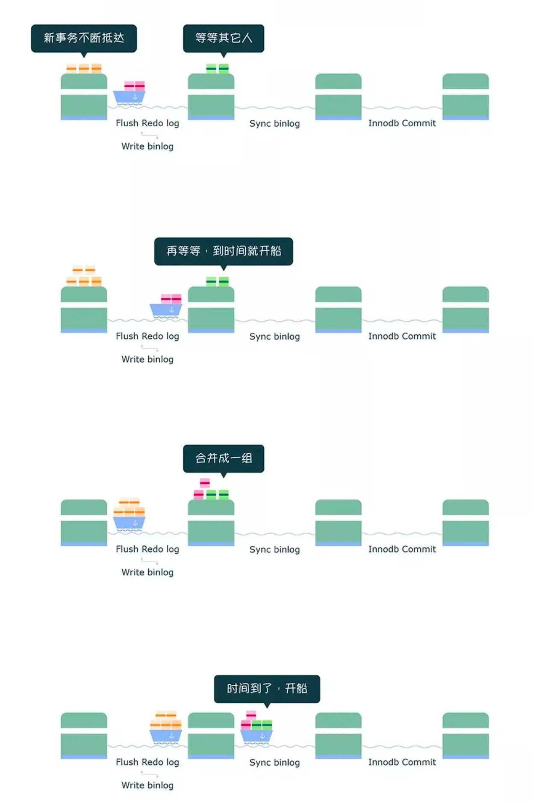

不过，在等待的过程中，如果事务的数量提前达到了 `Binlog_group_commit_sync_no_delay_count` 
参数设置的值，就不用继续等待了，就马上将 binlog 刷盘，如下图：

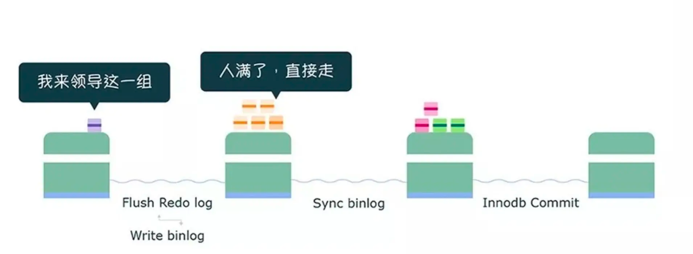

从上面的过程，可以知道 sync 阶段队列的作用是**用于[支持 binlog 的组]提交**。

如果想提升 binlog 组提交的效果，可以通过设置下面这两个参数来实现：

- `binlog_group_commit_sync_delay= N`，表示在等待 N 微妙后，直接调用 fsync，
   将处于文件系统中 page cache 中的 binlog 刷盘，也就是将「 binlog 文件」持久化到磁盘。
- `binlog_group_commit_sync_no_delay_count = N`，表示如果队列中的事务数达到 N 个,就忽视
    binlog_group_commit_sync_delay 的设置，直接调用 fsync，将处于文件系统中 page cache 中的 binlog 刷盘。

如果在这一步完成后数据库崩溃，由于 binlog 中已经有了事务记录，MySQL会在重启后通过 redo log 
刷盘的数据继续进行事务的提交。

#### 7.4.3.3  commit 阶段

最后进入 commit 阶段，调用引擎的提交事务接口，将 redo log 状态设置为 commit。

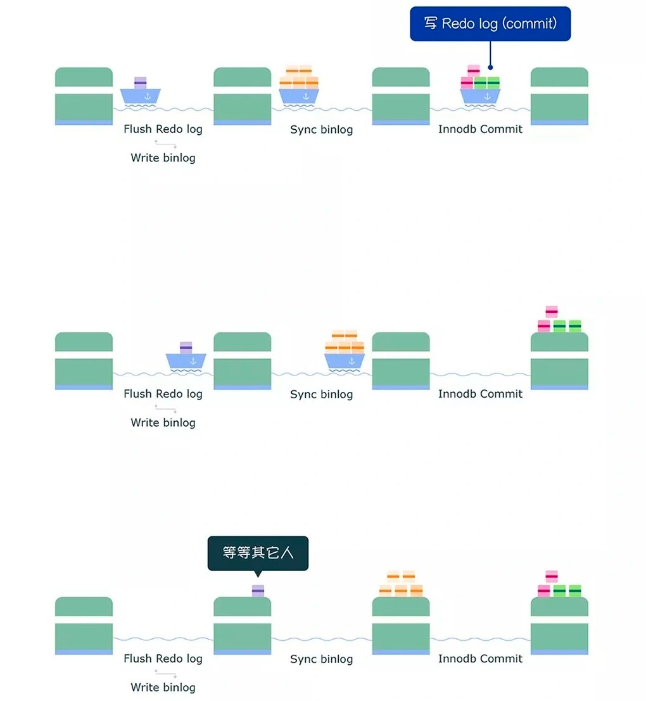

commit 阶段队列的作用是[承接 sync 阶段的事务，完成最后的引擎提交]，使得 sync 可以尽早的处理下一组事务，
最大化组提交的效率。

# 8 MySQL 磁盘 I/O 很高，有什么优化的方法？

现在我们知道事务在提交的时候，需要将 binlog 和 redo log 持久化到磁盘，那么如果出现 MySQL 磁盘 I/O 很高的现象， 
我们可以通过控制以下参数，来 “延迟” binlog 和 redo log 刷盘的时机，从而降低磁盘 I/O 的频率：

- [设置组提交的两个参数]： binlog_group_commit_sync_delay 和 binlog_group_commit_sync_no_delay_count 参数，
   延迟 binlog 刷盘的时机，从而减少 binlog 的刷盘次数。这个方法是基于“额外的故意等待”来实现的，
   因此[可能会增加语句的响应时间]，但即使 MySQL 进程中途挂了，也[没有丢失数据]的风险，
   因为 binlog 早被写入到 page cache 了，只要系统没有宕机，缓存在 page cache 里的 binlog 
   就会被持久化到磁盘。
- [将 sync_binlog 设置为大于 1 的值（比较常见是 100~1000）]，表示每次提交事务都 write，
  但累积 N 个事务后才 fsync，相当于延迟了 binlog 刷盘的时机。
  但是这样做的风险是，[主机掉电时会丢 N 个事务的 binlog 日志]。
- 将 innodb_flush_log_at_trx_commit 设置为 2。表示每次事务提交时，都只是缓存在  redo log buffer 
  里的  redo log 写到 redo log 文件，注意写入到「 redo log 文件」并不意味着写入到了磁盘，
  因为操作系统的文件系统中有个 Page Cache，专门用来缓存文件数据的，所以写入「 redo log文件」
  意味着写入到了操作系统的文件缓存，然后交由操作系统控制持久化到磁盘的时机。但是这样做的风险是，
  [主机掉电的时候会丢数据]。


# 9. error log 错误日志
错误日志记录着mysqld启动和停止,以及服务器在运行过程中发生的错误的相关信息。
在默认情况下，系统记录错误日志的功能是关闭的，错误信息被输出到标准错误输出。

- 指定日志路径两种方法:
  - 编辑my.cnf 写入 log-error=[path]
  - 通过命令参数错误日志 mysqld_safe –user=mysql –log-error=[path] &
- 显示错误日志的命令（如下图所）
  - Show variables like “%err%”

# 10 slow query log 慢日志
慢日志[记录执行时间过长和没有使用索引]的查询语句，报错select、update、delete以及insert语句，
慢日志只会记录执行成功的语句。

设置
- long_query_time：设定慢查询阀值，超出设定值的SQL被记录到慢查询日志，缺省10s
- slow_query_log：指定是否开启慢查询日志
- log_slow_queries：指定是否开启慢查询日志(被slow_query_log取代，做兼容性保留)
- slow_query_log_file ：  指定慢日志文件存放位置，可为空，

系统会给一个缺省文件host_name-slow.log
log_queries_not_using_indexes: 如果值设置为ON，则会记录所有没有利用索引的查询.

1. 查看慢查询时间： 执行时间超过的记录
   - show variables like “long_query_time”;[默认10s]
2. 查看慢查询配置情况：
   - show status like “%slow_queries%”;
3. 查看慢查询日志路径：
   - show variables like “%slow%”;
4. 开启慢日志
   - Set long_query_log=1;
   - show variables like “%long_query_log%”

# 11 general query log
[记录了服务器接收到的每一个查询或是命令，无论这些查询或是命令是否正确甚至是否包含语法错误]，general log 都会将其记录下来 ，记录的格式为
{Time ，Id ，Command，Argument }。
也正因为mysql服务器需要不断地记录日志，开启General log会产生不小的系统开销因此，Mysql默认关闭

- 查看日志的存放方式：
  - show variables like ‘log_output’;
  - 如果设置mysql> set global log_output=’table’ 的话
  - 则日志结果会记录到名为gengera_log的表中，这表的默认引擎都是CSV

如果设置表数据到文件set global log_output=file;
设置general log的日志文件路径：
- set global general_log_file=’/tmp/general.log’;

- 开启general log： set global general_log=on;
- 关闭general log： set global general_log=off;


