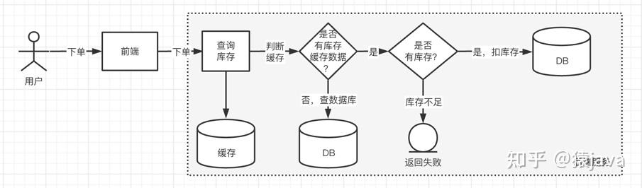

# 如何设计秒杀场景

## 1.1 什么是秒杀

所谓秒杀，就是在同一个时刻有大量的客户端请求争抢同一个商品并完成交易的过程，
瞬时**会产生大量的并发读和并发写**

秒杀系统本质上就是一个满足高并发、高性能和高可用的分布式系统。下面给出一张下单交互概要图：

## 1.2 秒杀系统的特点
### 1.2.1 高性能
秒杀涉及大量的并发读和并发写，因此秒系统必须能支持[高并发]访问，
而且[RT(响应时间)需要在一定的范围内，通常是200ms]

### 1.2.2 一致性
秒杀系统中通常会使用缓存，如何保证[缓存和数据库中库存数据的一致性]，保证商品库存的准确性

### 1.2.3 高可用
秒杀系统会在瞬间收到大量的读写操作，如何能[保证服务能稳定的运行]，
设计系统时是否考虑到[系统容灾]问题，保证服务的[高可用]

### 1.2.4 可扩展性
当服务达到瓶颈时，如何能实现快速扩容

## 1.3 秒杀系统的前端设计
### 1.3.1 服务的高可用
前端是秒杀的入口，用户首先是到前端界面进行商品浏览，然后加购自己想要的商品进行下单付款操作。
所以，前端服务一定要保证高可用，要不然秒杀的入口都没有了，谈何秒杀。

### 1.3.2 页面静态化
前端数据源动静分离，静态的数据可以放到CDN，前端从CDN获取，动态的数据放到服务器。 
静态数据，比如商品的详情信息，图片等；
动态数据，商品的数量，价格等。 比如：可以通过Url地址作为key来存储静态数据

### 1.3.3 控制对服务器请求的频率

### 1.3.4 控制对服务器请求参数的大小

### 1.3.5 限流 降级

## 1.4 秒杀系统的后端设计